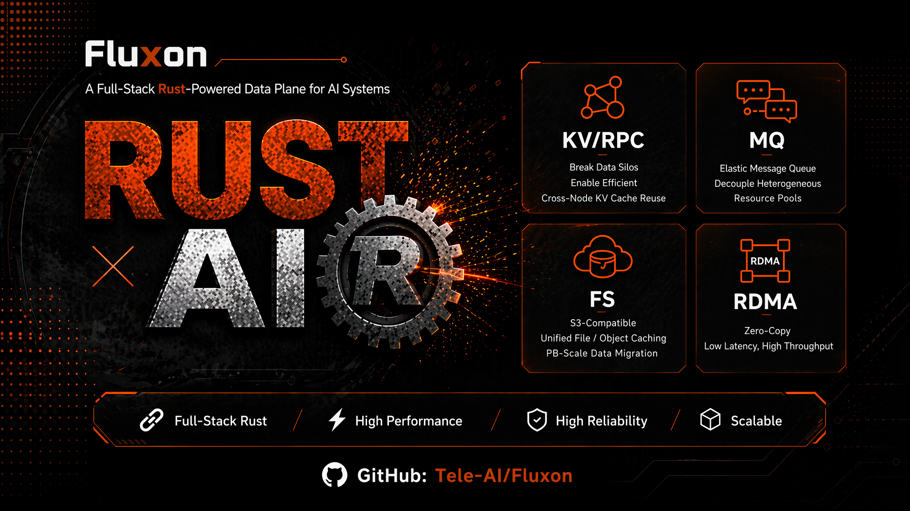

# 为 AI 数据流动而生：Fluxon 分布式键值缓存、RPC、消息队列与文件对象缓存加速层

当 GPU 算力持续提升，AI 系统的瓶颈正在从单点算子扩展到数据面。推理服务需要跨请求、跨进程、跨节点复用 KV Cache、latent cache 和前缀缓存；训练流水线需要在异构资源池之间传递中间态；模型文件、样本数据和 Checkpoint 需要在远端访问、本地缓存和跨集群迁移之间稳定流动。

传统做法往往为这些问题分别引入缓存系统、消息队列、文件系统、对象存储网关和可观测性链路。每套系统都有自己的连接、容量、回收、路由和可观测性逻辑。随着模型规模、并发请求、训练流水线和数据集规模继续增长，数据面开销会持续膨胀，逐渐吞噬 CPU、I/O、内存和运维精力。

Fluxon 是面向 AI 训练与推理数据面的**存传一体分布式系统**。它将分布式键值缓存、RPC、消息队列和兼容 S3 的文件对象缓存加速层汇聚到同一套**数据面加速底座**里，让上述高频数据对象复用统一的缓存、传输、租约、容量治理和可观测性能力。

## 缘起：从 VAE 弹性解耦的阵痛说起

Fluxon 最早的工程动机之一，来自 VAE 解耦异构训练中的跨资源池数据交接。我们希望让 Producer 与 Consumer 分布在不同资源池中独立扩缩容，通过中间态 Payload 完成异步交接，而不是让训练组件被固定通信组重新绑定。

在这个场景里，NCCL 的边界非常清晰。它是固定成员集合内同步集合通信的利器，适合训练进程组内部的高性能通信；但面对动态成员、异步交接、背压、消息保活和跨资源池弹性调度时，固定成员通信模型会把原本希望解耦的训练组件重新耦合在一起。

我们也尝试过将 MooncakeStore 这类面向 KV Cache 的高性能传输与缓存方案用于训练流水线中的大 Payload 搬运。它在特定缓存场景下有明确价值，但直接泛化为通用 AI 训练数据面时，会暴露出新的工程约束：高负载和长稳验证下，底层内存生命周期与传输状态一旦处理不完整，业务侧可能看到进程崩溃或任务中断。当 RDMA 网络发生抖动时，若缺乏向 TCP 等路径自动切换的兜底机制，训练流水线往往难以自愈；此外，若底层异常无法被稳定捕获并向上游透传，Producer / Consumer 容易陷入状态不一致、长时间阻塞或重复排查。

这些经历让我们意识到，AI 数据面不能只追求某一段传输链路的峰值性能。它还必须具备严谨的错误传播、高可用的网络兜底、统一的对象生命周期管理，以及能够支撑业务动态加入退出的资源治理模型。

既然现有方案难以同时覆盖弹性解耦、高性能搬运和故障兜底，Fluxon 选择从数据面加速底座重新设计这条路径。

## 为什么需要统一 AI 数据面

AI 负载里的数据对象正在变得更大、更热、更频繁地跨边界流动。

推理侧的高频缓存不再只是单进程内的临时对象。多副本推理服务、世界模型、多模态模型和长上下文场景下，这些缓存经常需要跨请求、跨进程、跨节点复用。若各实例独立管理缓存的驻留、回收与传输，显存与内存极易因数据冗余与重复驻留而迅速耗尽。

训练侧的数据流也在变复杂。以 VAE 解耦异构训练为代表的跨资源池 Producer / Consumer 交接场景，会让 Producer 和 Consumer 分布在不同机器、不同资源池甚至不同子集群。若中间态 Payload 只能依赖传统 MQ、文件落盘或对象存储跨系统流转，数据链路会被拉长，容量治理也会更难。

存储侧同样如此。高分辨率视频、轨迹样本、模型文件和 Checkpoint 需要同时支持远端访问、本地缓存、S3 转发和跨集群迁移。如果文件对象缓存和 KV 缓存分裂成两套系统，大对象会在多个系统之间反复拆分、复制、落地和重新索引。

Fluxon 关注完整的 AI 数据面生命周期：对象如何分配，放在哪里，怎么跨节点传输，什么时候驱逐，业务进程如何接入，问题发生时又如何定位。

## 为什么“拼图式” AI 数据面走向瓶颈？

传统 AI 数据面常见的拼法是：高频缓存用一套 KV 或自研缓存，中间态交接用 MQ 或对象存储绕一圈，文件数据再接入一套文件系统或对象缓存，可观测性系统单独采集每个组件的状态。

这种方式在早期能快速拼出功能，但系统规模扩大后会暴露几个问题。

第一，局部场景经验难以迁移。MooncakeStore 针对 KV Cache 场景给出了专用设计，将缓存语义和 RDMA 传输绑定在特定路径上。面对更泛化的数据面场景，底层传输和容量治理很难直接平移。

第二，资源统一管控和调度不够彻底。框架级缓存，例如 SGLang 的 L2，保留框架内索引以提供最低延迟访问；外部缓存，例如作为 L3 的 MooncakeStore，则负责跨实例复用。但这两层往往同处单机 CPU 内存，L2 内存难以进入统一索引、放置和驱逐治理，也会增加缓存穿越和对象交接开销。

第三，本机进程间缺少共享内存快路径。以 MooncakeStore 作为 L3 接入为例，数据通路通常按 RDMA / TCP 组织，适合跨节点池化和远程预取。但若同机 worker 或 Producer / Consumer 无法直接接入共享内存数据面，对象交接仍会绕行网络传输协议栈。

第四，缺少动态弹性的 AI Infra 通信平面。NCCL 等集合通信库是固定成员集合内同步通信的利器；以 VAE 解耦异构训练为例，跨资源池 Producer / Consumer 交接需要动态成员、异步交接、背压、消息保活和大 Payload 放置。固定成员通信模型会重新耦合训练组件，并放大连接和故障恢复复杂度。

第五，业务进程和数据面资源治理耦合。业务进程动态启动、退出、扩缩容或异常时，如果它同时承担容量贡献、对象生命周期和跨节点连接，数据面容量和连接拓扑都会跟着业务生命周期波动，影响缓存复用、故障恢复和运维判断。

第六，对象生命周期难以统一收口。缓存、消息和文件对象访问各自维护引用、租约、驱逐、路由和回收状态时，团队很难在一个地方判断对象是否仍被消费、何时可以释放、何时需要迁移或重建索引。组件越多，状态越容易散在业务框架、缓存层和传输层之间。

第七，可观测性（Observability）链路割裂。缓存命中、Owner 队列、传输路径、对象物化和业务进程延迟如果分散在不同系统里，性能问题发生时很难快速定位瓶颈。团队往往只能在多套指标和日志之间拼凑线索，排查成本会随组件数量上升。

Fluxon 的设计就是围绕这些问题展开：将数据面资源、对象生命周期、跨节点传输和业务接入分别抽象，再纳入数据面加速底座统一治理。

## Fluxon 的方案

Fluxon 基于存传一体的数据面加速底座，向上提供三类入口：

| 入口 | 面向场景 | 能力定位 |
| --- | --- | --- |
| 分布式键值缓存 / RPC | 推理缓存、状态共享、服务间调用、张量对象复用 | 统一键值读写与节点间 RPC，服务高频状态缓存与张量对象复用 |
| 消息队列 | 跨资源池 Producer / Consumer 中间态交接（例如 VAE 解耦异构训练）、数据处理流水线 | 动态弹性的 AI Infra 通信平面，复用键值缓存数据面承载大 Payload |
| 文件对象缓存加速层 | AI 数据、模型文件、Checkpoint、远端对象访问、S3 转发 | 兼容 S3 的文件对象缓存加速层，并与 KV/MQ 复用数据面加速底座，让张量、消息 Payload 和文件对象进入统一缓存与加速路径 |

三类入口共同复用同一套缓存、传输、租约、容量治理、对象生命周期和可观测性能力。这意味着，上述场景里的高频数据对象都可以在同一套数据面加速底座中获得统一的缓存与加速。各类 AI 负载不需要分别建设多套数据面路径。

在同机资源治理上，Fluxon 更倾向于按真实物理资源组织缓存层级。同机 CPU 内存应优先进入共享内存和统一对象生命周期治理，减少业务框架里人为划分 L2 / L3 带来的额外链路；跨机、跨集群与远端对象访问，才应走分布式传输路径。

这也是 Fluxon 和单点缓存、单点消息队列、单点文件接口最大的区别：Fluxon 的核心是数据面加速底座，API 是这套底座面向不同场景暴露出来的入口。

## 架构分层：明确角色定位

Fluxon 将控制面、数据面资源与业务接入抽象为三类核心角色。这种分层不仅实现了资源治理与业务生命周期的解耦，也为 AI 数据面在大规模集群下的**水平扩展（Scale-out）**扫清拓扑与连接瓶颈。

Master（控制面）统一管控内存分配（Allocation）、对象放置、驱逐、路由和租约。它将关键决策收敛至控制面，确保多进程、多节点场景下对象生命周期的一致性，保障内存的精准回收。

Owner Client（数据面资源提供者）作为常驻节点贡献共享内存池，并承载 Owner 间的跨机通信。业务进程接入本机 Owner，由 Owner 完成跨机传输。这种**本地代理 + 跨机骨干**的结构，避免了业务进程直接互联带来的连接风暴。跨机连接被严格收敛在 Owner 之间，集群规模扩大时，网络拓扑复杂度、路由状态和数据搬运路径都更容易保持可控。

External Client（业务接入层）承载推理服务、MQ Producer / Consumer、FluxonFS、FluxonOps 等动态接入，不贡献集群容量。由于 **External Client 不提供物理容量**，业务侧的频繁启停、异常重启或弹性扩缩容，不会直接引发数据面的容量迁移与 Rebalance 震荡。计算服务的弹性与数据底座的稳定被隔离开，业务层也更容易实现无状态水平扩展。

这三个角色共同构筑了 AI 数据面的底层稳定性与可扩展性：Master 作为决策者收敛全局状态，避免对象放置、路由和回收逻辑散落在业务进程里；Owner Client 作为提供者与承载者固化物理容量和跨机骨干，将跨机连接控制在数据面资源层；External Client 作为接入者承载弹性业务负载，而不扰动底层拓扑。边界一旦厘清，Fluxon 就能在不牺牲单机快路径的前提下，让缓存、消息与文件对象访问真正复用同一套可水平扩展的数据面加速底座。

## 数据通路：本机共享内存、跨节点 P2P 与自动中继

Fluxon 同时覆盖本机对象交接、跨节点对象流动和复杂网络拓扑下的中继转发。

本机路径上，业务进程优先接入 Owner 的共享内存池，通过 SHM / Busy Polling / Epoll UDS 降低对象交接成本。高频数据对象可以减少不必要的复制和重建。

跨节点路径上，Owner 之间通过 P2P 传输数据，按部署选择 RDMA、TCP、QUIC 等路径，并支持跨节点、跨子集群的自动中继转发。当源 Owner 与目标 Owner 不能直接按理想链路互通时，数据面可以经由中继路径继续完成传输。业务进程不需要理解复杂网络拓扑，只需要接入本机 Owner；跨机数据搬运收敛到 Owner 间路径。这样的分层架构减少了业务进程之间的跨机连接扩散，也进一步提高了系统的可扩展性。

这条设计让 Fluxon 可以同时服务单机内多进程复用、集群内跨节点复用和跨集群数据流转。前者关注共享内存和对象交接，后者关注连接收敛、路由自适应和跨机传输。

## 底层引擎：用 Rust 构筑低开销、可控的数据面加速底座

GPU 算力的跃升与集群规模的扩大，让 I/O 与 CPU 逐渐成为 AI 系统里的显性瓶颈。连接处理、协议编解码、高并发传输、共享内存管理和可观测性采集都位于数据面热路径；若这些热路径充斥着解释执行、运行时调度、跨语言边界拷贝以及不受控的内存复制，GPU 侧节省下来的时间很容易被数据面开销吞噬。

Fluxon 将这些关键路径交给 Rust 实现，目标是把并发安全、内存生命周期和系统调用边界纳入更强的工程约束。

- 并发能力：CPU 密集型路径不受 GIL 约束，更容易充分利用多核资源。
- 延迟可控：没有 GC 停顿，减少热路径里的不可预测抖动。
- 长稳安全：用所有权、生命周期和类型系统约束共享内存、连接状态和对象引用。
- 代码可审计：强类型接口和明确状态机让底层数据面更容易被人工和工具审查。

这种系统级底层掌控力，是支撑各类高频数据对象在同一套数据面加速底座上高效、安全流转的基础。对底层数据面来说，这比单纯追求某个接口的峰值性能更重要。

## 统一可观测性（Observability）

Fluxon 的可观测性底座选择了同样由 Rust 构建的 GreptimeDB。这与 Fluxon 的底层哲学高度契合：GreptimeDB 将 Metrics、Logs、Traces 三大可观测性支柱统一收敛于单一引擎，正如 Fluxon 将缓存、消息和文件对象访问统一收敛于同一数据面加速底座。

基于 Prometheus 协议采集指标，结合链路追踪与结构化日志，Fluxon 内置 GUI 直观呈现集群拓扑、成员状态、关键延迟与队列深度。

对数据面系统而言，可观测性不是锦上添花，而是治理能力的延伸。只有当问题能被精准定位到 Owner、External Client、传输路径、队列等待还是对象处理阶段，数据面底座才算真正可治理。统一的可观测性，正是 Fluxon 闭环数据面加速底座的关键一环。

## FluxonKV：分布式键值缓存与 RPC 共用数据面加速底座

Fluxon KV/RPC 面向世界模型推理缓存、状态共享、服务间调用和张量对象复用。在多视角潜在空间预测、状态外推、前缀缓存复用等场景下，它覆盖更通用的 AI 数据面，范围超过单一 KV Cache 场景。

KV 和 RPC 共用同一套参数组织、缓存和通信路径。状态存储、对象复用和服务间调用不需要分别建设两套路径；高频调用和大对象复用可以在同一个角色模型里完成。

读路径上，Fluxon 优先命中本地快路径，并在后台异步推进元数据同步。系统通过热点复用减少多级缓存的重复驻留与内存浪费，并借助批量回收策略将零散的控制面交互收敛为批量操作，削减控制面流量与计算开销，进而提升系统整体吞吐与长稳表现。

对推理系统来说，这意味着各类高频状态缓存、张量对象和服务调用可以进入同一套数据面加速底座，不必在缓存系统和 RPC 系统之间反复转换。

## FluxonMQ：动态弹性的 AI 数据流通信平面

Fluxon MQ 面向跨资源池 Producer / Consumer 中间态交接和数据处理流水线，VAE 解耦异构训练是其中一类典型场景。当 Producer 和 Consumer 分布在不同机器、不同资源池甚至不同子集群时，MQ 负责将消息保活、容量治理和跨集群放置汇聚到统一消息层。

传统 MQ 多基于 TCP 与磁盘日志构建，其设计初衷并非面向大 Tensor Payload，因而缺乏原生的 RDMA 高速数据通路。面对几十 MB 甚至 GB 级中间态时，通用 MQ 很难同时满足低延迟交接、容量治理和高带宽搬运。

NCCL 这类集合通信适合固定成员集合内的同步通信；跨资源池 Producer / Consumer 交接需要动态成员、异步交接、背压、消息保活和大 Payload 放置。MooncakeStore 等优秀的专用缓存系统在 KV Cache 复用上表现卓越，但其核心的缓存驱逐语义，天然难以直接平替 MQ “消息未消费前必须保留”的语义诉求。它们的传输路径也通常依赖部署侧对 RDMA / TCP 的选择，难以承担数据面加速底座里的自动兜底、跨集群中继和弹性交接。

这里的核心设计哲学在于：**控制面做轻**，仅保留消息壳、成员拓扑与 Offset；**数据面做重**，大 Payload 直接复用 KV 数据面进行搬运。这意味着，Fluxon 无需为消息队列另建第二套大对象传输链路。

Producer / Consumer 作为 External Client 动态加入，不改变集群容量。它们可以按业务负载扩缩容，而 Owner 仍然作为常驻数据面资源提供者保持稳定。

`Lease` 把消息保活绑定到消息通道，消费前的数据保留有明确时间边界。跨资源池和跨子集群场景下，Payload 放置可以结合消费侧位置，尽量缩短预取链路。

## FluxonFS：兼容 S3 的文件对象缓存加速层

Fluxon FS 的定位是兼容 S3 的文件对象缓存加速层。它面向 AI 数据、模型文件、Checkpoint、高分辨率视频和轨迹样本，覆盖远端访问、缓存命中、S3 转发和跨集群迁移。

FS 的关键在于复用 `KV/RPC` 的缓存与通信能力。文件被切成 `KeyValue` 片段，进入 Fluxon 的缓存、传输和容量治理路径。这样，文件、对象和 KV 缓存从三套割裂系统收敛为数据面加速底座的不同入口。

对 AI 数据平台来说，这条路径可以降低这些文件数据在远端访问、本地缓存和跨集群迁移之间切换的成本。上层仍然面向文件对象语义，下层则复用统一的数据面能力。

## Benchmark

当前公开 Benchmark 图表覆盖 RPC、KV 和 FS（文件对象缓存加速层）三类路径。以下数据基于特定测试场景生成，重点呈现不同数据路径上的架构收益和性能边界。

注：Benchmark 数据基于特定拓扑与 Payload 规模生成，实际业务收益受网络环境、对象大小及访问模式影响。

### RPC Benchmark

RPC Benchmark 比较 ZeroRPC、Fluxon TCP Thread 和 Fluxon RDMA 在 4 KB echo Payload 下的吞吐与端到端延迟。图中可以看到，Fluxon 的 RPC 路径在 P1 和 P8 面板下都显著降低延迟，并提升聚合吞吐。

这个结果对应服务间调用路径。它说明 RPC 与 KV 共用的参数组织、路由和通信底座可以承载高频小 Payload 调用；实际业务处理函数的端到端耗时还会受到应用逻辑影响。

### KV Benchmark

KV Benchmark 展示 READ_AFFINITY、READ_ZIPF 和 PUT_ONLY 三类场景。读多场景是当前公开结果的优势区间，尤其适合解释本地性、热点对象复用和跨节点对象定位带来的收益。

在纯写 PUT_ONLY 场景下，当前性能约束主要集中在处理中元数据判重路径，而非 Payload 传输本身。这也是后续优化的核心方向之一。

### FS Benchmark（文件对象缓存加速）

FS Benchmark 比较 Fluxon FS 与 Alluxio，覆盖缓存预热条件下的小文件读、大文件读、小文件写和大文件写。图中最突出的区间是大文件写；小文件读也已有优势，大文件读基本接近，小文件写仍有继续优化空间。

这组结果对应文件对象缓存加速层。Fluxon FS 的收益来自复用 KV/RPC 数据面，但小文件写仍会受到上层打开、写入、关闭和提交流程影响。

## 为什么开源

Fluxon 开源的是一套面向 AI 数据面的完整数据面加速底座：Rust 核心实现、Python 接口、分布式键值缓存、RPC、消息队列、兼容 S3 的文件对象缓存加速层、部署工具链、测试栈和 Benchmark 都在同一个项目里组织。

我们希望开发者能直接看到 Fluxon 如何组织控制面、数据面、业务接入、可观测性和测试，并理解这些接口背后的数据面加速底座。AI 基础设施正在从单模型、单服务、单集群走向更复杂的数据流动形态，缓存、消息和文件对象访问都需要重新放回同一条数据面链路里思考。

Fluxon 选择 Apache License 2.0 开源，希望和社区一起推进 AI 推理缓存、异构训练、文件对象缓存、跨节点传输、共享内存、Rust 数据面和可观测性体系的演进。

## 下一步

Fluxon 仍在快速演进。短期内，我们会继续优化 KV Cache 在 SGLang 中的集成。这一部分非常有趣：为了满足 L2 对极低延迟访问的要求，接口层也会出现一些新增能力，让框架内索引、本机共享内存和数据面加速底座之间的协同更加直接。

更长期看，Fluxon 希望成为 AI 系统里的数据面加速底座：让各类 AI 负载的数据对象和跨节点传输收敛到同一条可治理、可观测的路径中。

我们期望算法工程师与模型服务开发者能将更多精力投入模型创新本身，而不是在底层数据流转的重复建设与被动补丁中反复消耗。Fluxon 愿意成为这块数据面加速底座，支撑 AI 时代更复杂、更自由的数据流动。

Fluxon 由中国电信人工智能研究院（TeleAI）AI Infra 团队研发，由中国电信首席科学家李学龙教授带领。Fluxon 已基于 Apache License 2.0 开源，GitHub 仓库地址：https://github.com/Tele-AI/Fluxon。欢迎对 AI 推理缓存、异构训练、Rust 数据面和分布式系统感兴趣的开发者参与。
