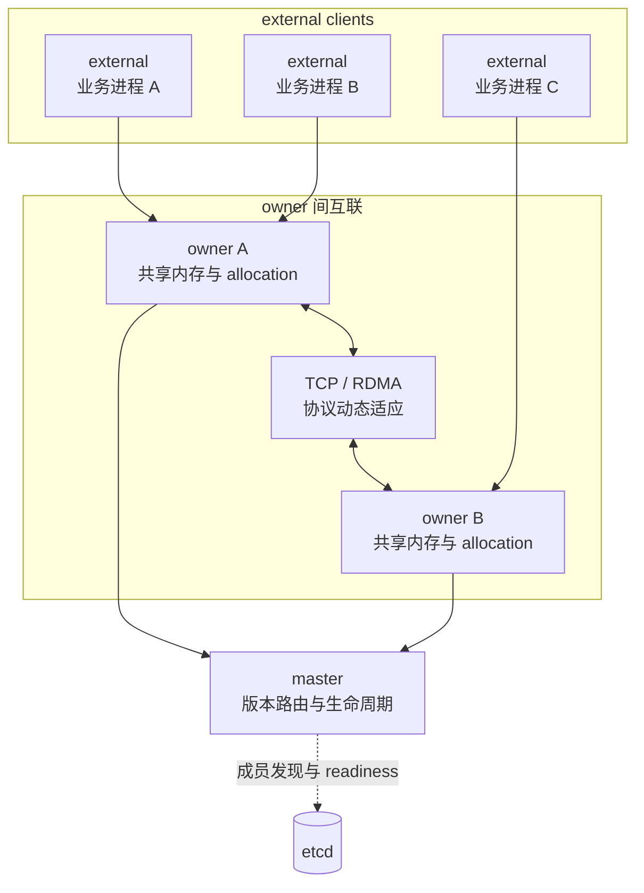
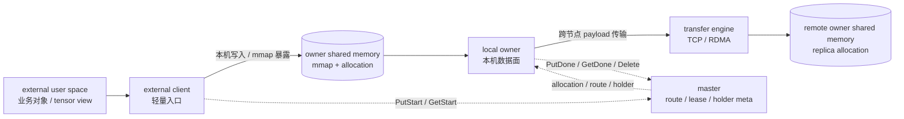
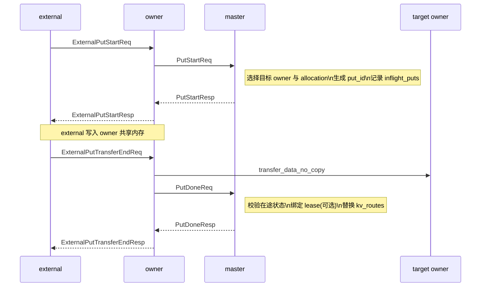
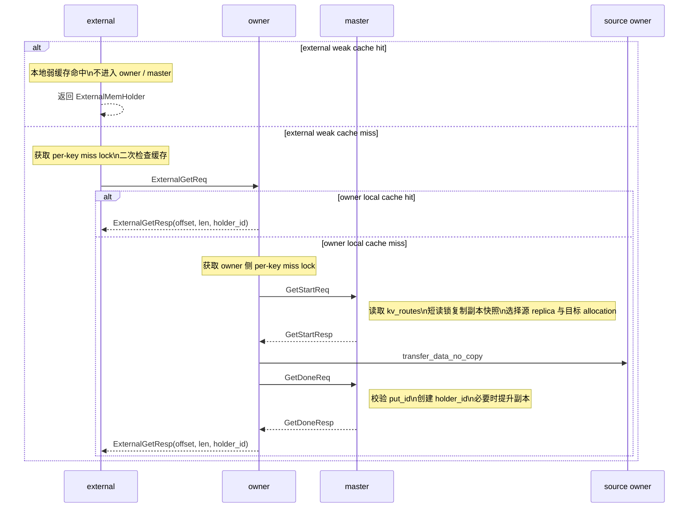
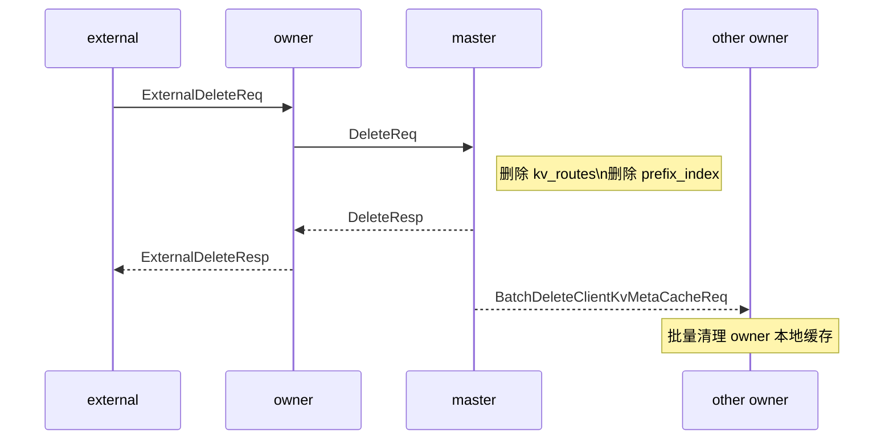
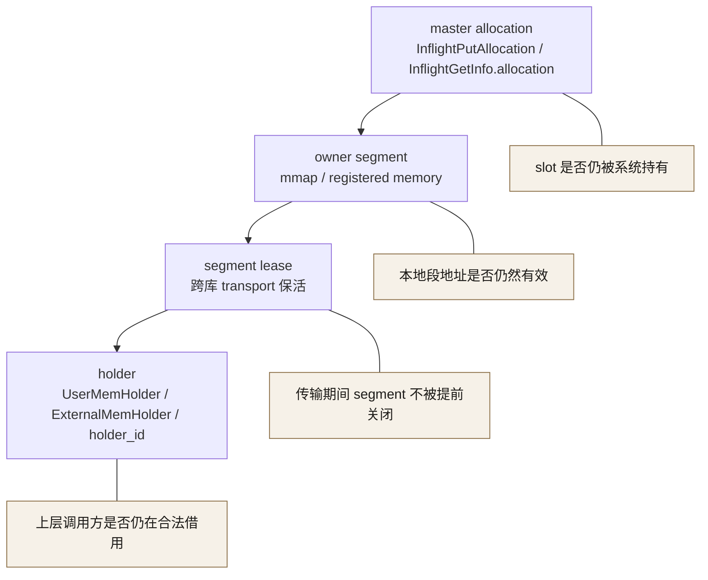
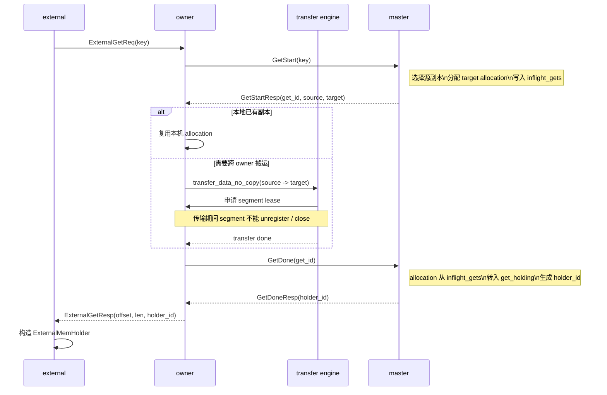
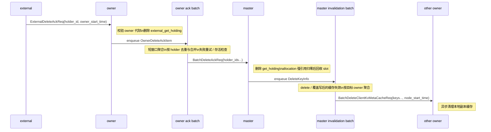

# Fluxon KV 深度解析：面向 AI 数据面的分层架构、通信优化与可扩展设计

## 一、背景：AI 数据面下的 KV 挑战

讨论分布式 KV 系统在 AI 数据面里的演进，先要拆清两个不同的 `KV`：传统系统里的 Key-Value，和 Transformer Attention 里的 Key/Value Cache。这里的 `KV Cache` 指模型推理时由 QKV Attention 产生并在后续 token 中复用的 Key/Value 状态，它和通用 Key-Value 存储不是同一个概念。

Mooncake / `MooncakeStore` 是近几年最有代表性的 `KV Cache` 场景分布式 KV 系统；它以 Kimi 线上服务为背景，证明了长上下文推理里的瓶颈已经不只是 GPU 算子本身，`KV Cache` 池化、放置和传输也会直接决定服务吞吐和 SLO。其论文 [Mooncake: Trading More Storage for Less Computation — A KVCache-centric Architecture for Serving LLM Chatbot](https://www.usenix.org/conference/fast25/presentation/qin) 获得了 `FAST '25` Best Paper。

Fluxon KV 沿着这个方向继续往前推进。Mooncake 从 `KV Cache` 池化、全局调度和 Transfer Engine 视角打开了长上下文推理的数据面问题；Fluxon KV 在类似的大对象复用背景下，把问题继续推到 Python 多进程 AI 服务的工程底座里。

实际尝试使用一些开源方案时，我们依旧遇到很多问题：Python worker 崩溃时，共享内存和本机数据面容易被一起拖下水，甚至出现 core dump、状态机无法复位等正确性和稳定性问题；底层 native 组件或通信层异常时，业务进程、缓存上下文和跨节点连接会相互干扰；每个业务进程都参与全量 P2P 时，节点数和 worker 数一上来，连接拓扑很快膨胀；通信层如果不能同时支持 TCP 和 RDMA，并在 RDMA 不稳定时稳定兜底，长稳运行就很难；RDMA 如果只耦合在数据面传输里，控制面 RPC 仍然吃不到同一套低延迟通信能力；系统重启后，成员发现、路由、缓存失效和本机资源也需要能自恢复收敛。

### 1. 现有 KV / KV Cache 路径在 AI 场景的缺口

在传统业务系统里，Redis 这类远端 KV 已经把业务进程和存储服务拆开了，但它的主路径基本是 TCP 网络通信：写入一个 `key`，读取一段 value，再配上过期时间和容量上限。这个模型适合高并发小对象访问，但没有为同机多进程共享 MB 级 tensor 对象提供共享内存快路径。

`MooncakeStore` 这类面向 `KV Cache` 的系统进一步证明了大对象缓存池化的价值，重点展示了多机缓存池化和跨机复用带来的收益。把视角放到 Python 多进程 AI 服务和更通用的数据面时，工程架构上仍有更细粒度的优化空间：

- **同机快路径不足**：Redis 这类远端 KV 天然走网络路径，`MooncakeStore` 这类外部缓存路径也更偏跨机复用；当同一台机器上的多个 Python worker 读取同一个 MB 级对象时，如果缺少共享内存和 mmap 级别的本机交接，对象仍可能在多个进程地址空间里反复 materialize。
- **业务进程和数据面生命周期耦合**：如果共享内存管理、传输状态或缓存副本直接绑在 Python worker 生命周期上，worker 异常退出、滚动升级或弹性扩缩容都会扰动底层数据面。例如一次 segment 生命周期错误、非法内存访问或 native 组件崩溃，可能同时影响业务请求、缓存上下文和本机数据面资源。
- **连接扩散**：每个业务进程如果都直接参与跨节点互联，进程数上升会直接放大连接拓扑。例如同一台机器上启动 8 个推理 worker，如果每个 worker 都和远端节点建连接，跨机连接数会按 worker 数膨胀；扩缩容、滚动升级或异常重启时，控制面也要处理更多成员变更和连接抖动。
- **资源治理割裂**：框架级缓存和外部缓存经常同处单机 CPU 内存，但它们通常是两个分离实现的系统，各自为了隔离复杂度维护独立的索引、放置和驱逐逻辑。例如 `SGLang` 的 `L2` 保留框架内索引以提供最低延迟访问，作为 `L3` 的 `MooncakeStore` 负责跨机复用；两者没有天然互通的资源视图，`L2` 内存也难以进入统一索引、放置和驱逐治理，进而增加缓存穿越、对象交接开销和冗余驻留带来的内存浪费。
- **缓存重复驻留**：每个业务进程如果都维护自己的本地副本，热点对象会在同机内反复驻留。例如 `MooncakeStore` 这类外部缓存路径缺少本机共享内存快路径时，同一台机器上的多个 worker 多次 `get` 同一个对象，数据可能被 materialize 到多个进程各自的地址空间里。这个复制和重复驻留开销来自本机进程间共享能力不足，业务语义本身并不要求付出这部分成本。

### 2. AI workload 的数据面特征

这些问题在 AI workload 里集中爆发。对象形态和运行方式已经变了，传统小对象 KV 的直觉很容易失灵。

- **对象大**：常见形态包括 `KV Cache`、latent cache、中间态 tensor、消息 payload 和文件切片。控制面不该直接搬这些 payload，也不该让它们在多个进程或多套缓存层级里反复复制。
- **对象热**：同一个 `key` 可能被大量并发请求读取。cache miss 需要合并，副本扩散需要受控，否则热点读取很容易打成远程回源风暴。
- **单机业务进程数受 GPU 卡数约束**：AI 服务里的 worker 经常独占单卡或多卡，单机业务进程数通常不会无限扩张。但每个进程手里的对象都很重，同机 worker 之间又有复用需求。优化重点会转向让少量高价值进程共享同一套本机数据面对象。
- **跨边界流动**：数据会跨请求、跨进程、跨节点、跨子集群流动。单进程内存对象的模型已经不够用，系统必须显式处理放置、传输和路由。
- **生命周期长短不一**：有些对象只是一次读取的临时结果，有些对象需要被 lease 保活，有些 holder 仍被用户代码持有。系统必须说清楚：谁持有、何时可见、何时释放。
- **Python 多进程是常态**：很多语言栈会优先把并发压在一个进程内，用线程或协程减少切换和内存复制；Python 受 `GIL` 和 native 扩展边界影响，AI 服务为了并行度、隔离性和 GPU worker 编排，经常回到多进程模型。Python worker、Producer / Consumer、推理服务实例都可能频繁启停，数据面容量和跨节点连接不能跟着业务进程数量线性膨胀。

想象一下，如果把这些脏活累活全塞进 Python 业务进程会怎样？每个 worker 都要自己维护路由、建连接、管副本、做回收，还要兜住共享内存和 native 组件的异常。进程数一多，连接拓扑直接膨胀；缓存各管各的，同机内存被重复驻留塞满；缓存层级再一多，CPU 内存又被切成几套难以统一治理的资源池。

这条路走不通。Fluxon KV 的破局思路是把职责切开：业务进程只负责接入，本机常驻 `owner` 负责共享内存、allocation 和跨机传输，`master` 负责全局权威状态。让业务的归业务，数据面的归数据面。

### 3. 核心洞察

> 核心判断很直接：AI 数据面里的 KV 系统，不能只当远端字典看。它必须同时治理大对象、热点回源、跨边界路由、生命周期、同机复用和最终一致性边界。

- **数据特征是不可变、MB 级大对象**：`KV Cache`、latent cache 和中间态 tensor 提交后通常不再原地修改，所以系统可以把控制面元数据和真实 payload 拆开，重复写入也可以在进入大对象传输前尽早收敛。
- **热点读取要先折叠再回源**：同一个 `key` 可能被大量并发请求读取，所以并发读请求需要按 key 合并，已存在的对象需要直接复用，避免热点 miss 打成远程回源风暴。
- **单机 worker 规模有上限，中心化 `master` 可接受**：控制面很重要，要做 allocation 决策和 KV 路由；但它只处理元数据，不搬 payload。AI 数据面里的对象通常是 MB 级，单机 worker 数又受 GPU 卡数约束，一次中心化决策的成本相对 payload 传输可控，也为后续按负载、热度、GPU 拓扑和子集群做放置优化留下入口。
- **角色分层解决生命周期耦合**：`external` 可以随业务进程弹性启停，`owner` 保持共享内存、allocation 和跨机连接常驻，`master` 保留全局版本和生命周期权威。
- **同机复用优先压低重复驻留**：多个 `external` 共享本机 `owner` 的 mmap、allocation 和本地副本缓存，热点对象不需要在每个业务进程里各自 materialize 一份。
- **最终一致性模型适合 KV Cache**：上下文通常是反复读取、持续增长、提交后不可变的大对象，读路径对性能敏感；异步失效、副本提升和批量异步延迟删除，比强同步清理更契合这个访问模型。

后文沿这组判断展开：第二章先说明为什么要拆成 `master / owner / external`，为什么 allocation 决策和 KV 路由可以收敛到中心化 `master`，以及为什么同机共享内存应该收敛到常驻 `owner`；第三章说明不可变大对象如何对应到分段读写、请求合并和本地复用；第四章先把 `Allocation / Segment / Holder` 生命周期链路讲清楚；第五章说明最终一致性、异步失效和延迟删除如何进入特化策略接口；第六章给出项目入口和近期推理路径演进。

---

## 二、架构破局：Master-Owner-External 三层分离

生命周期解耦、中心化控制面和同机复用这几条判断，都指向同一个架构动作：把 `master / owner / external` 拆开。`external` 只做业务接入，`owner` 常驻承载本机共享内存和跨机连接，`master` 保留全局版本、allocation 决策和生命周期权威。

可以把 Fluxon KV 类比成一个现代物流系统：

- `master` 是全局调度中心，只负责记账、发号、路线规划和生命周期登记，不亲自搬运 payload。
- `owner` 是本地常驻仓库和物流站，持有共享内存、allocation、本地副本缓存和跨节点传输能力，负责对象的实际存取与搬运。
- `external` 是业务方或取件人，可以随请求、worker 或服务实例动态出现，只向本地 `owner` 下单，不自己维护仓库和车队。

### 2.1 架构全景图

先看全局形态。这张图要抓住 payload 和控制面的边界：`master` 只做调度和生命周期登记，真实对象停在 `owner` 数据面。



### 2.2 分层架构：角色边界与职责收口

这里的 `allocation` 指 `owner` 管理的内存分配对象，`holder` 指 `get` 返回后约束对象生命周期的用户可见引用。

如果继续沿用前面的物流类比，可以这样理解：

| 概念 | 物流类比 | 工程含义 |
| --- | --- | --- |
| `master` | 调度中心 | 不碰货，只发“入库单 / 提货单”，记录哪个 `owner` 有哪个 key-version |
| `owner` | 本地仓储和物流站 | 真正管理货架、mmap 内存、本地副本和跨城物流 |
| `external` | 取件人 / 业务方 | Python 业务进程，只拿取件码和本机入口，不掌握仓库钥匙 |
| `allocation` | 货架预留 | 控制面拍板“这块 slot 归这次 put/get 用” |
| `segment lease` | 运输保价单 | 跨库 transport 期间托住本地 segment，避免货还在路上货架先被拆 |
| `holder` | 取件码 | 业务代码持有的借用凭证，释放前对象不能被系统回收 |

| 角色 | 持有什么 | 不承担什么 | 主要收益 |
| --- | --- | --- | --- |
| **`master`** | `kv_routes`、`inflight_puts`、`inflight_gets`、allocation 预留与回收权威、lease 绑定、holder 生命周期、delete 广播入口 | 业务 payload bytes | 放置、allocation、版本、lease 和生命周期决策有单一权威入口 |
| **`owner`** | 共享内存 segment、mmap、allocation、本地副本缓存、owner 侧 holder | 业务进程私有状态 | 本机共享内存和副本缓存常驻，业务进程重启不会直接扰动本机数据面容量 |
| **`external`** | 业务入口、本地弱缓存、pending put 上下文、external holder | 集群容量贡献、owner-owner 互联 | Python 业务进程可以轻量接入和弹性扩缩容 |

这套角色分层先解决三个归属问题：allocation 决策归 `master`，本机共享内存和副本缓存归 `owner`，业务入口和用户可见 holder 归 `external`。落到实现上，有几个直接的技术点：

- **allocation 决策和 KV 路由中心化，内存承载在 `owner`**：`master` 在 `PutStart` / `GetStart` 里一次控制面 `RTT` 同时完成目标 `owner` 选择、allocation 预留和当前 KV 路由更新，避免请求方先用一致性哈希定位节点、再远端试分配、失败后重试的多轮交互。AI 数据面里的对象通常是 MB 级大对象，一次中心化调度的控制面成本相对 payload 搬运成本更可控；保留中心化调度入口，也为后续按负载、热度、拓扑、GPU 位置或子集群做更复杂的放置优化留下空间。`owner` 承载真实的共享内存 segment、mmap 和本地副本缓存，同机多个 `external` 通过同一套 owner 本机对象访问热点数据。
- **payload 不经过 `master`**：`master` 只做控制面决策，传输发生在 `owner` 和 transfer engine 路径上。
- **共享内存由 `owner` 承载**：同机 `external` 复用 `owner` 的 mmap，不需要每个业务进程各自维护一份数据面对象，从而提升同机热点对象的缓存命中率，并让命中路径接近内存级访问性能。

### 2.3 通信平面

通信优化和前面的三层切分是相辅相成的。`master / owner / external` 先把跨机互联和数据面常驻资源收敛到 `owner`，减少业务进程直接参与的通信面；通信平面再负责让这些角色完成成员发现、协议选择和连接维护。Fluxon 用 `etcd` 存储成员元数据，让拓扑发现、协议选择和连接状态从业务进程里拆出来。`master`、`owner`、`external` 都通过 `ClusterManager` 注册成员信息，元数据里包含角色、`local_ipc_root`、`shared_storage_node_id`、`rdma_control` 等字段。

这部分有几个值得展开的技术点：

- **用成员元数据驱动连接规划**：每个 member 都能从 `etcd` 观察当前成员集合和关键元数据，形成一份可用于连接规划的拓扑快照。成员表里记录角色、本机 IPC 根目录、共享存储绑定关系和 RDMA 控制面配置，让通信层可以基于同一份元数据决定本机 IPC、跨机 TCP / RDMA，或 relay / forwarding。
- **把跨机连接收敛到 `owner`**：`external` 只附着到本机 `owner`，不参与 owner-owner 网状互联。跨节点连接主要发生在 `owner` 之间，业务进程从 1 个扩到 8 个时，不会把跨机连接和远端路由状态同步放大 8 倍。
- **同机入口走共享内存和 `iceoryx2`**：`external` 启动时 attach 到 `owner` 发布的共享内存 bundle，value payload 本体主要通过 mmap 暴露；控制消息和本机入口走 `iceoryx2`。`iceoryx2` 是面向同机进程间通信的 Rust IPC / shared-memory 通信库，适合把本机控制消息和对象交接留在共享内存路径内，避免同机对象交接绕行跨机传输协议栈。
- **跨机路径复用 `P2pModule + transfer_engine`**：`owner <-> master` 和 `owner <-> owner` 统一走 `fluxon_commu` 的 `P2pModule + transfer_engine`。底层按部署选择 TCP 或 RDMA，并可按成员元数据和直连条件动态调整；RDMA 不只服务 payload 传输，也可以承载控制面 RPC 和数据面传输两类通信路径。能走 busy polling 的路径优先 busy poll，业务进程不需要各自维护一套传输轮询和连接状态。
- **协议切换和中继收敛在通信层**：业务进程只接入本机 `owner`；跨节点直连、协议切换、中继转发都由 `owner` 和 `fluxon_commu` 处理，避免把网络拓扑判断和失败重试逻辑扩散到 Python 业务进程里。

### 2.4 强大的 Rust 生态与并发底座

角色分层和通信平面能保持相对克制的实现复杂度，也依赖 Rust 生态里成熟的高并发基础库。Fluxon 不需要为每个热路径状态手写一套容器和队列，可以把不同类型的并发状态放到合适的现成结构上：

- **`DashMap` / `DashSet`**：用于高并发访问的 peer 表、传输状态、缓存索引和路由类状态，减少全局锁争用。
- **`crossbeam`**：用于线程间 channel、队列和 cache padding 等基础并发结构，支撑 relay worker、传输完成队列和后台任务协作。
- **`moka`**：用于高并发缓存和容量控制，例如 `inflight_puts` / `inflight_gets` 这类在途状态表，以及节点侧副本缓存控制器。它让短生命周期状态和缓存淘汰逻辑不用重新实现一套。
- **`sharded-slab`**：用于 RPC pending call 表。P2P RPC 的 wire `task_id` 直接来自 slab key，包括 generation bits，让 pending call 的分配、查找和释放落在一个并发友好的权威表里。

下面这组结构节选能看到 Fluxon KV 的核心状态形状：慢路径在途状态单独放，稳定路由保存当前 key-version 的副本集合和 lease 绑定，派生索引异步维护。

```rust
#[derive(Clone)]
pub struct InflightPutInfo {
    pub node_id: NodeID,
    pub key: String,
    pub req_node_id: NodeID,
    pub len: u64,
    pub src_target_allocation: Arc<Mutex<Option<InflightPutAllocation>>>,
}

#[derive(Clone)]
pub struct InflightGetInfo {
    pub put_id: PutIDForAKey,
    pub src_node_id: NodeID,
    pub key: String,
    pub req_node_id: NodeID,
    pub len: u64,
    pub allocation: Arc<Allocation>,
    pub route: Arc<OneKvNodesRoutes>,
    pub allocation_mode: GetAllocationMode,
}

pub struct OneKvNodesRoutes {
    pub put_id: PutIDForAKey,
    pub lease_id: Option<u64>,
    pub nodes_replicas: RwLock<HashMap<NodeID, KvRouteInfo>>,
    pub get_durable_slots_used: AtomicU32,
}

pub struct MasterKvRouterInner {
    pub inflight_puts: moka::future::Cache<(String, u64, u32), InflightPutInfo>,
    pub inflight_put_key_counts: Arc<DashMap<String, u32>>,
    pub inflight_gets: moka::future::Cache<u64, InflightGetInfo>,
    pub kv_routes: DashMap<String, Arc<OneKvNodesRoutes>>,
    pub prefix_index: ARwLock<PrefixRadixTree>,
}
```

这段代码对应前面的设计判断：`PutStart / GetStart` 把慢传输挂到 `inflight_*`，`PutDone / GetDone` 再回到 `kv_routes` 提交稳定状态；同 `key` 写入准入用 `inflight_put_key_counts` 收敛，副本集合和 lease 绑定则跟着 key-version 一起存在。

---

## 三、核心链路：读写时序与状态流转

不可变 MB 级大对象和热点读取这两条判断落到读写链路上，就是把 payload 和控制面元数据分开处理。`put` 先登记版本和 allocation，再写入或传输 payload，最后提交稳定路由；`get` 先复用本地命中，真正 miss 才回源并合并并发请求；`delete` 先改变权威可见性，再让缓存失效和回收异步推进。

从内存视角看，一个 MB 级对象的主路径如下。看图时抓住一件事：`master` 管单据，`owner` 管货，transfer engine 管跨节点搬运。



这张图的重点是区分权威元数据和 payload 所在路径：`master` 决定路由、allocation、lease 和 holder，真实大对象留在 `owner` 共享内存与传输引擎路径上。它只描述具体路径，不把局部 mmap 或传输快路径概括成全链路零拷贝。

### 3.1 Put：传输前登记，传输后提交

`put` 的主链路采用分段状态流转：

```text
PutStart -> 数据写入 / 传输 -> PutDone
```

对于 `external` 调用方，真实入口还会多一层本机 `owner` 代理。下图的关键是：大对象传输期间，`master` 持有的是在途状态，不搬 payload，也不长期占住稳定路由。



这条链路确立了三个稳定边界：

1. **`PutStart` 只登记在途状态**：`master` 选择放置目标、分配 `put_id` 并放入 `inflight_puts`。此时稳定路由 `kv_routes` 未更新，避免大对象传输期间长期占住主路由状态。
2. **payload 由 `owner` 数据面搬运**：`external` 先写入本机 `owner` 共享内存，后续由 `owner` 负责本地或跨节点传输。`master` 不搬运业务 bytes。
3. **`PutDone` 才提交稳定版本**：传输完成并回到 `master` 提交后，`kv_routes[key]` 才会替换。如果这是覆盖写，旧版本路由会进入异步 delete 广播管线，后续清理旧副本和客户端缓存。

关于 `put_id` 的设计：

- `put_id` 形状是 `(put_time_ms, put_version)`。
- `put_time_ms` 来自 `master` 处理 `PutStart` 时的毫秒时间。
- `put_version` 是 `master` 侧按 `key` 维护的递增计数。
- 不同 `key` 之间不承诺全局唯一，在在途表里会和 `key` 一起组成 `(key, put_time_ms, put_version)`。

这个设计让并发写入有明确身份。后续 `PutDoneReq` 或 `PutRevokeReq` 必须带着同一个 id 回来，`master` 才能找到对应的在途写入并决定提交或回收。

### 3.2 Get：本地命中优先与远程 miss 合并

`get` 的主链路为：

```text
GetStart -> 数据复用 / 传输 -> GetDone
```

真实读取会优先尝试本地弱缓存或 `owner` 本地副本。图里的 `external weak cache hit` 是本地快路径，只在 `external` 进程内完成；只有 miss 后才进入 `owner` 和 `master`。看图时注意两把 per-key miss lock：它们的目标都是把并发回源压成少量真实请求。



核心结论是：热路径优先本地命中，真正 miss 后才进入 `master`。`external` 和 `owner` 都有 per-key 的 `AMapLock` 进行 miss 折叠。`master` 在 `GetStart` 中短暂读取 `nodes_replicas` 并复制成局部快照，避免长时间持有副本表读锁。

当前 `get` 有三种分配模式：

| 模式 | 触发条件 | 完成后的状态 |
| --- | --- | --- |
| **`ReuseReplica`** | 请求节点已经有该 `key` 副本 | 直接复用本地 allocation，不触发真实传输 |
| **`DurableReplica`** | 请求节点需要新建可复用副本 | `GetDone` 后提升为稳定副本，受并发槽位限制 |
| **`Temporary`** | 只需要服务本次读取 | 返回 holder，但不进入稳定副本集合 |

`DurableReplica` 有额外并发控制：同一 `key` 最多同时保留 2 个 durable get 槽位。这样热点对象可以扩散副本，但不会因为一轮并发 miss 失控地扩张副本数。

### 3.3 Delete：权威路由先删，缓存异步失效

`delete` 的权威动作发生在 `master`，采用“先删路由，后清缓存”的策略：

下图的重点是：`DeleteResp` 不等待所有本地缓存同步清空。权威可见性先变，物理清理走后台聚合。



`delete` 先删除 `kv_routes`，让新的权威读取看不到这个 `key`；客户端弱缓存失效、`owner` 本地缓存清理进入后台管线，后续通过异步批量聚合 RPC 推进，尽可能减少删除对读写热路径的性能扰动。代价是失效传播是异步的：`DeleteResp` 返回时，所有缓存未必都已经同步消失。

如果 `key` 不存在，当前实现返回 `KeyNotFound`，不会把不存在的删除静默当成成功。

---

## 四、Allocation / Segment / Holder 生命周期

拿到一个 `MemHolder`，是不是就等于对象生命周期安全了？还不够。真正要回答的是几个正确性问题：

- `holder` 还在用户代码手里时，底层 slot 会不会被提前回收？
- transport 还在异步读写本地地址时，segment 会不会被 `unregister / close` 掉？
- `ExternalMemHolder` drop 后，release ack 会不会漏掉，导致 master 永远托住 allocation？
- owner / external 退出或重启后，旧代际的 holder ack 会不会误删新代际状态？

Fluxon KV 用三层 authority 来回答这些问题：`master allocation -> owner segment -> holder`。类比到前面的物流系统，`allocation` 是货架预留，`segment lease` 是运输保价单，`holder` 是业务侧取件码。三层分别管不同的不变量，不能互相替代。

下图先给静态关系。看图时抓住三条不变量：`master` 托住 slot，`owner` 托住本地 segment，`holder` 托住用户借用。



`Allocation` 决定哪块 slot 还活着、何时可回收；`owner segment` 和 segment lease 保证 mmap / registered memory 在本机访问和跨库传输期间不会提前失效；`holder` 约束业务代码是否还在合法借用读取结果。正确性边界可以压成一句话：只有 holder 借用、segment transport 和 master allocation 都结束后，这块内存才允许真正回到 allocator。

静态关系之外，更关键的是时序：先占货架，再运输，最后发取件码。`allocation` 先于真实 payload 搬运被控制面托住，`segment lease` 只覆盖传输期间的本地段保活，`holder` 则在 `get_done` 之后才暴露给上层业务。



这条链路里，`holder_id` 不是凭空指向一段地址。它背后先有 `master` 侧托住的 `Allocation`，再有 `owner` 侧真实可访问的 mmap / registered memory，最后才是业务代码拿到的 `ExternalMemHolder` 或 `UserMemHolder`。如果发生跨库传输，`segment lease` 只负责保证传输期间本地 segment 不会被提前卸载；它不替代 `Allocation`，也不把业务值变成可修改对象。

释放链路同样不是一跳完成。正确路径是分层释放：external 先释放对 owner holder 的借用，owner 再在本地 holder 引用归零后向 master ack，master 最后删除 `get_holding` 并释放 allocation 强引用。也就是说，external 不直接改 master 状态；它只能把“我不再借用”告诉绑定 owner。

这里最容易担心的是 ack 会不会漏。当前设计把 release ack 放进 `delete_ack_batch` 这类后台管线，但批量化只改变发送方式，不改变语义：ack item 先入队，队列按 holder / target 做短窗口聚合和去重，随后通过 `BatchDeleteAckReq` 发给 master；master 收到后按 `(client_id, holder_id)` 删除 `get_holding`。重复 ack 可以被视为幂等删除，漏发或目标暂时不可达则留在后台管线重试和存活检查里，不会因为“为了聚合”就直接丢掉 holder release 语义。

节点退出和重启也要单独看。正常退出时，owner 本地 `UserMemHolder` 通过引用计数阻止 `close()` 过早收尾；只要还有用户层 holder 活着，owner 不能把底层生命周期当作已经结束。external 侧的 `ExternalMemHolder` 则带着 owner 的 `node_start_time` 代际。owner 收到 `ExternalDeleteAckReq` 时会校验这个代际，旧 owner 崩溃重启后，即使 `node_id` 复用，旧 holder ack 也不能误删新 owner 代际的状态。对于失效广播，目标也会做存活和代际检查；目标成员已经退出或代际变化时，旧广播不会继续打到错误对象上。硬崩溃这类场景下，已经消失的进程当然不能再发送 drop ack；这里的正确性底线是“不误释放、不误删新代际状态”，后续回收再交给成员失效、lease / delete 和后台清理路径推进。

下图把 release ack 和节点代际放在一起看。重点是：批量聚合负责降 RPC 数量，代际校验负责挡住重启后的误释放，二者一起保证生命周期收尾不会越权。



这里的聚合请求覆盖两类路径：一类是 `owner -> master` 的 holder release ack，另一类是 `master -> owner` 或 `owner -> external` 的缓存失效广播。它们的业务语义不同，但调度骨架相似：先进入队列，再按目标短窗口聚合、去重、检查目标代际是否仍然存活，最后批量发送。这样 `master` 保留 holder 与 allocation 的权威状态，`owner` 承接本机 external 借用关系，释放和失效又不会在热点 key 或大量 holder drop 时放大成细粒度 RPC 风暴。

因此这一节真正想表达的不是“多了几个对象名”，而是几条正确性边界：

| 场景 | 正确性保证 |
| --- | --- |
| 用户还持有 holder | `master.get_holding` 托住 holder -> allocation 映射，owner 本地引用计数阻止过早关闭 |
| transport 还在访问本地地址 | `segment lease` / segment read guard 阻止 segment 提前 `unregister / close` |
| holder release ack 批量发送 | ack 先入队，再聚合、去重、重试和代际存活检查；批量化不改变 release 语义 |
| owner / external 正常退出 | holder 引用归零后才进入 release ack；owner close 不会越过仍存活的用户 holder |
| owner / external 重启或目标不可达 | 请求、ack 和广播目标携带 `node_start_time` 并做存活检查；旧代际 holder 不能误删新代际状态 |
| 成员硬崩溃 | 不依赖已经消失的进程继续发 ack；系统先保证不误释放，后续通过成员失效、lease / delete 和后台清理路径收敛 |

更完整的生命周期拆解见 [KV 设计 4 - Allocation / Segment / Holder 生命周期](https://tele-ai.github.io/Fluxon/cn/design/kv_4_allocation_segment_holder%E7%94%9F%E5%91%BD%E5%91%A8%E6%9C%9F/)。

---

## 五、特化策略接口：并发控制与生命周期治理

最终一致性这条判断落到并发和生命周期上，就是一个很现实的问题：哪些地方必须同步，哪些地方可以晚一点？

Fluxon KV 的回答是：权威可见性要短路径收敛，物理清理和派生索引可以最终一致。也就是接受主路由、派生索引和缓存失效之间的短暂不同步，但把不同步约束在明确边界内。并发设计的核心，是别让慢操作占住共享状态：大对象传输不拖住主状态机，热点读取按 key 合并，删除和回收走后台批处理。

整体并发控制矩阵如下。扫这张表时可以只看一条主线：热路径短，慢路径折叠，清理路径异步化。

| 压力点 | 当前机制 | 结果 |
| --- | --- | --- |
| 大对象传输慢 | `PutStart / PutDone`、`GetStart / GetDone` 分离 | `master` 不在传输期间持有主路由写锁 |
| 同 `key` 并发 miss | `external` 和 `owner` 都有 per-key miss lock | 同 `key` miss 折叠成少量回源请求 |
| 读取副本表被长流程拖住 | `nodes_replicas` 短读锁复制快照 | 源副本选择和分配准备不长期占住共享读锁 |
| 读取时版本被覆盖 | `get_done` 校验在途 `put_id` 与当前 `kv_routes` | 旧快照无法误提升为新版本副本 |
| delete 和覆盖写需要清理旧缓存 | `delete_broadcast` 后台管线 | 提交路径保持短，缓存失效异步推进 |
| lease key 生命周期不同 | `lease_id` 固化到 `OneKvNodesRoutes` | 热路径不需要额外探测 lease manager |

### 5.1 同 key 并发写：轻量级准入控制

`reject_if_inflight_same_key` 解决的是一个具体问题：调用方希望同一 `key` 不要同时出现多个在途写入。这也是 `MooncakeStore` 这类 `KV Cache` 外部缓存路径的默认取舍：同一个 `key` 已经有在途写入时，新的 put 直接 fail-fast，避免同一上下文的大对象被重复传输和重复提交。

开启后，`master` 在 `put_start` 阶段检查 `inflight_put_key_counts`。如果同一 `key` 已经有在途写入，直接返回 `KeyBeingWritten`。未开启时，当前实现允许同 `key` 并发 put，最终以后提交成功的版本替换前一个稳定版本。

这里用轻量计数索引解决准入问题，不给 `key` 加一把覆盖传输全过程的大锁。完整在途上下文仍放在 `inflight_puts`，计数索引只做按 `key` 聚合的准入判断，不阻塞其他 `key`。

### 5.2 Lease 机制：将保活语义绑定到 key-version

`lease_id` 主要是为 Fluxon MQ 的大 payload 保活语义抽出来的能力。Fluxon 最早的工程动机之一，是 `VAE` 解耦异构训练里的跨资源池数据交接：`Producer` 和 `Consumer` 分布在不同资源池中独立扩缩容，通过中间态 `Payload` 完成异步交接。

这个场景对 KV 底座提出了一个明确要求：消息还没有被消费前，payload 必须保留；消费完成或 lease 到期后，系统又要能回收这部分大对象。传统固定成员集合通信更适合训练进程组内部同步通信，难以直接覆盖动态成员、异步交接、背压、消息保活和跨资源池弹性调度。Fluxon MQ 选择让控制面只保留消息壳、成员拓扑与 offset，大 payload 直接复用 KV 数据面搬运；因此 KV 需要提供一条稳定的 lease 绑定路径。

KV 的 `PutOptionalArgs` 当前对 Python 稳定公开的字段主要是：

| 参数 | 稳定语义 |
| --- | --- |
| `lease_id` | 在 `put_done` 时把当前 `key` 版本绑定到指定 lease |
| `reject_if_inflight_same_key` | 在 `put_start` 阶段拒绝同 `key` 已有在途写入的请求 |

`lease_id` 的关键设计是：lease 绑定这次提交出来的 key-version，语义不落到某个模糊的 `key` 全局状态上。这让 MQ 可以把“消息未消费前 payload 必须保留”的语义收敛到 KV 版本路由，而不需要另建一套大对象保活和回收系统。

这个设计落到实现上有几个约束：

- `OneKvNodesRoutes.lease_id` 成为稳定路由对象的一部分。
- 只有显式传入 `lease_id`，该次 put 才是 lease put。
- `lease_id=None` 表示纯非 lease put，不会回退到最近一次 lease。
- lease key 不进入普通 moka 副本缓存，避免被普通缓存淘汰语义间接管理。
- `get` 热路径只读取 `route.lease_id`，不需要再向 lease manager 做额外探测。

Rust 内部还支持 `preferred_sub_cluster`，用于影响 `put_start` 的目标放置。它当前是内部已有能力，主要被 Fluxon MQ 通过 Rust 接口使用，还没有完整暴露成 Python 稳定公开契约。因此本文只把它作为内部实现能力说明，不把它写成普通 Python 用户可依赖的稳定参数。

### 5.3 派生索引与最终一致性

`prefix_index` 是从 `kv_routes` 派生出的前缀索引，当前主要用于 MQ 的容量背压限制。`put_done` 提交后，前缀索引更新可以在后台推进，所以它不承诺 put 时立即可见的强一致性。

这个边界把主路由和派生索引区分开，也避免把 MQ 背压辅助路径误解成 KV 主读取路径。

对 `KV Cache` 这类提交后不可变、读取频繁、随上下文增长而累积的对象，最终一致性的关键价值在于把“可见性决策”和“物理清理”拆开。新版本提交或删除请求先更新权威路由，让后续读请求看到稳定结果；旧副本、客户端弱缓存和 holder release ack 可以进入后台队列，按节点、key 或 holder 聚合后批量异步延迟删除。这样读写提交路径不需要等待所有副本同步清空，也不会因为单个热点上下文的清理放大成大量同步 RPC。

---

## 六、加入 Tele-AI Fluxon 项目

Fluxon 当前开源的是一套面向 AI 数据面的统一底座，包含 `KV/RPC`、`MQ` 和 `FS` 三类接口。`KV/RPC` 侧已经可以通过 Quick Start 体验 `master / owner / external` 的最小链路。

需要说明的是，本文描述的是当前开源仓库里 Fluxon KV 的初版通用架构。最近的工作里，我们在推理路径上继续把最终一致性的边界推到更极致：对本地命中的 `KV Cache`，让内存操作尽可能停留在本机直接路径；针对推理里的特化前缀 `get`，补上批量化和分组对齐接口，让一次请求可以更贴近模型侧的 prefix 访问形态；在 `SGLang` 集成里，进一步把内存操作下沉到 CUDA kernel 消费路径，减少 Python / C++ 中间层对象组织和拷贝开销。在对应的推理集成与测试场景下，这条专用路径已经表现出超过 `HiCache + Mooncake` 组合的端到端推理吞吐和延迟结果。

这套系统还在快速演进。我们开源 Fluxon，是希望邀请更多基础设施开发者一起找问题、提需求、补场景。无论你关心 Rust 高并发、LLM 推理缓存、跨节点大对象传输，还是正在被 Python 多进程和内存治理折磨，都欢迎来仓库里交流。

5 分钟快速体验可以直接跑 `KV Quick Start`：

```bash
docker run --rm -it --network host \
  hanbaoaaa/fluxon_quick_start:0.2.1 \
  --mode kv \
  --etcd-client-port 12379 \
  --master-p2p-port 31000 \
  --panel-port 18080 \
  --greptime-http-port 14000 \
  --kv-http-port 8083
```

进入容器后执行：

```text
put demo:hello world
get demo:hello
del demo:hello
```

更多入口：

- GitHub 仓库：[Tele-AI/Fluxon](https://github.com/Tele-AI/Fluxon)，欢迎 Star、Issue 和 PR
- 中文文档：[Fluxon 中文文档](https://tele-ai.github.io/Fluxon/cn/)
- 用户文档：[Fluxon 用户文档](https://tele-ai.github.io/Fluxon/cn/user_doc/)
- KV 和 RPC 接口：[用户 - 3 - KV/RPC 接口](https://tele-ai.github.io/Fluxon/cn/user_doc/%E7%94%A8%E6%88%B7---3---KV-RPC%E6%8E%A5%E5%8F%A3/)
- 开发者文档：[Fluxon 开发者文档](https://tele-ai.github.io/Fluxon/cn/dev_doc/)
