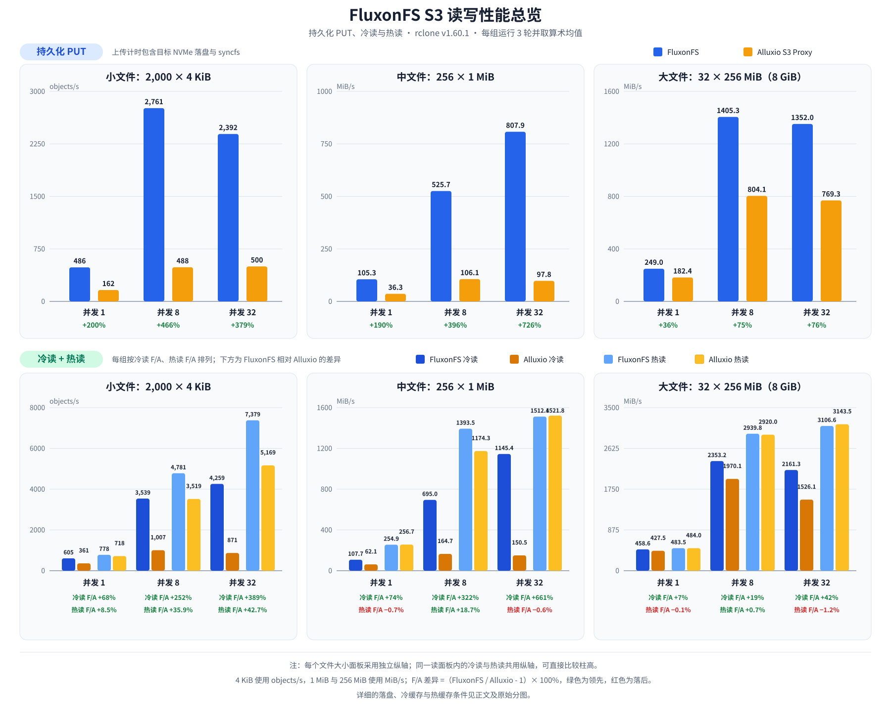
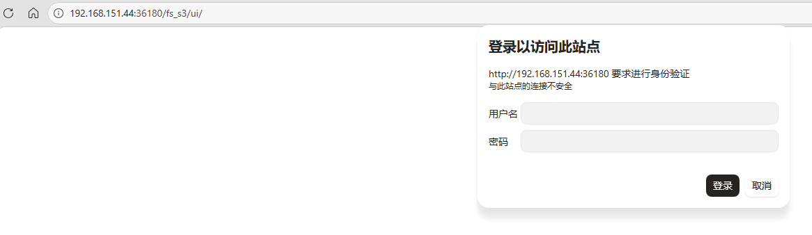
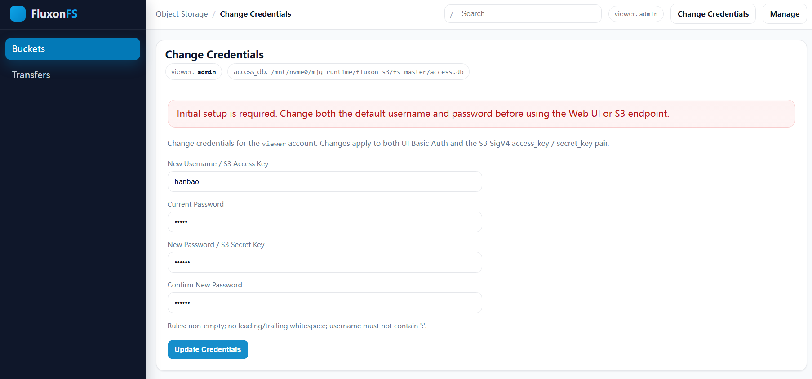
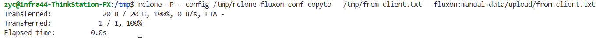
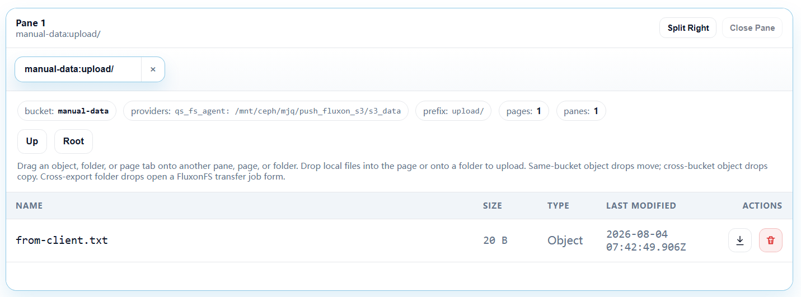

# FluxonFS：将你的本地目录无缝映射为标准 S3 服务

大家在使用一些简单的网络存储组件时可能会面临一个矛盾：**既需要标准 S3 接口兼容现代工具链，又需要数据以普通文件形式存在，以便使用 `ls`、`grep`、`rsync` 等 Linux 工具直接处理。**

**典型场景：**

- **AI 训练与推理**：框架或周边工具通过 `s3://` 加载模型与数据集，工程师用本地工具检查占用或调试配置。
- **日志与备份**：业务程序通过 S3 SDK 写入，运维人员用本地工具排查和分发。
- **轻量开发与个人 NAS**：直接复用现有目录，无需部署独立对象存储；数据可随时通过 `tar` 或 `rsync` 迁移。

**常见方案的局限：**

- **MinIO 等对象存储**：提供 S3 接口，但数据目录由服务自身管理，不适合绕过服务直接读写。
- **HTTP / FTP**：可直接访问文件，但缺少 SigV4 鉴权、Multipart Upload 等 S3 语义。
- **NFS / SMB**：保留文件访问方式，但无法为只支持 S3 的应用提供入口。

## FluxonFS 的解决思路：本地文件系统作为真相源，Fluxon 仅作接口转换和缓存加速

针对上述局限，需要一种既提供标准 S3 接口，又不接管数据管理、仍允许直接操作底层文件的方案。在统一数据访问与缓存加速领域，Alluxio 是这一理念的开创者之一：它证明了通过统一接口层和智能缓存，可以有效解耦上层应用与底层存储。

围绕“协议转换 + 访问加速”，业界长期存在多条技术路径：NFS、SMB 将远程文件系统暴露给本地客户端；s3fs 等 FUSE 工具把远程 S3 bucket 挂载为本地目录；Ceph、JuiceFS 等存储系统通过自身的数据与元数据层提供文件和 S3 等多种访问接口；RustFS 等对象存储则专注于提供高性能的 S3 兼容入口。它们解决的问题相近，但映射方向和权威数据源不同：

| 技术路径 | 典型方案 | 权威数据源 | 主要特点 |
|---|---|---|---|
| 远程文件系统 → 本地文件接口 | NFS、SMB | 远程文件系统 | 提供文件语义，但不能直接满足只支持 S3 的应用 |
| S3 对象存储 → 本地文件接口 | s3fs | S3 对象存储 | 通过 FUSE 模拟文件访问，底层对象存储仍是真相源 |
| 自有存储系统 → 多协议接口 | Ceph、JuiceFS | 系统自身的数据与元数据层 | 同时提供文件和对象入口，但数据由该存储系统管理 |
| 自有对象存储 → S3 接口 | MinIO、RustFS | 对象存储自身 | 提供原生 S3 服务，但不以现有普通目录作为权威数据源 |
| 现有本地目录 → 多协议接口 | Alluxio、FluxonFS | 本地普通文件 | 无需迁移或转换数据，增加多协议入口并复用缓存、共享内存和 RDMA 能力 |

FluxonFS 属于上表第五类：它直接叠加在现有本地目录之上，不要求数据迁移到新的存储格式。**本地文件系统始终是唯一权威数据源（Single Source of Truth）**；FluxonFS 不接管数据管理，只在其上提供多协议访问与缓存加速。本文聚焦其中的标准 S3 接口。

在此基础上，FluxonFS 复用 Fluxon 底层的 KV 缓存、共享内存和 RDMA 数据通路，在保持数据归属不变的同时，加速热点对象和跨节点访问。

FluxonFS 不会接管、封装或隐藏数据，而是直接叠加在现有本地目录之上：

- **接口转换**：处理 SigV4 鉴权、Multipart Upload 等 S3 语义，并将 S3 请求实时转换为对本地文件的 POSIX 读写。
- **权限管控**：基于 S3 协议附加多租户身份认证与访问权限管理，为本地目录增加统一的服务侧安全边界。
- **缓存加速**：利用内置 KV 缓存加速热点数据访问；缓存不参与权威数据管理，可随时丢弃或重建。
- **高性能数据通路**：复用 Fluxon 底层的 RDMA 与共享内存能力；节点内通过共享内存减少数据复制，节点间可通过 RDMA 降低传输开销。

这意味着：

- **对 S3 客户端**：看到的是标准的 `s3://` bucket，可以正常上传、下载和列举对象。
- **对本地用户**：数据始终以普通文件形式保存在磁盘上，可以随时使用 `ls`、`grep`、`rsync` 等 Linux 工具直接操作。

这种设计实现了零数据迁移与双向透明，适合现代 AI 工作流和轻量级运维场景。

## FluxonFS S3 读写性能

下面是在同一台开发机上，使用 `rclone v1.60.1` 对 FluxonFS S3 和 Alluxio S3 Proxy 进行的单机对比。两套服务均重复执行 3 次；共完成 162 个测试案例，文件内容、实际磁盘读写字节和干扰检查全部通过。

- **测试规模**：2,000 × 4 KiB、256 × 1 MiB、32 × 256 MiB（共 8 GiB），并发为 1、8、32，每组运行 3 轮。
- **持久化 PUT**：源文件位于 `/dev/shm`；计时包含上传和目标 NVMe 文件系统的 `syncfs`，不只统计 HTTP 返回时间。
- **冷读**：数据从 NVMe 读取到 `/dev/shm`；每组开始前重启服务并通过 `POSIX_FADV_DONTNEED` 驱逐文件页缓存，FluxonFS 关闭异步缓存回填，Alluxio 使用 `NO_CACHE`。
- **热读**：两套服务的应用层内存缓存上限均设为 64 GiB，实际载入约 8.26 GiB 测试数据。先将数据完整载入 Fluxon KV shared memory 或 Alluxio Worker MEM，并完成一次不计时的 S3 GET；随后仅驱逐底层 NVMe 文件的 Linux 页缓存，不清除上述应用缓存。计时期间要求后端 NVMe 读取量为 0。

图中的柱高为三轮算术均值。4 KiB 小文件使用 `objects/s`，1 MiB 和 256 MiB 文件使用 `MiB/s`；各文件大小面板采用独立纵轴，冷读与热读在同一面板内共用纵轴。

### 持久化 PUT、冷读与热读汇总图



*图注：第一行是持久化 PUT；第二行在同一纵轴内合并冷读和热读。每个并发档位依次排列 FluxonFS 冷读、Alluxio 冷读、FluxonFS 热读、Alluxio 热读；下方百分比中，绿色表示 FluxonFS 领先，红色表示 FluxonFS 落后。*

### 测试结果结论

1. **FluxonFS 在持久化 PUT 与冷读的全部 18 组组合中均快于 Alluxio。** 持久化 PUT 的领先幅度为 36%～726%，冷读的领先幅度为 7%～661%。
2. **小文件和中文件在并发访问下收益最明显。** 4 KiB 冷读在并发 1、8、32 下分别达到 605、3,539 和 4,259 objects/s；1 MiB 冷读在并发 32 下达到 1,145 MiB/s，约为 Alluxio 的 7.6 倍。
3. **大文件冷读更接近底层 NVMe 吞吐上限。** FluxonFS 在并发 1、8、32 下分别领先约 7%、19% 和 42%；优势仍然存在，但不像小文件和中文件那样显著。
4. **热读中，小文件高并发优势最明显，中大文件整体接近。** FluxonFS 的 4 KiB 对象吞吐领先约 8%～43%；1 MiB 在并发 8 时领先约 19%，并发 1 和 32 时与 Alluxio 相差不足 1%；256 MiB 在三种并发下的差异不超过约 1.2%。

## 目录、对象与缓存如何对应

上述设计通过 FluxonFS 的 `export` 模式落地：`export_name` 对应 bucket，导出根目录下的相对路径对应 object key。

| FluxonFS 概念 | S3 概念 | 本地文件系统 | 双向行为 |
|---|---|---|---|
| `export_name` | bucket | 导出目录的对外名称 | 预先声明的 export 作为 bucket 暴露 |
| `remote_root_dir_abs` | bucket 根路径 | 真实文件所在的绝对目录 | 作为权威数据源，读写最终作用于此 |
| `relpath` | object key | 根目录下的相对路径 | S3 写入生成真实文件；本地文件可由 S3 读取 |
| `username` / `password` | Access Key ID / Secret Access Key | FluxonFS 用户凭据 | 用于标准 SigV4 鉴权 |

`serve_s3_single_node` 默认使用以下映射：

```text
export_name = quick-start-export
remote_root_dir_abs = /data

s3://quick-start-export/llama/model.safetensors
                                 ⇅
/data/llama/model.safetensors
```

`quick-start-export` 是固定 bucket 名称，不从目录名推导。现有数据无需导入，本地工具与 S3 客户端直接操作同一批文件。

## 启动：Linux 脚本与 Docker 两种路径

以下两种方式启动同一套服务，将指定目录暴露为 `quick-start-export` bucket。S3 endpoint 为 `http://127.0.0.1:26180/fs_s3`。

### 前置：用 Docker 启动中间件

方式 A 和方式 B 都复用同一组外部中间件：etcd 负责控制面元数据，GreptimeDB 负责监控数据。下面的命令使用 Docker named volume 持久化数据，在 Linux Shell 和 PowerShell 中都可逐行执行：

```bash
docker volume create fluxon-s3-etcd
docker volume create fluxon-s3-greptime
docker run -d --name fluxon-s3-etcd --restart unless-stopped -p 22379:2379 -v fluxon-s3-etcd:/etcd-data quay.io/coreos/etcd:v3.5.0 /usr/local/bin/etcd --data-dir /etcd-data --name etcd0 --listen-client-urls http://0.0.0.0:2379 --advertise-client-urls http://0.0.0.0:2379 --listen-peer-urls http://0.0.0.0:2380 --initial-advertise-peer-urls http://0.0.0.0:2380 --initial-cluster etcd0=http://0.0.0.0:2380 --initial-cluster-state new
docker run -d --name fluxon-s3-greptime --restart unless-stopped -p 24000:4000 -v fluxon-s3-greptime:/greptimedb greptime/greptimedb:v0.15.1 standalone start --data-home /greptimedb --http-addr 0.0.0.0:4000 --rpc-bind-addr 127.0.0.1:4001 --mysql-addr 127.0.0.1:4002 --postgres-addr 127.0.0.1:4003
```

确认两个容器均为 `Up`：

```bash
docker ps --filter name=fluxon-s3-etcd --filter name=fluxon-s3-greptime
```

这两个端口没有配置鉴权，只应在本机或受信网络中开放。已有可用的 etcd 和 GreptimeDB 时，可以跳过本节并替换后文地址。

### 方式 A：Linux（pip）

Linux x86_64 需要 Python 3.10 或更高版本。安装 Fluxon：

```bash
python3 -m pip install --upgrade fluxon-py
```

新建 `serve_s3_single_node.py`：

```python
from fluxon_py.quick_start import serve_s3_single_node

kv_master_config = {
    "etcd_endpoints": ["127.0.0.1:22379"],
    "cluster_name": "fluxon_s3",
    "instance_key": "fluxon_s3_master",
    "network": {
        "tcp_reactor_mode": "event_driven",
    },
    "port": 25100,
    "log_dir": "/path/to/state/kv-master/log",
    "monitoring": {
        "prometheus_base_url": "http://127.0.0.1:24000/v1/prometheus",
        "prom_remote_write_url": ["http://127.0.0.1:24000/v1/prometheus/write"],
        "otlp_log_api": {
            "otlp_endpoint": "http://127.0.0.1:24000/v1/otlp/v1/logs",
            "db_name": "public",
            "table_name": "fluxon_logs",
        },
    },
}

kv_owner_config = {
    "instance_key": "fluxon_s3_owner",
    "network": {
        "tcp_reactor_mode": "event_driven",
    },
    "contribute_to_cluster_pool_size": {"dram": 1073741824, "vram": {}},
    "fluxonkv_spec": {
        "etcd_addresses": ["127.0.0.1:22379"],
        "cluster_name": "fluxon_s3",
        "share_mem_path": "/dev/shm/fluxon-s3",
        "sub_cluster": "default",
        "large_file_paths": ["/path/to/state/kv-owner/large"],
    },
}

serve_s3_single_node(
    "/path/to/data",  # 要暴露为 S3 的本地数据目录
    "/path/to/state",  # Fluxon 持久状态目录
    kv_master_config=kv_master_config,  # KV master 配置
    kv_owner_config=kv_owner_config,  # KV owner 配置
    export_name="quick-start-export",  # S3 bucket 名称
    start_middleware=False,  # 复用外部 etcd 和 GreptimeDB
    greptime_base_url="http://127.0.0.1:24000",  # GreptimeDB 地址
)
```

本文的单机 Quick Start 在 KV master 和 owner 两个进程中都显式使用 `event_driven` 模式，以降低空闲 CPU 占用；Quick Start 内部启动的 zero-contribution external KV client 也默认使用 `event_driven`。owner 和 master 这两类服务器进程在未配置时默认使用 `busy_poll`，以最小化网络事件唤醒和线程调度延迟，但会占用更多 CPU。该选项是进程级配置，master 和 owner 需要分别设置。

运行：

```bash
python3 serve_s3_single_node.py
```

`export_name` 是对外暴露的 bucket 名称。`serve_s3_single_node` 直接使用两份 KV runtime 配置，并复用前置步骤启动的 etcd 和 GreptimeDB。服务在前台运行，按 `Ctrl-C` 停止。

**路径作用：**

- `/path/to/data`：export 权威数据目录。
- `/path/to/state`：Fluxon 持久状态目录，包含 KV 日志、缓存大文件和 `fs_master/access.db`。
- `/dev/shm/fluxon-s3`：KV owner 共享区，可重建；每个实例应使用独立路径并预留足够容量。

### 方式 B：Docker 运行

也可以使用 Docker 启动；Windows 当前必须使用 Docker Desktop 的 Linux 容器。以下命令在 PowerShell 中运行，初始账号 `admin / admin` 仅用于首次设置。

**首次初始化前不要对其他主机开放 `26180` 端口。**

```powershell
docker run -d --name fluxon-s3 `
  --restart unless-stopped `
  -p 26180:26180 `
  --shm-size 2g `
  --add-host=host.docker.internal:host-gateway `
  --mount "type=bind,src=C:\fluxon-s3\data,dst=/data" `
  --mount "type=bind,src=C:\fluxon-s3\state,dst=/state" `
  --entrypoint python3 `
  "hanbaoaaa/fluxon_quick_start:0.2.3" `
  -c "
from fluxon_py.quick_start import serve_s3_single_node

kv_master_config = {
    'etcd_endpoints': ['host.docker.internal:22379'],
    'cluster_name': 'fluxon_s3',
    'instance_key': 'fluxon_s3_master',
    'network': {
        'tcp_reactor_mode': 'event_driven',
    },
    'port': 25100,
    'log_dir': '/state/kv-master/log',
    'monitoring': {
        'prometheus_base_url': 'http://host.docker.internal:24000/v1/prometheus',
        'prom_remote_write_url': ['http://host.docker.internal:24000/v1/prometheus/write'],
        'otlp_log_api': {
            'otlp_endpoint': 'http://host.docker.internal:24000/v1/otlp/v1/logs',
            'db_name': 'public',
            'table_name': 'fluxon_logs',
        },
    },
}

kv_owner_config = {
    'instance_key': 'fluxon_s3_owner',
    'network': {
        'tcp_reactor_mode': 'event_driven',
    },
    'contribute_to_cluster_pool_size': {'dram': 1073741824, 'vram': {}},
    'fluxonkv_spec': {
        'etcd_addresses': ['host.docker.internal:22379'],
        'cluster_name': 'fluxon_s3',
        'share_mem_path': '/dev/shm/fluxon-s3',
        'sub_cluster': 'default',
        'large_file_paths': ['/state/kv-owner/large'],
    },
}

serve_s3_single_node(
    '/data',  # 要暴露为 S3 的容器内数据目录
    '/state',  # 容器内 Fluxon 持久状态目录
    kv_master_config=kv_master_config,  # KV master 配置
    kv_owner_config=kv_owner_config,  # KV owner 配置
    export_name='quick-start-export',  # S3 bucket 名称
    start_middleware=False,  # 复用外部 etcd 和 GreptimeDB
    greptime_base_url='http://host.docker.internal:24000',  # GreptimeDB 地址
)
"
```

将两个 `C:\fluxon-s3\...` 替换为已存在的 Windows 目录：

- `/data`：权威数据目录，映射自宿主机。
- `/state`：持久状态目录，包含 `access.db`；两个 bind mount 均需保留。
- `/dev/shm/fluxon-s3`：KV owner 共享区，可重建；`--shm-size 2g` 为默认 1 GiB DRAM 池预留空间。

以上示例针对 Windows Docker Desktop。Linux 推荐使用方式 A；若改用 Docker，应将 bind mount 换为 Linux 路径，并添加 `--user "$(id -u):$(id -g)"`。同时确保数据与状态目录对该用户可写，否则容器以 root 创建的文件可能无法由宿主机普通用户直接修改。

删除 `/state/fs_master/access.db` 会重置账号初始化状态。Unix 下该文件权限为 `0600`。

### 端点与首次设置

服务启动后提供：

```text
S3 endpoint: http://127.0.0.1:26180/fs_s3
Web UI:      http://127.0.0.1:26180/fs_s3/ui/
bucket:      quick-start-export
```

Docker 后台日志可通过 `docker logs fluxon-s3` 查看。首次用 `admin / admin` 登录 Web UI 后，页面会强制进入 **Change Credentials**：





1. 输入新用户名，它同时是 S3 Access Key ID。
2. 输入与 `admin` 不同的新密码，它同时是 S3 Secret Access Key。
3. 提交后，浏览器可能因缓存了旧 Basic Auth 凭据而再次弹出登录框；此时使用新凭据登录。

改密完成前，S3 请求返回 `AccessDenied`。提交后旧凭据立即失效，状态写入 `access.db`。
凭据更新后等待约 2 秒，让权限状态传播到 FS agent，再使用 S3 客户端。

## 验证本地目录与 S3 的双向映射

以下命令以 `/path/to/data` 为权威数据目录。

### 配置 `rclone` 作为 S3 客户端

改密后创建 `/tmp/rclone-fluxon.conf`。`umask 077` 可防止其他本机用户读取 Secret Access Key：

```bash
umask 077
cat > /tmp/rclone-fluxon.conf <<'EOF'
[fluxon]
type = s3
provider = Other
env_auth = false
access_key_id = <首次设置后的新用户名>
secret_access_key = <首次设置后的新密码>
region = us-east-1
endpoint = http://127.0.0.1:26180/fs_s3
force_path_style = true
disable_checksum = true
use_multipart_etag = false
EOF
```

FluxonFS 使用 path-style bucket 路径：

```text
http://127.0.0.1:26180/fs_s3/quick-start-export/from-local.txt
```

### 操作 1：S3 写入 → 本地立即可见

```bash
# S3 客户端写入
printf 'uploaded through S3\n' > /tmp/from-client.txt
rclone --config /tmp/rclone-fluxon.conf copyto \
  /tmp/from-client.txt \
  fluxon:quick-start-export/upload/from-client.txt

# 本地直接读取
cat /path/to/data/upload/from-client.txt
# 输出：uploaded through S3
```

以下截图来自将 `export_name` 配置为 `manual-data` 的实测环境；除 bucket 名称外，操作与上面的 `quick-start-export` 示例相同。



上传完成后，可以在 Web UI 中看到同一个对象：



### 操作 2：本地修改 → S3 读取生效

```bash
# 本地直接追加
echo 'appended locally' >> /path/to/data/upload/from-client.txt

# S3 客户端读取
rclone --config /tmp/rclone-fluxon.conf cat \
  fluxon:quick-start-export/upload/from-client.txt
# 输出包含：uploaded through S3、appended locally
```

### 操作 3：S3 删除 → 本地文件消失

```bash
rclone --config /tmp/rclone-fluxon.conf deletefile \
  fluxon:quick-start-export/upload/from-client.txt

test ! -e /path/to/data/upload/from-client.txt && \
  echo '本地文件已同步删除'
```

三组验证覆盖 S3 写入、本地修改和 S3 删除，操作始终作用于同一份权威数据。

## 当前兼容边界与注意事项

FluxonFS 用于融合 S3 协议入口与本地文件工作流，不覆盖 AWS S3 的全部企业级特性。

`rclone` 是使用广泛且长期维护的 S3 数据传输工具。本文用 `rclone v1.60.1` 进行端到端集成测试，覆盖 bucket 检查、对象列举、上传、下载、删除和 Multipart Upload，结果具有较强代表性。

**兼容性摘要：**

- **支持**：`ListBuckets`、`HeadBucket`、`ListObjectsV2` 的核心 `prefix` / `delimiter`、`GET`、`HEAD`、单段 Range、`PUT`、`DELETE`、Multipart Upload，以及 Header 形式的 SigV4 鉴权。`PUT` 可自动创建父目录；Multipart part 在完成或取消后清理。
- **受限或不支持**：客户端不能动态创建 bucket；对已有 bucket 执行 `PUT /bucket` 仅返回成功以兼容 `rclone`。export 名称限 3–63 位小写字母、数字或连字符，且不能以连字符开头或结尾。对象列表暂无完整 continuation token 翻页；暂不承诺 query-string 预签名 URL，也不支持版本控制、ACL、标签、生命周期策略、服务端加密和完整 `CopyObject` 语义。ETag 不保证为 MD5。

*注：上述测试覆盖常见读写链路，不代表通过 AWS S3 全量兼容性认证。*

**关键注意事项：**

1. **耐久性依赖底层存储**：增加 S3 入口不会自动获得多副本或高可用能力。
2. **并发需业务协调**：S3 客户端与本地进程同时写同一文件时，上层业务仍需保证原子性并处理冲突。
3. **公网部署需额外加固**：示例使用 HTTP。首次改密前不得向其他主机开放 `26180`；Linux 上的 `22379`、`25100` 和 `24000` 应限制为本机访问。对外服务还需配置 TLS、权限边界、监控和备份。

## 结语

使用 FluxonFS 可以轻松将现有文件夹转换为 S3 服务，欢迎试用和贡献代码。如果使用过程中遇到问题，也欢迎添加微信（见 README）或提交 [Issue](https://github.com/Tele-AI/Fluxon/issues)，我们会积极、高效地解决问题。

Fluxon 是面向 AI 数据流动的开源数据面加速底座，在统一系统架构下提供分布式键值缓存、RPC、消息队列和兼容 S3 的文件对象缓存加速能力，并复用共享内存、RDMA、监控和部署工具链。FluxonFS 是其中连接普通文件目录与对象访问生态的一环。

Fluxon 由中国电信人工智能研究院（TeleAI）AI Infra 团队研发，由中国电信首席科学家李学龙教授带领，已基于 Apache License 2.0 开源。欢迎使用 Fluxon，也欢迎对 AI 推理缓存、异构训练、Rust 数据面、文件与对象存储以及分布式系统感兴趣的开发者参与项目。GitHub 仓库地址：https://github.com/Tele-AI/Fluxon。
