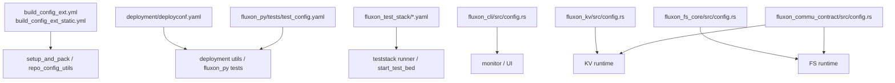

# Fluxon 配置总览

## 1. 结论

本文只回答一件事：Fluxon 仓库里有哪些稳定配置入口，它们各自负责什么，校验后会变成什么运行时结构。

**稳定结论：**

- 配置输入和运行时结构是分开的，YAML 只负责声明意图，`verify()` / `parse_*()` 负责收敛成唯一可执行结果。
- 共享契约优先放在 `fluxon_commu_contract` 和 `fluxon_cli::config` 这类公共模块里，业务包更多是复用或重导出。
- `host:port`、`http(s)://...`、`cluster-scoped path` 这几类格式都被严格区分，不靠探测或模糊回退。
- 仓库里的 checked-in YAML 分两类：运行时契约和环境/测试契约。前者要强校验，后者主要用于把开发、部署、测试流水线接起来。

## 2. 配置地图

| 配置家族 | 入口文件 / 模块 | 主要消费者 | 作用 |
| --- | --- | --- | --- |
| 仓库环境配置 | `build_config_ext.yml` | Rust KV 测试族、`fluxon_py/tests/test_lib.py`、`setup_and_pack` 打包/校验脚本、TestStack 的 `bin_kvtest` 用例 staging | 提供 etcd、Prometheus、remote write 等开发/测试基线 |
| 静态构建配置 | `build_config_ext_static.yml` | `setup_and_pack/pack_release.py`、`build_pack_fluxonkv_pylib_img.py`、Nix 打包链路 | 固定 wheel / manylinux 版本 |
| 部署配置 | `deployment/deployconf.yaml` | 部署脚本、`fluxon_py` 测试入口、TestStack 生成/消费链路 | 提供集群节点、服务地址和全局环境变量 |
| Python 测试配置 | `fluxon_py/tests/test_config.yaml` | `fluxon_py` 测试入口、测试辅助库、deployconf 解析链路 | 连接 deployconf，选择 KV backend 类型 |
| 开发/打包环境配置 | `setup_and_pack/setup_dev_env/*.yaml`、`setup_and_pack/build_pack_fluxonkv_pylib_img/*.yaml`、`setup_and_pack/nix/*.yaml`、`pub_prepare_build.yaml` | `setup_and_pack` 脚本 | 提供开发机和打包流水线的环境输入 |
| TestStack 配置 | `fluxon_test_stack/ci_test_list.yaml`、`start_test_bed.yaml`、`gitops.yaml` | `test_runner.py`、`start_test_bed.py` | 定义 suite、testbed、GitOps 和 UI 入口 |
| CLI 监控配置 | `fluxon_cli/src/config.rs` | `master_ui_monitor`、`test_runner_ui` | 提供监控页和查询页配置 |
| KV 配置 | `fluxon_kv/src/config.rs` | KV master / owner / external | 定义 KV 运行时角色和校验规则 |
| FS 配置 | `fluxon_fs_core/src/config.rs` | FS master / agent / panel | 定义 FS cache、master、panel、权限和转移态 |
| 共享传输配置 | `fluxon_commu_contract/src/config.rs`、`transfer_engine/surface.rs` | KV / FS / commu | 提供 `NetworkConfig`、`ProtocolType`、`TransferEngineType` |

## 3. 通用规则

| 规则 | 含义 |
| --- | --- |
| `serde(deny_unknown_fields)` | 运行时 YAML 默认拒绝未知字段 |
| `from_file` / `from_str` + `verify` | 先解析，再收敛成强类型运行时配置 |
| `YamlNullable<T>` | 只在需要区分“缺失 / null / value”时使用 |
| `host:port` 与 `http(s)://...` 分离 | etcd / deployconf 常用前者，监控 / Prometheus 常用后者 |
| 派生值要显式写回 | 例如 cluster-scoped 路径、默认表名、默认 transport_mode |

## 4. 环境与部署配置

### 4.1 `build_config_ext.yml`

这是仓库级开发环境配置，不是业务 runtime config。

| 字段 | 规则 | 主要用途 |
| --- | --- | --- |
| `etcd` | 必填，`host:port` | 供 Rust / Python / 测试工具读取 etcd 地址 |
| `prom` | 必填，`http(s)://.../v1` 或 `.../api/v1` | 供 Grafana / TSDB 查询 URL 使用 |
| `prom_remote_write_url` | 必填，`http(s)://...` | 供 remote write 使用 |

`setup_and_pack/utils/repo_config_utils.py` 里保留了 `prometheus_remote_write_url` 的旧名兼容读取，但这是 build tooling 的过渡路径，不是推荐的新契约。

### 4.2 `build_config_ext_static.yml`

当前只固定一个值：

| 字段 | 规则 |
| --- | --- |
| `manylinux_version` | 必填，当前只允许 `2_28` |

### 4.3 `deployment/deployconf.yaml`

这是部署和打包流水线的核心配置。当前稳定消费面主要有三块：

| 区块 | 关键字段 | 作用 |
| --- | --- | --- |
| `cluster_nodes` | 节点列表 | 作为 placeholder 解析的基础 |
| `service` | 服务节点映射 | 供部署脚本和测试脚本查 service ip:port |
| `global_envs` | `ETCD_FULL_ADDRESS`、`FLUXON_PROMETHEUS_BASE_URL`、`MONITOR_GREPTIMEDB_WRITE_URL`、`FLUXON_CLUSTER_NAME`、`FLUXON_SHARED_MEM`、`FLUXON_SHARED_FILE` | 供部署/测试代码读取集群级 authority |

`global_envs` 允许占位符解析，先由 `cluster_nodes` + `service` 构造映射，再把变量落成最终值。

### 4.4 `fluxon_py/tests/test_config.yaml`

这是一层测试入口配置，不是 runtime 部署配置。

| 字段 | 规则 |
| --- | --- |
| `deployconf_path` | 必填，指向共享 deployconf |
| `kv_svc_type` | 必填，当前测试助手只接受已知 backend 类型 |

测试代码里还保留了 mooncake 相关读取函数，但 checked-in 的最小样例只使用上面两个字段。

### 4.5 `fluxon_test_stack/*`

TestStack 的配置已经单独有设计文档，这里只收口成一句话：

- `ci_test_list.yaml` 定义 suite 空间。
- `start_test_bed.yaml` 定义共享 testbed 和 UI。
- `gitops.yaml` 定义 GitOps 轮询和记录。
- 生成的 `deployconf_testbed.yml` 是派生产物，不是手工主配置。

## 5. 运行时配置

### 5.1 KV

KV 的入口在 `fluxon_kv/src/config.rs`。稳定结论是：`master` 单独使用 `MasterConfigYaml`；`owner` 和 `external` 共用 `ClientConfigYaml`，再由 `verify()` 按内存贡献收敛成 owner / external / side-transfer worker 三个运行时分支。

| 类型 | 作用 |
| --- | --- |
| `MasterConfigYaml` | master 节点输入 |
| `ClientConfigYaml` | owner / external 输入 |
| `FluxonKvSpecYaml` | client 侧 `fluxonkv_spec` 子块 |
| `TestSpecConfig` | 测试和实验分支开关 |
| `MonitoringConfigYaml` | master 监控块 |
| `NetworkConfig` | 网络白名单和 IP 映射，共享自 `fluxon_commu_contract` |

`master` 的 YAML 结构：

| 字段 | 规则 | 作用 |
| --- | --- | --- |
| `instance_key` | 必填 | master 实例标识 |
| `cluster_name` | 必填 | 集群名 |
| `etcd_endpoints` | 必填，输入用 raw `host:port` | master 控制面 etcd 地址；校验后归一化成 `http://host:port` |
| `log_dir` | 必填 | master 日志 / profile 根目录 |
| `port` | 可选，给出时 `> 0` | master 监听端口 |
| `protocol` | 可选 | 协议选择；缺省走编译期默认协议 |
| `monitoring` | 逻辑必填 | Prometheus / remote write / OTLP log 配置块 |
| `network` | 可选 | 网络白名单和主 IP 扩展映射 |
| `pprof_duration_seconds` | 可选，给出时 `> 0` | profile 导出时长 |
| `master_ui` | 可选，但依赖 `monitoring` | 嵌入式 monitor HTTP 服务；当前只暴露 `http_listen_addr` |
| `test_spec_config` | 可选 | test / fast-path / side-transfer 实验开关 |

`owner` 和 `external` 共用同一套 `ClientConfigYaml` 骨架：

| 顶层字段 | 规则 | 说明 |
| --- | --- | --- |
| `instance_key` | 必填 | client 实例标识 |
| `protocol` | 可选 | 协议选择 |
| `contribute_to_cluster_pool_size` | 用来分流 owner / external | 缺失或全零是 external；`dram > 0` 是 owner |
| `pprof_duration_seconds` | 可选，给出时 `> 0` | profile 导出时长 |
| `fluxonkv_spec` | 必填 | KV 业务配置子块 |
| `test_spec_config` | 可选 | 测试和 side-transfer 分支开关 |

`fluxonkv_spec` 里，owner / external 共享的基础字段只有这几项：

| 字段 | 作用 |
| --- | --- |
| `cluster_name` | 目标集群名 |
| `shared_memory_path` | 本机共享内存 authority；运行时会拼成 `cluster_name` 作用域路径 |
| `shared_file_path` | 本机共享文件 authority；运行时会拼成 `cluster_name` 作用域路径 |
| `p2p_listen_port` | 可选的 P2P 监听端口 |

只有 `owner` 能声明的字段：

| 字段 | 作用 |
| --- | --- |
| `etcd_addresses` | owner 连接 etcd 的 raw `host:port` 列表；运行时同时保留 raw 和归一化 `http://host:port` 两份视图 |
| `sub_cluster` | owner 所属子集群标签 |
| `large_file_paths.log_root_path` | owner 日志大文件根目录 |
| `large_file_paths.cache_root_path` | owner cache 大文件根目录 |
| `redis_compat` | Redis 兼容监听配置 |

`external` 的结构更小：它不声明 `etcd_addresses`、`sub_cluster`、`large_file_paths`、`redis_compat`，这些 owner 侧字段都从 owner 发布的 `shared.json` 继承。本地 YAML 只保留 attach owner 所需的共享 bundle 锚点和本进程参数。

主要约束：

- `monitoring` 在 master 上必填。
- `master_ui` 依赖 `monitoring`，并作为嵌入式 monitor HTTP 服务启动。
- `contribute_to_cluster_pool_size` 里的容量都按 16 MiB 对齐；`dram = 0` 但 `vram` 非 0 会被拒绝，避免半 owner 半 external 的模糊状态。
- owner 模式要求 `contribute_to_cluster_pool_size.dram > 0`，并且必须显式提供 `etcd_addresses`、`sub_cluster`、`large_file_paths`。
- zero-contribution `external` 模式禁止再写 owner 专属字段；运行时会从 owner `shared.json` 补齐这部分信息。
- `shared_memory_path` / `shared_file_path` 会拼成 `cluster_name` 作用域路径。
- `test_spec_config.side_transfer_role = worker` 不是第三套 YAML，而是 zero-contribution client 的子分支；它强制 `TransferEngineType::P2p`，并关闭 transfer RPC fast path。
- `test_spec_config.side_transfer_worker_count` 只允许出现在 owner 配置里，用来控制 owner 拉起的 worker 数量。

更细的调用时序、持有生命周期和并发规则分别在 `kv_1_概览与分层.md`、`kv_2_调用时序.md`、`kv_3_参数与并发.md`、`kv_4_allocation_segment_holder生命周期.md` 里展开。

### 5.2 FS

FS 的配置集中在 `fluxon_fs_core/src/config.rs`，上层 `fluxon_fs/src/config.rs` 只是重导出。

| 配置块 | 入口 | 结果 |
| --- | --- | --- |
| cache | `fluxon_fs.cache` | `FluxonFsGlobalConfig` |
| master | `fluxon_fs.master` | `FluxonFsMasterConfig` |
| master_panel | `fluxon_fs.master_panel` | `FluxonFsMasterPanelConfig` |

`fluxon_fs.cache` 的核心字段：

- `stale_window_ms` 必须 `> 0`。
- `write_session_target_inflight_bytes` 可缺省，默认 128 MiB。
- `rules[*]` 需要绝对路径、合法 cache/write 模式、合法前缀和非零 cache 上限。
- `exports[*]` 需要绝对路径；`nodes` 缺失时表示 `AgentRegistry`，给出时表示 `StaticNodes`。

`fluxon_fs.master` 的核心字段：

- `instance_key` 必填。
- `pull_interval_ms` 可选，但如果给出必须 `> 0`。
- 旧的 `fluxon_fs.rpc` 和 `rpc_timeout_ms` 已移除。

`fluxon_fs.master_panel` 的核心字段：

- `listen_addr`、`public_base_url`、`prometheus_base_url`、`access_db_path` 都是必需基线。
- `bootstrap_access_model` 是面板的启动授权模型。
- `transfer_state_store` 当前稳定实现是 `tikv`。
- `s3_gateway` 负责对象请求和 KV miss 策略。

FS 还把访问模型拆成两层：

- `access_model` 是用户/权限的输入模型。
- `runtime_access_model` 是 runtime 使用的派生模型，密码会被哈希，不再原样保留。

### 5.3 CLI 监控

`fluxon_cli/src/config.rs` 定义统一监控页配置，KV 的 `master_ui` 和 TestStack 的 UI 都复用它。

| 类型 | 关键字段 |
| --- | --- |
| `MonitorConfigYaml` | `etcd_endpoints`、`prometheus_base_url`、`cluster_name`、`member_kind`、`output` |
| 可选项 | `mq_unique_key_prefixes`、`http_listen_addr`、`greptime_sql` |

主要约束：

- `etcd_endpoints` 必须非空且带 scheme。
- `prometheus_base_url` 必须带 scheme。
- `mq_unique_key_prefixes` 给出时不能为空，也不能带前后空白。
- `greptime_sql` 可以显式提供；如果 `prometheus_base_url` 指向 Greptime 的 `/v1/prometheus`，会自动派生默认 SQL 连接信息。

### 5.4 共享传输契约

`fluxon_commu_contract` 提供多个被 KV / FS 共同复用的基础类型：

| 类型 | 取值 | 作用 |
| --- | --- | --- |
| `ProtocolType` | `Tcp` / `Rdma` | 输入协议选择 |
| `TransferEngineType` | `Closed` / `P2p` | 传输引擎分支 |
| `TransferBackendActivationMode` | 三个显式分支 | 控制 backend 激活方式 |
| `NetworkConfig` | `subnet_whitelist`、`primary_ip_to_extended_ips` | 网络白名单和 IP 扩展映射 |

这些类型是共享契约，不属于某一个子系统的私有配置。

## 6. 配置之间的关系

| 关系 | 说明 |
| --- | --- |
| build_config_ext -> deployment/test | 先确定环境基线，再给 runtime 配置提供 host、URL、路径 |
| deployconf -> test_config | Python 测试配置通过 `deployconf_path` 指向共享部署配置 |
| deployconf -> teststack | `start_test_bed` 和 `test_runner` 读取派生后的 testbed deployconf |
| commu_contract -> KV / FS | `ProtocolType`、`TransferEngineType`、`NetworkConfig` 是共享底座 |
| CLI config -> KV / TestStack UI | master UI、runner UI 复用同一个 monitor config 契约 |

## 7. 读法建议

如果你只想看某一块的细节，按这个顺序读：

1. 环境/部署先看 `deployment/utils/deployconf_config_utils.py` 和 `fluxon_util/src/dev_config.rs`。
2. KV 先看 `fluxon_kv/src/config.rs`，再接 `kv_1` 到 `kv_4`。
3. FS 先看 `fluxon_fs_core/src/config.rs`，再看 `用户 - 5 - FS接口.md`。
4. TestStack 直接看 `teststack_1_当前架构与CI测试流程.md`。
