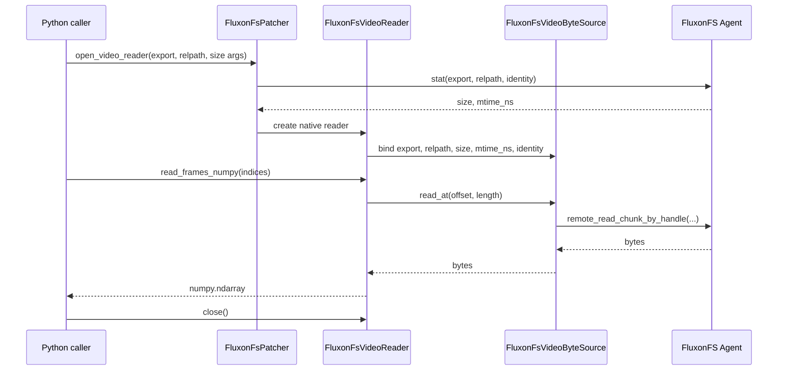

# FluxonFS VideoReader 接口设计

## 执行摘要

- `VideoReader(path)` 这类第三方解码入口在 C/C++ 层直接访问文件路径，绕不过 Python 侧 `open()` patcher。FluxonFS 需要提供一个原生 `VideoReader` 接口，把 FFmpeg 的随机读请求接到 FluxonFS 的 `stat / read_chunk / cache` 链路上。
- 单 reader 公共入口为 `FluxonFsPatcher.open_video_reader(...)`。调用方传 `export_name + relpath + 输出尺寸`，返回 `FluxonFsVideoReader`，再调用 `read_frames_numpy(indices)` 得到 `uint8 NHWC` 数组。
- 训练 dataloader 的推荐入口为 `FluxonFsPatcher.open_video_reader_pool(...)`。pool 在当前 Python 进程内按 `(export_name, relpath, height, width, num_threads, request_identity)` 管理 reader LRU，复用 reader 级 page cache，调用方不直接维护 reader 缓存。
- 底层只保留 `RangeSource` 读取路径：FFmpeg 通过 `AVIOContext` 回调向 FluxonFS 请求字节范围。export 路由、身份校验、metadata cache、KV piece cache、异步 backfill、磁盘缓存等能力都收束在 FluxonFS 内部，VideoReader 不新增缓存协议或本地文件分支。
- 解码在训练进程本地完成。FS agent 只提供字节范围读取和缓存填充，不承担视频解码和帧数组传输。
- v1 先支持 CPU FFmpeg 解码。NVDEC / GPU decode 可以作为后续显式 backend 分支加入，不进入首版公共契约。

## 1. 背景与目标

训练数据集当前用 `decord.VideoReader(path).get_batch(...).asnumpy()` 解码视频。这个路径的问题在于：

- FFmpeg 在 native 层按路径访问文件系统，Python 的 `open()` / `read()` patcher 无法接管它。
- `VideoReader(...)` 初始化阶段可能扫描 packet / keyframe，远端文件会承受额外顺序读和 seek。
- 同一视频多个窗口重复读取时，现有探针和训练路径会重复打开、重复索引、重复 seek/decode。

本文设计的目标是在 FluxonFS 内提供一个面向视频解码的读接口：

- 让 FFmpeg 的 `read / seek` 请求走 FluxonFS 的远端读和缓存能力。
- 把视频读取的公共接口固定在 FluxonFS 语义上，而不是暴露某个第三方解码库的文件路径约定。
- 保持解码本地化，避免把未压缩帧通过 FS agent RPC 传输。
- 对缓存、身份、文件版本和失败语义给出稳定边界。

## 2. 非目标

- 不在 FS agent 服务端解码视频。
- 不复刻 `decord.VideoReader` 的全部 API。
- 不新增独立于 FluxonFS export 配置的 per-video 配置文件。
- 不为 VideoReader 增加环境变量参数传递。
- 不为视频路径新增第二套 KV cache key 布局。
- 不在首版支持写入视频、转码、音频流处理或 GPU decode。

## 3. 当前实现基础

FluxonFS 已有的读链路可以直接作为 VideoReader 的字节源：

| 现有模块 | 当前职责 | VideoReader 复用方式 |
| --- | --- | --- |
| `FluxonFsPatcher` | 当前 Python 进程内的 FS 挂载、cache config 和请求身份入口 | 提供 `open_video_reader(...)` 和 `open_video_reader_pool(...)` 公共入口 |
| `FluxonFsExport` | 定义 export 根目录、路由、cache key prefix、metadata TTL 和 backfill 策略 | VideoReader 只接受 `export_name + relpath`，不绕过 export |
| `read_chunk` RPC | agent 端按 `offset + length` 读取远端文件 | FFmpeg `AVIOContext` 的 read 回调最终落到这里 |
| `remote_read_chunk_by_handle...` | client agent 侧带 metadata、KV cache 和 miss policy 的范围读 | 作为 `FluxonFsVideoByteSource` 的主读接口 |
| KV piece cache | 以 `(export, relpath, size, mtime_ns, piece_index)` 组织固定大小 piece | 随机读、重复读和跨 reader 复用 |
| FluxonFS 内部缓存层 | KV piece cache、异步 backfill、磁盘缓存等内部优化 | VideoReader 不直接选择或配置，只通过范围读接口受益 |

当前 Python patcher 对 `open()` 的支持仍然保留，但它不是视频接口的主路径。FFmpeg 从 C/C++ 层读取文件时，不会自动进入 Python `open()` patcher。

## 4. 公共接口

单 reader 公共入口放在 `FluxonFsPatcher` 上：

```python
with patcher.open_video_reader(
    export_name="train-videos",
    relpath="bucket/a/b/sample.mp4",
    height=480,
    width=832,
    num_threads=8,
) as reader:
    frames = reader.read_frames_numpy([0, 8, 16, 24])
```

稳定契约：

| 项目 | 契约 |
| --- | --- |
| 入口 | `FluxonFsPatcher.open_video_reader(...)` |
| 定位文件 | `export_name: str` + `relpath: str` |
| 输出尺寸 | `height: int` + `width: int`，必须为正数 |
| 解码线程 | `num_threads: int`，必须为正数 |
| 读取方法 | `read_frames_numpy(indices: Sequence[int]) -> numpy.ndarray` |
| 返回数组 | `dtype=uint8`，shape 为 `(len(indices), height, width, 3)` |
| 生命周期 | reader 支持 context manager；`close()` 后所有读取失败 |
| 身份 | 打开 reader 时捕获 `patcher` 当前 request identity；reader 生命周期内不跟随后续身份变更 |

单 reader 只提供 `read_frames_numpy` 一个读取方法。不要同时暴露 `get_batch()`、`get_batch_numpy()`、`read_frames()` 等同义入口。

训练 dataloader 应优先使用进程内 pool：

```python
pool = patcher.open_video_reader_pool(max_readers=32)
frames = pool.read_frames_numpy(
    export_name="train-videos",
    relpath="bucket/a/b/sample.mp4",
    height=480,
    width=832,
    num_threads=8,
    indices=[0, 8, 16, 24],
)
```

业务已经把多个样本整理成 batch 时，应把每个 clip 的 frame plan 作为 `FluxonFsVideoReadRequest` 传给 pool：

```python
requests = [
    FluxonFsVideoReadRequest(
        export_name="train-videos",
        relpath="bucket/a/b/sample.mp4",
        height=480,
        width=832,
        num_threads=8,
        indices=(0, 8, 16, 24),
    ),
    FluxonFsVideoReadRequest(
        export_name="train-videos",
        relpath="bucket/a/b/sample.mp4",
        height=480,
        width=832,
        num_threads=8,
        indices=(12, 20, 28, 36),
    ),
]
results = pool.read_many_numpy_with_stats(requests)
```

pool 的稳定契约：

| 项目 | 契约 |
| --- | --- |
| 入口 | `FluxonFsPatcher.open_video_reader_pool(max_readers=32)` |
| LRU key | `(export_name, relpath, height, width, num_threads, request_identity)` |
| 容量 | `max_readers: int`，必须为正数；活跃 reader 不会被强制关闭 |
| 读取方法 | `read_frames_numpy(...) -> numpy.ndarray` |
| 指标方法 | `read_frames_numpy_with_stats(...) -> FluxonFsVideoReadResult` |
| 批量方法 | `read_many_numpy_with_stats(requests: Sequence[FluxonFsVideoReadRequest]) -> list[FluxonFsVideoReadResult]` |
| 生命周期 | pool 支持 context manager；`close()` 后所有新读取失败 |
| 线程语义 | 一个 cached reader 同一时刻只租给一个调用；并发请求可打开多个 reader |

`read_many_numpy_with_stats(...)` 在 pool 内部按 LRU key 分组。同一视频、同一输出尺寸和同一 request identity 的多个 clip 会合并为一次 native `read_frames_numpy(combined_indices)` 调用，然后按请求顺序切片返回。这个 batch 只改变调度粒度；每个请求的输出 shape、dtype 和错误语义仍按单请求契约处理。

pool 只管理 reader 对象生命周期、reader 级 page cache 复用和同 reader key 的批量调度，不新增文件缓存协议。FluxonFS 的 KV piece cache、异步 backfill、磁盘缓存和权限检查仍然只在 RangeSource 读链路内生效。

构建要求：

- native 解码实现需要用 `fluxon_pyo3` 的 `fluxon_fs_video_ffmpeg` feature 构建，并且构建环境提供 FFmpeg 开发库。
- 未启用该 feature 时，Python 公共入口仍存在，但打开 reader 会返回明确错误。这是构建期能力开关，不是第二条运行时读取路径。

## 5. 架构


这张图里的关键边界：

- Python 只负责创建 reader、传入 frame index 和接收 numpy 数组。
- FFmpeg 回调不调用 Python，避免 GIL 和 Python callback 成为高频 I/O 路径。
- `FluxonFsVideoByteSource` 运行在 Rust/native 层，直接复用 FluxonFS agent 的读接口。
- VideoReader 只看到范围读接口；KV、磁盘或其他缓存策略都属于 FluxonFS 内部实现。

## 6. 详细设计

### 6.1 打开 reader

`open_video_reader(...)` 的打开流程：

1. 校验 `export_name`、`relpath`、`height`、`width`、`num_threads`。
2. 从 `FluxonFsPatcher` 对应的 Rust agent 捕获当前 request identity。
3. 调用现有远端 `stat` 获取 `size`、`mtime_ns`、`is_file`。
4. 构造文件签名 `sig = (size, mtime_ns)`。
5. 创建 reader 级 `FluxonFsVideoByteSource` 和 page cache，绑定 `export_name`、`relpath`、`size`、`mtime_ns`、request identity。
6. 首版在 `read_frames_numpy(...)` 内创建 FFmpeg `AVIOContext` / decoder，并把 `read_packet`、`seek` 回调绑定到 byte source。

打开阶段只产生一个 reader handle。后续每次 `read_frames_numpy(...)` 复用同一个 byte source 和 reader 级 page cache；当前实现暂不复用 FFmpeg decoder context。pool 的批量入口会把同一 reader key 下的多个 clip 合并为一次 `read_frames_numpy(...)`，从而减少重复从视频头顺序解码到目标帧的成本。

### 6.2 FFmpeg 读回调

FFmpeg 的读回调以当前位置为基础请求一段 bytes：

```text
read_packet(buf, want)
  -> source.read_at(current_offset, want)
  -> current_offset += bytes_read
```

seek 回调只更新当前位置：

```text
seek(offset, whence)
  -> source.seek(offset, whence)
```

`AVSEEK_SIZE` 返回打开时 stat 得到的 `size`。如果 FFmpeg 请求超过 EOF，返回实际可读长度；如果请求已经在 EOF 之后，返回 EOF。

### 6.3 `FluxonFsVideoByteSource`

`FluxonFsVideoByteSource` 是内部 Rust 对象，不作为 Python 公共类型暴露。它负责把 FFmpeg 的小范围读合并成 FluxonFS 适合的 page 读取。

| 字段 | 作用 |
| --- | --- |
| `export_name` | export 名称 |
| `relpath` | export 内相对路径 |
| `size` | 打开时文件大小 |
| `mtime_ns` | 打开时文件 mtime |
| `request_identity` | 打开 reader 时捕获的身份 |
| `page_bytes` | 内部页大小，默认跟随现有 piece / read chunk 约束 |
| `page_cache` | reader 级 LRU，减少 FFmpeg 小读和重复 seek 的 RPC 次数 |

VideoReader 只保留 `RangeSource` 路径。字节源的读取顺序如下：

1. 命中 reader 级 `page_cache`：直接切片返回。
2. 命中 KV piece cache：读取 piece 后填入 `page_cache`。
3. 未命中 KV：调用 `remote_read_chunk_by_handle...`，按当前 export 的 cache 策略决定是否 backfill。

### 6.4 缓存复用策略

VideoReader 不新增独立缓存配置。它复用已有 export 字段：

| 配置 / 状态 | 复用方式 |
| --- | --- |
| `cache_kv_key_prefix` | KV piece cache key 前缀 |
| `cache_bytes_field_key` | KV 中保存 piece bytes 的字段 |
| `cache_max_bytes` | 判断对象是否允许进入 KV cache |
| `metadata_cache_ttl_ms` | 复用现有 stat / metadata cache 行为 |
| `async_backfill_enabled` | KV miss 后是否异步补齐 piece |
| FluxonFS 内部磁盘缓存 | 作为 `remote_read_chunk_by_handle...` 之后的内部优化，不向 VideoReader 暴露 FD / path |

缓存 key 继续使用现有签名：

```text
export_name + relpath + size + mtime_ns
```

这个签名的含义是“打开 reader 时看到的文件版本”。如果文件内容变化但 `size` 和 `mtime_ns` 没变，FluxonFS 无法稳定识别这是新版本；上游数据集需要保证训练视频文件在读取期间不可变。

### 6.5 单一读取路径

内部只保留 `RangeSource`：

```text
FFmpeg read / seek
  -> AVIOContext callback
  -> FluxonFsVideoByteSource.read_at(offset, length)
  -> remote_read_chunk_by_handle(...)
  -> FluxonFS 内部缓存层 / read_chunk RPC
```

VideoReader 不接收本地 FD / path，不判断是否整文件 materialize，也不直接操作磁盘缓存。后续如果 FluxonFS 需要把某些 range read 映射到本地磁盘缓存，那也是 `remote_read_chunk_by_handle(...)` 内部的实现变化，不改变 VideoReader 契约。

### 6.6 帧读取

`read_frames_numpy(indices)` 的执行流程：

1. 校验 `indices` 非负，且能转换为 frame index 列表。
2. 首版按容器读取顺序从视频开头解码到最大目标帧，保证 frame index 语义稳定。
3. 后续可以在明确 PTS / frame index 映射后加入 keyframe seek 优化。
4. 对输出帧执行 resize / pixel format 转换。
5. 写入一个 numpy-owned `uint8` 输出数组。

首版输出固定为 NHWC RGB：

```text
(frame_count, height, width, 3)
```

这一路径仍然会 materialize 帧数组。设计目标是减少压缩视频字节读取和重复远端 I/O，不宣称帧输出零拷贝。

## 7. 生命周期与所有权



| 对象 | 所有者 | 生命周期 |
| --- | --- | --- |
| `FluxonFsPatcher` | Python 调用方 | 必须长于 reader |
| `FluxonFsVideoReaderPool` | Python 调用方 / DataLoader worker | 进程内 LRU；通常随 worker 生命周期创建和销毁 |
| `FluxonFsVideoReader` | Python 调用方 | context manager 或显式 `close()` |
| `FluxonFsVideoByteSource` | native reader | 随 reader 创建和销毁 |
| FFmpeg decoder context | native reader | 首版随每次 `read_frames_numpy(...)` 创建和销毁 |
| numpy 输出数组 | Python 调用方 | 每次 `read_frames_numpy` 独立返回 |

reader 关闭后，byte source 和 reader 级 page cache 释放；FFmpeg context 由每次 `read_frames_numpy(...)` 创建并在该次调用结束时释放。FluxonFS 的共享 KV cache 和内部磁盘缓存按现有 agent 生命周期管理。

## 8. 失败语义与不变量

| 条件 | 行为 |
| --- | --- |
| `export_name` 不存在 | 打开 reader 失败 |
| `relpath` 不存在或不是文件 | 打开 reader 失败 |
| 权限不足 | 打开或读取失败，错误保留 FluxonFS 权限语义 |
| `height / width / num_threads <= 0` | 打开 reader 失败 |
| `indices` 包含负数 | `read_frames_numpy` 失败 |
| FFmpeg 无法识别容器或视频流 | `read_frames_numpy` 失败 |
| 读取中远端短读 | 当前读取失败 |
| reader 已关闭 | 后续读取失败 |

关键不变量：

- 所有远端数据访问都必须经过 FluxonFS export 和 access check。
- FFmpeg 高频读回调不能调用 Python。
- 缓存 key 和失效语义沿用 FluxonFS 当前 `(export, relpath, size, mtime_ns)` 签名。
- 单 reader 公共接口只暴露一种读取方法：`read_frames_numpy`。
- pool 公共接口提供单请求读取和批量读取；批量读取的输入必须是显式的 `FluxonFsVideoReadRequest`。
- v1 返回 numpy-owned 数组，不把 native decoder 内部 buffer 暴露给 Python 长期持有。

## 9. 当前实现与专用 fast path 的边界

### 当前实现可直接复用

- `read_chunk` RPC 的 `offset + length` 文件读取。
- agent 侧 `remote_read_chunk_by_handle...` 的 KV cache / remote read 分支。
- `FluxonFsS3KvMissPolicy::{RemoteRead, StageToKvThenRead}` 的有限 miss 策略。
- `async_backfill_enabled` 对 KV piece 的异步补齐。
- FluxonFS 内部缓存能力，包括 KV piece cache、异步 backfill 和磁盘缓存。

### 需要新增

- `fluxon_py/fluxon_fs/video.py`：Python 公共 facade 和类型导出。
- `FluxonFsPatcher.open_video_reader(...)`：单 reader 公共入口。
- `FluxonFsPatcher.open_video_reader_pool(...)`：训练 dataloader 推荐入口，负责进程内 reader LRU。
- `FluxonFsVideoReadRequest` 和 `read_many_numpy_with_stats(...)`：pool 级批量调度入口，负责同 reader key 多 clip 合并。
- native `FluxonFsVideoReader`：持有 byte source、reader 级 page cache 和输出数组构造逻辑，并驱动 FFmpeg decoder。
- native `FluxonFsVideoByteSource`：FFmpeg `AVIOContext` 回调背后的 FluxonFS 范围读适配层。
- 针对视频 decode 的指标：open 耗时、range read 次数、KV hit / miss、FluxonFS 内部缓存 hit / miss、decode 耗时。

首版实现边界：

- `open_video_reader(...)` 校验参数、捕获 request identity，并通过 FluxonFS agent 做 `stat`。
- reader 生命周期内复用 `RangeSource` 和 reader 级 page cache。
- `read_frames_numpy(...)` 每次创建 FFmpeg context，通过 `AVIOContext` 回调读取 FluxonFS range，并返回 numpy-owned `uint8 NHWC` 数组。
- `FluxonFsVideoReaderPool` 在 Python 进程内复用 idle reader；活跃 reader 不参与 LRU 关闭，释放后再参与淘汰。
- `read_many_numpy_with_stats(...)` 只在 Python pool 层合并同 reader key 的请求；native 层仍只有一个 frame-index batch decode 入口。
- 帧定位先采用顺序解码。keyframe seek、持久 decoder、GPU decode 和指标上报是后续显式优化项。

### 专用 fast path

首版不为 VideoReader 增加专用 fast path。唯一热路径是 `RangeSource`。缓存优化只能在 FluxonFS 内部发生，例如 KV piece 命中、异步 backfill 或内部磁盘缓存命中；这些优化不得改变 `open_video_reader(...)` 和 `read_frames_numpy(...)` 的公共契约。

未来如果加入 GPU decode，应作为新的 decode backend 分支，例如：

```text
DecodeBackend = CpuFfmpeg | CudaNvdec
```

这个分支只改变解码后端，不改变 FluxonFS 字节读取和缓存契约。

## 10. 验证计划

首版验证按三层做：

| 层级 | 验证内容 |
| --- | --- |
| 字节源单测 | `read_at`、seek、EOF、跨 page 读取、重复读命中 page cache |
| FluxonFS 集成测试 | export 权限、metadata cache、KV piece cache、内部磁盘缓存、文件变更签名 |
| 视频过程测试 | 同一视频多窗口读取、和 `decord.VideoReader(path)` 的帧 shape / dtype / 基本像素一致性、timeout 行为 |

性能指标必须绑定测试条件。至少记录：

- 视频文件大小、编码格式、分辨率、帧数。
- export 位置和底层存储类型。
- cache 冷启动 / 热启动。
- reader open 时间。
- FFmpeg range read 次数和总读取 bytes。
- KV cache hit / miss。
- FluxonFS 内部缓存 hit / miss。
- `read_frames_numpy` 端到端耗时。

## 11. 关键结论

FluxonFS VideoReader 的核心价值是把 FFmpeg 的随机字节读取纳入 FluxonFS 的 export、权限和缓存链路。单 reader 接口提供 `FluxonFsPatcher.open_video_reader(...) -> FluxonFsVideoReader`；训练 dataloader 使用 `FluxonFsPatcher.open_video_reader_pool(...)` 复用 reader。底层统一走 `RangeSource`，缓存能力收束在 FluxonFS 内部。

这条设计保留训练进程本地解码，避免远端传输未压缩帧；同时让同一视频的重复窗口读取可以命中 FluxonFS cache，减少 FFmpeg 对远端文件系统的重复直接访问。
