# FluxonFS S3 对象 I/O 设计

本文按 S3 接口和内部数据路径两层展开 FluxonFS 当前的对象 I/O 设计：

1. 分别说明 `PutObject`、`CreateMultipartUpload`、`UploadPart`、`CompleteMultipartUpload` 和 `AbortMultipartUpload` 的接口级时序；
2. 将大对象 `write-session` 内部的 session 打开、KV-ref、Raw RPC 降级和 finalize 分开说明；
3. 说明临时 KV key 使用的 lease 和 keepalive 如何管理；
4. 单独说明 `GetObject` 在 KV 缓存命中时的数据拷贝边界，以及 S3 HTTP 响应的小包延迟优化。

前三项构成写入链路的三个层次；缓存命中读取和 HTTP 传输则是两个独立的 I/O 优化点：

| 层次 | 选择 | 目的 |
| --- | --- | --- |
| S3 写入策略 | `put_small_object` 或 `write-session` | 小对象合并为一次 RPC，大对象使用流水线 |
| write-session 数据面 | KV-ref 或 Raw RPC | 条件允许时减少大数据 RPC 和 Agent 侧复制 |
| KV 生命周期 | Controller 共享 lease 和 keepalive | 防止传输中的临时 key 提前过期 |
| S3 读取路径 | holder-backed `Bytes` | KV 缓存命中时避免完整解码 `FlatDict` |
| HTTP 传输 | `TCP_NODELAY` | 避免小响应 body 被 Nagle 算法延迟 |

KV Shared Memory 是通用 `write-session` 的优化，Python FS 也能复用；在写入链路的三个层次中，只有 `4 MiB` 切换策略属于 S3 Gateway。

## 1. 接口与内部链路索引

| S3 接口 | 本文关注的行为 | 是否进入混合写入器 |
| --- | --- | --- |
| `PutObject` | 把 HTTP Body 写入最终对象 | 是，按整个 Body 的累计大小选择 |
| `CreateMultipartUpload` | 创建 `upload_id` 和 multipart 元数据 | 否，只写控制元数据 |
| `UploadPart` | 把一个 part 写入内部临时路径 | 是，每个 part 独立选择 |
| `CompleteMultipartUpload` | 校验并按顺序读取 part，组装最终对象 | 是，按最终对象的累计大小选择 |
| `AbortMultipartUpload` | 删除 multipart 临时文件和目录 | 否，只执行清理 |
| `GetObject` | 按 Range 切分读取，符合缓存条件时优先查询 KV | 不适用 |

`HeadObject`、列举和删除等接口不经过混合写入器，也不涉及本文的 KV 命中 payload 提取，因此不展开它们的时序。

主要角色如下：

- **S3 Gateway**：接收 S3 对象 I/O 和 multipart 控制请求，并维护每个请求的混合写入器。
- **Master-side Controller**：FS Master 进程内的 `s3_agent` / `FluxonFsAgent` 客户端对象，管理 session、发送队列和 sender；它不是目标 FS Agent 进程。
- **目标 FS Agent**：打开目标文件，接收 frame，并通过 WriteExecutor 写入文件。
- **KV Owner**：管理共享 `mmap.file`、内存分配和 holder 生命周期。
- **KV Master**：管理 KV 元数据和放置；KV-ref 本地路径不会让它转发文件 payload。

时序图中的 `loop` 只表示动作会重复，不自动表示串行或并发。本文在 loop 标题中明确标注“顺序”或“有界在途”：顺序指上一次入口调用返回后再开始下一次；有界在途指最多保留配置窗口内的未完成操作，并按 offset 顺序输出。

## 2. S3 混合写入策略

### 2.1 为什么要区分小对象和大对象

原 S3 路径先逐级执行父目录 `stat/mkdir`，再把 HTTP Body 拆成不超过 `1 MiB` 的数据块调用 `write_chunk`，最后执行 `truncate`。小对象的数据传输很快，这些同步 RPC 的固定开销反而更明显；大对象还会产生更多数据 RPC。

`write-session` 会为一个文件保持长生命周期 session，并通过有界队列持续提交数据。它更适合大对象，但打开 session、创建 sender 状态和结束 session 都有固定开销。

因此 S3 使用以下规则：

| 累计数据量 | 写入方式 | 完成方式 |
| --- | --- | --- |
| 小于 `4 MiB` | 暂存在内存，请求结束后调用一次 `put_small_object` | Agent 在同一 RPC 内创建父目录、覆盖并写完整文件 |
| 达到或超过 `4 MiB` | 以 `create_parents=true` 打开一次 `write-session`，把之前缓存的数据和后续数据都交给 session | 一次 `finalize` |

阈值是在接收 Body 的过程中判断，不要求请求开始前知道对象大小。累计大小恰好达到 `4 MiB` 时也会切换到 session。

### 2.2 `PutObject` 时序

`PutObject` 直接以 HTTP Body 驱动一个 `HybridObjectWriter`。大小未达阈值时数据留在 Gateway 内存；首次达到 `4 MiB` 时打开 session，并把已缓存数据与后续 Body 一起提交。

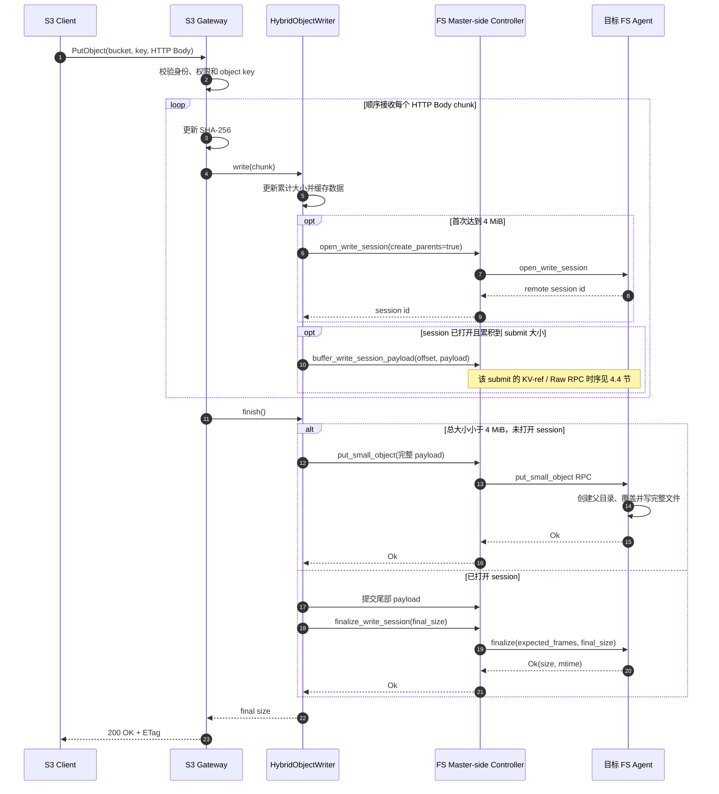

Body 读取、submit 或 finalize 失败时，Gateway 会对已打开的 session 执行尽力而为的 `abort_write_session`。

### 2.3 `CreateMultipartUpload` 时序

`CreateMultipartUpload` 只建立 multipart 控制状态，不创建最终对象，也不打开 `write-session`。

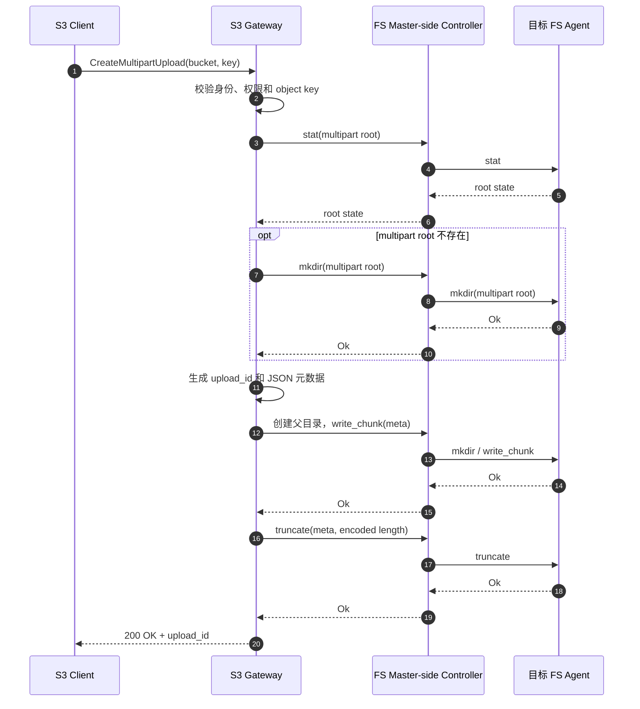

### 2.4 `UploadPart` 时序

每个 part 有独立的 `HybridObjectWriter`，因此 `4 MiB` 阈值按 part 自身大小判断。part 写完后，Gateway 另外保存 SHA-256 ETag sidecar，供 `CompleteMultipartUpload` 阶段校验。

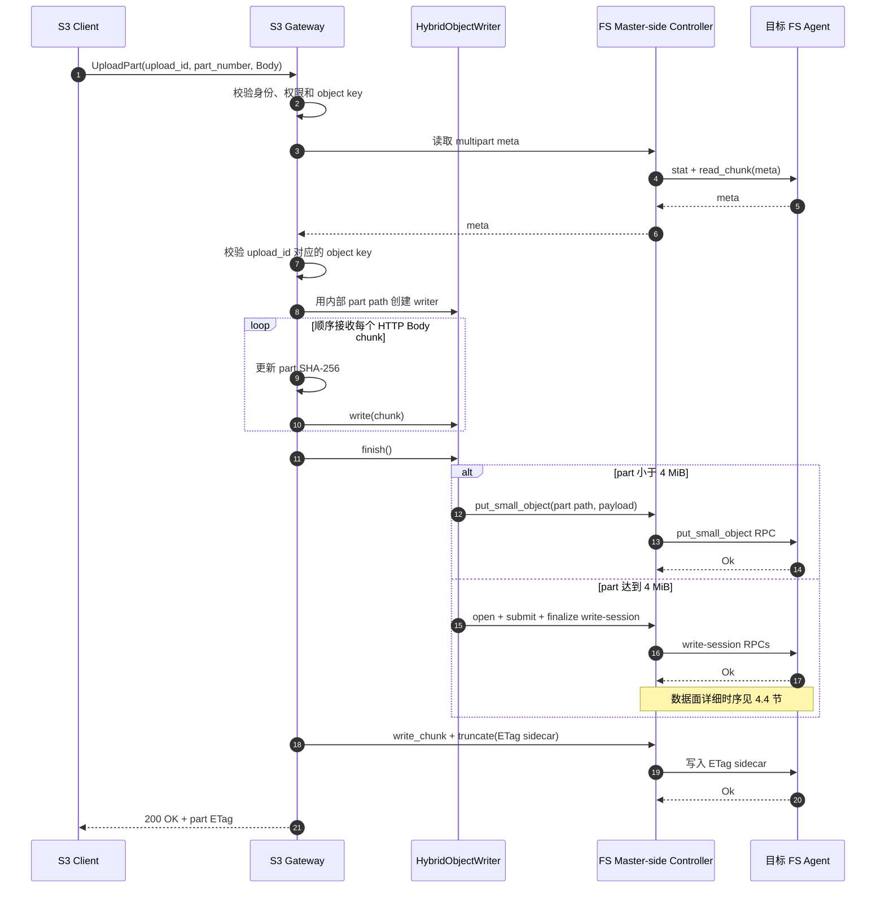

### 2.5 `CompleteMultipartUpload` 时序

complete 阶段会重新读取并串联所有 part。最终 writer 的累计大小是所有 part 之和，与各 part 在 upload 阶段选择了 small-put 还是 `write-session` 无关。

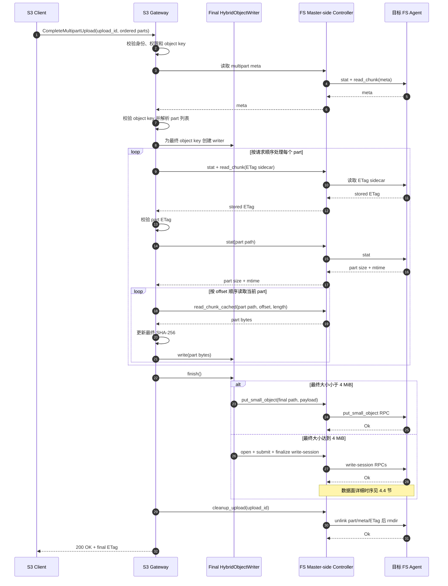

即使每个 part 都小于 `4 MiB`，只要合并后的对象达到阈值，最终对象仍会使用 `write-session`。组装或 finalize 失败时，Gateway 会对已打开的最终 writer 执行 `abort_write_session`，但不清理 multipart 临时数据，便于客户端重试或显式取消。

### 2.6 `AbortMultipartUpload` 时序

`AbortMultipartUpload` 清理 multipart 临时状态，不会修改已存在的最终对象。

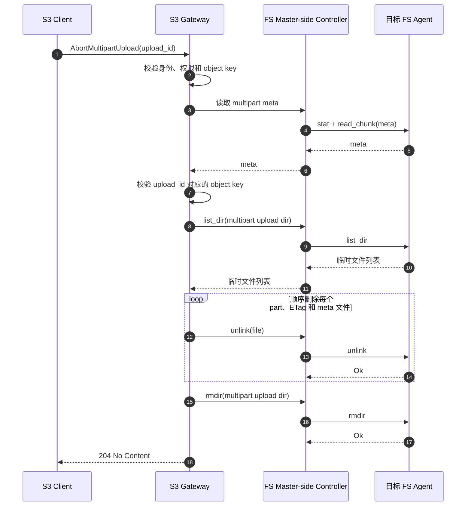

## 3. write-session 流水线

当前主要参数如下：

| 参数 | 当前值 |
| --- | ---: |
| S3 切换阈值 | `4 MiB` |
| small-put raw payload 上限 | 小于 `4 MiB` |
| Gateway 首选 submit 大小 | `32 MiB` |
| logical frame 上限 | `8 MiB` |
| 单 batch | 最多 4 frame，约 `32 MiB` |
| Controller 单 session 默认在途窗口 | `128 MiB` |
| Agent 单 session 队列 | `32 MiB` |
| 每个目标 Agent 的 sender task | 4 |

数据进入 session 后：

1. Gateway 尽量按 `32 MiB` 向 Controller 提交数据；
2. Controller 把 payload 切成不超过 `8 MiB` 的 frame；
3. 同一次 submit 中、同一 session 的最多 4 个连续 frame 组成一个 batch；batch 不会混入其他 session 或目标 Agent 的 frame；
4. sender 按目标 Agent 发送 batch；
5. Agent 将 frame 放入有界队列；
6. WriteExecutor 逐个执行 `write_all`；
7. `finalize(expected_frames, final_size)` 等待所有预期 frame 写完，再设置最终文件长度并释放 session。

Controller 和 Agent 的队列都有字节上限。队列满时，上游会等待 sender 或 writer 消费数据；失败、abort 和 shutdown 也会唤醒等待者，避免大文件无限占用内存。

Gateway 接收 HTTP Body 和 `CompleteMultipartUpload` 读取临时 part 的入口 loop 是顺序的；`buffer_write_session_payload` 把数据放入 Controller 有界队列后即可返回。后续 batch 发送可以并发在途，受每 session 默认 `128 MiB` 窗口、每目标 Agent 4 个 sender task 和 Agent `32 MiB` 队列共同限流。因此，入口顺序提交不等于等待每个 batch 写盘后才提交下一个。

需要注意：

- 数据 RPC 的 ACK 只表示 frame 已经进入 Agent 队列或被判定为重复，不表示已经写入文件；
- `finalize` 才会等待 frame 真正 `write_all` 完成；
- `finalize` 不执行 `fsync` 或 `syncfs`，持久化时间需要由外部同步操作单独统计。

## 4. KV Shared Memory 数据面

### 4.1 何时使用 KV-ref

session 打开时先判断它是否具备 KV-ref 候选条件；每个 batch 发送前还会重新检查 topology、Owner 和 node generation。使用 KV-ref 需要同时满足：

- Controller 和目标 Agent 属于同一个 KV share group；
- 两端完整 Owner 引用一致，即 `owner_id + owner_start_time`；
- 两端 node generation 和当前 topology snapshot 一致；
- Agent 声明支持 `fluxon_fs_write_session_kv_ref_v1`；
- Owner 具有有效 sub-cluster，并能保证共享 Owner 内的本地放置。

只比较 `owner_id` 不够，因为 Owner 重启后 id 可能不变，但旧 mmap generation 已经失效。

任一条件不满足时直接使用 Raw RPC，不会先发送 KV-ref 请求做能力探测。已经使用 KV-ref 的 session 如果后续检查失败，会永久降级为 raw，不会在同一 session 内再次升级。这条路径不要求配置 RDMA。

### 4.2 KV-ref 的写入过程

每个 batch 的过程如下：

1. Controller 调用现有 `kv_put(temp_key, batch, lease)`；
2. KV Owner 把数据复制一次到共享 mmap；
3. Controller 通过引用 RPC 发送 session、key、offset、frame 边界、Owner generation 和 sequence，不携带文件 payload；
4. Agent 校验权限、session、generation 和 key 后调用 `kv_get(temp_key)`；
5. `kv_get` 返回 holder-backed `Bytes`，切分 frame 时只创建 slice，不复制到新的 Agent heap buffer；
6. Agent 将 frame 放入写队列并返回 ACK；
7. Controller 异步删除临时 key，Agent holder 继续固定底层 allocation；
8. 最后一个 slice 写完并释放 holder 后，mmap allocation 才可以回收。

因此这不是端到端零拷贝。准确说法是：

```text
仍然存在：Controller Bytes → KV mmap 的一次 memcpy
减少的是：大 payload RPC 及 Agent RPC buffer 的额外复制
```

### 4.3 Raw RPC 和自动降级

Raw RPC 指 RPC 直接携带数据本身：

```text
Controller batch → data RPC raw_bytes → Agent 写队列
```

以下情况会使用或降级到 Raw RPC：

- 两端不共享同一 Owner generation；
- Agent 不支持 KV-ref；
- `kv_put`、引用 RPC、`kv_get` 或校验失败；
- 共享 lease 分配或 keepalive 失败。

单 batch 的 KV-ref 失败后，Controller 会用相同 sequence、offset 和原数据通过 Raw RPC 重发，并让该 session 后续固定使用 raw。Agent 使用 received/written sequence 去重，因此 KV-ref 已入队但 ACK 丢失时不会重复写入。

### 4.4 当前实现的 Master–Agent 时序

当前实现按职责拆成五个时序：session 打开、KV-ref 成功、直接 Raw RPC、KV-ref 失败降级和 finalize。后台 keepalive 是独立生命周期，放在第 5 节说明。

#### 4.4.1 打开 session 并选择候选数据面

session 打开时只确定 KV-ref 候选资格。sender 在每个 batch 发送前还会重验 topology，因此候选资格不代表后续 batch 一定使用 KV-ref。

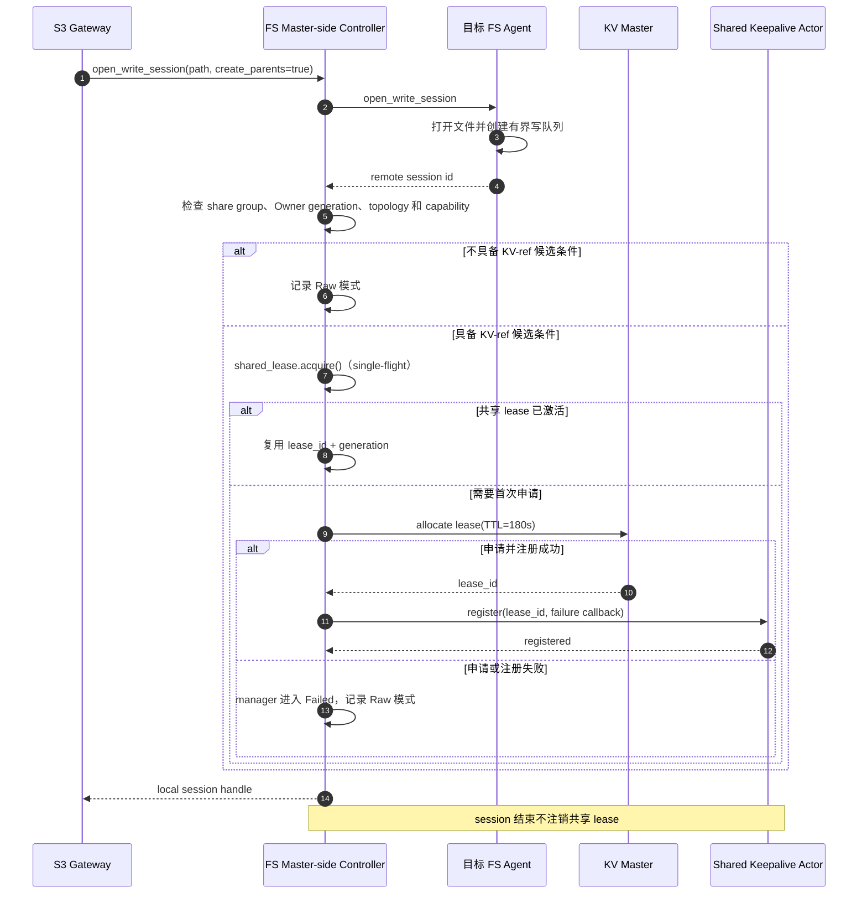

#### 4.4.2 KV-ref batch 成功时序

sender 仅在发送当前 batch 前的重验仍成功时进入这条路径。临时 key 删除与 Agent 写盘彼此独立；holder 会在 key 删除后继续固定 mmap allocation。

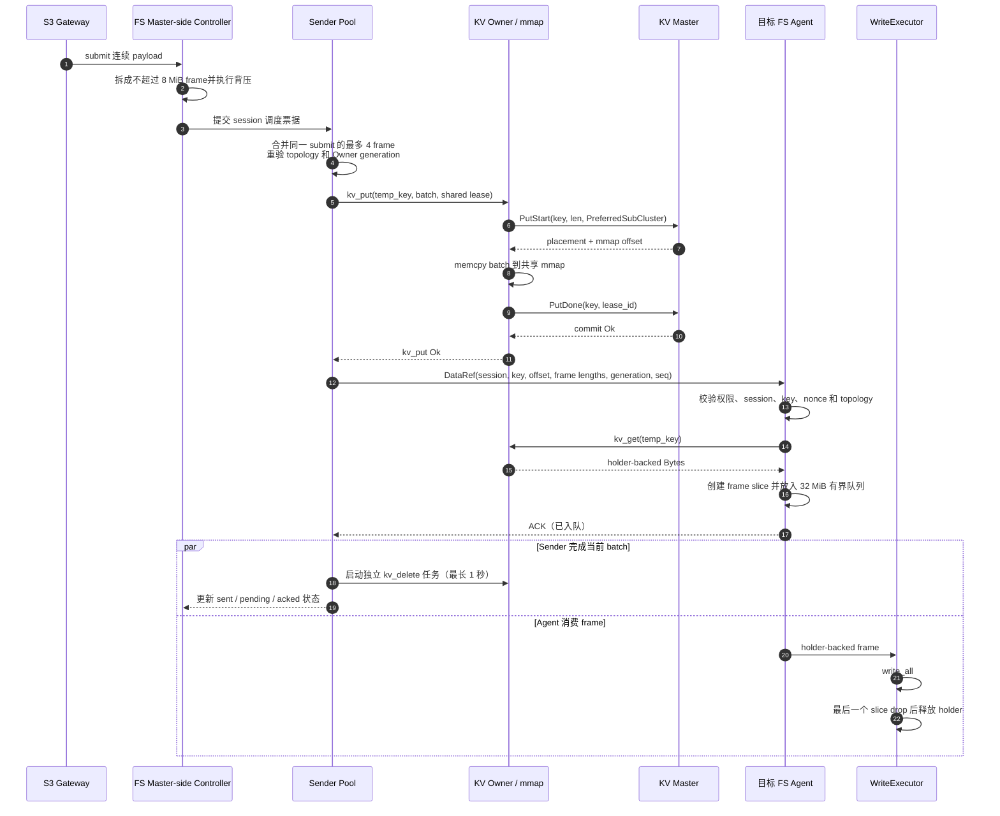

#### 4.4.3 直接 Raw RPC 时序

session 打开时没有 KV-ref 候选资格，或者 sender 发送前发现 topology 已失效时，会跳过 KV 请求并直接携带 payload。

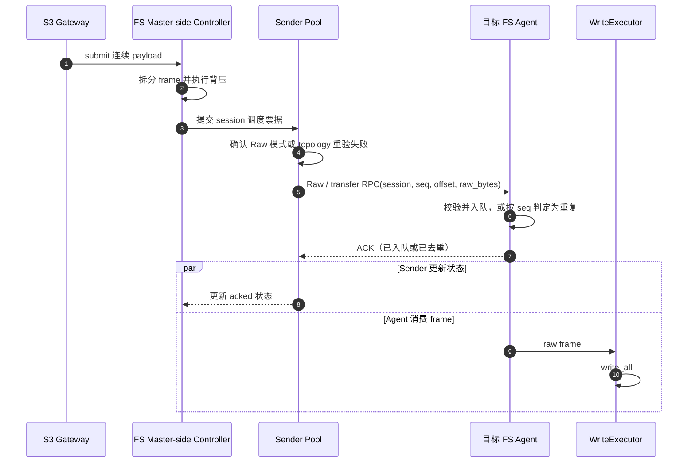

#### 4.4.4 KV-ref 失败后降级时序

KV-ref 尝试未获得匹配的成功 ACK 时，sender 使用相同 `seq`、offset 和原数据改走 Raw RPC。这个 session 之后不再尝试升级为 KV-ref。

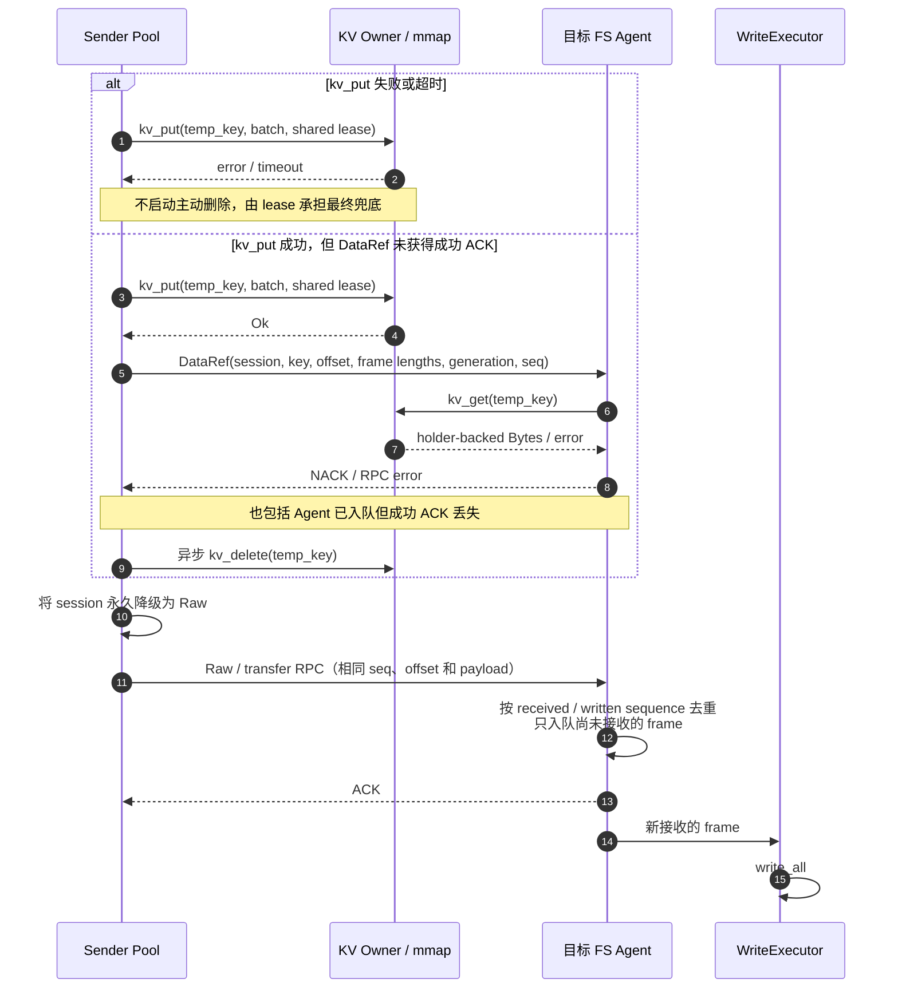

#### 4.4.5 finalize 时序

data ACK 只证明 frame 已入队或已被去重。`finalize` 是等待写入真正完成并设置最终文件长度的 completion barrier。

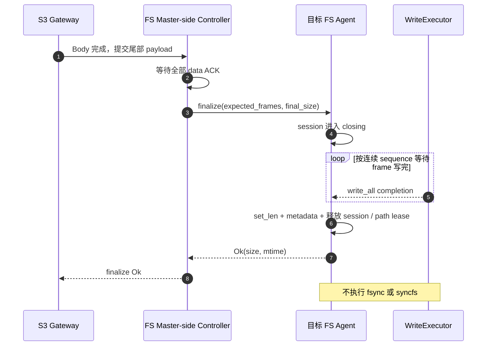

Controller 发送 batch 的核心实现是 `remote_write_session_send_batch_task`，Agent 的 KV-ref 入口是 `handle_write_session_data_ref_typed`，终态处理由 `handle_finalize_write_session_typed` 完成。

## 5. 共享 lease 与 keepalive

KV 临时 key 在传输过程中不能提前过期。FS Master 为此采用 Controller 级共享 lease：

- 第一个 KvShared session 以 single-flight 方式懒申请一个 `180 秒` lease；
- 同一 Controller 的后续 session 和 batch 复用同一个 `lease_id + generation`；
- keepalive 在上次成功后约 `60 秒 + 0～5 秒 jitter` 再执行；
- 单次 keepalive 最多等待 `10 秒`；
- session close、abort 或单 session 降级不会注销 lease；
- 即使暂时没有 session，也持续续租到 Controller shutdown。

keepalive 不阻塞任何单个 session，其独立时序如下：

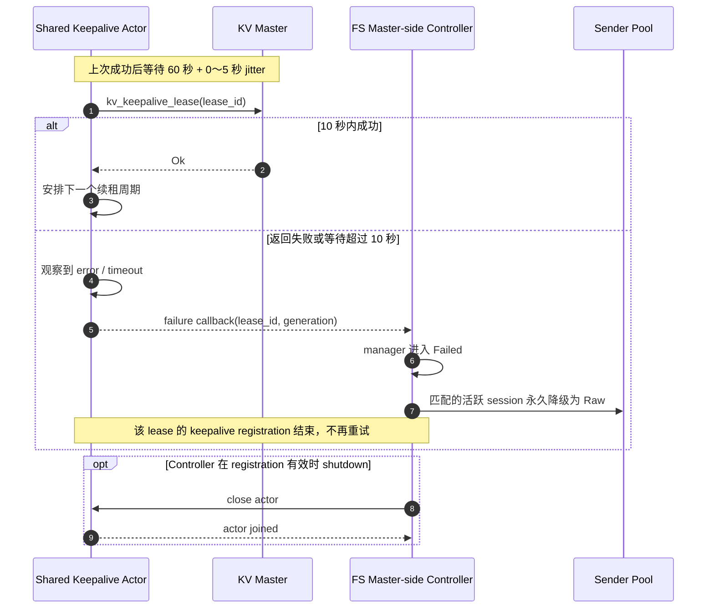

因此，一个 FS Master-side Controller 相对 session 数只维护 `O(1)` 个 lease、actor task/timer 和周期 keepalive RPC。它不是每 session 一个，也不是每目标 Agent 一个，更不是多个 FS Master 进程共享的全局单例。

FS 和 MQ 复用 `fluxon_util::lease_manager::LeaseKeepaliveActor` 的代码实现，但不共用同一个运行时 actor 实例或同一个 lease：

- FS 的共享 lease 失败后，所有仍匹配该 `lease_id + generation` 的 session 一起降级 raw；
- manager 随后保持 `Failed`，新 session 也直接走 raw，直到重建 Controller；
- MQ 仍保持自己的逐 lease 重试语义。

共享 lease 带来一个回收取舍：Controller 正常运行时 lease 会一直续租。每个临时 key 只有一次最长 1 秒的独立删除任务，没有内建自动重试。如果显式 `kv_delete` 失败，残留 key 不能立即依靠 TTL 回收；只能由外部清理，或在 Controller 停止续租后等待 lease 到期。

## 6. KV 缓存命中读取与 HTTP 传输

### 6.1 `GetObject` 的 holder-backed 缓存读取

S3 GET 的 KV 缓存命中路径不再先解码出完整 `FlatDict`。FS Master-side Controller 中的 `FluxonFsAgent` 直接调用 `kv_framework.kv_get` 取得 `Owner` 或 `External` holder，然后用 holder 构造 `Bytes`。`find_flat_dict_bytes_field_range` 会校验完整编码值并定位目标 bytes 字段，最后通过 `Bytes::slice` 得到 payload 视图。

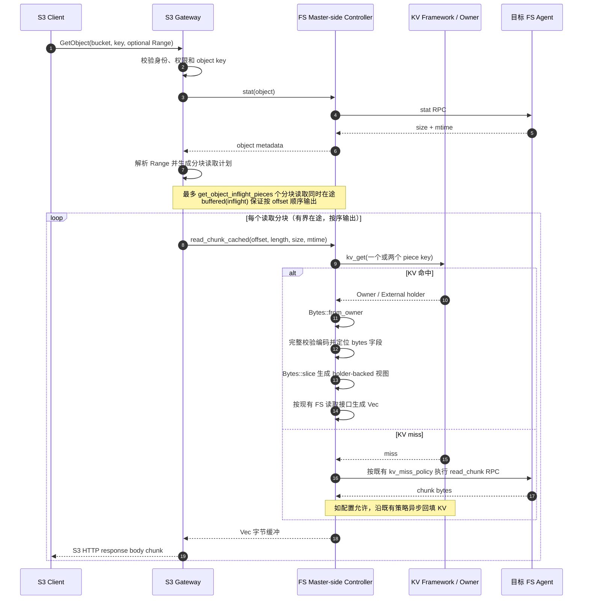

这项优化的边界如下：

- **减少的工作**：不再 materialize 完整 `FlatDict`，也不再先把目标 bytes 字段复制到中间 `Vec`。
- **仍然存在的工作**：编码值仍会完整扫描和校验；当前 FS 读取接口最终仍需生成 `Vec<u8>`，sync/async bridge 也仍然存在。因此这是 KV 命中数据提取层的局部少拷贝，不是从 KV 到 HTTP 的端到端零拷贝。
- **不变的语义**：KV miss 后的远端 FS 读取和回填策略保持不变。

### 6.2 `TCP_NODELAY`

FS Master 的 Axum HTTP listener 启用 `tcp_nodelay(true)`，即在 TCP 连接上禁用 Nagle 合并等待。这可避免小型 S3 响应的 headers 和 body 在 delayed ACK 交互下出现额外等待，主要改善小对象和小 Range GET 的响应延迟。

`TCP_NODELAY` 不改变 S3 HTTP 协议、对象内容和目录列举语义，也不直接减少大对象的读取拷贝。

## 7. 正确性与失败边界

- **连续写入**：同一 delivery barrier 之前，payload 必须按连续、无重叠 offset 提交。
- **准确长度**：`finalize` 将文件设置为实际对象长度，覆盖旧的较长对象时不会留下旧尾部。
- **安全引用**：Agent 在 `kv_get` 前校验 token、路径、session、frame 长度、Owner generation、nonce 和临时 key。
- **幂等重发**：Agent 根据 sequence 去重；部分 frame 已入队时，重发只补齐剩余 frame。
- **失败释放**：Body、submit 或 finalize 失败后执行尽力而为的 `abort_write_session`。
- **不保证内容回滚**：当前直接写最终路径，没有“临时文件 + 原子重命名”。abort 只释放 session，不恢复已经被覆盖的旧对象内容。

本次设计不改变 S3 HTTP 协议、目录列举、KV miss 和回填语义；GET 只改变 KV 命中时的 payload 提取方式和 HTTP 的 TCP 发送策略。

## 8. 关闭顺序

Agent 队列中的 holder 可能仍引用 KV mmap，因此不能先关闭 KV framework。Master-side Controller 与目标 Agent 是两个独立生命周期。

Controller 侧遵循：

```text
停止新的 write-session source operation
  → 关闭共享 lease manager 和 keepalive actor
  → fail 本地 session
  → 等待 source operation，join actor、sender 和 cleanup task
  → 尽力通知目标 Agent abort
  → shutdown FS framework
  → shutdown KV framework
```

目标 Agent 侧遵循：

```text
停止新的 session/data handler
  → abort session 并清空排队 frame
  → 等待活跃 writer 完成并释放 holder
  → shutdown FS framework
  → shutdown KV framework / munmap
```

Python/PyO3 路径也遵循 `source barrier → FS → KV`。如果前一阶段关闭失败，会保留依赖资源，而不是继续卸载仍可能被 writer 使用的 mmap。

## 9. 主要代码位置

| 文件 | 作用 |
| --- | --- |
| `fluxon_rs/fluxon_fs_core/src/s3_gateway.rs` | 定义 S3 的 `4 MiB` session 阈值 |
| `fluxon_rs/fluxon_fs_s3_gateway/src/lib.rs` | `HybridObjectWriter`，接入 `PutObject`、`UploadPart` 和 `CompleteMultipartUpload` |
| `fluxon_rs/fluxon_fs/src/master_http.rs` | 转发 S3 对象 I/O，并为 HTTP listener 启用 `TCP_NODELAY` |
| `fluxon_rs/fluxon_fs/src/agent.rs` | write-session 队列、sender、KV-ref/raw、共享 lease 和 holder-backed 缓存读取 |
| `fluxon_rs/fluxon_fs/src/write_session_rpc.rs` | small-put、Raw、KV-ref 和 finalize RPC |
| `fluxon_rs/fluxon_fs/src/agent_service.rs` | small-put、父目录创建、holder-backed frame、写队列和 finalize |
| `fluxon_rs/fluxon_kv/src/user_api/codec_flat_dict.rs` | 校验编码 `FlatDict` 并定位 bytes 字段范围 |
| `fluxon_rs/fluxon_util/src/lease_manager/keepalive_actor.rs` | FS/MQ 共用的 keepalive actor 实现 |
| `fluxon_rs/fluxon_pyo3/src/lib.rs` | Python FS 的 finalize 与安全关闭顺序 |

没有新增公开的 `put_start` / `put_commit` API，也没有新增一套 FS 专用 keepalive 模块。

## 10. 总结

FluxonFS S3 写入采用两级选择：小对象通过一次 `put_small_object` RPC 完成父目录创建、覆盖和写入，大对象复用通用 `write-session`；进入 session 后，再根据部署条件选择 KV-ref 或 Raw RPC。KV-ref 通过共享 mmap 和 holder 减少大 payload RPC 与 Agent 侧复制，Raw RPC 保证跨 Owner 和异常场景仍可正确写入。Controller 级共享 lease 将 lease 和 keepalive 开销控制为每 FS Master `O(1)`，有界队列、幂等 sequence、finalize 和严格关闭顺序共同保证写入正确性与资源安全。

S3 GET 在 KV 缓存命中时使用 holder-backed `Bytes` 定位 payload，减少 `FlatDict` 完整解码和中间拷贝；HTTP listener 通过 `TCP_NODELAY` 避免小响应的 Nagle/delayed-ACK 等待。这两项优化不改变 S3 协议和 KV miss 语义，也不构成端到端零拷贝。
