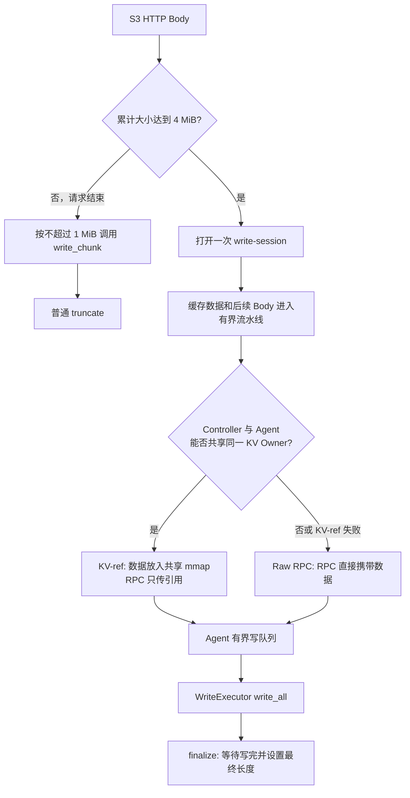
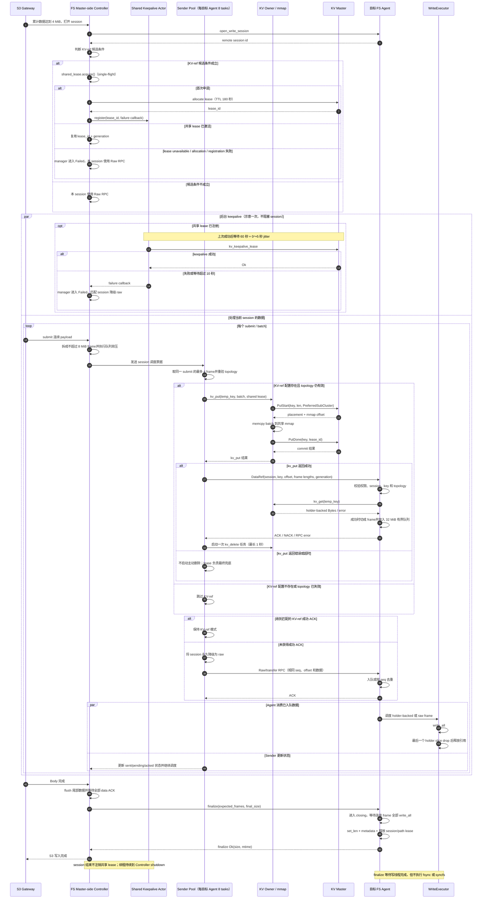

# FluxonFS S3 写入设计

本文说明 FluxonFS 如何处理 S3 写入，重点包括三部分：

1. S3 如何在小对象和大对象之间选择写入方式；
2. 大对象进入 `write-session` 后，如何通过 KV Shared Memory 或 Raw RPC 把数据送到 FS Agent；
3. 临时 KV key 使用的 lease 和 keepalive 如何管理。

这三部分是不同层次的选择，不应混为一谈：

| 层次 | 选择 | 目的 |
| --- | --- | --- |
| S3 写入策略 | `write_chunk` 或 `write-session` | 小对象减少固定开销，大对象使用流水线 |
| write-session 数据面 | KV-ref 或 Raw RPC | 条件允许时减少大数据 RPC 和 Agent 侧复制 |
| KV 生命周期 | Controller 共享 lease 和 keepalive | 防止传输中的临时 key 提前过期 |

KV Shared Memory 是通用 `write-session` 的优化，Python FS 也能复用；只有第一层的 `4 MiB` 切换策略属于 S3 Gateway。

## 1. 整体流程



主要角色如下：

- **S3 Gateway**：接收普通 PUT、UploadPart 和 CompleteMultipartUpload。
- **Master-side Controller**：FS Master 进程内的 `s3_agent` / `FluxonFsAgent` 客户端对象，管理 session、发送队列和 sender；它不是目标 FS Agent 进程。
- **目标 FS Agent**：打开目标文件，接收 frame，并通过 WriteExecutor 写入文件。
- **KV Owner**：管理共享 `mmap.file`、内存分配和 holder 生命周期。
- **KV Master**：管理 KV 元数据和放置；KV-ref 本地路径不会让它转发文件 payload。

## 2. S3 混合写入策略

### 2.1 为什么要区分小对象和大对象

原 S3 路径把 HTTP Body 拆成不超过 `1 MiB` 的数据块，每块执行一次 `write_chunk`。这种方式简单，适合小对象；大对象则会产生较多同步 RPC。

`write-session` 会为一个文件保持长生命周期 session，并通过有界队列持续提交数据。它更适合大对象，但打开 session、创建 sender 状态和结束 session 都有固定开销。

因此 S3 使用以下规则：

| 累计数据量 | 写入方式 | 完成方式 |
| --- | --- | --- |
| 小于 `4 MiB` | 暂存在内存，请求结束后按不超过 `1 MiB` 调用 `write_chunk` | 普通 `truncate` |
| 达到或超过 `4 MiB` | 打开一次 `write-session`，把之前缓存的数据和后续数据都交给 session | 一次 `finalize` |

阈值是在接收 Body 的过程中判断，不要求请求开始前知道对象大小。累计大小恰好达到 `4 MiB` 时也会切换到 session。

### 2.2 普通 PUT 和 Multipart

三类写入共用同一个混合写入器：

- 普通 `PUT Object`：按整个 Body 的累计大小选择路径；
- `UploadPart`：每个 part 按自身大小选择路径；
- `CompleteMultipartUpload`：重新按最终对象的累计大小选择路径。

因此，即使每个 part 都小于 `4 MiB`，只要合并后的对象达到阈值，最终对象仍会使用 `write-session`。

## 3. write-session 流水线

当前主要参数如下：

| 参数 | 当前值 |
| --- | ---: |
| S3 切换阈值 | `4 MiB` |
| 小对象 chunk 上限 | `1 MiB` |
| Gateway 首选 submit 大小 | `32 MiB` |
| logical frame 上限 | `8 MiB` |
| 单 batch | 最多 4 frame，约 `32 MiB` |
| Controller 单 session 默认在途窗口 | `128 MiB` |
| Agent 单 session 队列 | `32 MiB` |
| 每个目标 Agent 的 sender task | 8 |

数据进入 session 后：

1. Gateway 尽量按 `32 MiB` 向 Controller 提交数据；
2. Controller 把 payload 切成不超过 `8 MiB` 的 frame；
3. 同一次 submit 中、同一 session 的最多 4 个连续 frame 组成一个 batch；batch 不会混入其他 session 或目标 Agent 的 frame；
4. sender 按目标 Agent 发送 batch；
5. Agent 将 frame 放入有界队列；
6. WriteExecutor 逐个执行 `write_all`；
7. `finalize(expected_frames, final_size)` 等待所有预期 frame 写完，再设置最终文件长度并释放 session。

Controller 和 Agent 的队列都有字节上限。队列满时，上游会等待 sender 或 writer 消费数据；失败、abort 和 shutdown 也会唤醒等待者，避免大文件无限占用内存。

需要注意：

- 数据 RPC 的 ACK 只表示 frame 已经进入 Agent 队列或被判定为重复，不表示已经写入文件；
- `finalize` 才会等待 frame 真正 `write_all` 完成；
- `finalize` 不执行 `fsync` 或 `syncfs`，持久化时间需要由外部同步操作单独统计。

## 4. KV Shared Memory 数据面

### 4.1 何时使用 KV-ref

session 打开时先判断它是否具备 KV-ref 候选条件；每个 batch 发送前还会重新检查 topology、Owner 和 node generation。使用 KV-ref 需要同时满足：

- Controller 和目标 Agent 属于同一个 KV share group；
- 两端完整 Owner 引用一致，即 `owner_id + owner_start_time`；
- 两端 node generation 和当前 topology snapshot 一致；
- Agent 声明支持 `fluxon_fs_write_session_kv_ref_v1`；
- Owner 具有有效 sub-cluster，并能保证共享 Owner 内的本地放置。

只比较 `owner_id` 不够，因为 Owner 重启后 id 可能不变，但旧 mmap generation 已经失效。

任一条件不满足时直接使用 Raw RPC，不会先发送 KV-ref 请求做能力探测。已经使用 KV-ref 的 session 如果后续检查失败，会永久降级为 raw，不会在同一 session 内再次升级。这条路径不要求配置 RDMA。

### 4.2 KV-ref 的写入过程

每个 batch 的过程如下：

1. Controller 调用现有 `kv_put(temp_key, batch, lease)`；
2. KV Owner 把数据复制一次到共享 mmap；
3. Controller 通过引用 RPC 发送 session、key、offset、frame 边界、Owner generation 和 sequence，不携带文件 payload；
4. Agent 校验权限、session、generation 和 key 后调用 `kv_get(temp_key)`；
5. `kv_get` 返回 holder-backed `Bytes`，切分 frame 时只创建 slice，不复制到新的 Agent heap buffer；
6. Agent 将 frame 放入写队列并返回 ACK；
7. Controller 异步删除临时 key，Agent holder 继续固定底层 allocation；
8. 最后一个 slice 写完并释放 holder 后，mmap allocation 才可以回收。

因此这不是端到端零拷贝。准确说法是：

```text
仍然存在：Controller Bytes → KV mmap 的一次 memcpy
减少的是：大 payload RPC 及 Agent RPC buffer 的额外复制
```

### 4.3 Raw RPC 和自动降级

Raw RPC 指 RPC 直接携带数据本身：

```text
Controller batch → data RPC raw_bytes → Agent 写队列
```

以下情况会使用或降级到 Raw RPC：

- 两端不共享同一 Owner generation；
- Agent 不支持 KV-ref；
- `kv_put`、引用 RPC、`kv_get` 或校验失败；
- 共享 lease 分配或 keepalive 失败。

单 batch 的 KV-ref 失败后，Controller 会用相同 sequence、offset 和原数据通过 Raw RPC 重发，并让该 session 后续固定使用 raw。Agent 使用 received/written sequence 去重，因此 KV-ref 已入队但 ACK 丢失时不会重复写入。

### 4.4 当前实现的 Master–Agent 时序

下图按照当前代码的调用顺序绘制。共享 lease 在 session 打开后按需申请；sender 在发送每个 batch 前重新检查 KV-ref 条件；临时 key 清理和 Agent 写文件是两个独立过程。



图中 Controller 发送 batch 的核心实现是 `remote_write_session_send_batch_task`，Agent 的 KV-ref 入口是 `handle_write_session_data_ref_typed`，终态处理由 `handle_finalize_write_session_typed` 完成。

## 5. 共享 lease 与 keepalive

KV 临时 key 在传输过程中不能提前过期。FS Master 为此采用 Controller 级共享 lease：

- 第一个 KvShared session 以 single-flight 方式懒申请一个 `180 秒` lease；
- 同一 Controller 的后续 session 和 batch 复用同一个 `lease_id + generation`；
- keepalive 在上次成功后约 `60 秒 + 0～5 秒 jitter` 再执行；
- 单次 keepalive 最多等待 `10 秒`；
- session close、abort 或单 session 降级不会注销 lease；
- 即使暂时没有 session，也持续续租到 Controller shutdown。

因此，一个 FS Master-side Controller 相对 session 数只维护 `O(1)` 个 lease、actor task/timer 和周期 keepalive RPC。它不是每 session 一个，也不是每目标 Agent 一个，更不是多个 FS Master 进程共享的全局单例。

FS 和 MQ 复用 `fluxon_util::lease_manager::LeaseKeepaliveActor` 的代码实现，但不共用同一个运行时 actor 实例或同一个 lease：

- FS 的共享 lease 失败后，所有仍匹配该 `lease_id + generation` 的 session 一起降级 raw；
- manager 随后保持 `Failed`，新 session 也直接走 raw，直到重建 Controller；
- MQ 仍保持自己的逐 lease 重试语义。

共享 lease 带来一个回收取舍：Controller 正常运行时 lease 会一直续租。每个临时 key 只有一次最长 1 秒的独立删除任务，没有内建自动重试。如果显式 `kv_delete` 失败，残留 key 不能立即依靠 TTL 回收；只能由外部清理，或在 Controller 停止续租后等待 lease 到期。

## 6. 正确性与失败边界

- **连续写入**：同一 delivery barrier 之前，payload 必须按连续、无重叠 offset 提交。
- **准确长度**：`finalize` 将文件设置为实际对象长度，覆盖旧的较长对象时不会留下旧尾部。
- **安全引用**：Agent 在 `kv_get` 前校验 token、路径、session、frame 长度、Owner generation、nonce 和临时 key。
- **幂等重发**：Agent 根据 sequence 去重；部分 frame 已入队时，重发只补齐剩余 frame。
- **失败释放**：Body、submit 或 finalize 失败后执行尽力而为的 `abort_write_session`。
- **不保证内容回滚**：当前直接写最终路径，没有“临时文件 + 原子重命名”。abort 只释放 session，不恢复已经被覆盖的旧对象内容。

本次设计不改变 S3 HTTP 协议、GET、目录列举和缓存读取路径。

## 7. 关闭顺序

Agent 队列中的 holder 可能仍引用 KV mmap，因此不能先关闭 KV framework。Master-side Controller 与目标 Agent 是两个独立生命周期。

Controller 侧遵循：

```text
停止新的 write-session source operation
  → 关闭共享 lease manager 和 keepalive actor
  → fail 本地 session
  → 等待 source operation，join actor、sender 和 cleanup task
  → 尽力通知目标 Agent abort
  → shutdown FS framework
  → shutdown KV framework
```

目标 Agent 侧遵循：

```text
停止新的 session/data handler
  → abort session 并清空排队 frame
  → 等待活跃 writer 完成并释放 holder
  → shutdown FS framework
  → shutdown KV framework / munmap
```

Python/PyO3 路径也遵循 `source barrier → FS → KV`。如果前一阶段关闭失败，会保留依赖资源，而不是继续卸载仍可能被 writer 使用的 mmap。

## 8. 主要代码位置

| 文件 | 作用 |
| --- | --- |
| `fluxon_rs/fluxon_fs_core/src/s3_gateway.rs` | 定义 S3 的 `4 MiB` session 阈值 |
| `fluxon_rs/fluxon_fs_s3_gateway/src/lib.rs` | `HybridObjectWriter`，接入 PUT、UploadPart 和 Multipart 合并 |
| `fluxon_rs/fluxon_fs/src/master_http.rs` | 将 S3 session 操作转发到通用 FS Agent API |
| `fluxon_rs/fluxon_fs/src/agent.rs` | write-session 队列、sender、KV-ref/raw 选择、共享 lease 和降级 |
| `fluxon_rs/fluxon_fs/src/write_session_rpc.rs` | Raw、KV-ref 和 finalize RPC |
| `fluxon_rs/fluxon_fs/src/agent_service.rs` | Agent 校验、holder-backed frame、写队列和 finalize |
| `fluxon_rs/fluxon_util/src/lease_manager/keepalive_actor.rs` | FS/MQ 共用的 keepalive actor 实现 |
| `fluxon_rs/fluxon_pyo3/src/lib.rs` | Python FS 的 finalize 与安全关闭顺序 |

没有新增公开的 `put_start` / `put_commit` API，也没有新增一套 FS 专用 keepalive 模块。

## 9. 总结

FluxonFS S3 写入采用两级选择：小对象保留简单的 `write_chunk`，大对象复用通用 `write-session`；进入 session 后，再根据部署条件选择 KV-ref 或 Raw RPC。KV-ref 通过共享 mmap 和 holder 减少大 payload RPC 与 Agent 侧复制，Raw RPC 则保证跨 Owner、旧 Agent 和异常场景仍可正确写入。Controller 级共享 lease 将 lease 和 keepalive 开销控制为每 FS Master `O(1)`，有界队列、幂等 sequence、finalize 和严格关闭顺序共同保证写入正确性与资源安全。
