# FluxonFS S3 对象 I/O 设计

本文按 S3 接口和内部数据路径两层展开 FluxonFS 当前的对象 I/O 设计：

1. 分别说明 `PutObject`、`CreateMultipartUpload`、`UploadPart`、`CompleteMultipartUpload` 和 `AbortMultipartUpload` 的接口级时序；
2. 将大对象 `write-session` 内部的 session 打开、KV-ref、Raw RPC 降级和 finalize 分开说明；
3. 说明临时 KV key 使用的 lease 和 keepalive 如何管理；
4. 单独说明 `GetObject` 在 KV 缓存命中时的数据拷贝边界，以及 S3 HTTP 响应的小包延迟优化；
5. 说明临时 KV key 的最终回收者，以及 FS、KV、Python 和后台 actor 之间的可重试关闭契约。

前三项构成写入链路的三个主层次，临时 key 回收和关闭依赖横跨数据面与运行时；缓存命中读取和 HTTP 传输是两个独立的 I/O 优化点：

| 层次 | 选择 | 目的 |
| --- | --- | --- |
| S3 写入策略 | `put_small_object` 或 `write-session` | 小对象合并为一次 RPC，大对象使用流水线 |
| write-session 数据面 | KV-ref 或 Raw RPC | 条件允许时减少大数据 RPC 和 Agent 侧复制 |
| KV 生命周期 | Controller 共享 lease 和 keepalive | 防止传输中的临时 key 提前过期 |
| 临时 key 回收 | Controller-owned cleanup actor | 在 put 结果不确定和 delete 失败时持续收敛 |
| S3 读取路径 | holder-backed `Bytes` | KV 缓存命中时避免完整解码 `FlatDict` |
| HTTP 传输 | `TCP_NODELAY` | 避免小响应 body 被 Nagle 算法延迟 |
| 关闭依赖 | FS 先于 KV，actor 先停 admission 再 join | 证明 holder 释放后才允许 KV unmap |

KV Shared Memory 是通用 `write-session` 的优化，Python FS 也能复用；在写入链路的三个层次中，只有 `4 MiB` 切换策略属于 S3 Gateway。

## 1. 接口与内部链路索引

| S3 接口 | 本文关注的行为 | 是否进入混合写入器 |
| --- | --- | --- |
| `PutObject` | 把 HTTP Body 写入最终对象 | 是，按整个 Body 的累计大小选择 |
| `CreateMultipartUpload` | 创建 `upload_id` 和 multipart 元数据 | 否，只写控制元数据 |
| `UploadPart` | 把一个 part 写入内部临时路径 | 是，每个 part 独立选择 |
| `CompleteMultipartUpload` | 校验并按顺序读取 part，组装最终对象 | 是，按最终对象的累计大小选择 |
| `AbortMultipartUpload` | 删除 multipart 临时文件和目录 | 否，只执行清理 |
| `GetObject` | 按 Range 切分读取，符合缓存条件时优先查询 KV | 不适用 |

`HeadObject`、列举和删除等接口不经过混合写入器，也不涉及本文的 KV 命中 payload 提取，因此不展开它们的时序。

主要角色如下：

- **S3 Gateway**：接收 S3 对象 I/O 和 multipart 控制请求，并维护每个请求的混合写入器。
- **本地 `FluxonFsAgent` Controller**：调用方进程内的路由与会话客户端；在 S3 路径中，它和 Gateway 同处 FS Master 进程，管理 export 节点快照、session、发送队列和 sender。
- **目标 FS Agent**：打开目标文件，接收 frame，并通过 WriteExecutor 写入文件。
- **KV Owner**：管理共享 `mmap.file`、内存分配和 holder 生命周期。
- **KV Master**：管理 KV 元数据和放置；KV-ref 本地路径不会让它转发文件 payload。

S3 请求的常态路径不会逐次查询中心 FS Master。`FluxonFsAgent` Controller 按 export 使用静态节点配置或缓存的在线 Agent 快照，以 round-robin 选择一个节点后直接发起 Agent RPC；只有 `agent_registry` 快照过期或命中 `NodeNotFound` 时，才向 FS Master export registry 刷新快照。路由不能直接使用未按 export 过滤的集群成员列表，因为其中可能包含没有提供该 bucket/export 的 Agent。write-session 打开后会固定目标 Agent，直到 finalize 或 abort。

时序图统一使用以下表达：`par / and` 分支表示真实并发；不在 `par` 内的“请求 → 返回 → 下一请求”表示顺序等待；`loop` 只表示重复。动态 inflight 窗口用 `par` 画出代表性的同时在途操作，并在 note 中标明实际上限。

## 2. S3 混合写入策略

### 2.1 为什么要区分小对象和大对象

原 S3 路径先逐级执行父目录 `stat/mkdir`，再把 HTTP Body 拆成不超过 `1 MiB` 的数据块调用 `write_chunk`，最后执行 `truncate`。小对象的数据传输很快，这些同步 RPC 的固定开销反而更明显；大对象还会产生更多数据 RPC。

`write-session` 会为一个文件保持长生命周期 session，并通过有界队列持续提交数据。它更适合大对象，但打开 session、创建 sender 状态和结束 session 都有固定开销。

因此 S3 使用以下规则：

| 累计数据量 | 写入方式 | 完成方式 |
| --- | --- | --- |
| 小于 `4 MiB` | 暂存在内存，请求结束后调用一次 `put_small_object` | Agent 在同一 RPC 内创建父目录、覆盖并写完整文件 |
| 达到或超过 `4 MiB` | 以 `create_parents=true` 打开一次 `write-session`，把之前缓存的数据和后续数据都交给 session | 一次 `finalize` |

阈值是在接收 Body 的过程中判断，不要求请求开始前知道对象大小。累计大小恰好达到 `4 MiB` 时也会切换到 session。

`FsS3Backend` 中 small-put 和 write-session 是两项独立的可选能力。没有 write-session 能力时，所有对象保留原有的“创建父目录 → 分块 `write_chunk` → `truncate`”路径；有 write-session 但没有 small-put 时，大对象仍使用 session，小对象在 `finish()` 时回退到 `write_chunk + truncate`。只有两项能力都存在时，Gateway 才可跳过前置父目录 RPC 并完整使用上表策略。当前 `FsS3BackendAgent` 同时支持两项能力。

`put_small_object` 不只是一次 payload RPC。目标 Agent 还会校验 write 和 truncate 权限，按层校验并创建缺失的 `0755` 父目录，获取目标 path 的独占写入权，然后以 `create + truncate + write_all` 覆盖文件。已存在父目录的 mode 不会被改写，payload 达到 `4 MiB` 会被 Agent 拒绝。

### 2.2 `PutObject` 时序

`PutObject` 直接以 HTTP Body 驱动一个 `HybridObjectWriter`。大小未达阈值时数据留在 Gateway 内存；首次达到 `4 MiB` 时打开 session，并把已缓存数据与后续 Body 一起提交。`buffer_write_session_payload` 返回 `accepted` 只表示 payload 已被 Controller 有界队列接纳；sender 和 Agent 写队列在后台继续消费，写盘完成由 `finalize` 汇合。

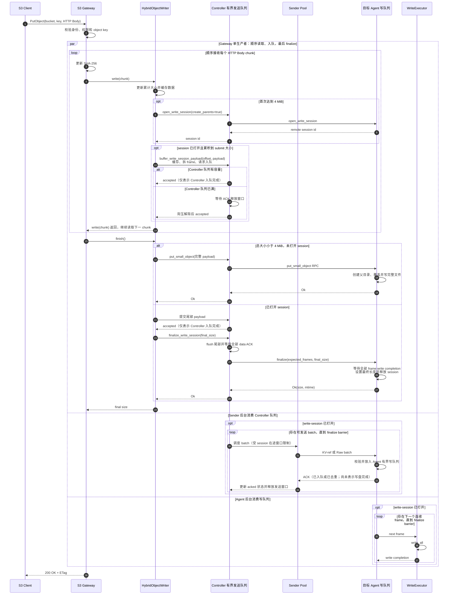
```mermaid
sequenceDiagram
    autonumber
    participant U as S3 Client
    participant G as S3 Gateway
    participant H as HybridObjectWriter
    participant C as Controller 有界发送队列
    participant S as Sender Pool
    participant A as 目标 Agent 写队列
    participant W as WriteExecutor

    U->>G: PutObject(bucket, key, HTTP Body)
    G->>G: 校验身份、权限和 object key
    par Gateway 单生产者：顺序读取、入队，最后 finalize
        loop 顺序接收每个 HTTP Body chunk
            G->>G: 更新 SHA-256
            G->>H: write(chunk)
            H->>H: 更新累计大小并缓存数据
            opt 首次达到 4 MiB
                H->>C: open_write_session(create_parents=true)
                C->>A: open_write_session
                A-->>C: remote session id
                C-->>H: session id
            end
            opt session 已打开且累积到 submit 大小
                H->>C: buffer_write_session_payload(offset, payload)<br/>缓存、拆 frame、请求入队
                alt Controller 队列有容量
                    C-->>H: accepted（仅表示 Controller 入队完成）
                else Controller 队列已满
                    C->>C: 等待 ACK 释放窗口
                    C-->>H: 背压解除后 accepted
                end
            end
            H-->>G: write(chunk) 返回，继续读取下一 chunk
        end

        G->>H: finish()
        alt 总大小小于 4 MiB，未打开 session
            H->>C: put_small_object(完整 payload)
            C->>A: put_small_object RPC
            A->>A: 创建父目录、覆盖并写完整文件
            A-->>C: Ok
            C-->>H: Ok
        else 已打开 session
            H->>C: 提交尾部 payload
            C-->>H: accepted（仅表示 Controller 入队完成）
            H->>C: finalize_write_session(final_size)
            C->>C: flush 尾部并等待全部 data ACK
            C->>A: finalize(expected_frames, final_size)
            A->>A: 等待全部 frame write completion<br/>设置最终长度并释放 session
            A-->>C: Ok(size, mtime)
            C-->>H: Ok
        end
        H-->>G: final size
    and Sender 后台消费 Controller 队列
        opt write-session 已打开
            loop 存在可发送 batch，直到 finalize barrier
                C->>S: 调度 batch（受 session 在途窗口限制）
                S->>A: KV-ref 或 Raw batch
                A->>A: 校验并放入 Agent 有界写队列
                A-->>S: ACK（已入队或已去重；尚未表示写盘完成）
                S-->>C: 更新 acked 状态并释放发送窗口
            end
        end
    and Agent 后台消费写队列
        opt write-session 已打开
            loop 存在下一个连续 frame，直到 finalize barrier
                A->>W: next frame
                W->>W: write_all
                W-->>A: write completion
            end
        end
    end

    G-->>U: 200 OK + ETag
```

三个 `par` 分支真实并发：Gateway 保持单一有序生产者；`accepted` 后 sender 可以发送已入队 batch，Gateway 也可以继续读取下一 Body chunk；Agent 收到 batch 后再由 `WriteExecutor` 消费。详细的 KV-ref、Raw 和降级分支见 4.4 节。

Body 读取、submit 或 finalize 失败时，Gateway 会对已打开的 session 执行尽力而为的 `abort_write_session`。

### 2.3 `CreateMultipartUpload` 时序

`CreateMultipartUpload` 只建立 multipart 控制状态，不创建最终对象，也不打开 `write-session`。

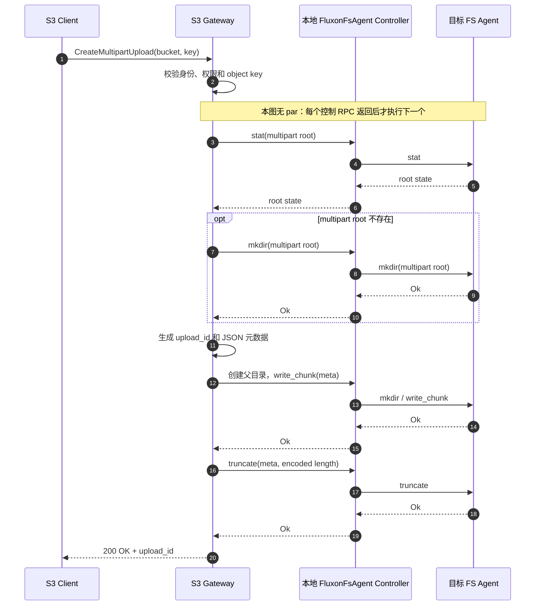
```mermaid
sequenceDiagram
    autonumber
    participant U as S3 Client
    participant G as S3 Gateway
    participant C as 本地 FluxonFsAgent Controller
    participant A as 目标 FS Agent

    U->>G: CreateMultipartUpload(bucket, key)
    G->>G: 校验身份、权限和 object key
    Note over G,A: 本图无 par：每个控制 RPC 返回后才执行下一个
    G->>C: stat(multipart root)
    C->>A: stat
    A-->>C: root state
    C-->>G: root state
    opt multipart root 不存在
        G->>C: mkdir(multipart root)
        C->>A: mkdir(multipart root)
        A-->>C: Ok
        C-->>G: Ok
    end
    G->>G: 生成 upload_id 和 JSON 元数据
    G->>C: 创建父目录，write_chunk(meta)
    C->>A: mkdir / write_chunk
    A-->>C: Ok
    C-->>G: Ok
    G->>C: truncate(meta, encoded length)
    C->>A: truncate
    A-->>C: Ok
    C-->>G: Ok
    G-->>U: 200 OK + upload_id
```

### 2.4 `UploadPart` 时序

每个 part 有独立的 `HybridObjectWriter`，因此 `4 MiB` 阈值按 part 自身大小判断。part 写完后，Gateway 另外保存 SHA-256 ETag sidecar，供 `CompleteMultipartUpload` 阶段校验。

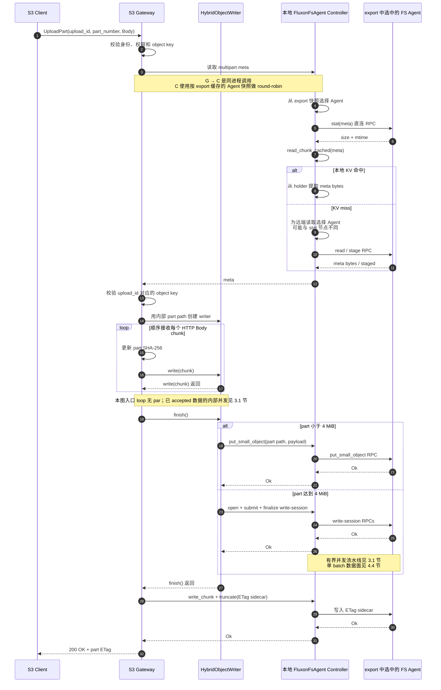
```mermaid
sequenceDiagram
    autonumber
    participant U as S3 Client
    participant G as S3 Gateway
    participant H as HybridObjectWriter
    participant C as 本地 FluxonFsAgent Controller
    participant A as export 中选中的 FS Agent

    U->>G: UploadPart(upload_id, part_number, Body)
    G->>G: 校验身份、权限和 object key
    G->>C: 读取 multipart meta
    Note over G,C: G → C 是同进程调用<br/>C 使用按 export 缓存的 Agent 快照做 round-robin
    C->>C: 从 export 快照选择 Agent
    C->>A: stat(meta) 直连 RPC
    A-->>C: size + mtime
    C->>C: read_chunk_cached(meta)
    alt 本地 KV 命中
        C->>C: 从 holder 提取 meta bytes
    else KV miss
        C->>C: 为远端读取选择 Agent<br/>可能与 stat 节点不同
        C->>A: read / stage RPC
        A-->>C: meta bytes / staged
    end
    C-->>G: meta
    G->>G: 校验 upload_id 对应的 object key
    G->>H: 用内部 part path 创建 writer
    loop 顺序接收每个 HTTP Body chunk
        G->>G: 更新 part SHA-256
        G->>H: write(chunk)
        H-->>G: write(chunk) 返回
    end
    Note over G,H: 本图入口 loop 无 par；已 accepted 数据的内部并发见 3.1 节
    G->>H: finish()
    alt part 小于 4 MiB
        H->>C: put_small_object(part path, payload)
        C->>A: put_small_object RPC
        A-->>C: Ok
        C-->>H: Ok
    else part 达到 4 MiB
        H->>C: open + submit + finalize write-session
        C->>A: write-session RPCs
        A-->>C: Ok
        C-->>H: Ok
        Note over C,A: 有界并发流水线见 3.1 节<br/>单 batch 数据面见 4.4 节
    end
    H-->>G: finish() 返回
    G->>C: write_chunk + truncate(ETag sidecar)
    C->>A: 写入 ETag sidecar
    A-->>C: Ok
    C-->>G: Ok
    G-->>U: 200 OK + part ETag
```

### 2.5 `CompleteMultipartUpload` 时序

complete 阶段会重新读取并串联所有 part。最终 writer 的累计大小是所有 part 之和，与各 part 在 upload 阶段选择了 small-put 还是 `write-session` 无关。

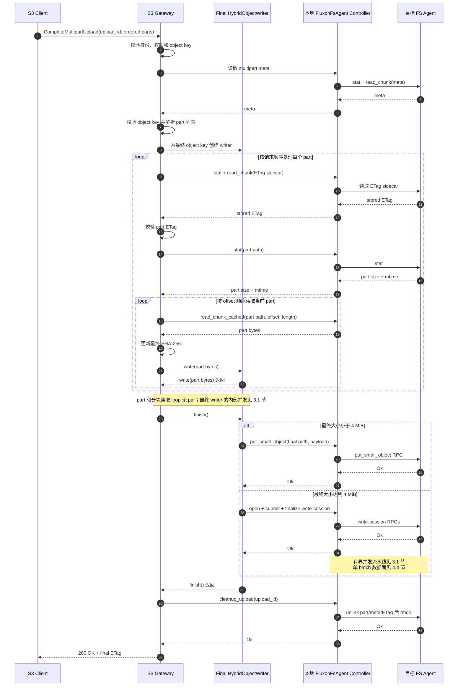
```mermaid
sequenceDiagram
    autonumber
    participant U as S3 Client
    participant G as S3 Gateway
    participant H as Final HybridObjectWriter
    participant C as 本地 FluxonFsAgent Controller
    participant A as 目标 FS Agent

    U->>G: CompleteMultipartUpload(upload_id, ordered parts)
    G->>G: 校验身份、权限和 object key
    G->>C: 读取 multipart meta
    C->>A: stat + read_chunk(meta)
    A-->>C: meta
    C-->>G: meta
    G->>G: 校验 object key 并解析 part 列表
    G->>H: 为最终 object key 创建 writer

    loop 按请求顺序处理每个 part
        G->>C: stat + read_chunk(ETag sidecar)
        C->>A: 读取 ETag sidecar
        A-->>C: stored ETag
        C-->>G: stored ETag
        G->>G: 校验 part ETag
        G->>C: stat(part path)
        C->>A: stat
        A-->>C: part size + mtime
        C-->>G: part size + mtime
        loop 按 offset 顺序读取当前 part
            G->>C: read_chunk_cached(part path, offset, length)
            C-->>G: part bytes
            G->>G: 更新最终 SHA-256
            G->>H: write(part bytes)
            H-->>G: write(part bytes) 返回
        end
    end
    Note over G,H: part 和分块读取 loop 无 par；最终 writer 的内部并发见 3.1 节

    G->>H: finish()
    alt 最终大小小于 4 MiB
        H->>C: put_small_object(final path, payload)
        C->>A: put_small_object RPC
        A-->>C: Ok
        C-->>H: Ok
    else 最终大小达到 4 MiB
        H->>C: open + submit + finalize write-session
        C->>A: write-session RPCs
        A-->>C: Ok
        C-->>H: Ok
        Note over C,A: 有界并发流水线见 3.1 节<br/>单 batch 数据面见 4.4 节
    end
    H-->>G: finish() 返回
    G->>C: cleanup_upload(upload_id)
    C->>A: unlink part/meta/ETag 后 rmdir
    A-->>C: Ok
    C-->>G: Ok
    G-->>U: 200 OK + final ETag
```

即使每个 part 都小于 `4 MiB`，只要合并后的对象达到阈值，最终对象仍会使用 `write-session`。组装或 finalize 失败时，Gateway 会对已打开的最终 writer 执行 `abort_write_session`，但不清理 multipart 临时数据，便于客户端重试或显式取消。

### 2.6 `AbortMultipartUpload` 时序

`AbortMultipartUpload` 清理 multipart 临时状态，不会修改已存在的最终对象。

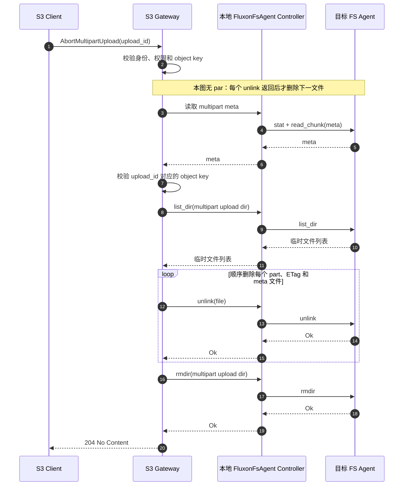
```mermaid
sequenceDiagram
    autonumber
    participant U as S3 Client
    participant G as S3 Gateway
    participant C as 本地 FluxonFsAgent Controller
    participant A as 目标 FS Agent

    U->>G: AbortMultipartUpload(upload_id)
    G->>G: 校验身份、权限和 object key
    Note over G,A: 本图无 par：每个 unlink 返回后才删除下一文件
    G->>C: 读取 multipart meta
    C->>A: stat + read_chunk(meta)
    A-->>C: meta
    C-->>G: meta
    G->>G: 校验 upload_id 对应的 object key
    G->>C: list_dir(multipart upload dir)
    C->>A: list_dir
    A-->>C: 临时文件列表
    C-->>G: 临时文件列表
    loop 顺序删除每个 part、ETag 和 meta 文件
        G->>C: unlink(file)
        C->>A: unlink
        A-->>C: Ok
        C-->>G: Ok
    end
    G->>C: rmdir(multipart upload dir)
    C->>A: rmdir
    A-->>C: Ok
    C-->>G: Ok
    G-->>U: 204 No Content
```

## 3. write-session 流水线

当前主要参数如下：

| 参数 | 当前值 |
| --- | ---: |
| S3 切换阈值 | `4 MiB` |
| small-put raw payload 上限 | 小于 `4 MiB` |
| Gateway 首选 submit 大小 | `32 MiB` |
| logical frame 上限 | `8 MiB` |
| 单 batch | 最多 4 frame，约 `32 MiB` |
| Controller 单 session 默认在途窗口 | `128 MiB` |
| Agent 单 session 队列 | `32 MiB` |
| 每个目标 Agent 的 sender task | 4 |
| DataRef / legacy chunk RPC 超时 | `10s + 1s/MiB`，上限 `240s` |
| Raw / transfer data RPC 超时 | `10s + 0.5s/MiB`，上限 `120s` |
| finalize / wait / abort 控制 RPC 超时 | `240s` |

数据进入 session 后：

1. Gateway 尽量按 `32 MiB` 向 Controller 提交数据；
2. Controller 把 payload 切成不超过 `8 MiB` 的 frame；
3. 同一次 submit 中、同一 session 的最多 4 个连续 frame 组成一个 batch；batch 不会混入其他 session 或目标 Agent 的 frame；
4. sender 按目标 Agent 发送 batch；
5. Agent 将 frame 放入有界队列；
6. WriteExecutor 逐个执行 `write_all`；
7. `finalize(expected_frames, final_size)` 等待所有预期 frame 写完，再设置最终文件长度并释放 session。

### 3.1 有界并发流水线

下图中三个外层 `par` 分支会同时运行：Gateway 顺序生产 payload，sender pool 并发发送 batch，WriteExecutor 按连续 sequence 消费 frame。sender 分支内的 `par` 画出同一时刻可在途的多个 batch。

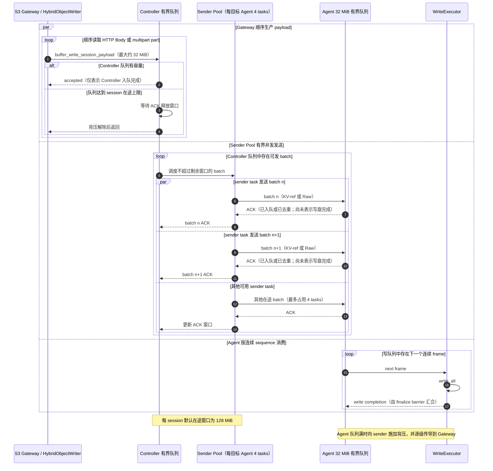
```mermaid
sequenceDiagram
    autonumber
    participant G as S3 Gateway / HybridObjectWriter
    participant C as Controller 有界队列
    participant S as Sender Pool（每目标 Agent 4 tasks）
    participant A as Agent 32 MiB 有界队列
    participant W as WriteExecutor

    par Gateway 顺序生产 payload
        loop 顺序读取 HTTP Body 或 multipart part
            G->>C: buffer_write_session_payload（最大约 32 MiB）
            alt Controller 队列有容量
                C-->>G: accepted（仅表示 Controller 入队完成）
            else 队列达到 session 在途上限
                C->>C: 等待 ACK 释放窗口
                C-->>G: 背压解除后返回
            end
        end
    and Sender Pool 有界并发发送
        loop Controller 队列中存在可发 batch
            C->>S: 调度不超过剩余窗口的 batch
            par sender task 发送 batch n
                S->>A: batch n（KV-ref 或 Raw）
                A-->>S: ACK（已入队或已去重；尚未表示写盘完成）
                S-->>C: batch n ACK
            and sender task 发送 batch n+1
                S->>A: batch n+1（KV-ref 或 Raw）
                A-->>S: ACK（已入队或已去重；尚未表示写盘完成）
                S-->>C: batch n+1 ACK
            and 其他可用 sender task
                S->>A: 其他在途 batch（最多占用 4 tasks）
                A-->>S: ACK
                S-->>C: 更新 ACK 窗口
            end
        end
    and Agent 按连续 sequence 消费
        loop 写队列中存在下一个连续 frame
            A->>W: next frame
            W->>W: write_all
            W-->>A: write completion（由 finalize barrier 汇合）
        end
    end

    Note over C,S: 每 session 默认在途窗口为 128 MiB
    Note over A,W: Agent 队列满时向 sender 施加背压，并逐级传导到 Gateway
```

Controller 和 Agent 的队列都有字节上限。队列满时，上游会等待 sender 或 writer 消费数据；失败、abort 和 shutdown 也会唤醒等待者，避免大文件无限占用内存。

Gateway 接收 HTTP Body 和 `CompleteMultipartUpload` 读取临时 part 的入口 loop 是顺序的；`buffer_write_session_payload` 把数据放入 Controller 有界队列后即可返回。后续 batch 发送可以并发在途，受每 session 默认 `128 MiB` 窗口、每目标 Agent 4 个 sender task 和 Agent `32 MiB` 队列共同限流。因此，入口顺序提交不等于等待每个 batch 写盘后才提交下一个。

需要注意：

- 数据 RPC 的 ACK 只表示 frame 已经进入 Agent 队列或被判定为重复，不表示已经写入文件；
- `finalize` 才会等待 frame 真正 `write_all` 完成；
- `finalize` 不执行 `fsync` 或 `syncfs`，持久化时间需要由外部同步操作单独统计。

Controller 尽量保留调用方的 `Bytes` 作为 submit owner：整块 submit 通过 slice 拆 frame，只有补齐一个未满 submit 的边界数据需要拷贝到 staging buffer。一个超过配置窗口的单次 submit 也可被接纳，队列上限至少放容当前 submit，防止超大 submit 在入队前永久等待自己释放容量。

### 3.2 Python 远程文件的 close

Python patcher 与 S3 共用同一个 Controller write-session。远程文件 `close()` 现在直接调用带 `final_size` 的 `finalize`；Controller 在该调用内部 flush 尾部 buffer、等待全部 data ACK，再进入 Agent completion barrier。

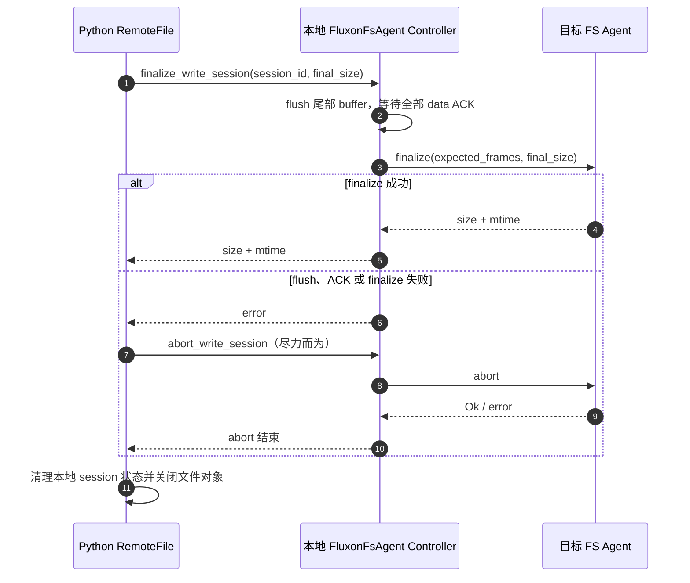
```mermaid
sequenceDiagram
    autonumber
    participant P as Python RemoteFile
    participant C as 本地 FluxonFsAgent Controller
    participant A as 目标 FS Agent

    P->>C: finalize_write_session(session_id, final_size)
    C->>C: flush 尾部 buffer，等待全部 data ACK
    C->>A: finalize(expected_frames, final_size)
    alt finalize 成功
        A-->>C: size + mtime
        C-->>P: size + mtime
    else flush、ACK 或 finalize 失败
        C-->>P: error
        P->>C: abort_write_session（尽力而为）
        C->>A: abort
        A-->>C: Ok / error
        C-->>P: abort 结束
    end
    P->>P: 清理本地 session 状态并关闭文件对象
```

finalize 失败时必须进入 abort 分支；abort 本身的失败不覆盖原始 finalize 错误。

## 4. KV Shared Memory 数据面

### 4.1 何时使用 KV-ref

session 打开时先判断它是否具备 KV-ref 候选条件；每个 batch 发送前还会重新检查 topology、Owner 和 node generation。使用 KV-ref 需要同时满足：

- Controller 和目标 Agent 属于同一个 KV share group；
- 两端完整 Owner 引用一致，即 `owner_id + owner_start_time`；
- 该 Owner generation 对应当前仍在线的 KV Client 节点；
- 两端 node generation 和当前 topology snapshot 一致；
- Agent 声明支持 `fluxon_fs_write_session_kv_ref_v1`；
- Owner 具有有效 sub-cluster，并能保证共享 Owner 内的本地放置；
- 如果当前 cluster 的 client 放置范围要求 SSD，该 Owner 还必须声明 `kv_ssd_storage`。

只比较 `owner_id` 不够，因为 Owner 重启后 id 可能不变，但旧 mmap generation 已经失效。

任一条件不满足时直接使用 Raw RPC，不会先发送 KV-ref 请求做能力探测。已经使用 KV-ref 的 session 如果后续检查失败，会永久降级为 raw，不会在同一 session 内再次升级。这条路径不要求配置 RDMA。

### 4.2 KV-ref 的写入过程

每个 batch 的过程如下：

1. Controller 在 put 开始前先向 cleanup actor 注册 `temp_key + lease_id`；
2. cleanup actor 作为 put future 和 key 的唯一最终回收者，执行 `kv_put(temp_key, batch, lease)`；
3. KV Owner 把数据复制一次到共享 mmap；
4. put 确认成功后，Controller 通过引用 RPC 发送 session、key、offset、frame 边界、Owner generation 和 sequence，不携带文件 payload；
5. Agent 校验权限、session、generation 和 key 后调用 `kv_get(temp_key)`，单次 get 最长等待 `10 秒`；
6. `kv_get` 返回 holder-backed `Bytes`，切分 frame 时只创建 slice，不复制到新的 Agent heap buffer；
7. Agent 将 frame 放入写队列并返回 ACK；
8. sender 放下 cleanup ticket 只表示不再借用 key，cleanup actor 随后负责 delete 及重试；
9. Agent holder 可在 key 删除后继续固定底层 allocation；最后一个 slice 写完并释放 holder 后，mmap allocation 才可以回收。

因此这不是端到端零拷贝。准确说法是：

```text
仍然存在：Controller Bytes → KV mmap 的一次 memcpy
减少的是：大 payload RPC 及 Agent RPC buffer 的额外复制
```

### 4.3 Raw RPC 和自动降级

Raw RPC 指 RPC 直接携带数据本身：

```text
Controller batch → data RPC raw_bytes → Agent 写队列
```

以下情况会使用或降级到 Raw RPC：

- 两端不共享同一 Owner generation；
- Agent 不支持 KV-ref；
- `kv_put`、引用 RPC、`kv_get` 或校验失败；
- 共享 lease 分配或 keepalive 失败。

单 batch 的 KV-ref 失败后，Controller 会用相同 sequence、offset 和原数据通过 Raw RPC 重发，并让该 session 后续固定使用 raw。Agent 使用 received/written sequence 去重，因此 KV-ref 已入队但 ACK 丢失时不会重复写入。

### 4.4 当前实现的 Master–Agent 时序

当前实现按职责拆成五个时序：session 打开、KV-ref 成功、直接 Raw RPC、KV-ref 失败降级和 finalize。后台 keepalive 是独立生命周期，放在第 5 节说明。

#### 4.4.1 打开 session 并选择候选数据面

session 打开时只确定 KV-ref 候选资格。sender 在每个 batch 发送前还会重验 topology，因此候选资格不代表后续 batch 一定使用 KV-ref。


```mermaid
sequenceDiagram
    autonumber
    participant G as S3 Gateway
    participant C as 本地 FluxonFsAgent Controller
    participant A as 目标 FS Agent
    participant M as KV Master
    participant K as Shared Keepalive Actor

    G->>C: open_write_session(path, create_parents=true)
    C->>A: open_write_session
    A->>A: 打开文件并创建有界写队列
    A-->>C: remote session id
    C->>C: 检查 share group、Owner generation、topology 和 capability

    alt 不具备 KV-ref 候选条件
        C->>C: 记录 Raw 模式
    else 具备 KV-ref 候选条件
        C->>C: shared_lease.acquire()（single-flight）
        alt 共享 lease 已激活
            C->>C: 复用 lease_id + generation
        else 需要首次申请
            C->>M: allocate lease(TTL=180s)
            alt 申请并注册成功
                M-->>C: lease_id
                C->>K: register(lease_id, failure callback)
                K-->>C: registered
            else 申请或注册失败
                C->>C: manager 进入 Failed，记录 Raw 模式
            end
        end
    end
    C-->>G: local session handle
    Note over C,K: session 结束不注销共享 lease
```

#### 4.4.2 KV-ref batch 成功时序

sender 仅在发送当前 batch 前的重验仍成功时进入这条路径。临时 key 在 put 前就被 cleanup actor 记录；CleanupTicket 只保护 sender 借用期，不拥有最终删除权。

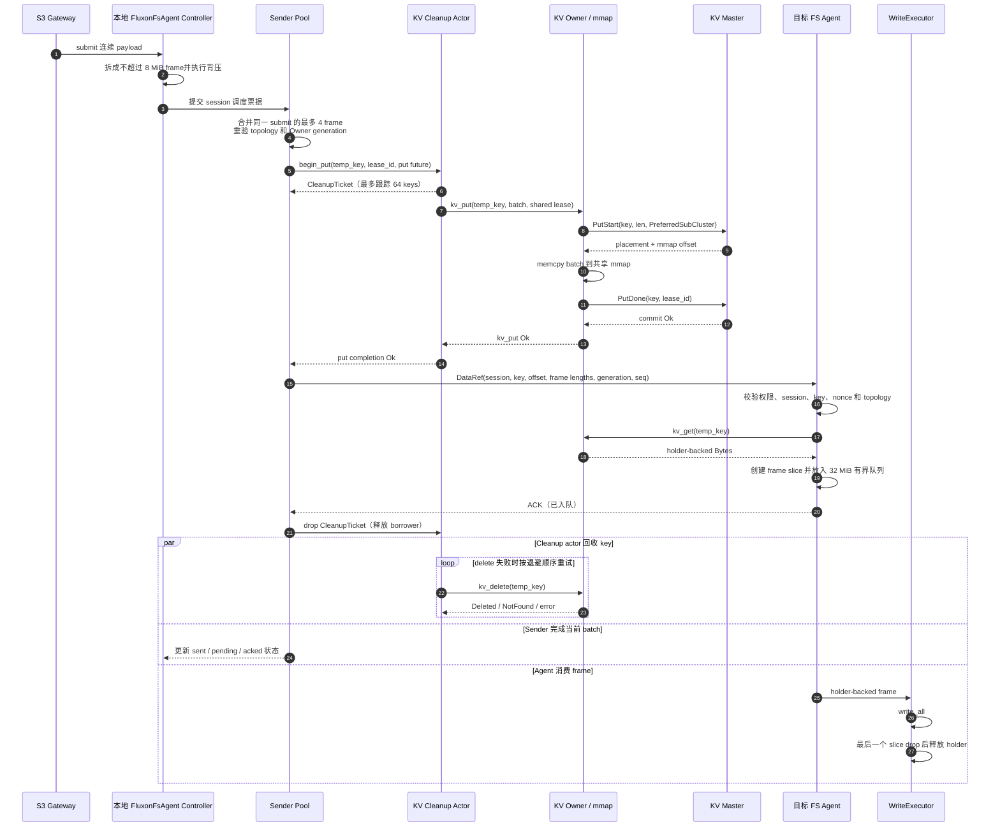
```mermaid
sequenceDiagram
    autonumber
    participant G as S3 Gateway
    participant C as 本地 FluxonFsAgent Controller
    participant S as Sender Pool
    participant D as KV Cleanup Actor
    participant O as KV Owner / mmap
    participant M as KV Master
    participant A as 目标 FS Agent
    participant W as WriteExecutor

    G->>C: submit 连续 payload
    C->>C: 拆成不超过 8 MiB frame并执行背压
    C->>S: 提交 session 调度票据
    S->>S: 合并同一 submit 的最多 4 frame<br/>重验 topology 和 Owner generation
    S->>D: begin_put(temp_key, lease_id, put future)
    D-->>S: CleanupTicket（最多跟踪 64 keys）
    D->>O: kv_put(temp_key, batch, shared lease)
    O->>M: PutStart(key, len, PreferredSubCluster)
    M-->>O: placement + mmap offset
    O->>O: memcpy batch 到共享 mmap
    O->>M: PutDone(key, lease_id)
    M-->>O: commit Ok
    O-->>D: kv_put Ok
    D-->>S: put completion Ok
    S->>A: DataRef(session, key, offset, frame lengths, generation, seq)
    A->>A: 校验权限、session、key、nonce 和 topology
    A->>O: kv_get(temp_key)
    O-->>A: holder-backed Bytes
    A->>A: 创建 frame slice 并放入 32 MiB 有界队列
    A-->>S: ACK（已入队）
    S->>D: drop CleanupTicket（释放 borrower）

    par Cleanup actor 回收 key
        loop delete 失败时按退避顺序重试
            D->>O: kv_delete(temp_key)
            O-->>D: Deleted / NotFound / error
        end
    and Sender 完成当前 batch
        S-->>C: 更新 sent / pending / acked 状态
    and Agent 消费 frame
        A->>W: holder-backed frame
        W->>W: write_all
        W->>W: 最后一个 slice drop 后释放 holder
    end
```

`par` 中的三个分支真实并发：key 被删除不会使已取得的 holder 失效。同一 key 的 delete attempt 是顺序重试，不同 key 的 cleanup task 可同时在途。

#### 4.4.3 直接 Raw RPC 时序

session 打开时没有 KV-ref 候选资格，或者 sender 发送前发现 topology 已失效时，会跳过 KV 请求并直接携带 payload。

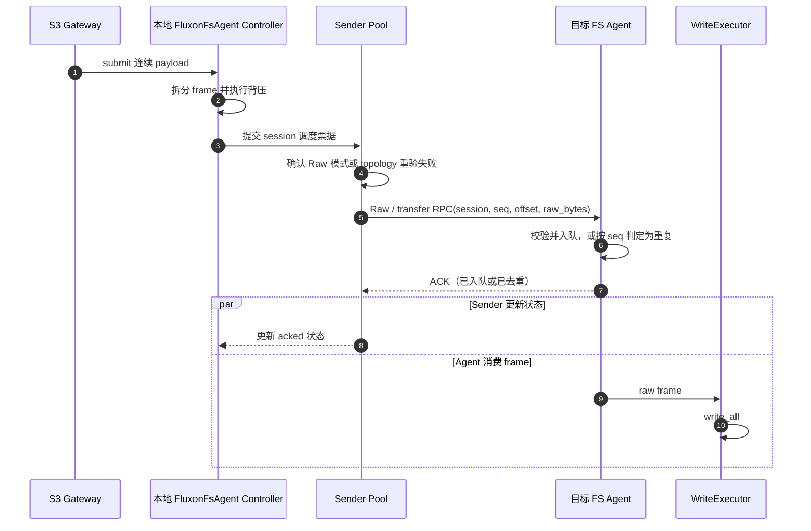
```mermaid
sequenceDiagram
    autonumber
    participant G as S3 Gateway
    participant C as 本地 FluxonFsAgent Controller
    participant S as Sender Pool
    participant A as 目标 FS Agent
    participant W as WriteExecutor

    G->>C: submit 连续 payload
    C->>C: 拆分 frame 并执行背压
    C->>S: 提交 session 调度票据
    S->>S: 确认 Raw 模式或 topology 重验失败
    S->>A: Raw / transfer RPC(session, seq, offset, raw_bytes)
    A->>A: 校验并入队，或按 seq 判定为重复
    A-->>S: ACK（已入队或已去重）
    par Sender 更新状态
        S-->>C: 更新 acked 状态
    and Agent 消费 frame
        A->>W: raw frame
        W->>W: write_all
    end
```

#### 4.4.4 KV-ref 失败后降级时序

KV-ref 尝试未获得匹配的成功 ACK 时，sender 使用相同 `seq`、offset 和原数据改走 Raw RPC。这个 session 之后不再尝试升级为 KV-ref。

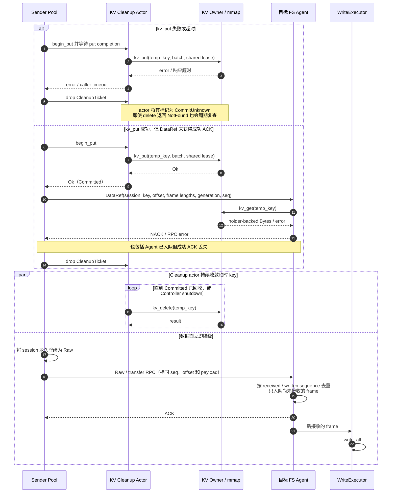
```mermaid
sequenceDiagram
    autonumber
    participant S as Sender Pool
    participant D as KV Cleanup Actor
    participant O as KV Owner / mmap
    participant A as 目标 FS Agent
    participant W as WriteExecutor

    alt kv_put 失败或超时
        S->>D: begin_put 并等待 put completion
        D->>O: kv_put(temp_key, batch, shared lease)
        O-->>D: error / 响应超时
        D-->>S: error / caller timeout
        S->>D: drop CleanupTicket
        Note over D,O: actor 将其标记为 CommitUnknown<br/>即使 delete 返回 NotFound 也会周期复查
    else kv_put 成功，但 DataRef 未获得成功 ACK
        S->>D: begin_put
        D->>O: kv_put(temp_key, batch, shared lease)
        O-->>D: Ok
        D-->>S: Ok（Committed）
        S->>A: DataRef(session, key, offset, frame lengths, generation, seq)
        A->>O: kv_get(temp_key)
        O-->>A: holder-backed Bytes / error
        A-->>S: NACK / RPC error
        Note over S,A: 也包括 Agent 已入队但成功 ACK 丢失
        S->>D: drop CleanupTicket
    end

    par Cleanup actor 持续收敛临时 key
        loop 直到 Committed 已回收，或 Controller shutdown
            D->>O: kv_delete(temp_key)
            O-->>D: result
        end
    and 数据面立即降级
        S->>S: 将 session 永久降级为 Raw
        S->>A: Raw / transfer RPC（相同 seq、offset 和 payload）
        A->>A: 按 received / written sequence 去重<br/>只入队尚未接收的 frame
        A-->>S: ACK
        A->>W: 新接收的 frame
        W->>W: write_all
    end
```

#### 4.4.5 finalize 时序

data ACK 只证明 frame 已入队或已被去重。`finalize` 是等待写入真正完成并设置最终文件长度的 completion barrier。

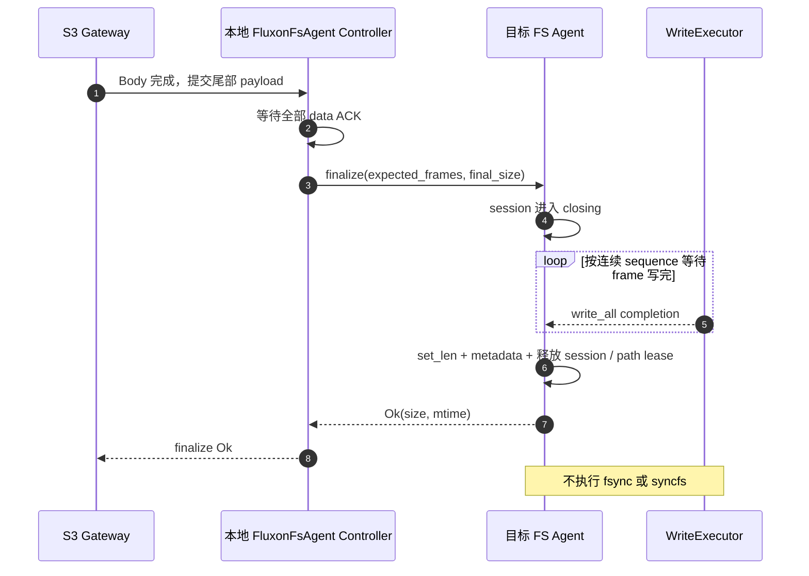
```mermaid
sequenceDiagram
    autonumber
    participant G as S3 Gateway
    participant C as 本地 FluxonFsAgent Controller
    participant A as 目标 FS Agent
    participant W as WriteExecutor

    G->>C: Body 完成，提交尾部 payload
    C->>C: 等待全部 data ACK
    C->>A: finalize(expected_frames, final_size)
    A->>A: session 进入 closing
    loop 按连续 sequence 等待 frame 写完
        W-->>A: write_all completion
    end
    A->>A: set_len + metadata + 释放 session / path lease
    A-->>C: Ok(size, mtime)
    C-->>G: finalize Ok
    Note over A,W: 不执行 fsync 或 syncfs
```

Controller 发送 batch 的核心实现是 `remote_write_session_send_batch_task`，Agent 的 KV-ref 入口是 `handle_write_session_data_ref_typed`，终态处理由 `handle_finalize_write_session_typed` 完成。

### 4.5 临时 KV key 回收状态机

`RemoteWriteSessionKvCleanupActor` 是 Controller 内临时 key 的唯一最终回收者。关键点是“先记录，再 put”：只要 put future 已经开始，就必须有一个不依赖 sender 成功返回的 owner 跟踪它。

| 参数 | 当前值 | 契约 |
| --- | ---: | --- |
| 最大跟踪 key 数 | `64` | 容量不足时在 put 前拒绝，该 batch 直接降级 Raw；不驱逐旧记录 |
| sender 等待 put | `10 秒` | 超时后可立即走 Raw，不转移 cleanup ownership |
| actor 解析 put 结果 | `30 秒` | 超时或 transport error 记为 `CommitUnknown` |
| 单次 delete 超时 | `1 秒` | 超时视为可重试失败 |
| delete 失败退避 | `100 ms → 5 秒` | 指数退避，每次增加 `0～250 ms` 确定性 jitter |
| 不确定 commit 复查 | `5 秒` | 每次增加 `0～250 ms` jitter，直到 Controller 停止 |

状态转换如下：

```text
Putting
  ├─ put Ok ───────────────→ Borrowed(Committed)
  └─ put error / 30s timeout ─→ Borrowed(CommitUnknown)

Borrowed(*) -- CleanupTicket drop --> DeletePending(*)

DeletePending(Committed)
  ├─ Deleted / NotFound ─→ 终止跟踪
  └─ error / timeout ───→ 指数退避后重试

DeletePending(CommitUnknown)
  ├─ Deleted / NotFound ─→ 约 5s 后继续复查
  └─ error / timeout ───→ 指数退避后重试
```

`CommitUnknown` 在 `NotFound` 甚至 `Deleted` 后仍然保留记录，因为之前超时的 put 可能在 delete 之后才完成 commit。正常 shutdown 一开始就停止 source admission，使共享 keepalive actor 退出；随后给显式 cleanup 最多 `5 秒` 的收敛窗口，再关闭 lease registration 并停止 cleanup task。仍存在的 key 最终由 `180 秒` lease TTL 回收。

## 5. 共享 lease 与 keepalive

### 5.1 FS Controller 共享 lease

KV 临时 key 在传输过程中不能提前过期。FS Master 为此采用 Controller 级共享 lease：

- 第一个 KvShared session 以 single-flight 方式懒申请一个 `180 秒` lease；
- 同一 Controller 的后续 session 和 batch 复用同一个 `lease_id + generation`；
- keepalive 在上次成功后约 `60 秒 + 0～5 秒 jitter` 再执行；
- 单次 keepalive 最多等待 `10 秒`；
- session close、abort 或单 session 降级不会注销 lease；
- 即使暂时没有 session，也持续续租到 Controller shutdown。

keepalive 不阻塞任何单个 session，其独立时序如下：

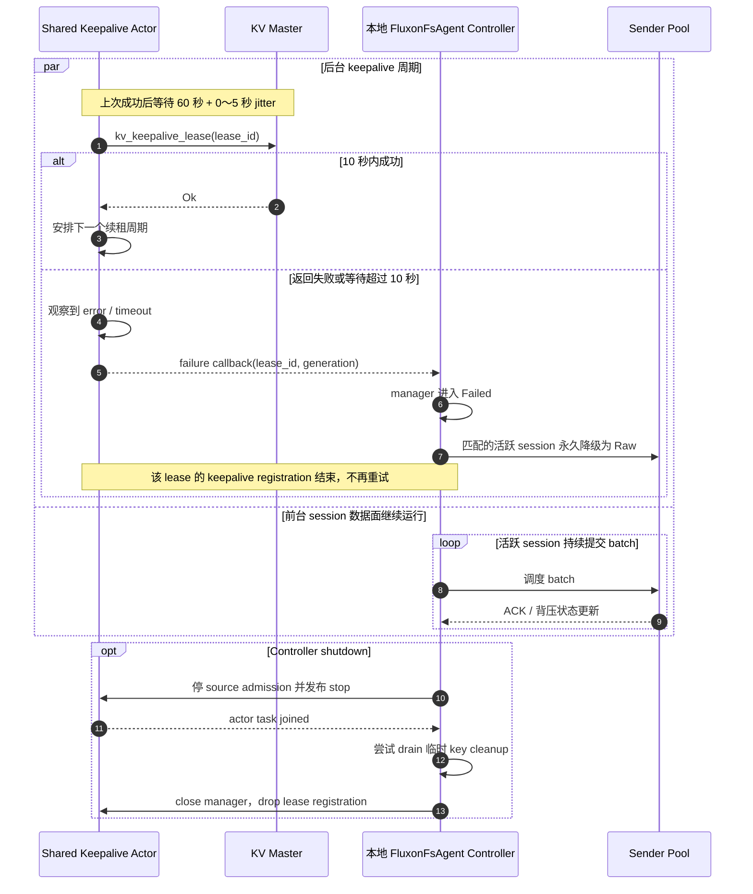
```mermaid
sequenceDiagram
    autonumber
    participant K as Shared Keepalive Actor
    participant M as KV Master
    participant C as 本地 FluxonFsAgent Controller
    participant S as Sender Pool

    par 后台 keepalive 周期
        Note over K,M: 上次成功后等待 60 秒 + 0～5 秒 jitter
        K->>M: kv_keepalive_lease(lease_id)
        alt 10 秒内成功
            M-->>K: Ok
            K->>K: 安排下一个续租周期
        else 返回失败或等待超过 10 秒
            K->>K: 观察到 error / timeout
            K-->>C: failure callback(lease_id, generation)
            C->>C: manager 进入 Failed
            C->>S: 匹配的活跃 session 永久降级为 Raw
            Note over K,C: 该 lease 的 keepalive registration 结束，不再重试
        end
    and 前台 session 数据面继续运行
        loop 活跃 session 持续提交 batch
            C->>S: 调度 batch
            S-->>C: ACK / 背压状态更新
        end
    end
    opt Controller shutdown
        C->>K: 停 source admission 并发布 stop
        K-->>C: actor task joined
        C->>C: 尝试 drain 临时 key cleanup
        C->>K: close manager，drop lease registration
    end
```

因此，一个本地 `FluxonFsAgent` Controller 相对 session 数只维护 `O(1)` 个 lease、actor task/timer 和周期 keepalive RPC。它不是每 session 一个，也不是每目标 Agent 一个，更不是多个调用方进程共享的全局单例。

FS 和 MQ 复用 `fluxon_util::lease_manager::LeaseKeepaliveActor` 的代码实现，但不共用同一个运行时 actor 实例或同一个 lease：

- FS 的共享 lease 失败后，所有仍匹配该 `lease_id + generation` 的 session 一起降级 raw；
- manager 随后保持 `Failed`，新 session 也直接走 raw，直到重建 Controller；
- MQ 仍保持自己的逐 lease 重试语义。

共享 lease 正常运行时会一直续租，所以临时 key 不能只依赖 TTL。第 4.5 节的 cleanup actor 会持续重试显式 delete；只有 Controller shutdown 终止 keepalive 后，TTL 才成为剩余 key 的最终兜底。

### 5.2 通用 keepalive actor 的有界并发

`LeaseKeepaliveActor<K>` 是 FS 和 MQ 共用的调度核心。它使用一个到期堆和一个 `FuturesUnordered` 在同一 actor task 内调度，不会为每次 tick 再 spawn 无界子任务。下图的 `par` 表示多个 lease 可同时续租，数量严格受 actor 的 `max_concurrency` 限制；同一 lease generation 同时最多一次 operation。

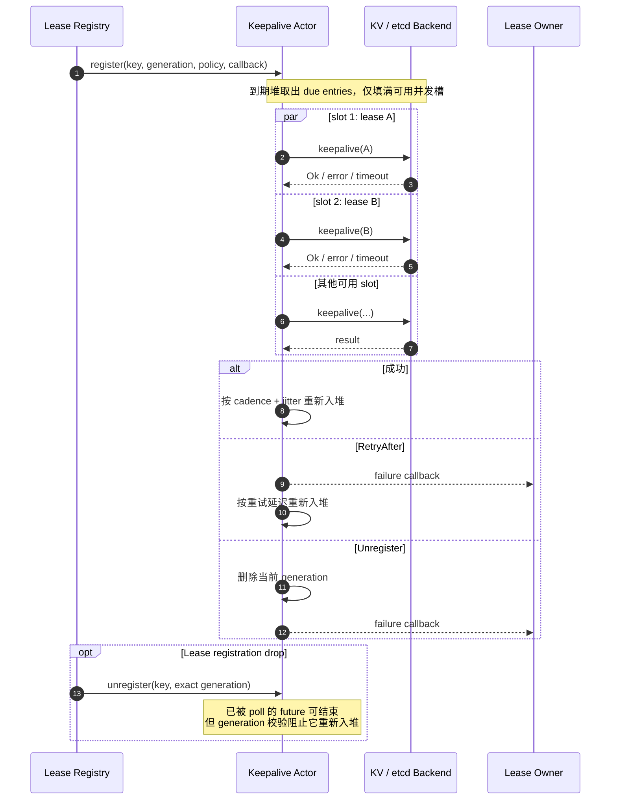
```mermaid
sequenceDiagram
    autonumber
    participant R as Lease Registry
    participant K as Keepalive Actor
    participant B as KV / etcd Backend
    participant O as Lease Owner

    R->>K: register(key, generation, policy, callback)
    Note over K,B: 到期堆取出 due entries，仅填满可用并发槽
    par slot 1: lease A
        K->>B: keepalive(A)
        B-->>K: Ok / error / timeout
    and slot 2: lease B
        K->>B: keepalive(B)
        B-->>K: Ok / error / timeout
    and 其他可用 slot
        K->>B: keepalive(...)
        B-->>K: result
    end
    alt 成功
        K->>K: 按 cadence + jitter 重新入堆
    else RetryAfter
        K-->>O: failure callback
        K->>K: 按重试延迟重新入堆
    else Unregister
        K->>K: 删除当前 generation
        K-->>O: failure callback
    end
    opt Lease registration drop
        R->>K: unregister(key, exact generation)
        Note over K: 已被 poll 的 future 可结束<br/>但 generation 校验阻止它重新入堆
    end
```

| 使用者 | actor 分组 | cadence | 超时 | 并发上限 | 失败策略 |
| --- | --- | --- | --- | ---: | --- |
| FS write-session | 每个 Controller 一个 actor，实际只注册一个共享 lease | `60s + 0～5s jitter` | operation `10s` | `32` | `Unregister`，manager 粘滞进入 `Failed` |
| MQ / GeneralLease | 每个 `(ttl_seconds, Tokio runtime id)` 一个 actor | `ttl/3 + 1s`，无 jitter | backend `1.5s`，actor `2s` | `64` | 每个 lease `100ms` 后重试 |

MQ actor 在无注册 lease 时自动退出，新 registration 通过 runner generation 保证只启动一个 loop。`LeaseEntry` drop 先删除精确 keepalive registration，再释放 backend 和 actor-map guard，因此旧 future 不会复活已释放 lease。失败日志按 lease 以 `30 秒` 窗口限频。

## 6. KV 缓存命中读取与 HTTP 传输

### 6.1 `GetObject` 的有界并发分块调度

`GetObject` 使用 `buffered(get_object_inflight_pieces)` 维持滑动 inflight 窗口。多个 `read_chunk_cached` 可以同时在途，但 HTTP Body 仍按读取计划的 offset 顺序输出。

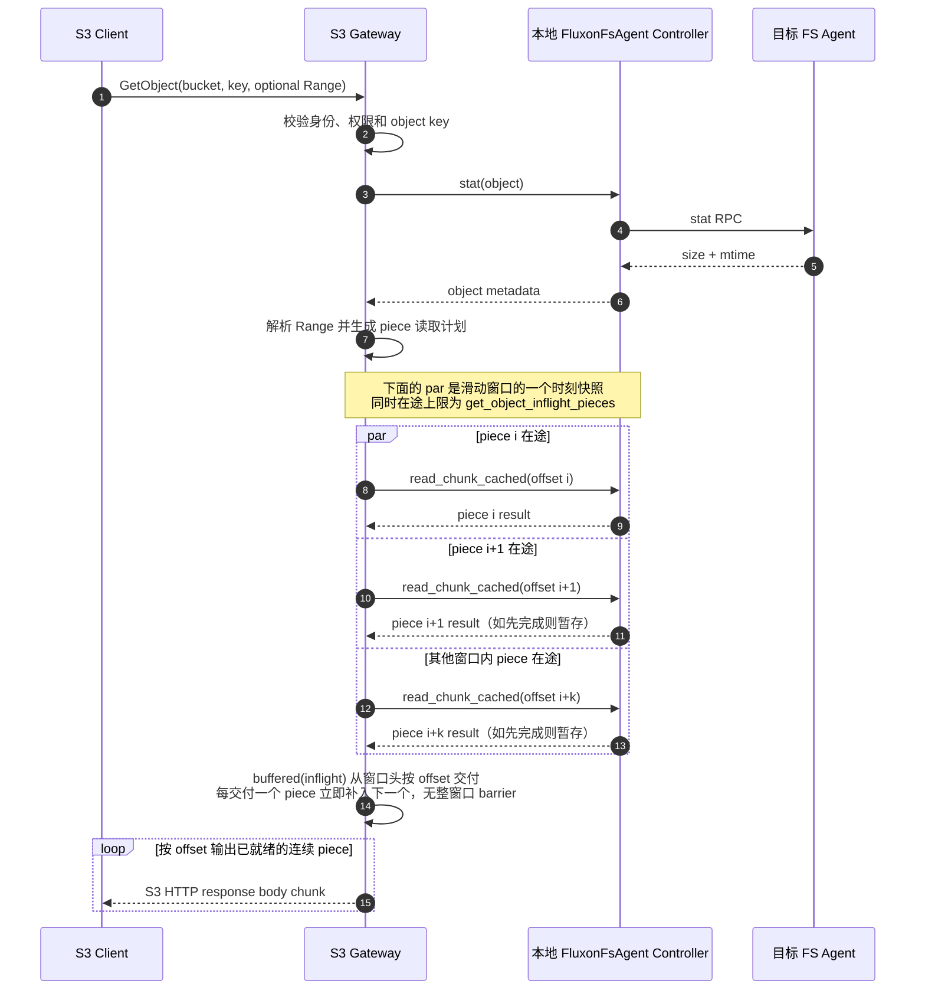
```mermaid
sequenceDiagram
    autonumber
    participant U as S3 Client
    participant G as S3 Gateway
    participant C as 本地 FluxonFsAgent Controller
    participant A as 目标 FS Agent

    U->>G: GetObject(bucket, key, optional Range)
    G->>G: 校验身份、权限和 object key
    G->>C: stat(object)
    C->>A: stat RPC
    A-->>C: size + mtime
    C-->>G: object metadata
    G->>G: 解析 Range 并生成 piece 读取计划

    Note over G,C: 下面的 par 是滑动窗口的一个时刻快照<br/>同时在途上限为 get_object_inflight_pieces
    par piece i 在途
        G->>C: read_chunk_cached(offset i)
        C-->>G: piece i result
    and piece i+1 在途
        G->>C: read_chunk_cached(offset i+1)
        C-->>G: piece i+1 result（如先完成则暂存）
    and 其他窗口内 piece 在途
        G->>C: read_chunk_cached(offset i+k)
        C-->>G: piece i+k result（如先完成则暂存）
    end
    G->>G: buffered(inflight) 从窗口头按 offset 交付<br/>每交付一个 piece 立即补入下一个，无整窗口 barrier
    loop 按 offset 输出已就绪的连续 piece
        G-->>U: S3 HTTP response body chunk
    end
```

### 6.2 单个 piece 的 holder-backed 缓存读取

KV 缓存命中路径不再先解码出完整 `FlatDict`。本地 `FluxonFsAgent` Controller 直接调用 `kv_framework.kv_get` 取得 `Owner` 或 `External` holder，然后用 holder 构造 `Bytes`。`find_flat_dict_bytes_field_range` 会校验完整编码值并定位目标 bytes 字段，最后通过 `Bytes::slice` 得到 payload 视图。

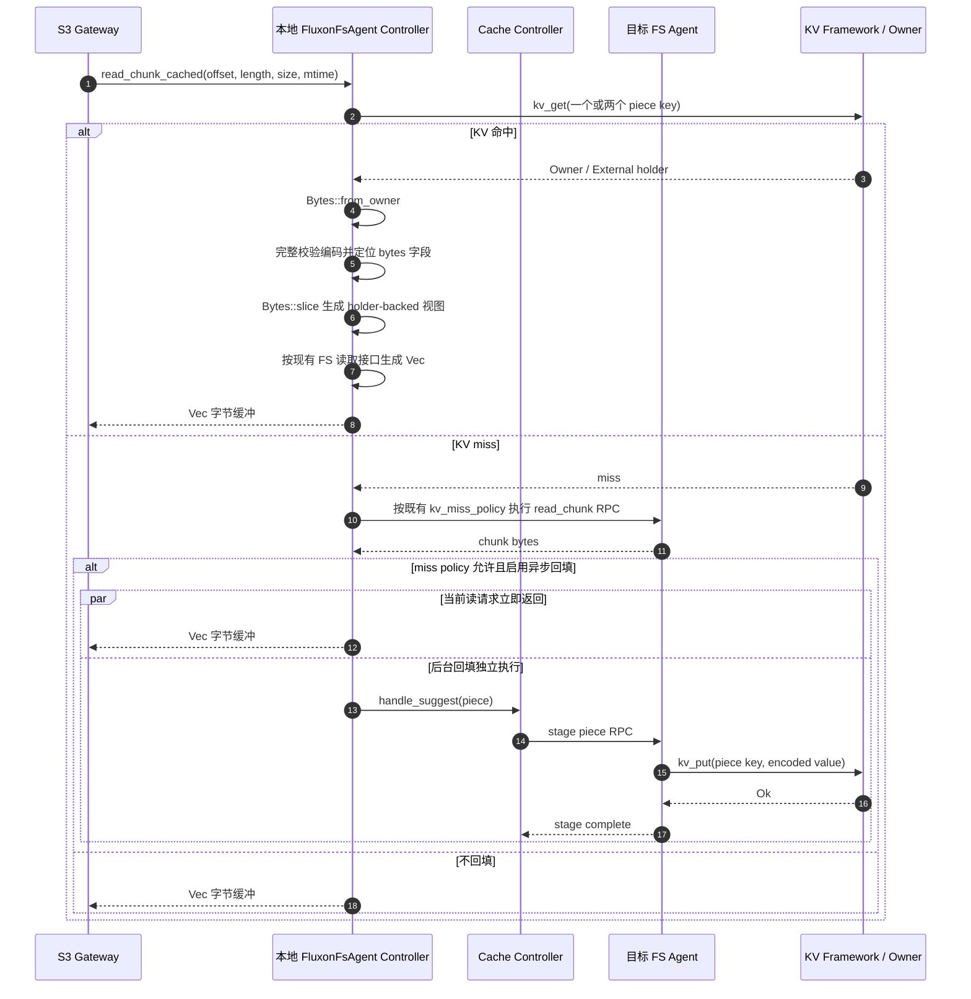
```mermaid
sequenceDiagram
    autonumber
    participant G as S3 Gateway
    participant C as 本地 FluxonFsAgent Controller
    participant B as Cache Controller
    participant A as 目标 FS Agent
    participant O as KV Framework / Owner

    G->>C: read_chunk_cached(offset, length, size, mtime)
    C->>O: kv_get(一个或两个 piece key)
    alt KV 命中
        O-->>C: Owner / External holder
        C->>C: Bytes::from_owner
        C->>C: 完整校验编码并定位 bytes 字段
        C->>C: Bytes::slice 生成 holder-backed 视图
        C->>C: 按现有 FS 读取接口生成 Vec
        C-->>G: Vec 字节缓冲
    else KV miss
        O-->>C: miss
        C->>A: 按既有 kv_miss_policy 执行 read_chunk RPC
        A-->>C: chunk bytes
        alt miss policy 允许且启用异步回填
            par 当前读请求立即返回
                C-->>G: Vec 字节缓冲
            and 后台回填独立执行
                C->>B: handle_suggest(piece)
                B->>A: stage piece RPC
                A->>O: kv_put(piece key, encoded value)
                O-->>A: Ok
                A-->>B: stage complete
            end
        else 不回填
            C-->>G: Vec 字节缓冲
        end
    end
```

同一个 `kv_try_get_bytes_field` 还用于 Python FS 的只读 inline-open：小文件的第 `0` 个 piece 命中后，Controller 可以用 holder-backed `Bytes` 构建 inline FD plan，或在 fallback 中转为 `Vec`。这同样只优化编码值提取阶段；写入 memfd 或构建 Python bytes 时仍会发生后续拷贝。

这项优化的边界如下：

- **减少的工作**：不再 materialize 完整 `FlatDict`，也不再先把目标 bytes 字段复制到中间 `Vec`。
- **仍然存在的工作**：编码值仍会完整扫描和校验；当前 FS 读取接口最终仍需生成 `Vec<u8>`，sync/async bridge 也仍然存在。因此这是 KV 命中数据提取层的局部少拷贝，不是从 KV 到 HTTP 的端到端零拷贝。
- **不变的编码语义**：重复 key 仍以最后一项为准；最后一项不是 bytes、字段不存在、编码末尾有多余字节或任何后续字段损坏时，仍按原解码契约返回 miss/type mismatch 或错误。
- **不变的 miss 语义**：KV miss 后的远端 FS 读取和回填策略保持不变。

### 6.3 `TCP_NODELAY`

FS Master 的 Axum HTTP listener 启用 `tcp_nodelay(true)`，即在 TCP 连接上禁用 Nagle 合并等待。这可避免小型 S3 响应的 headers 和 body 在 delayed ACK 交互下出现额外等待，主要改善小对象和小 Range GET 的响应延迟。

`TCP_NODELAY` 不改变 S3 HTTP 协议、对象内容和目录列举语义，也不直接减少大对象的读取拷贝。

## 7. 正确性与失败边界

- **连续写入**：同一 delivery barrier 之前，payload 必须按连续、无重叠 offset 提交。
- **准确长度**：`finalize` 将文件设置为实际对象长度，覆盖旧的较长对象时不会留下旧尾部。
- **完整前缀**：`wait` 和 `finalize` 要求 `0..expected_frames` 的 received/written sequence 形成连续前缀，只观察最大 sequence 不足以证明已交付。
- **安全引用**：Agent 在 `kv_get` 前校验 token、路径、session、frame 数量与长度、总长度、offset 溢出、Owner generation、nonce 和根据请求重算的临时 key。
- **幂等重发**：Agent 根据 sequence 去重；部分 frame 已入队时，重发只补齐剩余 frame。
- **跨重启防混淆**：Agent session id 由进程实例 UUID 和递增计数器组成，Agent 重启后不会把延迟 frame 投递到恰好复用计数器值的新 session。
- **临时 key 最终回收**：CleanupTicket drop 不会丢失 key authority；显式 delete 重试与 shutdown 后的 lease TTL 共同构成回收保障。
- **失败释放**：Body、submit 或 finalize 失败后执行尽力而为的 `abort_write_session`。
- **建立阶段失败**：远端 session 打开后，如果 Controller 本地 sender/session 注册失败，会尽力 abort 该 provisional remote session。
- **元数据失效**：S3 small-put 或 `create_parents=true` 的 session finalize 成功后，Controller 同时失效目标文件和各级父目录缓存，使新建目录可被后续 stat/list 观察。
- **不保证内容回滚**：当前直接写最终路径，没有“临时文件 + 原子重命名”。abort 只释放 session，不恢复已经被覆盖的旧对象内容。

本次设计不改变 S3 HTTP 协议、目录列举、KV miss 和回填语义；GET 只改变 KV 命中时的 payload 提取方式和 HTTP 的 TCP 发送策略。

## 8. 关闭顺序

Agent 队列中的 `Bytes` 可能仍通过 holder 引用 KV mmap。因此最上层契约是：先停 admission，再唤醒或取消后台工作，证明 holder 全部释放，关闭 FS，最后才能关闭 KV 和 unmap。本地 `FluxonFsAgent` Controller 和目标 Agent 是两个独立生命周期，两边都要建立自己的 completion barrier。

### 8.1 KV–FS 依赖屏障

FS 作为 KV framework 的 dependent，在初始化时注册 `PreShutdownParticipant`。KV 关闭必须先请求 FS 清理并等到 ACK。有 dependent 时，`request_shutdown()` 只发布 pre-shutdown 请求，不会提前停止 KV 自身服务。

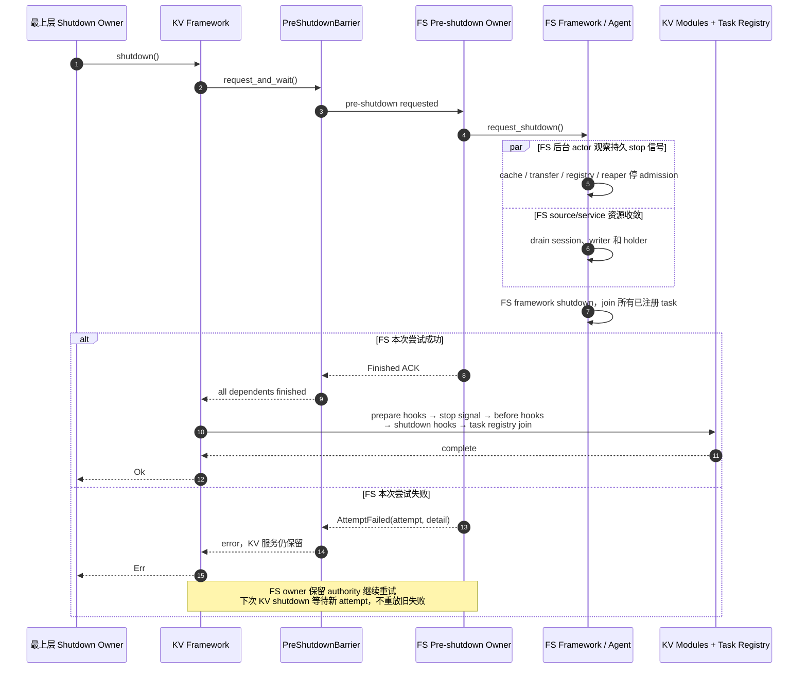
```mermaid
sequenceDiagram
    autonumber
    participant U as 最上层 Shutdown Owner
    participant K as KV Framework
    participant B as PreShutdownBarrier
    participant F as FS Pre-shutdown Owner
    participant X as FS Framework / Agent
    participant M as KV Modules + Task Registry

    U->>K: shutdown()
    K->>B: request_and_wait()
    B->>F: pre-shutdown requested
    F->>X: request_shutdown()
    par FS 后台 actor 观察持久 stop 信号
        X->>X: cache / transfer / registry / reaper 停 admission
    and FS source/service 资源收敛
        X->>X: drain session、writer 和 holder
    end
    X->>X: FS framework shutdown，join 所有已注册 task
    alt FS 本次尝试成功
        F-->>B: Finished ACK
        B-->>K: all dependents finished
        K->>M: prepare hooks → stop signal → before hooks<br/>→ shutdown hooks → task registry join
        M-->>K: complete
        K-->>U: Ok
    else FS 本次尝试失败
        F-->>B: AttemptFailed(attempt, detail)
        B-->>K: error，KV 服务仍保留
        K-->>U: Err
        Note over F,K: FS owner 保留 authority 继续重试<br/>下次 KV shutdown 等待新 attempt，不重放旧失败
    end
```

participant 使用 `watch` 保留 `Pending / AttemptFailed(n) / Finished` 状态。因此请求先于 waiter 注册时也不会丢信号，失败的同步等待者退出也不会取消唯一 cleanup owner。

### 8.2 本地 `FluxonFsAgent` Controller 关闭

Controller source 使用 `ShutdownGate` 统计已接纳 operation，并单独保留 sender、ACK confirm 和 keepalive actor 的 task handle。下图中未放在 `par` 内的阶段都是顺序 barrier；最后对多个远端 session 的 abort 是有界时间内的并发 `join_all`。

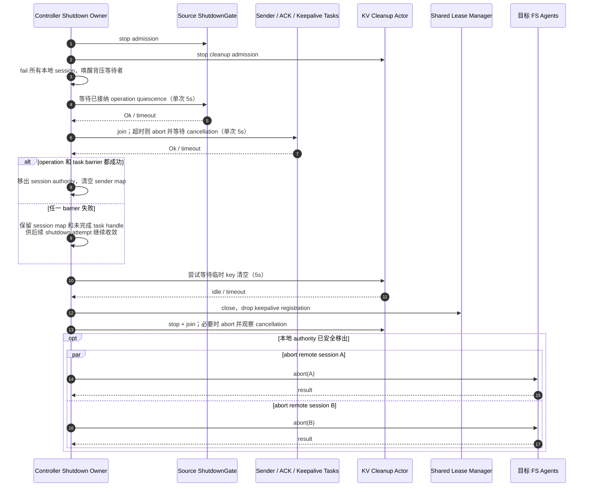
```mermaid
sequenceDiagram
    autonumber
    participant O as Controller Shutdown Owner
    participant G as Source ShutdownGate
    participant T as Sender / ACK / Keepalive Tasks
    participant D as KV Cleanup Actor
    participant L as Shared Lease Manager
    participant A as 目标 FS Agents

    O->>G: stop admission
    O->>D: stop cleanup admission
    O->>O: fail 所有本地 session，唤醒背压等待者
    O->>G: 等待已接纳 operation quiescence（单次 5s）
    G-->>O: Ok / timeout
    O->>T: join；超时则 abort 并等待 cancellation（单次 5s）
    T-->>O: Ok / timeout
    alt operation 和 task barrier 都成功
        O->>O: 移出 session authority，清空 sender map
    else 任一 barrier 失败
        O->>O: 保留 session map 和未完成 task handle<br/>供后续 shutdown attempt 继续收敛
    end
    O->>D: 尝试等待临时 key 清空（5s）
    D-->>O: idle / timeout
    O->>L: close，drop keepalive registration
    O->>D: stop + join；必要时 abort 并观察 cancellation
    opt 本地 authority 已安全移出
        par abort remote session A
            O->>A: abort(A)
            A-->>O: result
        and abort remote session B
            O->>A: abort(B)
            A-->>O: result
        end
    end
```

cleanup 无法在 `5 秒` 内清空不会让 lease 继续存活；关闭 lease 后剩余 key 开始向 TTL 收敛。`request_write_session_source_shutdown()` 仅用于 Drop/FFI 的非阻塞 fallback：它发起停止和 abort，但保留 task handle 与 session metadata，后续 graceful owner 仍能建立真正的 completion barrier。

### 8.3 目标 Agent 的 holder barrier

目标 Agent 的 write-session drain 共用一个 `30 秒` deadline，采用“初始 sweep → 等 handler → 最终 sweep”，用第二次 sweep 捕获停 admission 前已进入、但在第一次 sweep 后才插入 session map 的 open handler。后续 FS task join 和 KV shutdown 不包含在这个 `30 秒` 窗口内。

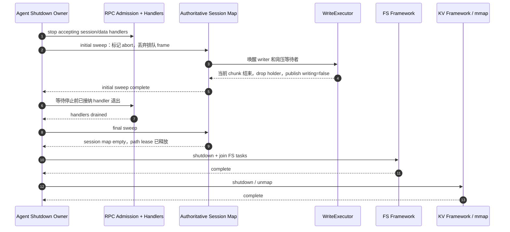
```mermaid
sequenceDiagram
    autonumber
    participant O as Agent Shutdown Owner
    participant H as RPC Admission + Handlers
    participant S as Authoritative Session Map
    participant W as WriteExecutor
    participant F as FS Framework
    participant K as KV Framework / mmap

    O->>H: stop accepting session/data handlers
    O->>S: initial sweep：标记 abort，丢弃排队 frame
    S->>W: 唤醒 writer 和背压等待者
    W-->>S: 当前 chunk 结束，drop holder，publish writing=false
    S-->>O: initial sweep complete
    O->>H: 等待停止前已接纳 handler 退出
    H-->>O: handlers drained
    O->>S: final sweep
    S-->>O: session map empty，path lease 已释放
    O->>F: shutdown + join FS tasks
    F-->>O: complete
    O->>K: shutdown / unmap
    K-->>O: complete
```

DataRef handler 在等待 `kv_get` 时会同时等 admission-stop 信号，关闭可取消尚未取得 holder 的 get。已进入 `write_all` 的 chunk 在 writer 状态锁之外持有 holder，所以 sweep 必须等它 drop 后才能从 authority map 删除 entry 并释放 path lease。如果等待超时，entry、holder authority 和 path lease 都保留，供下次 sweep 重试；KV shutdown 被跳过，必要时故意保留一个 framework `Arc` 以防止 mmap 提前卸载。

### 8.4 Framework-owned 后台任务

Framework 的 shutdown signal 是“持久状态 + `Notify`”：`running=false` 是唯一事实源，`Notify` 只负责唤醒。因此 shutdown 后才创建的 waiter 也会立即观察到停止，不会因错过一次 broadcast 而永久挂起。

`spawn_registered_boxed` 将任务接纳与 shutdown 最终取走 registry 做成原子边界：已接纳任务必须被 join，registry 关闭后则不再 spawn。PR 中纳入 FS framework 的主要任务包括：

| 任务类别 | 关闭行为 |
| --- | --- |
| CacheController stage workers / stats GC | signal 后拒绝新 suggestion；worker 停止取新任务，已进入的 blocking stage callback 由 registry join 等待结束 |
| write-session typed RPC handlers / idle reaper | 新 handler task 在 framework 关闭后不再接纳，reaper 响应 signal 退出 |
| transfer scan/worker scheduler、reconcile 和 launch loop | 等待 wake/sleep/RPC retry时同时监听 shutdown，launch future 可被取消，所有 task 由 registry join |
| mount/export registry 同步与持久化 | membership receive、retry sleep、etcd persist 与 blocking DB persist 都在 FS task registry 内 |
| Python FS cache-config fetch | 作为 FS task 注册，关闭时 join |

Framework 关闭阶段按以下顺序推进，模块 hook 不是并发调用：

```text
dependent pre-shutdown ACK
  → 各 module prepare_shutdown（停局部 admission，此时公共服务仍在）
  → 发布持久 shutdown signal
  → 各 module before_shutdown
  → 各 module shutdown
  → 停 task registry 并 join 剩余任务
```

进度持久保存在 `FrameworkShutdownProgress` 中，并由一把 async mutex 保证同时只有一个推进者。某个 hook 失败后，下次 `shutdown()` 从第一个未完成阶段继续，不重复已成功 hook；task registry handle 在 await join 前先转移到 progress，调用 future 被取消也不会丢失剩余 `JoinHandle`。

### 8.5 Python/PyO3 的单一关闭者

`KvClient` 只有一个后台 `KvFrameworkShutdown` owner。显式 `close()`、失败后的再次 `close()` 和 `Drop` fallback 都复用这个 owner，不会各自启动一条 FS/KV 关闭路径；成功关闭后再次 `close()` 返回 `Client is already closed`。`CloseRequested` 发布后，新的 KV/FS framework 获取请求会立即被拒绝。FS pre-shutdown owner 和 KV shutdown owner 都刻意位于被它们关闭的 task registry 之外，避免 join 自己。

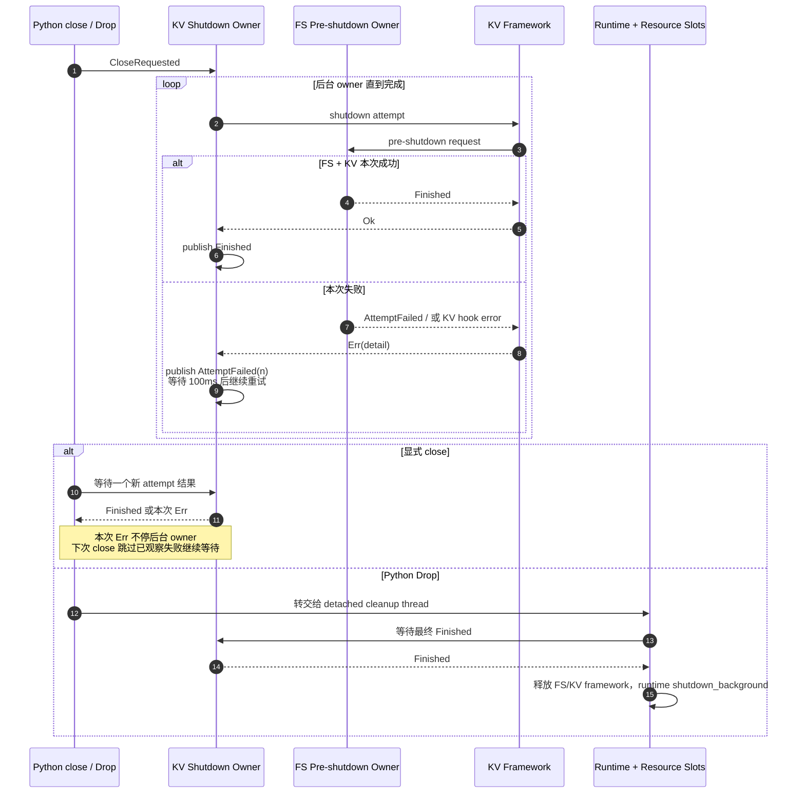
```mermaid
sequenceDiagram
    autonumber
    participant P as Python close / Drop
    participant O as KV Shutdown Owner
    participant F as FS Pre-shutdown Owner
    participant K as KV Framework
    participant R as Runtime + Resource Slots

    P->>O: CloseRequested
    loop 后台 owner 直到完成
        O->>K: shutdown attempt
        K->>F: pre-shutdown request
        alt FS + KV 本次成功
            F-->>K: Finished
            K-->>O: Ok
            O->>O: publish Finished
        else 本次失败
            F-->>K: AttemptFailed / 或 KV hook error
            K-->>O: Err(detail)
            O->>O: publish AttemptFailed(n)<br/>等待 100ms 后继续重试
        end
    end
    alt 显式 close
        P->>O: 等待一个新 attempt 结果
        O-->>P: Finished 或本次 Err
        Note over P,O: 本次 Err 不停后台 owner<br/>下次 close 跳过已观察失败继续等待
    else Python Drop
        P->>R: 转交给 detached cleanup thread
        R->>O: 等待最终 Finished
        O-->>R: Finished
        R->>R: 释放 FS/KV framework，runtime shutdown_background
    end
```

如果 Drop cleanup thread 无法创建、owner 未发布 completion，或 dependency barrier 未被证明，cleanup guard 会故意保留 framework、runtime 和 shutdown owner，以“泄漏直到进程结束”换取不提前 unmap。

MQ 也使用单一 `MqFrameworkShutdown` task 共享完成结果。`MpscContext.close()` 发起请求并等待该结果，并发 close 会观察同一 completion；一旦请求关闭，context 拒绝新 producer/consumer。MQ endpoint 必须先完成自身 close，然后再由 KV dependency barrier 关闭底层 `KvClient`。

## 9. 主要代码位置

| 文件 | 作用 |
| --- | --- |
| `fluxon_rs/fluxon_fs_core/src/s3_gateway.rs` | 定义 S3 的 `4 MiB` session 阈值 |
| `fluxon_rs/fluxon_fs_s3_gateway/src/lib.rs` | `HybridObjectWriter`，接入 `PutObject`、`UploadPart` 和 `CompleteMultipartUpload` |
| `fluxon_rs/fluxon_fs/src/master_http.rs` | 转发 S3 对象 I/O，并为 HTTP listener 启用 `TCP_NODELAY` |
| `fluxon_rs/fluxon_fs/src/agent.rs` | write-session 队列、sender、KV-ref/raw、共享 lease 和 holder-backed 缓存读取 |
| `fluxon_rs/fluxon_fs/src/write_session_kv_cleanup.rs` | 临时 key 的 put supervision、删除重试与 shutdown drain |
| `fluxon_rs/fluxon_fs/src/write_session_rpc.rs` | small-put、Raw、KV-ref 和 finalize RPC |
| `fluxon_rs/fluxon_fs/src/agent_service.rs` | small-put、父目录创建、holder-backed frame、写队列和 finalize |
| `fluxon_rs/fluxon_fs/src/framework.rs` | FS 独立 framework 与后台 task 注册入口 |
| `fluxon_rs/fluxon_framework/src/framework.rs` | pre-shutdown、可恢复关闭阶段和 task registry completion barrier |
| `fluxon_rs/fluxon_framework_compiled/src/shutdown.rs` | 持久 shutdown signal、`ShutdownGate` 和 dependent ACK 状态 |
| `fluxon_rs/fluxon_kv/src/user_api/codec_flat_dict.rs` | 校验编码 `FlatDict` 并定位 bytes 字段范围 |
| `fluxon_rs/fluxon_util/src/lease_manager/keepalive_actor.rs` | FS/MQ 共用的 keepalive actor 实现 |
| `fluxon_rs/fluxon_pyo3/src/lib.rs` | Python FS/KV/MQ 的单一关闭者和 dependency barrier |
| `fluxon_py/fluxon_fs/patcher.py` | Python 远程文件 finalize 失败后 abort |

没有新增公开的 `put_start` / `put_commit` API，也没有新增一套 FS 专用 keepalive 模块。

## 10. PR #50 文件覆盖矩阵

下表按 PR #50 的 `28` 个变更文件逐项标记设计落点。“机械变更”表示它只支撑其他文件的行为，不引入独立运行时契约。

| # | PR 文件 | 设计覆盖 |
| ---: | --- | --- |
| 1 | `fluxon_doc_cn/design/fs_s3_1_混合写入链路.md` | 本文全部章节 |
| 2 | `fluxon_py/fluxon_fs/patcher.py` | 第 3.2 节：Python `close()` 使用 finalize，失败后 abort |
| 3 | `fluxon_rs/Cargo.lock` | 机械变更：锁定 framework 新增的 `futures` 依赖 |
| 4 | `fluxon_rs/fluxon_framework/src/framework.rs` | 第 8.1、8.4 节：pre-shutdown、持久阶段、原子 task admission/join |
| 5 | `fluxon_rs/fluxon_framework_compiled/Cargo.toml` | 机械变更：为 dependent 并发等待引入 `futures` |
| 6 | `fluxon_rs/fluxon_framework_compiled/src/shutdown.rs` | 第 5.2、8.1、8.4 节：persistent signal、gate、participant 重试状态 |
| 7 | `fluxon_rs/fluxon_fs/src/agent.rs` | 第 3～5、6.2、8.2 节：Controller 流水线、KV-ref、cleanup/lease、holder 读和 source shutdown |
| 8 | `fluxon_rs/fluxon_fs/src/agent_service.rs` | 第 2.1、4.4、7、8.3 节：small-put、DataRef/finalize、Agent holder barrier |
| 9 | `fluxon_rs/fluxon_fs/src/cache_controller.rs` | 第 6.2、8.4 节：异步回填、shutdown 后拒绝 suggestion 并 join worker |
| 10 | `fluxon_rs/fluxon_fs/src/framework.rs` | 第 8.4 节：FS-owned task 注册入口 |
| 11 | `fluxon_rs/fluxon_fs/src/lib.rs` | 机械变更：接入第 4.5 节 cleanup 模块 |
| 12 | `fluxon_rs/fluxon_fs/src/master_http.rs` | 第 2、6.3、8.2、8.4 节：S3 backend、`TCP_NODELAY`、服务关闭和 registry actors |
| 13 | `fluxon_rs/fluxon_fs/src/master_http/transfer_master.rs` | 第 8.4 节：transfer scheduler/reconcile/launch 的 shutdown-aware 注册 |
| 14 | `fluxon_rs/fluxon_fs/src/write_session_kv_cleanup.rs` | 第 4.2、4.4.2、4.4.4、4.5、8.2 节：临时 key 最终回收权 |
| 15 | `fluxon_rs/fluxon_fs/src/write_session_rpc.rs` | 第 2、4.4、8.4 节：typed small/finalize/DataRef RPC 与 framework-owned handler task |
| 16 | `fluxon_rs/fluxon_fs_core/src/s3_gateway.rs` | 第 2.1 节：`4 MiB` 切换阈值 |
| 17 | `fluxon_rs/fluxon_fs_s3_gateway/src/lib.rs` | 第 2、6.1 节：各 S3 接口的 hybrid writer 和 GET inflight |
| 18 | `fluxon_rs/fluxon_kv/src/user_api/codec_flat_dict.rs` | 第 6.2 节：不 materialize 字典的 bytes range 定位 |
| 19 | `fluxon_rs/fluxon_kv/src/user_api/mod.rs` | 机械变更：导出第 6.2 节 range finder |
| 20 | `fluxon_rs/fluxon_mq/src/lease_manager.rs` | 机械变更：对第 5.2 节通用 lease API 的 re-export 整理 |
| 21 | `fluxon_rs/fluxon_pyo3/src/lib.rs` | 第 3.2、8.1、8.5 节：FS pre-shutdown、KV 后台 owner、可重试 close/Drop |
| 22 | `fluxon_rs/fluxon_pyo3/src/mpsc.rs` | 机械变更：`rustfmt` import 排序；MQ 单 owner 契约在第 8.5 节 |
| 23 | `fluxon_rs/fluxon_util/src/lease_manager.rs` | 第 5.2 节：公开导出通用 keepalive actor 类型 |
| 24 | `fluxon_rs/fluxon_util/src/lease_manager/keepalive_actor.rs` | 第 5.1、5.2 节：有界调度、generation、timeout 和 FS/MQ 失败策略 |
| 25 | `fluxon_rs/fluxon_util/src/lease_manager/lease_backend_handle.rs` | 第 5.2 节：backend `1.5s` operation deadline |
| 26 | `fluxon_rs/fluxon_util/src/lease_manager/lease_handle.rs` | 第 5.2 节：drop 时先 unregister generation，再释放 backend guard |
| 27 | `fluxon_rs/fluxon_util/src/lease_manager/lifecycle.rs` | 第 5.2 节：按 `(TTL, runtime)` 共享 MQ actor，失败后逐 lease 重试 |
| 28 | `fluxon_rs/fluxon_util/src/notify_state.rs` | 第 5.2、8.4 节：允许 trait-object stop signal，强调持久状态是唯一事实源 |

## 11. 总结

FluxonFS S3 写入采用两级选择：小对象通过一次 `put_small_object` RPC 完成父目录创建、覆盖和写入，大对象复用通用 `write-session`；进入 session 后，再根据部署条件选择 KV-ref 或 Raw RPC。KV-ref 通过共享 mmap 和 holder 减少大 payload RPC 与 Agent 侧复制，Raw RPC 保证跨 Owner 和异常场景仍可正确写入。Controller 级共享 lease 将 lease 和 keepalive 开销控制为每 FS Master `O(1)`，cleanup actor 在 put 不确定和 delete 失败时继续持有临时 key 的最终回收权。

数据面的并发都有明确边界：Gateway 入口顺序提交，Controller 允许窗口内 batch inflight，Agent 按连续 sequence 写入，GET 使用滑动 piece 窗口，keepalive 则在 actor 槽位上有界并发。幂等 sequence、finalize、Controller/Agent holder barrier、framework-owned task registry 和 FS-before-KV pre-shutdown ACK 共同构成可重试的安全关闭语义。

S3 GET 在 KV 缓存命中时使用 holder-backed `Bytes` 定位 payload，减少 `FlatDict` 完整解码和中间拷贝；HTTP listener 通过 `TCP_NODELAY` 避免小响应的 Nagle/delayed-ACK 等待。这两项优化不改变 S3 协议和 KV miss 语义，也不构成端到端零拷贝。
