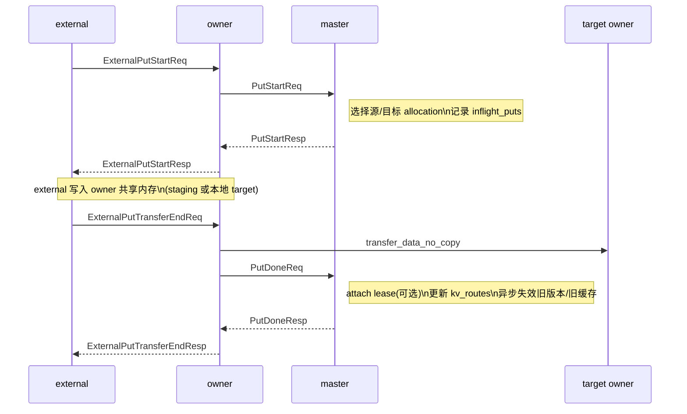
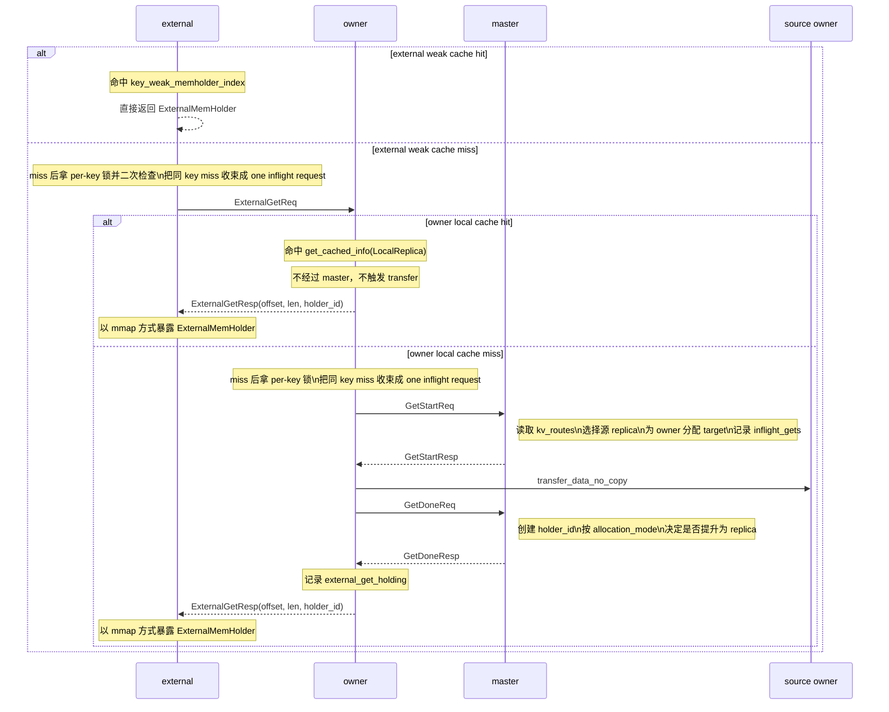
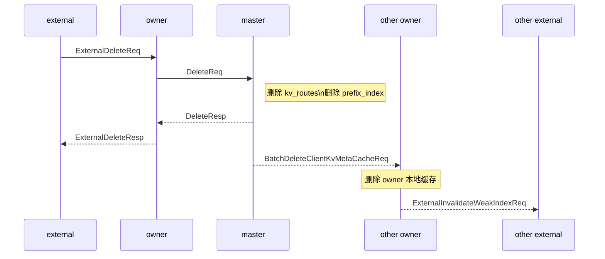

# KV 设计 2 - 调用时序

## 调用时序

### put

`put` 的核心链路是：`PutStart -> 数据写入/传输 -> PutDone`。

这一段只看会参与 `put` 主链路的状态：

```rust
pub struct MasterKvRouterInner {
    // 完整的 put 在途表，键是 (key, put_time_ms, put_version)。
    pub inflight_puts: moka::future::Cache<(String, u64, u32), InflightPutInfo>,
    // 同 key put 的轻量计数索引，用于 reject_if_inflight_same_key。
    pub inflight_put_key_counts: Arc<DashMap<String, u32>>,
    // put_done 成功后写入的稳定版本路由。
    pub kv_routes: DashMap<String, Arc<OneKvNodesRoutes>>,
    // delete 和 put 覆盖旧版本时共用的异步失效广播入口。
    pub delete_broadcast: EnsureMemholderMgmtDeleteHandle<DeleteKeyInfo>,
    ...
}

pub struct InflightPutInfo {
    pub node_id: NodeID,
    pub key: String,
    pub req_node_id: NodeID,
    // PutStart 到 PutDone / PutRevoke 期间保留的 allocation。
    pub src_target_allocation: Arc<Mutex<Option<InflightPutAllocation>>>,
    ...
}

pub struct OneKvNodesRoutes {
    // 当前已提交 value 的稳定版本号。
    pub put_id: PutIDForAKey,
    // 该版本是否绑定 lease。
    pub lease_id: Option<u64>,
    // 该版本当前所有 live replica。
    pub nodes_replicas: RwLock<HashMap<NodeID, KvRouteInfo>>,
    ...
}
```



如果调用方本身就是 owner，可以把上图里 `external -> owner` 这层 RPC 折叠掉，直接看成 owner 调 `PutStart / transfer / PutDone`。

关键点：

- `put_id` 的形状是 `(put_time_ms, put_version)`。
- `put_id` 由 master 在处理 `PutStart` 时分配，不是 owner 或 external 本地自生成。
- 当前实现里，`put_time_ms` 取 master 当下的毫秒时间；`put_version` 来自 master 侧按 key 维护的递增计数器。
- `put_time_ms` 只提供时间维度，不能单独区分同一毫秒内的并发写入，所以还要叠加 `put_version`。
- `put_id` 在不同 key 之间不承诺全局唯一，所以在在途表和 external pending put 表里，真正使用的是 `(key, put_time_ms, put_version)`。
- 这个 `put_id` 会在 `PutStartResp` 回给请求方，后续 `PutDoneReq` / `PutRevokeReq` 都带着同一个 id 回来，master 据此命中同一条在途 put 状态。
- 当前默认放置策略是 `RandomPlacementPolicy`，不是固定本地优先。
- external `put` 的真实入口是 `ExternalPutStart -> ExternalPutTransferEnd`；只有 owner 内部才直接调用 `PutStart -> PutDone`。
- external 在数据面上不是直接把 payload 发给 master；它是先写 owner 共享内存，再由 owner 负责后续传输与提交。
- 如果请求方本身就是目标 owner，上图里的 staging 写入和目标写入会重合，此时会退化为本地快路。
- 如果传输失败，请求方会发 `PutRevokeReq`，master 只回收在途状态，不写入稳定路由。
- 如果这是对已有 key 的覆盖写，`put_done` 会把旧的 `OneKvNodesRoutes` 送进 `delete_broadcast`，异步清理旧版本相关的 client cache 和 node cache；首次写入没有这一步。

### get

`get` 的核心链路是：`GetStart -> 数据传输/复用 -> GetDone`。

这一段只看会参与 `get` 主链路的状态：

```rust
pub struct MasterKvRouterInner {
    // get_start 记录、get_done / get_revoke 删除的在途表。
    pub inflight_gets: moka::future::Cache<u64, InflightGetInfo>,
    // get_done 之后的稳定 holder 表，键是 (node_id, holder_id)。
    pub get_holding: MasterOwnerMemMgr,
    // get_start 读取的当前稳定版本路由。
    pub kv_routes: DashMap<String, Arc<OneKvNodesRoutes>>,
    ...
}

pub struct InflightGetInfo {
    // 本次读取对应的版本号，用于拒绝过期完成。
    pub put_id: PutIDForAKey,
    // master 为这次 get 选择的源 replica 节点。
    pub src_node_id: NodeID,
    pub key: String,
    pub req_node_id: NodeID,
    // 请求方侧的目标 allocation。
    pub allocation: Arc<Allocation>,
    // 当前读取命中的稳定版本路由。
    pub route: Arc<OneKvNodesRoutes>,
    // ReuseReplica / DurableReplica / Temporary。
    pub allocation_mode: GetAllocationMode,
    ...
}

pub struct OwnerHoldingGetInfo {
    pub key: String,
    // 当前持有这个 holder 的请求节点。
    pub holding_node_id: NodeID,
    // 返回给调用方的 holder 背后真实 owner allocation。
    pub allocation: Arc<Allocation>,
    ...
}

pub struct OneKvNodesRoutes {
    pub put_id: PutIDForAKey,
    pub lease_id: Option<u64>,
    // get_start 从这里挑选源副本。
    pub nodes_replicas: RwLock<HashMap<NodeID, KvRouteInfo>>,
    // 限制 DurableReplica 提升并发数。
    pub get_durable_slots_used: AtomicU32,
    ...
}
```



如果调用方本身就是 owner，可以把上图里 `external -> owner` 这层 RPC 去掉，并把最后一步“返回 offset/len”理解成直接返回 `UserMemHolder`。

当前 `get` 有三种分配模式：

- `ReuseReplica`：请求节点本来就有该 key 的副本，直接复用本地 allocation，不发生真实传输。
- `DurableReplica`：在请求节点新分配一块目标内存，并在 `get_done` 后把它提升为稳定副本。
- `Temporary`：只为本次读取分配临时目标，完成后作为 holder 使用，但不进入稳定副本集合。

实现里对 `DurableReplica` 做了上限控制：同一 key 最多同时保留 2 个 durable get 槽位，避免一次热点扩散把副本数无限放大。

还要注意：

- external `get` 命中的是 external 自己的 weak cache，不是 owner 的 `get_cached_info`。
- owner 收到 `ExternalGetReq` 后，会先走 owner 本地 cache fast path；只有 miss 时才复用 owner 自己那套 `get -> GetStart/GetDone` 主链路。
- external 最终拿到的不是 owner 直接传回的 bytes，而是 `(offset, len, holder_id)`，然后用 owner 共享 mmap 暴露 `ExternalMemHolder`。

### delete

`delete` 的权威动作发生在 master，失效传播是异步后续动作。

这一段只看会参与 `delete` 主链路的状态：

```rust
pub struct MasterKvRouterInner {
    // delete 的权威删除对象。
    pub kv_routes: DashMap<String, Arc<OneKvNodesRoutes>>,
    // 从 kv_routes 派生出的前缀索引；不保证 put 时立即可见的强一致性，当前主要用于 MQ 的容量背压限制。
    pub prefix_index: ARwLock<PrefixRadixTree>,
    // 节点侧本地副本缓存控制器。
    pub node_kv_cache_controller:
        DashMap<NodeIDString, Arc<moka::sync::SegmentedCache<String, NodeValueReplicaDesc>>>,
    // 删除后的异步广播入口。
    pub delete_broadcast: EnsureMemholderMgmtDeleteHandle<DeleteKeyInfo>,
    ...
}

pub enum DeleteKeyInfo {
    Key {
        key: String,
        // 被删 key 对应的旧版本路由，供后续广播和节点缓存清理使用。
        nodes_kv_route_info: Arc<OneKvNodesRoutes>,
    },
    Shutdown,
}

pub struct OneKvNodesRoutes {
    pub put_id: PutIDForAKey,
    // delete 后需要按旧路由枚举哪些节点仍有 replica / cache。
    pub nodes_replicas: RwLock<HashMap<NodeID, KvRouteInfo>>,
    ...
}
```



如果调用方本身就是 owner，可以把 `ExternalDeleteReq/Resp` 这一层折叠掉，直接看 owner -> master 的 `DeleteReq/Resp`。

关键点：

- `delete` 的权威动作是先删 `kv_routes`。
- 客户端缓存失效和节点侧副本缓存清理由后台任务继续完成。
- 如果 key 不存在，返回 `KeyNotFound`，不会 silent success。
