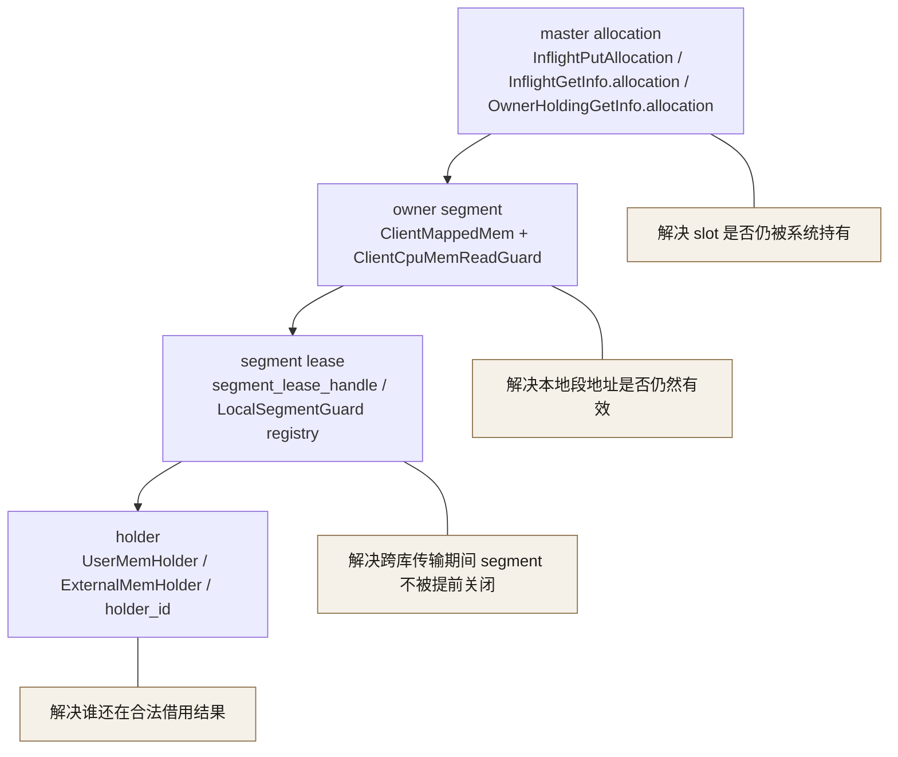
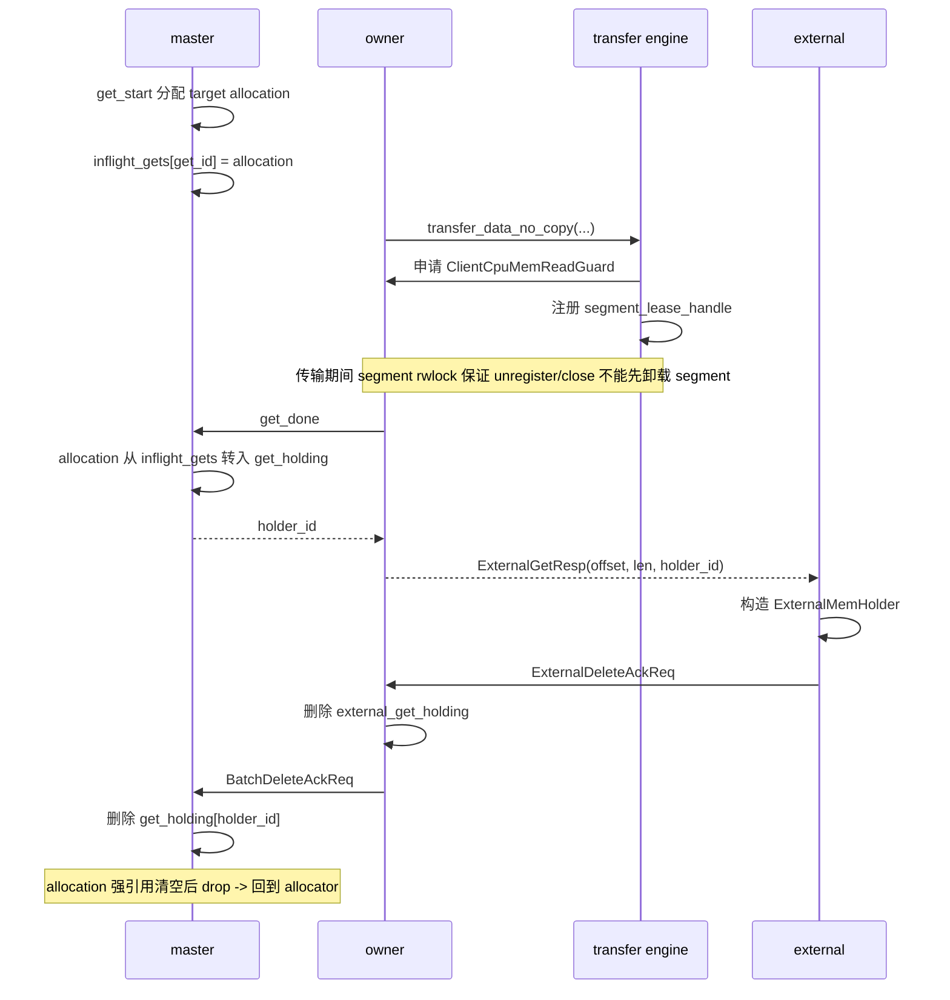

# KV 设计 4 - Allocation / Segment / Holder 生命周期

## 稳定结论

当前 KV 里真正需要一起看的不是单一的 `MemHolder` 生命周期，而是三层对象链路：

1. `master allocation`
   `put/get` 在控制面上先为数据选择或分配 `Allocation`，它决定哪块 slot 还被系统持有。
2. `owner segment`
   真正被 transport 和 mmap 访问的是 owner 本地 segment；跨库传输期间要靠 `segment lease` 托住这层生命周期。
3. `holder`
   `get_done` 之后，业务代码拿到的是 `UserMemHolder` / `ExternalMemHolder`，它决定“谁还在合法借用这块数据”。

所以这条链路里：

- `Allocation` 解决“哪块内存槽还活着、何时可回收”。
- `segment lease` 解决“跨库 transport 还没消费完时，这段 mmap/registered memory 能不能提前卸载”。
- `holder` 解决“上层调用方是否还在持有读取结果”。

这三层都释放完，数据对应的生命周期才算完整闭环。



## 为什么要把三层放在一起看

如果只看 `MemHolder`，会漏掉两类更底层的问题：

- `get/put` 在 master 上先分配出来的 `Allocation` 其实早就决定了 slot 生命周期；holder 只是后续借用关系。
- `owner / external` 的跨库传输会经过 `fluxon_kv -> fluxon_commu -> closed_sdk`，这时真正被异步 transport 读取的是本地 segment 地址，不是抽象的 `holder_id`。

因此当前实现里至少有三种不同粒度的 authority：

- `master` 管控制面 allocation / route / holder authority。
- `owner` 管本机 segment / mmap / allocation 的真实数据面生命周期。
- `external` 只持轻量句柄和借用态，不直接掌握 authority。

## 第一层：master allocation 生命周期

先看当前会跨 `put/get` 主链路保存的 allocation 对象：

```rust
pub struct Allocation {
    addr: u64,
    size: u64,
    capcity: u64,
    allocator: Arc<OneSegAllocator>,
    on_drop: Option<Box<dyn Fn() + Send + Sync + 'static>>,
}

pub enum InflightPutAllocation {
    Local(Allocation),
    Remote { src: Allocation, target: Allocation },
}

pub struct InflightPutInfo {
    // PutStart 到 PutDone / PutRevoke 期间保留的源/目标 allocation。
    pub src_target_allocation: Arc<Mutex<Option<InflightPutAllocation>>>,
    ...
}

pub struct InflightGetInfo {
    // 本次读取落到的目标 allocation。
    pub allocation: Arc<Allocation>,
    // 这次 get 的分配模式。
    pub allocation_mode: GetAllocationMode,
    ...
}

pub struct OwnerHoldingGetInfo {
    // holder 背后真实 owner allocation。
    pub allocation: Arc<Allocation>,
    ...
}
```

这里有两个关键事实：

- `Allocation` 是 RAII 对象，drop 时会回到 `OneSegAllocator.free(...)`。
- `put/get` 主链路不是“只把地址记下来”，而是把 `Allocation` 本体一路保活到在途状态或稳定持有态。

### put 路径里的 allocation

`put_start` 之后，master 会把这次写入对应的 allocation 放进 `InflightPutInfo.src_target_allocation`：

- 本地快路：`Local(Allocation)`，同一块 allocation 同时扮演 staging 和最终目标。
- 远端路径：`Remote { src, target }`，请求方和目标 owner 各持一块 allocation。

这意味着在 `PutDone / PutRevoke` 前：

- slot 不会因为局部变量退出而提前归还；
- transport 失败可以 revoke；
- 只有 master 最终决定 `put_done` 成功后，这块 target allocation 才会进入稳定路由。

### get 路径里的 allocation

`get_start` 成功后，master 会先把 target allocation 记录到 `InflightGetInfo.allocation`。

接着 `get_done` 会把这块 allocation 从 inflight 状态转移到 `OwnerHoldingGetInfo`，再放进 `get_holding`。

所以 `get` 的 allocation 生命周期是：

- `GetStart -> inflight_gets`：先托住“本次读取结果会落在哪块 target slot”
- `GetDone -> get_holding`：再把这块 slot 绑定到稳定 `holder_id`
- `holder` 全部释放后：allocation 才会真正 drop 并回到 allocator

这条链路说明：

- `holder_id` 不是凭空指向一块内存；
- 它背后一定对应一块仍被 `Allocation` 持有的 slot；
- `master.get_holding` 实际上是在给 “holder -> allocation” 这层映射做权威托管。

## 第二层：holder 生命周期

### 三层持有链路

`get` 返回的是 `MemHolder`，不是直接 bytes；它背后对应的是一条跨 `master -> owner -> external` 的持有链路。

这一段只看 holder 相关状态：

```rust
pub struct MasterKvRouterInner {
    pub get_holding: MasterOwnerMemMgr,
    ...
}

pub struct OwnerHoldingGetInfo {
    // GetDone 之后当前持有的逻辑 key。
    pub key: String,
    // 当前持有这个 holder 的请求节点。
    pub holding_node_id: NodeID,
    // 返回给调用方的 holder 背后真实 owner allocation。
    pub allocation: Arc<Allocation>,
    ...
}

pub struct ClientKvApiInner {
    // external 仍在借用的 owner holder 表。
    pub external_get_holding: OwnerExternalMemMgr,
    // 回传给 master 的 delete ack 批处理入口。
    pub delete_ack_batch: EnsureMemholderMgmtDeleteHandle<OwnerDeleteAckItem>,
    // owner 侧共享的 delete ack 管理器。
    pub owner_delete_ack_mgr: OwnerDeleteAckMemMgr,
    // holder 仍存活时阻止 client 被提前销毁的生命周期保护。
    pub all_memholder_refcount: OnceLock<Weak<AllMemholderRefCount>>,
    ...
}

pub struct ExternalMemHolder {
    // drop 时发送 release ack 所用的 holder 标识。
    pub holder_id: u64,
    // 对应逻辑 key。
    pub key: String,
    // 当前 external 客户端标识。
    pub external_client_id: String,
    // owner 代际，用来拒绝过期 holder 的释放请求。
    pub owner_start_time: i64,
    ...
}
```

`get_done` 成功后，holder 生命周期会分三层落地：

1. `master` 把 `(req_node_id, holder_id) -> OwnerHoldingGetInfo` 放进 `get_holding`，这里是权威持有表。
2. 如果调用方本身是 `owner`，返回给业务代码的是 `UserMemHolder`，底层指向 owner 本地 segment 和对应 allocation。
3. 如果调用方是 `external`，owner 还会在 `external_get_holding` 里记录 `(external_client_id, holder_id)`，表示“这个 external 还在借用 owner 的这个 holder”。

换句话说：

- `master.get_holding` 管的是全局 authority：这个 holder 是否还活着，以及它背后那块 allocation 是否仍被托住。
- `owner.external_get_holding` 管的是本机 external 借用关系。
- `external` 自己只拿到 `ExternalMemHolder` 句柄和 mmap 地址，不掌握 authority。

### 引用计数与 close

owner 进程内，所有返回给用户代码的 `UserMemHolder` 都共享同一个 `AllMemholderRefCount` 根对象：

- `ClientKvApiInner.get_or_init_all_memholder_refcount()` 会创建一个 `Arc<AllMemholderRefCount>`，并把 `Weak` 存进 `all_memholder_refcount`。
- 每个 `UserMemHolder` 都持有这个 `Arc`。
- 只要还有任何一个 `UserMemHolder` 没 drop，这个 `Weak` 就还能 upgrade。

因此 `ClientKvApi.before_shutdown()` 的语义不是“等某个 RPC 结束”，而是：

- 反复检查 `all_memholder_refcount` 里的 `Weak` 是否还能 upgrade。
- 只要还能 upgrade，就说明当前进程仍有用户层 `MemHolder` 在活着，`close()` / shutdown 不能继续收尾。

需要注意的是：

- `MemHolder.access()` 只是把内存解释成 `FlatDict`。
- 真正阻止 owner 退出的是 `UserMemHolder` 的 Rust 生命周期，不是有没有调用 `access()`。

### 释放路径

释放不是一跳完成，而是按层回收：

1. owner-local `UserMemHolder` drop

- `UserMemHolder` 持有的 `MemoryInfo` drop 后，会异步发一个 owner -> master 的 delete ack。
- 这个 ack 不是立即单条 RPC，而是先进入 `delete_ack_batch` 队列。
- `OwnerDeleteAckMemMgr` 会做短窗口聚合和去重，然后发 `BatchDeleteAckReq` 给 master。
- master 收到后，按 `(client_id, holder_id)` 从 `get_holding` 删除。

2. external `ExternalMemHolder` drop

- `ExternalMemHolder` drop 后，会先向 owner 发 `ExternalDeleteAckReq`。
- owner 先从 `external_get_holding` 删除 `(external_client_id, holder_id)` 这条借用记录。
- 这一步释放的是 external 对 owner holder 的借用关系；后续 owner 本地对应 holder 在引用归零后，再走上面的 owner -> master 批量 ack 路径。

所以真正的闭环是：

- `external drop -> owner 删 external_get_holding -> owner holder drop -> batch delete ack -> master 删 get_holding`

而不是 external 直接改 master 状态。

### start_time 代际保护

这套 holder 生命周期里，`holder_id` 本身还不够，必须和成员代际一起看。

当前实现里，external 发给 owner 的请求都会带 `started_time`，表示“external 发起这次请求时看到的 owner `node_start_time`”。包括：

- `ExternalGetReq`
- `ExternalPut*Req`
- `ExternalDeleteReq`
- `ExternalDeleteAckReq`

owner 收到后会校验：

- 如果 `started_time != 当前 owner.node_start_time`，直接拒绝。

这个保护解决的是 owner 重启代际切换问题：

- 旧 owner 崩溃并重启后，`node_id` 可能不变，但 `node_start_time` 会变化。
- 老 external 手上的旧 `ExternalMemHolder` 如果继续把 release ack 发给“同名新 owner”，就有机会误删新代际状态。
- `started_time` 校验把这类跨代际误释放挡掉。

删除广播本身也带代际：

- `master` 给 owner / external 选择广播目标时，不只看 `node_id`，还会带上目标成员当前的 `node_start_time`。
- 目标代际变了，旧广播 worker 就不会继续把任务发给已经失效的那一代成员。

### 批量聚合删除广播

holder 生命周期回收和 delete/覆盖写失效传播都不是“每删一条就打一条 RPC”，而是统一走批量聚合管线。

这里专门做了一层统一抽象，把：

- `master -> owner` 的失效广播
- `owner -> external` 的弱索引失效广播
- `owner -> master` 的 holder 释放 ack

收敛到同一个框架里。

核心抽象大致是：

```rust
pub(crate) trait MemholderManagerTrait: Sync {
    type Key;
    type Value;
    type DeleteCtx;
    type DeleteTask;
    type DeleteTarget;

    fn inner_map(&self) -> &DashMap<Self::Key, Self::Value>;
    fn delete_manager(ctx: &Self::DeleteCtx) -> &Self;
    fn collect_delete_targets(
        &self,
        ctx: &Self::DeleteCtx,
        task: &Self::DeleteTask,
    ) -> Vec<Self::DeleteTarget>;
    fn is_delete_target_alive(&self, ctx: &Self::DeleteCtx, target: &Self::DeleteTarget) -> bool;
    async fn send_delete_tasks(
        &self,
        ctx: &Self::DeleteCtx,
        target: Self::DeleteTarget,
        tasks: Vec<Self::DeleteTask>,
    ) -> Result<(), String>;
    ...
}
```

这层抽象的作用不是把三种路径“混成一个协议”，而是把它们共同的调度骨架统一掉：

- 输入端都是一个 delete/ack 任务队列。
- 中间都要做“按 target 分发、短窗口聚合、失败重试、代际存活检查”。
- 输出端再由具体 manager 决定发什么 RPC、发给谁、怎么去重。

所以这里确实不是两套完全独立的“master-owner 逻辑”和“owner-external 逻辑”，而是：

- 同一套 `MemholderManagerTrait + EnsureMemholderMgmtDeleteActorOwned`
- 针对不同层次，换不同的 `DeleteTask / DeleteTarget / send_delete_tasks(...)`

### 为什么这样设计

把 holder 生命周期拆成三层 authority，再配上代际校验和批量聚合，有几个直接收益：

- `master` 只保留权威 holder 状态，不直接跟每个 external 做细粒度往返。
- `owner` 负责本机 mmap / allocation 真实生命周期，也负责承接 external 的借用关系。
- `external` 只持有轻量句柄和弱索引，owner 重启后更容易整体失效并重建。
- 删除广播和释放 ack 都可以按目标批量聚合，避免热点 key 或大量 holder drop 时 RPC 风暴。
- 用 `node_start_time` 卡住跨代际误释放，避免“旧 external 清掉新 owner 状态”这类隐蔽错误。

## 第三层：segment lease 与跨库保活

### 问题背景

当前 `owner / external` 的数据传输会经过 `fluxon_kv -> fluxon_commu -> closed_sdk` 这条链路。

`fluxon_kv` 本地原本已经有 segment read guard：

```rust
pub struct ClientCpuMemReadGuard {
    guard: ARwLockReadGuardOwned<Option<ClientMappedMem>>,
}
```

它能保证两件事：

- segment 在 guard 存活期间不会被 `take(None)` 卸载。
- segment 的地址范围、mmap 和注册内存不会在 guard 存活期间提前释放。

但它不能直接跨到 `commu / closed_sdk`：

- 这个 guard 是 `fluxon_kv` 内部 Rust 类型，不是 public contract。
- 它不是 FFI-safe 类型，不能直接跨库传递。
- 如果让 `commu` 直接依赖 `ClientCpuMemReadGuard`，层次会反过来。

所以这里必须落成一套 host-owned 的跨库 lease 协议，而不是把 Rust guard 本体往外传。

### 设计原则

当前实现采用下面这套契约：

- host/open2 持有真实的 segment guard。
- `commu` 和 `closed_sdk` 只持有 `segment_lease_handle: u64`。
- `segment_lease_handle` 是 opaque handle，只能回调 host retain/release。
- 真正的 segment 生命周期仍然完全由 host 控制。

这套设计不是重新发明新的内存管理器，而是把现有 `ClientCpuMemReadGuard` 显式提升成跨库 lease：

- host 侧 registry 保存 `handle -> LocalSegmentGuard`
- closed 侧只回传 handle
- handle 消费完成后由 host 侧删除 registry 项

### 生命周期语义

segment lease 只保证 **segment 生命周期**，不保证 **payload 内容稳定性**。

也就是说，它保证：

- segment 不会在传输尚未完成时被 `unregister / unmap / free`
- `src_addr / target_addr` 仍然落在有效 segment 范围内

但它不保证：

- 同一块共享段内容不会被后续业务写覆盖
- transport 线程异步消费时读到的内容一定还是旧值

所以要把两个问题分清：

- `segment lease` 解决“内存段是否还活着”
- `range / slot pin` 或发送边界 copy 解决“这段内容是否仍然稳定”

当前版本只把第一层 contract 做强。

### 现有实现落点

当前 `commu` 里的 closed transfer engine 维护一个 host-owned 的 lease registry：

- host 生成 `segment_lease_handle`
- handle 对应一个真实的 `LocalSegmentGuard`
- closed runtime 通过 FFI 只传这个 handle

主链路分两类：

1. `EnsureLocalSegmentGuard / P2pReadToLocal / P2pWriteFromLocal`

- 这是原本已有的 P2P transfer fast path
- closed 侧请求一个 guard handle
- host 校验地址并返回 handle
- 后续 read/write 消费这个 handle

2. `TransferDataNoCopy`

- 这是通用 transfer engine 路径
- 现在也允许把已有的 local segment guard 先注册成 handle，再通过 closed runtime 带过去
- 这样 `commu` 在跨库后仍然能托住 segment 生命周期，而不是在发送边界把 guard 丢掉

进一步地，当前主链路已经不再要求上层显式传入 `seg_guard`：

- 如果 `transfer_data_no_copy(...)` 发现调用方没有传 lease
- 且当前 runtime 支持 local segment transfer
- 它会根据传输方向自动对本地地址申请一个 segment lease
  - put 路径 pin `src_addr`
  - get 路径 pin `target_addr`

这样 `put/get` 主路径不会再因为上层漏传 guard，退化成“裸地址跨库提交”。

### 为什么 unregister 会等待 lease 归零

这版没有引入额外的“宿主机全局引用计数器”。

原因是当前 `ClientCpuMemReadGuard` 本身就建立在 `ARwLockReadGuardOwned<Option<ClientMappedMem>>` 之上：

- lease 存活时持有读锁
- `unregister()` 需要拿写锁并 `take()` 掉 `cpu_allocated_mem`

因此只要 lease handle 最终回到 host 并还原成真实 guard：

- 所有 inflight lease 没释放前，写锁拿不到
- `unregister()` 就不会越过这些 inflight 传输提前释放 segment

这实际上已经形成了“跨库 lease + 本地读写互斥”的语义：

- 读侧：inflight transfer 持有 lease
- 写侧：unregister / close 需要独占写锁

更具体地说，这里依赖的是 `ClientSegPool.cpu_allocated_mem: ARwLock<Option<ClientMappedMem>>` 这把读写锁：

- `cpu_mem_read_guard()` / `get_guard_of_address()` 先拿读锁，再构造 `ClientCpuMemReadGuard`
- `transfer_data_no_copy(...)` 如果上层没显式传 guard，会自动对本地 `src_addr` 或 `target_addr` 申请这把 guard
- `unregister()` 则必须拿写锁并 `take()` 掉 `cpu_allocated_mem`

所以只要 transport 还在持有 `ClientCpuMemReadGuard`：

- segment 对应的 mmap / registered memory 就还处在“只允许读侧继续、禁止写侧卸载”的状态
- owner 的关闭或 segment unregister 只能等这次传输先结束

这层保证的重点不是“业务值不会变”，而是“传输过程不会因为 segment 被关闭而读到悬空地址，或者把半关闭状态带进后续流程”。

### transfer engine runtime 关闭保护

除了 segment 自己的读写锁，transfer engine runtime 还有一层独立的关闭保护。

当前 closed transfer engine runtime 内部保存的是：

- `construct_lock: AsyncMutex<()>`
  - 保证 `ClosedRuntimeHandle` 的构造只会串行发生一次，不会在并发请求下重复初始化
- `handle: OnceLock<ClosedRuntimeHandle>`
  - 保证所有传输都复用同一个 runtime handle，而不是边传边换
- `running: AtomicBool`
  - `close()` 时先置 `false`，再 drop runtime handle，表示这套 runtime 已经进入关闭态
- `local_segment_leases`
  - 保存 `segment_lease_handle -> LocalSegmentGuard` 的 host-owned registry

这一层和前面的 `cpu_allocated_mem` 读写锁解决的是不同问题：

- `cpu_allocated_mem` 的读写锁保证“本地 segment 不会在传输期间被卸载”
- transfer engine runtime 的构造锁 / handle / running 标记保证“runtime 生命周期本身不会和新的传输初始化交错，或在关闭后还按活跃 runtime 继续扩展状态”

也就是说，当前传输链路至少有两道闸：

1. **segment 闸**
   guard 在，`unregister()` 就拿不到写锁，segment 不能先关
2. **runtime 闸**
   runtime 关闭时，handle 会被 drop，`running` 也进入 false；后续请求不能再把这套 runtime 当成正常运行中的 backend 继续使用

因此，`KV` 这一层看到的“传输过程不会被关闭打断”并不是单一机制，而是：

- `segment lease + cpu_allocated_mem rwlock`
- `transfer engine runtime handle/construct lock/running`

两层一起兜住。

### 为什么不是 master allocation pin

这里不能把 segment 保活问题建在 `master` 的 `Allocation` 上。

原因很直接：

- `Allocation` 是控制面 / slot 级对象，它决定“这块 slot 还归谁持有”。
- 本地 owner / external / side-worker 进程并不直接拿 `Allocation` 做跨库地址保活。
- transport 真正异步读取的是当前进程里已经映射好的 segment 地址。

所以第二层修复必须仍然落在 **本地 segment 语义**：

- 第一层：`Allocation`，保证 slot 没被主状态机回收。
- 第二层：`segment lease`，保证这段 mmap / registered memory 不会提前卸载。
- 第三层：如果未来继续去掉 copy，再设计更细粒度的 `range / slot pin`，保证这段 payload 内容在 transport 真正消费前不被业务覆盖。

## 这三层如何一起工作



把三层合在一起，当前一条完整的 `get` 生命周期可以概括成：

1. `master.get_start`
   为本次读取选源并分配 `target allocation`，先写入 `inflight_gets`
2. `owner.transfer_data_no_copy`
   如果跨库 transport 会异步读写本地 segment，就补一层 `segment lease`
3. `master.get_done`
   把 `Allocation` 从 inflight 态转入 `get_holding`，生成稳定 `holder_id`
4. `owner/external` 返回 `UserMemHolder` 或 `ExternalMemHolder`
   上层业务此时拿到的是借用句柄，不是新的 authority
5. `ExternalMemHolder` / `UserMemHolder` drop
   逐层回收 external 借用、owner 持有和 master 权威表
6. 所有强引用都消失后
   `Allocation` drop，slot 回到 allocator；segment lease 也早已在 transport 结束后释放

同理，`put` 这边也要分两段看：

- `PutStart -> PutDone` 之间，`InflightPutAllocation` 托住 staging / target slot
- transport 跨库期间，`segment lease` 托住本地段地址
- `PutDone` 成功后，target allocation 才进入稳定副本路由；失败则 revoke 回收

因此真正的稳定结论是：

- `holder` 不是全部生命周期，只是最上层借用视图。
- `segment lease` 不是 allocation 的替代物，只负责跨库 transport 的本地段保活。
- `master allocation` 才是“这块 slot 是否还被系统正式持有”的底层权威。
