# KV 设计 5 - DRAM / SSD 多级缓存

## 稳定结论

Fluxon KV 将存储节点（owner）的本地 SSD 接入既有 key-version 副本体系，作为 DRAM 内存层的运行期回填层（backing store）。`put` 操作在内存副本可读后返回，系统随后在后台异步写入 SSD；`get` 操作优先查询内存，仅在没有可读内存副本时从 SSD 回填。

该设计不改变公共契约：用户继续调用 `put`、`get` 和 `delete`，`get` 仍返回 `MemHolder`。master 管理 key-version 级逻辑路由和内存 allocation 生命周期；owner 管理本地 SSD 文件位置、IO 和 ring 驱逐。SSD 不向用户暴露独立 API，也不承担冷启动恢复。

当工作集大于 DRAM 时，SSD 层可以保留已被驱逐的内存副本，扩大运行期可命中工作集。实际命中率和吞吐收益取决于访问分布、并发度、介质性能和回填开销，不由接入 SSD 这一事实单独保证。

本文档将控制节点（master）维护的 key-version 级副本索引称为路由表（`route`），将贡献内存或 SSD 容量的节点称为存储节点（owner）。设计要点如下：

| 设计方面 | 核心要点说明 |
| --- | --- |
| 用户契约 | 继续使用 `put`、`get` 和 `delete` 操作；`get` 仍返回 `MemHolder`。 |
| 控制面与资源 | master 维护 `route`，并统一调度用于最终 value 副本和临时传输的内存分配（allocation）。owner 提供 memory segment，承载真实 bytes，并管理本地 SSD。 |
| 数据路径 | 写入的同步完成点是内存副本发布；读取优先使用内存，SSD 只在内存无可读副本时回填。 |
| 恢复边界 | SSD 仅作为运行期缓存。owner 重启后重建空 shard 和 ring，不扫描旧 shard，也不从 master 的 `route` 中恢复旧 SSD bytes。 |

## 1. 架构概览：master 管理路由和内存分配，owner 管理本地 SSD

内存 allocation 分为两类：一类承载最终 value 副本，另一类供跨 owner 传输临时使用，例如远端 SSD 回填的 source staging。master 统一调度这两类区间，因为它们的分配、保活和释放都与 `route` 及 in-flight 请求状态联动。allocation 对应的真实 bytes 仍位于 owner 注册的 memory segment。

SSD allocation 只负责最终 value 副本，因此只涉及 owner 本地 shard/ring 的文件区间。文件 offset、覆盖保护和 IO 调度都是本地状态，因此 owner 负责 SSD 分配和 ring 驱逐。

| 对象 | 资源或状态归属 | 分配与驱逐职责 |
| --- | --- | --- |
| `route` | master 持有 key-version 级副本索引。 | master 选择内存副本的放置位置并维护内存 allocation 生命周期。在内存或 SSD 副本失效后，master 收敛逻辑路由。 |
| 内存 | bytes 位于 owner 注册的 memory segment。 | master 从这些 segment 分配两类区间：内存副本区间和通信临时区间。master 同时管理对应 allocation 的保活与驱逐。 |
| SSD | bytes 位于 owner 本地的 shard 和 ring。 | owner 分配 SSD 文件区间并执行 ring 驱逐，再把 commit 或驱逐结果通知 master 更新 `route`。 |

在 `route` 实现中，master 的 `OneKvNodesRoutes` 按 key-version 组织路由。`node_replicas` 是一张以 owner 为 key 的 map，每个 entry 用 `memory` 和 `ssd` 记录两层副本。二者共享当前 route 的 `put_id`，不能跨版本复用。SSD 文件位置、读写队列、文件 IO 对齐和覆盖保护都由 owner 管理。

### 1.1 角色与图示约定

全文时序图用角色前缀标明逻辑边界；前缀不表示独立进程。

| 前缀 | 表示的职责 |
| --- | --- |
| `external-*` | 集群外的公共 API 调用方或 benchmark 消费方，不贡献 Fluxon 存储容量。 |
| `master-*` | master 内的控制面，管理 `route`、in-flight 状态、master 侧 `Allocation` 保活句柄（guard）及 holding 生命周期，不中转 payload。 |
| `owner-*` | owner 侧的请求入口、内存或 SSD 存储组件，以及本地数据传输端点。多个 `owner-*` 角色可以位于同一 owner 进程，也可以分布在不同 owner。 |

后续时序图同时涉及请求协调、bytes 位置、allocation 保活和数据搬运，四者不能混用：

| 关系 | 文中的规范说法 | 当前实现落点 |
| --- | --- | --- |
| 请求由谁协调 | `owner-requester` 接收并推进本次公共请求。 | owner 侧 `ClientKvApi`；external 包装层在图中通常折叠。 |
| payload bytes 位于哪里 | bytes 位于 source/target owner 已注册的 memory segment，或 SSD owner 的本地 shard。 | RPC plan 中的 node、base address 和 absolute address。 |
| allocation 由谁保活 | master 持有表示 owner segment 区间的 RAII `Allocation` guard（保活句柄）。 | `InflightPutInfo`、`OneKvNodesRoutes.memory`、`InflightGetInfo` 和 `get_holding`。 |
| 数据由谁搬运 | memory get 由 requester pull；远端 SSD 回填由 SSD source push。 | owner 侧 `ClientTransferEngine`。 |

`owner-requester` 只表示请求协调者，不代表固定 buffer，也不持有 master 侧的 `Allocation` 对象。它在不同操作中的数据面职责如下：

| 操作 | owner 侧 range | master 侧 guard | 完成结果 |
| --- | --- | --- | --- |
| `put` | 常规路径的 source/staging bytes 位于 requester owner；side-transfer 路径位于单独的 `owner-put-source`。最终 target 由 master 选择，可能与 source 同 owner，也可能位于 `owner-put-target`。 | 本地 placement 用一个 `InflightPutAllocation::Local` guard 同时表示 source 和 target；远端 placement 用 `Remote { src, target }` 两个 guard。 | `PutDone` 把 target guard 转入 memory route；`put` 不产生 holder。 |
| `get` | route 路径的最终 target bytes 位于 requester owner。已有本地 replica 时直接复用；否则 memory source 或 SSD source 把 payload 写入该 target。 | `InflightGetInfo.allocation` 保活 target；`GetDone` 后转入 master `get_holding`。memory source 或远端 SSD source staging 的额外 guard 位于 `source_allocation`。 | owner 返回 holder metadata，external 在自己的进程中构造 `MemHolder`。 |
| `delete` | 没有 payload source、staging 或 target range。 | 不创建 payload `Allocation`。 | 只更新控制面 route，并执行既有 holder 失效流程。 |

后续 `put` / `get` 时序从 owner 进入 master route 路径开始，折叠 external 包装 RPC。owner 返回共享内存 offset、长度和 `holder_id` 等 metadata，external 再据此构造 `MemHolder`，形成完整的公共结果。公共 `get` 操作还可能先命中 owner 本地的 `get_cached_info`，直接复用已有 `MemoryInfo`。第 4–7 节描述本地缓存未命中后进入 `GetStart` 的路径。

时序图默认采用常规 owner 请求入口。专用 side-transfer worker 会把请求处理者与 put source owner 分开：`PutStartReq.source_node_id` 指向与 worker 共享 mmap 的 owner，source/staging bytes 位于该 owner 的 segment。这个 fast path 不改变 master 选择 put target、`PutDone` 发布 target 的主契约。

### 1.2 四条主链路

第 3–7 节将沿这四条链路展开 allocation、传输和失败清理。

| 链路 | 核心流程 | 完成或收敛点 |
| --- | --- | --- |
| 写入与 SSD commit | master 分配 source/target；`PutDone` 发布内存副本；owner 随后异步写入 SSD。 | 公共 `put` 操作在内存副本发布后完成。SSD commit 只有在版本、memory 和 tomb 条件仍成立时才进入 `route`。 |
| 内存命中读取 | requester 复用本地副本，或从远端 memory owner pull 到最终 target。 | `GetDone` 把 target guard 转入 `get_holding`，external 根据 metadata 构造 `MemHolder`。 |
| SSD 回填读取 | 当前版本没有可读内存副本时，本地路径直接读入 requester target；远端路径读入 source staging 后按 chunk push。 | 两条路径复用同一个 `GetDone` 和 holder 交付链。 |
| SSD 驱逐与陈旧 route 兜底 | owner 覆盖 ring entry 后批量通知 master；读取端仍会复查本地 entry。 | 批量通知收敛正常驱逐；陈旧 source 读取失败时执行 revoke 并有界重新选路。 |

payload 不经过 master。master 只维护逻辑路由和 allocation 生命周期；SSD shard、offset、IO 对齐与 ring 状态只在 owner 本地解析。

### 1.3 设计取舍与当前边界

引入 SSD 后，需要先明确三项职责边界：

1. **同步语义**：SSD 不改变 `put` / `get` 操作的同步语义。
2. **路由信息**：master 的 `route` 不记录 SSD 物理布局。
3. **恢复能力**：SSD 不承担重启后的数据恢复。

在这些边界内，本设计保持现有公共 API 和内存副本语义，利用 owner 本地 SSD 扩大运行期缓存容量，并在没有可读内存副本时提供回填来源。文件布局和 IO 复杂度均封装在 owner 内部。

因此，当前 SSD 被定位为运行期回填层。它不向用户暴露独立的 SSD API，也不支持单 value 跨 device 条带化。SSD 文件布局、IO 调度和 ring 生命周期均由 owner 管理，不进入公共 API 或 master route。

| 设计选择 | 作用 | 代价 | 当前边界 |
| --- | --- | --- | --- |
| master 不保存 SSD offset | 跨节点控制面只处理 key-version、owner、payload 长度和 tomb tag 等逻辑信息。 | master 无法据此检查本地物理布局；陈旧 route 要靠节点 tomb、批量清理与读取兜底收敛。 | **route 是逻辑索引，不是恢复元数据**。 |
| `PutDone` 不等待 SSD | 同步写入只等待内存副本，SSD 背压留在 owner 本地 persist 路径。 | SSD 副本是 late commit，需要用 `put_id` 拒绝旧版本 commit，并在 master 处理 commit RPC 的窗口 pin 住本地 entry。 | **内存副本 ready 是同步提交点**。 |
| owner 本地驱逐 | ring 决定物理覆盖顺序，再批量通知 master 清理逻辑 route；发送失败的当前 batch 会重试。 | 有界队列满、进程退出或 master 持续不可用时，master 可能保留陈旧 route。 | **读取失败会 revoke 并有限重试**。 |
| `O_DIRECT + io_uring`，而非 `mmap` / PageCache | KV SSD 路径绕过 PageCache，直接提交对齐 IO。 | 实现必须协调 staging 地址、文件 offset、IO 长度、aligned buffer、ring 覆盖和 read pin。 | **文件 IO 实现封装在 owner**。 |
| 本地 SSD 回填 | SSD owner 与 requester owner 相同时复用最终 target，不申请独立 source staging。 | target capacity 必须覆盖对齐 IO；地址不满足 direct read 条件时仍会经过 scratch copy。 | **direct 条件成立时省掉本地二次 copy**。 |
| SSD owner 主动推送 | chunk ready 后由 SSD owner 直接推到 requester target，读盘和网络传输可重叠。 | requester 必须先通过 `SsdStageReadReq` 提供 target 地址和 `get_id`。 | **省去 stage-ready 后的一次 RTT**。 |
| value 级 device 选择 | 单 value 使用一个 device 上的连续文件区间，不需要跨 device 组合读结果。 | 单个大 value 不跨 device 条带化。 | **多 device 并行发生在 value 粒度**。 |
| 启动时重建空 shard 和 ring | 明确 SSD 只作为运行期缓存：不扫描 shard，也不通过 WAL 或 checkpoint 恢复 entry。 | 重启后需要由新写入重新形成 SSD 副本。 | **不支持冷启动恢复**。 |
| scratch 读路径 | 不满足 direct read 对齐时仍能正确读取真实 payload。 | 该 chunk 多一次本地 copy。 | **padding 不进入用户 holder**。 |

## 2. 配置与观测：容量按介质分层可见

KV SSD 复用 owner 已有的 `large_file_paths`，不增加第二套路径参数，以保持配置项尽可能简洁。`large_limit_size` 与这些路径一一对应；运行时按实际 device 去重，并分别上报内存与 SSD 的容量和占用。

### 2.1 配置入口

配置仍位于 owner 的 `fluxonkv_spec`；`large_limit_size` 与 `large_file_paths` 等长：

```yaml
fluxonkv_spec:
  large_file_paths: [/data/fluxon_large0, /data/fluxon_large1] # Derive one KV SSD cache root from each path.
  large_limit_size: ["4GB", "8GB"]                           # Limit the matching cache roots in the same order.
```

- **启用条件**
  - `large_limit_size` 未配置或为 `null`：不启用 KV SSD。
  - `large_limit_size` 已配置：必须与 `large_file_paths` 长度一致，数组下标一一对应。
- **容量值格式**
  - 可以使用整数 bytes。
  - 也可以使用 `"512.9B"`、`"1.5GB"` 这类 size 字符串。
  - `MB/GB` 按二进制单位解析，等价于 `MiB/GiB`；小数结果按 bytes 向下截断。
  - 解析结果必须大于或等于 512 bytes，满足当前 `O_DIRECT` 对齐约束。
- **external 约束**
  - 不贡献存储容量的 external 不能声明 `large_limit_size`。
  - external 只继承 owner 暴露的共享 bundle 和运行时路径信息，不贡献 SSD 容量。

### 2.2 路径派生与设备去重

owner 不读取单独的 SSD 路径参数。每个 SSD cache root 都从对应的 `large_file_paths[i]` 派生：

```text
<large_file_root>/<cluster_name>_cluster_kv_ssd_storage/<safe_instance_key>/
```

- **创建 root**：owner 创建派生目录，再通过 `metadata.dev()` 获取实际 device 身份。
- **同设备去重**
  - 多个 path 指向同一实际 device：只保留第一个 root。
  - 如果不去重，同一块盘上的两个目录会被误认为两条独立 IO 路径，导致调度层高估并行度。

### 2.3 容量、ring 与 per-device 对象

- **容量作用域**
  - `large_limit_size[i]` 只约束 `large_file_paths[i]` 派生的 KV SSD cache root。
  - 它限制 key-value payload 在 KV SSD ring 中的用量，不代表整块 SSD 的物理容量。
  - 日志、profile、FS disk cache 等其他大文件资产不受该值约束。
- **ring 空间不足**

  **ring 是构建在定长 shard 文件之上的循环空间分配器和本地 key-version 索引。** 每个 shard 用 `head` 为新 value 分配对齐后的连续区间；写到文件末尾时，物理 offset 回到文件开头继续复用空间。`tail` 随覆盖边界向前推进，回收最旧且已经可以覆盖的 entry。ring 同时记录 entry 的 `Writing/Committed` 状态、read pin 和 route commit pin，遇到仍在写入、读取或提交 route 的区间时会等待，不会直接覆盖。

  ring 的作用是在固定容量内持续复用 SSD cache 空间，并把被覆盖的 key-version 交给 owner 后台通知 master 收敛逻辑 `route`。文中的 ring 与 `io_uring` 职责不同：前者管理文件区间、entry 状态和驱逐顺序，后者负责提交实际的文件读写。第 6.2 节再展开状态转换和覆盖保护。

  选择 ring 的直接工程动机，是让每个 shard 内的写入尽量保持追加式、对齐且连续。`head` 单向推进，空间用完后再回绕覆盖，省去了随机空洞分配、碎片合并和后台 compaction。现代 NVMe 也能处理随机 IO；这里更看重 `O_DIRECT` 连续写入、固定容量复用和回收路径的可预测性。

  Moka 与 ring 解决的是不同层次的问题：

  | 机制 | 当前职责 | 无法替代的另一层能力 |
  | --- | --- | --- |
  | Moka | master 侧按 weight 管理内存副本的准入和驱逐。 | 不分配 SSD 文件 offset，也不管理 `Writing/Committed`、read pin 或 route commit pin。 |
  | ring | owner 侧分配连续 SSD 区间，并按物理写入顺序回收和覆盖。 | 不提供 Moka 的访问热度与内存准入策略。 |

  如果直接用 Moka 选择任意 SSD key 驱逐，被删除 value 的文件区间会形成不连续空洞，仍需额外实现 extent allocator、空洞合并或 compaction。Moka 可以叠加为逻辑淘汰策略，但不能替代 ring 对 SSD 物理空间的管理。

  - 目标区域可以覆盖：ring 推进 tail 并驱逐旧 entry。
  - 目标区域仍有未完成写入、active read pin 或 route commit pin：当前写入等待空间释放。
- **`KvSsdStorage`**
  - 持有一组去重后的 device root。
  - 每个 device root 都独立持有：
    - **shard 文件集合**：存放 ring 分配的连续 SSD offset。
    - **writer queue**：接收本 device 的写任务。
    - **reader queue**：接收本 device 的读任务。
    - **`UringIoEngine`**：提交本 device shard 文件上的 `read/write`；`Iovec` 只作为测试和对照路径保留。
- **shard 到 device 的映射**
  - 每个 device root 的 `large_limit_size` 会划分给该 device 的多个 shard。
  - `shard_to_device` 记录 shard 所属 device。
  - 读路径根据 committed entry 的 `shard_id` 找回对应 reader queue。

### 2.4 能力标记与容量观测

启用 KV SSD 的 owner 会在 `ClusterMember.metadata` 中发布 `kv_ssd_storage=true`。master 在 `PutStart` 时读取当前 live client members，并按下表确定 target 候选集和后续 SSD persist 决策：

| live member 状态 | put target 候选集 | `PutDone` 后的处理 |
| --- | --- | --- |
| 没有 owner 声明 `kv_ssd_storage=true` | 所有具有已注册内存 allocator 的 live owner。 | `persist_to_ssd=false`，跳过 `SsdReplicaPersistReq`，按纯内存模式完成。 |
| 至少一个 owner 声明 `kv_ssd_storage=true` | 同时具有内存 allocator 和该标记的 live owner。 | `persist_to_ssd=true`，向选中的 target owner 异步发送 `SsdReplicaPersistReq`。 |

master 把这次决策保存在 `InflightPutInfo` 中，`PutDone` 不重新推断。该标记只表达 owner 是否具备 KV SSD 能力，不暴露本地 shard、offset 或容量；容量和占用仍通过指标单独上报。target owner 收到 persist 请求后还会检查本地 `KvSsdStorage`，用于兜住 member capability 快照与 owner 实际状态之间的竞态。

owner 按资源类型分别上报 capacity/used，UI 也分别展示内存和 SSD：

- **`memory_segment`**
  - 指标：`kvcache_segment_capacity_bytes` / `kvcache_segment_used_bytes`。
  - 含义：owner 可直接承载 `MemHolder` 的内存 segment 容量和占用。
- **`kv_ssd`**
  - 指标：`kv_ssd_capacity_bytes` / `kv_ssd_used_bytes`。
  - 含义：owner 本地 SSD 介质层的容量和 ring 已用空间。

## 3. 写入：先内存可见，再异步进入 SSD

**`put` 操作的同步完成点是内存副本发布。** `PutDoneResp` 返回后，用户已经可以读到该副本。SSD 对齐、写盘、ring 空间等待和 route 提交都在后台执行。

SSD persist 复用内存 target 所在 owner 的本地地址，因此 master 选择内存 target 时也同时决定是否生成 SSD 副本以及由哪个 owner 写盘。这里分为三层：

| 层次 | 行为 | 分支定位 |
| --- | --- | --- |
| 能力上报 | owner 已通过 member metadata 上报 `kv_ssd_storage=true`。内存 segment 注册继续只描述 master 可分配的地址区间；SSD 文件区间仍由 owner 本地管理。 | master 已经能判断 owner 是否具备 KV SSD 能力，无需通过 persist RPC 探测。 |
| master 决策 | live SSD-capable owner 集合为空时使用纯内存 placement；集合非空时，target 必须同时具有内存 allocator 和 SSD capability。决策结果以 `persist_to_ssd` 写入 `InflightPutInfo`。 | 无 SSD owner 时不发送 persist RPC；启用 SSD placement 时不会主动选择无 SSD owner。 |
| owner 侧防御 | target owner 在处理 persist 请求时再次检查本地 `KvSsdStorage`。 | `persisted=false` 只覆盖 capability 快照过期、owner 重启或重新注册等竞态，不参与正常能力探测。 |

一次写入分为三个阶段：

| 阶段 | 动作 | 完成后的状态 |
| --- | --- | --- |
| 1. 填充 target | master 根据 live member capability 和已注册内存 allocator 生成 placement plan，并在 `InflightPutInfo` 中记录 `persist_to_ssd`。系统先将 payload 写入 `owner-put-source` 的 range。对于本地 placement，系统直接复用该 range；对于远端 placement，系统再将 payload 传输到 `owner-put-target`。 | payload 已到 target 地址，SSD persist 决策已经固定，尚未对其他读取发布。 |
| 2. 发布内存副本 | `owner-requester` 发送 `PutDoneReq`。master 将 target guard 转入 route 的 `memory`，并释放不再需要的 source staging。 | master 返回 `PutDoneResp`；公共 `put` 操作完成，内存副本可读。 |
| 3. 按 placement 决策处理 SSD | `persist_to_ssd=false` 时跳过 SSD RPC；为 `true` 时，master 保活 target 并发送 `SsdReplicaPersistReq`。target owner 再确认本地 `KvSsdStorage` 可用，然后对齐 payload、写入 shard，并通过 `SsdReplicaCommitReq` 提交 SSD route。 | 纯内存模式直接进入内存 cache；SSD commit 校验通过后 `ssd` 字段可用。竞态兜底、persist 失败或过期 commit 都不回滚第 2 阶段。 |

下图按公共 `put` 操作的语义展开这三个阶段。图中省略 external 使用的 `ExternalPutStartReq`、共享内存写入和 `ExternalPutTransferEndReq` 包装层。常规路径将 `owner-put-source` 合并到 `owner-requester`；side-transfer 的分离边界见第 1.1 节。

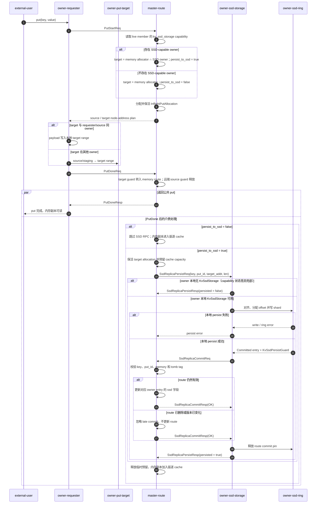

除 SSD capability 兜底外，后台路径还需要处理三类并发风险：

| 风险 | 机制 | 保证 |
| --- | --- | --- |
| persist 期间 target 被释放或容量超卖 | `Arc<Allocation>` 保活 target，capacity reservation 按 allocation capacity 扣减 cache 预算。RAII guard 覆盖成功、失败、取消和 master 关闭。 | persist 始终引用有效 allocation，容量账本与生命周期一致。 |
| 旧版本完成得更晚 | master 用 `put_id` 校验 late commit。 | 旧 SSD 副本不会进入新版本 route。 |
| 本地已写完，master 尚未处理完 commit RPC | `KvSsdPersistGuard` 在该窗口期 pin 住 ring entry。 | commit RPC 返回前，对应 SSD bytes 不会被 ring 覆盖；返回 `OK` 不代表 route 一定已发布。 |

### 3.1 route 数据结构和 SSD commit 条件

`OneKvNodesRoutes` 中与写入可见性直接相关的结构如下，其他字段已省略：

```rust
pub struct OneKvNodesRoutes {
    pub put_id: PutIDForAKey, // Bind all replicas to one key version.
    // ...
    pub node_replicas: RwLock<HashMap<NodeID, KvNodeReplicas>>, // Index both cache layers by owner.
    // ...
}

pub struct KvNodeReplicas {
    pub tomb_tag: NodeTombTag,                  // Track this owner incarnation once.
    pub memory: Option<Arc<Allocation>>,        // Hold the readable memory replica when present.
    pub ssd: Option<KvSsdReplicaInfo>,          // Record the readable SSD replica when present.
}

pub struct KvSsdReplicaInfo {
    pub len: u64, // Preserve the real payload length.
}
```

`node_replicas` 中的每个 owner 只对应一个 entry：

- **owner 身份**：来自 `HashMap` 的 `NodeID` key，不在 entry 内重复保存。
- **节点实例**：`tomb_tag` 绑定本次 owner incarnation；节点离开或重启后，旧副本不能被新实例复用。
- **介质状态**：`memory` 和 `ssd` 独立更新。内存驱逐只清空 `memory`，SSD ring 驱逐或读取失败只清空 `ssd`；两者都为空时才删除 entry。

owner 本地写盘成功后仍需提交 `SsdReplicaCommitReq`。master 只在以下条件全部满足时写入 `KvSsdReplicaInfo { len }`：

- 当前 `kv_routes` 仍有该 key，且 route 的 `put_id` 与请求一致。
- 对应 owner 的内存副本仍然存在。
- owner 的 tomb tag 仍然 live。

`SsdReplicaCommitResp` 当前不区分“已发布”和“已忽略”。route 缺失、版本变化、memory 缺失或节点 tomb 时，master 会忽略 commit，但仍返回 `OK`。因此，owner 侧的 `persisted = true` 只表示本地 entry 已写入且 commit RPC 无协议错误，不能确认 master route 一定包含该 SSD 副本。

SSD persist 可能晚于同 key 的后续覆盖写。`put_id` 校验会丢弃旧版本 late commit，避免它进入新版本 route。`KvSsdPersistGuard` 从本地 commit 开始保活 entry，直到 master 处理完这次 commit RPC；无论 route 最终发布还是请求被忽略，guard 都会释放。

## 4. 读取：内存优先，SSD 只做回填

**只有当前 key-version 没有可读内存副本时，master 才选 SSD。** 以下流程从 owner 本地 `get_cached_info` 未命中后开始。进入 route 路径后，`GetStartReq` 按下表为 `get` 操作选择 source：

| 分支 | 触发条件 | payload 路径 | 完成方式 |
| --- | --- | --- | --- |
| 内存 | route 中存在可读 `memory` 副本。 | source 在 requester owner 时，master 复用对应的 replica guard，requester 无需搬运 payload；否则由 requester 从 `owner-memory` pull 到最终 target。 | requester 发送 `GetDoneReq`。owner 返回 holder metadata，external 再构造公共 `MemHolder`。 |
| 本地 SSD | 没有可读内存副本，且 SSD source 就在 requester owner。 | shard 读到最终 target。满足 direct read 条件时直接写入；否则经过 owner 内部 scratch buffer 复制一次。 | requester 发送 `GetDoneReq`，后续 holder 交付与内存分支相同。 |
| 远端 SSD | 没有可读内存副本，且 SSD source 在其他 owner。 | `owner-ssd-source` 按 chunk 读入本地 staging，每个 chunk ready 后主动 push 到 requester target。 | SSD source owner 发送 `GetDoneReq`；requester 用 `done_*` 字段构造同一套 holder metadata，再由 external 构造公共 `MemHolder`。 |
| 未命中 | 当前 key-version 没有可读的 memory 或 SSD 副本。 | 不传输 payload。 | 返回 `KeyNotFound`。 |

本文把“回填”限定为“把 SSD payload 写入 requester 的最终 target”。staging 是远端 SSD source owner 上的临时、对齐内存；它不会成为用户的 `MemHolder`。

下图展开四条 route 分支、数据面 range 的位置和 master 侧 allocation 控制关系。图中已折叠 owner 本地 `get_cached_info` 未命中之前的包装层。

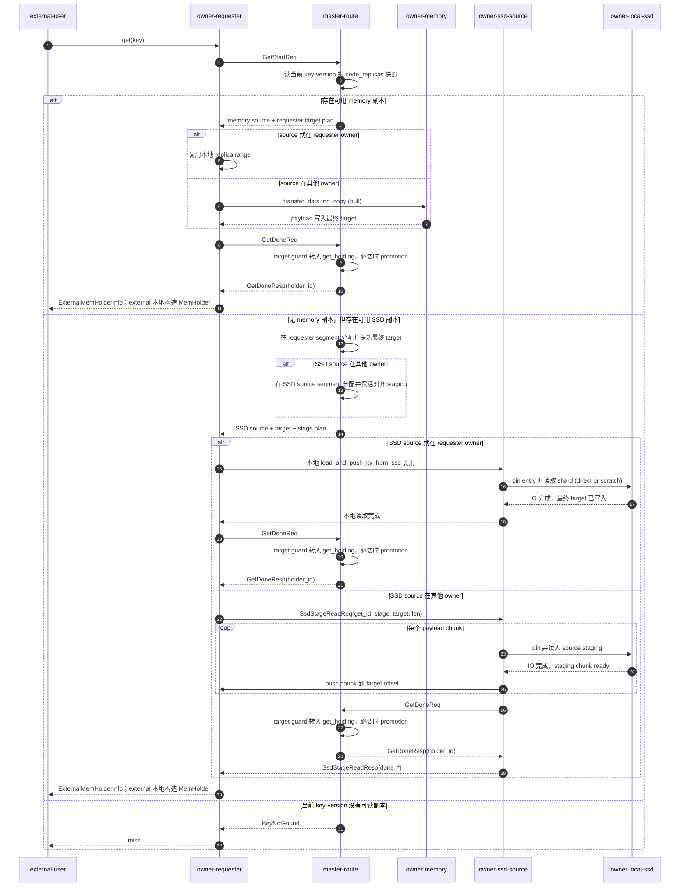

三处实现边界需要单独说明：

- **本地 SSD 回填**：`src_addr == target_addr`，控制面不申请 source staging。地址、offset 和容量满足 direct read 条件时，`KvSsdStorage` 直接写最终 target；否则内部 scratch fallback 会增加一次本地 copy。
- **远端 SSD staging**：master 先计算 `ssd_stage_len = align_ssd_io_len(len)`，再从 SSD source owner 已注册的 segment 中额外分配 `SSD_ALIGNMENT - 1` bytes，从 allocation range 内取得 512-byte 对齐的 `src_addr`。requester 只发送一次 `SsdStageReadReq`，后续 chunk 均由 SSD owner 主动 push。
- **陈旧 SSD route**：读取失败后先 revoke 当前 source，再重新选路；该失败不会向用户返回半成品 holder。

### 4.1 target 分配与有界背压

`get` target 遇到内存压力时按以下顺序处理：

1. **遍历 allocator**：先尝试所有可用 allocator，不在单个 allocator 上连续空转。
2. **推进回收**：运行该 owner 的 replica Moka cache、`inflight_puts` 和 `inflight_gets` maintenance tasks，然后立即重试。`Cache::remove()` 会让 entry 立即不可查询，但 RAII value 可能仍在维护队列中保活 allocation。maintenance 完成后，空间才真正释放。
3. **等待外部释放**：仍无空间时，让出执行权并等待 route 删除、owner 缓存失效 RPC 或 holder ACK。重试间隔为 2 ms，总等待上限为 5 s。
4. **有界失败**：5 s 后仍无空间才返回带 total/free capacity 的 `NoSpace`；等待不会扩大 owner 的配置容量。

新 target 在传输期间尚未进入驱逐 cache，但已经占用 requester owner 的 segment。master 为可提升为内存副本的 durable target 立即预留 allocation capacity，并通过 `InflightGetInfo` 或 allocation 的 on-drop callback 保活 reservation。

这份预留与异步 SSD persist、lease 共用 `cache_reserved_bytes`，避免把在途 `get` 占用误算为空闲预算。`GetRevoke`、60 秒 in-flight TTL 或 `GetStartResp` 发送失败都会释放它。

temporary target 不进入 Moka。`GetDone` 后，master 的 `get_holding` 继续持有 target guard，直到 owner 侧最后一个 `MemoryInfo` 释放并向 master ACK，或 member-left 清理该 requester。requester owner 的非 cache 空间因此要容纳并发 target，以及尚未走完释放链的 temporary holder。

### 4.2 `GetDone` 与 target 生命周期

- **非 lease 的 durable promotion 成功**：master 先更新 route，再释放独立的临时预留，并在同一次请求处理中按相同 weight 插入 Moka，避免 route 与容量索引不同步。
- **带 lease 的 durable promotion 成功**：target 不进入 Moka；reservation 已绑定到 allocation 的 on-drop callback，随该 leased replica 的 allocation 一起存活。
- **无法 promotion**：route 版本变化、节点 tomb 或 route 已删除时，target 降级为 temporary holder 并释放 durable slot。非 lease 路径的独立 reservation 随 `InflightGetInfo` 释放；lease 路径的 reservation 已绑定 allocation，会保留到 temporary holder 释放。
- **所有成功路径**：`GetDone` 都把 requester target guard 写入 master 的 `get_holding`；远端 SSD source staging 和 memory source 的额外保活引用随 `InflightGetInfo` 释放。

与 allocation 生命周期直接相关的字段如下：

```rust
pub struct InflightGetInfo {
    pub put_id: PutIDForAKey,                      // Guard the selected key version.
    pub src_node_id: NodeID,                       // Identify the selected source owner.
    pub allocation: Arc<Allocation>,               // Hold the requester target until GetDone.
    pub source_allocation: Option<Arc<Allocation>>, // Keep a memory source or remote SSD staging alive.
    pub route: Arc<OneKvNodesRoutes>,              // Keep the route and its durable slot alive.
    pub allocation_mode: GetAllocationMode,        // Decide whether promotion is allowed.
    pub source_kind: GetSourceKind,                 // Select memory or SSD cleanup semantics.
    pub cache_capacity_reservation: Option<Arc<NodeCacheCapacityReservation>>, // Reserve durable target capacity.
    // ... Other request identity and length fields.
}
```

`InflightGetInfo` 的核心作用是在一次 `get` 内同时保活 target、source 和 route：

- **`allocation`** 始终表示 requester segment 中的 target；`GetDone` 后由 `OwnerHoldingGetInfo` 继续保活。用户侧 `MemHolder` 引用这段 bytes，但不持有这个 master 侧 Rust 对象。
- **`source_allocation`** 是 master 侧的保活引用：memory 路径用它保活内存副本，远端 SSD 路径用它保活 staging，本地 SSD 回填时为 `None`。`GetDone`、`GetRevoke` 或 in-flight TTL 清理都会释放该引用。
- **`route` 与容量预留** 共同保证 durable promotion 期间的 route 生命周期和容量预算。非 lease 成功路径在同一次请求中更新 route、释放独立 guard 并插入 Moka；lease 路径则由 allocation callback 延续 reservation。
- **`put_id`、`src_node_id` 和 `source_kind`** 限定失败清理范围，避免撤销新版本 route 或错误的介质副本。

external 公共 `get` 的 holder 交付跨越三层对象。只有 master 的 `get_holding` 持有 allocation guard，不能把三层对象统称为“holder 持有 allocation”：

| 层级 | 实际持有 | 正常释放链 |
| --- | --- | --- |
| master | `get_holding[(requester_owner_id, holder_id)]` 中的 `OwnerHoldingGetInfo`，内部持有 requester target 的 `Arc<Allocation>`。 | owner 的 delete-ack batch 通过 `BatchDeleteAckReq` 到达后移除；requester member-left 时也会批量清理。 |
| requester owner | `external_get_holding[(external_client_id, holder_id)]` 中的 `Arc<MemoryInfo>`。它引用 target metadata，未持有 master 进程里的 Rust guard。 | external holder 释放后收到 `ExternalDeleteAckReq` 并移除该引用；owner 侧最后一个 `MemoryInfo` 释放时把记录放入 delete-ack batch，再由 `BatchDeleteAckReq` 通知 master。`get_cached_info` 若仍有引用，master holding 会继续保留。 |
| external process | 根据共享内存 base、`ExternalMemHolderInfo.offset/len` 和 `holder_id` 构造的公共 `MemHolder`。 | 对象释放时向 requester owner 发送 `ExternalDeleteAckReq`；它不直接访问或释放 master 的 `Allocation` 对象。 |

holder 释放只移除 `get_holding` 这条引用。`ReuseReplica` 或 durable promotion 成功后，route 的 `memory` 仍持有独立的 `Arc<Allocation>`；该副本要经过缓存驱逐或 route 清理才会释放。temporary target 没有这条 route 引用。

## 5. 读取子步骤——回填传输：本地复用 target，远端 source 主动 push

上一节已经确定了读取 source、requester target 及其生命周期；进入实际搬运阶段后，memory 与 SSD 链路在 source 形态上分开。memory route 指向 owner 已注册 memory segment 中的现成 bytes，requester 取得 source 和 target 地址后即可发起 pull。SSD route 指向 shard 文件中的 entry，磁盘内容还不是 transfer engine 可直接使用的内存 source，必须先由 SSD owner 完成本地读盘。

最终 target 始终位于 requester owner 的 memory segment，并由 master 侧 guard 保活。当 SSD owner 与 requester owner 为同一节点时，本地 IO 可直接写入 target。当两者不同时，本地 IO 无法跨 owner 写入 segment。此时，SSD owner 先用本地 source staging 接收 chunk，待 chunk ready 后主动 push 到远端 target。这个方向既由 SSD IO 与跨节点传输的边界决定，也让远端路径可以重叠读盘和网络传输。

### 5.1 本地回填复用最终 target

SSD owner 与 requester owner 在同一节点时，master 令 `src_addr == target_addr`，并把 target allocation 的实际 capacity 放进 `ssd_stage_len`。owner 随后调用 `load_into_addr`：满足 direct read 条件时，读盘直接写 target；否则由 `KvSsdStorage` 通过 scratch buffer 完成。两条分支都不需要控制面申请独立 source allocation。

```rust
if peer_id.is_none() && stage_addr == target_addr {
    return store
        .load_into_addr(
            key,         // Select the logical KV entry.
            put_id,      // Select the exact committed key version.
            target_addr, // Read into the final range in the requester segment.
            len,         // Expose only the real payload length.
            stage_len,   // Provide the target allocation capacity for aligned IO.
        )
        .await;
}
```

### 5.2 远端传输方向

两条远端路径的数据都从 source 流向 requester target，差别在 transfer 发起方：

- **内存：requester pull**：requester 已从 `GetStartResp` 取得远端 `src_addr` 和本地 `target_addr`，由它发起从 peer source 到本地 target 的 transfer。
- **SSD：owner push**：requester 只发一次 `SsdStageReadReq`。SSD owner 每读好一个 chunk 就 push 到 requester target，省去 stage-ready 后的一次 RTT，并让读盘与网络传输重叠。

`transfer_data_no_copy` 的方向位决定 peer 端地址在本次传输中是 source 还是 target。该参数只描述数据方向，不表示 peer 持有 master 侧的 `Allocation` guard。下面是删减后的接口：

```rust
pub async fn transfer_data_no_copy(
    &self,                                      // Use this node's transfer engine.
    peer_node: Option<NodeIDString>,            // Select the remote peer; None means local transfer.
    peer_src_or_target: bool,                   // True: peer address is source; false: it is target.
    src_addr: u64,                              // Provide the absolute source address.
    target_addr: u64,                           // Provide the absolute target address.
    len: u64,                                   // Transfer this many real payload bytes.
    seg_guard: Option<ClientCpuMemReadGuard>,   // Optionally keep the local segment alive.
) -> KvResult<TransferBreakdown>;
```

方向位同时决定 peer 地址的语义和本地 segment guard：

- **`true`**：peer 地址是 source，当前节点 pull 到本地 target；owner 侧 segment guard 守住 `target_addr`。
- **`false`**：peer 地址是 target，当前节点从本地 source push；owner 侧 segment guard 守住 `src_addr`。

远端 memory get 和远端 SSD 回填分别使用这两个方向：

```rust
// Memory get: requester owner initiates transfer with peer as source.
client_transfer_engine
    .transfer_data_no_copy(
        Some(memory_owner_id),       // Contact the owner that holds the memory replica.
        true,                        // Interpret the peer address as the source.
        remote_src_addr,             // Read from the replica range in the peer's segment.
        requester_target_addr,       // Write into the requester's local target.
        len,                         // Move only the real payload bytes.
        None,                        // Let the engine acquire the local target guard.
    )
    .await?;

// SSD refill: SSD owner pushes a ready chunk to requester target.
let chunk_target_addr = requester_target_addr
    .checked_add(chunk.offset)       // Place this chunk at its payload offset.
    .ok_or_else(|| KvError::Api(ApiError::InvalidArgument { // Convert overflow into a KV error.
        detail: "chunk target addr overflow".to_string(),   // Explain which address calculation failed.
    }))?;

client_transfer_engine
    .transfer_data_no_copy(
        Some(requester_owner_id),    // Contact the requester whose segment contains the target.
        false,                       // Interpret the peer address as the target.
        chunk.stage_addr,            // Read from this SSD owner's ready staging chunk.
        chunk_target_addr,           // Write to the matching offset in requester target.
        chunk.len,                   // Move this chunk's real payload length.
        None,                        // Let the engine acquire the local source guard.
    )
    .await?;
```

只有远端 SSD 回填会发送 `SsdStageReadReq`。请求把 key-version、`get_id`、staging 地址与容量、requester target 位置和真实 payload 长度交给 SSD owner：

```rust
pub struct SsdStageReadReq {
    pub key: String,                    // Identify the logical KV entry.
    pub put_id: PutIDForAKey,           // Reject data from a different key version.
    pub get_id: u64,                    // Bind the stage operation to its in-flight get.
    pub stage_addr: u64,                // Point to aligned staging on the SSD owner.
    pub stage_len: u64,                 // State the available aligned staging capacity.
    pub target_node_id: NodeIDString,   // Identify the requester whose segment contains the target.
    pub target_addr: u64,               // Point to the final target range in that segment.
    pub len: u64,                       // Preserve the real payload length.
}
```

### 5.3 chunk pipeline 与背压

远端 SSD owner 把读盘和传输拆成两个并发 future：

- **producer**：按 chunk 从 SSD 读到 source staging。
- **consumer**：收到 ready chunk 后立刻 push 到 requester target。

两者通过有界 `mpsc` ready queue 连接。默认 chunk 大小为 4 MiB；producer 最多并发 4 个 SSD read，consumer 最多保留 4 个 transfer inflight，ready queue 容纳 8 个已就绪 chunk 描述。第一个 chunk 读好后即可开始网络传输。

#### producer / consumer 实现片段

```rust
let ready_queue_capacity = DEFAULT_READ_TRANSFER_PIPELINE_INFLIGHT
    .saturating_mul(2) // Buffer two transfer windows between reader and sender.
    .max(1);           // Keep the bounded channel valid for any configured window.
let (chunk_tx, chunk_rx) =
    ::tokio::sync::mpsc::channel(ready_queue_capacity); // Connect producer and consumer.

let producer = store.load_into_addr_chunks(
    key,                                          // Select the logical KV entry.
    put_id,                                       // Select the exact committed version.
    stage_addr,                                   // Read chunks into aligned source staging.
    len,                                          // Stop after the real payload length.
    stage_len,                                    // Enforce the staging allocation capacity.
    DEFAULT_READ_TRANSFER_PIPELINE_CHUNK_BYTES,   // Bound each SSD read to 4 MiB.
    DEFAULT_READ_TRANSFER_PIPELINE_INFLIGHT,      // Allow up to four concurrent SSD reads.
    chunk_tx,                                     // Publish each ready chunk to the sender.
);

let consumer = self.transfer_loaded_ssd_chunks(
    peer_id,      // Select the remote requester; None means the target is local.
    target_addr,  // Use the final target range in the requester segment.
    chunk_rx,     // Consume chunks as soon as their SSD reads complete.
);
let (producer_res, consumer_res) = ::tokio::join!(
    producer, // Run SSD reads concurrently with network transfers.
    consumer, // Push ready chunks without waiting for the full value.
);
match (producer_res, consumer_res) {
    (Ok(()), Ok(())) => Ok(()),
    (_, Err(err)) => Err(err),
    (Err(err), _) => Err(err),
}
```

consumer 只在 transfer inflight 少于 4 时从 ready queue 取新 chunk。达到上限后，有界 queue 会把背压传给 producer；已提交的 transfer 完成后，consumer 再继续取 chunk。

这条 pipeline 中有三种不同的保活机制：

| 机制 | 保护对象 | 释放时点 |
| --- | --- | --- |
| ring read pin | SSD entry 与文件 offset，防止尚未完成的 SSD read 被 tail 覆盖。 | producer 完成全部 SSD read，并把最后一个 ready chunk 送入有界 queue 后。 |
| `InflightGetInfo.source_allocation` | master 侧 guard，保活 SSD owner segment 中的整块 source staging range。 | `GetDone`、`GetRevoke` 或 in-flight TTL。 |
| transfer segment guard | 某个在途 push 使用的本地 staging 地址范围。 | 对应 chunk transfer 完成。 |

ring read pin 只覆盖 SSD 读取阶段，不覆盖整个网络 push 窗口。producer 释放 pin 后，尚未完成的 push 由 master 侧 staging guard 和每次 transfer 的 segment guard 保护。

下图聚焦远端 SSD 回填内部的 pipeline；`GetStart/GetDone` 的完整流程见第 4 节。`owner-requester-target` 只表示数据传输端点，其 allocation 生命周期仍由 master 的 in-flight 状态和 `get_holding` 管理。

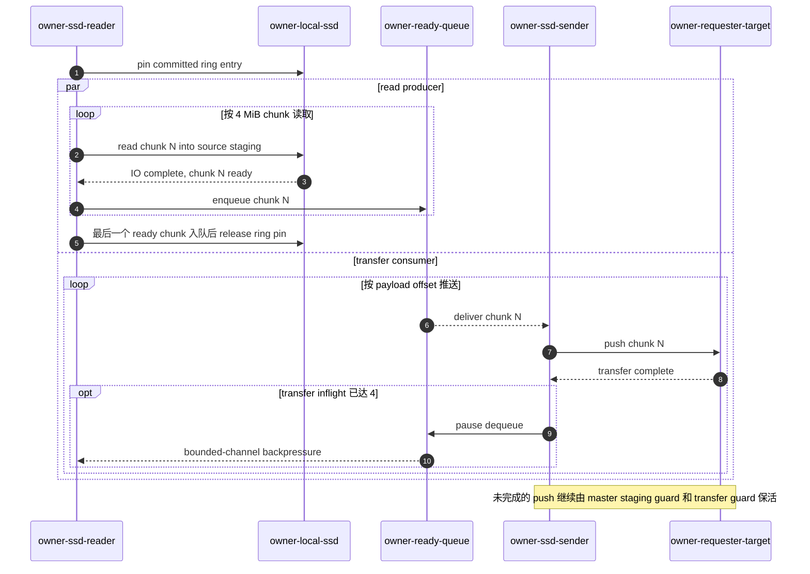

## 6. owner 本地机制：对齐、ring 和 IO 调度

**SSD 介质的控制引擎留在 owner。** SSD 文件 offset、`O_DIRECT` 文件 IO 对齐、ring 覆盖保护和 `io_uring` 调度都由 owner 处理。master 仍负责分配 requester target 和跨节点 staging，并传递相应地址、容量与真实 payload 长度。用户只看到真实 payload 语义。

master 使用已注册的 owner segment allocator 为每次回填分配 requester target，并创建对应 guard；跨节点回填还会分配 SSD source staging。bytes 位于相应 owner 的 segment，RAII guard 位于 master。master 不记录 SSD 文件布局，用户侧仍通过 `MemHolder` 访问真实 payload。

### 6.1 写入：区分真实长度和对齐长度

**`len` 是 payload 长度，`aligned_len` 是 owner 本地 IO 长度。** target owner 从请求携带的 target 地址复制 payload，再构造 512-byte 对齐的写入 buffer。route 中的 `Arc<Allocation>` 在此期间保活 target 地址范围。

| 字段 | 含义 | 使用范围 |
| --- | --- | --- |
| `len` | 真实 payload 长度。 | master route、`SsdReplicaCommitReq`、transfer 长度和 `MemHolder.len`。 |
| `aligned_len` | `align_up(len, 512)` 得到的对齐长度。 | owner 本地 ring 分配、shard offset 推进和 `O_DIRECT` read/write。 |

例如，1000-byte payload 的 `aligned_len` 是 1024 bytes：

1. owner 创建 1024-byte 的对齐 `AlignedBuffer`，先置零，再把前 1000 bytes 填入 payload。
2. ring 分配、shard offset 推进和 SSD 写入都使用 1024 bytes。
3. `SsdIndexEntry` 同时记录 `len = 1000` 和 `aligned_len = 1024`；owner 向 master 提交的仍是 `len = 1000`。
4. 后续读取会校验 `entry.len`，transfer 和 `MemHolder` 只暴露前 1000 bytes。末尾 24 bytes padding 留在 owner 内部。

### 6.2 ring：从 `Writing` 到 `Committed`

**只有完整写入的 `Committed` entry 才能参与读取；写入、route 提交或读取期间，ring 不会覆盖对应区间。**

本地 SSD 引擎按 value 粒度选路：

- 用 `next_write_device` round-robin 选择一个有效 device。
- 把整个 value 发送到选中 device 的 writer queue。
- 当前实现不把同一个 payload 拆到多块 device 做条带化。

因此，多 device 并行发生在 value 粒度：不同 value 可以落到不同 device；一个 value 内部仍是某个 shard 的连续 offset。

owner 本地 `SsdRingBuffer` 决定 SSD 文件位置。writer task 只在本 device 的 `shard_ids` 里选择 shard，并为对齐后的 payload 分配连续文件区间。ring 按以下规则分配：

- `aligned_len = align_up(len, 512)`，ring 按对齐后长度分配空间。
- 每个 shard 是环形空间，`head` 前进分配新写入，`tail` 表示可以覆盖到哪里。
- 如果当前 shard 尾部剩余空间不足，会跳到文件开头继续找连续空间。
- 如果推进 `tail` 会覆盖未完成写入、active read pin 或 route commit pin，返回 `BlockedByBusyIo`。

分配完成后，状态转换、覆盖保护和 route 清理遵循以下规则：

- **`Writing`**
  - offset 已分配，SSD 写入尚未成功。
  - 默认单 buffer 路径使用 `O_DIRECT` 和 `io_uring` write。
- **`Committed`**
  - 只有实际写入字节数等于 aligned buffer 长度，entry 才从 `Writing` 转为 `Committed`。
  - `pin_read` 只接受 committed 且 offset 仍有效的 entry，未完成写入不会被 `get` 选中。
- **ring 覆盖保护**
  - route commit pin：保护本地 commit 到 master 处理完 commit RPC 的窗口。
  - read pin：保护 SSD read 使用 entry 与 file offset 的窗口；远端 push 后半段由 staging allocation 和 transfer guard 保活。
- **tail 驱逐通知**
  - tail 推进时，ring 返回本次被覆盖的全部 committed `KvSsdKey`。
  - writer 把它们送入有界失效队列，不在 SSD 写入热路径逐条调用 master。
  - owner batch task 按 256 条或 10 ms 的阈值聚合 RPC；第 7 节展开 master 的条件清理和读取兜底。

下图展示 owner 本地 `Writing → Committed` 与 master 发布 SSD route 之间的时序。`owner-memory-target` 只有前 `len` bytes 是真实 payload，其地址范围由 master route 中的 `Arc<Allocation>` 保活。

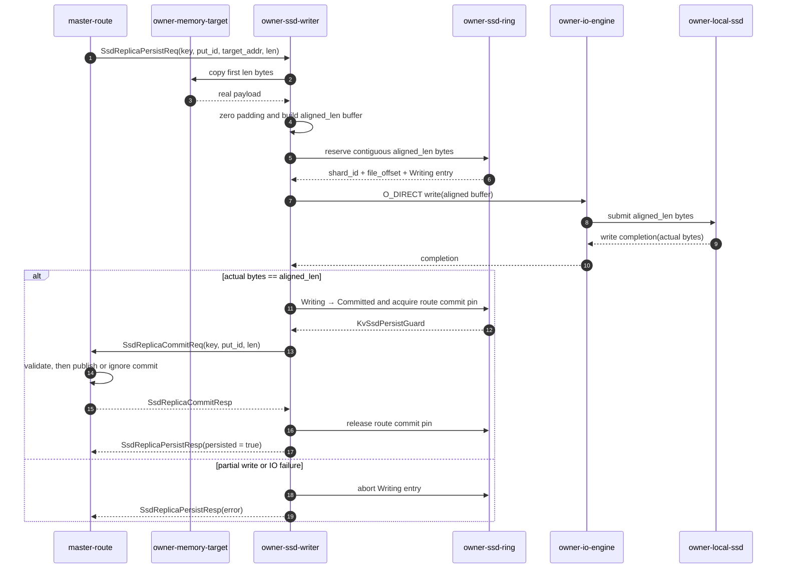

### 6.3 读取：direct read 和 scratch fallback

**direct read 是有条件的 owner 本地 fast path；任一对齐或容量条件不满足时，scratch read 负责兜底。**

每个 chunk 的文件位置由 `entry.file_offset + offset` 得到。本地回填读入 requester target；远端回填读入 SSD source staging。

| 路径 | 选择条件 | owner 本地动作 | 复制边界 |
| --- | --- | --- | --- |
| direct read | 读入地址和文件 offset 都按 512 bytes 对齐，target capacity 覆盖对齐后的 IO 范围。按 chunk 读取时，当前 read 长度也必须对齐。 | `io_uring` 直接把 shard 内容读入本地目标地址。 | 这段 SSD-to-target 读取没有额外的 owner 本地 copy；这不代表整条 `get` 链路都是零拷贝。 |
| scratch read | 任一 direct read 条件不满足。 | 先读入 512-byte 对齐的 `AlignedBuffer`，再把当前 chunk 的真实 payload 复制到目标地址。 | 多一次 owner 本地 CPU copy。 |

两条路径都只向下游暴露真实 payload 长度。`O_DIRECT` padding 不进入 transfer 长度，也不进入用户 `MemHolder.len`。

下图只画 SSD source owner 内部的读盘。`owner-read-target` 始终位于 SSD source owner 本地：本地回填时，它同时是 requester target；远端回填时，它是 source staging。远端 requester 的最终 target 不在图中，后续 push 见第 5.3 节。

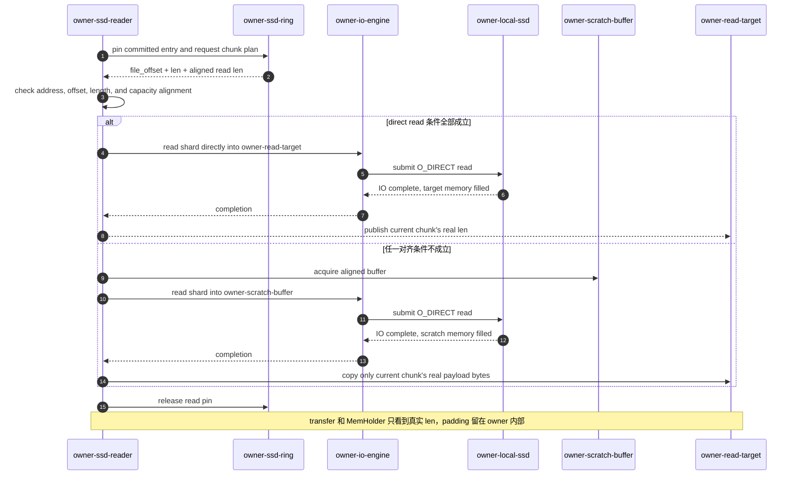

### 6.4 IO 调度：让回填读优先，同时保留后台写进展

**同一个 device 上，SSD 回填读位于 `get` 的同步等待路径，SSD persist 写则在内存副本发布后异步进行。** 因此当前调度给读更多的 SQE 提交机会，但仍持续推进写。写长期不进展会延迟 SSD 副本 commit，并让 `Writing` entry 和对齐 buffer 继续占用资源；持续读下的绝对读优先还可能拖住 ring 后续复用空间。`read_weight = 2` 表达的是这种有界的读偏置。

调度分成两层，各自处理不同问题：

| 层次 | 当前机制 | 设计原因 |
| --- | --- | --- |
| device 任务层 | 每个去重后的 device 独立持有 writer queue、reader queue 和 `UringIoEngine`。writer task 管理 ring 分配以及 `Writing -> Committed/abort`；reader task 管理 chunk read 和 completion 复查。 | 在当前 owner 本地调度范围内，实际 device 是 IO 竞争边界。独立队列避免忙 device 在软件调度层阻住空闲 device，也让读写使用不同的上层并发上限和状态机。 |
| `io_uring` 提交层 | 每个 `io_uring` 线程各有 read/write channel，在 `io_depth` 内选择下一个 SQE。 | 分开 channel 后，引擎可以在真正占用 SQE 槽位时仲裁读写，避免后到的回填读只能排在单一 FIFO 中的后台写之后。 |

`io_depth` 在设备并行度与在途资源占用之间设置上界：多个已提交 SQE 可以让 SSD 持续有工作可做，上限则避免单个 `io_uring` 线程无界占用 buffer 和 completion context。真正能到达这一层的并发量，还会受 writer/reader task 各自 inflight 上限的约束。

`read_weight = 2` 只在第二层生效。每个 `io_uring` 线程独立维护 `read_inflight` 和 `write_inflight`：前者小于等于后者的两倍时，先尝试 read channel；超过后，先尝试 write channel。首选 channel 为空时会立即取另一个 channel 的任务，不会为了维持比例而让 SQE 槽位空闲。

这个 `2:1` 是固定的软调度偏置，不是硬上限或队列积压阈值。等号分支会再提交一个 read，completion 速率也会持续改变 inflight 组成；因此它不保证单个 device 上的精确 `2:1` 比例。它也不考察队列长度、请求大小、等待时间或 deadline。权重只决定下一个尚未提交的 SQE；已提交的 IO 不会被抢占，`io_depth` 已满时，新的回填读仍需等待 CQE 释放槽位。所以这是一个低成本的提交偏置，不构成读延迟 SLA。

**`SingleBuffer` 是对当前数据形态的特化。** 写路径已经把 payload 放入连续的对齐 `AlignedBuffer`；direct read 和 scratch read 的目标也都是一段连续内存。默认 `KvSsdUringMode::SingleBuffer` 因而直接提交 `IORING_OP_READ` / `IORING_OP_WRITE`，避免构造并保活只含一个元素的 iovec。`Iovec` 保留为测试和对照路径。这项特化没有消除 `O_DIRECT` 对齐、padding、scratch copy 或网络传输，其收益范围仅限于 owner 本地 IO 提交层。

read completion 复查与 read pin 也承担不同职责：

| 机制 | 作用时段 | 职责 |
| --- | --- | --- |
| read pin | 从获取 committed entry 到本次读取结束。 | 阻止 `tail` 越过正在使用的文件区间，预防 offset 在 IO 期间被复用。 |
| completion 复查 | CQE 返回后。 | 检查读取开始时捕获的 `entry.begin` 是否仍不早于当前 `tail`。已失效时删除 entry 并返回 `KeyNotFound`。 |

read pin 负责预防覆盖，completion 复查负责拦住异常状态下的结果发布。复查无法撤销已经写入 target 的 IO，因而不能取代 pin；它是跨过异步提交边界后的最后一道不变量检查。在完整 `get` 路径中，返回错误后的 SSD stage 会进入第 7.2 节的 revoke 与有界重新选路，不会向用户交付这次 target。

下图聚焦单个 device 内部的调度，不涉及 `master-*` 或 `external-*` 角色。`owner-kernel-io` 表示该 owner 文件上的 `io_uring` SQE/CQE 交互，不表示 owner 独占内核。

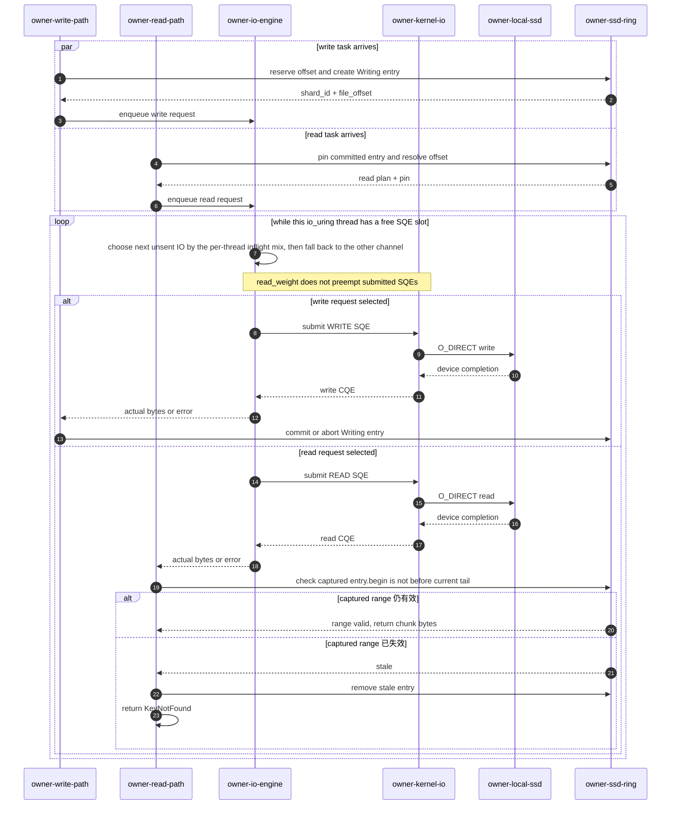

## 7. 一致性：沿用 key-version 和 holder 生命周期

**SSD 副本只有在 master route 和 owner ring 都有效时才可读。** `get_holding` 保存的是 requester target 的 master 侧 `Allocation` guard；远端 source staging guard 只保留在本次 `InflightGetInfo` 中。

一次 SSD 回填的完成语义包含以下四个方面：

- **`GetDoneReq` 调用方**
  - 本地 SSD source：requester 读盘并完成 target 写入后调用。
  - 远端 SSD source：SSD owner 读盘并 push 到 requester target 后调用。
- **最终 holder 与 allocation 生命周期**
  - `inflight_gets.req_node_id` 始终指向 requester owner，不受 `GetDoneReq` 调用方影响。
  - master 把 requester target guard 写入 `get_holding` 并生成 `holder_id`；target bytes 仍位于 requester owner 的 segment。
  - 远端 source staging guard 不进入 `get_holding`，只随 in-flight get 生命周期释放。
- **远端响应转发**
  - SSD owner 把 `GetDoneResp` 中的 `holder_id`、`allocation_mode`、错误码和 server time 写入 `SsdStageReadResp.done_*`。
  - requester 使用这些字段构造 owner 侧 `MemoryInfo` 和 `ExternalMemHolderInfo` 响应。external 再构造公共 `MemHolder`，用户看不到 SSD stage RPC。
- **durable promotion**
  - `GetStart` 尝试预留 durable slot。成功时 `allocation_mode = DurableReplica`，否则为 `Temporary`。
  - `GetDone` 只在 allocation mode 为 durable、route `put_id` 仍匹配、且 requester tomb tag 仍 live 时，才把 target guard 写入 entry 的 `memory`。
  - promotion 成功后，SSD 回填结果成为新的内存副本。

### 7.1 owner 驱逐后批量清理 route

为了让 master 中因物理驱逐产生的陈旧 route 尽快收敛，同时尽量减少逐条通知产生的控制面通信，owner 先完成物理驱逐，再聚合对应的 key-version，批量通知 master 清理逻辑 route：

- **驱逐输入**：ring 推进 `tail` 时，一次返回本轮覆盖掉的全部 committed key-version。
- **batch 触发**
  - 第一条记录到达后，最多等待 10 ms。
  - 累计到 256 条时立即发送。
- **RPC 失败**：当前 batch 留在 task 中重试。
- **队列或控制面不可用**
  - 有界队列满、进程退出或 master 持续不可用，都不阻塞 SSD 写入。
  - 可能残留的陈旧 route 由第 7.2 节的读取兜底处理。

批量 RPC 只携带待清理的 key-version：

```rust
pub struct SsdReplicaEviction {
    pub key: String,             // Identify the route entry to inspect.
    pub put_id: PutIDForAKey,    // Restrict cleanup to the evicted key version.
}

pub struct BatchSsdReplicaEvictReq {
    pub evictions: Vec<SsdReplicaEviction>, // Carry one owner-side eviction batch.
}
```

master 收到 batch 后按以下规则清理 route：

- **owner 身份**：请求不重复传 `node_id`，master 直接使用 RPC 发送方身份。
- **版本门禁**：只有当前 route `put_id` 与驱逐项匹配，master 才清除该 owner entry 的 `ssd`。
- **清理粒度**
  - entry 仍有内存副本：只清除 `ssd`。
  - `memory` 和 `ssd` 都为空：删除 owner entry。
  - 整个 key-version 没有 live 副本：删除 `kv_routes`。
- **prefix index**
  - 在一次写锁内批量清理。
  - 同名 key 已写入新 route：保留新版本 prefix entry。
- **master 职责边界**：master 不参与 SSD offset 分配，也不决定本地驱逐顺序；只接收 owner 的驱逐结果并收敛逻辑 route。

### 7.2 陈旧 SSD route 的读取兜底

**SSD stage 失败后，requester 先撤销当前 source，再有界重新选路。** 重新选路可以继续使用其他 live source；没有副本时返回 miss。连续 3 次 SSD stage 失败后返回 error。任何失败分支都不会向用户暴露半成品 holder。

SSD stage 失败时，请求方会调用：

```rust
GetRevokeReq {
    get_id,                 // Revoke this in-flight get and release its allocations.
    drop_ssd_source: true,  // Clear the failed SSD option from the current route.
}
```

master 按下列顺序撤销失败 source：

- **释放本次 in-flight**：先删除 `inflight_gets`，让 target 和可选 staging 进入释放路径。
- **限定 route 删除条件**
  - `drop_ssd_source == true`。
  - `source_kind == GetSourceKind::Ssd`；memory source 不会因该标志被删除。
  - route `put_id` 与本次 in-flight get 仍一致；不撤销新版本 route。
- **清理失败 source**
  - 把 `src_node_id` 对应 entry 的 `ssd` 设为 `None`。
  - entry 也没有内存副本：删除该 entry。
  - 整个 key-version 已无 live 副本：删除 `kv_routes`；启用 prefix index 时，再异步清理对应索引。
  - 失败 source 清理与主动 batch 驱逐共用同一个条件删除函数。
- **重新选路**
  - `GetRevokeResp` 返回后，请求方重新发送 `GetStartReq`。
  - 下一次可能命中另一份内存副本、SSD 副本、同 key 新版本，或返回 miss。
  - 陈旧 SSD source 最多触发 3 次重新选路，避免无限循环。
  - SSD stage RPC 失败和不合法的 `ssd_stage_len` 都进入同一套 revoke 与重选流程。
- **allocation 与崩溃清理**
  - 远端 staging 保存在 `source_allocation`；本地回填时该字段为 `None`。
  - `GetDone`、`GetRevoke` 或 in-flight TTL 驱逐都会释放远端 staging。
  - requester 在 in-flight 阶段崩溃：节点 tomb 阻止副本 promotion 和旧节点复用。`inflight_gets` 最迟由 60 秒 TTL 释放 target/staging guard。
  - requester 在 `GetDone` 后离开：master 的 member-left 清理移除该节点的 `get_holding`；正常路径则由 owner 的 holder delete-ack batch 释放。
  - 远端 SSD owner 崩溃：其进程内 staging bytes 消失。master 中对应的 staging guard 随 `GetRevoke` 或 in-flight TTL 释放，节点 tomb 使旧 SSD route 不再可选。

在 master 接受 `GetDoneReq` 之前发生的读取或传输失败会走 `GetRevoke`，target guard 不进入 `get_holding`，用户也不会拿到半成品 payload。

另一个边界发生在 master 已提交 `GetDone`、但响应随后丢失时。此时 target guard 已写入 `get_holding`，requester 却可能没有收到 `holder_id`。

当前通用 holder 协议没有按 `get_id` 幂等查询已提交结果的接口。这类未交付 holder 无法由随后的 `GetRevoke` 立即回收，只能等待能够识别该 holding 的后续清理，例如 requester member-left。这不影响 SSD 数据完整性，但属于当前完成协议的资源回收边界。

下图展示成功完成、失败 revoke 和超时清理三条路径。远端路径由 `owner-ssd-source` 代替 requester 调用 `GetDoneReq`，但最终 target 始终位于 requester segment。

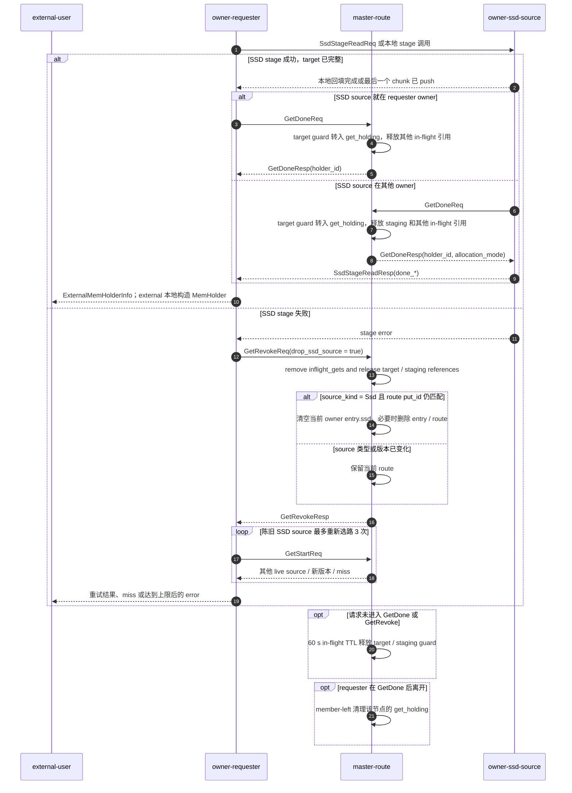

### 7.3 删除、驱逐与重启

- **覆盖写与 delete**：覆盖写生成新 `put_id`，旧 SSD late commit 因版本不匹配被忽略。显式 delete 移除整个 `kv_routes` 条目；节点 tomb 清理则删除该节点在 `node_replicas` 中的整个 entry。
- **两层独立驱逐**：内存驱逐只清空 `memory`；SSD ring 驱逐或读取失败只清空 `ssd`。两个字段都为空时才删除 owner entry，整个 route 没有副本时才删除 `kv_routes`。
- **物理 bytes 不等于可读副本**：route 被删除或版本不匹配后，旧 bytes 即使还在 shard 中也不会被公共 `get` 命中。陈旧 route 被选中时，`pin_read` 会复查 committed 状态和 offset，失败后 revoke source 并重新 `GetStart`。
- **owner 重启**：shard 以 `create + truncate` 打开，并重建空的本地 SSD cache 和 ring。当前没有 WAL、checkpoint 或 shard 扫描。控制面尚未完成 tomb 清理时，读取兜底会撤销失效 SSD source，再重新选路或返回 miss。

## 8. 性能测试

本节先给出核心结果，再说明计数边界与实验设置，最后分别展开 CPU、GPU 和 SSD 路径证据。性能数字只在对应小节定义的硬件、数据集、输出模式和统计窗口内成立。

### 8.1 核心结果

- **CPU / GPU 使用同一 pressure 口径**：CPU 主图包含 192 条记录，覆盖原生引用 / handle 与 `bytes`、4 个 payload、4 个并发度、Fluxon、两种 Mooncake 拓扑和 SSD 关/开；GPU 主图包含 72 条记录，覆盖 `cuda`、3 个 payload、4 个并发度、3 种拓扑和 SSD 关/开。264 条记录全部为 `SUCCESS`、0 error、来源完整且 unknown 为 0。
- **miss 是结果，不是过滤条件**：两侧都使用约 2.5 GiB 数据集和 2 GiB DRAM。柱高只统计 hit payload，红点显示 `hit / (hit + miss)`。SSD-off 的 CPU 命中率为 Fluxon **89.112%–94.390%**、Mooncake 独立 owner **23.759%–66.879%**、Mooncake 每进程 **22.488%–68.655%**；GPU 对应范围为 **89.326%–93.267%**、**34.557%–62.223%** 和 **35.430%–64.782%**。
- **SSD-on 也保留实际 miss**：CPU 的 Fluxon 和 Mooncake 独立 owner 在 SSD-on 下均为 100% 命中，Mooncake 每进程为 **72.830%–100%**；GPU 对应为 100%、100% 和 **59.855%–100%**。因此 SSD-on/off 柱差同时包含命中集合、介质来源和系统调度差异，不能解释成单一 SSD 开销。
- **SSD-on 的 hit 同时来自两层**：CPU 中 Fluxon 的 SSD 来源占 hit 的 **17.550%–48.650%**，Mooncake 独立 owner 为 **62.065%–82.385%**，Mooncake 每进程为 **59.341%–83.011%**；GPU 对应为 **20.242%–46.508%**、**64.837%–77.135%** 和 **56.073%–84.198%**。
- **GPU 多并发已进入同一张主图**：Fluxon 在 SSD-off 下从 c2 到 c16 提高到 5.83、5.83 和 4.68 倍，SSD-on 下提高到 6.50、7.22 和 6.80 倍，分别对应 4、8、16 MiB。Mooncake 的两种拓扑也按相同的六柱顺序展示，不再另画一张来源图。
- **同路径 Foyer 消融下原生 SSD 仍然更快**：64 条测量记录对应 32 个原生/Foyer 配对，全部为 `SUCCESS`、0 error、0 unknown、0 persist failure，两侧命中率均为 100%。当前 Foyer adapter 的 hit payload 带宽是原生实现的 **14.8%–65.9%**，配对中位数为 **37.2%**，32 个配对中没有胜出；P95 是原生实现的 **2.30–8.46 倍**。这是当前接入路径的结果，不外推为 Foyer 库的通用性能结论。

这些数字只覆盖下文定义的单机、固定容量、Zipf 分布、30 秒窗口和各自 fast path。实验不包括跨机器 RDMA、多物理盘条带化、重复运行的统计置信区间或真实业务 trace。

### 8.2 计数边界：原生引用 / handle、`bytes` 与 `cuda`

Mooncake 没有 Fluxon 意义上的 holder。`holder` 只是 benchmark 配置 `kv_get_output=holder` 的归一化模式名，Fluxon 和 Mooncake 实际返回 `MemHolder` 与 `BufferHandle`。

Mooncake 常规 `Store.get()` 直接返回 Python `bytes`，因此结果包含完整 payload copy。`Store.get_buffer()` 返回 native `BufferHandle`，无需创建 Python `bytes` 即可取得 `ptr()`、`size()` 或 `memoryview`。原生引用 / handle 组把计数边界放在 host 内存引用返回之后。

#### 两侧原生引用的调用与生命周期差异

benchmark 中的实际分支等价于：

```python
if backend == "MOONCAKE":
    # Internal adapter calls Mooncake Store.get_buffer().
    result = mooncake_store.get_buffer_blocking(key)  # Fetch a native BufferHandle.
else:
    result = fluxon_store.get_blocking(key)           # Fetch a native MemHolder.

native_ref = result.unwrap()  # Keep the native host reference alive while counting success.
```

两者只在本次 benchmark 的**计数边界**上对齐，类型语义并不相同：

| 对比维度 | Fluxon | Mooncake | 对齐方式 |
| --- | --- | --- | --- |
| 实际返回类型 | `MemHolder` | `mooncake.store.BufferHandle` | 本文直接写真实类型，不写“Mooncake holder”。 |
| 底层调用 | `KvClient.get_blocking()` | `Store.get_buffer()`，由 benchmark adapter 包成 `get_buffer_blocking()` | 都在 native host buffer ready 后返回。 |
| 数据访问 | `MemHolder.access()` | `ptr()`、`size()`、`memoryview(BufferHandle)` | 原生引用模式不 materialize；bytes / CUDA 模式再继续消费。 |
| 生命周期语义 | 参与 Fluxon 的 `holder_id`、`get_holding` 和释放流程。 | 由 Mooncake Python binding 的 `BufferHandle` 管理返回 buffer 的生命周期。 | 只要求对象存活到本次操作计数完成。 |
| 不对齐的部分 | Fluxon holder 协议。 | 没有 Fluxon 的 `holder_id/get_holding/revoke` 协议。 | 不声称 API 或生命周期协议等价。 |

原生引用模式仍然包含后端选择 SSD route 时从 SSD 到 host 的搬运。它只省去随后将完整 payload 物化为 Python `bytes` 的额外 copy。`cuda` 从同一个 native holder 取得 pageable host pointer，再交给 Fluxon 与 Mooncake 共用的双槽 H2D 流水线。只有对应 CUDA event 完成后，这次操作才计为成功。

下图覆盖一次 benchmark `get` 从发起到达到对应计数边界的过程。`external-backend-adapter` 是 benchmark 侧的统一适配层，封装完整的 Fluxon 或 Mooncake get；它不表示两套系统共享 Fluxon 的 owner/master 架构。

- **`external-benchmark-worker`**：发起 KV get，按 `holder/bytes/cuda` 模式消费结果，并在该模式的完成点计数。
- **`external-backend-adapter`**：在同一调用面上包住 Fluxon 或 Mooncake 的完整 get，并返回已驻留 host 的 `MemHolder` 或 `BufferHandle`。
- **`external-host-output`**：表示 pageable host 上的 native reference 生命周期，以及 `bytes` 模式的完整 payload 物化。
- **`external-pinned-slot`**：每个 benchmark worker 复用的两个 pinned host slot 之一。
- **`external-cuda-runtime`**：对应 slot 的 CUDA stream 和 event，负责 `cudaMemcpyAsync` 提交与完成通知。
- **`external-gpu`**：接收 payload 的 GPU device buffer；这次实验不计 D2H 或 kernel 执行。

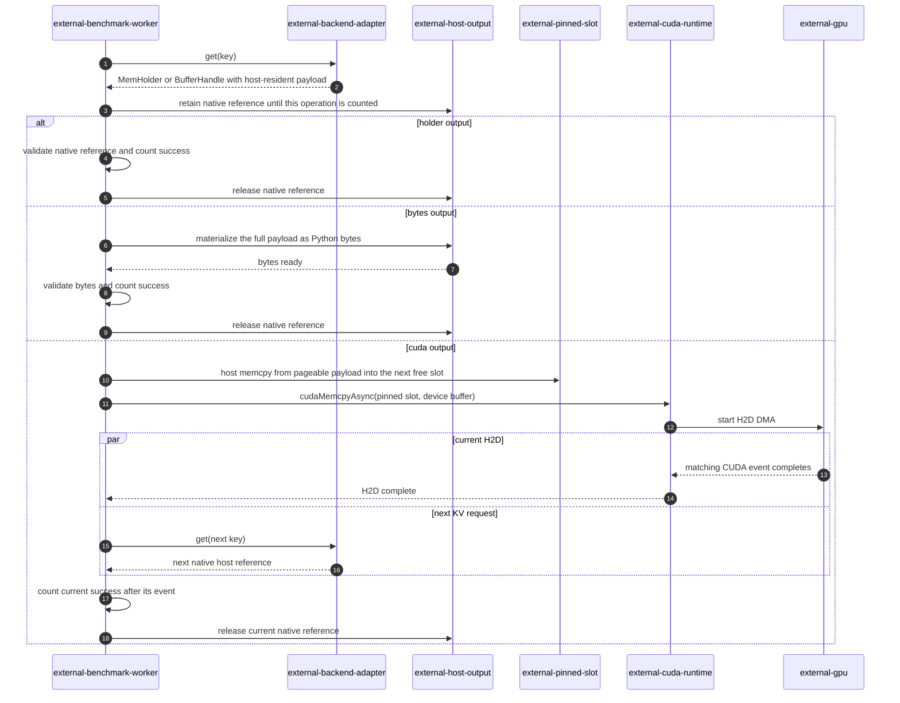

| benchmark 输出模式 | Fluxon 映射 | Mooncake 映射 | 共同计数边界 |
| --- | --- | --- | --- |
| `holder`（归一化模式名） | `get_blocking()` 返回 `MemHolder`。 | `get_buffer_blocking()` 调用 Mooncake `Store.get_buffer()`，返回 `BufferHandle`；该对象暴露 `ptr()`、`size()` 和 buffer protocol。 | 原生引用已返回；不创建完整 Python `bytes`。 |
| `bytes` | `MemHolder.access()` 解码出 payload `bytes`，校验长度并触碰首尾字节。 | 从 `memoryview(BufferHandle)` 定位 payload，再调用 `bytes(...)` 完整复制，校验长度并触碰首尾字节。 | 完整 Python `bytes` 已生成；不含 GPU copy。 |
| `cuda` | 从 `MemHolder` 中取得 CPU DLPack payload 指针。 | 使用 `BufferHandle.ptr() + payload_offset` 取得 host 指针。 | 对应 CUDA event 已完成；不含 D2H 和 kernel 执行。 |

来源计数与输出计数共用同一个 warmup 后统计窗口，但两套系统的观测方式不同：

| 后端 | DRAM / SSD 归因方式 | 完整性判定 | 边界 |
| --- | --- | --- | --- |
| Fluxon | Rust get 路径保留 `GetSourceKind::Memory` / `GetSourceKind::Ssd`，经 external holder 传到 benchmark；每个成功操作单独计数。 | 每个 hit 都必须有且只有一个 source kind。 | 表示本次 get 选中并完成的 route source；它不是 NVMe 设备层 IO trace。 |
| Mooncake | 在统计窗口起止点采样 `get_offload_rpc_read_count()`；`0.3.11.post1` 的单 key `get_buffer()` 在选中 `LOCAL_DISK` 后会进入唯一的 offload-RPC 计数入口。counter 增量记为 SSD hit，成功 hit 减该增量记为 DRAM hit。 | counter 必须单调，增量不能超过该节点成功 hit。 | 这是窗口 counter 推断。本次 CPU 和 GPU 有效记录的采样时刻与窗口边界最大偏差分别为 13.047 ms 和 1.912 ms。 |

Fluxon / Mooncake coordinator 只在每个节点的 `memory + ssd + unknown == hit`、观测完整且 `unknown == 0` 时发布完整来源结果。如果任一节点的计数不自洽，该节点的全部 hit 都归入 unknown，不根据剩余量猜测来源。miss 不分配 DRAM / SSD source，单独进入命中率分母。CPU 的 192 条记录和 GPU 的 72 条记录均为完整来源、unknown 为 0。

分层逻辑读带宽是整个统计窗口的平均值：`tier logical read GiB/s = tier hit 数 × 原始 payload bytes ÷ 窗口秒数 ÷ 2^30`。CPU 和 GPU 的统计窗口均为 30 秒。本次实验使用固定 payload，因此可以从来源操作数精确换算逻辑读取量。柱高不包含 miss；红点使用 `hit ÷ (hit + miss)`，两者共同描述本次 pressure workload。

bootstrap 在统计窗口前完成，窗口内的 workload 只包含 get。因此，已纳入记录的 DRAM 和 SSD 逻辑写带宽均为 `0.000 GiB/s`。

SSD 回填写入 host memory 的流量不重复计入 DRAM 逻辑写带宽。物理 DRAM 流量、SSD 读放大和回填写放大需要通过硬件计数器或设备 trace 观测。

#### CUDA 双槽 pipeline 与阶段指标口径

`cuda` 模式为每个 benchmark 线程固定复用 2 组 pinned host buffer、stream、event 和 GPU buffer，不增加新的 YAML 参数。线程先把 pageable source 复制到空闲 pinned slot，再调用 `cudaMemcpyAsync`。提交后不等待 event，下一次 KV get 可以和 H2D 重叠；两个 slot 都在途时，才等待最早提交的 event。

统计窗口结束时会 drain 所有在途 slot，但完成时间超出窗口的操作仍会被过滤。Mooncake 的 benchmark get 路径直接调用 `get_buffer_blocking()`，不再额外调用一次 `get_size()`。

两边只在 host pointer 的提取方式上不同，之后都进入同一个 H2D 流水线。`cuda_host_stage_us` 记录 pageable source 到复用 pinned slot 的 copy，`cuda_submit_us` 记录 `cudaMemcpyAsync` 调用，`cuda_h2d_event_us` 记录覆盖 H2D 的 CUDA event 区间。

`cuda_pipeline_residence_us` 从开始占用 slot 到前台确认 event 完成，包含 host staging、H2D 和完成轮询。它与下一次 KV get 存在重叠，不能和其他阶段机械相加。benchmark 会把 `MemHolder` 或 `BufferHandle` 连同相关 view 保留到 event 完成，使两边释放 native reference 的时点与成功计数边界一致。

### 8.3 实验设置

主图 case 在同一台测试机上串行执行，硬件为 Intel Xeon Platinum 8468、Samsung NVMe（XFS）和 NVIDIA H100 80 GB，GPU 链路为 PCIe 5.0 x16。bootstrap 后只读，workload 使用固定 value size 和 Zipf 分布。

CPU 和 GPU 主图统一使用 SSD-pressure 数据集：数据集约 2.5 GiB，DRAM 贡献为 2 GiB；SSD-on 再贡献 16 GiB SSD，SSD-off 不贡献 SSD。数据集、请求分布、worker 布局和统计窗口保持一致。由于数据集大于 DRAM，miss 和成功 hit 集合的变化就是实验要观察的结果；图同时报告命中率与 hit payload 带宽，不把开关差解释成纯介质开销。

| 组别 | DRAM 存储贡献 / 原始数据集 | payload / keyspace | worker 布局 | 总时长 / warmup / 统计窗口 |
| --- | --- | --- | --- | --- |
| CPU Fluxon / Mooncake pressure | 2 GiB / 约 2.5 GiB | `1/4/8/16 MiB - 128 B` / `2560/640/320/160`；原生引用 / `bytes` | c2=`1×2`、c4=`1×4`、c8=`2×4`、c16=`4×4` | 35 / 5 / 30 s |
| CPU Fluxon SSD backend 消融 | 2 GiB / 约 2.5 GiB；两侧再配置 16 GiB SSD | 与 CPU pressure 相同；`MemHolder` / `bytes` | 与 CPU Fluxon / Mooncake pressure 相同 | 35 / 5 / 30 s |
| GPU pressure 开关矩阵 | 2 GiB / 约 2.5 GiB | `4/8/16 MiB - 128 B` / `640/320/160`；`cuda` | c2=`1×2`、c4=`1×4`、c8=`2×4`、c16=`4×4` | 35 / 5 / 30 s |

主图使用的 Fluxon wheel SHA-256 前缀为 `11118d3`，Mooncake 为 `0.3.11.post1`。同路径 SSD backend 消融使用 Fluxon wheel SHA-256 前缀 `4896d0e`，其中集成 Foyer 0.22.3 作为 test-only owner backend。后文的早期 GPU SSD 写盘证据使用 Fluxon wheel SHA-256 前缀 `54de857`，不与主图或 backend 消融记录合并。

表中的 DRAM 存储贡献是 KV 可分配容量，不等同于进程 RSS。主图对齐的是 2 GiB 逻辑 value 容量和 16 GiB 逻辑 SSD 容量；Fluxon 与 Mooncake 的 envelope、allocator、索引和元数据不同，物理 DRAM 占用并不相等。逻辑 payload 带宽也不包含后端编码和元数据。

同路径 SSD backend 消融中的 2 GiB 仍是 Fluxon owner 上层 DRAM。集成 Foyer 另外保留 1 B 内部 memory capacity，并关闭该层的 memory admission；这 1 B 不替代或扣减 Fluxon 的 2 GiB DRAM。

CPU 和 GPU 的 cN 都表示所有 benchmark 进程合计 N 个 worker 线程。Fluxon / Mooncake 的 c8 和 c16 分别使用 2 个和 4 个 benchmark 进程，因此结果同时包含多进程绕开 Python GIL 后带来的并行度；GPU 每个线程固定复用两个 pinned host、stream、event 和 device buffer slot。

CPU 和 GPU 主图中的 Mooncake 都覆盖两种拓扑：

- **`DEDICATED_OWNER`**：一个常驻 owner 贡献 2 GiB DRAM 和 16 GiB SSD，所有 benchmark 进程都是 zero-contribution。
- **`PER_BENCHMARK_PROCESS`**：不启动独立 owner，每个 benchmark 进程同时作为请求方和存储 endpoint。2 GiB DRAM 和 16 GiB SSD 按进程数等分：c2/c4 每个实例为 2 GiB + 16 GiB，c8 为 1 GiB + 8 GiB，c16 为 512 MiB + 4 GiB。

在 SSD-on 侧，每个 storage instance 使用独立 SSD 目录，但都位于同一块 Samsung NVMe 上。两种拓扑从 c2 到 c16 都保持 2 GiB DRAM + 16 GiB SSD 的集群逻辑总容量；SSD-off 侧保持同样的 2 GiB DRAM，去掉 16 GiB SSD 贡献。

Fluxon / Mooncake 每个拓扑的两侧使用相同的 DRAM 贡献、pressure 数据集、requester buffer、worker 布局和 transport。排除用于隔离 case 的 cluster ID、目录和端口后，Fluxon 只增删 owner `owner_kv_ssd`；Mooncake 只增删 `--enable_offload=true` 和 16 GiB SSD 贡献。

Mooncake 的 CPU requester buffer 在 SSD 关/开两侧均为 256 MiB，GPU 每个 benchmark 进程两侧均为 2 GiB。两侧也都使用 `tcp_pool_nodelay_backport`。

#### bootstrap、transport 与容量排除项

每个 case 都按单 PUT 串行 bootstrap。1、4、8、16 MiB payload 在每次 PUT 后分别等待 6、25、50、100 ms，把 payload 提交速率上限控制在约 160 MiB/s。该速率不足以在 Mooncake 的一个 10 秒 offload heartbeat 周期内填满 2 GiB DRAM 层，从而避免 bootstrap 成功与否取决于首次 heartbeat 和 DRAM 写满的先后顺序。800 MiB/s 的启动探针只用于发现这个竞态，没有进入最终结果。

主图构建和早期 GPU SSD 写盘证据所用构建都对 Mooncake 设置 `MC_TCP_ENABLE_CONNECTION_POOL=1`，并在 client connect 与 server accept 两端补 `TCP_NODELAY`。结果中的 transport profile 记为 `tcp_pool_nodelay_backport`。

在只开启 connection pool、未补 `TCP_NODELAY` 的预跑中，`batch_get_into_offload_object_internal` 均值从 `2.22 ms` 增至 `7.37 ms`，P95 出现约 `46 ms` 台阶。最终结果不混入默认短连接或只开 connection pool 的运行，也不把这个 backport 口径写成原版 `0.3.11.post1` 的默认表现。

Mooncake SSD offload 的单 slice 上限是 `0xFFFFF0` bytes。CPU 和 GPU 的 16 MiB 组都将 benchmark payload 减去 128 bytes，加入 91-byte FlatDict envelope 后仍低于该上限。

Fluxon / Mooncake 主图和 Fluxon SSD backend 消融均关闭 capacity guard，Mooncake 的 eviction high watermark 设为 0.80。SSD 容量不是这些实验的限制因素。主图只纳入状态为 `SUCCESS`、0 error、来源计数完整且 unknown 为 0 的运行；pressure 中的 miss 在 SSD 关/开两侧都保留并进入命中率。

### 8.4 CPU 性能对比：`MemHolder` / `BufferHandle` 与 `bytes`

下图的两行分别是原生引用 / handle 和 `bytes`，四列分别是 1/4/8/16 MiB。每个 payload 分面覆盖 c2/c4/c8/c16；每个并发度固定按 Fluxon、Mooncake 独立 owner、Mooncake 每进程 × SSD 关/开排列六根柱。蓝、橙、青分别区分三种实现组，浅色表示 DRAM、深色表示 SSD，红点使用右轴表示总命中率。各 payload 分面使用独立左轴，范围写在右上角。

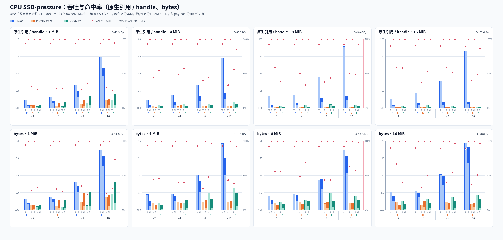

CPU 的 192 条记录覆盖 `2 输出模式 × 4 payload × 4 并发度 × 3 实现组 × 2 SSD 状态`。`fluxon_test_stack/single_node_ssd_bench/plot_kv_ssd_cpu_sweep.py` 与 GPU 脚本共同调用同目录下的 `kv_ssd_pressure_chart.py`。输入文件按命令行顺序覆盖同 case key；最终矩阵缺一条、存在 error、来源不完整或 unknown 非零都会直接失败。

| 实现组 | SSD-off 命中率 | SSD-on 命中率 | SSD-on 中 SSD 来源占 hit |
| --- | --- | --- | --- |
| Fluxon | 89.112%–94.390% | 100% | 17.550%–48.650% |
| Mooncake 独立 owner | 23.759%–66.879% | 100% | 62.065%–82.385% |
| Mooncake 每进程 | 22.488%–68.655% | 72.830%–100% | 59.341%–83.011% |

结果支持三个直接判断：

- **命中率和 hit payload 带宽必须一起看**：SSD-off 会产生快速 miss；Mooncake 每进程的部分 SSD-on case 也有 miss。柱高不包含这些 miss，因此单看柱高会遗漏成功集合的变化。
- **开关差不是单项 SSD 开销**：Fluxon 原生引用的 SSD-on hit 带宽相对 SSD-off 变化为 -88.8%–-21.1%，`bytes` 为 -45.8%–+2.2%；Mooncake 两种拓扑同时包含正负变化。差值混合了命中率、DRAM/SSD 来源、回填、输出物化和调度，不能拆成一个内部阶段。
- **输出模式需要分开比较**：原生引用 / handle 在 host reference ready 时计数，`bytes` 还包含完整 payload 物化。两行都按每次 hit 的完整逻辑 payload 计带宽；handle 行并没有读取或复制同等字节，因此其数值可以超过物理 DRAM 带宽，不能跨行用柱高计算复制效率或模式倍率。

统计窗口内只有 get，因此已完成记录的 DRAM 和 SSD 逻辑写带宽均为 `0.000 GiB/s`。图中报告逻辑 payload 流量，不代表物理 DRAM 或 NVMe 带宽。

#### 8.4.1 同一 Fluxon 路径下的 SSD backend 消融

[Foyer](https://github.com/foyer-rs/foyer/tree/v0.22.3) 是一个面向高性能和高并发场景的 Rust 内存/磁盘混合缓存库。它的 `HybridCache` 在一套接口下组合内存 cache 与磁盘 storage，并提供块式磁盘引擎、可替换的缓存算法和 IO engine。

对 Fluxon 而言，Foyer 是一个现成的通用实现参照。这组消融为一个直接的工程取舍提供依据：Fluxon 原生 SSD backend 在目标 workload 和既有数据路径中的功能与性能表现，是否足以支持继续自研和维护。若通用库已经满足需求，直接复用 Foyer 可以减少存储引擎本身的开发与维护。

要比较 SSD 存储层，不能直接把 Fluxon 的整套 cache 替换掉。Fluxon 的内存路径同时包含 master `route`、owner DRAM 副本、allocation 与 holder 生命周期、跨 owner 传输，以及 SSD 回填后的 promotion。如果连上层内存 cache 也替换为 Foyer，公共语义和数据路径会一起改变，结果无法归因到 SSD backend。因此，实验保留 Fluxon 的内存层及其上层路径，将替换边界统一收敛到 owner 内部的 `KvSsdStorage`：一侧使用 Fluxon 原生的 SSD 持久化与读取实现，另一侧接入 Foyer `HybridCache` 的 storage tier，并关闭 Foyer 自身的 memory admission。

Foyer 分支通过 test-only 配置启用：

```yaml
test_spec_config:
  kv_ssd_storage_backend: foyer
```

默认值仍为 `native`。Foyer 分支当前只接受一个 SSD root，并在配置阶段拒绝 `kv_ssd_uring_mode: iovec`。两组都调用相同的公共 KV API，经过相同的 FlatDict、route、transport、PyO3/GIL 边界和 benchmark 进程布局；写入 SSD backend 的都是 Fluxon target 中包含 FlatDict envelope 的完整编码 value。owner 上层 DRAM 都是 2 GiB，SSD 都是 16 GiB，且两种 SSD backend 都使用 direct I/O。图中的逻辑带宽仍只按原始 payload bytes 计数。

Foyer 内部另设 1 B memory capacity、1 个 memory shard，并用 filter 关闭 memory admission。这里关闭的是 SSD backend 内部可能形成的额外内存层，不影响 Fluxon owner 的 2 GiB DRAM。专项测试在 persist 和重复 get 后观测到 Foyer memory usage 为 0，所有读取来源均为 Foyer storage tier。

| 对比项 | Fluxon 原生 SSD | Fluxon Foyer SSD |
| --- | --- | --- |
| SSD 组织 | Fluxon ring、定长 shard 和 `io_uring`。 | Foyer 0.22.3 `HybridCache`，`WriteOnInsertion`、`PsyncIoEngine` 和 64 MiB block。 |
| 读取落点 | 满足对齐条件时直接读入 Fluxon target；远端路径可让 SSD chunk read 与 push 重叠。 | Foyer 先返回包含完整 value 的 `Vec<u8>`，再复制到 Fluxon target；远端路径取得完整 value 后才逐 chunk 交给 push。 |
| persist 并发 | 使用原生 writer queue 和 device worker。 | forced storage admission；`enqueue → wait → may_contains` 串行化，避免 Foyer byte queue 满时静默丢弃写入。 |
| 驱逐收敛 | ring 覆盖后批量通知 master 删除对应 SSD route。 | Foyer 0.22.3 没有向当前集成暴露等价的 SSD eviction callback；陈旧 route 只能在读取失败时撤销。 |

这个 workload 在 bootstrap 后只读，因此 Foyer persist 串行化不进入 30 秒统计窗口。约 2.5 GiB 数据集也小于 16 GiB SSD 容量；本次结果不评估 Foyer 容量驱逐后的 route 收敛。图中的浅色仍表示 Fluxon 上层 DRAM route，深色表示 Fluxon SSD route；它不把 Foyer 内部 memory cache 作为第三层来源。

图按 `MemHolder` / `bytes` 分成两行，每行覆盖 1 / 4 / 8 / 16 MiB；每个并发度放置原生与 Foyer 两根柱。蓝/紫区分 SSD 实现，浅/深区分 DRAM 与 SSD 来源，红点表示命中率。

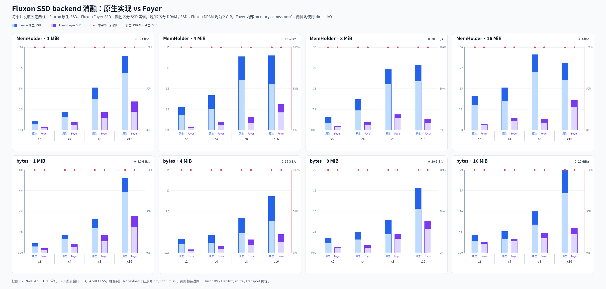

PNG 由 `fluxon_test_stack/single_node_ssd_bench/plot_kv_ssd_foyer_ablation.py` 读取原始汇总生成。脚本要求 64 条记录的 case key 完整，校验容量、并发布局、统计窗口、来源计数和配对控制项后才绘图。这里的 64 是测量记录数，即 32 个原生/Foyer 配对，不表示 64 种部署。

所有配对的命中率都是 100%，因此这组差距没有 miss 数量优势可以解释。P95 的同向变化表明差距同时出现在延迟侧。`bytes` 会在两侧共同追加完整 payload 物化，其中位比值高于 `MemHolder` 与公共物化成本稀释 backend 相对差异相容，但单次矩阵不足以分解这部分因果贡献。

当前两条读取路径的明确差异是：Foyer adapter 先取得完整 `Vec<u8>` 再复制到 Fluxon target；原生实现可以直接读入 target，远端时还保留 chunk read 与 push 重叠。同时还存在 `PsyncIoEngine` / `io_uring`、完整 value 交付和调度方式等差异。这些差异共同属于当前 adapter 对比，本次数据无法把柱高差逐项分配给某个内部阶段。

配对 case 对相同的 thread id 和 operation index 使用同一套确定性 Zipf key 选择。统计边界仍是固定 30 秒窗口，不是固定操作数；较慢的一侧会停在同一确定性序列的更短前缀，实测 DRAM/SSD 来源比例也可能随之变化。因此，这组数据回答指定 pressure workload 下的整体 backend 表现，不把柱高比值解释成单次纯 SSD get 的加速比。

### 8.5 GPU 性能对比：多并发 SSD 开关与 Mooncake 存储拓扑

上一节的 CPU 测试以 KV 数据到达 CPU 内存为计数终点，分别观察原生引用 / handle 和完整 `bytes` 物化。AI 推理或训练实际消费 KV 数据时，数据通常还需要继续搬到 GPU。因此，本节把计数终点延伸到对应 CUDA event 完成，比较多并发下 SSD 开关和 Mooncake 两种存储拓扑对 GPU 可用数据吞吐的影响。该边界包含 H2D 传输，不包含 GPU kernel 执行或 D2H。

GPU 与 CPU 使用同一种画法，只少了原生引用 / `bytes` 两行。4、8、16 MiB 各占一个分面；每个分面都覆盖 c2/c4/c8/c16，每个并发度再按 Fluxon、Mooncake 独立 owner、Mooncake 每进程 × SSD 关/开排列六根柱。蓝、橙、青区分三种实现，浅色表示 DRAM、深色表示 SSD，红点显示命中率；六组 case 都从 native host buffer 进入同一条 `cuda` H2D 路径。

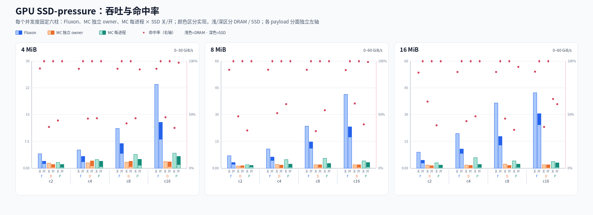

GPU PNG 由 `fluxon_test_stack/single_node_ssd_bench/plot_kv_ssd_gpu_sweep.py` 读取一个或多个 pressure 汇总，并与 CPU 脚本共同调用同目录下的 `kv_ssd_pressure_chart.py`。脚本校验最终 72 条记录完整后直接使用 Pillow 绘制；各 payload 分面使用独立左轴，命中率共用 0%–100% 右轴。

| 拓扑 | SSD-off 命中率 | SSD-on 命中率 | SSD-on 中 SSD 来源占 hit |
| --- | --- | --- | --- |
| Fluxon | 89.326%–93.267% | 100% | 20.242%–46.508% |
| Mooncake 独立 owner | 34.557%–62.223% | 100% | 64.837%–77.135% |
| Mooncake 每进程 | 35.430%–64.782% | 59.855%–100% | 56.073%–84.198% |

下表把图中的并发扩展收敛为 c16/c2 hit payload 带宽倍率，三个 payload 的顺序都是 4 / 8 / 16 MiB：

| 拓扑 | SSD-off c16/c2 | SSD-on c16/c2 |
| --- | --- | --- |
| Fluxon | 5.83 / 5.83 / 4.68 倍 | 6.50 / 7.22 / 6.80 倍 |
| Mooncake 独立 owner | 1.33 / 1.50 / 1.10 倍 | 1.73 / 1.37 / 1.35 倍 |
| Mooncake 每进程 | 2.67 / 2.01 / 1.23 倍 | 3.02 / 2.07 / 1.77 倍 |

Fluxon 的 SSD-on hit 带宽相对 SSD-off 变化为 -54.6%–-27.9%，Mooncake 独立 owner 为 -32.0%–+37.3%，Mooncake 每进程为 -62.6%–-17.5%。这些变化必须与上表的命中率一起解释。c16 下，每进程相对独立 owner 的 hit 带宽在 SSD-off 下分别高 125.7%、107.3% 和 97.9%，SSD-on 下高 82.4%、64.5% 和 57.9%；这些是包含 endpoint 本地性、进程数和 transport 调度的整体拓扑结果，不能归因到单个内部环节。

主矩阵体现了三个结果：

- **Fluxon 能随并发扩展**：4、8、16 MiB 从 c2 到 c16 分别提高到 7.18、7.68 和 5.33 倍。
- **16 MiB 在 c8 后开始收益递减**：c8 到 c16 只再提高 14.0%，backend get 均值从 `3.082 ms` 增至 `7.367 ms`，P95 从 `24.007 ms` 增至 `51.150 ms`。H2D 之前的路径已开始制约吞吐。
- **Mooncake 拓扑会影响结果**：每进程贡献模式在 c16 下相对独立 owner 分别提高 91.3%、103.7% 和 66.8%。两种模式的逻辑容量相同，差异主要出现在 GPU copy 之前。来源诊断显示 8/16 MiB 的每进程贡献模式具有更高 SSD 命中率，因此更高吞吐无法由更高 DRAM 命中率解释；独立 owner 串行点、endpoint 本地性和 transport 调度成本仍未拆分。

c16 下，Fluxon 相对两种 Mooncake 拓扑中更快的一种，在 4、8、16 MiB 组中分别为 3.83、5.61 和 6.73 倍。这些比值只覆盖第 8.2–8.3 节定义的计数边界、单机 fast path 和固定容量。

## 9. 设计结论

Fluxon KV 将本地 SSD 定位为运行期回填层，不改变用户侧 `put`、`get` 和 `delete` 契约。master 维护 key-version 级 `route`，并统一调度用于最终 value 副本和临时传输的内存 allocation。owner 承载真实 bytes，管理 SSD 文件位置、IO 和 ring 生命周期。

`put` 操作在内存副本发布后返回，SSD persist 在后台完成。`get` 操作优先读取内存。没有可读内存副本时，本地 SSD 回填复用 requester target，远端回填则按 chunk 从 source staging push 到 requester target。两条路径最后都进入同一个 `GetDone` 和 holder 交付链。

同路径消融进一步表明，在本文固定的 pressure workload 下，当前 Foyer adapter 的 hit payload 带宽中位数为原生 SSD 的 37.2%，P95 为 2.30–8.46 倍，32 个配对中没有胜出。两侧均为 100% 命中，但 Foyer adapter 多了完整 `Vec<u8>` 到 Fluxon target 的复制，也没有原生路径的 direct-target 与 chunk read/push 重叠。这一结果限定于当前 adapter，不代表 Foyer 库的一般性能。

当前 SSD 层不提供冷启动恢复，也不向用户暴露独立 API。专项测试验证了强制回填和陈旧 route 兜底，并报告限定条件下的端到端逻辑 payload 表现。这些结果不代表裸 SSD 带宽，也不外推到跨机器、多 owner 或多盘场景。
