# 将 Fluxon KV 扩展至 SSD 介质

Fluxon KV 原本只有内存缓存层，可保留的数据规模受 DRAM 容量与成本约束。latent cache 需要足够大的缓存工作集才能覆盖更多复用请求，KV cache 也可以通过扩大缓存容量提高命中机会。为此，Fluxon KV 引入 owner 本地 SSD 作为内存层的下一级缓存，形成内存—SSD 多级缓存。

用户继续调用 `put/get/delete`，`get` 仍返回 `MemHolder`。master 管理 key-version 级别的逻辑路由；SSD 文件 offset、`O_DIRECT` 对齐、`io_uring` 调度、ring 覆盖保护和 chunk pipeline 由 owner 管理。写入先提交内存副本，再异步进入 SSD；读取先检查内存副本，找不到时才进入 SSD 回填。

本文描述 SSD 介质层的读写、回填、观测和生命周期设计。具体 workload 下的容量收益、延迟和命中率变化需要单独测试，不能从介质接入本身直接推导。

## 0. 背景：为什么扩展到 SSD

内存 KV 受 DRAM 容量与成本约束。latent cache 和 KV cache 都可能需要超过内存容量的缓存工作集；把较冷的 value 保留在 SSD，可以在内存副本驱逐后继续提供回填来源，并利用 SSD 容量与带宽扩大可命中的数据范围。

这次扩展的目标包括：

- **扩大有效容量**：让 owner 本地 SSD 承接一部分已经写入过的 value bytes，降低内存副本被驱逐后的 miss 代价。
- **保持公共 API 不变**：external 和用户侧仍然只看 `MemHolder`，不暴露 SSD handler、文件路径或 offset。
- **保护热路径**：只要 master 还能找到 live memory replica，`get` 就不会进入 SSD 分支。
- **先接入通用能力**：当前重点是把 SSD 写入、读取回填、容量限制、驱逐、观测和失败清理接到统一 KV 生命周期里，并尽可能优化通用性能。
- **避免持久化引擎侵入**：当前不做 WAL、checkpoint、冷启动扫描和跨进程恢复。

这层 SSD 给内存副本不足的 key-version 提供 owner-local bytes source，承担运行期回填，不提供持久化数据库语义。

## 1. 全景模型：Master 管 route，Owner 管介质

SSD 不增加用户 API。master 维护 key-version 级别的逻辑 route；SSD 文件位置、读写队列、对齐和覆盖保护留在 owner 本地。

SSD 挂在 owner 内部，作为已有 KV route 的补充副本。master 的 `OneKvNodesRoutes` 以 key-version 为中心组织路由，`node_replicas` 用一张 map 定位各 owner，entry 内的 `memory` 和 `ssd` 分别记录两层副本。两者共享 route 的 `put_id`，不能跨版本复用。

先看全景图。它仍然是组件地图，但在关键边上标出主链路顺序：`1x` 是写入和 SSD commit，`2x` 是内存命中读取，`3x` 是 SSD 回填读取。

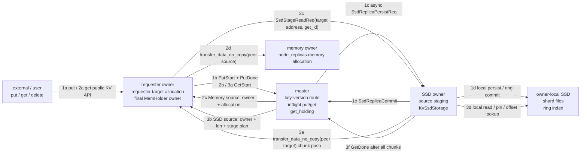

这张图里的边界可以压成一句话：master 回答“当前 key-version 哪个 owner 有可读副本”，owner 回答“这个副本在本地内存或 SSD 里怎样读”。具体到角色：

| 角色 | 负责什么 | 不负责什么 |
| --- | --- | --- |
| master | 当前 key-version、`node_replicas`、in-flight 生命周期和 holder 注册。 | SSD shard、文件 offset、`O_DIRECT` 对齐和本地 IO 调度。 |
| memory owner | 已提交内存副本的 allocation，作为 memory source。 | SSD 文件位置和 SSD read pin。 |
| SSD owner | 本地 `KvSsdStorage`、source staging、shard 文件、ring index、reader/writer queue。 | 用户侧 API 和全局 key-version 判断。 |
| requester owner | 本次 `get` 的 target allocation，成功后成为用户可见 `MemHolder`。 | 解析 SSD offset 或直接访问 SSD 文件。 |

这里有一个重要取舍：master 不保存 SSD offset。收益是 route 极轻量，跨节点控制面不需要理解本地文件布局；代价是 owner 重启后，原 SSD bytes 没有冷恢复路径，master 里的 SSD route 也必须随节点 tomb 和路由清理失效。这正是本文反复强调“运行期介质层”的原因。

master 的 SSD route 只记录“谁拥有当前 key-version 的 SSD 副本”和“真实 payload 长度”，不记录本地物理位置。

## 2. 配置与观测：容量按介质分层可见

SSD 不再引入单独的配置对象。公共配置只在已有 owner-only `large_file_paths` 旁增加一个同长度的 `large_limit_size` 数组：

```yaml
fluxonkv_spec:
  large_file_paths: [/data/fluxon_large0, /data/fluxon_large1]
  large_limit_size: ["4GB", "8GB"]
```

`large_limit_size` 缺省或为 `null` 时不启用 KV SSD。出现时必须和 `large_file_paths` 长度一致，每一项可以写整数 bytes，也可以写 `"512.9B"`、`"1.5GB"` 这类 size 字符串；`MB/GB` 按二进制单位解析，等价于 `MiB/GiB`，小数结果按 bytes 向下截断。解析后的值必须大于或等于 512 bytes，满足当前 `O_DIRECT` 对齐约束。zero-contribution external 不能声明 `large_limit_size`；external 启动时只继承 owner 暴露的共享 bundle 和运行时路径信息，不贡献 SSD 容量。

owner 初始化时不会读取单独的 SSD 路径参数。实际 SSD cache root 从每个可用 `large_file_paths` 派生：

```text
<large_file_root>/<cluster_name>_cluster_kv_ssd_storage/<safe_instance_key>/
```

随后 owner 创建目录并读取 `metadata.dev()`。如果多个 path 指向同一个实际 device，只保留第一个 root。这个去重很关键：否则两个目录看似提供两条 IO 路径，实际落在同一块盘上，会让调度层误判并行度。

`large_limit_size[i]` 只约束 `large_file_paths[i]` 派生出的 KV SSD cache root。当前这个容量不代表整块 SSD 的物理容量，也不约束日志、profile、FS disk cache 等其他大文件资产；它只限制 key-value payload 落入 KV SSD 介质层的 ring 用量。写入超过该 device root 的 ring 容量时，ring 会推进 tail 驱逐旧的 SSD entry；如果即将覆盖未完成写入或 active read pin，则本次写入等待空间释放。

初始化完成后，`KvSsdStorage` 拿到一组有效 device root。每个有效 device 拥有独立的本地对象：

| 本地对象 | 作用 |
| --- | --- |
| shard 文件集合 | 存放 ring 分配出来的连续 SSD offset。 |
| writer queue | 接收本 device 的写任务。 |
| reader queue | 接收本 device 的读任务。 |
| `UringIoEngine` | 提交本 device shard 文件上的 `read/write`；`Iovec` 模式只作为测试和对照路径保留。 |

每个有效 device root 的 `large_limit_size` 会被拆成本 device 的 shard 容量。`shard_to_device` 记录每个 shard 属于哪个 device，读路径用 committed entry 里的 `shard_id` 找回对应 reader queue。

观测面也必须同步分层。过去 UI 只展示 memory segment 用量时，读者会自然把 KV 容量理解成一层内存池；接入 SSD 后，这个视角不够了。owner 需要分别上报 memory segment 和 KV SSD 的 capacity/used，UI 也要按资源类型展示，避免把 SSD 介质层的容量混进内存 segment。

当前观测面应至少能区分：

| 资源类型 | 指标 | UI 展示意图 |
| --- | --- | --- |
| `memory_segment` | `kvcache_segment_capacity_bytes` / `kvcache_segment_used_bytes` | 展示 owner 可直接承载 `MemHolder` 的内存 segment 容量和占用。 |
| `kv_ssd` | `kv_ssd_capacity_bytes` / `kv_ssd_used_bytes` | 展示 owner-local SSD 介质层的容量和 ring 已用空间。 |

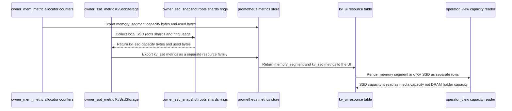

## 3. 写入：先内存可见，再异步进入 SSD

`PutDoneReq` 只表示内存副本 ready。master 收到它之后，从 in-flight put 状态里拿到 target allocation，并把它写入对应 owner 的 `node_replicas[node_id].memory`。这一步成功后，key-version 已经可以被普通 `get` 命中。

这里故意不等待 SSD。SSD persist 会受到本地盘延迟、`O_DIRECT` 对齐、writer queue 和 ring 空间影响；如果把这些因素塞进同步 `PutDone`，用户侧写入延迟会被 SSD 介质层拖住，内存 KV 的快路径也会被改写。

因此 `PutDone` 后，master 只做两件事：

1. 把 target allocation 作为内存副本写入 `node_replicas[node_id].memory`。
2. 如果 target owner 启用了 SSD，启动后台 SSD persist 请求。

后台请求携带 `key`、`put_id`、`target_addr` 和 `len`。master 同时用一个 `Arc<Allocation>` 守住 target allocation，保证 owner 从内存复制 payload 到 SSD 前，这块内存不会被提前释放或复用。

target owner 收到 SSD persist 请求后，进入 owner 本地 SSD 存储黑盒：复制 payload、处理对齐、分配 ring offset、提交本地 IO，并在成功后把本地 entry 标记为可读。第 6 节会展开这个黑盒里的 `aligned_len`、`Writing -> Committed`、read pin 和 `io_uring` 调度；本节只看 master 与 owner 的宏观协议。

`OneKvNodesRoutes` 中与两层副本直接相关的结构如下，非关键字段用省略号隐藏：

```rust
pub struct OneKvNodesRoutes {
    pub put_id: PutIDForAKey, // Bind all replicas to one key version.
    // ...
    pub node_replicas: RwLock<HashMap<NodeID, KvNodeReplicas>>, // Index both cache layers by owner.
    // ...
}

pub struct KvNodeReplicas {
    pub tomb_tag: NodeTombTag,           // Track this owner incarnation once.
    pub memory: Option<Arc<Allocation>>, // Hold the readable memory replica when present.
    pub ssd: Option<KvSsdReplicaInfo>,   // Record the readable SSD replica when present.
}

pub struct KvSsdReplicaInfo {
    pub len: u64, // Preserve the real payload length.
}
```

`memory` 和 `ssd` 独立更新。内存驱逐只把 `memory` 设为 `None`，SSD 读失败后的清理只把 `ssd` 设为 `None`；两者都为空时删除整个 node entry。`tomb_tag` 标识 map key 对应的节点实例：节点离开或重启时旧 tag 会变为 tomb，新实例使用新的 tag，因此每个 owner 只需保存一份当前实例标记。

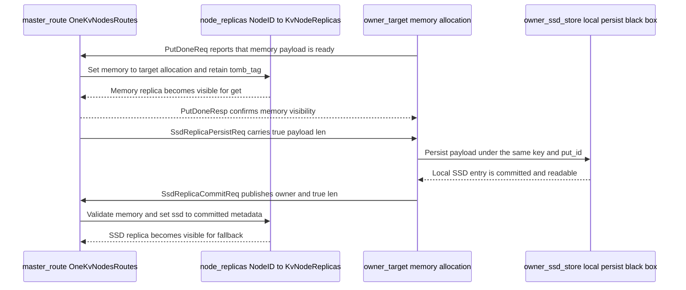

owner 本地 SSD 写成功后，还不能直接成为可读副本。owner 需要向 master 提交 `SsdReplicaCommitReq`，把 `key`、`put_id`、`node_id` 和真实 `len` 写回控制面。

master 的校验链保持有界：

1. 如果 `kv_routes` 里已经没有这个 key，忽略 commit。
2. 如果当前 route 的 `put_id` 和请求里的 `put_id` 不一致，忽略 commit。
3. 如果这个 owner 已经没有对应内存副本，忽略 commit。
4. 如果 owner 的 tomb tag 已经失效，忽略 commit。
5. 全部通过后，把 `KvSsdReplicaInfo { len }` 写入对应 entry 的 `ssd`。

第 2 条是 late commit 的安全阀。SSD persist 可能晚于同 key 的后续覆盖写，`put_id` 校验保证旧版本 SSD 数据不会污染新版本 route，也不会 resurrect 已经被删除或覆盖的对象。

## 4. 读取：内存优先，SSD 只做回填

读路径从 `GetStartReq` 开始。master 读取 `node_replicas` 快照，先从 `memory` 为 `Some` 的 entry 中随机选择一个非 tomb 副本。命中时返回 `GetSourceKind::Memory`，同时给 requester owner 准备 target allocation。

这里保留原来的内存读优化：如果 requester owner 本身已经持有内存副本，可以复用本地 replica allocation；否则 master 分配新的 requester target，并根据 durable slot 决定后续是否能提升为 durable replica。

只要内存副本存在，SSD 分支完全不会执行。这保证了 SSD 介质层不干扰热路径：热 key、近端副本和已有内存副本仍然走原有 transfer 和 `GetDone`。

进入 SSD 回填前，先明确两块核心内存的生命周期：

| 名称 | 归属 | 用途 | 生命周期 |
| --- | --- | --- | --- |
| source staging | SSD owner | 只服务本次读盘和 chunk push。 | `GetDone`、`GetRevoke` 或 in-flight 超时后释放。 |
| requester target | requester owner | 承接最终 payload bytes。 | 成功后进入 `get_holding`，成为用户可见 `MemHolder`。 |

当 master 没有找到可用内存副本时，才从同一快照选择 `ssd` 为 `Some` 的 entry。选择 live SSD replica 后，master 就按上表分配 source staging 和 requester target。

source staging 的长度按 SSD read 对齐要求计算。master 先计算 `ssd_stage_len = align_ssd_io_len(len)`，再额外多申请 `SSD_ALIGNMENT - 1` bytes。这样即使 allocation 起始地址不对齐，也能在 allocation 内找到一个 512-byte 对齐的 `src_addr`。

`GetStartResp` 返回给 requester 的 `src_addr` 是对齐后的 SSD owner staging 地址，`target_addr` 是 requester owner target 地址，`ssd_stage_len` 是可用于 direct read 的对齐容量，`len` 仍然是真实 payload 长度。

master 同时把这次 get 写入 `inflight_gets`。SSD source 路径里的 `InflightGetInfo.source_allocation` 保存 source staging allocation；最终 `GetDone` 只把 requester target allocation 放进 `get_holding`。

master 侧和 allocation 相关的字段可以压缩成下面这个生命周期骨架：

```rust
pub struct InflightGetInfo {
    pub put_id: PutIDForAKey,                    // Guard the key version across the get.
    pub src_node_id: NodeID,                     // Identify the selected memory or SSD source.
    pub key: String,                             // Keep the logical key for completion and cleanup.
    pub req_node_id: NodeID,                     // Identify the requester that owns the final holder.
    pub len: u64,                                // Preserve the real payload length.
    pub allocation: Arc<Allocation>,             // Hold the requester target until GetDone.
    pub source_allocation: Option<Arc<Allocation>>, // Hold SSD staging only for SSD fallback.
    pub route: Arc<OneKvNodesRoutes>,             // Keep the route alive and release its durable slot.
    pub allocation_mode: GetAllocationMode,       // Decide whether GetDone may add a memory replica.
    pub source_kind: GetSourceKind,               // Distinguish the memory and SSD cleanup paths.
}
```

这些字段和 route 的关系是：

- `node_replicas[node_id].memory` 中的 allocation 是内存副本本身，所以 memory source 可以直接把这块 allocation 作为读源。
- `node_replicas[node_id].ssd` 不持有 allocation，只记录真实 `len`；SSD owner 来自 map key，tomb tag 由同一 entry 共享。SSD 文件 offset、shard 和 read pin 都留在 owner 本地。
- `InflightGetInfo.allocation` 永远是 requester owner 上的 target allocation。成功 `GetDone` 后，这块 allocation 会进入 `OwnerHoldingGetInfo`，成为用户可见 `MemHolder` 的内存。
- `InflightGetInfo.source_allocation` 只在 `source_kind == GetSourceKind::Ssd` 时存在，用来守住 SSD owner 上的临时 source staging。成功 `GetDone`、失败 `GetRevoke` 或 in-flight TTL 清理都会移除 `InflightGetInfo`，这块 staging allocation 随引用释放。
- 因此 master 在 SSD 回填时确实持有两块 allocation：`source_allocation` 管读盘 stage 的临时生命周期，`allocation` 管 requester target 和最终 holder 生命周期。两者不会混进同一个 holder。

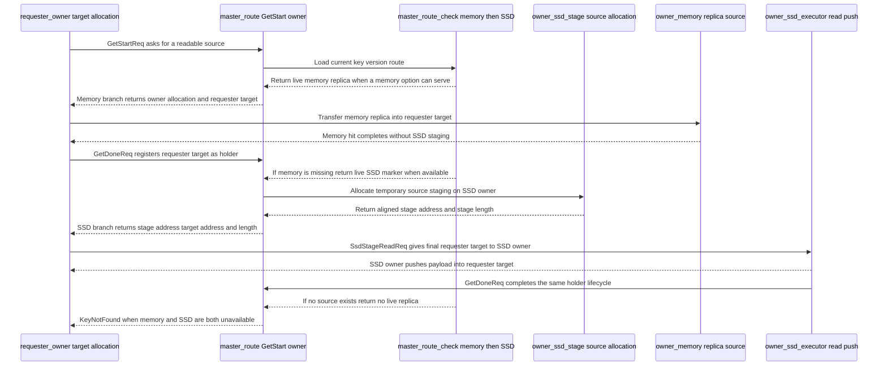

requester owner 收到 `GetStartResp` 后，根据 `GetSourceKind` 切换内部路径：

| source kind | 行为 |
| --- | --- |
| `Memory` | 沿用原有 transfer，从 `src_addr` 读到 `target_addr`，传输完成后 requester 调用 `GetDoneReq`。 |
| `Ssd`，source 本地 | requester 本地执行 SSD stage，读盘后把结果写到 requester target，再调用 `GetDoneReq`。 |
| `Ssd`，source 远端 | requester 发送 `SsdStageReadReq` 给 SSD owner，由 SSD owner 读盘、push、调用 `GetDoneReq`，再把 done 结果投影回 requester。 |

这个设计让 requester target 始终是最终 holder 归属地。SSD owner 只是数据源和 stage 执行者，不把自己的 staging allocation 暴露给用户。

## 5. 回填传输：SSD source 主动 push，省掉一次 RTT

SSD 回填由 bytes producer 所在的 SSD owner 发起 transfer。SSD owner 读出一个 chunk，就直接把这个 chunk 写到 requester target。

这里有一个容易忽略但很关键的分支：远端 memory get 和远端 SSD 回填的 transfer 发起方不同。

Memory 路径是 requester 发起 transfer、peer 作为 source 的模型；SSD 路径是 source owner 发起 transfer、requester 作为 target 的模型。这一转换消除了 chunk 就绪后的额外 RTT，实现了读盘与网络传输的 pipeline 重叠。

远端 memory source 路径里，requester owner 已经从 `GetStartResp` 拿到远端 `src_addr` 和本地 `target_addr`。它自己调用 transfer engine，把 peer 端的内存副本作为 source，把本地 allocation 作为 target。这里的数据流向仍然是 memory owner 到 requester，只是 transfer API 的发起方是 requester。

远端 SSD source 路径里，requester 不等 SSD owner 读完整个 payload 后再发起 transfer。requester 只发一次 `SsdStageReadReq`，把 `get_id`、SSD owner 上的 `stage_addr`、requester 上的 `target_addr` 和长度交给 SSD owner。随后每个 chunk 一旦从 SSD 读到 source staging，SSD owner 立刻把数据 push 到 requester target。

这减少的是 stage-ready 之后再让 requester 发起一次 transfer 的 RTT。生产 bytes 的 SSD owner 在 chunk ready 的本地上下文里直接 push，chunk read 和 transfer 可以重叠；requester 不需要在每个 chunk ready 后收到通知、再回过头发起一次 transfer。必要的 `SsdStageReadReq` 仍然存在，因为 requester 需要把 target 地址和 `get_id` 交给 SSD owner。

和 transfer engine 接口对上看，关键是 `transfer_data_no_copy` 的方向位。下面是删减后的接口骨架：

```rust
pub async fn transfer_data_no_copy(
    &self,                                      // Use this node's transfer engine.
    peer_node: Option<NodeIDString>,            // Select the remote peer; None means local transfer.
    peer_src_or_target: bool,                   // True: peer owns source; false: peer owns target.
    src_addr: u64,                              // Provide the absolute source address.
    target_addr: u64,                           // Provide the absolute target address.
    len: u64,                                   // Transfer this many real payload bytes.
    seg_guard: Option<ClientCpuMemReadGuard>,   // Optionally keep the local segment alive.
) -> KvResult<TransferBreakdown>;
```

这里 `peer_src_or_target == true` 表示 peer 端持有 source，当前节点发起从 peer source 到本地 target 的 transfer；`peer_src_or_target == false` 表示 peer 端持有 target，当前节点从本地 source 把数据写到 peer target。transfer engine 也会据此选择本地 segment guard：前者守住 `target_addr`，后者守住 `src_addr`。远端 memory get 和远端 SSD 回填正好分别落在这两个方向上：

```rust
// Memory get: requester owner initiates transfer with peer as source.
client_transfer_engine
    .transfer_data_no_copy(
        Some(memory_owner_id),       // Contact the owner that holds the memory replica.
        true,                        // Interpret the peer address as the source.
        remote_src_addr,             // Read from the peer's replica allocation.
        requester_target_addr,       // Write into the requester's local target.
        len,                         // Move only the real payload bytes.
        None,                        // Let the engine acquire the local target guard.
    )
    .await?;

// SSD refill: SSD owner pushes a ready chunk to requester target.
let chunk_target_addr = requester_target_addr
    .checked_add(chunk.offset)       // Place this chunk at its payload offset.
    .ok_or_else(|| KvError::Api(ApiError::InvalidArgument { // Convert overflow into a KV error.
        detail: "chunk target addr overflow".to_string(),   // Explain which address calculation failed.
    }))?;

client_transfer_engine
    .transfer_data_no_copy(
        Some(requester_owner_id),    // Contact the requester that owns the final target.
        false,                       // Interpret the peer address as the target.
        chunk.stage_addr,            // Read from this SSD owner's ready staging chunk.
        chunk_target_addr,           // Write to the matching offset in requester target.
        chunk.len,                   // Move this chunk's real payload length.
        None,                        // Let the engine acquire the local source guard.
    )
    .await?;
```

`SsdStageReadReq` 的作用是把第二段代码所需的远端 target 信息先交给 SSD owner。它只携带 stage 授权和地址描述：

```rust
pub struct SsdStageReadReq {
    pub key: String,                    // Identify the logical KV entry.
    pub put_id: PutIDForAKey,           // Reject data from a different key version.
    pub get_id: u64,                    // Bind the stage operation to its in-flight get.
    pub stage_addr: u64,                // Point to aligned staging on the SSD owner.
    pub stage_len: u64,                 // State the available aligned staging capacity.
    pub target_node_id: NodeIDString,   // Identify the requester that owns the target.
    pub target_addr: u64,               // Point to the requester's final allocation.
    pub len: u64,                       // Preserve the real payload length.
}
```

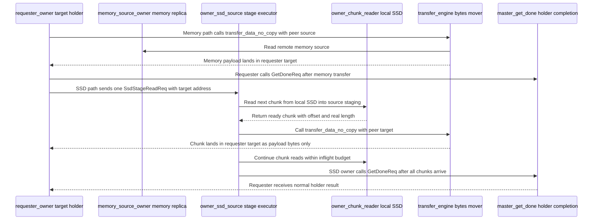

SSD owner 执行 stage 时，把读盘和传输拆成两个并发 future：

- **producer**：按 chunk 从 SSD 读到 source staging。
- **consumer**：收到 ready chunk 后立刻 push 到 requester target。

两者之间用一个有界 `mpsc` ready queue 连接。默认 chunk 大小是 4 MB，默认 pipeline inflight 是 4。producer 不需要等完整 payload 读完才开始传输；consumer 也不需要理解 SSD 文件 offset，只处理 `SsdLoadedChunk { offset, stage_addr, len }`。

实现骨架可以压成下面这一段。`load_into_addr_chunks` 在 producer 侧按 chunk 发起 SSD read，并把已经读入 staging 的 chunk 送进 `ready_tx`；`transfer_loaded_ssd_chunks` 在 consumer 侧从 `ready_rx` 取 chunk，再调用 transfer engine push 到 requester target。两边用 `join!` 同时运行，所以第一个 chunk 进入 ready queue 后，网络传输就可以开始，不必等待后续 chunk 读完。

```rust
let ready_queue_capacity = DEFAULT_READ_TRANSFER_PIPELINE_INFLIGHT
    .saturating_mul(2) // Buffer two transfer windows between reader and sender.
    .max(1);           // Keep the bounded channel valid for any configured window.
let (chunk_tx, chunk_rx) =
    ::tokio::sync::mpsc::channel(ready_queue_capacity); // Connect producer and consumer.

let producer = store.load_into_addr_chunks(
    key,                                          // Select the logical KV entry.
    put_id,                                       // Select the exact committed version.
    stage_addr,                                   // Read chunks into aligned source staging.
    len,                                          // Stop after the real payload length.
    stage_len,                                    // Enforce the staging allocation capacity.
    DEFAULT_READ_TRANSFER_PIPELINE_CHUNK_BYTES,   // Bound each SSD read to 4 MiB.
    DEFAULT_READ_TRANSFER_PIPELINE_INFLIGHT,      // Allow up to four concurrent SSD reads.
    chunk_tx,                                     // Publish each ready chunk to the sender.
);

let consumer = self.transfer_loaded_ssd_chunks(
    peer_id,      // Select the remote requester; None means the target is local.
    target_addr,  // Use the requester's final allocation as the transfer base.
    chunk_rx,     // Consume chunks as soon as their SSD reads complete.
);
let (producer_res, consumer_res) = ::tokio::join!(
    producer, // Run SSD reads concurrently with network transfers.
    consumer, // Push ready chunks without waiting for the full value.
);
match (producer_res, consumer_res) {
    (Ok(()), Ok(())) => Ok(()),
    (_, Err(err)) => Err(err),
    (Err(err), _) => Err(err),
}
```

consumer 只在 transfer inflight 少于 4 时从 ready queue 取新 chunk。达到上限后，有界 queue 会把背压传给 producer；已提交的 transfer 完成后，consumer 再继续取 chunk。

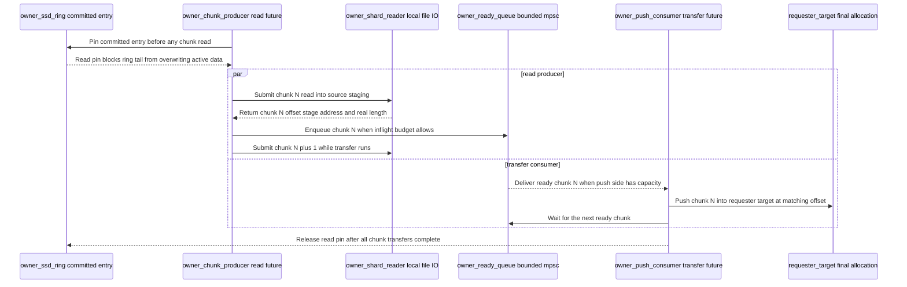

## 6. Owner 本地机制：对齐、ring 和 IO 调度

`O_DIRECT` 对齐、SSD 文件 offset、ring 覆盖保护和 `io_uring` 调度封装在 owner 本地。master 和用户侧只看到真实 payload 长度和普通 `MemHolder`。

### 6.1 写入：双轨长度限制 padding 的作用域

target owner 收到 SSD persist 请求后，会从 target allocation 复制真实 payload，并构造 512-byte 对齐的写入 buffer。这样做是为了满足当前 `O_DIRECT` 约束：地址、长度和文件 offset 都要按 512 bytes 对齐。

这会引入一个工程问题：SSD IO 需要对齐长度，用户语义需要真实长度。当前实现用“双轨长度”把两者分开：

| 长度 | 使用范围 | 对外语义 |
| --- | --- | --- |
| `len` | master route、`SsdReplicaCommitReq`、transfer 长度、`MemHolder.len`。 | 真实 payload 长度。 |
| `aligned_len` | owner 本地 ring 分配、shard 文件 offset 推进、`O_DIRECT` read/write。 | 本地 IO 长度，padding 不出 owner。 |

具体路径是：

- `SsdReplicaPersistReq.len` 只表示真实 payload 长度。owner 从 target allocation 复制数据时，只复制前 `len` bytes。
- owner 本地计算 `aligned_len = align_up(len, 512)`，创建长度为 `aligned_len` 的 `AlignedBuffer`。这块 buffer 先置零，再把真实 payload 拷进去。
- ring 分配、shard 文件 offset 推进和 SSD 写入提交都使用 `aligned_len`。
- `SsdIndexEntry` 同时记录 `len` 和 `aligned_len`：`len` 服务后续 `get`、route commit、holder 长度和传输长度；`aligned_len` 只服务 owner 本地空间管理和文件 IO。
- owner 向 master 提交 `SsdReplicaCommitReq` 时只提交真实 `len`。读取侧也会校验 `entry.len == len`，即使 direct read 读入了对齐后的范围，向 requester target 和 `MemHolder` 暴露的仍然只有真实 payload bytes。

### 6.2 Ring：先 Writing，后 Committed

本地 SSD 引擎按 value 粒度选路：

- 用 `next_write_device` round-robin 选择一个有效 device。
- 把整个 value 发送到这个 device 的 writer queue。
- 当前实现不把同一个 payload 拆到多块 device 做条带化。

这意味着多 device 并行发生在 value 粒度：不同 value 可以落到不同 device；一个 value 内部仍是某个 shard 的连续 offset。

真正决定 SSD 文件位置的是 owner 本地 `SsdRingBuffer`。writer task 只在本 device 的 `shard_ids` 里选择 shard，并为 aligned payload 分配连续文件区间。ring 分配逻辑有几个关键点：

- `aligned_len = align_up(len, 512)`，ring 按对齐后长度分配空间。
- 每个 shard 是环形空间，`head` 前进分配新写入，`tail` 表示可以覆盖到哪里。
- 如果当前 shard 尾部剩余空间不足，会跳到文件开头继续找连续空间。
- 如果推进 `tail` 会覆盖未完成写入或 active read pin，返回 `BlockedByBusyIo`。

分配成功后，ring 先插入 `Writing(SsdIndexEntry)`。这个状态表示 offset 已经分配，但 SSD 写入还没成功。默认单 buffer 路径使用 `O_DIRECT + io_uring write`；只有写入字节数等于 aligned buffer 长度，entry 才会提交成 `Committed`。

`Writing -> Committed` 是 SSD 可见性的核心保护。读路径的 `pin_read` 只接受 committed 且 offset 仍有效的 entry，所以未完成的 SSD 写入不会被 `get` 选中。

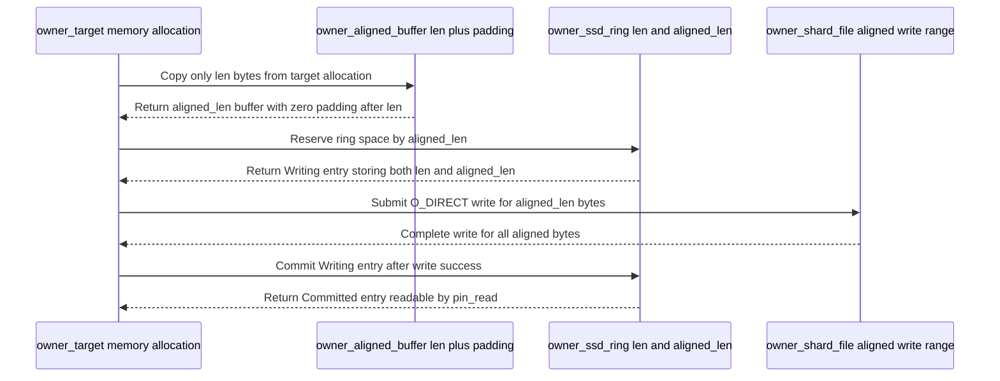

### 6.3 读取：direct read 和 scratch fallback

每个 chunk 的文件位置由 `entry.file_offset + offset` 得到。read path 的选择取决于三个条件：

- staging 地址是否 512-byte 对齐；
- SSD 文件 offset 是否 512-byte 对齐；
- 本次 read 长度和 target capacity 是否满足对齐要求。

满足条件时走 direct read：默认单 buffer 路径直接把数据读到 `stage_addr + offset`。否则走 scratch read：先读入 512-byte 对齐的 `AlignedBuffer`，再只复制当前 chunk 的真实 payload 长度到 staging。

两条路径最后都只向下游发送真实 payload 长度。`O_DIRECT` padding 不会进入 transfer 长度，也不会进入用户 `MemHolder.len`。

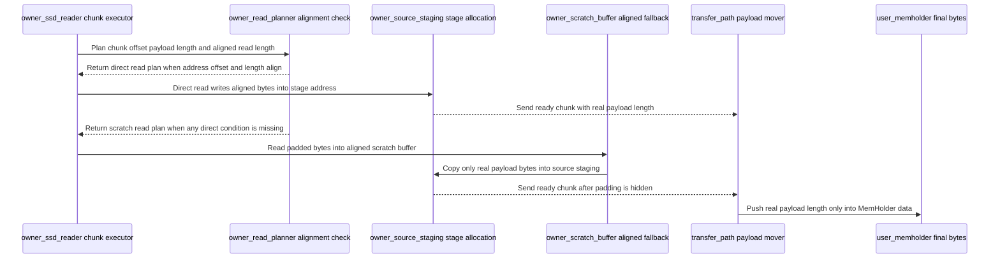

### 6.4 IO 调度：读写队列和 uring 权重

底层每个有效 device 有独立 writer queue、reader queue 和 `UringIoEngine`。writer task 负责 ring 分配和 SSD 写入提交，reader task 负责 chunk read 提交和 offset 有效性复查。

`UringIoEngine` 把 read 和 write 分成两个 channel。每个 uring 线程在 `io_depth` 限制内提交 SQE，并用简单权重控制读写 inflight 比例：读 inflight 不超过写 inflight 的若干倍时优先补读，否则补写。这让持续写入存在时，SSD 回填读不会长期排在写队列后面。

当前默认 `KvSsdUringMode::SingleBuffer`：常见单 buffer 读写直接提交 `IORING_OP_READ` / `IORING_OP_WRITE`，避免为一个连续 buffer 构造一元素 iovec。`Iovec` 模式仍保留为测试和对照路径；这项优化只覆盖 owner 本地 SSD IO 提交层，不代表完整 KV `put/get` 端到端收益。

reader completion 还有一次 offset 复查：read completion 返回后，会检查 entry 在 ring 中是否仍然有效。如果已经无效，就删除 entry 并返回 `KeyNotFound`。正常情况下 read pin 会阻止覆盖；这个复查是对并发状态和异常路径的最后防线。

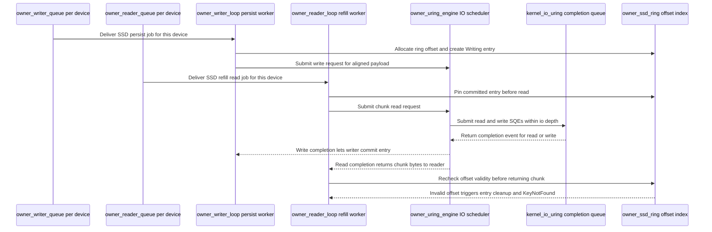

## 7. 一致性：沿用 key-version 和 holder 生命周期

SSD bytes 是否可见由 master route 和 owner ring 共同决定；最终进入 `get_holding` 的只有 requester target，source staging 始终是临时内存。

SSD source 路径里，谁调用 master `GetDoneReq` 取决于 stage 执行位置：

- 本地 SSD source：requester 自己读盘并完成 target 写入后，直接调用 `GetDoneReq`。
- 远端 SSD source：SSD owner 读盘并 push 到 requester target 后，由 SSD owner 调用 `GetDoneReq`。

无论是谁调用，master 在 `inflight_gets` 里记录的 `req_node_id` 都是 requester owner。`GetDoneReq` 取出 `InflightGetInfo` 后，把 requester target allocation 写入 `get_holding`，生成 `holder_id`。source staging allocation 不进入 `get_holding`，只随 in-flight get 生命周期释放。

远端 SSD owner 会把 master `GetDoneResp` 的 `holder_id`、`allocation_mode`、错误码和 server time 投影到 `SsdStageReadResp.done_*` 字段。requester 收到后，用这些字段构造普通 external holder 响应。用户看不到 SSD stage RPC。

`GetStart` 为 requester target 分配 allocation 时，会尝试占用 route 上的 durable slot。成功时，`allocation_mode` 是 `DurableReplica`；失败时就是 `Temporary`。`GetDone` 继续复用原有提升逻辑：只要 `allocation_mode == DurableReplica`，route 的 `put_id` 仍然匹配，请求方节点 tomb tag 仍然 live，master 就可以把 requester target 写入对应 entry 的 `memory`。这表示一次 SSD 回填读回来的数据，后续可以变成新的内存副本。

失败路径同样需要明确。SSD stage 失败时，请求方会调用：

```rust
GetRevokeReq {
    get_id,                 // Revoke this in-flight get and release its allocations.
    drop_ssd_source: true,  // Clear the failed SSD option from the current route.
}
```

master 处理 `GetRevokeReq` 时先删除 `inflight_gets`。只有 `drop_ssd_source == true` 且 `InflightGetInfo.source_kind == GetSourceKind::Ssd` 时，才会把当前 route 中 `src_node_id` 对应 entry 的 `ssd` 设为 `None`；如果它也没有内存副本，则同时删除该 entry。

这里有两个防误删条件：

- 如果本次 get 的 source kind 不等于 `Ssd`，`drop_ssd_source` 会被忽略。
- 如果 route 的 `put_id` 已经不同于本次 in-flight get 的 `put_id`，不会删除新版本 route。

删除失败 SSD source 后，如果这个 key-version 已经没有 live 内存副本和 SSD 副本，master 会删除 `kv_routes`；若 prefix index 开启，再异步清理 prefix index。requester target 没有进入 `get_holding`，用户不会拿到半成品 holder。

Staging allocation 的泄漏边界也在这里收住。当前实现里，source staging 被保存在 `InflightGetInfo.source_allocation`；成功 `GetDone`、失败 `GetRevoke`、或 `inflight_gets` 的 TTL 驱逐都会移除 in-flight 状态，让这块 owner 本地 allocation 随引用释放。远端 requester 崩溃时，master 侧 in-flight TTL 和节点 tomb 清理会兜住控制面；SSD owner 崩溃时，进程内 staging 本身随进程退出消失。

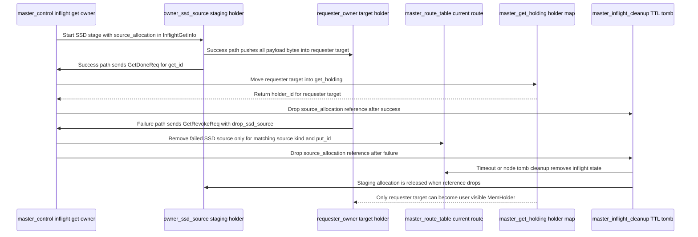

delete 和覆盖写不需要给 SSD 单独定义语义。覆盖写会生成新的 `put_id`，旧版本 SSD late commit 会因为 `put_id` 不匹配被忽略。显式 delete 会移除整个 `kv_routes` 条目，并广播清理客户端缓存。节点 tomb 清理会删除该节点在 `node_replicas` 中的整个 entry，内存和 SSD 状态一起失效。

本地内存副本驱逐只把对应 entry 的 `memory` 设为 `None`，同一 key-version 的 `ssd` 不受影响。SSD 失败或驱逐也只清理 `ssd`。两个字段都为空时才删除 node entry，整个 route 没有副本时才删除 `kv_routes` 条目。

公共 `get` 是否能读到 SSD bytes，只取决于当前 master route 是否仍然包含 live SSD replica。旧 bytes 即使还留在 shard 文件里，只要 route 被删除或版本不再匹配，公共 API 就不能命中它。owner 本地 ring 后续可以随着 head/tail 推进覆盖这些空间。

Owner 重启是这套设计的另一个明确边界。当前 shard 文件打开时使用 `create + truncate`，owner 进程启动会重建本地 SSD cache 文件和空 ring；没有 WAL、checkpoint 或 shard 扫描来恢复旧 entry。换句话说，owner 重启即清空本地 SSD cache，以极简恢复逻辑换取运行期写读路径的低开销。对应的 master route 会随 owner tomb、版本校验和路由清理失效，后续读取要么命中其他 live replica，要么返回 miss。

## 8. 设计取舍与当前边界

这套设计用运行期回填能力换容量弹性，不提供冷启动恢复、用户侧 SSD API 或单 value 多 device 条带化。

这套设计的硬约束是把复杂性限制在 owner 本地，避免扩张公共 API 和 master 控制面。

| 设计选择 | 得到什么 | 放弃或代价 | 当前边界 |
| --- | --- | --- | --- |
| master 不保存 SSD offset | master route 轻量，跨节点控制面只看 key-version、owner 和长度。 | owner 重启后无法用 master route 找回旧 SSD bytes。 | **SSD 只作为运行期介质层**。 |
| `PutDone` 不等待 SSD | 用户写入延迟保持内存 KV 语义，SSD 慢时背压停在 owner 本地 persist 路径。 | SSD 副本是 late commit，需要 `put_id` 防止旧版本污染。 | **内存副本 ready 才是同步提交点**。 |
| `O_DIRECT + io_uring`，而非 `mmap` / PageCache | 避免大 value 污染 page cache，减少 PageCache 与用户态之间的额外搬运和不可控抖动。 | 必须自己处理 512-byte 对齐、aligned buffer、ring 覆盖和 read pin。 | **IO 复杂性封装在 owner**。 |
| source-driven push | chunk ready 后由 SSD owner 直接推到 requester target，读盘和网络传输可重叠。 | requester 必须先通过 `SsdStageReadReq` 交出 target 地址和 `get_id`。 | **省的是 stage-ready 后的额外 RTT**。 |
| value 级 device 选择 | 调度简单，单 value 文件位置连续，读路径容易 pin。 | 单个大 value 不跨 device 条带化。 | **多 device 并行发生在 value 粒度**。 |
| 启动时 truncate shard | 没有恢复扫描、WAL 和 checkpoint，运行期路径更短。 | 进程重启后本地 SSD cache 全失效。 | **不支持冷启动恢复**。 |
| scratch 读路径 | 不满足 direct read 对齐时仍能正确读取真实 payload。 | 该 chunk 多一次本地 copy。 | **padding 不进入用户 holder**。 |

为了避免把这层实现理解成通用持久化数据库，当前边界需要写清：

| 项目 | 当前结论 |
| --- | --- |
| 冷启动恢复 | **不支持**。owner 启动时重建并清空 SSD cache 文件，不扫描已有 shard 重建 master route。 |
| 用户侧 SSD API | **不提供**。用户仍然只调用 `put/get/delete`，返回普通 `MemHolder`。 |
| 独立 SSD 路径参数 | **不提供**。SSD cache root 从 owner `large_file_paths` 派生。 |
| 单 value 多 device 条带化 | **当前不做**。一个 value 写入一个 device 的一个 shard 连续 offset。 |
| SSD 文件 offset 外露 | **不外露**。offset、shard_id 和 read pin 都是 owner 本地实现细节。 |
| UI 容量视图 | **必须分层展示**。memory segment 和 `kv_ssd` 的 capacity/used 分开呈现。 |
| KV cache 场景收益 | **尚待测试**。当前先完成功能接入和通用路径优化，业务 workload 下的容量收益、命中率和尾延迟需要后续压测验证。 |
| lease key 专门 SSD 治理 | **当前没有专门策略**，仍复用 key-version route 和已有生命周期。 |

## 9. 链路回看

写入先让内存副本可见，读取先找内存副本；SSD 在后台补充副本，并在内存 miss 后提供回填。

把整条链路压成一句话：写入先提交内存 route，再异步写 owner 本地 SSD，写成后用同一个 `put_id` 补交 SSD route；读取先找内存 route，找不到才选择 SSD owner，SSD owner 从本地 shard 按 chunk 读入 staging，并把数据 push 到 requester target，最后复用原有 `GetDone` 和 `MemHolder` 生命周期。

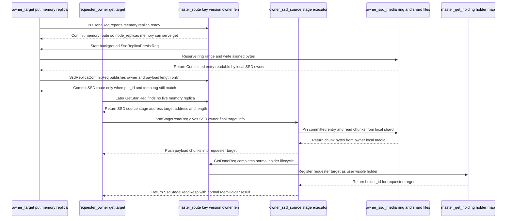

Fluxon KV 这次介质扩展的核心取舍是：把难题放在 owner 本地，把公共契约保持小。master 管 key-version route，owner 管本地 SSD 位置和 IO，external 继续拿普通 holder，观测面把 memory segment 和 KV SSD 分开呈现。当前阶段先完成能力接入和通用路径优化，让 SSD 可以成为内存 KV 的本地回填介质；它在具体 KV cache 场景里的收益，还需要后续 workload 测试来确认。
