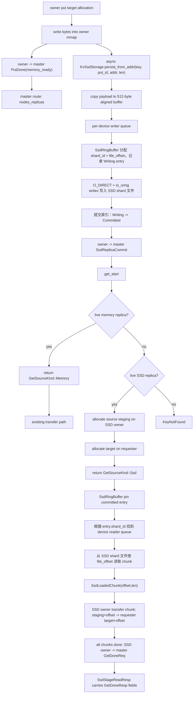
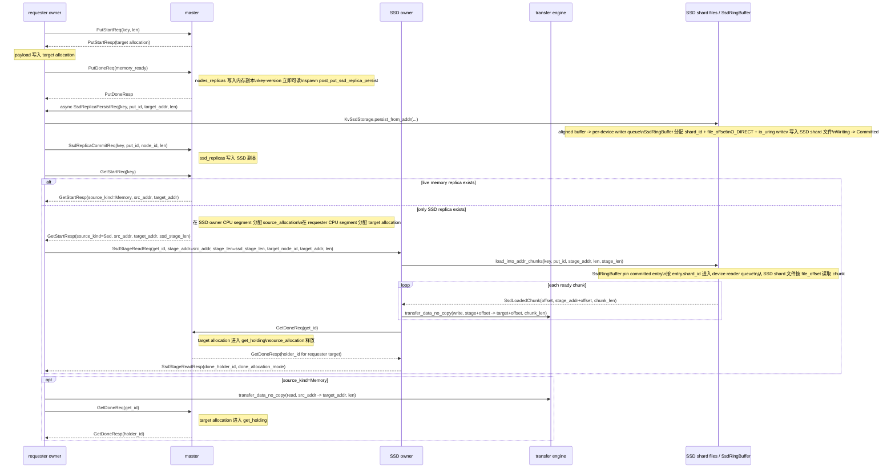
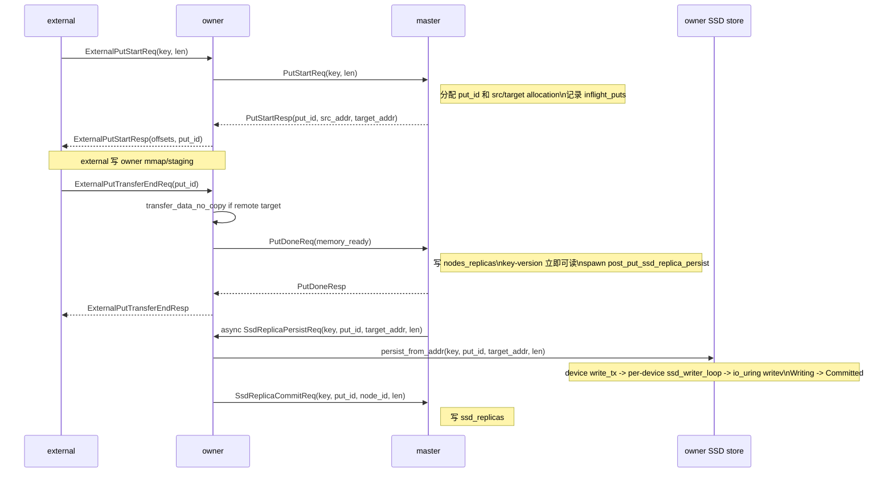
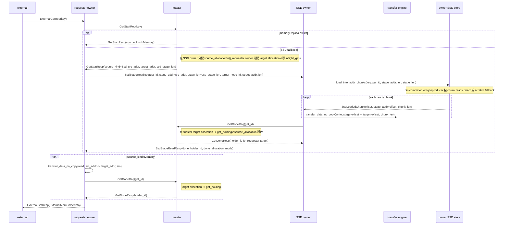
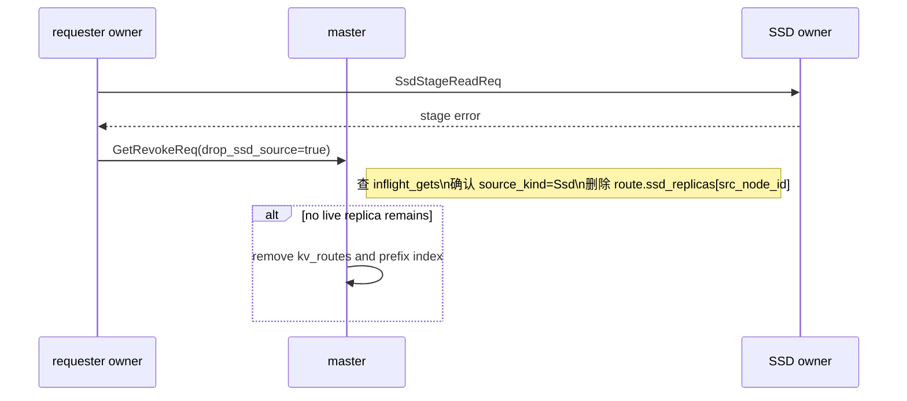
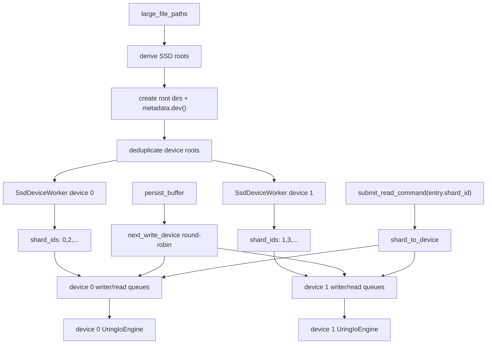

# KV 设计 5 - SSD 存储

## 设计目标

SSD 存储在 Fluxon KV 中作为 owner 本地 backing tier 接入通用 KV 链路。它不是一套独立的读写 API，也不改变用户侧 `put/get/delete` 语义；master 仍然以 key-version 为单位维护路由，内存副本是第一数据源，SSD 副本是内存副本不可用时的回填数据源。

读取侧采用“内存优先、SSD 回填”的设计。`GetStart` 优先选择 live 内存副本；没有可用内存副本时，master 才选择 SSD owner，并分配 SSD owner 本机 source staging 和 requester target。SSD owner 从本地 SSD 读入 source staging，再复用现有 transfer engine 把数据推到 requester target，最后继续使用原有 `GetDone` 和 `MemHolder` 生命周期。

## 公共契约

公共配置只有一个 owner-only 字段：

```yaml
fluxonkv_spec:
  large_file_paths: [/data/fluxon_large]
  ssd_storage:
    max_bytes: 4294967296
```

规则：

- `ssd_storage` 缺省或为 `null` 时不启用 SSD。
- `max_bytes` 必须大于或等于 512 bytes，满足当前 `O_DIRECT` 对齐约束。
- zero-contribution external 禁止声明 `ssd_storage`；external 只能通过 owner 的 mmap、RPC 和 transfer surface 访问 SSD 回填结果。
- 实际目录为每个可用 `large_file_root` 下的 `<cluster_name>_cluster_kv_ssd_storage/<safe_instance_key>/`；owner 启动时创建目录并读取 `metadata.dev()`，同一个 device 只保留第一个 root，避免多个路径指向同一块盘时制造虚假的 IO 并行度。
- 用户侧 `put/get/delete` API 不因 SSD 增加新入口；SSD 副本是 master 路由内部能力。

## 范围边界

| 范围 | 当前结论 |
| --- | --- |
| 分布式 SSD 读取 | 已接入。读取 key 时，master 仍优先选择可用内存副本；没有可用内存副本时，才选择持有 SSD 副本的 owner。磁盘数据先读到 SSD owner 本机的 source staging，再传到请求方 owner 的 target allocation。 |
| owner 内部多 SSD 路径 | 已接入。owner 可通过多个 `large_file_paths` 使用多块本地 SSD；路径会先按实际 device 去重，只有落在不同 device 上的 SSD cache root 目录才会创建独立读写队列、`UringIoEngine` 和 shard 文件集。 |
| 内存 KV 复用 | 已复用。SSD 回填继续走现有 KV transfer 链路：SSD owner 按 chunk 读出数据后，通过 `transfer_data_no_copy` 写到请求方 target；全部 chunk 完成后，SSD owner 向 master 提交 `get_done`，用户侧仍通过普通 `get` 拿到 `MemHolder`，不需要调用 SSD 专用接口。 |
| SSD 写入 IO 模型 | 已接入。owner 完成内存 `PutDone` 后，再异步把同一份 payload 写入本地 SSD。SSD 写入在 `KvSsdStorage` 内完成，使用 shard ring、`O_DIRECT`、`io_uring`、有界队列和 `Writing -> Committed` 两阶段提交。 |
| ring 位置生命周期 | 已接入。SSD 读写会保护正在使用的物理位置：读 IO 提交前会 pin 已提交的 entry；未完成写入的 `Writing` entry 和正在读取的 pinned entry 都不会被新的写入覆盖。 |
| 大 payload direct stage | 已接入 aligned fast path 和 chunk pipeline。master 给 SSD source staging 多分配最多 511 bytes，并在 allocation 内返回 512-byte 对齐后的 `src_addr`；SSD read 按 chunk 对齐 IO 长度直接写入 staging，chunk ready 后立刻 transfer，`MemHolder` 仍只使用真实 payload 长度。 |
| 冷启动恢复 | 当前不支持。owner 启动时不会扫描已有 SSD shard 来重建 master 路由；SSD 副本路由只来自本轮运行期间的 `put/get/delete` 生命周期。 |
| lease key 专门治理 | 当前没有专用策略。带 lease 的 key 和普通 key 使用同一套 key-version 路由与 SSD 副本生命周期，SSD 层不单独维护 lease 过期扫描或清理规则。 |
| 独立 SSD 路径参数 | 不提供。SSD cache 目录统一从 owner 的 `large_file_paths` 派生，不再增加单独的 SSD 路径配置，避免日志、共享 bundle、FS disk cache 和 KV SSD cache 出现多套路径来源。 |

## 数据流



## 端到端调用时序

SSD 路径只在两个位置扩展主链路：`put_done` 提交内存副本后，owner 异步把本地 target allocation 落到 SSD，并在完成后单独提交 SSD 副本；`get_start` 找不到可用内存副本时，master 为 SSD owner 分配 source staging，再由 SSD owner 按 chunk 把磁盘数据读入 staging 并 push 到 requester target。`get_done` 和 `MemHolder` 生命周期仍复用原有内存 KV 逻辑。SSD 回填时，最终 holder 对应的是请求方 owner 上的 target allocation；SSD owner 只负责从本地 SSD 读出数据、把全部 chunk 传到请求方 target，并在传输完成后向 master 调用 `GetDoneReq`。master 返回的 holder 字段会由 SSD owner 放入 `SsdStageReadResp` 带回请求方，请求方再用这些字段构造普通 `MemHolder`。




## 当前实现

| 模块 | 职责 |
| --- | --- |
| `fluxon_kv/src/config.rs` | 解析 `fluxonkv_spec.ssd_storage.max_bytes`，禁止 external 声明该字段，派生 SSD 根目录。 |
| `fluxon_kv/src/kv_ssd_storage.rs` | owner 内部 SSD cache。使用 shard 文件、`O_DIRECT`、`io_uring`、有界读写队列和两阶段索引管理 key-version bytes。 |
| `client_kv_api/put.rs` | owner 是最终 target 时，先通过 `PutDoneReq` 提交内存副本；SSD persist 由 master 的后台 `SsdReplicaPersistReq` 触发，owner 完成本地落盘后再通过独立 SSD commit 上报。 |
| `client_kv_api/get.rs` | `GetSourceKind::Ssd` 时，请求方让 SSD owner stage、push 并完成 `get_done`；stage RPC 成功后跳过请求方 transfer，也跳过请求方 `get_done`。 |
| `client_kv_api/msg_pack.rs` | 定义 `SsdStageReadReq/SsdStageReadResp` 和 `SsdReplicaPersistReq/SsdReplicaPersistResp`，分别用于 SSD stage 读、回传 done 结果，以及 master 触发 owner 本地 SSD persist。 |
| `master_kv_router/put.rs` | `put_done` 只提交内存副本，随后异步发起 `SsdReplicaPersistReq`；`SsdReplicaCommitReq` 单独写 `ssd_replicas`。 |
| `master_kv_router/get.rs` | 内存副本优先；无内存副本时从 `ssd_replicas` 中选择可用 owner，分配 source staging 和 requester target。 |
| `master_kv_router/delete.rs` | 内存副本被驱逐时，如果同 key-version 仍有 SSD 副本，保留 `kv_routes`。 |

## 接口里的角色分工

SSD 逻辑按接口看最清楚：`put` 先让一个 key-version 的内存副本 ready，再异步补交 SSD 副本；`get` 决定读请求先走内存副本还是 SSD fallback。每个接口里再分 master、owner、external 三个角色看状态归属。

### put



#### master

master 持有 `put` 的权威控制面状态：`inflight_puts` 记录未完成写入，`kv_routes` 记录提交后的当前版本。当前实现里 `PutDoneReq` 只表示内存副本 ready；SSD 副本通过独立 `SsdReplicaCommitReq` 进入 route。

当前协议结构如下。

```rust
pub struct MasterKvRouterInner {
    // PutStart 到 PutDone / PutRevoke 期间保留的 put 在途状态。
    pub inflight_puts: moka::future::Cache<(String, u64, u32), InflightPutInfo>,
    // 已提交 key-version 的权威路由表。
    pub kv_routes: DashMap<String, Arc<OneKvNodesRoutes>>,
    ...
}

pub struct InflightPutInfo {
    // 放置策略最终选中的 target owner。
    pub node_id: NodeID,
    pub key: String,
    // 发起这次 put 的原始请求节点。
    pub req_node_id: NodeID,
    pub len: u64,
    // PutDone 前保留 source / target allocation，避免内存被提前释放。
    pub src_target_allocation: Arc<Mutex<Option<InflightPutAllocation>>>,
}

pub struct OneKvNodesRoutes {
    // 当前已提交 value 的稳定版本号。
    pub put_id: PutIDForAKey,
    // 内存副本路由；PutDone 成功后立即写入。
    pub nodes_replicas: RwLock<HashMap<NodeID, KvRouteInfo>>,
    // SSD 副本路由；只记录 owner 和长度，不保存本地文件 offset。
    pub ssd_replicas: RwLock<HashMap<NodeID, KvSsdRouteInfo>>,
    ...
}

pub struct PutDoneReq {
    pub key: String,
    // 和当前 route 版本匹配时，才提交内存副本。
    pub put_id: PutIDForAKey,
    pub lease_id: Option<u64>,
}

pub struct SsdReplicaCommitReq {
    pub key: String,
    // SSD late commit 必须用这个版本号防止污染新 route。
    pub put_id: PutIDForAKey,
    // 完成 SSD persist 的 owner 节点。
    pub node_id: NodeIDString,
    // 真实 payload 长度；SSD 文件 offset 只保存在 owner 本地。
    pub len: u64,
}
```

`PutStartReq` 到达 master 后，master 分配 `put_id` 和源/目标 allocation，并把 allocation 放进 `InflightPutInfo.src_target_allocation`。`PutDoneReq` 到达时，master 只把 target allocation 写入 `nodes_replicas`，此时 key-version 已经可被 `get` 命中。SSD owner 后续完成落盘后再发 `SsdReplicaCommitReq`，master 校验 `kv_routes[key].put_id == put_id` 后，把 `KvSsdRouteInfo { node_id, len, tomb_tag }` 写入同一个 `OneKvNodesRoutes.ssd_replicas`。master 不保存 SSD 文件 offset，也不保存 owner 本地 ring index。

#### owner

owner 持有数据面：本机 CPU segment、可选 SSD store、put transfer 和 SSD persist。当前实现里，SSD persist 发生在 master 收到 `PutDoneReq` 并提交内存路由之后，不能阻塞内存副本 ready。

当前 owner 字段如下。

```rust
pub struct ClientKvApiInner {
    // owner 本地可选 SSD cache；external 不直接持有它。
    ssd_storage: Option<Arc<KvSsdStorage>>,
    rpc_caller_put_start: RPCCaller<PutStartReq>,
    rpc_caller_put_done: RPCCaller<PutDoneReq>,
    rpc_caller_ssd_replica_commit: RPCCaller<SsdReplicaCommitReq>,
    ...
}

pub struct SsdReplicaPersistReq {
    pub key: String,
    pub put_id: PutIDForAKey,
    // 已经 PutDone 的内存 target 绝对地址，owner 从这里复制 payload 到 SSD。
    pub target_addr: u64,
    pub len: u64,
}

pub struct KvSsdStorage {
    // 按 device 去重后的 SSD cache root 目录。
    root_dirs: Vec<PathBuf>,
    // 每个有效 device 对应一个读写 worker。
    devices: Vec<SsdDeviceWorker>,
    // shard_id 到 device worker 的映射，读路径按它选择 reader queue。
    shard_to_device: Vec<usize>,
    // 写入按有效 device 做 round-robin。
    next_write_device: AtomicUsize,
    // 全部 shard ring 和 key-version 索引的共享状态。
    inner: Arc<Mutex<KvSsdStorageInner>>,
    // ring 空间被 active IO 占住时，用它通知 writer 重试。
    space_notify: Arc<Notify>,
}

struct SsdDeviceWorker {
    // Linux metadata.dev() 得到的实际 device 标识。
    device_id: u64,
    root_dir: PathBuf,
    // 这个 device 负责的 shard 文件编号。
    shard_ids: Vec<usize>,
    // 持有 shard 文件 fd，保证 uring IO 生命周期内 fd 有效。
    _files: Vec<std::fs::File>,
    // 这个 device 独立的 io_uring engine。
    _io: Arc<UringIoEngine>,
    // per-device 写队列。
    write_tx: tokio_mpsc::Sender<WriteCommand>,
    // per-device 读队列。
    read_tx: tokio_mpsc::Sender<ReadCommand>,
}

struct KvSsdStorageInner {
    // 管理各 shard 文件内的环形 offset 空间和 key-version 索引。
    ring: SsdRingBuffer,
}
```

当 master 把这次 put 的最终 target allocation 放在某个 owner 上时，这个 owner 就是该 key-version 的内存副本 owner。`PutDoneReq` 只把这个 target allocation 提交到 `nodes_replicas`；提交完成后，这个 key-version 已经可以被普通 `get` 读到。SSD 落盘不在 `PutDoneReq` 的同步路径里；master 会在后台 task 中向同一个 target owner 发送 `SsdReplicaPersistReq { key, put_id, target_addr, len }`。这个后台 task 会继续持有 target allocation 的 `Arc<Allocation>`，保证 owner 从内存复制 payload 到 SSD 之前，这块内存不会被释放或复用。

target owner 收到 `SsdReplicaPersistReq` 后，从 `target_addr` 指向的内存 target 复制完整 payload，并构造 512-byte 对齐的 `AlignedBuffer`。随后 `persist_buffer` 按 value 级别通过 `next_write_device` round-robin 选择一个有效 device 的 `write_tx`；当前实现不会把同一个 payload 拆到多个 device。该 device 的 `ssd_writer_loop` 只在自己的 `shard_ids` 中选择一个 shard，由 `SsdRingBuffer::prepare_write_on_shards(...)` 为整个 aligned payload 分配一段连续 `file_offset`，并先记录 `Writing(SsdIndexEntry)`。对应 device 的 `UringIoEngine` 对这个 shard 文件执行 `O_DIRECT + writev`；写入成功后，entry 才从 `Writing` 提交为 `Committed`。最后 owner 向 master 发送 `SsdReplicaCommitReq`；master 校验请求里的 `put_id` 与当前内存 route 的 `put_id` 相同后，才会把这个 key-version 的 SSD 副本补充进 `ssd_replicas`。写队列和底层 uring 队列都是有界队列；如果 SSD 变慢，背压只停在 owner 本地 SSD persist 路径，不会回头改变已经完成的内存 `PutDone` 语义。

#### external

external 的状态边界只到 owner mmap 写入：它保存本次 put 所需的 `key`、`len`、`put_id` 和 mmap offset。SSD route 由 master 管理，SSD 文件位置由 target owner 本地 `SsdRingBuffer` 管理，external 不保存也不更新这些状态。

```rust
pub struct ExternalPutStartReq {
    pub key: String,
    pub len: u64,
    // 透传给 master PutStart，用于拒绝同 key 并发 put。
    pub reject_if_inflight_same_key: bool,
    // 透传给 master 放置策略，影响 target owner 选择。
    pub preferred_sub_cluster: Option<String>,
    // owner 代际校验，防止旧 external 请求提交到新 owner。
    pub started_time: i64,
    pub test_observe_put_phases: bool,
}

pub struct ExternalPutTransferEndReq {
    pub key: String,
    pub len: u64,
    // external 实际写入的 owner mmap offset；远端 target 时它是本地 staging。
    pub src_offset: u64,
    // 本地 target 时等于最终 target；远端 target 时由 owner 内部上下文修正。
    pub target_offset: u64,
    // 远端 target owner；本地 target 时为空。
    pub peer_id: Option<String>,
    // 远端 target owner 的 base addr；本地 target 时为空。
    pub target_base_addr: Option<u64>,
    // ExternalPutStart 返回的版本号，TransferEnd 用它完成 PutDone。
    pub put_id: Option<PutIDForAKey>,
    pub lease_id: Option<u64>,
    pub started_time: i64,
    pub test_observe_put_phases: bool,
}
```

external put 仍然是 `ExternalPutStart -> 写 owner mmap -> ExternalPutTransferEnd`。`ExternalPutTransferEndResp` 只代表内存提交完成；SSD 是否启用、何时 persist 成功、何时写入 `ssd_replicas` 都由 owner 和 master 的内部 commit 协议决定。external 只通过 `started_time` 做 owner 代际校验，避免把旧代际请求提交给新 owner。

### get



#### master

master 是 `get` 的控制面 authority：`kv_routes` 决定当前 key-version 可以从哪些内存或 SSD 副本读取，`inflight_gets` 记录本次 get 的 source/target allocation，`get_holding` 记录 `GetDone` 后仍被 holder 持有的 requester target allocation。

```rust
pub struct MasterKvRouterInner {
    // GetStart 到 GetDone / GetRevoke 期间保留的 get 在途状态。
    pub inflight_gets: moka::future::Cache<u64, InflightGetInfo>,
    // GetDone 后的 holder authority，键由 requester 节点和 holder_id 组成。
    pub get_holding: MasterOwnerMemMgr,
    // get_start 查询的当前稳定 key-version 路由。
    pub kv_routes: DashMap<String, Arc<OneKvNodesRoutes>>,
    ...
}

pub struct OneKvNodesRoutes {
    // 当前稳定版本号，内存副本和 SSD 副本共享它。
    pub put_id: PutIDForAKey,
    // 内存副本优先作为 get source。
    pub nodes_replicas: RwLock<HashMap<NodeID, KvRouteInfo>>,
    // 内存副本不可用时才作为 SSD fallback source。
    pub ssd_replicas: RwLock<HashMap<NodeID, KvSsdRouteInfo>>,
    pub get_durable_slots_used: AtomicU32,
}

pub struct KvSsdRouteInfo {
    // 持有本地 SSD 副本的 owner。
    pub node_id: NodeID,
    // 真实 payload 长度；SSD stage 和 transfer 对外只暴露这个长度。
    pub len: u64,
    // 和内存 route 对齐的节点代际，用于失效判断。
    pub tomb_tag: NodeTombTag,
}

pub struct InflightGetInfo {
    // 本次 get 命中的 key-version，用于拒绝过期完成。
    pub put_id: PutIDForAKey,
    // master 选中的 source 节点；SSD fallback 时是 SSD owner。
    pub src_node_id: NodeID,
    // 发起 get 的 requester owner，最终 holder 归属使用它。
    pub req_node_id: NodeID,
    pub len: u64,
    // requester target allocation，GetDone 后进入 get_holding。
    pub allocation: Arc<Allocation>,
    // SSD source staging allocation；memory source 路径为空。
    pub source_allocation: Option<Arc<Allocation>>,
    pub route: Arc<OneKvNodesRoutes>,
    pub allocation_mode: GetAllocationMode,
    // 区分 memory source 和 SSD fallback source。
    pub source_kind: GetSourceKind,
}
```

master 处理 `GetStartReq` 时先查 `kv_routes`，并优先选择 live 内存副本。命中内存副本时，`GetStartResp` 返回 `GetSourceKind::Memory`，requester owner 按原有 transfer 路径把数据搬到 requester target。只有没有可用内存副本时，master 才从 `ssd_replicas` 里选择 SSD owner，并同时分配两块 allocation：`source_allocation` 位于 SSD owner，用作本地读盘 staging；`allocation` 位于 requester owner，是最终进入 holder 的 target。`GetStartResp.src_addr` 是 SSD owner 本地对齐后的 staging 地址，`target_addr` 是 requester target 地址，`ssd_stage_len` 是对齐后的 source staging 容量，`len` 始终是真实 payload 长度。

`GetDoneReq` 到达后，master 从 `inflight_gets` 取出本次 get，把 requester target allocation 转入 `get_holding`，并返回 `holder_id`。memory source 路径由 requester owner 调用 `GetDoneReq`；SSD source 路径由 SSD owner 在全部 chunk transfer 完成后调用。无论谁发起 `GetDoneReq`，holder 都归属 `InflightGetInfo.req_node_id` 对应的 requester owner，SSD owner 的 `source_allocation` 只作为读盘 staging，不进入 `get_holding`。

#### owner

owner 在 `get` 里有两个可能角色：requester owner 负责调用 master，并根据 `GetSourceKind` 选择 memory transfer 或 SSD stage RPC；SSD owner 负责响应 `SsdStageReadReq`，读取本地 SSD，把读出的 bytes 按 chunk push 到 requester target，并在全部 chunk transfer 完成后向 master 发送 `GetDoneReq`。

```rust
pub struct ClientKvApiInner {
    // requester owner 和 SSD owner 都通过它访问本地 SSD cache。
    ssd_storage: Option<Arc<KvSsdStorage>>,
    // external get 返回的 holder 在 owner 侧的借用表。
    pub external_get_holding: OwnerExternalMemMgr,
    rpc_caller_get_start: RPCCaller<GetStartReq>,
    rpc_caller_get_done: RPCCaller<GetDoneReq>,
    rpc_caller_ssd_stage_read: RPCCaller<SsdStageReadReq>,
    ...
}

pub struct SsdStageReadReq {
    pub key: String,
    pub put_id: PutIDForAKey,
    // SSD owner 用它在全部 chunk transfer 完成后调用 master GetDoneReq。
    pub get_id: u64,
    // master 在 SSD owner 上分配的 source staging 对齐地址。
    pub stage_addr: u64,
    // source staging 容量，包含 O_DIRECT 对齐需要的空间。
    pub stage_len: u64,
    // 最终接收数据的 requester owner。
    pub target_node_id: NodeIDString,
    // requester target allocation 的绝对地址。
    pub target_addr: u64,
    // 真实 payload 长度。
    pub len: u64,
}

pub struct SsdStageReadResp {
    // master GetDoneResp 的 holder_id 投影。
    pub done_holder_id: u64,
    // master GetDoneResp 的 allocation_mode 投影。
    pub done_allocation_mode: GetAllocationMode,
    // master GetDoneResp 的状态字段投影。
    pub done_error_code: ErrorCode,
    pub done_error_json: String,
    pub done_server_process_us: i64,
    // SsdStageRead RPC 自身的状态字段。
    pub error_code: ErrorCode,
    pub error_json: String,
}
```

requester owner 收到 `GetSourceKind::Memory` 时，继续走原有内存 transfer：从 `src_addr` 读，把数据写到 `target_addr`，传输完成后由 requester owner 自己调用 master `GetDoneReq`。收到 `GetSourceKind::Ssd` 时，requester owner 不自己读 SSD，也不自己调用 `get_done`；它向 SSD owner 发起 `SsdStageReadReq`，等待 `SsdStageReadResp` 带回 master `GetDoneResp` 的 holder 字段。

SSD owner 收到 `SsdStageReadReq` 后，在本地执行 `load_and_push_kv_from_ssd(...)`。read producer 先 pin 当前 committed entry，再按 chunk 从 SSD shard 文件读到 `stage_addr + offset`；transfer consumer 每收到一个 `SsdLoadedChunk`，就把 `stage_addr + offset` 推到 requester 的 `target_addr + offset`。全部 chunk transfer 成功后，SSD owner 用 `get_id` 向 master 调 `GetDoneReq`，再把返回的 `holder_id` 和 `allocation_mode` 填入 `SsdStageReadResp.done_*` 返回 requester。读路径进入 per-device reader queue，底层 `UringIoEngine` 把 read/write 分成独立发送队列，并按 inflight 比例补读，避免回填读长期排在持续写入之后。

```rust
struct SsdRingBuffer {
    // key-version 到 Writing/Committed SSD 位置的全局索引。
    entries: HashMap<KvSsdKey, SsdEntryState>,
    // active read pin，防止 writer 推进 tail 覆盖正在读取的位置。
    read_pins: HashMap<KvSsdKey, SsdReadPinInfo>,
    ...
}

enum SsdEntryState {
    // 已分配 offset 但 writev 尚未完成。
    Writing(SsdIndexEntry),
    // writev 成功后才允许 get_start 作为 SSD source 命中。
    Committed(SsdIndexEntry),
}
```

`read_pins` 是 owner 本地 SSD ring 的生命周期保护，防止 writer 推进 tail 时覆盖 active read。chunk pipeline 在整个 producer 生命周期内持有同一个 read pin；每个 chunk 单独提交 read task。direct read 条件满足时，`readv` 直接写到 `SsdStageReadReq.stage_addr + offset`；否则先读 scratch aligned buffer，再复制当前 chunk 的真实 payload 长度到 staging。direct read 省掉的是 scratch buffer 到 source staging 的本机 memcpy，不省掉 `source staging -> requester target` 的 transfer。请求方 target 是否远端不影响 SSD direct read 的对齐判断。

#### external

external 的状态边界只到 owner 返回的 mmap holder：它发 `ExternalGetReq` 给 requester owner，并接收 `ExternalMemHolderInfo { offset, len, holder_id }`。SSD route 由 master 管理，SSD 文件位置和 source staging 由 SSD owner 管理，external 不保存也不更新这些状态。

```rust
pub struct ExternalGetReq {
    pub key: String,
    // external 通过 owner 发起 get，req_node_id 仍指向请求方身份。
    pub req_node_id: String,
    // owner 代际校验，防止过期 external 请求继续使用旧 owner。
    pub started_time: i64,
}

pub struct ExternalGetResp {
    pub error_code: ErrorCode,
    pub error_json: String,
    // 成功时返回 external 可见的 holder 元数据。
    pub external_memholder_info: Option<ExternalMemHolderInfo>,
}

pub struct ExternalMemHolderInfo {
    // external attach 到 owner mmap 后可见的 offset。
    pub offset: u64,
    // 真实 payload 长度。
    pub len: u32,
    // 后续 release ack 使用的 holder id。
    pub holder_id: u64,
}

pub struct ExternalMemHolder {
    pub offset: u64,
    // 当前 external 进程内 mmap 后的绝对地址。
    pub addr: u64,
    pub len: u32,
    pub holder_id: u64,
    pub key: String,
    pub external_client_id: String,
    // drop/release 时校验 owner 代际。
    pub owner_start_time: i64,
    ...
}
```

owner 内部完成普通 `get` 后，会把 `MemoryInfo` 写入 `external_get_holding`，用这条 owner 侧引用代表 external 当前仍在借用该 holder；随后 owner 只把 `ExternalMemHolderInfo { offset, len, holder_id }` 返回给 external。external 构造 `ExternalMemHolder` 后，通过 owner mmap 的 `offset/addr` 读取结果。external holder drop 时，会向 owner 发送 `ExternalDeleteAckReq`；owner 删除 `external_get_holding` 中对应记录，释放 external 这一份引用。只有当 owner 侧不再有其它 `Arc<MemoryInfo>` 引用时，`MemoryInfo` drop 才会沿用原有 owner -> master holder ack 链路释放 master `get_holding`。

### stage 失败和释放



```rust
pub struct GetRevokeReq {
    // 要撤销的在途 get。
    pub get_id: u64,
    // 只有 SSD stage 失败时才置 true，用来删除失败的 SSD source route。
    pub drop_ssd_source: bool,
}
```

SSD stage 失败时，请求方调用 `get_revoke_ssd_source(...)`，也就是 `GetRevokeReq { drop_ssd_source: true }`。master 从 `inflight_gets` 找到本次 get，只有 `source_kind == GetSourceKind::Ssd` 时才会删除 `route.ssd_replicas[src_node_id]`，避免后续 get 继续选择同一个失败 SSD source。如果同一个 `OneKvNodesRoutes` 下已经没有 live 内存副本和 SSD 副本，master 再删除 `kv_routes` 并异步清理 prefix index。

这里的释放边界是：SSD owner 上的 `source_allocation` 只服务本次 stage，失败后随 `inflight_gets` 清理释放；requester target allocation 没有进入 `get_holding`，因此不会生成用户可见 holder。

## 关键代码片段

### put_done 只提交内存副本

当前实现中，`put_done` 只把内存 target allocation 写入 `nodes_replicas`。SSD 是否落盘不影响这次 `PutDone` 的可见性。

```rust
pub struct PutDoneReq {
    pub key: String,
    // 只提交这个 key-version 的内存副本。
    pub put_id: PutIDForAKey,
    pub lease_id: Option<u64>,
}

// 这里只把内存 target 写入 nodes_replicas；SSD 副本稍后独立 commit。
one_kv_routes
    .nodes_replicas
    .write()
    .insert(node_id.clone(), completed_info);
```

这段边界是：`nodes_replicas` 代表内存副本 ready，`get_start` 可以立即从这里返回 memory source；`ssd_replicas` 不能在这一步写入，否则 `PutDone` 会被 SSD persist 延迟拖住。SSD 副本后续用同一个 `put_id` 独立提交。

### SSD replica 独立 commit

SSD owner 后台 persist 成功后，单独向 master 提交同一个 key-version 的 SSD 副本。master 必须校验当前 route 的 `put_id` 仍然匹配，避免旧版本 SSD late commit 污染新版本路由。

```rust
pub struct SsdReplicaCommitReq {
    pub key: String,
    // 必须匹配当前 route 版本，避免 SSD late commit 污染新版本。
    pub put_id: PutIDForAKey,
    // 完成落盘的 SSD owner。
    pub node_id: NodeIDString,
    // 真实 payload 长度。
    pub len: u64,
}

if let Some(route) = kv_routes.get(&req.key) {
    // 过期 put_id 直接丢弃，不 resurrect 旧版本。
    if route.put_id == req.put_id {
        // master 只保存 SSD owner 和长度；文件 offset 留在 owner 本地 ring index。
        route.ssd_replicas.write().insert(
            node_id.clone(),
            KvSsdRouteInfo {
                node_id: node_id.clone(),
                len: req.len,
                tomb_tag,
            },
        );
    }
}
```

master 只在 `req.put_id == route.put_id` 时写 `ssd_replicas`；过期 `put_id` 的 late commit 会被丢弃，不能 resurrect 旧版本。`SsdReplicaCommitReq.len` 是真实 payload 长度；SSD shard 文件 offset 不进入 master route，只留在 target owner 本地 `SsdRingBuffer`。

### get_start 分配分布式 SSD staging

SSD fallback 发生在 master 已经没有可用 `nodes_replicas` 之后。source staging 一定分配在 SSD owner 的 CPU segment 上，target allocation 一定分配在 requester 的 CPU segment 上。

```rust
// SSD read 使用 O_DIRECT，读长度先按 512 bytes 对齐。
let ssd_stage_len = align_ssd_io_len(ssd_replica.len)?;
// 额外预留 511 bytes，确保 allocation 内能找到 512-byte 对齐地址。
let source_alloc_len = ssd_stage_len + SSD_ALIGNMENT as u64 - 1;

// source staging 放在 SSD owner 上，只服务本次读盘和 push。
let source_allocation = allocate_get_buffer_on_node(
    &view,
    &ssd_replica.node_id,
    source_alloc_len,
    get_id,
    "ssd source staging",
)?;
// target allocation 放在 requester 上，GetDone 后转成最终 holder。
let target_allocation = allocate_get_buffer_on_node(
    &view,
    &req_node_id,
    ssd_replica.len,
    get_id,
    "requesting target",
)?;

// 返回给 SSD owner 的是对齐后的 staging 地址，不一定等于 allocation 起点。
let source_addr = align_ssd_stage_addr(source_base + source_allocation.addr())?;
```

这里的关键边界是：`source_allocation` 在 SSD owner 上，只用于读盘 staging；`target_allocation` 在 requester owner 上，成功 `GetDone` 后进入 `get_holding`。`source_alloc_len = align_up(len, 512) + 511`，保证 allocation 内总能找到 512-byte 对齐的 `src_addr`；`src_addr` 是对齐后的 staging 地址，不一定等于 `source_allocation` 起点。

### requester 触发 SSD owner stage/push/done

请求方收到 `GetSourceKind::Ssd` 后，让 SSD owner 把数据读入 `src_addr`、按 chunk push 到 `target_addr + offset`，并由 SSD owner 直接完成 master `get_done`。这里没有新增用户 API；`SsdStageReadReq` 是 owner 内部 RPC。stage RPC 成功返回时，requester target 已经可读，并且 requester 已经拿到 master done 结果；请求方跳过自己的 transfer 分支，也跳过自己的 `get_done`。

```rust
let mut ssd_done_resp = None;
if resp.source_kind == GetSourceKind::Ssd {
    // SSD owner 负责读盘、push chunk，并在完成后调用 master GetDoneReq。
    let done_resp = self.stage_kv_from_ssd_source(
        &resp.node_id,
        key,
        put_id,
        get_id,
        resp.src_addr,
        resp.target_addr,
        data_len as u64,
        resp.ssd_stage_len,
    )
    .await?;
    ssd_done_resp = Some(done_resp);
}

if resp.source_kind == GetSourceKind::Ssd {
    // SSD owner 已经把全部 chunk push 到 target_addr，并完成 get_done。
} else {
    // memory source 路径仍由 requester 自己做 transfer。
    self.view.client_transfer_engine()
        .transfer_data_no_copy(peer_id, true, resp.src_addr, resp.target_addr, len, None)
        .await?;
}

let done_resp = if let Some(done_resp) = ssd_done_resp {
    // SSD source 路径复用 SsdStageReadResp 带回的 GetDoneResp 字段。
    done_resp
} else {
    // memory source 路径的 GetDoneReq 仍由 requester 发送。
    self.get_done(get_id).await?
};
```

SSD source 路径里，`stage_kv_from_ssd_source(...)` 成功返回时，SSD owner 已经完成读盘、chunk transfer 和 master `GetDoneReq`。requester 因此跳过自己的 transfer 和 `get_done`，直接复用 `SsdStageReadResp.done_*` 构造 holder。memory source 路径仍由 requester 自己 transfer 并调用 `get_done`。

### SSD chunk read 与 direct/scratch fallback

当前实现只有 SSD 回填读路径会把 payload 切成 chunk；SSD 写入按 value 级别一次写入一个 device 的一个 shard 连续 offset。`SsdLoadedChunk` 是 read producer 交给 transfer consumer 的最小就绪单元；`ReadCommand` 记录本次 chunk 要读的 committed entry、shard 文件 offset 和读入目标。

```rust
pub(crate) struct SsdLoadedChunk {
    // 当前 chunk 在完整 payload 中的偏移。
    pub offset: u64,
    // 当前 chunk 在 SSD owner source staging 中的起始地址。
    pub stage_addr: u64,
    // 当前 chunk 的真实 payload 长度，不包含 O_DIRECT padding。
    pub len: u64,
}

struct ReadCommand {
    key: KvSsdKey,
    // 已 pin 的 committed entry，里面包含 shard_id、file_offset 和长度。
    entry: SsdIndexEntry,
    // 这次 chunk read 在 SSD shard 文件内的起始 offset。
    file_offset: u64,
    // Direct 表示直接读入 staging，Scratch 表示先读入 aligned buffer。
    target: ReadTarget,
    // 持有 read pin，防止 writer 在读完成前覆盖该位置。
    _read_pin: Option<SsdReadPin>,
    done_tx: oneshot::Sender<KvResult<ReadOutput>>,
}
```

`load_and_push_kv_from_ssd(...)` 把 SSD read 和 transfer 做成流水线：producer 按 chunk 提交 SSD read，并把读好的 chunk 放入 ready queue；consumer 收到 ready chunk 后立即 push 到 requester target。读和传输可以重叠，多个 chunk 可以同时处于 read inflight 或 transfer inflight 状态。

```rust
// ready queue 让 read producer 和 transfer consumer 解耦。
let (chunk_tx, chunk_rx) = ::tokio::sync::mpsc::channel(
    DEFAULT_READ_TRANSFER_PIPELINE_INFLIGHT.saturating_mul(2).max(1),
);

// producer 按 chunk 从 SSD shard 文件读入 source staging。
let producer = store.load_into_addr_chunks(
    key,
    put_id,
    stage_addr,
    len,
    stage_len,
    DEFAULT_READ_TRANSFER_PIPELINE_CHUNK_BYTES,
    DEFAULT_READ_TRANSFER_PIPELINE_INFLIGHT,
    chunk_tx,
);
// consumer 收到 ready chunk 后立即 push 到 requester target。
let consumer = self.transfer_loaded_ssd_chunks(peer_id, target_addr, chunk_rx);
// 两个 future 并发执行，形成 read-transfer pipeline。
let (producer_res, consumer_res) = ::tokio::join!(producer, consumer);
```

`load_into_addr_chunks(...)` 先 pin 当前 committed entry，pin 生命周期覆盖整个 producer。每个 chunk 用 `entry.file_offset + offset` 定位 SSD shard 文件中的读取位置，并根据 staging 地址、文件 offset 和 staging 容量选择 direct 或 scratch；chunk read 完成后立即发送 `SsdLoadedChunk`。

```rust
// pin 生命周期覆盖整个 producer，writer 不能覆盖 active read 位置。
let (entry, _read_pin) = {
    let mut inner = self.inner.lock();
    let Some(entry) = inner.ring.pin_read(&key) else {
        return Err(KvError::Api(ApiError::KeyNotFound { key: key.key.clone() }));
    };
    (entry, SsdReadPin { ... })
};

// 每个 chunk 在同一个 committed entry 内推进文件 offset。
let file_offset = entry.file_offset + offset;
let target = match choose_chunk_read_path(stage_addr, read_len, target_len, file_offset) {
    // staging 地址、文件 offset 和 IO 长度都满足对齐时走 direct read。
    SsdReadPath::Direct => ReadTarget::Direct {
        target_addr: stage_addr,
        len: read_len as usize,
    },
    // 否则先读到 aligned scratch buffer。
    SsdReadPath::Scratch => ReadTarget::Scratch(AlignedBuffer::zeroed(read_len as usize)?),
};

// submit_read_command 根据 entry.shard_id 进入对应 device reader queue。
let output = submit_read_command(key, entry, file_offset, target, None).await?;
if let ReadOutput::Scratch(buffer) = output {
    // scratch 路径只把真实 payload 长度复制到 staging。
    copy_payload_to_stage(buffer, stage_addr, payload_len)?;
}
// 下游 transfer 只看到真实 payload 长度。
ready_tx.send(SsdLoadedChunk { offset, stage_addr, len: payload_len }).await?;
```

direct 路径把 `readv` 的目标直接设为当前 chunk 的 source staging；scratch 路径先读入 aligned buffer，再只复制当前 chunk 的真实 payload 长度到 staging。两条路径最后都只把真实 payload 长度暴露给 transfer 和 `MemHolder`，不会把 `O_DIRECT` padding 暴露给用户。

## IO 模型



| 组件 | 设计 |
| --- | --- |
| device root | owner 从 `large_file_paths` 派生 SSD cache root；创建目录后用 `metadata.dev()` 判断真实 device，同一 device 只保留一个有效 root。 |
| shard 文件 | `max_bytes` 是 owner 本地 SSD cache 的容量上限；容量被拆成多个 shard 文件，分布到有效 device root 的 `shards/` 下。`shard_to_device` 记录每个 shard 属于哪个 device。 |
| 写入选路 | `persist_buffer` 用 `next_write_device` round-robin 选择一个 device；一个 payload 只进入这个 device 的 writer queue，并在该 device 的某个 shard 中分配一段连续 `file_offset`。 |
| 读取选路 | committed entry 保存 `shard_id` 和 `file_offset`；读 chunk 时通过 `entry.shard_id -> shard_to_device` 找到 device reader queue，再从对应 shard 文件的 `file_offset + offset` 读取。 |
| per-device worker | 每个有效 device 有独立 writer queue、reader queue 和 `UringIoEngine`；这些 worker 只处理本 device 的 shard 文件 IO。 |
| 对齐与回收 | SSD shard 使用 `O_DIRECT`，要求地址、长度和文件 offset 512-byte 对齐；不满足 direct 条件的读 chunk 走 scratch buffer。ring head/tail 和 read pin 只在 owner 本地保护 shard 文件位置，不进入 master route。 |

## Task / Actor / 独立线程

这一节只列运行时执行单元，不再重复 device/shard 选路。SSD 没有新增独立的 master route actor；控制面仍由原有 master/owner RPC handler 承载。新增的后台执行主要在 owner 本地：每个有效 device 有 writer task、reader task 和对应的 `UringIoEngine` 后台线程。

### owner 本地 SSD IO 执行单元

| 执行单元 | 创建位置 | 类型 | 输入 | 职责 |
| --- | --- | --- | --- | --- |
| `ssd_writer_loop` | `KvSsdStorage::new`，每个 effective device 一个 | `tokio::task::spawn` | `SsdDeviceWorker.write_tx` | 从 `persist_from_addr` 接收写任务，只在本 device 的 `shard_ids` 内调用 `SsdRingBuffer::prepare_write_on_shards`，提交 `writev`，完成后 `commit(Writing -> Committed)`。 |
| `ssd_reader_loop` | `KvSsdStorage::new`，每个 effective device 一个 | `tokio::task::spawn` | `SsdDeviceWorker.read_tx` | 从 `load_into_addr_chunks` 接收属于本 device shard 的 chunk 读任务，提交 direct/scratch `readv`，校验 offset 仍有效，完成后回传 chunk 读结果；整条 producer 完成后释放 `SsdReadPin`。 |
| `fluxon-kv-ssd-uring-{idx}` | 每个 device 的 `UringIoEngine::new_multi` | `std::thread::spawn` | `read_rx/write_rx: crossbeam::channel` | 每个线程持有一个 `IoUring`，只提交本 device shard 文件的 `Readv/Writev` SQE，并按 read/write inflight 比例调度后回传 CQE。 |

`KvSsdStorage` 通过每个 `SsdDeviceWorker` 持有 shard fd 和 `UringIoEngine`，保证 fd 与 uring 线程生命周期覆盖 writer/reader task；drop 时关闭 channel 并 join uring 线程。

### 控制面 RPC / 清理任务

| 执行单元 | 创建位置 | 类型 | 输入 | 职责 |
| --- | --- | --- | --- | --- |
| `rpc_ssd_replica_commit` | `MasterKvRouter` RPC handler 注册 | `view.spawn(...)` | `SsdReplicaCommitReq` | owner SSD persist 成功后提交 SSD 副本，master 校验 `put_id` 后写 `ssd_replicas`。 |
| `rpc_ssd_stage_read` | `ClientKvApi` RPC handler 注册 | `view.spawn(...)` | `SsdStageReadReq` | 远端 SSD owner 收到 stage 请求后，在 owner 进程内调用 `load_and_push_kv_from_ssd(...)`；SSD read producer 和 transfer consumer 流水线完成后，再调用 master `get_done` 并回传 done fields。 |
| `ssd_failure_remove_prefix_index` | `get_revoke(drop_ssd_source=true)` | `view.spawn(...)` | 失败 SSD source 的 key | 当失败 SSD source 是最后一个 live replica 时，异步删除 prefix index。 |

SSD route 的权威更新点仍是原有 master RPC handler：

- `PutDone`：同步更新 `nodes_replicas`，让内存副本立即可读。
- `SsdReplicaCommit`：SSD persist 完成后同步更新 `ssd_replicas`，并拒绝过期 `put_id`。
- `GetStart`：同步选择内存副本或 SSD 副本，并写入 `inflight_gets`。
- `GetRevoke`：同步删除失败 SSD source；必要时触发 prefix index 小任务。
- `Delete` / 覆盖写失效：复用原有 `delete_broadcast` 管线。

## 不变量

- `nodes_replicas` 和 `ssd_replicas` 都属于同一个 `OneKvNodesRoutes.put_id`，不能跨版本复用。
- `PutDoneReq` 只表示内存副本 ready；SSD 副本只能由匹配当前 `put_id` 的 `SsdReplicaCommitReq` 补充进 `ssd_replicas`。
- `SsdReplicaCommitReq` 是内部控制面 RPC，不改变用户侧 `put/get/delete` API。
- `GetSourceKind::Ssd` 必须同时有 SSD owner source staging 和 requester target allocation；成功后只有 requester target allocation 进入 `get_holding`。
- SSD 回填失败必须通过 `get_revoke(drop_ssd_source=true)` 清理 in-flight get，并从 master 路由里移除失败的 SSD 副本。
- master 路由被删除后，旧 SSD bytes 即使还在 shard 文件里，也不能被公共 `get` 命中。

## 关键结论

这套实现把 SSD 作为内存 KV 之外的可回填数据源副本，而不是新增一套用户 API。写入侧先完成内存 `PutDone`，再由 target owner 异步落 SSD，并通过 `SsdReplicaCommitReq` 补充 SSD route；读取侧优先使用内存副本，内存副本不可用时由 SSD owner 从本地 shard 文件读出数据，按 chunk push 到 requester target，再复用原有 `get_done` 和 holder 生命周期。

因此，SSD 相关的 shard ring、`O_DIRECT`、`io_uring`、read pin 和 read/transfer pipeline 都限制在 owner 本地实现内；master 只保存这个 key-version 有哪些 owner 持有 SSD 副本，以及 value 的真实 payload 长度，不保存 SSD 文件 offset、shard_id 或本地 ring 状态。
