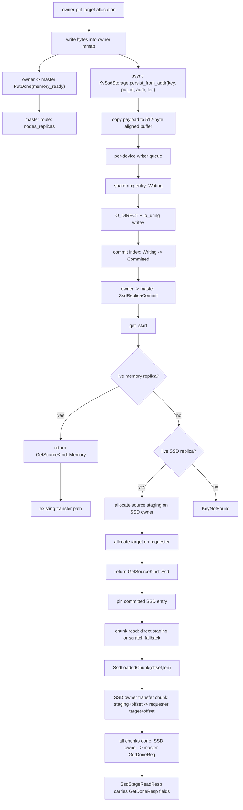
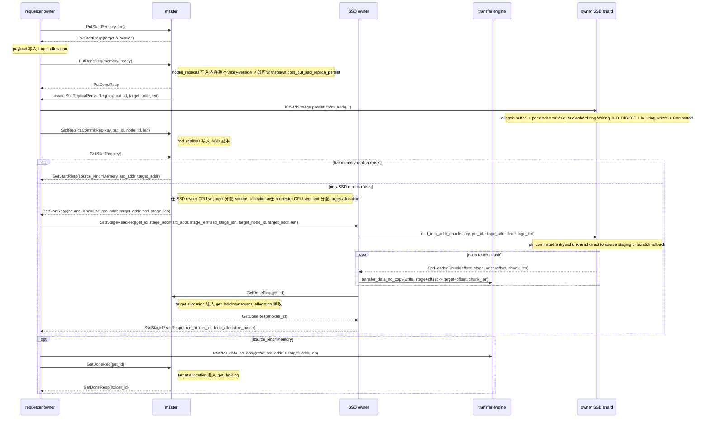
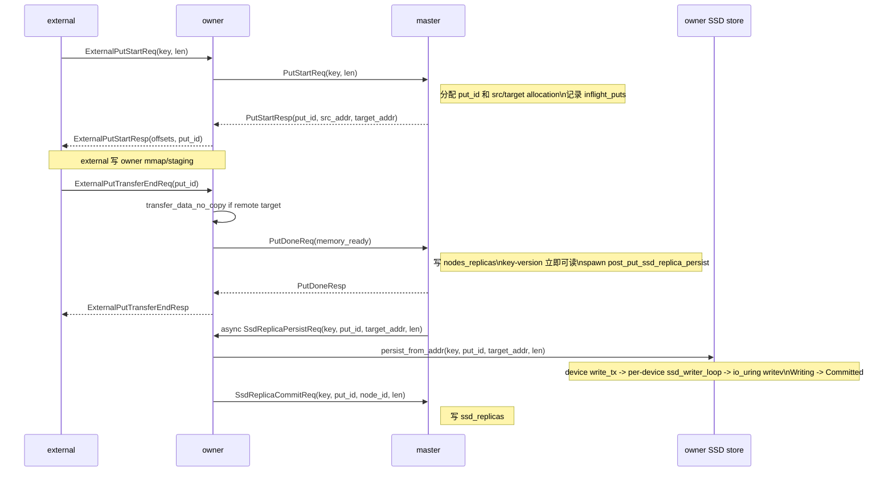
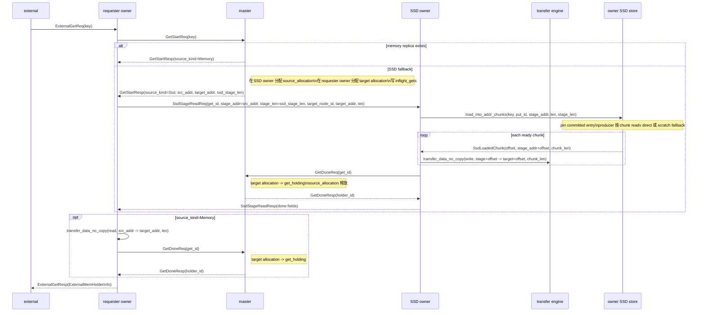
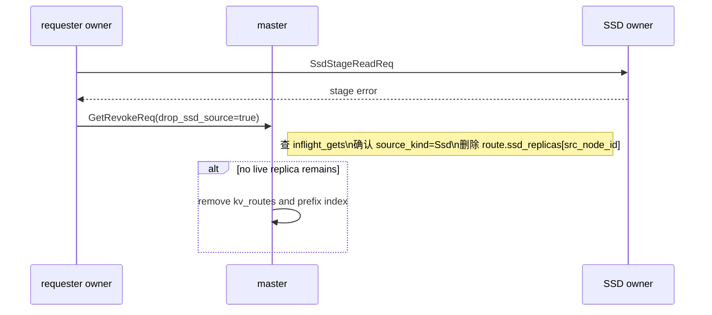
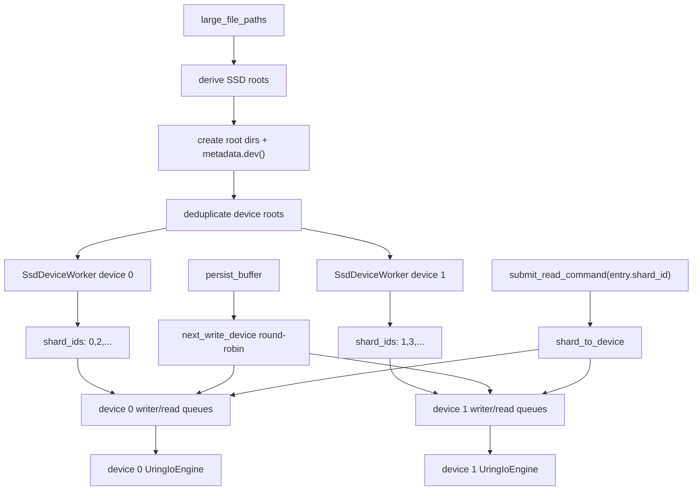

# KV 设计 5 - SSD 存储

## 设计目标

SSD 存储在 Fluxon KV 中作为 owner 本地 backing tier 接入通用 KV 链路。它不是一套独立的读写 API，也不改变用户侧 `put/get/delete` 语义；master 仍然以 key-version 为单位维护路由，内存副本是第一数据源，SSD 副本是内存副本不可用时的回填数据源。

读取侧采用“内存优先、SSD 回填”的设计。`GetStart` 优先选择 live 内存副本；没有可用内存副本时，master 才选择 SSD owner，并分配 SSD owner 本机 source staging 和 requester target。SSD owner 从本地 SSD 读入 source staging，再复用现有 transfer engine 把数据推到 requester target，最后继续使用原有 `GetDone` 和 `MemHolder` 生命周期。

## 公共契约

公共配置只有一个 owner-only 字段：

```yaml
fluxonkv_spec:
  large_file_paths: [/data/fluxon_large]
  ssd_storage:
    max_bytes: 4294967296
```

规则：

- `ssd_storage` 缺省或为 `null` 时不启用 SSD。
- `max_bytes` 必须大于或等于 512 bytes，满足当前 `O_DIRECT` 对齐约束。
- zero-contribution external 禁止声明 `ssd_storage`；external 只能通过 owner 的 mmap、RPC 和 transfer surface 访问 SSD 回填结果。
- 实际目录为每个可用 `large_file_root` 下的 `<cluster_name>_cluster_kv_ssd_storage/<safe_instance_key>/`；owner 启动时创建目录并读取 `metadata.dev()`，同一个 device 只保留第一个 root，避免多个路径指向同一块盘时制造虚假的 IO 并行度。
- 用户侧 `put/get/delete` API 不因 SSD 增加新入口；SSD 副本是 master 路由内部能力。

## 范围边界

| 范围 | 当前结论 |
| --- | --- |
| 分布式 SSD 读取 | 已接入。`GetStart` 可以返回任意 SSD owner，source staging allocation 位于 SSD owner，target allocation 位于请求方 owner。 |
| owner 内部多 SSD 路径 | 已接入。SSD root 来自 `large_file_paths`，先按 device 去重；每个有效 device 有独立 writer/reader queue、uring engine 和 shard 集，单 owner 可以利用多块真实本地 SSD。 |
| 内存 KV 复用 | 已复用。SSD 回填由 SSD owner 侧调用 `transfer_data_no_copy` 按 chunk push 到 requester target，全部 chunk transfer 完成后由 SSD owner 调 master `get_done`；requester 只复用返回的 holder 结果构造 `MemHolder`。 |
| SSD 写入 IO 模型 | 已接入。分片 ring、`O_DIRECT`、`io_uring`、有界队列、两阶段提交和 tail 失效都在 owner 本地 `KvSsdStorage` 内完成；写路径已经把内存 `PutDone` 和 SSD commit 拆开。 |
| ring 位置生命周期 | 已接入。读 IO 提交前 pin committed entry；未完成的 `Writing` entry 和 pinned read entry 都会阻止物理位置复用。 |
| 大 payload direct stage | 已接入 aligned fast path 和 chunk pipeline。master 给 SSD source staging 多分配最多 511 bytes，并在 allocation 内返回 512-byte 对齐后的 `src_addr`；SSD read 按 chunk 对齐 IO 长度直接写入 staging，chunk ready 后立刻 transfer，`MemHolder` 仍只使用真实 payload 长度。 |
| 冷启动恢复 | 当前不扫描 SSD shard 重建 master 路由；路由仍由本轮运行时的 `put/get/delete` 生命周期产生。 |
| lease key 专门治理 | 当前没有单独的 lease SSD 生命周期策略；lease 与普通 key 共用 key-version 路由约束。 |
| 独立 SSD 路径参数 | 不提供。SSD 根目录从 `large_file_paths` 派生，避免和日志、共享 bundle、FS disk cache 混用。 |

## 数据流



## 端到端调用时序

SSD 路径只在两个位置扩展主链路：`put_done` 提交内存副本后，owner 异步把本地 target allocation 落到 SSD，并在完成后单独提交 SSD 副本；`get_start` 找不到可用内存副本时，master 为 SSD owner 分配 source staging，再由 SSD owner 按 chunk 把磁盘数据读入 staging 并 push 到 requester target。`get_done` 和 holder 生命周期继续走内存 KV 的原 master 逻辑，但 SSD source 路径的 `GetDoneReq` 由 SSD owner 在全部 chunk transfer 完成后发起，requester 只消费 `SsdStageReadResp` 里带回的 done 结果。



## 当前实现

| 模块 | 职责 |
| --- | --- |
| `fluxon_kv/src/config.rs` | 解析 `fluxonkv_spec.ssd_storage.max_bytes`，禁止 external 声明该字段，派生 SSD 根目录。 |
| `fluxon_kv/src/kv_ssd_storage.rs` | owner 内部 SSD cache。使用 shard 文件、`O_DIRECT`、`io_uring`、有界读写队列和两阶段索引管理 key-version bytes。 |
| `client_kv_api/put.rs` | owner 是最终 target 时，先通过 `PutDoneReq` 提交内存副本；SSD persist 由 master 的后台 `SsdReplicaPersistReq` 触发，owner 完成本地落盘后再通过独立 SSD commit 上报。 |
| `client_kv_api/get.rs` | `GetSourceKind::Ssd` 时，请求方让 SSD owner stage、push 并完成 `get_done`；stage RPC 成功后跳过请求方 transfer，也跳过请求方 `get_done`。 |
| `client_kv_api/msg_pack.rs` | 定义 `SsdStageReadReq/SsdStageReadResp` 和 `SsdReplicaPersistReq/SsdReplicaPersistResp`，分别用于 SSD stage 读、回传 done 结果，以及 master 触发 owner 本地 SSD persist。 |
| `master_kv_router/put.rs` | `put_done` 只提交内存副本，随后异步发起 `SsdReplicaPersistReq`；`SsdReplicaCommitReq` 单独写 `ssd_replicas`。 |
| `master_kv_router/get.rs` | 内存副本优先；无内存副本时从 `ssd_replicas` 中选择可用 owner，分配 source staging 和 requester target。 |
| `master_kv_router/delete.rs` | 内存副本被驱逐时，如果同 key-version 仍有 SSD 副本，保留 `kv_routes`。 |

## 接口里的角色分工

SSD 逻辑按接口看最清楚：`put` 先让一个 key-version 的内存副本 ready，再异步补交 SSD 副本；`get` 决定读请求先走内存副本还是 SSD fallback。每个接口里再分 master、owner、external 三个角色看状态归属。

### put



#### master

master 持有 `put` 的权威控制面状态：`inflight_puts` 记录未完成写入，`kv_routes` 记录提交后的当前版本。当前实现里 `PutDoneReq` 只表示内存副本 ready；SSD 副本通过独立 `SsdReplicaCommitReq` 进入 route。

当前协议结构如下。

```rust
pub struct MasterKvRouterInner {
    pub inflight_puts: moka::future::Cache<(String, u64, u32), InflightPutInfo>,
    pub kv_routes: DashMap<String, Arc<OneKvNodesRoutes>>,
    ...
}

pub struct InflightPutInfo {
    pub node_id: NodeID,
    pub key: String,
    pub req_node_id: NodeID,
    pub len: u64,
    pub src_target_allocation: Arc<Mutex<Option<InflightPutAllocation>>>,
}

pub struct OneKvNodesRoutes {
    pub put_id: PutIDForAKey,
    pub nodes_replicas: RwLock<HashMap<NodeID, KvRouteInfo>>,
    pub ssd_replicas: RwLock<HashMap<NodeID, KvSsdRouteInfo>>,
    ...
}

pub struct PutDoneReq {
    pub key: String,
    pub put_id: PutIDForAKey,
    pub lease_id: Option<u64>,
}

pub struct SsdReplicaCommitReq {
    pub key: String,
    pub put_id: PutIDForAKey,
    pub node_id: NodeIDString,
    pub len: u64,
}
```

`PutStartReq` 到达 master 后，master 分配 `put_id` 和源/目标 allocation，并把 allocation 放进 `InflightPutInfo.src_target_allocation`。`PutDoneReq` 到达时，master 只把 target allocation 写入 `nodes_replicas`，此时 key-version 已经可被 `get` 命中。SSD owner 后续完成落盘后再发 `SsdReplicaCommitReq`，master 校验 `kv_routes[key].put_id == put_id` 后，把 `KvSsdRouteInfo { node_id, len, tomb_tag }` 写入同一个 `OneKvNodesRoutes.ssd_replicas`。master 不保存 SSD 文件 offset，也不保存 owner 本地 ring index。

#### owner

owner 持有数据面：本机 CPU segment、可选 SSD store、put transfer 和 SSD persist。当前实现里，SSD persist 发生在 master 收到 `PutDoneReq` 并提交内存路由之后，不能阻塞内存副本 ready。

当前 owner 字段如下。

```rust
pub struct ClientKvApiInner {
    ssd_storage: Option<Arc<KvSsdStorage>>,
    rpc_caller_put_start: RPCCaller<PutStartReq>,
    rpc_caller_put_done: RPCCaller<PutDoneReq>,
    rpc_caller_ssd_replica_commit: RPCCaller<SsdReplicaCommitReq>,
    ...
}

pub struct SsdReplicaPersistReq {
    pub key: String,
    pub put_id: PutIDForAKey,
    pub target_addr: u64,
    pub len: u64,
}

pub struct KvSsdStorage {
    root_dirs: Vec<PathBuf>,
    devices: Vec<SsdDeviceWorker>,
    shard_to_device: Vec<usize>,
    next_write_device: AtomicUsize,
    inner: Arc<Mutex<KvSsdStorageInner>>,
    space_notify: Arc<Notify>,
}

struct SsdDeviceWorker {
    device_id: u64,
    root_dir: PathBuf,
    shard_ids: Vec<usize>,
    _files: Vec<std::fs::File>,
    _io: Arc<UringIoEngine>,
    write_tx: tokio_mpsc::Sender<WriteCommand>,
    read_tx: tokio_mpsc::Sender<ReadCommand>,
}

struct KvSsdStorageInner {
    ring: SsdRingBuffer,
}
```

owner 如果是最终 target，先完成原有 transfer 和 `PutDoneReq`，让内存副本进入 `nodes_replicas`。master 随后在后台 task 里把 `SsdReplicaPersistReq { key, put_id, target_addr, len }` 发回 target owner，并持有 target allocation 的 `Arc<Allocation>`，保证 owner 从内存复制到 SSD 期间 payload 不会被释放或复用。

owner 的 `rpc_ssd_replica_persist` handler 收到请求后，从 target allocation 的绝对地址调用 `persist_local_kv_to_ssd(...)`，进入 `KvSsdStorage::persist_from_addr(key, put_id, addr, len)`。`persist_from_addr` 把真实 payload 拷到 512-byte 对齐的 `AlignedBuffer`，`persist_buffer` 通过 `next_write_device` round-robin 选择一个 `SsdDeviceWorker.write_tx` 并等待后台 writer 完成。每个 `ssd_writer_loop` 只拿自己的 `shard_ids` 调 `SsdRingBuffer::prepare_write_on_shards(...)`，在 `ring.entries` 中建立 `Writing(SsdIndexEntry)`；对应 device 的 `UringIoEngine` 对该 shard 文件执行 `O_DIRECT + writev`，成功后提交为 `Committed(SsdIndexEntry)`。这之后 owner 发送 `SsdReplicaCommitReq` 给 master，补交 SSD 副本。写队列和底层 uring 队列都是有界队列；当 SSD 写入慢于提交速度时，背压停在 owner 本地 SSD persist 路径，不改变已经完成的内存 `PutDone` 语义。

#### external

external 只持有写入请求上下文和 owner 暴露的 mmap offset，不持有 SSD route 或 SSD index。

```rust
pub struct ExternalPutStartReq {
    pub key: String,
    pub len: u64,
    pub reject_if_inflight_same_key: bool,
    pub preferred_sub_cluster: Option<String>,
    pub started_time: i64,
    pub test_observe_put_phases: bool,
}

pub struct ExternalPutTransferEndReq {
    pub key: String,
    pub len: u64,
    pub src_offset: u64,
    pub target_offset: u64,
    pub peer_id: Option<String>,
    pub target_base_addr: Option<u64>,
    pub put_id: Option<PutIDForAKey>,
    pub lease_id: Option<u64>,
    pub started_time: i64,
    pub test_observe_put_phases: bool,
}
```

external put 仍然是 `ExternalPutStart -> 写 owner mmap -> ExternalPutTransferEnd`。`ExternalPutTransferEndResp` 只代表内存提交完成；SSD 是否启用、何时 persist 成功、何时写入 `ssd_replicas` 都由 owner 和 master 的内部 commit 协议决定。external 只通过 `started_time` 做 owner 代际校验，避免把旧代际请求提交给新 owner。

### get



#### master

master 持有 `get` 的权威路由、在途 allocation 和完成后的 holder authority。

```rust
pub struct MasterKvRouterInner {
    pub inflight_gets: moka::future::Cache<u64, InflightGetInfo>,
    pub get_holding: MasterOwnerMemMgr,
    pub kv_routes: DashMap<String, Arc<OneKvNodesRoutes>>,
    ...
}

pub struct OneKvNodesRoutes {
    pub put_id: PutIDForAKey,
    pub nodes_replicas: RwLock<HashMap<NodeID, KvRouteInfo>>,
    pub ssd_replicas: RwLock<HashMap<NodeID, KvSsdRouteInfo>>,
    pub get_durable_slots_used: AtomicU32,
}

pub struct KvSsdRouteInfo {
    pub node_id: NodeID,
    pub len: u64,
    pub tomb_tag: NodeTombTag,
}

pub struct InflightGetInfo {
    pub put_id: PutIDForAKey,
    pub src_node_id: NodeID,
    pub req_node_id: NodeID,
    pub len: u64,
    pub allocation: Arc<Allocation>,
    pub source_allocation: Option<Arc<Allocation>>,
    pub route: Arc<OneKvNodesRoutes>,
    pub allocation_mode: GetAllocationMode,
    pub source_kind: GetSourceKind,
}
```

master 处理 `GetStartReq` 时，先查 `kv_routes`。有 live 内存副本时，返回 `GetSourceKind::Memory`。只有内存副本不可用时，master 才从 `ssd_replicas` 里选 SSD owner，并分配两块 CPU segment allocation：`source_allocation` 在 SSD owner 上，`allocation` 在 requester owner 上。`GetStartResp.src_addr` 是 SSD owner 本地对齐 staging 地址，`GetStartResp.target_addr` 是 requester target 地址，`GetStartResp.ssd_stage_len` 是对齐后的 source staging 容量，`GetStartResp.len` 始终是真实 payload 长度。

`GetDoneReq` 到达后，master 把 `InflightGetInfo.allocation` 转入 `get_holding`，返回 `holder_id`。memory source 路径的 `GetDoneReq` 由 requester owner 发送；SSD source 路径的 `GetDoneReq` 由 SSD owner 在全部 chunk transfer 完成后发送。master 不依赖 RPC 调用者身份决定 holder 归属，而是使用 `InflightGetInfo.req_node_id` 作为 holder 节点。`InflightGetInfo.source_allocation` 只服务 SSD owner 本地读盘 staging 和 owner-side push，不进入 `get_holding`。

#### owner

owner 在 `get` 里有两个可能角色：requester owner 负责调用 master，并根据 `GetSourceKind` 选择 memory transfer 或 SSD stage RPC；SSD owner 负责响应 `SsdStageReadReq`，读取本地 SSD，把读出的 bytes 按 chunk push 到 requester target，并在全部 chunk transfer 完成后向 master 发送 `GetDoneReq`。

```rust
pub struct ClientKvApiInner {
    ssd_storage: Option<Arc<KvSsdStorage>>,
    pub external_get_holding: OwnerExternalMemMgr,
    rpc_caller_get_start: RPCCaller<GetStartReq>,
    rpc_caller_get_done: RPCCaller<GetDoneReq>,
    rpc_caller_ssd_stage_read: RPCCaller<SsdStageReadReq>,
    ...
}

pub struct SsdStageReadReq {
    pub key: String,
    pub put_id: PutIDForAKey,
    pub get_id: u64,
    pub stage_addr: u64,
    pub stage_len: u64,
    pub target_node_id: NodeIDString,
    pub target_addr: u64,
    pub len: u64,
}

pub struct SsdStageReadResp {
    pub done_holder_id: u64,
    pub done_allocation_mode: GetAllocationMode,
    pub done_error_code: ErrorCode,
    pub done_error_json: String,
    pub done_server_process_us: i64,
    pub error_code: ErrorCode,
    pub error_json: String,
}
```

requester owner 收到 `GetSourceKind::Memory` 后走原有 transfer 分支，然后自己发送 `GetDoneReq`。requester owner 收到 `GetSourceKind::Ssd` 后调用 `stage_kv_from_ssd_source(...)`，该函数返回 `GetDoneResp` 对应字段；requester 跳过自己的 transfer，也跳过自己的 `get_done`，直接用返回的 done 结果构造 holder。

SSD owner 的 `rpc_ssd_stage_read` task 调用 `load_and_push_kv_from_ssd(...)`。这个函数内部把 `KvSsdStorage::load_into_addr_chunks(...)` 作为生产者，把 `transfer_loaded_ssd_chunks(...)` 作为消费者：生产者 pin 当前 committed entry，按 chunk 把磁盘数据读入 master 分配的 `stage_addr + offset`；消费者每收到一个 `SsdLoadedChunk`，立即用 `transfer_data_no_copy(peer=target_node_id, peer_src_or_target=false, stage_addr + offset, target_addr + offset, chunk_len, None)` push 到 requester target。所有 chunk transfer 成功后，SSD owner 用 `SsdStageReadReq.get_id` 调 master `GetDoneReq`，并把 `GetDoneResp` 拆成 `SsdStageReadResp.done_*` 字段返回给 requester。读路径进入 per-device reader queue，底层 `UringIoEngine` 把 read/write 分成独立发送队列，并按 inflight 比例补读，避免回填读长期排在持续写入之后。

```rust
struct SsdRingBuffer {
    entries: HashMap<KvSsdKey, SsdEntryState>,
    read_pins: HashMap<KvSsdKey, SsdReadPinInfo>,
    ...
}

enum SsdEntryState {
    Writing(SsdIndexEntry),
    Committed(SsdIndexEntry),
}
```

`read_pins` 是 owner 本地 SSD ring 的生命周期保护，防止 writer 推进 tail 时覆盖 active read。chunk pipeline 在整个 producer 生命周期内持有同一个 read pin；每个 chunk 单独提交 read task。direct read 条件满足时，`readv` 直接写到 `SsdStageReadReq.stage_addr + offset`；否则先读 scratch aligned buffer，再复制当前 chunk 的真实 payload 长度到 staging。direct read 省掉的是 scratch buffer 到 source staging 的本机 memcpy，不省掉 `source staging -> requester target` 的 transfer。请求方 target 是否远端不影响 SSD direct read 的对齐判断。

#### external

external 只发 `ExternalGetReq` 给 owner，并接收 owner 返回的 holder metadata。SSD route、SSD index、source staging allocation 都不会进入 external 进程。

```rust
pub struct ExternalGetReq {
    pub key: String,
    pub req_node_id: String,
    pub started_time: i64,
}

pub struct ExternalGetResp {
    pub error_code: ErrorCode,
    pub error_json: String,
    pub external_memholder_info: Option<ExternalMemHolderInfo>,
}

pub struct ExternalMemHolderInfo {
    pub offset: u64,
    pub len: u32,
    pub holder_id: u64,
}

pub struct ExternalMemHolder {
    pub offset: u64,
    pub addr: u64,
    pub len: u32,
    pub holder_id: u64,
    pub key: String,
    pub external_client_id: String,
    pub owner_start_time: i64,
    ...
}
```

owner 内部普通 `get` 完成后，会把 external 借用关系写入 `external_get_holding`，再返回 `ExternalMemHolderInfo { offset, len, holder_id }`。external 构造 `ExternalMemHolder` 后只通过 mmap offset/addr 读取结果。holder drop 时，external 发 `ExternalDeleteAckReq` 给 owner；owner 再释放 external 借用，并通过原有 owner -> master holder ack 链路释放 `get_holding`。

### stage 失败和释放



```rust
pub struct GetRevokeReq {
    pub get_id: u64,
    pub drop_ssd_source: bool,
}
```

SSD stage 失败时，请求方调用 `get_revoke_ssd_source(...)`，也就是 `GetRevokeReq { drop_ssd_source: true }`。master 从 `inflight_gets` 找到 `InflightGetInfo`，只有 `source_kind == GetSourceKind::Ssd` 时才会删除 `route.ssd_replicas[src_node_id]`。如果同一 `OneKvNodesRoutes` 下已经没有 live 内存副本和 SSD 副本，master 再删除 `kv_routes` 并异步清理 prefix index。

RPC 字段里，`len` 始终是真实 payload 长度；`ssd_stage_len` / `stage_len` 是 SSD direct IO 需要的 staging 容量，通常是 512-byte 对齐后的长度。`target_addr` 只表示 requester target，不再表示 SSD owner 本地 staging。`SsdStageReadReq.get_id` 让 SSD owner 在全部 chunk transfer 完成后替 requester 完成 master `GetDoneReq`；`SsdStageReadResp.done_*` 是 master `GetDoneResp` 的字段投影，供 requester 复用原有 holder 构造逻辑。

```rust
pub struct GetStartResp {
    pub get_id: u64,
    pub node_id: NodeIDString,
    pub put_id: PutIDForAKey,
    pub source_kind: GetSourceKind,
    pub target_addr: u64,
    pub src_addr: u64,
    pub len: u64,
    pub ssd_stage_len: u64,
    ...
}

pub struct SsdStageReadReq {
    pub key: String,
    pub put_id: PutIDForAKey,
    pub get_id: u64,
    pub stage_addr: u64,
    pub stage_len: u64,
    pub target_node_id: NodeIDString,
    pub target_addr: u64,
    pub len: u64,
}

pub struct SsdStageReadResp {
    pub done_holder_id: u64,
    pub done_allocation_mode: GetAllocationMode,
    pub done_error_code: ErrorCode,
    pub done_error_json: String,
    pub done_server_process_us: i64,
    pub error_code: ErrorCode,
    pub error_json: String,
}
```

## 关键代码片段

### put_done 只提交内存副本

当前实现中，`put_done` 只把内存 target allocation 写入 `nodes_replicas`。SSD 是否落盘不影响这次 `PutDone` 的可见性。

```rust
pub struct PutDoneReq {
    pub key: String,
    pub put_id: PutIDForAKey,
    pub lease_id: Option<u64>,
}

one_kv_routes
    .nodes_replicas
    .write()
    .insert(node_id.clone(), completed_info);
```

这段逻辑用到的字段边界是：

- `put_id` 由 `OneKvNodesRoutes` 承载，SSD 副本和内存副本共享同一个版本。
- `nodes_replicas` 代表内存副本 ready；`get_start` 可以立即从这里返回内存 source。
- `ssd_replicas` 不能在这一步写入，否则 `PutDone` 会被 SSD 延迟拖住。

### SSD replica 独立 commit

SSD owner 后台 persist 成功后，单独向 master 提交同一个 key-version 的 SSD 副本。master 必须校验当前 route 的 `put_id` 仍然匹配，避免旧版本 SSD late commit 污染新版本路由。

```rust
pub struct SsdReplicaCommitReq {
    pub key: String,
    pub put_id: PutIDForAKey,
    pub node_id: NodeIDString,
    pub len: u64,
}

if let Some(route) = kv_routes.get(&req.key) {
    if route.put_id == req.put_id {
        route.ssd_replicas.write().insert(
            node_id.clone(),
            KvSsdRouteInfo {
                node_id: node_id.clone(),
                len: req.len,
                tomb_tag,
            },
        );
    }
}
```

这段逻辑用到的字段边界是：

- `SsdReplicaCommitReq.put_id` 必须等于当前 `OneKvNodesRoutes.put_id`。
- `SsdReplicaCommitReq.node_id` 必须对应当前 route 内已经 ready 的内存副本；master 用同一节点的 `KvRouteInfo.tomb_tag` 作为 SSD route 的 tomb 代际。
- `SsdReplicaCommitReq.len` 记录真实 payload 长度，后续 SSD stage 和 transfer 都按这个长度对外可见。
- `KvSsdRouteInfo` 不保存 SSD 文件 offset；offset 只在 owner 本地 SSD ring index 中。
- late commit 命中过期 `put_id` 时直接丢弃，不能 resurrect 旧版本。

### get_start 分配分布式 SSD staging

SSD fallback 发生在 master 已经没有可用 `nodes_replicas` 之后。source staging 一定分配在 SSD owner 的 CPU segment 上，target allocation 一定分配在 requester 的 CPU segment 上。

```rust
let ssd_stage_len = align_ssd_io_len(ssd_replica.len)?;
let source_alloc_len = ssd_stage_len + SSD_ALIGNMENT as u64 - 1;

let source_allocation = allocate_get_buffer_on_node(
    &view,
    &ssd_replica.node_id,
    source_alloc_len,
    get_id,
    "ssd source staging",
)?;
let target_allocation = allocate_get_buffer_on_node(
    &view,
    &req_node_id,
    ssd_replica.len,
    get_id,
    "requesting target",
)?;

let source_addr = align_ssd_stage_addr(source_base + source_allocation.addr())?;
```

这段逻辑的关键字段关系是：

- `KvSsdRouteInfo.node_id` 决定 source staging 的 owner。
- `source_alloc_len = align_up(len, 512) + 511`，保证 allocation 内总能找到 512-byte 对齐的 `src_addr`。
- `GetStartResp.src_addr` 返回对齐后的绝对地址，不一定等于 `source_allocation` 的起始地址。
- `InflightGetInfo.source_allocation` 持有原始 allocation，保证对齐后的 `src_addr` 在整个 SSD read/push 期间有效。
- `InflightGetInfo.allocation` 持有 requester target；memory source 由 requester `get_done` 转成 holder，SSD source 由 SSD owner `get_done` 转成 holder。

### requester 触发 SSD owner stage/push/done

请求方收到 `GetSourceKind::Ssd` 后，让 SSD owner 把数据读入 `src_addr`、按 chunk push 到 `target_addr + offset`，并由 SSD owner 直接完成 master `get_done`。这里没有新增用户 API；`SsdStageReadReq` 是 owner 内部 RPC。stage RPC 成功返回时，requester target 已经可读，并且 requester 已经拿到 master done 结果；请求方跳过自己的 transfer 分支，也跳过自己的 `get_done`。

```rust
let mut ssd_done_resp = None;
if resp.source_kind == GetSourceKind::Ssd {
    let done_resp = self.stage_kv_from_ssd_source(
        &resp.node_id,
        key,
        put_id,
        get_id,
        resp.src_addr,
        resp.target_addr,
        data_len as u64,
        resp.ssd_stage_len,
    )
    .await?;
    ssd_done_resp = Some(done_resp);
}

if resp.source_kind == GetSourceKind::Ssd {
    // SSD owner already pushed all chunks to target_addr and called get_done.
} else {
    self.view.client_transfer_engine()
        .transfer_data_no_copy(peer_id, true, resp.src_addr, resp.target_addr, len, None)
        .await?;
}

let done_resp = if let Some(done_resp) = ssd_done_resp {
    done_resp
} else {
    self.get_done(get_id).await?
};
```

`stage_kv_from_ssd_source(...)` 的分支只有两个：

- `source_node_id == self`：本地调用 `load_and_push_kv_from_ssd(...)`，SSD read 生产 chunk，transfer consumer 把每个 chunk 写到本地 `target_addr + offset`，随后直接调用 `get_done(get_id)`。
- 远端 SSD owner：发送 `SsdStageReadReq`，由 `rpc_ssd_stage_read` task 执行 `load_and_push_kv_from_ssd(...)`，SSD owner 每读出一个 chunk 就 push 到 requester target，全部 chunk transfer 完成后再调 `get_done(get_id)` 并通过 `SsdStageReadResp.done_*` 返回。

### SSD chunk read 与 direct/scratch fallback

SSD owner 侧的核心结构是 `SsdLoadedChunk` 和 `ReadCommand`。`SsdLoadedChunk` 是 read producer 交给 transfer consumer 的最小就绪单元；`ReadCommand.file_offset` 让同一个 committed entry 可以按 chunk 提交不同文件偏移的读。

```rust
pub(crate) struct SsdLoadedChunk {
    pub offset: u64,
    pub stage_addr: u64,
    pub len: u64,
}

struct ReadCommand {
    key: KvSsdKey,
    entry: SsdIndexEntry,
    file_offset: u64,
    target: ReadTarget,
    _read_pin: Option<SsdReadPin>,
    done_tx: oneshot::Sender<KvResult<ReadOutput>>,
}
```

`load_and_push_kv_from_ssd(...)` 把 SSD read 和 transfer 并行起来。producer 最多保留 `DEFAULT_READ_TRANSFER_PIPELINE_INFLIGHT` 个读 IO；consumer 最多保留同样数量的 transfer future。这样大 payload 场景里，前一个 chunk 还在网络传输时，后续 chunk 可以继续从 SSD 读入 staging。

```rust
let (chunk_tx, chunk_rx) = ::tokio::sync::mpsc::channel(
    DEFAULT_READ_TRANSFER_PIPELINE_INFLIGHT.saturating_mul(2).max(1),
);

let producer = store.load_into_addr_chunks(
    key,
    put_id,
    stage_addr,
    len,
    stage_len,
    DEFAULT_READ_TRANSFER_PIPELINE_CHUNK_BYTES,
    DEFAULT_READ_TRANSFER_PIPELINE_INFLIGHT,
    chunk_tx,
);
let consumer = self.transfer_loaded_ssd_chunks(peer_id, target_addr, chunk_rx);
let (producer_res, consumer_res) = ::tokio::join!(producer, consumer);
```

`load_into_addr_chunks(...)` 先 pin 当前 committed entry，pin 生命周期覆盖整个 producer。每个 chunk 根据 `stage_addr + offset`、`entry.file_offset + offset` 和剩余 staging 容量选择 direct 或 scratch；chunk read 完成后立即发送 `SsdLoadedChunk`。

```rust
let (entry, _read_pin) = {
    let mut inner = self.inner.lock();
    let Some(entry) = inner.ring.pin_read(&key) else {
        return Err(KvError::Api(ApiError::KeyNotFound { key: key.key.clone() }));
    };
    (entry, SsdReadPin { ... })
};

let file_offset = entry.file_offset + offset;
let target = match choose_chunk_read_path(stage_addr, read_len, target_len, file_offset) {
    SsdReadPath::Direct => ReadTarget::Direct {
        target_addr: stage_addr,
        len: read_len as usize,
    },
    SsdReadPath::Scratch => ReadTarget::Scratch(AlignedBuffer::zeroed(read_len as usize)?),
};

let output = submit_read_command(key, entry, file_offset, target, None).await?;
if let ReadOutput::Scratch(buffer) = output {
    copy_payload_to_stage(buffer, stage_addr, payload_len)?;
}
ready_tx.send(SsdLoadedChunk { offset, stage_addr, len: payload_len }).await?;
```

direct 路径把 `readv` 的目标直接设为当前 chunk 的 source staging；scratch 路径先读入 aligned buffer，再只复制当前 chunk 的真实 payload 长度到 staging。两条路径最后都只把真实 payload 长度暴露给 transfer 和 `MemHolder`。

## IO 模型



| 组件 | 设计 |
| --- | --- |
| device root | owner 从 `large_file_paths` 派生 SSD root，创建目录后读取 `metadata.dev()`；同一 device 只保留第一个 root。 |
| shard 文件 | `max_bytes` 是 owner 本地 SSD cache 的容量上限；owner 将它拆成多个本地 ring shard 文件，每个 shard 位于某个有效 device root 的 `shards/` 下，`shard_to_device` 用来把 shard 映射到对应 device worker。 |
| 对齐 | SSD shard 使用 `O_DIRECT` 绕过 page cache，减少大 payload 双重缓存；对应要求 buffer 地址、IO 长度和文件 offset 512-byte 对齐，由 `AlignedBuffer` / `align_ssd_io_len` 保证。 |
| 写队列 | `persist_from_addr` 只把任务送入某个 device 的有界 writer queue；后台 writer 控制 inflight 数量，并只在本 device 的 `shard_ids` 内分配 ring 空间。 |
| 读队列 | `load_into_addr_chunks` 先 pin committed 索引，再按 `entry.shard_id -> shard_to_device` 找到对应 device reader queue。只要 chunk staging 地址、文件 offset 和 staging 容量满足对齐约束，就直接读入目标 staging；否则读到 scratch aligned buffer 后只复制当前 chunk 的真实 payload 长度。 |
| io_uring | 每个有效 device 拥有自己的 `UringIoEngine`，engine 内多个后台线程持有 `IoUring`，使用 `readv/writev` 提交该 device 的 shard 文件 IO。底层每个 uring shard 有独立 read/write 发送队列，按 read/write inflight 比例调度，优先保护 KV 回填读延迟。 |
| 索引状态 | 新写入先进入 `Writing`；只有 IO 完成且 offset 仍有效时才转为 `Committed`。 |
| 位置保护 | `load_into_addr_chunks` 在 producer 生命周期内 pin committed entry；writer 分配新 ring 空间前检查 pinned read 和未完成 `Writing` entry，必要时等待 active IO 释放位置。 |
| ring 失效 | shard head 推进超过容量时推进 tail，并移除被覆盖 key-version 的本地索引。 |

## Task / Actor / 独立线程

SSD 路径里有三层异步执行单元。控制面仍复用 KV 原有 actor；SSD 只为 owner 本地磁盘 IO 增加后台 task 和独立 uring 线程。owner 内部的 SSD task 按去重后的 effective device 创建；多个 `large_file_paths` 如果落在同一个 `metadata.dev()` 上，只创建一组 device worker。

| 执行单元 | 创建位置 | 类型 | 输入 | 职责 |
| --- | --- | --- | --- | --- |
| `ssd_writer_loop` | `KvSsdStorage::new`，每个 effective device 一个 | `tokio::task::spawn` | `SsdDeviceWorker.write_tx` | 从 `persist_from_addr` 接收写任务，只在本 device 的 `shard_ids` 内调用 `SsdRingBuffer::prepare_write_on_shards`，提交 `writev`，完成后 `commit(Writing -> Committed)`。 |
| `ssd_reader_loop` | `KvSsdStorage::new`，每个 effective device 一个 | `tokio::task::spawn` | `SsdDeviceWorker.read_tx` | 从 `load_into_addr_chunks` 接收属于本 device shard 的 chunk 读任务，提交 direct/scratch `readv`，校验 offset 仍有效，完成后回传 chunk 读结果；整条 producer 完成后释放 `SsdReadPin`。 |
| `fluxon-kv-ssd-uring-{idx}` | 每个 device 的 `UringIoEngine::new_multi` | `std::thread::spawn` | `read_rx/write_rx: crossbeam::channel` | 每个线程持有一个 `IoUring`，只提交本 device shard 文件的 `Readv/Writev` SQE，并按 read/write inflight 比例调度后回传 CQE。 |
| `rpc_ssd_replica_commit` | `MasterKvRouter` RPC handler 注册 | `view.spawn(...)` | `SsdReplicaCommitReq` | owner SSD persist 成功后提交 SSD 副本，master 校验 `put_id` 后写 `ssd_replicas`。 |
| `rpc_ssd_stage_read` | `ClientKvApi` RPC handler 注册 | `view.spawn(...)` | `SsdStageReadReq` | 远端 SSD owner 收到 stage 请求后，在 owner 进程内调用 `load_and_push_kv_from_ssd(...)`；SSD read producer 和 transfer consumer 流水线完成后，再调用 master `get_done` 并回传 done fields。 |
| `ssd_failure_remove_prefix_index` | `get_revoke(drop_ssd_source=true)` | `view.spawn(...)` | 失败 SSD source 的 key | 当失败 SSD source 是最后一个 live replica 时，异步删除 prefix index。 |

没有单独的 SSD master route actor。SSD route 的权威更新点仍是原有 master RPC handler：

- `PutDone`：同步更新 `nodes_replicas`，让内存副本立即可读。
- `SsdReplicaCommit`：SSD persist 完成后同步更新 `ssd_replicas`，并拒绝过期 `put_id`。
- `GetStart`：同步选择内存副本或 SSD 副本，并写入 `inflight_gets`。
- `GetRevoke`：同步删除失败 SSD source；必要时触发 prefix index 小任务。
- `Delete` / 覆盖写失效：复用原有 `delete_broadcast` 管线。

后台 task 的生命周期绑定 `KvSsdStorage`：

```rust
for device in deduplicated_device_roots {
    let io = Arc::new(UringIoEngine::new_multi(device_shard_fds, cfg)?);
    task::spawn(ssd_writer_loop(..., shard_ids.clone()));
    task::spawn(ssd_reader_loop(...));
    devices.push(SsdDeviceWorker { shard_ids, _io: io, ... });
}

std::thread::Builder::new()
    .name(format!("fluxon-kv-ssd-uring-{idx}"))
    .spawn(move || UringShard { ... }.run())?;
```

`KvSsdStorage` 通过每个 `SsdDeviceWorker` 持有 `_files` 和 `_io`，确保该 device 的 shard fd 与 uring 线程生命周期覆盖所有读写 task。`UringIoEngine::drop` 会关闭 read/write channel，并 join 所有 uring 线程。

## 不变量

- `ssd_replicas` 和 `nodes_replicas` 都属于同一个 `OneKvNodesRoutes.put_id`，不能跨版本复用。
- `PutDoneReq` 只表示内存副本 ready，不能记录 SSD 副本。
- master 只有在收到匹配当前 `put_id` 的 `SsdReplicaCommitReq` 后才能记录 SSD 副本。
- `SsdReplicaCommitReq` 是内部控制面 RPC，不改变用户侧 `put/get/delete` API。
- `GetSourceKind::Ssd` 必须有 source staging allocation，并由 master 持有到 SSD owner 发起的 `get_done` 或 requester 发起的 `get_revoke`。
- SSD 回填失败必须通过 `get_revoke(drop_ssd_source=true)` 清理 in-flight get，并从 master 路由里移除失败的 SSD 副本。
- SSD ring 本地失效后，master 可能短暂保留旧 SSD 路由；下一次 stage 失败会触发主动路由失效。
- SSD ring tail 推进不能覆盖 active IO：未完成的 `Writing` entry 和 pinned read entry 必须先释放。
- SSD direct stage 只在目标地址、SSD 内部对齐长度和文件 offset 都满足 512-byte 对齐，且 staging 容量覆盖对齐长度时启用；transfer 和用户可见 `MemHolder` 长度始终保持真实 payload 长度。
- master 路由被删除后，旧 SSD bytes 即使还在 shard 文件里，也不能被公共 `get` 命中。

## 关键结论

这套实现把 SSD 做成和 CPU segment 同级的分布式数据源副本，但不新增并行的用户 API 或传输协议。写入侧先用 `PutDone` 提交内存 route，再由 target owner 本地异步写入 SSD，写成功后用 `SsdReplicaCommitReq` 补交 SSD route；读取侧先走内存副本，内存副本不可用时由 SSD owner 把本地 shard ring 中的 committed entry 按 chunk 读入 source staging，并边读边 transfer 到 requester target。owner 内部的分片 ring、`O_DIRECT` 对齐、`io_uring` 队列、`Writing/Committed` 两阶段索引、read pin、direct/scratch read 和 read/transfer pipeline 都服务于同一个目标：让 SSD 成为可回填的数据源，同时保持原有 KV 路由、allocation、transfer 和 holder 生命周期不变。后续重点是批量 SSD stage、批量 transfer、小窗口 staging allocation 和 pipeline 观测指标。
