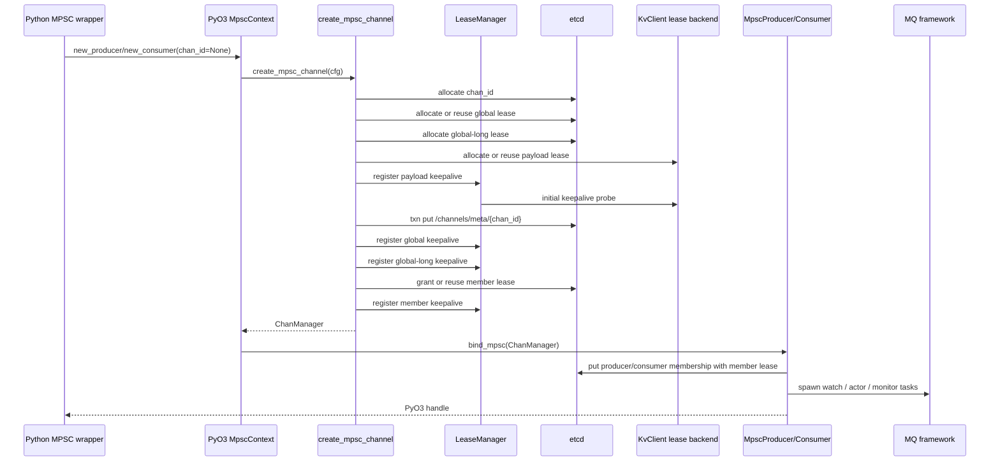
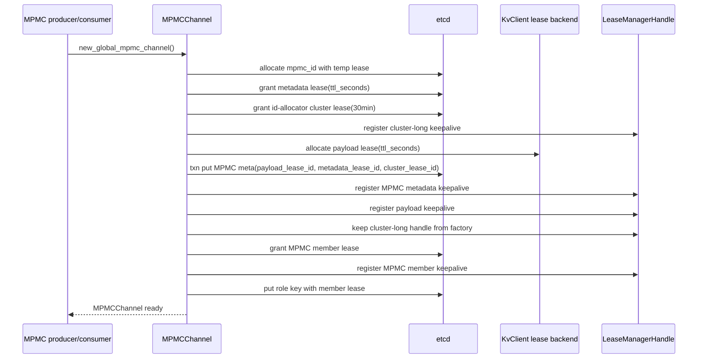
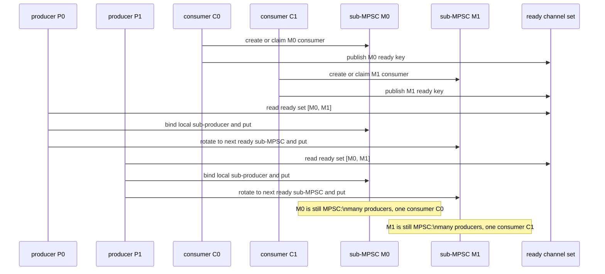
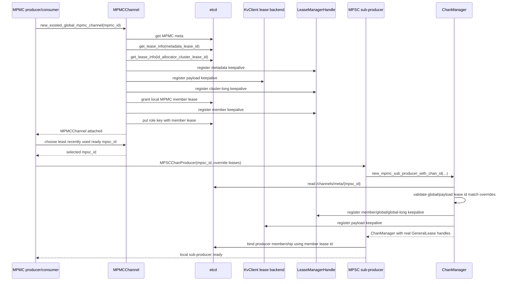
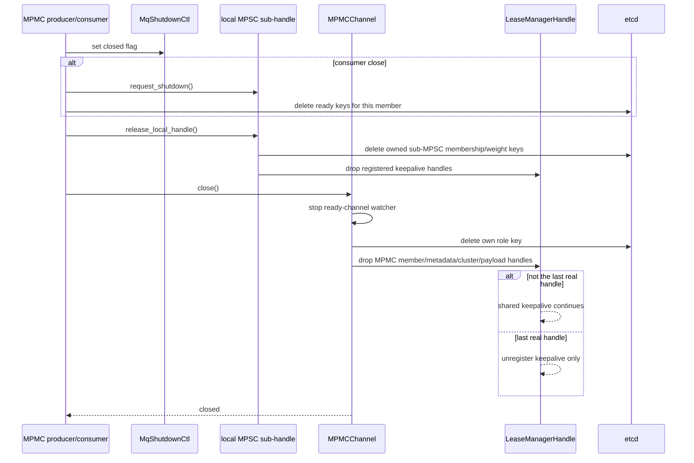

# MQ 设计 1 - 生命周期与租约设计

## 目标

当前 MQ lease 模型收敛为两条规则：

- 所有拿到 lease id 的本地 handle 都可以注册 keepalive，成为本进程内的 keepalive contributor。通用 lease handle 的 Drop 只释放本地 keepalive guard，不 delete，也不 revoke。
- 分布式元数据清理由语义 owner 在正常 close 路径显式 delete；进程崩溃、GC 未及时执行、网络断开等异常路径由 lease TTL 兜底回收。

因此 `GeneralLease::Borrowed` 已经不再需要。子 MPSC handle 不再是 id-only 借用者，而是和其他本地 handle 一样贡献 keepalive；它是否有权 delete 某些 key，由 MQ owner 语义决定，而不是由 lease handle 类型决定。

本文描述当前实现里的启动、绑定和关闭路径，范围限定在 MQ 控制面生命周期：

- Rust MQ：`fluxon_rs/fluxon_mq/src/{create.rs,manager.rs,producer.rs,consumer.rs,shutdown.rs}`
- 通用 lease 管理：`fluxon_rs/fluxon_util/src/lease_manager/*`
- PyO3 / Python 接入层：`fluxon_rs/fluxon_pyo3/src/mpsc.rs`、`fluxon_py/_api_ext_chan/{mpsc.py,mpmc.py}`

数据 payload 的编码、KV `put/get/delete` 细节和调度策略只在本文中作为生命周期的下游依赖出现。

## Lease 类型与生命周期

当前实现只有两种 lease backend：`etcd` 和 `KvClient`。`long lease` 是用途分类，当前由较长 TTL 的 `etcd lease` 承载，主要保护 ID allocator 相关状态。

| Lease | Backend | 典型字段 / key | 负责的生命周期 |
| --- | --- | --- | --- |
| MPSC global lease | `etcd` | `ChanGlobalMeta.global_lease_id`，`/channels/meta/{chan_id}` | MPSC channel 元数据生命周期。所有绑定该 channel 的本地 handle 都可贡献 keepalive；最后没有 contributor 后，metadata 由 TTL 自然过期。 |
| MPSC member lease | `etcd` | `ChanManager.member_lease`，`/channels/{chan_id}/producer/*` 或 `/consumer/*` | 单个 MPSC producer / consumer 成员生命周期。正常 close 显式 delete 自己的 membership key；异常退出由 TTL 兜底。 |
| MPSC global-long lease | `etcd long lease` | `ChanGlobalMeta.global_long_lease_id`，per-channel producer / consumer ID allocator | MPSC 内成员 ID allocator 生命周期，TTL 通常为 30 分钟。它保护 allocator counter 不随短生命周期 member lease 消失。 |
| MPSC payload lease | `KvClient` | `ChanGlobalMeta.payload_lease_id`，MQ payload KV key | MPSC payload 数据生命周期。producer 写 KV payload 时把该 lease id 作为 `PutOptionalArg::LeaseId` 传入；lease 丢失后后续 put / get 通过 KV 错误暴露。 |
| MPMC metadata lease | `etcd` | MPMC meta 里的 `metadata_lease_id`，`/mpmc_channels/{mpmc_id}/meta`、`/mpmc_channels/{mpmc_id}/next_channel_id` | MPMC channel 元数据生命周期。首次创建和 existing attach 都会注册 keepalive；最后没有 contributor 后，metadata 由 TTL 自然过期。 |
| MPMC member lease | `etcd` | `MPMCChannel.mpmc_member_lease`，role key、ready key、子 MPSC membership override | 单个 MPMC producer / consumer 成员生命周期。正常 close 显式 delete role / ready / 子 MPSC membership 等 owned key；异常退出由 TTL 兜底。 |
| MPMC id-allocator cluster lease | `etcd long lease` | MPMC meta 里的 `id_allocator_cluster_lease_id` | MPMC 成员 ID allocator 生命周期，TTL 通常为 30 分钟。所有顶层 MPMC member 都贡献 keepalive，避免 allocator counter 随单个成员退出而消失。 |
| MPMC shared payload lease | `KvClient` | MPMC meta 里的 `payload_lease_id` | 整个 MPMC 及其所有子 MPSC 共享的 payload 数据生命周期。首次创建、existing attach、子 MPSC handle 都可贡献 keepalive；新建或绑定子 MPSC 时必须复用该 id，避免同一个 MPMC 下 payload lease 分裂。 |

当前各入口对 shared lease 的处理如下：

| 入口 | 当前 shared lease 行为 |
| --- | --- |
| MPSC `create_mpsc_channel(chan_id=None)` | 创建或复用 global lease；创建 global-long lease；分配或复用 payload lease；三者都注册真实 keepalive 句柄。 |
| MPSC `ChanManager::new_with_chan_id` | 从 meta 读取 global / global-long / payload lease id，并注册三者的真实 keepalive 句柄；同时新建本地 member lease。 |
| MPMC `new_global_mpmc_channel` | 首次创建 MPMC meta、metadata lease、payload lease、id-allocator cluster lease，并注册三者的 shared keepalive。 |
| MPMC `new_existed_global_mpmc_channel` | 读取 meta，校验 metadata lease 和 id-allocator cluster lease 存活，读取 payload lease id，并注册 metadata / payload / cluster keepalive；同时创建本地 MPMC member lease。 |
| MPMC existing sub-producer bind | `ChanManager::new_mpmc_sub_producer_with_chan_id` 校验 MPSC meta 中 global / payload lease id 与 override 一致，然后注册 member / global / global-long / payload 四类真实 keepalive 句柄。 |

通用 `LeaseManager` 在同一进程内按 `(ttl_seconds, backend_uid, lease_id)` 复用同一个 registry entry。多个真实 `GeneralLease::Etcd` / `GeneralLease::KvClient` 句柄会共同保持这个 entry 存活；只有最后一个真实句柄释放后，entry 才会被移除并停止后续 keepalive。跨进程没有引用计数，所有进程都只是对同一个 backend lease id 发送 keepalive；全部停止后由 backend TTL 回收。

## 生命周期关系

下面这张图描述当前控制流的生命周期含义。读图时要区分两个概念：

- keepalive contributor：持有真实 `GeneralLease`，负责续租；Drop 只退出 contributor 集合。
- cleanup owner：拥有某些 MQ 元数据 key 的语义对象；正常 close 时显式 delete 自己的 key。

```mermaid
sequenceDiagram
    participant A as top-level member A
    participant Bm as top-level member B
    participant KC as keepalive contributors
    participant LL as long lease
    participant MG as metadata/global lease
    participant PL as payload lease
    participant MLA as member A lease
    participant MLB as member B lease
    participant Sub as local sub-MPSC handle
    participant KV as payload KV keys
    participant E as etcd / KvClient backend

    A->>LL: create/register shared long lease
    activate LL
    A->>MG: create/register shared metadata/global lease
    activate MG
    A->>PL: allocate/register shared payload lease
    activate PL
    A->>KC: contribute keepalive for LL/MG/PL
    KC->>LL: keepalive
    KC->>MG: keepalive
    KC->>PL: keepalive
    Note over KC,PL: creator is only the first publisher\nlater members register the same lease ids too

    A->>MLA: grant/register member A lease
    activate MLA
    A->>E: put role / membership / ready keys\nleased by member A lease\ncleanup owner = A

    Bm->>MG: read meta and shared lease ids
    Bm->>KC: contribute keepalive for same LL/MG/PL
    KC->>LL: keepalive same long lease id
    KC->>MG: keepalive same metadata/global lease id
    KC->>PL: keepalive same payload lease id
    Bm->>MLB: grant/register member B lease
    activate MLB
    Bm->>E: put role / membership / ready keys\nleased by member B lease\ncleanup owner = B
    Note over MLA,LL: member scopes are inside the shared channel lease envelope\nmember keys have explicit owner cleanup and TTL fallback

    Bm->>Sub: create local sub-MPSC handle
    activate Sub
    Sub->>KC: contribute keepalive for member/global/long/payload ids
    Sub->>KV: put / get payload with payload_lease_id
    Note over Sub,PL: sub handle contributes keepalive but does not own shared meta\nit only deletes keys it semantically owns
    Sub->>E: close: delete owned sub-MPSC membership/weight keys
    Sub-->>KC: drop local keepalive guards
    deactivate Sub

    A->>E: close: delete A-owned role/membership/ready keys
    A-->>KC: drop A keepalive guards
    deactivate MLA
    KC->>MG: keepalive continues if B or another handle remains
    KC->>PL: keepalive continues if B or another handle remains
    KC->>LL: keepalive continues if B or another handle remains
    Note over KC,MG: global/shared lease is not cleaned by one peer exit\ncleanup waits for all contributors to stop and TTL to expire

    Bm->>E: close: delete B-owned role/membership/ready keys
    Bm-->>KC: drop B keepalive guards
    deactivate MLB
    KC-->>MG: no contributors left; stop keepalive
    KC-->>PL: no contributors left; stop keepalive
    KC-->>LL: no contributors left; stop keepalive
    E-->>MG: expire global/meta lease after TTL\nthen delete channel meta
    deactivate MG
    E-->>PL: expire payload lease after TTL\nthen delete payload keys
    deactivate PL
    E-->>LL: expire allocator state after long TTL\nthen delete allocator counter
    deactivate LL
```

读图时可以按下面这组范围关系理解：

| 时间范围 | Keepalive contributor | Cleanup owner | 与其他范围的关系 |
| --- | --- | --- | --- |
| long lease 范围 | 所有拿到该 id 并注册的顶层 member / 本地 handle | 无逐 key owner；TTL 清理 allocator counter | 最外层 allocator guard；通常比 member、metadata/global、payload 的普通 TTL 更长。 |
| metadata / global lease 范围 | 所有绑定 channel 的顶层 member / 本地 handle | channel meta 自身不由单个 member delete；最后靠 TTL | 负责 channel meta 存在性；所有 contributor 停止后 TTL 到期清理。 |
| payload lease 范围 | 所有绑定 channel 的顶层 member / 本地 handle | payload key 由 payload lease 回收 | 与 metadata/global lease 同级，backend 是 `KvClient`，lease id 独立。 |
| member lease 范围 | 当前 producer / consumer 及其本地子 handle | 当前 producer / consumer member | 被 channel lease envelope 包含；正常 close 显式 delete owned key，异常退出靠 TTL。 |
| sub-MPSC handle 范围 | 本地子 handle 自己 | 只拥有自己创建/绑定的子 MPSC membership / weight 等 key | 通常被 MPMC member scope 包含；可以贡献 keepalive，但不拥有 shared meta。 |

## 核心角色

| 角色 | 当前职责 | 关键对象 |
| --- | --- | --- |
| `LeaseManager` | 统一注册 etcd lease 和 kvclient lease keepalive；按 TTL 驱动后台 keepalive actor | `register_lease_for_keepalive`、`LeaseEntry` |
| `GeneralLease` | 面向 MQ / PyO3 的 RAII keepalive contributor 句柄；Drop 只释放本地 registry guard | `Etcd`、`KvClient` |
| `ChanManager` | MPSC channel 的生命周期聚合点；持有 member / global / global-long / payload 四类真实 lease 句柄 | `member_lease`、`global_lease`、`global_long_lease`、`payload_lease` |
| `MpscProducer` / `MpscConsumer` | 绑定成员 key，启动 watch / actor / monitor，实际发送或消费消息 | Rust `bind_mpsc` |
| `MPMCChannel` | MPMC 外层控制面，管理 MPMC meta、成员、ready key、子 MPSC 列表和共享 payload lease | Python `MPMCChannel` |
| `ShutdownCtl` / `MqShutdownCtl` | 本地关闭信号；用于打断重试、预取、watch 和正在等待的操作 | Rust `ShutdownCtl`、Python `MqShutdownCtl` |

## Lease 所有权

`GeneralLease` 当前只有两类句柄：

| 句柄 | 持有什么 | Drop 后果 |
| --- | --- | --- |
| `GeneralLease::Etcd` | `lease_id`、`LeaseBackendUid`、keepalive registry entry guard | 释放当前句柄的 guard；若这是最后一个真实句柄，registry entry 被移除，后续 tick 不再 keepalive；不会 revoke。 |
| `GeneralLease::KvClient` | `lease_id`、`LeaseBackendUid`、keepalive registry entry guard | 释放当前句柄的 guard；若这是最后一个真实句柄，registry entry 被移除，后续 tick 不再调用 kvclient keepalive 回调。 |

`GeneralLease` 不再表达 cleanup 权限。cleanup 权限由 MQ 对象的语义 owner 决定：

- 独立 MPSC producer：正常 close 删除自己的 producer membership key 和 producer weight key。
- 独立 MPSC consumer：正常 close 删除自己的 consumer membership key。
- MPMC producer：正常 close 释放本地子 MPSC producer；这些子 handle 删除自己绑定的子 MPSC producer membership / weight key；`MPMCChannel.close()` 删除自己的 MPMC role key。
- MPMC consumer：正常 close 删除自己持有的 ready key，释放底层 MPSC consumer 以删除子 MPSC consumer membership key；`MPMCChannel.close()` 删除自己的 MPMC role key。
- Shared meta / payload / long lease：正常 close 只停止 keepalive contribution，不显式 delete shared meta 或 payload key；全部 contributor 停止后由 TTL 回收。

## MPSC 直接启动

直接 MPSC 指 `MPSCChanProducer` / `MPSCChanConsumer` 不经过 MPMC 外层创建或绑定 channel。新建 channel 时，Rust `create_mpsc_channel` 是生命周期入口。



已有 MPSC 的直接绑定走 `ChanManager::new_with_chan_id`：先读取 `/channels/meta/{chan_id}`，再恢复 global / global-long / payload keepalive，并为当前本地 manager 分配一个新的 member lease。

## MPMC 首次创建

MPMC 首次创建由 Python `MPMCChannel.new_global_mpmc_channel` 负责。它创建 MPMC 自身的 meta、共享 payload lease 和 id allocator cluster lease，然后构造 `MPMCChannel`。构造函数会注册共享 lease keepalive，并创建当前 member lease。



首次创建后，MPMC 外层会按角色继续创建或绑定子 MPSC：

- producer 只能创建第一个子 MPSC，之后在所有 ready 子 MPSC 之间轮转路由。
- consumer 在 create lock 下优先 claim 已有 unready 子 MPSC；没有可 claim 对象且活跃 consumer 数超过子 MPSC 数时才创建新子 MPSC。
- 新子 MPSC 的 MPSC meta / membership 会复用 MPMC 的 global / member / payload lease id，保持同一个 MPMC 生命周期边界；MPSC 自己的 `global-long` 仍按子 channel 新建，用来保护该子 MPSC 的 producer / consumer ID allocator。

MPMC 的数据面拓扑是“多个 MPSC 组成一个 MPMC”：每个 ready 子 MPSC 由一个 MPMC consumer claim，形成该 consumer 的消费入口；所有 MPMC producer 都可以按需绑定这些 ready 子 MPSC，并把消息轮转投递进去。因此一个 consumer 对应的是“所有 producer 写入它拥有的子 MPSC”，不是 producer 和 consumer 的固定一对一分片。



## MPMC 已有通道 Attach 与子 MPSC 绑定

已有 MPMC attach 读取 MPMC meta，并校验 metadata lease 和 id allocator cluster lease 仍存活。当前实现会注册 metadata / payload / cluster keepalive，使每个顶层 MPMC member 都成为 shared lease contributor；随后创建当前成员自己的 member lease 和 role key。



子 producer 本地对象需要：

- `member_lease_id`：写 producer membership key。
- `global_lease_id`：写 producer weight 等 channel 级状态。
- `payload_lease_id`：给 KV payload key 绑定 lease。
- `global_long_lease_id`：满足 `ChanManager` 字段完整性和现有访问模式。

这些 lease handle 都是真实 keepalive contributor。子 producer 的 cleanup 权限仍然只覆盖它自己拥有的子 MPSC membership / weight key，不覆盖 shared meta / payload / long lease。

## 关闭路径

### 直接 MPSC 关闭

直接 MPSC 的 `close()` 先设置本地关闭信号并等待本地 handle 释放，然后由 Python wrapper 显式删除当前 producer / consumer 拥有的 membership key。Rust handle 被释放后，`ChanManager` 随之 Drop，真实 `GeneralLease::Etcd` / `GeneralLease::KvClient` 句柄释放自己的 registry entry guard；如果这是最后一个真实句柄，entry 才会移除并停止后续 keepalive。`MpscContext.close()` 负责关闭 MQ framework 并等待框架内任务结束。

```mermaid
sequenceDiagram
    participant Py as Python MPSC wrapper
    participant S as ShutdownCtl
    participant H as PyO3 MPSC handle
    participant E as etcd
    participant CM as ChanManager
    participant GL as GeneralLease
    participant LE as LeaseEntry
    participant FW as MQ framework

    Py->>S: close()
    Py->>S: set closed flag
    Py->>H: shutdown_clone.close()
    S-->>H: actors/retry loops observe closed
    Py->>H: drop handle
    H->>CM: drop MpscProducer/Consumer
    Py->>E: delete owned membership/weight keys
    CM->>GL: drop member/global/global-long/payload handles
    GL->>LE: release registry entry guard
    alt not the last real handle
        LE-->>LE: entry stays alive; keepalive continues
    else last real handle
        LE-->>LE: unregister keepalive only
    end
    Py->>FW: MpscContext.close()
    FW-->>Py: shutdown joined
```

`release_local_handle()` 是较轻的关闭路径：它同样释放本地 Rust handle 和关闭信号，但跳过完整 `MpscContext.close()`。MPMC 外层在释放子 MPSC 本地句柄时使用这条路径；该路径仍会删除当前子 handle 拥有的 membership / weight key。

### MPMC 关闭

MPMC 关闭由外层 producer / consumer 发起。producer 关闭所有本地缓存的子 MPSC producer；consumer 会先唤醒底层 MPSC consumer，再删除 ready key。最后二者都会关闭 `MPMCChannel`，删除自己的 role key，并释放这个 `MPMCChannel` 实际登记过的 lease keepalive 句柄。



关闭后的分布式状态由 explicit delete 和 lease TTL 共同决定：

- member key 正常 close 时由 owner delete；异常退出或 delete 失败后由 member lease TTL 回收。
- MPMC meta 绑定 metadata lease，MPSC meta 绑定 global lease；本地关闭只停止 keepalive contribution，meta 通常按 TTL 自然过期。
- payload key 绑定 kvclient payload lease；payload lease 丢失后，后续 put / get 会通过 KV 错误暴露给上层，当前实现不会隐式重建。

## 约束与不变量

- `GeneralLease` 只表示 keepalive contributor，不表示 cleanup owner。
- Drop 永远不 revoke lease，也不 delete key。
- 正常 close 必须显式 delete 当前 owner 拥有的 key；delete 失败或异常退出由 TTL 兜底。
- 普通 MPSC 创建、直接绑定、MPMC attach、子 MPSC 绑定都使用真实 `Etcd` / `KvClient` 句柄。
- member lease 用于 TTL fallback；shared global / metadata / payload / long lease 用于 channel 级状态兜底回收。
- Python wrapper 的 `close()` 必须幂等；`shutdown_ctl.closed` 是本地停止信号，资源释放去重依赖 `_close_done` 或 `_closed_local`。

## 关键结论

`Borrowed` 分支已经被移除。当前设计把 lease handle 收缩为单一职责：贡献 keepalive。释放 lease handle 只表示“这个本地对象不再续租”，不表示“这个对象要清理分布式状态”。分布式状态是否删除，只看 MQ 对象是否是对应 key 的语义 owner；正常关闭显式 delete，异常关闭交给 TTL。
