# MQ 设计 1 - 生命周期与租约设计

## 先看整体：KV External 如何进入 MQ

Fluxon MQ 建立在 Fluxon KV 数据面之上。Fluxon KV 先由 owner 组成跨节点 P2P 数据通路，业务进程再以 zero-contribution 的 KV External 附着到本机 owner。一个正在运行的 KV External 对应一个 KV member；这个 member 可以作为 producer 或 consumer 加入某个消息队列。

Producer / consumer 是 KV member 在具体 MQ channel 中承担的角色，角色选择不会创建新的 KV member。它们复用 KV External 已经建立的本机访问路径和跨节点 P2P 数据面，不会再创建一套独立的 MQ 网络。

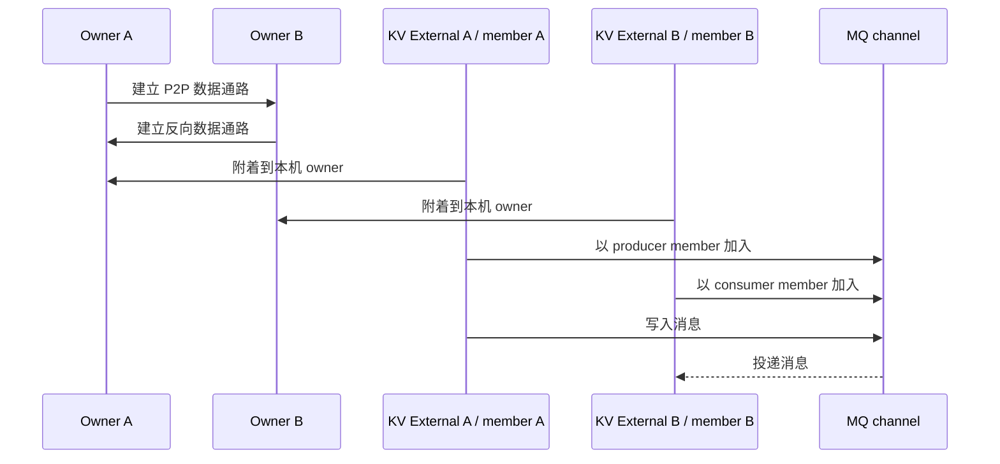

### 对象与身份

本文在系统叙事中统一把 KV External 称为 member。代码里的 `producer_idx`、`consumer_idx`、`mpmc_member_id` 是这个 member 加入具体 channel 后取得的 queue-scoped role id；它们没有引入新的 KV member。先区分运行实体和角色记录，后面的 member lease 才有明确对象。

| 层级 | 对象与标识 | 含义 |
| --- | --- | --- |
| KV 集群成员 | KV External，由 `instance_key` 注册 | 一个运行中的业务接入实例。它先附着到 owner，再使用 KV、RPC 或 MQ。 |
| MQ 角色记录 | MPSC 的 `producer_idx` / `consumer_idx`，或 MPMC 的 `mpmc_member_id` | KV member 以 producer / consumer 身份加入某个 channel 后形成的 queue-scoped membership。MPSC membership metadata 额外记录 `external_client_id`。 |
| 本地 MQ handle | Python / PyO3 producer、consumer 及其 `ChanManager` | 当前进程用于收发消息、运行 actor、watch 和 keepalive 的本地对象。 |
| MQ channel | MPSC channel 或由多个子 MPSC 组成的 MPMC channel | 多个 member 共同加入的共享消息队列，拥有 channel meta、payload 和 ID allocator 状态。 |

因此，本文叙事中的主语始终是：

> KV External 作为 member 进入 MQ，在某个 channel 中取得 producer 或 consumer 角色，并通过本地 handle 运行这个角色。

### 一条典型生命周期

1. **KV 数据面就绪**：master / owner 完成集群注册，owner 之间建立 P2P 数据通路。
2. **KV External 加入**：业务进程创建 KV External，取得自己的 KV member 身份，并附着到本机 owner。
3. **Member 加入 MQ**：该 member 创建或绑定一个 MQ channel，选择 producer 或 consumer 角色；MQ 控制面写入 queue-scoped membership。
4. **角色运行**：producer 写入消息，consumer 消费消息；本地 handle 运行 watch、actor 和重试任务，channel 级状态由所有使用者共享。
5. **Member 离开**：正常 `close()` 停止本地任务并清理当前角色拥有的 key；其他 member 仍可继续使用 channel。
6. **异常或所有 member 离开**：进程崩溃、持续断网，或所有 producer / consumer member 都离开后，如果在 TTL 窗口内没有 member 重新加入或继续续租，MQ 控制面状态和对应的 KV payload 数据会被回收。

在这个层级上，读者只需要先记住三种生命周期：

| 生命周期 | 创建时机 | 结束条件 |
| --- | --- | --- |
| KV External / KV member | 业务进程接入 Fluxon KV | 进程或 KV client 退出。 |
| MQ role membership | KV member 以 producer / consumer 加入 channel | 正常 close 主动离开；异常路径由 TTL 识别并清理。 |
| MQ channel shared state | 第一个 member 创建 channel | 所有 member 离开且有效 keepalive 停止后，普通 TTL 回收 MQ meta 和对应的 KV payload；allocator state 由 long lease 按更长 TTL 回收。 |

最重要的整体回收规则是：**一个 channel 的所有 member 持续不在超过 TTL 后，该 MQ 的控制面状态与绑定在 payload lease 上的 KV 数据都会被清理。** 实现上的判定信号是 metadata/global lease 与 payload lease 不再收到有效 keepalive，两类 backend 分别执行 TTL 回收，不保证跨 backend 原子删除。ID allocator 受 long lease 保护，可能在更晚的时间点清理。

### MPSC 与 MPMC

| Channel 类型 | Member 关系 | 当前实现 |
| --- | --- | --- |
| MPSC | 多个 producer member 向一个 consumer member 写入 | 一个 MPSC channel 直接承载这组 membership。 |
| MPMC | 多个 producer member 与多个 consumer member 共同加入 | 外层 MPMC 由多个子 MPSC 组成；每个 consumer claim 一个子 MPSC，所有 producer 可以向 ready 子 MPSC 投递。 |

到这里还不需要理解 lease。上面先回答了“谁加入 channel、以什么角色运行、什么时候离开”。Lease 是下一层实现机制，用来让分布式控制面判断这些对象是否仍然存活。

## Lease 在生命周期中解决什么问题

MQ 控制面需要回答三个问题：

1. 某个 producer / consumer member 是否仍然存活？
2. 某个 channel 的 shared meta、payload 和 allocator state 是否仍被使用？
3. 进程来不及执行 `close()` 时，谁负责清理遗留状态？

Lease 把这些对象的存活状态映射到 backend TTL：

| 生命周期对象 | 典型状态 | Lease 的作用 |
| --- | --- | --- |
| MQ role membership | role、ready、producer / consumer membership | Member lease 随本地角色存活；正常 close 尽力主动 delete，失败或异常退出由 TTL 回收。 |
| MQ channel shared state | metadata / global、payload、ID allocator | Shared / long lease 由实际使用 channel 的 handle 续租；没有 contributor 后按 TTL 回收。 |
| 本地 MQ handle | Rust / PyO3 / Python 对象 | 持有 keepalive guard。Drop 只停止当前 handle 的续租贡献。 |

当前 MQ lease 模型收敛为两条规则：

- 所有拿到 lease id 的本地 handle 都可以注册 keepalive；注册成功并保留 guard 后，它才成为本进程内的 keepalive contributor。`GeneralLease::Drop` 只释放本地 guard，不执行 delete 或 revoke。
- 有明确语义 owner 的 leased key 在正常 close 路径做一次尽力 delete。失败时记录 WARN 并继续释放本地 handle；shared key、进程崩溃、GC close 跳过 delete 和持续网络断开在最后一个有效 keepalive contributor 停止后由 lease TTL 兜底回收。

因此 `GeneralLease::Borrowed` 已经不再需要。子 MPSC handle 持有真实 `GeneralLease` 并贡献 keepalive。MQ owner 语义决定它是否有权 delete 某些 key；lease handle 类型只区分 backend 与 keepalive 实现。

## 本文范围

本文继续展开当前实现里的启动、绑定和关闭路径，范围限定在 MQ 控制面生命周期：

- Rust MQ：`fluxon_rs/fluxon_mq/src/{create.rs,manager.rs,producer.rs,consumer.rs,shutdown.rs}`
- 通用 lease 管理：`fluxon_rs/fluxon_util/src/lease_manager/*`
- PyO3 / Python 接入层：`fluxon_rs/fluxon_pyo3/src/mpsc.rs`、`fluxon_py/_api_ext_chan/{mpsc.py,mpmc.py}`

数据 payload 的编码、KV `put/get/delete` 细节、P2P 传输实现和调度策略只作为生命周期的下游依赖出现。

## Lease 设计结论

Lease 生命周期拆成两类职责。keepalive contributor 持有真实 lease handle 并维持 lease 存活；cleanup owner 在正常关闭时尽力删除自己独占的分布式 key。释放 lease handle 只停止当前本地对象的续租贡献。显式删除失败只影响回收时延，记录 WARN 后继续释放 handle；shared key 和异常路径在有效 keepalive 停止后由 backend TTL 兜底。

这个模型带来三条稳定结论：

1. `GeneralLease` 只表达 keepalive contribution，不表达 delete 或 revoke 权限。
2. 同一个 lease id 可以有多个进程内、跨进程 contributor；backend 不感知这些 contributor 的引用计数。
3. 子 MPSC handle 的公开 `close()` 尽力删除它自己拥有的 membership / weight，不删除 shared key；delete 失败不阻止本地关闭和 lease handle 释放，这个 cleanup ownership 与它持有哪一种 `GeneralLease` 无关。

后文先给出角色与 lease 的静态关系，再说明创建、运行、关闭三个阶段，最后按 MPSC、MPMC creator、MPMC existing attach 的复杂度递增顺序展开具体路径。

本文中的结论分为三层：

| 层级 | 本文采用的边界 |
| --- | --- |
| 稳定生命周期不变量 | `GeneralLease` Drop 不 revoke / delete；cleanup ownership 与 keepalive contribution 分离；公开 `close()` 保持单一入口和幂等语义。 |
| 当前实现 | MPMC creator 与 existing attach 持有不同的 shared lease 集合；所有 MPMC 子 MPSC membership 都复用 parent member lease。 |
| 专用路径 | Existing sub-producer 与 sub-consumer 统一使用 `new_mpmc_subchannel_with_chan_id` 校验 override 并复用 parent lease；独立 MPSC existing bind 继续使用 `new_with_chan_id`。 |

## Lease 实现角色

| 角色 | 当前职责 | 关键对象 |
| --- | --- | --- |
| `LeaseManager` | 统一注册 etcd lease 和 KvClient lease keepalive；按 TTL 驱动后台 keepalive actor | `register_lease_for_keepalive`、`LeaseEntry` |
| `LeaseBackendUid::KvClient` | 持有原生 Rust async allocate / keepalive operation；操作直接使用 Fluxon KV `Framework` | `KvAllocateLease`、`KvKeepaliveLease` |
| `GeneralLease` | 面向 MQ / PyO3 的 RAII keepalive contributor 句柄；Drop 只释放本地 registry guard | `Etcd`、`KvClient` |
| `ChanManager` | MPSC channel 的生命周期聚合点；持有 member、global、global-long、payload 四类真实 lease 句柄 | `member_lease`、`global_lease`、`global_long_lease`、`payload_lease` |
| `MpscProducer` / `MpscConsumer` | 绑定成员 key，启动 watch、actor、monitor，发送或消费消息 | Rust `bind_mpsc` |
| `MPMCChannel` | MPMC 外层控制面，管理 MPMC meta、成员、ready key、子 MPSC 列表，以及当前实例实际登记的 lease handle | Python `MPMCChannel` |
| `ShutdownCtl` / `MqShutdownCtl` | 本地关闭信号；打断重试、预取、watch 和正在等待的操作 | Rust `ShutdownCtl`、Python `MqShutdownCtl` |

### Fluxon KV lease 的语言边界

**当前实现边界**：`MpscContext` 从底层 `KvClient` 取得 Rust `Arc<Framework>`，并按 `(cluster, instance_key)` 构造 `LeaseBackendUid::KvClient`。Lease actor 直接 await `KvClientTrait::kv_allocate_lease` / `kv_keepalive_lease`；超时取消会直接 drop 这条 Rust future。不同 `KvClient` 实例不会因为 `cluster` 同名而错误复用已关闭 `Framework` 的 operation。

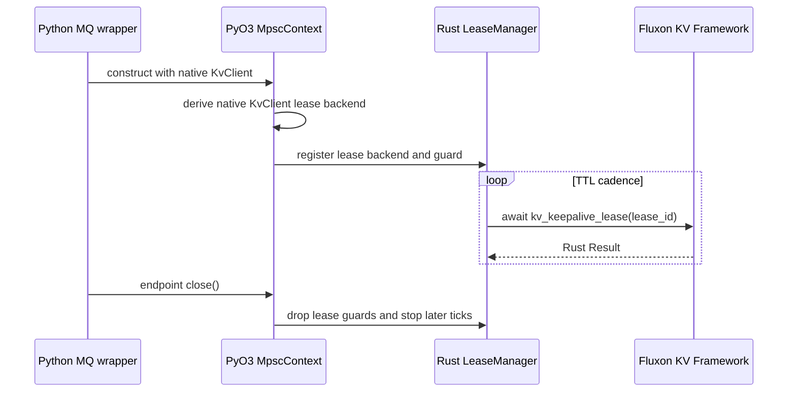

| 边界 | 规约 |
| --- | --- |
| Python 公共接口 | 只关闭 producer / consumer 并消费 `Result`；不创建 lease backend 或 keepalive callback。 |
| PyO3 接入 | 只在构造 / 注册时提取原生 `KvClient`；不把 Python callable 交给 keepalive actor。 |
| Rust actor | 直接 await Fluxon KV future；不得通过 Python thread pool 回调 KV wrapper。 |

## Lease 类型与生命周期

当前实现只有两种 lease backend：`etcd` 和 `KvClient`。`long lease` 是用途分类，由 TTL 固定为 30 分钟的 etcd lease 承载，主要保护 ID allocator 状态。

| Lease | Backend | 典型字段 / key | 当前生命周期 |
| --- | --- | --- | --- |
| MPSC global lease | `etcd` | `ChanGlobalMeta.global_lease_id`，`/channels/meta/{chan_id}` | MPSC channel 元数据生命周期。创建者、直接绑定者以及已注册该 id 的子 MPSC handle 都可以成为 contributor。 |
| MPSC member lease | `etcd` | `ChanManager.member_lease`，`/channels/{chan_id}/producer/*` 或 `/consumer/*` | 单个 MPSC producer / consumer membership 生命周期。直接 MPSC 和 MPMC 子通道都在正常 `close()` 中做一次尽力 delete，失败或异常退出由 TTL 兜底。 |
| MPSC global-long lease | `etcd` | `ChanGlobalMeta.global_long_lease_id`，per-channel producer / consumer ID allocator | 单个 MPSC 的 ID allocator 生命周期，当前 TTL 为 30 分钟。每个恢复该 channel 的 `ChanManager` 都注册该 id。 |
| MPSC payload lease | `KvClient` | `ChanGlobalMeta.payload_lease_id`，MQ payload KV key | MPSC payload 生命周期。producer 把该 id 传给 KV put；lease 丢失后由后续 KV 操作向上层返回错误。 |
| MPMC metadata lease | `etcd` | `metadata_lease_id`，`/mpmc_channels/{mpmc_id}/meta`、`next_channel_id` | MPMC creator 注册 keepalive；复用该 id 作为 MPSC global lease 的子 MPSC handle 也会贡献 keepalive。顶层 existing attach 本身当前不注册。 |
| MPMC member lease | `etcd` | `MPMCChannel.mpmc_member_lease`，role key、ready key 和子 MPSC membership | 单个 MPMC member 生命周期。role / ready / membership 正常关闭时做一次尽力 delete；失败或异常退出时由同一条 lease 回收。 |
| MPMC id-allocator cluster lease | `etcd` | `id_allocator_cluster_lease_id` | MPMC member ID allocator 生命周期，当前 TTL 为 30 分钟。当前只有 creator 保留其 keepalive handle；existing attach 只校验存活。 |
| MPMC shared payload lease | `KvClient` | MPMC meta 的 `payload_lease_id` | 整个 MPMC 及其子 MPSC 复用同一个 payload lease id。creator 和实际注册该 id 的子 MPSC handle 贡献 keepalive；顶层 existing attach 本身当前不注册。 |

各入口实际登记的 lease 如下：

| 入口 | 当前行为 |
| --- | --- |
| MPSC `create_mpsc_channel(chan_id=None)` | 创建或复用 global lease，创建 global-long lease，分配或复用 payload lease，并准备 member lease；四类 lease 都注册真实 handle。 |
| MPSC `ChanManager::new_with_chan_id` | 从 meta 恢复 global、global-long、payload lease，另行 grant 本地 member lease；四类 lease 都注册真实 handle。 |
| MPMC `new_global_mpmc_channel` | 创建 metadata、payload、id-allocator cluster lease，以 `keep_shared_mpmc_leases=True` 构造，并注册 shared lease 与本地 member lease。 |
| MPMC `new_existed_global_mpmc_channel` | 校验 metadata 与 id-allocator cluster lease，读取 payload lease id，以 `keep_shared_mpmc_leases=False` 构造；此时只注册本地 MPMC member lease。 |
| MPMC 新建子 MPSC | 复用 parent metadata/global、member、payload lease id，另建子 MPSC global-long lease；`create_mpsc_channel` 为四类 id 注册真实 handle。 |
| MPMC existing sub-MPSC bind | Producer 与 consumer 都使用 `new_mpmc_subchannel_with_chan_id`；校验 global / payload override，并注册 parent member、global、子 MPSC global-long、payload 四类 handle。 |

`LeaseManager` 在同一进程内按 `(ttl_seconds, backend_uid, lease_id)` 复用 registry entry。多个 `GeneralLease::Etcd` / `GeneralLease::KvClient` 句柄共同保持 entry 存活；最后一个 guard 释放后，entry 才会移除，后续 tick 不再 keepalive。跨进程没有引用计数，各进程独立向同一个 backend lease id 续租，全部停止后由 backend TTL 回收。

**当前实现边界**：顶层 MPMC existing attach 的 member 存活不等于 metadata、payload、id-allocator cluster lease 都在续租。绑定子 MPSC 后，子 handle 会为 metadata/global 与 payload 补充 contribution；id-allocator cluster lease 仍由 creator handle 维持。本文后续所有时序图都保留这一区分。

## Lease 生命周期阶段

所有 lease 路径都可以按三个阶段理解。静态表说明“有哪些 lease”，下面的阶段表说明“lease 如何流转”。

| 阶段 | Keepalive contributor | Cleanup owner | 失败结果 |
| --- | --- | --- | --- |
| 创建 / 绑定 | 分配或读取 lease id，调用 `register_lease_for_keepalive`，保留返回的 RAII guard | 创建或绑定自己负责的 key，并把 key 关联到明确的 lease id | 必需 lease 无法校验或首次 keepalive 失败时，当前入口返回错误；部分入口还会清理已确认失效的 stale meta。 |
| 运行 | 每个已注册的本地 guard 独立维持同一 registry entry；跨进程各自续租 | owner 只管理自己独占的 role、ready、membership、weight 等 key | 短暂 keepalive 失败由 actor 重试；持续失败超过 backend TTL 后，lease 与关联 key 过期。 |
| 关闭 | 本地 handle Drop，最后一个 guard 释放后 registry 停止后续 keepalive | 正常 close 对独占 leased key 做一次尽力 delete；shared key 等待最后一个 contributor 停止后由 TTL 回收 | 进程崩溃、GC 已释放 handle 或显式 delete 失败时，已绑定 lease 的 key 仍由 TTL 兜底。 |

## Lease 生命周期关系

下面先展示 shared lease 的总体规律，再加入 member lease 与子 MPSC。图中的 contributor 只代表已经成功注册并保留真实 handle 的对象。

### Shared lease：创建、复用与过期

这张图只展示 metadata/global、payload 或 long lease 的共同规律，不涉及 member key 的 owner 清理。

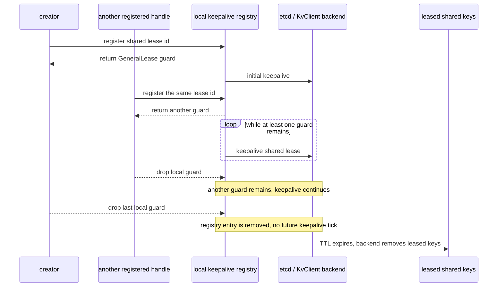

图中把 registry 折叠为一个参与者。同一进程内的 handle 共享 registry entry；不同进程各有自己的 registry，只共享 backend 中的 lease id。

对 MPMC 而言，creator 直接覆盖这条完整路径。existing attach 只有在后续子 MPSC handle 注册 metadata/global 或 payload id 后，才成为这些 shared lease 的 contributor；当前 existing attach 不注册 id-allocator cluster lease。

### Member lease 与子 MPSC

这张图加入 owner key 和子 MPSC member lease。新建与 existing 子 MPSC 都使用 parent member override，ready 与 membership 共享同一个异常回收边界。

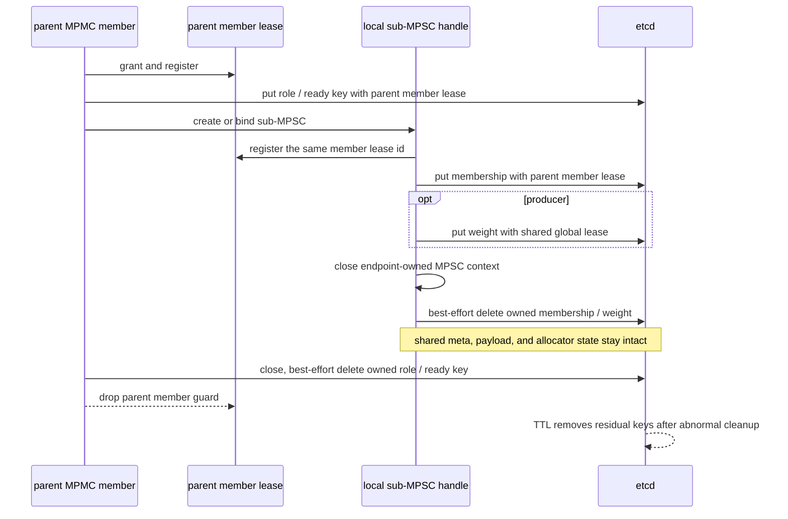

各时间范围的关系如下：

| 时间范围 | 已注册的 contributor | Cleanup owner | 结束条件 |
| --- | --- | --- | --- |
| MPSC global-long | 创建或恢复该 MPSC 的 `ChanManager` | 无逐 key close owner | 最后一个 handle 释放后，30 分钟 TTL 回收 allocator state。 |
| MPMC id-allocator cluster | 当前为 creator `MPMCChannel` | 无逐 key close owner | creator handle 释放后，30 分钟 TTL 回收；existing attach 当前不延长此范围。 |
| metadata / global | creator、直接 MPSC attach、已绑定并注册该 id 的子 MPSC handle | shared meta 无单个 member delete owner | 最后一个实际 contributor 停止后，由 TTL 删除 meta。 |
| payload | creator与已绑定并注册 payload id 的 MPSC handle | payload key 由 payload lease 统一回收 | 最后一个实际 contributor 停止后，由 KvClient lease TTL 回收。 |
| member | 当前 MPSC / MPMC member，以及复用该 id 的子 handle | 当前 member | 正常 close 尽力删除 owner key；失败或剩余 leased key 在最后一个 contributor 停止后按 TTL 回收。 |

## Lease 所有权

`GeneralLease` 当前只有两类句柄：

| 句柄 | 持有什么 | Drop 后果 |
| --- | --- | --- |
| `GeneralLease::Etcd` | `lease_id`、`LeaseBackendUid`、keepalive registry entry guard | 释放当前句柄的 guard；若这是最后一个真实句柄，registry entry 被移除，后续 tick 不再 keepalive；不会 revoke。 |
| `GeneralLease::KvClient` | `lease_id`、`LeaseBackendUid`、keepalive registry entry guard | 释放当前句柄的 guard；若这是最后一个真实句柄，registry entry 被移除，后续 tick 不再执行原生 KvClient keepalive operation。 |

`GeneralLease` 不再表达 cleanup 权限。cleanup 权限由 MQ 对象的语义 owner 决定：

- 独立 MPSC producer：正常 close 尽力删除自己的 producer membership key 和 producer weight key。
- 独立 MPSC consumer：正常 close 尽力删除自己的 consumer membership key。
- MPMC producer：每个子 MPSC 正常 close 时关闭自己的 `MpscContext`，尽力删除 producer membership / weight；`MPMCChannel.close()` 再尽力删除当前 MPMC member 的 role key。Producer membership 使用 parent member lease，weight 使用 shared/global lease。
- MPMC consumer：子 MPSC 正常 close 时关闭自己的 `MpscContext` 并尽力删除 consumer membership；确认 membership 删除后，外层再尽力删除当前 member 的 ready key，`MPMCChannel.close()` 最后尽力删除 role key。membership 未确认删除时保留 ready key，让二者随同一条 parent member lease 一起过期，避免提前 handoff。
- Shared meta / payload / long lease：close 只释放当前实例实际持有的 keepalive guard，不显式 delete shared meta、payload key 或 allocator state；最后一个 contributor 停止后由 TTL 回收。

### 设计权衡

#### 子 MPSC 为什么复用同一条 close 路径

Parent MPMC 身份只改变 membership 和 shared lease 的绑定来源，不改变本地资源所有权。每个子 MPSC handle 仍持有自己的 `MpscContext`、数据路径 handle 和 role-specific membership，因此正常 `close()` 由它自己完成这些资源的关闭与删除。

| 资源 | 正常关闭责任 | 异常路径 |
| --- | --- | --- |
| 子 MPSC 本地 context / handle | 子 MPSC `close()` | 进程退出时尝试 GC 关闭 |
| 子 MPSC membership / producer weight | 子 MPSC `close()` 做一次尽力删除 | 对应 member / global lease TTL |
| Shared meta / payload / allocator state | 不由单个子 handle 删除 | 最后一个 contributor 停止后由 TTL 回收 |

尚未发布到 parent 的临时子通道是创建事务回滚对象。内部 `_rollback_unpublished_channel()` 先复用公共 `close()` 路径，再删除未发布 channel 的 channel-scoped 状态；该回滚方法不是第二个公开关闭入口。

#### Shared meta 为什么不由单个 member delete

单个 member close 时，其他 member 或子 MPSC handle 可能仍在使用 channel meta 与 payload lease。让任意 member 删除 shared meta 会提前终止仍然有效的 peer。当前实现让各实例只释放自己的 contribution，shared key 在最后一个实际 contributor 停止后按 TTL 统一回收。代价是最后一个正常 close 与 backend 实际删除之间存在最长一个 TTL 的延迟。

## MPSC 直接启动

**复杂度：基础。** 直接 MPSC 不经过 MPMC 外层，单个 `ChanManager` 明确持有 member、global、global-long、payload 四类 lease。新建 channel 时，Rust `create_mpsc_channel` 是生命周期入口。

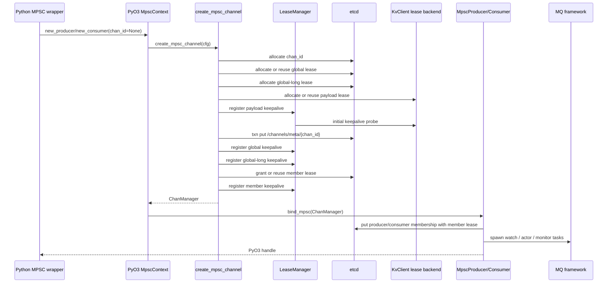

已有 MPSC 的直接绑定走 `ChanManager::new_with_chan_id`：先读取 `/channels/meta/{chan_id}`，再恢复 global、global-long、payload keepalive，并为当前本地 manager 分配一个新的 member lease。global 或 global-long 注册若确认 lease 已过期，当前实现会删除 stale MPSC meta 后返回错误；payload lease 或其他注册错误直接向上返回。

## MPMC 首次创建

**复杂度：中等。** MPMC creator 在 MPSC 之上增加 metadata lease、shared payload lease 和 id-allocator cluster lease，并负责发布第一个子 MPSC。

MPMC 首次创建由 Python `MPMCChannel.new_global_mpmc_channel` 负责。它创建 MPMC meta 与三类 shared lease，然后以 `keep_shared_mpmc_leases=True` 构造 `MPMCChannel`。构造函数注册 shared lease keepalive，并创建当前 member lease。

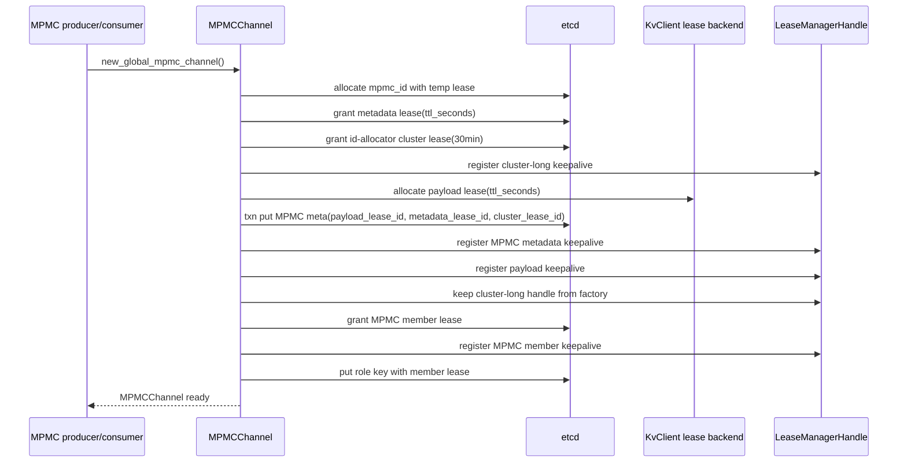

首次创建后，MPMC 外层会按角色继续创建或绑定子 MPSC：

- producer 只能创建第一个子 MPSC，之后在所有 ready 子 MPSC 之间轮转路由。
- consumer 在 create lock 下优先 claim 已有 unready 子 MPSC；没有可 claim 对象且活跃 consumer 数超过子 MPSC 数时才创建新子 MPSC。
- 新子 MPSC 的 meta、membership、payload 分别复用 MPMC metadata/global、member、payload lease id；子 MPSC 的 `global-long` 仍按子 channel 新建，用来保护该子 MPSC 的 producer / consumer ID allocator。

MPMC 的数据面拓扑是“多个 MPSC 组成一个 MPMC”：每个 ready 子 MPSC 由一个 MPMC consumer claim，形成该 consumer 的消费入口；所有 MPMC producer 都可以按需绑定这些 ready 子 MPSC，并把消息轮转投递进去。一个 consumer 拥有的子 MPSC 会接收所有 producer 的写入，拓扑中没有 producer 与 consumer 的固定一对一分片。

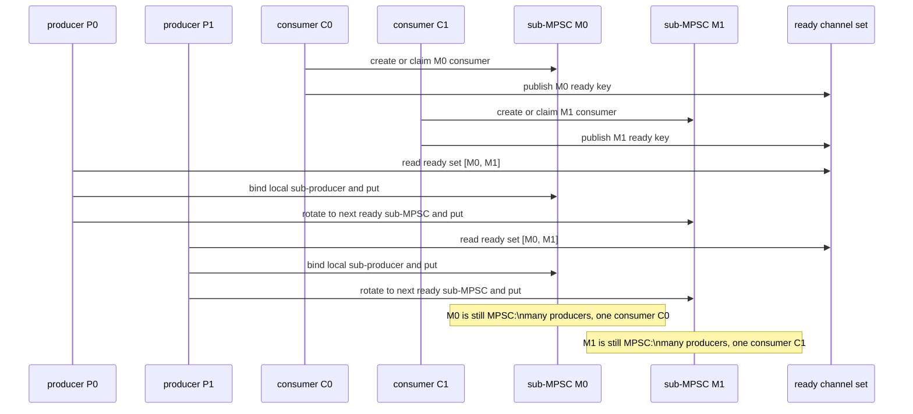

## MPMC 已有通道 Attach 与子 MPSC 绑定

**复杂度：最高。** 这条路径需要区分顶层 MPMC attach、MPMC existing subchannel 绑定和独立 MPSC existing bind。MPMC sub-producer 与 sub-consumer 使用同一条专用 loader 和 lease 集合。

顶层 attach 读取 MPMC meta，校验 metadata lease 和 id-allocator cluster lease 仍存活，并检查 payload lease id 的结构有效性。它随后以 `keep_shared_mpmc_leases=False` 构造 `MPMCChannel`，只为当前 MPMC member 创建 member lease 与 role key。payload lease 的首次 keepalive 校验推迟到实际子 MPSC handle 注册该 id 时发生。

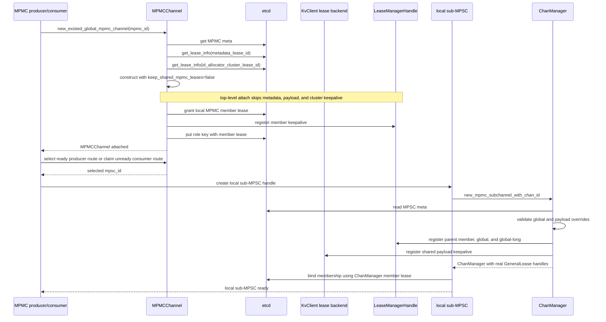

Existing MPMC 子 MPSC 绑定需要四类 id：

- `member_lease_id`：写 producer 或 consumer membership key。
- `global_lease_id`：写 producer weight 等 channel 级状态。
- `payload_lease_id`：给 KV payload key 绑定 lease。
- `global_long_lease_id`：从 MPSC meta 恢复，用于该子 MPSC 的 producer / consumer ID allocator。

这些 id 都对应真实 `GeneralLease` handle。Producer 与 consumer 都通过 `new_mpmc_subchannel_with_chan_id` 复用 parent member lease；global、global-long、payload 仍从 MPSC meta 校验或恢复并注册。

两类子 handle 都复用 MPSC 的唯一公开 `close()` 路径：关闭自己的 `MpscContext`，对 membership 做一次尽力删除，producer 同时尽力删除自己的 weight。子 handle 不删除 shared meta、payload key 或 allocator state；这些 shared 状态仍由实际 contributor 和 TTL 决定生命周期。

## 关闭路径

### 关闭所有权与 KV 父生命周期

**稳定结论**：公开 producer / consumer `close()` 是 MQ 完整关闭的唯一实现入口。`KvClient.close()` 关闭 backend 前，通过 `KvClient.register_child_close()` 调用已注册 endpoint 的同一个公开 `close()` 并消费其 `Result`。这条父级联动用于保证遗漏 endpoint 时的关闭顺序，不改变用户先关闭所有 endpoint、再关闭 `KvClient` 的公开契约。

注册范围按公开所有权收敛：

| 对象 | 是否向 `KvClient` 注册 | 原因 |
| --- | --- | --- |
| 直接 MPSC producer / consumer | 是 | 它是用户可见 endpoint，自己拥有 `MpscContext`、membership 和 Python 关闭状态。 |
| 外层 MPMC producer / consumer | 是 | 外层拥有子 MPSC、ready / role cleanup 和 `MPMCChannel`。 |
| MPMC 子 MPSC | 否 | 它由外层 MPMC 的公开 `close()` 关闭，再注册会形成重复父级入口。 |

`KvClient` 只保存公开 `close()` 绑定方法的弱引用，endpoint 保存 `KvCloseRegistration`。Endpoint 完成 Rust teardown 与本次分布式 key 清理尝试后才 unregister；delete 失败仍按既有契约交给 TTL 兜底。这组弱引用注册不会形成 `KvClient → endpoint → KvClient` 强引用环。

构造与父级关闭使用同一条线性化边界。Endpoint 在进入可阻塞的 etcd / Rust 构造前先注册 callback；`KvClient.close()` 开始后不再接受新注册。已注册但仍在构造的 endpoint 用 construction-completion event 让 callback 等待构造返回或失败，然后调用其 partial-safe `close()`。因此 native KV teardown 不会越过已获得构造权的 MQ endpoint。

关闭状态分层如下：

| 状态 | 权威范围 | 不能推导的结论 |
| --- | --- | --- |
| Python `shutdown_ctl.closed` | 已发布操作停止信号，新 put / get / bind 应快速失败 | 不代表 Rust framework、membership 或 ready key 已清理。 |
| Python `_closed_local` | 当前 wrapper 已发布 Rust handle shutdown 并开始 detach | 不代表 `MpscContext.close()` 已返回。 |
| Rust `MqShutdownRequest` / `MqShutdownCompletion` | 固定 shutdown worker 是否已接收请求，以及 `mq_framework.shutdown()` 的最终 `Result` | 不代表 Python 的 membership / ready cleanup 已完成。 |
| Python `_close_done` | 公开 endpoint `close()` 的所有必需阶段已完成 | 这是该 endpoint 对外返回幂等成功的判定位。 |
| KV child-close registry | KV 是否仍接受新 child，以及 parent close 需等待哪些公开 endpoint | 它不直接操作 MQ 私有 context 或分布式 key。 |

Rust 仍保留一个固定 MQ shutdown worker。该 worker 持有 `mq_framework`，把并发 close request 线性化为一次 `Framework::shutdown()`，并通过独立 completion channel 发布最终结果。它不等待 KV shutdown。旧的 `pyo3.kv_shutdown_bridge_to_mq_framework` task 已删除，KV 父生命周期直接调用 Python 公开 endpoint `close()`。

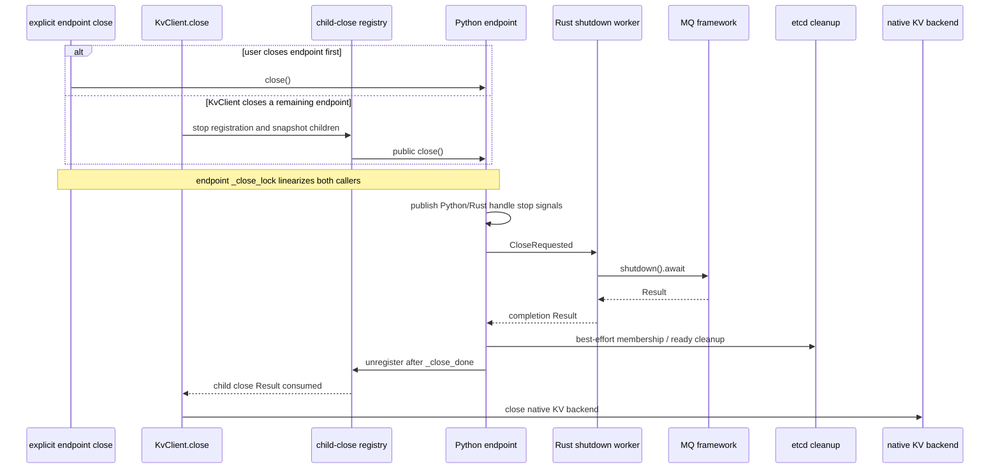

Child callback 返回错误时，`KvClient.close()` 不继续关闭 native backend，并原样返回该 `ApiError`。Registry 保持 closing，拒绝新 endpoint；后续再次调用 `KvClient.close()` 会重试仍在 registry 中的 child。

### MPSC endpoint 关闭

#### 正常路径

MPSC producer / consumer 只有一条 `close()` 路径，直接 MPSC 和 MPMC 子通道共用该路径。它先发布关闭信号并释放 PyO3 handle，再调用 endpoint 持有的 `MpscContext.close()` 关闭 MQ framework 并等待内部任务结束。之后，Python wrapper 通过 `_best_effort_delete_leased_etcd_state()` 对 producer membership / weight 或 consumer membership 做一次 delete pass；失败记录 WARN。Rust handle 释放时，`ChanManager` 与它持有的 `GeneralLease` guard 随之释放。

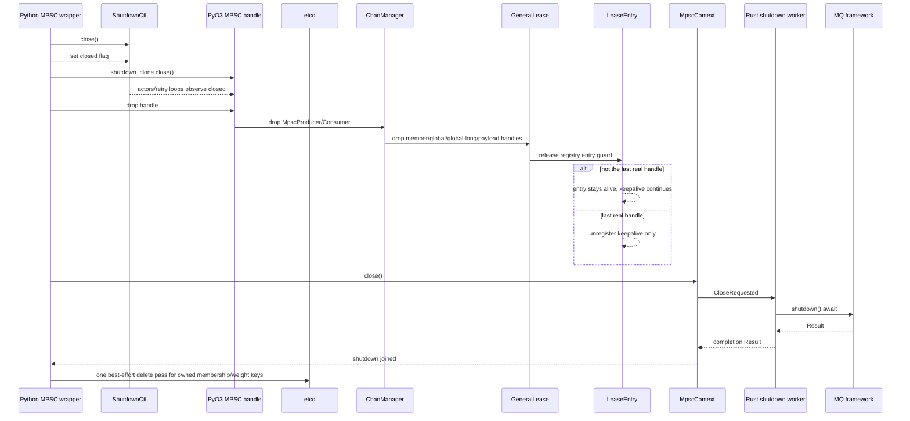

Parent MPMC 身份不会改变这条本地关闭契约。外层 MPMC producer / consumer 只调用子 MPSC 的公开 `close()`，不访问 `MpscContext` 或原始 shutdown controller。未发布子通道的 `_rollback_unpublished_channel()` 在标准 `close()` 后额外删除未发布 channel 状态，不形成第二个公开关闭入口。

#### 异常路径

- **进程退出或 GC 关闭**：`__del__` 会尽力发布关闭并释放 handle；GC 标记存在时跳过显式 distributed-key delete，剩余 key 依赖 lease TTL。对象尚未被 GC 且 keepalive 仍成功时，lease 会继续存活，TTL 回收尚未开始。
- **`MpscContext.close()` 失败**：对外返回 `ResourceCleanupError`，并保留 context，下一次调用同一公开 `close()` 时可重试。调用方不需要、也不应自行调用内部 context。
- **显式 delete 失败**：正常 `close()` 只做一次 leased-key delete pass，当前单次 RPC timeout 为 1 秒；失败时记录 WARN、继续释放 keepalive handle，member 或 global lease TTL 负责最终回收。未发布 channel 的事务回滚仍使用 `_delete_and_verify_owned_etcd_state()` 做最多 3 次、单次 5 秒的删除与读取校验，失败时返回 `ResourceCleanupError`。
- **持续网络中断**：本地 actor 无法成功 keepalive。若中断跨过 backend TTL，lease 与关联 key 过期；短于 TTL 的中断不等同于 lease 已回收。

### MPMC 关闭

#### 正常路径

MPMC 关闭由外层 producer / consumer 发起。Producer 关闭所有本地缓存的子 MPSC producer；consumer 先唤醒并关闭底层 MPSC consumer，membership 已确认删除时再尽力删除 ready key。每个子 MPSC 的公开 `close()` 内部必须关闭其 `MpscContext`，并对 role-specific membership / weight 做一次尽力删除。最后二者都关闭 `MPMCChannel`，尽力删除自己的 role key，并释放这个实例实际登记过的 keepalive handle。

懒绑定 producer 时，MPSC 层在进入 Rust bind 前把自己的构造取消回调注册到 parent shutdown controller。MPMC 只调用外层 `close()`；关闭信号由 MPSC 层转换成 Rust bind 取消，不向 MPMC 暴露 `MpscContext` 或原始 shutdown controller。

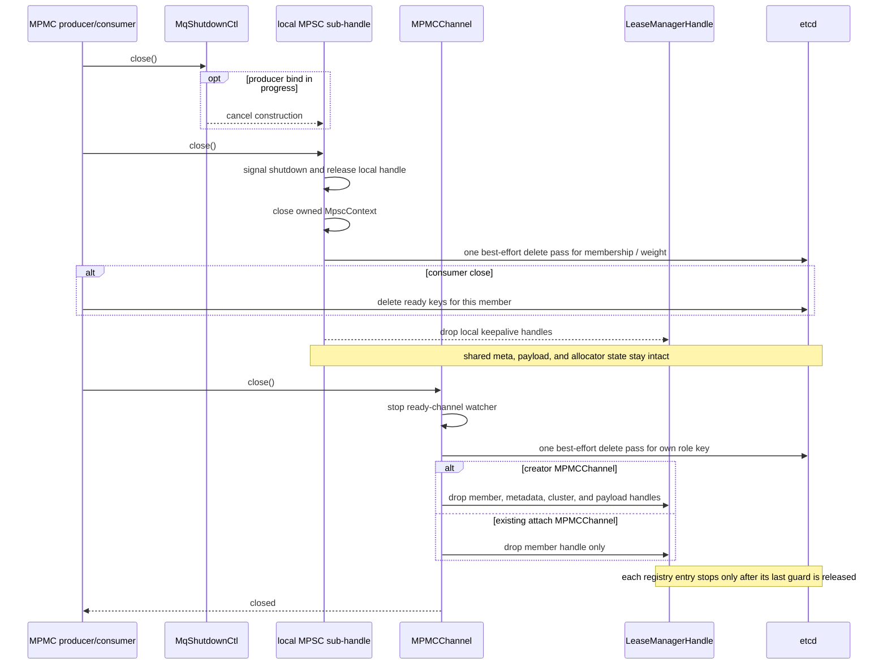

#### 异常路径

- **子 MPSC 本地关闭失败**：`MpscContext` 或本地任务未能停止时，外层 producer / consumer 直接返回子 handle 的 `ApiError`，不把外层实例标记为已完成关闭；后续调用同一公开 `close()` 可重试。leased-key delete 失败只记录 WARN，不进入该硬失败分支。
- **Ready key 删除失败**：consumer 记录 WARN 并继续关闭 `MPMCChannel`、释放 member lease handle；ready key 由 MPMC member lease TTL 回收。若底层 membership 删除未确认，外层不主动删除 ready key，避免在旧 membership 仍可见时提前 handoff。
- **Role key 删除失败**：`MPMCChannel.close()` 记录 WARN，继续释放 member 和其他实际持有的 lease handle；member lease TTL 负责兜底。
- **进程崩溃或持续断网**：本地 handle 不再产生有效 keepalive；每个 key 按自己实际绑定的 member、global、metadata 或 payload lease 到期。
- **Payload lease 丢失**：后续 put / get 通过 KV 错误暴露给上层，当前实现不隐式创建新 lease 或重建 channel。

关闭后各类状态的去向如下：

| 分布式状态 | 正常路径 | 异常或 delete 失败 |
| --- | --- | --- |
| MPMC role / ready key | owner 做一次尽力 delete | MPMC member lease TTL |
| 子 MPSC membership | 子 handle 做一次尽力 delete | parent member lease TTL |
| 子 MPSC producer weight | 子 producer 做一次尽力 delete | shared/global lease TTL |
| MPMC / MPSC meta | 实例只释放自己的 contribution | metadata/global lease TTL |
| Payload key | 不逐 key 做 channel-close 清理 | KvClient payload lease TTL |
| ID allocator state | 不在 member close 中删除 | 对应 30 分钟 long lease TTL |

## 实现检查清单

实现或 review 生命周期变更时逐项确认：

- [ ] `GeneralLease::Drop` 只释放本地 registry guard，没有 revoke lease 或 delete key。
- [ ] 每次 keepalive 注册都保留返回的真实 handle；只保存 lease id 不构成 contribution。
- [ ] 每个分布式 key 都能明确回答“绑定哪个 lease”和“正常 close 由谁 delete”。
- [ ] 直接 MPSC 和 MPMC 子通道复用同一条公开 `close()`；该路径关闭 endpoint 持有的 `MpscContext`，并删除当前 owner 的 membership / weight。
- [ ] MPMC creator 与 existing attach 的 `keep_shared_mpmc_leases` 分支经过显式评估，未把 member 存活误当成所有 shared lease 都存活。
- [ ] Existing sub-producer 与 sub-consumer 都经过 `new_mpmc_subchannel_with_chan_id`，并校验 membership 与 ready 共享 parent member lease。
- [ ] Python `close()` 保持幂等；`shutdown_ctl.closed` 只负责停止信号，`_closed_local` 表示开始 detach，只有 `_close_done` 表示公开 endpoint 关闭完成。
- [ ] 直接 MPSC 和外层 MPMC 向 `KvClient` 注册弱引用 child-close callback；MPMC 子 MPSC 由外层所有，不重复注册。
- [ ] Endpoint 在可阻塞构造前完成 child-close 注册；构造与 `KvClient.close()` 并发时，parent 等待 construction-completion event 后再调用 partial-safe `close()`。
- [ ] `KvClient.close()` 在 native backend 关闭前消费所有 child `Result`；任一强错误都阻止 backend teardown 并保留可重试 child registration。
- [ ] Rust shutdown worker 只等待 MQ close control channel 并发布 completion；没有只等待 KV shutdown 的 per-context bridge task。
- [ ] leased-key delete 失败时有 WARN、handle 释放与 TTL fallback 测试；本地 teardown、首次 keepalive 或 lease 校验失败仍走强错误路径；没有隐式重建 payload lease 或 channel。

## 关键结论

Fluxon MQ 的生命周期从 KV External 开始：一个 KV External 是一个 KV member，这个 member 以 producer 或 consumer 角色加入具体 channel。Channel、queue-scoped role membership 和本地 handle 是三个不同的生命周期对象。

`GeneralLease::Borrowed` 已经被移除。当前 lease handle 的单一职责是贡献 keepalive；释放 handle 表示当前本地对象停止续租。具有 cleanup ownership 的 MQ 对象在正常关闭时尽力 delete 自己的 leased key；失败记录 WARN，shared key 与异常路径由 TTL 回收。

Contributor 范围必须按实际注册路径判断。当前 MPMC creator 持有 shared lease handle，顶层 existing attach 只持有 member handle；后续子 MPSC handle 可以为 metadata/global 与 payload lease 增加 contribution。这个实现边界不能简化为“所有顶层 member 都保持所有 shared lease 存活”。

KV 父生命周期联动不绕过 Python endpoint。直接 MPSC 与外层 MPMC 注册各自的公开 `close()`；`KvClient.close()` 先等待这些 endpoint 完成 Rust shutdown、membership / ready cleanup 和 Python 状态收敛，然后关闭 native KV backend。Rust 固定 shutdown worker 只负责线性化 MQ framework teardown，不再为每个 context 注册 KV shutdown 等待 task。

## 代码索引

| 路径 | 入口 / 类型 | 对应职责 |
| --- | --- | --- |
| `fluxon_rs/fluxon_util/src/lease_manager/lease_backend_uid.rs` | `LeaseBackendUid::KvClient`、`KvAllocateLease`、`KvKeepaliveLease` | 原生 async Fluxon KV lease backend 及其取消边界。 |
| `fluxon_rs/fluxon_util/src/lease_manager/lease_handle.rs` | `GeneralLease`、`LeaseManager::register_lease_for_keepalive` | 通用 RAII handle 与注册入口。 |
| `fluxon_rs/fluxon_util/src/lease_manager/lifecycle.rs` | `register_lease_for_keepalive`、`LeaseEntry::drop` | Registry 复用、首次 keepalive、最后一个 guard 释放后的本地注销。 |
| `fluxon_rs/fluxon_mq/src/manager.rs` | `ChanGlobalMeta`、`ChanMemberMeta`、`ChanManager` | Channel meta、queue-scoped member identity 与四类 lease handle 的聚合对象。 |
| `fluxon_rs/fluxon_mq/src/create.rs` | `create_mpsc_channel`、`ChanManager::new_with_chan_id`、`new_mpmc_subchannel_with_chan_id` | MPSC 新建、独立 MPSC existing bind、MPMC 子通道 existing bind。 |
| `fluxon_rs/fluxon_mq/src/producer.rs` | `MpscProducer::bind_mpsc` | Producer membership、`external_client_id`、weight 与 lease 绑定。 |
| `fluxon_rs/fluxon_mq/src/consumer.rs` | `MpscConsumer::bind_mpsc` | Consumer membership、`external_client_id`、ID allocator 与运行 actor。 |
| `fluxon_rs/fluxon_mq/src/shutdown.rs` | `ShutdownCtl` | Rust actor 与等待操作的关闭信号。 |
| `fluxon_rs/fluxon_pyo3/src/lib.rs`、`mpsc.rs` | `new_fluxon_kv_lease_context`、`MpscContext::new_producer`、`new_consumer`、`close` | 从原生 KV framework 构造 lease backend，承接 Python 到 Rust 的创建 / 绑定分支和 MQ framework 关闭。 |
| `fluxon_py/kvclient/kvclient_interface.py` | `KvClient.register_child_close`、`KvCloseRegistration` | 线性化 child 注册与 parent close，弱引用保存公开 endpoint `close()`。 |
| `fluxon_py/kvclient/fluxon.py`、`mooncake.py` | `close` | 先调用并消费 registered child `close()`，全部成功后再关闭 native backend。 |
| `fluxon_py/_api_ext_chan/mq_lifecycle.py` | `publish_mq_construction`、`MqShutdownCtl` | 发布 endpoint 构造完成事件，以及管理 Python 操作停止信号。 |
| `fluxon_py/_api_ext_chan/mpsc.py` | `MPSCChanProducer.close`、`MPSCChanConsumer.close`、`_close_owned_mpsc_context`、`_best_effort_delete_leased_etcd_state`、`_delete_and_verify_owned_etcd_state` | 直接 MPSC / MPMC 子通道的统一关闭路径，以及 best-effort leased-key 清理、严格回滚和 GC 关闭语义。 |
| `fluxon_py/_api_ext_chan/mpmc.py` | `MPMCChannel.new_global_mpmc_channel`、`new_existed_global_mpmc_channel`、`MPMCChannel.close` | MPMC creator / attach、shared handle 选择、member 与 role 生命周期。 |
| `fluxon_py/_api_ext_chan/mpmc.py` | `_best_effort_delete_ready_keys_for_member`、`MPMCChanProducer.close`、`MPMCChanConsumer.close` | Ready key 单次尽力删除、membership/ready handoff 顺序与外层 MPMC 关闭。 |

## 常见问题

### KV member 与 MQ member id 是同一个标识吗？

这是两个层级的标识。KV External 的 `instance_key` / KV member identity 标识运行中的业务接入实例；`producer_idx`、`consumer_idx`、`mpmc_member_id` 标识它在某个 MQ channel 中的 queue-scoped role。当前 MPSC producer / consumer membership metadata 还记录 `external_client_id`，用于追溯对应的 KV member。

### 所有 contributor 都停止后，owner 还没 delete 会怎样？

Backend 在 TTL 到期后使 lease 失效，并删除绑定到该 lease 的 key。正常 close 的单次尽力 delete 用于缩短清理延迟；TTL 仍是 delete 失败、GC 和崩溃路径的最终保障。

### 子 MPSC membership 由谁回收？

正常路径由子 MPSC 的公开 `close()` 做一次尽力删除。delete 失败或异常退出时，新建与 existing 子 MPSC 的 membership 都由 parent MPMC member lease TTL 回收。

### 顶层 MPMC existing attach 会保持所有 shared lease 存活吗？

不会。当前 `new_existed_global_mpmc_channel` 以 `keep_shared_mpmc_leases=False` 构造，只注册本地 MPMC member lease。后续子 MPSC handle 会注册 metadata/global 与 payload lease；id-allocator cluster lease 仍由 creator handle 维持。

### Drop `GeneralLease` 会立即 revoke backend lease 吗？

不会。Drop 释放本地 guard；最后一个 guard 释放后，本地 registry 停止后续 keepalive。Backend lease 及其 key 仍等到 TTL 到期。

### Payload lease 丢失后会自动重建吗？

不会。后续 put / get 返回 KV 错误，上层需要关闭当前对象并显式创建新的 channel 生命周期。

## 术语表

下表按英文术语的字母顺序排列。

| 术语 | 定义 |
| --- | --- |
| Backend | 实际保存 lease 状态并执行 TTL 回收的 etcd 或 KvClient。 |
| `ChanManager` | 聚合一个 MPSC 实例的 member、global、global-long、payload handle 的 Rust 对象。 |
| Cleanup owner | 有权在正常 close 中显式删除某个独占 key 的语义对象。 |
| `GeneralLease` | 代表一次本地 keepalive contribution 的 RAII handle，分为 `Etcd` 与 `KvClient`。 |
| Keepalive contributor | 已成功注册 lease id 并保留真实 handle、持续参与续租的本地对象。 |
| KV External | 业务进程使用的 zero-contribution KV 接入实例，附着到本机 owner。 |
| KV member | 一个已注册的 KV External 运行实例，由 KV 层成员身份标识。 |
| Lease id | Backend 中 lease 的标识；仅持有 id 不会自动产生 keepalive。 |
| `LeaseManager` | 按 backend、TTL、lease id 复用 registry entry 并驱动 keepalive 的通用管理器。 |
| Long lease | 当前 TTL 为 30 分钟、用于保护 ID allocator state 的 etcd lease 用途分类。 |
| Member lease | 约束 queue-scoped producer / consumer role 及其 role、ready 或 membership key 生命周期的 lease。 |
| MPMC | 由多个 MPSC 子通道组成、支持多 producer 与多 consumer 的外层通道。 |
| MPSC | 支持多 producer、单 consumer 的基础消息通道。 |
| MQ role membership | KV member 以 producer / consumer 身份加入某个 channel 后形成的 queue-scoped membership。 |
| Owner | 常驻的数据面资源提供者；KV External 附着到本机 owner，owner 之间组成 P2P 数据通路。 |
| P2P | Fluxon KV owner 之间的跨节点数据通路，MQ 复用该通路传输底层数据。 |
| Registry entry | 同一进程内由多个 `GeneralLease` guard 共享的 keepalive 登记项。 |
| Shared lease | 多个 member 或子 handle 可能共同使用的 metadata/global、payload 或 allocator lease。 |
| TTL | Contributor 停止有效 keepalive 后，backend 保留 lease 与关联 key 的最长存活窗口。 |
