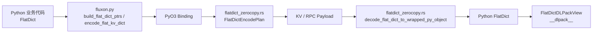
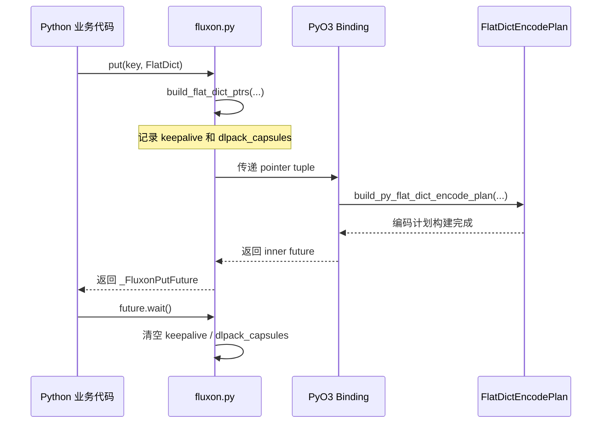

# Python <-> Rust 零拷贝参数传递链路设计

## 执行摘要

- Python 公开契约收敛为 `FlatDict = Dict[str, Union[int, float, bool, str, bytes, DLPacked]]`。
- `put` 路径会把 `bytes` 和 CPU contiguous DLPack tensor 以借用指针的方式交给 Rust；`str` 会先做 UTF-8 编码，因此这一类不是零拷贝。
- `rpc_call(payload: FlatDict)` 当前会先把整个 payload 编码成一块 `bytes`，然后再跨 Python/Rust 边界传递，因此它和 `put` 不是同一条零拷贝路径。
- `get` / `rpc decode` 返回时，Rust 会把带 DLPack 元数据的 bytes 字段包装成 `FlatDictDLPackView`，继续暴露 `__dlpack__`，但不会恢复成原始 numpy / torch 对象。

## 1. 背景与目标

Fluxon KV 的 Python 接口需要支持两类高频 payload：

- 普通 `bytes`
- 由 numpy / torch 等第三方框架导出的 DLPack tensor

更直接的工程动机来自 Python 侧的 `bytes` 构造成本。对于大 payload，问题不只在 Python/Rust 边界上的复制，还在 Python 先把参数组织成 `bytes` 这一动作本身。这里的成本既包括内存分配、拷贝和拼接，也包括相关路径长期运行在 GIL 保护下带来的串行化开销。在 MQ 单 consumer 进程压测中，我们把 `bytes` payload 换成 DLPack 后，吞吐从约 `1 GB/s` 直接提升到约 `6 GB/s`。这说明仅仅减少边界复制还不够，Python 中间层对象构造和 GIL 占用本身就是主要瓶颈之一。

这条设计要解决的是 Python 调用 KV `put / get / rpc` 时，payload 在 Python、PyO3 和 Rust 之间如何流动，以及这条链路上哪些环节是真正的零拷贝借用，哪些环节仍然会发生复制。

需要先明确一点：本文档描述的 `FlatDict + borrowed bytes / DLPack` 接口，本质上是通用 Python 公共接口上的折中方案。它已经显著减少了跨语言复制，但还没有彻底消除 Python/C++ 层的参数组织成本。一个典型例子是“头部元数据 + 实际数据体”这类多段 payload：即使数据体本身可以借用指针，只要公共接口仍要求 Python 先把 header 和 body 拼成一个最终 `bytes`，中间构造和拼接成本就还在。在最新的 kvcache 场景对接中，我们实际上已经进一步优化到了“直接传递指针”的形式；这个入口上传递的不是单一 payload bytes，而是一个内部再携带多个指针的指针对象，供 CUDA kernel 直接消费，从而彻底绕过 Python/C++ 层。这说明当前文档覆盖的是稳定公共接口的零拷贝边界，而不是所有高性能专用路径的最终形态。

本文档的目标：

- 定义稳定的 Python 公共值契约。
- 讲清 Python -> Rust 写入链路的借用边界和生命周期约束。
- 讲清 Rust -> Python 返回链路的 DLPack 视图重建方式。
- 列出当前实现中的硬约束和不变量。
- 明确当前公共接口方案与最新 kvcache 直传多指针方案之间的抽象边界。
- 明确单段 `bytes` 模型与“头部元数据 + 数据体”多段组装模型之间的性能差异。

本文档的非目标：

- KV 内部网络传输协议。
- segment 内存分配策略。
- owner / external memholder 的完整生命周期设计。
- GPU DLPack 支持。
- kvcache 场景下直传多指针到 CUDA kernel 的专用接口设计。

## 2. 核心实现模块

| 模块 | 角色 | 这层负责什么 |
| --- | --- | --- |
| `fluxon_py/kvclient/kvclient_interface.py` | Python 公共契约 | 定义 `FlatDict` 和用户可见值类型 |
| `fluxon_py/kvclient/fluxon.py` | Python 写入入口 | 把 `FlatDict` 转成 pointer tuple，并管理 put future 的 keepalive |
| `fluxon_py/kvclient/nonzerocopy_encode.py` | Python 纯编码/解码辅助 | 处理纯 Python 的 flat dict encode/decode 和 DLPack 包装 |
| `fluxon_rs/fluxon_pyo3/src/flatdict_zerocopy.rs` | Rust 权威实现 | 编码计划、DLPack 校验、返回视图重建 |
| `fluxon_rs/fluxon_pyo3/src/lib.rs` | PyO3 公开绑定面 | 暴露 put/get/rpc 方法，并区分 pointer path 与 bytes path |

## 3. 整体架构与数据流



这张图里有两个关键边界：

- 写入边界：Python 是把 pointer tuple 交给 Rust，还是先把 payload 编码成整块 `bytes` 再交给 Rust。
- 返回边界：Rust 是直接返回普通 bytes，还是把 bytes 区间包装成 DLPack view。

## 4. 写入链路：Python -> Rust

### 4.1 公共值契约

Python 面向用户的稳定值对象定义在 `fluxon_py/kvclient/kvclient_interface.py`：

```python
FlatDict = Dict[str, Union[int, float, bool, str, bytes, DLPacked]]
```

这个契约有两个直接效果：

- 用户不需要接触裸指针或 capsule。
- `put`、`get`、`rpc` 三条路径共享同一套字段语义。

这里还定义了一个保留键：

- `__fluxon_internal_dlpack_meta__`

用户不能手动占用它；它只给内部 DLPack 元数据 sidecar 使用。

### 4.2 Python 侧的值分类和 pointer tuple

`fluxon_py/kvclient/fluxon.py::build_flat_dict_ptrs` 会把一个 `FlatDict` 拆成 pointer tuple 数组：

- `(type_id, key_ptr, key_len, value_ptr_or_inline_bits, value_len, reserved)`

当前各类值的处理方式如下：

| Python 值类型 | Python 侧动作 | Rust 侧落点 | 是否零拷贝 |
| --- | --- | --- | --- |
| `bool` | 直接转 inline 值 | inline bits | 是 |
| `int` | 转 int64 bits | inline bits | 是 |
| `float` | 转 float64 bits | inline bits | 是 |
| `str` | 先 UTF-8 编码成 `bytes` | borrowed bytes / owned bytes 取决于下一层 | 否 |
| `bytes` | 直接导出 buffer pointer | borrowed bytes | 是 |
| `DLPack` | 取 `dltensor` capsule，导出 data pointer 和 `nbytes` | borrowed tensor bytes + meta | 是 |

这张表里最容易误解的是 `str`：

- `str` 的最终写入格式仍然是 bytes。
- 但这块 bytes 是 Python 先编码出来的，因此这一类有复制。

这张表还隐含了一个边界：pointer tuple 方案能很好表达“一个字段对应一段连续内存”的借用语义，但它并不天然等于“任意协议 payload 都能零拷贝组装”。

- 如果业务对象本身就是独立字段，例如一个 `bytes` 字段或一个 DLPack tensor 字段，这条路径已经足够高效。
- 如果业务协议需要把多段内容拼成单个 payload，例如头部元数据和实际数据体，Python 侧只要还要先做 header/body 拼接，就仍然会回到 `bytes` 构造、拷贝以及 GIL 串行化成本。
- 这也是为什么最新的高性能专用路径会继续演进到“一个入口对象里携带多个指针”，让下游直接消费多段内存，而不是要求 Python 先组装出最终大块 `bytes`。

### 4.3 put 路径的 keepalive 机制

`put` 和 `put_blocking` 不是把指针交给 Rust 就结束了。真正危险的部分在生命周期：

- `bytes` 的底层缓冲区必须在 Rust 完成编码前保持有效。
- DLPack capsule 背后的 tensor 内存也必须在 Rust 完成编码前保持有效。

当前实现的做法是：

- `build_flat_dict_ptrs(...)` 返回 pointer tuple 时，同时把相关 Python 对象放进 `keepalive` 和 `dlpack_capsules`。
- 这两组对象被挂在 `_FluxonPutFuture` 上。
- 只有 `wait()` 完成后，`_FluxonPutFuture` 才清空这两组引用。



这里的设计结论是：

- Rust 在 put 路径上借用 Python 导出的地址。
- Python 负责把这次借用绑定到 future 生命周期。

### 4.4 Rust 侧的权威实现：`FlatDictEncodePlan`

Rust 侧真正把 Python 传入值组织成稳定编码计划的文件是：

- `fluxon_rs/fluxon_pyo3/src/flatdict_zerocopy.rs`

核心结构是 `FlatDictEncodePlan`。它内部把存储分成三个桶：

| 字段 | 作用 | 所有权语义 |
| --- | --- | --- |
| `key_storage` | 保存 key 的 UTF-8 bytes | Rust owned |
| `owned_value_storage` | 保存 Rust 必须自己持有的 value bytes | Rust owned |
| `keepalive_objects` | 保存被 Rust 借用的 Python 对象 | Python owned, Rust keepalive |

这几个桶定义了当前实现的真实边界：

- key 一定会复制。
- `str` 会先在 Python 侧转成 UTF-8，再进入 value 存储逻辑。
- `bytes` 可以走借用路径。
- DLPack tensor 可以走借用路径。

### 4.5 DLPack field 的拆分策略

Rust 侧不会把 tensor 当作一种独立 wire type。当前策略是把它拆成两部分：

1. 数据面：tensor 对应的原始字节区间，按普通 `bytes` field 编码。
2. 控制面：`dtype_code / bits / lanes / shape`，序列化到保留键 `__fluxon_internal_dlpack_meta__`。

这个 sidecar 策略的直接收益：

- flat dict payload 格式保持统一。
- 解码侧可以按保留键恢复哪些 bytes 字段应该被重新解释成 DLPack view。

### 4.6 DLPack 在 Rust 侧的硬约束

`extract_py_dlpack_encode_field` 会对 DLPack 做严格校验。当前实现要求：

- capsule 名字必须是 `dltensor`
- 不能是 `used_dltensor`
- 只能是 CPU tensor
- `byte_offset == 0`
- shape 维度不能为负
- stride 必须是 C-contiguous
- `nbytes <= u32::MAX`

这些都属于 fail-fast 约束，不是软建议。

### 4.7 `put` 路径和 `rpc_call` 路径的差异

`put` 路径和 `rpc_call(payload: FlatDict)` 路径不要混在一起理解。

`put`：

- Python 构造 pointer tuple。
- PyO3 和 Rust 看到的是借用式输入。

`rpc_call(payload: FlatDict)`：

- Python 先调用 `encode_flat_kv_dict(payload)`。
- PyO3 看到的是一整块已经编码好的 `bytes`。

因此当前实现里：

- `put` 更接近借用式零拷贝。
- `rpc_call(payload: FlatDict)` 不是这条零拷贝路径的直接复用。

## 5. 返回链路：Rust -> Python

### 5.1 返回链路的入口

返回链路的核心入口仍在 `fluxon_rs/fluxon_pyo3/src/flatdict_zerocopy.rs`：

- `decode_flat_dict_to_wrapped_py_object`

这一步会先 decode flat dict payload，然后检查是否存在 `__fluxon_internal_dlpack_meta__`。

后续逻辑是：

- 普通字段继续变成 Python `bool / int / float / str / bytes`
- 带 DLPack meta 的 bytes 字段会被包装成 `FlatDictDLPackView`

### 5.2 `FlatDictDLPackView` 的职责

`FlatDictDLPackView` 内部持有：

- `FlatDictDataOwner`
- `data_offset`
- `nbytes`
- `dtype_code / bits / lanes / shape`

它的作用是：

- 保留对底层 owner bytes 的引用
- 不复制 payload
- 在 Python 侧按需导出新的 `__dlpack__` capsule

这条路径的设计重点不是“把 tensor 原样还原成 numpy / torch 对象”，而是：

- 返回一个遵守 DLPack 契约的 view object

这样 Fluxon 自己不需要依赖具体框架类型，只需要保证 `__dlpack__` 语义成立。

### 5.3 返回路径的零拷贝语义

get 返回时的零拷贝含义是：

- Rust 不会把 tensor payload 先复制成新的 Python bytes，再交给上层框架消费。
- Rust 会直接让 `FlatDictDLPackView` 指向 owner bytes 区间。

这和写入链路的借用语义是对称的：

- 写入时借用 Python 导出的地址。
- 读取时借用 Rust owner 持有的地址。

### 5.4 Python 纯辅助路径的职责

`fluxon_py/kvclient/nonzerocopy_encode.py` 里还有两组相关对象：

- `DLPackBytesView`
- `wrap_flat_dict_dlpack`

它们的职责主要是：

- 支撑纯 Python encode/decode roundtrip
- 支撑测试
- 支撑 `rpc_call` 这种先编码为 payload bytes 的路径

主 get 路径的权威实现仍然在 Rust 的 `FlatDictDLPackView`。

## 6. 约束、不变量和真实零拷贝范围

### 6.1 硬约束

| 约束 | 说明 |
| --- | --- |
| 只支持 flat dict | 不支持嵌套结构 |
| key 必须是 `str` | 写入入口要求 string key |
| DLPack 只支持 CPU | GPU tensor 不在当前支持范围内 |
| DLPack 必须是 C-contiguous | 非 contiguous tensor 直接拒绝 |
| `byte_offset == 0` | 当前不支持偏移视图 |
| `nbytes <= u32::MAX` | 当前编码和 wire 长度边界要求 |
| 保留键不能被用户占用 | `__fluxon_internal_dlpack_meta__` 只给内部 sidecar 使用 |

### 6.2 真实零拷贝范围

| 场景 | 当前行为 | 是否零拷贝 |
| --- | --- | --- |
| Python `bytes` -> Rust `put` | 借用 Python bytes buffer | 是 |
| Python DLPack tensor -> Rust `put` | 借用 tensor data pointer | 是 |
| Python `str` -> Rust `put` | 先 UTF-8 编码 | 否 |
| `rpc_call(payload: FlatDict)` | Python 先编码整块 payload bytes | 否 |
| 网络跨节点传输 | 不在本文零拷贝保证范围内 | 否 |
| Rust `get` -> Python DLPack view | `FlatDictDLPackView` 直接指向 owner bytes | 是 |

### 6.3 生命周期铁律

- Put future 完成前，`keepalive` 不能释放。
- Put future 完成前，`dlpack_capsules` 不能释放。
- `FlatDictDLPackView` 活着时，底层 `FlatDictDataOwner` 不能释放。
- DLPack capsule 一旦被消费，就不能再当作新鲜 `dltensor` 重复使用。

## 7. 关键结论

1. 这条链路的公共契约是 `FlatDict`，不是裸指针 API。
2. `put` 路径的核心优化点在 pointer tuple + future keepalive；真正的权威实现是 Rust 的 `FlatDictEncodePlan`。
3. `rpc_call(payload: FlatDict)` 当前走的是“先编码成 payload bytes，再跨边界传递”的路径，不能等同于 `put` 的借用式零拷贝。
4. `get` 返回时，Fluxon 会重建 `FlatDictDLPackView`，继续暴露 `__dlpack__`，但不会恢复成原始第三方 tensor 类型。
