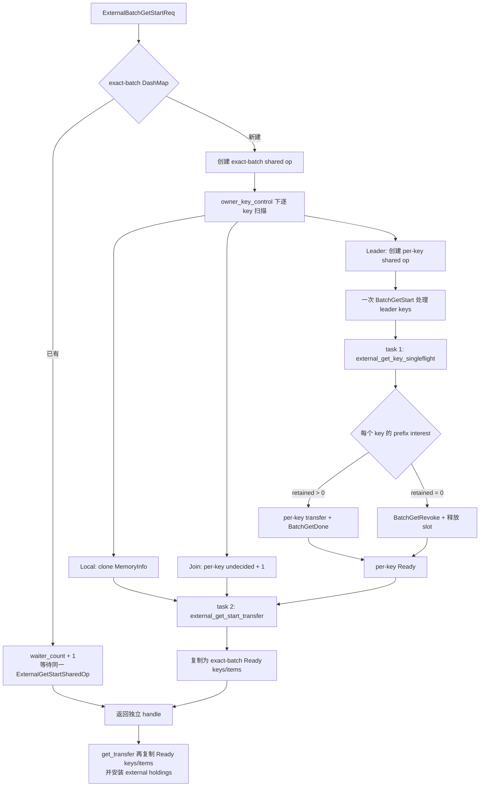
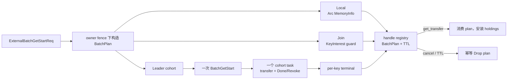

# Fluxon Batch Get / singleflight：PegaFlow 对照与路径简化分析

本文评审当前工作区新增的 owner 侧 Batch Get / per-key singleflight 路径，并与 PegaFlow 的 prefix query、prefetch、lease 和批量传输实现对照。评审范围从 `ExternalBatchGetStartReq` 进入 owner 开始，到 master `BatchGetStart`、payload transfer、`BatchGetDone` / `BatchGetRevoke` 以及 external handle 消费结束。

原始评审基于 2026-07-16 的 Fluxon 工作区和 PegaFlow `master` 的提交
`939363f198a0ffded9e3f30d8af9cdd74439f16c`。2026-07-17 已按当前工作树回填实现状态；
没有把尚未执行的性能对比写成实测结论。

## 2026-07-17 实现回填（当前权威状态）

| 原问题 | 当前实现 | 状态 |
| --- | --- | --- |
| exact-batch 与 per-key 两层 shared op | exact-batch phase/waiter/result cache 已删除；`ExternalGetStartEntry` 直接持请求自己的 `keys + Local/Interest items` | 已解决 |
| `decision_registered` 手工归还 | `ExternalGetKeyInterest` 在 Drop 中归还 `undecided`，prefix decision 由 guard ownership 表达 | 已解决 |
| process-wide `owner_key_control` 扫完整 batch/global states | 改为 256-shard `OwnerKeyControlTable`；local/join/leader 每个 key 独立线性化，任何同步锁均不跨 batch 或 `.await`；metrics 使用独立 Weak flight index | 已解决 |
| 规划等待 Revoke 时取消会遗留未启动 leader | `ExternalGetPlanningLeadersGuard` 在 BatchGetStart handoff 前拥有新 leader；Drop 将仍为 `Starting` 的 op 发布为 safe miss、按 Arc identity 清 marker 并唤醒 joiner | 已解决 |
| prepared slot 在 start/revoke 异常路径失去 owner | claim guard、同 operation identity Revoke retry 与 local slot release guard 已覆盖；响应不确定不猜测释放 | 已解决（仍需端到端故障注入） |
| external handle 无界遗留 | handle sweeper 已接入，超时与显式 cancel 复用 plan Drop/interest release 路径 | 已解决（仍需进程死亡测试） |
| payload 每 key 一次 transfer submission | 控制面仍批量，payload backend submission 仍需运行期计数与 benchmark 后决定是否扩展 descriptor batch API | 未解决/待测 |

下文 §2～§4 保留为“2026-07-16 修复前快照”，用于解释为什么做上述改动；其中出现的
“当前实现”均指该历史快照，不得覆盖本节和集成设计主文档的当前规约。

## 原始结论（2026-07-16 修复前）

**per-key singleflight 的目标应当保留，当前“两层共享操作”应当收缩。** 重叠但不完全相同的 batch 确实需要按 key 选出 local、joiner 和 leader，同时继续批量执行 master RPC。当前实现又在它外面保留了 exact-batch `ExternalGetStartSharedOp`，因此一次请求同时支付 exact-batch 去重和 per-key 去重的状态、锁、通知、结果缓存与生命周期成本。完全相同的 batch 本来就会自然 join 同一组 per-key flight；第二层去重没有形成独立的正确性边界。

**当前首要风险是取消安全。** 常数级性能排在生命周期闭环之后。`decision_registered: bool`、`undecided`、`retained` 和 `waiter_count` 都依赖后续代码手工归还。future 在计数增加后的任一 `.await` 被取消时，没有 `Drop` guard 关闭这次 interest。静态控制流已经足以证明计数可能永久不归零，进而让 leader task、相同 batch、reclaim fence 或 exact-batch registry 一直等待。

**结构性 overhead 已经存在，但实际延迟幅度仍需 benchmark。** 当前路径包含多份 key 向量和结果向量复制、每个新 leader key 的独立共享对象、两层 `Mutex + Notify`、通常两个后台 task、全局 owner key fence 内的线性扫描，以及每个远端 key 一次 `transfer_data_no_copy` 调用。它们在短 value、高并发、大 batch 场景更可能可见；没有 allocator、锁等待和端到端延迟数据前，不应写成“已经造成 X% 回退”。

**PegaFlow 最值得学习的是所有权与生命周期的组织方式。** 它没有解决不同请求之间重叠 block 的 per-key singleflight，算法不能直接搬到 Fluxon。可借鉴的是：一次 prefix scan 直接取得 `Arc` pin、一个 ready prefix 对应一个 opaque lease、资源计数由 RAII / TTL 收口、request-level prefetch 只保留一个 task，以及数据面先汇总 descriptor 再提交。PegaFlow 当前 `QueryPrefetch` 在 probe 阶段就 pin、active prefetch 只按 `req_id` 标识、lease TTL 为 600 秒，这些都不应直接复制到 Fluxon。

建议按以下顺序推进：

1. **P0，先封闭生命周期**：把 decision、waiter、prepared slot 和 handle 改成 cancellation-safe guard；为 owner handle / operation 增加有界 TTL 或 generation cleanup；补齐取消与 revoke 不确定性测试。
2. **P1，删除 exact-batch shared-op 层**：每个 external handle 直接持有一个 `BatchPlan`，其中的 item 引用 local holder 或 per-key flight。保留当前公开的 `get_start -> get_transfer | cancel` 契约。
3. **P2，补全 master 收敛语义**：现有 `(key, requester)` RAII fence 保留，但把通用 `KeyBeingWritten`、`InvalidArgument`、`Unknown` 收敛成有限且可处理的 leader / join / already-committed / stale 结果。
4. **P3，依据数据继续收缩**：若 per-key 对象和 wakeup 仍是热点，再把同一 leader cohort 折叠成一个 `BatchFlight`；若 suffix start / revoke 成本显著，再评估 side-effect-free probe 与 reserve 分离。

## 1. 评审边界与证据等级

本文沿三条轴评估当前路径，后文也按同样的轴给出验收条件：

| 评估轴 | 覆盖内容 | 本文不声称的内容 |
| --- | --- | --- |
| 正确性与生命周期 | leader / joiner 归属、取消、revoke、prepared slot、master fence、reclaim 交互 | 不证明未检查模块的全系统回收行为 |
| 控制面与数据面成本 | 对象、复制、锁、task、future、RPC 和 transfer 提交边界 | 不把静态计数换算成延迟或 QPS 百分比 |
| 可验证性 | 并发测试、故障注入、metrics 和 benchmark 维度 | 不以单轮最终 QPS 代替路径级证据 |

文中的判断分为三类：

- **实现事实**：可由当前符号和控制流直接确认。
- **风险推断**：由 Rust future 取消、所有权或锁作用域推导，仍需测试复现和量化影响。
- **待测结论**：只能通过 benchmark、fault injection 或运行期 metrics 判断。

PegaFlow 对照只用于提炼设计模式。它的 cache 层次、vLLM 接口和跨节点协议与 Fluxon 不同，因此本文不会从 PegaFlow 的局部实现推出 Fluxon 的全路径性能结论。

## 2. 修复前 Fluxon 路径快照

### 2.1 两层共享状态（已删除 exact-batch 层）

修复前 owner 同时维护下列共享状态：

| 层次 | 主要类型或容器 | 去重粒度 | 持有的状态 |
| --- | --- | --- | --- |
| external handle | `external_get_start_registry` / `ExternalGetStartEntry` | 一个返回给 external 的 handle | `req_node_id` 和 exact-batch shared op |
| exact-batch | `external_get_start_by_key` / `ExternalGetStartSharedOp` | `keys + atomic_group_lens + prefix_best_effort` 完全相同 | `Starting/Running/Ready/Failed`、`waiter_count`、完整 dedup key、prefix、keys、items、`Mutex`、`Notify` |
| per-key | `OwnerKeyControlState.external_get` / `ExternalGetKeySharedOp` | owner 内单个 key | `Starting/Started/Finishing/Revoking/Ready/Failed`、`undecided`、`retained`、key、`Mutex`、`Notify` |
| master fence | `PreparedGetRequesterTable` / `PreparedGetRequesterLease` | `(key, requester)` | active `get_id` 和 RAII release |
| prepared memory | `OwnerLocalReserveSlotState::Prepared` | 一个 local-reserve slot | 精确 grant、slot、地址和大小 |

其中 master 的 `(key, requester)` fence 是这轮更新里已经落地的有效改进。它允许不同 GPU owner 同时 materialize 同一 key，同时阻止同一 requester 的两个 prepared Get 并行发布。当前不足是冲突结果仍不可 join，也不能直接取得已经提交的 canonical holder。

### 2.2 修复前调用与数据流



这里的 batch 化只覆盖部分边界：

- owner 到 master 使用一次 `BatchGetStart`、一次 `BatchGetDone` 或 `BatchGetRevoke` RPC。
- master 的 `handle_batch_get_start`、`handle_batch_get_done` 和 `handle_batch_get_revoke` 仍在进程内逐 item 调用单 key handler。
- payload 阶段的 `batch_get_finish_started` 为每个需要传输的 key 创建一个 future；每个 future 调用一次 `transfer_data_no_copy`。该调用继续形成一次 closed-runtime transfer 请求。当前代码没有在这个边界先按 peer / transport 合并 descriptor。

因此，“RPC 是 batch”不能直接推广成“payload 提交和底层 DMA 已经是一个 batch”。底层 backend 可能还有自己的优化，但不在本次已追踪到的调用链内。

### 2.3 当前资源终止路径

| 资源或计数 | 获得位置 | 正常终止 | 当前取消或不确定性缺口 |
| --- | --- | --- | --- |
| per-key `undecided` | `plan_external_get_key_items` 看到 `Starting/Started` | `decide_external_get_key_item` | 计数与 `decision_registered: bool` 分离；future Drop 不会自动 decide / abandon |
| per-key `retained` | prefix 计算后手工增加 | leader finish / revoke 后发布 terminal | 依赖所有 `undecided` 先归零；一个丢失 decision 会阻塞整个 cohort |
| exact-batch `waiter_count` | exact-batch 命中或创建 | transfer / cancel 末尾 `release_external_get_start_waiter` | start 或 transfer RPC future 中途取消时没有 guard |
| external handle entry | `get_start` 返回前插入 `external_get_start_registry` | `get_transfer` 或 `cancel` remove | 容器没有 TTL；调用方进程死亡或消息丢失时没有本层兜底 |
| prepared local slot | leader `BatchGetStart` 前 claim | Done commit，或 Revoke 成功后 release | `OwnerLocalReserveSlotLease` 没有 Drop cleanup；claim 后的 future 取消和 Revoke RPC 不确定性都可能失去释放路径 |
| master requester fence | master 接受 prepared Get | `InflightGetInfo` Drop | 已有 RAII，且 inflight cache 有 60 秒 TTL；它不能替 owner 归还本地 `Prepared` slot |

## 3. 正确性与生命周期发现

### 3.1 手工 decision 不是 cancellation-safe 所有权

`plan_external_get_key_items` 在 owner key fence 内先增加 `undecided`，随后调用链至少会经过 master RPC、逐 key start-code 等待和 prefix 计算。`ExternalGetStartOwnerItem::Shared` 只保存一个 `decision_registered: bool`，没有在 `Drop` 中减少计数。

如果 future 在增加计数后、执行 `decide_external_get_key_item` 或 `abandon_external_get_key_decisions` 前被取消：

1. `undecided` 永久保留本次 interest。
2. `classify_external_get_key_leader` 一直等待 `undecided == 0`。
3. `finish_external_get_key_leaders` 按 leader 顺序 await；一个 key 卡住会阻止同 cohort 后续 key 进入 finish / revoke。
4. per-key marker 继续占用 owner key fence，reclaim 对该 key 返回 `Busy`。
5. exact-batch creator 仍可能停在 `Starting`，相同 batch 后续全部等待同一未完成操作。

这是 P0 正确性问题。修复应让“interest 存在”对应一个实际拥有 Drop 语义的 guard；bool 与计数器的约定不再承担所有权。

同一问题也覆盖 prepared slot。`batch_get_start_with_local_reserve_targets` 先取得 `OwnerLocalReserveSlotLease`，再 `.await` master RPC；返回 `Err` 的显式分支会释放 lease，但 future 在 await 中被 Drop 时不会执行该分支。`OwnerLocalReserveSlotLease` 本身没有 `Drop` cleanup，所以本次 claim 的 slots 可能继续停在 `Prepared`。per-key leader task 又是在该 RPC 成功返回后才 spawn；若请求在 await 中被取消，master 可能已经接受操作，owner 却没有 executor 接管它。同步计数可以直接在 Drop 中归还；需要 RPC 的 cleanup 应由 Drop 把工作提交给一个有界、可观测的 owner cleanup actor，并由 TTL 处理 actor 或进程失效，不能依赖一个无所有者的临时 task。

### 3.2 exact-batch waiter 和 handle 也存在同类缺口

exact-batch 层的 `waiter_count` 同样依赖显式 release：

- `external_batch_get_start` 注册 waiter 后可能在 prepare 或等待 prefix 时被取消。
- `external_batch_get_transfer` 先从 handle registry remove，再等待 shared result；等待期间被取消后，调用方已经没有 handle 可以补发 cancel，函数尾部的 waiter release 也不会执行。
- terminal exact-batch op 只有在 `waiter_count == 0` 时才从 `external_get_start_by_key` 删除。

因此这一层不仅增加常数成本，也增加了一个独立的泄漏和永久等待面。删除该层会直接减少一种必须证明正确的生命周期。

### 3.3 exact-batch 的收益有限，参数归属也不清晰

exact-batch 层并非完全没有收益。它能让 100% 相同的并发请求只计算一次 prefix、只注册一次 per-key decision，并共享聚合后的 result vector。删除它以后，每个 handle 都需要构造自己的轻量 `BatchPlan`，因此必须把 100% identical workload 纳入 benchmark。

这项收益没有形成独立的正确性边界：真正避免重复 slot、master Start 和 payload transfer 的仍是 per-key flight。exact-batch 层为节省重复 plan 工作，引入了第二套 phase、waiter、result cache 和 cleanup 协议。对当前重点覆盖的“前缀大量重叠但 batch 长度或 atomic groups 不完全相同”场景，它又无法命中。

当前参数归属也暴露了这层抽象的歧义：`ExternalGetStartDedupKey` 不包含 `transfer_concurrency`，`ExternalGetStartSharedOp` 却保存第一个 creator 的值。相同 batch 使用不同 `transfer_concurrency` 时，后来的显式参数不会决定共享工作的并发度。per-key sharing 本身也意味着 shared keys 服从各自 leader cohort 的并发策略。这里需要保留一个规范契约：优先把 transfer concurrency 变成 owner / transport 的统一策略；如果仍保留请求参数，文档必须明确它只影响本请求新建的 leader cohort，不能维持未说明的 first-creator-wins 行为。

### 3.4 Revoke 不确定性没有 owner 侧闭环

当 suffix key 无人 retain 时，leader 进入 `Revoking`。`BatchGetRevoke` 成功后，代码才释放精确 prepared target。RPC 返回错误时，当前实现发布 per-key `Failed` 并清除 marker，但没有保存可重试的 `get_id` 和 target，也没有为 owner `Prepared` slot 建立 TTL。

master 的 `InflightGetInfo` 过期后会 Drop `PreparedGetRequesterLease`，所以 master fence 最迟可以重新开放。owner 本地 slot 是否最终返回 `Free`，无法从当前路径证明：释放它所需的精确 target 已经随 terminal op 丢失。更安全的状态应保留 `Revoking { get_id, target, next_retry }`，直到满足下列有限终态之一：

- master 明确确认 Revoke，owner 释放 slot；
- master 返回 Done 已胜出，owner 按 canonical committed backing 收敛；
- master operation TTL 明确过期，owner 核对 generation 后释放 slot；
- owner generation 结束，整个 pool 随进程生命周期销毁。

在终态前清除 per-key marker 会把“master 是否仍在执行”和“owner slot 是否仍被占用”重新变成两个失去关联的状态。

### 3.5 master 防重已经部分完成，收敛语义仍缺失

当前 `PreparedGetRequesterTable` 已正确使用 `(key, requester)` 作为 identity，并通过 `PreparedGetRequesterLease::Drop` 释放。这一部分应保留。

仍需收敛的分支包括：

| 场景 | 当前行为 | 需要的有限结果 |
| --- | --- | --- |
| 同 requester 已有 prepared Get | `KeyBeingWritten` | `Join { operation_id, immutable_start_item }`，或明确可重试的 transient 结果 |
| requester 已有同版本 live replica | `InvalidArgument: cannot replace a live replica` | `AlreadyCommitted`，释放新 slot 后取得 canonical local holder |
| GetDone 时同版本 route 已被另一个操作发布 | `Unknown: could not publish current route` | `AlreadyCommitted`，输家不覆盖 backing |
| GetDone 的 `put_id` 已落后 | 依赖通用错误路径 | `Stale`，revoke / release 后重新 probe |

owner singleflight 可以是主要的快速路径，但不能成为唯一能解释冲突的正确性边界。master 已经维护唯一性 fence，下一步应返回可枚举、可测试的结果，避免 owner 从错误字符串猜测状态。

## 4. 修复前控制面与数据面成本

下表只描述当前源码可以确认的成本。最后一列中的性能影响仍需测量。

| 成本维度 | 当前实现事实 | 随什么增长 | 判断 |
| --- | --- | --- | --- |
| key 所有权复制 | exact-batch DashMap key 和 `ExternalGetStartSharedOp.dedup_key` 各自拥有完整 key 向量；transfer prefix 又被构造并在 `Running` / task 间复制；每个 per-key op 还拥有自己的 `String` | batch key 数和 key 长度 | 明确存在，可通过删除 exact-batch 层减少；延迟占比待测 |
| 共享对象 | 每个新 leader key 有一个 `Arc<ExternalGetKeySharedOp>`、`Mutex`、独立 `Arc<Notify>` 和 terminal result；每个 exact batch 再有一套 shared op | leader key 数和并发 batch 数 | 对短 value / 高并发更敏感，实际 allocator 成本待测 |
| 全局 fence | `owner_key_control` 在同一临界区内先扫描 revoking keys，再逐 key 做 local / join / leader 规划，并穿插 per-key state lock 和索引查询 | required key 数及并发请求数 | 可能形成 p99 lock contention；需要 lock-wait histogram |
| per-key lock / wakeup | start publish、decision、classification、terminal publish 和每个 waiter 都访问 per-key state；exact-batch 又有第二层 lock / notify | joiner 数和状态变化次数 | 两层 wakeup 没有独立语义，优先删除外层 |
| task | 非全 local 的 creator 通常生成 `external_get_key_singleflight` 和 `external_get_start_transfer` 两个 task | creator batch 数 | 第二个 task 只聚合 per-key terminal 到 exact-batch terminal，可删除 |
| waiter future | `finish_external_get_start_transfer` 对 transferable items 建立 `join_all` future；revoke 等待也按 key 建 future | transferable / revoking key 数 | 调度与 wakeup 成本明确，幅度待测 |
| result materialize | per-key `Ready` 保存结果；聚合 task 再构造 exact-batch `Ready`；每个 handle transfer 再 clone `keys/items` | transferable key 数和相同 batch waiter 数 | exact-batch result cache 造成额外向量与 `Arc` refcount 流量 |
| payload 提交 | `batch_get_finish_started` 为每个远端 key 调用一次 `transfer_data_no_copy`；每次继续形成独立 closed-runtime transfer request | 远端 hit key 数 | 控制面 RPC 已 batch，transfer 提交尚未在该边界合并 |
| master batch handler | `BatchGetStart/Done/Revoke` handler 在 master 内逐 item await 单 key handler | leader / terminal key 数 | 网络 RPC 数受控，master 本地调度仍为 O(keys) |
| suffix speculation | 所有 leader 先 Start，prefix 计算后再按 `retained` 选择 Finish 或 Revoke | raw hit 之后的 leader suffix | 避免 probe RPC，但增加 slot claim、master work 和 revoke；需和 probe/reserve 实测比较 |

当前优先级更高的风险依次是取消后不终止、全局 fence 临界区、双层状态 wakeup 和逐 key transfer submission。key clone 也明确存在，但不应先为它引入新的缓存或兼容层。

## 5. PegaFlow 可以借鉴的设计模式

PegaFlow 对照源码固定在提交 `939363f198a0ffded9e3f30d8af9cdd74439f16c`：

| PegaFlow 模式 | 实现证据 | 对 Fluxon 的启发 |
| --- | --- | --- |
| 一次 prefix scan 取得稳定引用 | [`ReadCache::get_prefix_blocks`](https://github.com/novitalabs/pegaflow/blob/939363f198a0ffded9e3f30d8af9cdd74439f16c/pegaflow-core/src/storage/read_cache.rs#L35-L50) 在一个 cache mutex 下按序扫描并 clone `Arc<SealedBlock>` | Fluxon 的 local branch 已在 owner fence 下 clone `MemoryInfo`；让 `BatchPlan` 直接拥有这些 pin 即可，无需再包装 exact-batch state |
| 一个 ready prefix 对应一个 opaque lease | [`QueryLeaseManager`](https://github.com/novitalabs/pegaflow/blob/939363f198a0ffded9e3f30d8af9cdd74439f16c/pegaflow-core/src/lease.rs#L42-L184) 让 lease 持有整个 `Vec<Arc<SealedBlock>>`，支持 consume、release、consumer count 和 sweep | Fluxon handle 应拥有整批 plan / lease，并在 transfer 或 cancel 时一次消费；进程死亡由 TTL 收口 |
| request-level prefetch state | [`PrefetchState`](https://github.com/novitalabs/pegaflow/blob/939363f198a0ffded9e3f30d8af9cdd74439f16c/pegaflow-core/src/storage/prefetch.rs#L79-L155) 用一个 `HashMap<req_id, JoinHandle>` 和一个 mutex 管理后台任务 | per-key singleflight 只保留跨请求去重真正需要的状态；请求级聚合不要再复制一套 phase machine |
| probe 与 commit 分离 | [`vllm-request-state-machine.md`](https://github.com/novitalabs/pegaflow/blob/939363f198a0ffded9e3f30d8af9cdd74439f16c/docs/vllm-request-state-machine.md#L318-L461) 明确提出 `QueryPrefetch -> ReserveLoadBlocks -> Load -> ReleaseReservation -> TTL` | Fluxon 可用 side-effect-free probe 先确定 prefix，再只 reserve transferable prefix；是否值得多一次 RPC 必须 benchmark |
| 取消安全的资源 guard | [`TransferLockGuard`](https://github.com/novitalabs/pegaflow/blob/939363f198a0ffded9e3f30d8af9cdd74439f16c/pegaflow-core/src/backing/transfer_lock_guard.rs#L13-L70) 和 [`SsdPrefetchReservation`](https://github.com/novitalabs/pegaflow/blob/939363f198a0ffded9e3f30d8af9cdd74439f16c/pegaflow-core/src/storage/prefetch.rs#L141-L155) 都在 `Drop` 中归还资源 | `undecided`、waiter、slot 和 master operation retry ownership 都应由 guard 表达 |
| descriptor-first 的批量数据面 | [`transfer`](https://github.com/novitalabs/pegaflow/blob/939363f198a0ffded9e3f30d8af9cdd74439f16c/pegaflow-core/src/transfer/mod.rs#L1-L16) 与 [`gpu_worker`](https://github.com/novitalabs/pegaflow/blob/939363f198a0ffded9e3f30d8af9cdd74439f16c/pegaflow-core/src/gpu_worker.rs#L350-L496) 先收集所有 layer / segment descriptor，再交给一次 backend batch 并同步一次 | Fluxon 应统计并减少实际 transfer submission，而不只统计 BatchGet RPC 数 |
| 路径契约测试和 metrics | [`prefix_semantics`](https://github.com/novitalabs/pegaflow/blob/939363f198a0ffded9e3f30d8af9cdd74439f16c/pegaflow-core/tests/prefix_semantics.rs)、[`prefetch_lease`](https://github.com/novitalabs/pegaflow/blob/939363f198a0ffded9e3f30d8af9cdd74439f16c/pegaflow-core/tests/prefetch_lease.rs) 和 [`test_connector_fault_tolerance`](https://github.com/novitalabs/pegaflow/blob/939363f198a0ffded9e3f30d8af9cdd74439f16c/python/tests/test_connector_fault_tolerance.py) 分别覆盖 prefix、lease consumer、失败与 cleanup | Fluxon 需要把 overlap、取消和资源归零作为 merge gate，纯 prefix helper 不足以覆盖生命周期 |

### 5.1 不应照搬的部分

- **PegaFlow 没有跨请求 per-block singleflight**：active prefetch 按 `req_id` 组织；两个不同请求的重叠 block 仍不共享同一个 per-block future。
- **当前 probe 仍有副作用**：`QueryPrefetch` 已经 pin ready blocks。PegaFlow 自己的设计文档也把 probe / reserve 分离列为未来协议。
- **`req_id` 不是完整 identity**：同一请求在 preemption 或调度重试后可能对应不同 hash slice；PegaFlow 文档建议加入 `digest(block_hashes)`。
- **600 秒 lease TTL 不适合直接复制**：Fluxon prepared local-reserve slot 是稀缺资源，TTL 应由 slot 容量、最大合法 transfer 时长和故障恢复目标决定。
- **语义边界不同**：PegaFlow 的简单 prefix cache scan 不承担 Fluxon 的 atomic group、master route、owner reclaim fence 和跨 requester 唯一性。

## 6. 建议的收缩设计

### 6.1 第一阶段：handle 直接持有 `BatchPlan`

第一阶段保留现有 per-key shared op，先删除 exact-batch shared op。内部结构可以收敛为：

```rust
struct ExternalGetBatchPlan {
    req_node_id: String,
    keys: Vec<String>,
    prefix: ExternalGetStartPrefixResult,
    items: Vec<ExternalGetPlanItem>,
}

enum ExternalGetPlanItem {
    Local(Arc<MemoryInfo>),
    Shared(ExternalGetInterest),
}
```

这只是内部设计草图，名称应在实现时与仓库现有命名统一。关键契约是：

- `ExternalGetInterest` 由 RAII guard 表达。创建时注册一次 prefix decision；prefix 计算会把它消费成 abandon 或 plan 持有的 result interest。未决定就 Drop 时自动 abandon；进入 `Finishing` 后的 Drop 只释放 waiter，不回滚已经提交的数据面终态。
- `external_get_start_registry` 直接持有 `BatchPlan`，不再间接持有 `ExternalGetStartSharedOp`。
- `get_transfer` 消费 plan 并等待其中的 per-key terminal；`cancel` Drop plan。两个入口共享同一条释放路径。
- 完全相同的两个 batch 仍会在 per-key registry 中 join 相同 flight，因此不会重复 Start / transfer。
- leader cohort 的现有后台 task 已经负责 transfer 和 Done。删除 `external_get_start_transfer` 聚合 task 不会失去 start 与 GPU allocation 的重叠，只会删除第二次等待和结果 materialize。
- handle registry 需要 TTL / generation cleanup。TTL 回调与显式 cancel 必须调用同一个幂等终止函数。

可以删除的重复 surface 包括：

- `ExternalGetStartDedupKey`
- `ExternalGetStartSharedOp`、`ExternalGetStartSharedState`、`ExternalGetStartSharedPhase`
- `external_get_start_by_key`
- `register_external_get_start_waiter`、`release_external_get_start_waiter`
- `wait_external_get_start_prefix`、`wait_external_get_start_transfer`
- `publish_external_get_start_ready` 及第二份 batch terminal result
- `external_get_start_transfer` 聚合 task

`ExternalGetStartSharedItemResult` 此后只属于 per-key terminal，应改成唯一且明确的 `ExternalGetKeyResult`，避免名字继续暗示 exact-batch sharing。



### 6.2 第二阶段：有数据再折叠成 `BatchFlight`

删除 exact-batch 层后，如果 metrics 证明 per-key `Arc + Mutex + Notify` 仍是热点，可以让同一次扫描产生的 leader keys 共用一个 `BatchFlight`：

- key registry 保存 `(Weak<BatchFlight>, slot_index, generation)`。
- `BatchFlight` 持有一个 slots 数组、一个 mutex、一个 notify 和一个 cohort task。
- joiner 只保存 `Arc<BatchFlight> + slot_index + InterestGuard`。
- 每个 slot 有独立 outcome 和 interest count，但同步原语属于整个 cohort。
- registry 删除必须同时校验 key、flight identity、slot 和 generation，旧 waiter 的 Drop 不能删除后来创建的 flight。

这一步能把同步对象从 O(leader keys) 降到 O(leader cohorts)，代价是一个 notify 可能唤醒同 cohort 的无关 slot waiter。应先测 per-key 对象和 wakeup 是否真的占主导，再决定是否接受该 trade-off。不要在删除重复层之前再叠加第三套 batch state machine。

### 6.3 master 返回可收敛的有限结果

master 的 prepared Get start 应返回一个可穷举结果集合。下面只描述分支语义，不是当前已存在的 Rust 类型：

```text
Leader { start_item }
Join { operation_id, immutable_start_item }
AlreadyCommitted { put_id, backing_identity }
Stale
```

具体 wire 类型需要单独设计，但分支必须保持有限：

- `Leader` 获得本次 prepared target 的唯一提交权。
- `Join` 返回足够重建原 operation 的 immutable start 信息。owner 仍只能选出一个 transfer executor，其他 waiter 观察同一终态。
- `AlreadyCommitted` 返回 version 和 backing identity，让 owner 释放候选 slot，并在 reclaim fence 下取得 canonical local holder。
- `Stale` 终止旧 operation，重新读取当前 route / version。

master fence 的 RAII lease 和 60 秒兜底可以继续保留，但 owner slot 的终止不能只依赖 master cache Drop。

### 6.4 probe / reserve 作为可选协议，不先假设它更快

当前 speculative Start 的优点是少一次网络往返，并能尽早开始远端 materialization；成本是 raw prefix 之后的 key 也 claim slot、进入 master、再走 Revoke，还需要 `undecided/retained/Revoking` 协调多个 batch 的 prefix interest。

可选的两阶段协议为：

1. `BatchGetProbe(keys)`：只返回每个 key 的 local / route 可用性和 version，不占 prepared slot。
2. owner 按原始顺序和 atomic groups 算出 `transferable_len`。
3. `BatchGetReserve(keys[..transferable_len], versions)`：全量成功或返回 stale / retry，不留下部分 reservation。
4. transfer 消费 reservation；cancel / failure / TTL 释放 reservation。

该协议能删除大部分 suffix revoke 和 decision accounting，但多一次 RPC，并引入 probe 与 reserve 之间的 eviction / version race。正确处理方式是 reserve 时原子复核，把 race 降级为 cache miss / retry。是否采用，应比较：

- 当前 speculative Start + suffix Revoke；
- probe + reserve；
- 不同 batch 长度、miss 位置、overlap ratio 和 RTT 下的端到端结果。

### 6.5 保留 batch 语义，并把 batch 延伸到 transfer submission

无论控制面采用 per-key op 还是 `BatchFlight`，都应维持：

1. owner 以逐 key/shard 短 fence 完成 required batch 的 local / join / leader 分类；不得用
   process-wide lock 取得整批快照，也不得让任何同步锁跨 `.await`；
2. leader keys 压缩成一次 `BatchGetStart`；
3. terminal 使用一次 `BatchGetDone` 或 `BatchGetRevoke` 收敛；
4. 结果按原 index scatter，再计算 raw prefix 和 atomic-group prefix；
5. payload descriptor 先按 peer、方向和 transport 能力分组，再调用 batch transfer surface。

PegaFlow 的 descriptor-first 做法适合借鉴到第 5 步。Fluxon 至少应新增 `transfer_submissions`、`descriptors_per_submission` 和 `bytes_per_submission`，先确认当前每 key 调用是否真的成为瓶颈，再设计 batch transfer API。

## 7. 迁移顺序

| 阶段 | 改动 | 完成判据 |
| --- | --- | --- |
| P0 生命周期 | 引入 decision / waiter / prepared operation guard；统一显式 cancel、future Drop、TTL cleanup；保留 revoke retry identity | fault injection 取消任一 await 后，active handle、interest、marker 和 prepared slot 都回到基线 |
| P1 删除重复层 | handle 改持 `BatchPlan`；删除 exact-batch map、phase、notify、waiter 和聚合 task | identical / overlapping batch 的 leader Start 数不增加；公开 API 不变 |
| P2 master 收敛 | wire 层增加有限 outcome；owner 实现 join、already-committed 和 stale 分支 | 同 requester 冲突不再暴露通用 `KeyBeingWritten` / `InvalidArgument` / `Unknown` |
| P3 数据驱动优化 | 测量并选择 `BatchFlight`、probe/reserve、batch transfer submission | 每个新增机制都有对应热点证据和独立回退对照 |

截至 2026-07-17，P0 的 Interest/planning leader/prepared-slot guard、P1 exact-batch 删除、
P2 的 `(key, requester)` fence 与 overlap/ABA 防线已进入当前工作树并通过定向单元测试；
P2 的完整有限 outcome 仍需故障注入确认。P3 的
payload descriptor batch 仍未实现，必须由部署后的 submission metrics/QPS 决定，不能仅凭
静态结构继续加层。

P0 与 P1 可以先在现有 per-key 实现上完成。不要为了等待理想的 `BatchFlight` 一次性重写而继续保留已知的取消缺口。

## 8. 测试、观测与验收门槛

### 8.1 必须补齐的测试

最新更新已经增加三类有价值的 unit test：两个非完全相同 batch 复用同一 per-key marker、旧 marker cleanup 不删除新 generation，以及 master `(key, requester)` fence 的同 owner / 跨 owner 与 ABA 行为。它们验证了同步注册和 identity 规则，但没有启动真实 RPC / transfer / cancel 生命周期。下列测试仍需直接运行 async 流程，显式检查 exit code / timeout 和资源终态：

| 场景 | 必须断言 |
| --- | --- |
| overlap：`[a,b,c]` 与 `[b,c,d]` | `b/c` 对同 owner 各只有一个 leader Start 和一份 committed backing；两个 batch 各自 prefix 正确 |
| identical batch | 删除 exact-batch 层后仍只产生一组 per-key leader；两个 handle 可独立 transfer / cancel |
| duplicate key：`[a,a,b]` | `a` 只有一个 flight；两个原 index 都得到一致结果；interest 不下溢或泄漏 |
| atomic-group suffix | group 不被切开；suffix local pin、join interest 和 leader prepared slot 全部释放 |
| task cancellation matrix | 在注册 decision、Start 前后、等待 prefix、等待 result、handle remove 后逐点 abort；后续同 key 请求可在 deadline 内完成 |
| Revoke 响应丢失 | owner 保留 retry identity；master TTL / terminal query 后 slot 最终回到 `Free`，不会直接清 marker 丢状态 |
| Done / Revoke race | 只有一个终态释放资源；Done 胜出时 Revoke 不释放 committed slot |
| reclaim race | Local、Starting、Finishing、Revoking 和 terminal 各阶段与 reclaim 并发，不出现地址复用或永久 `Busy` |
| master requester fence | 同 requester 第二个 Get 返回 join / already；不同 requester 可以同时成为 leader |
| stale version | 旧 `put_id` 不覆盖新 route；候选 slot 被回收并重新 probe |
| owner / external generation change | 旧 handle、旧 flight 和旧 cleanup 不能删除或消费新 generation 状态 |

### 8.2 必须暴露的路径 metrics

| 类别 | 指标 |
| --- | --- |
| 分类 | `required_keys`、`local_pinned`、`inflight_joined`、`leader_started`、`duplicate_indices` |
| 去重收益 | `get_start_avoided`、`transfer_avoided`、`identical_batch_joined` |
| 生命周期 | active handles / flights / interests / prepared slots、各自 age、cancel / TTL / Drop cleanup 次数 |
| suffix | local pin drop、join interest drop、leader revoke、revoke retry、revoke unknown |
| master 收敛 | leader、join、already-committed、stale、TTL expired，按结果分别计数 |
| 等待与锁 | owner fence wait / hold、join wait、flight lifetime 的 histogram |
| 数据面 | BatchGet RPC items、transfer submissions、descriptors / bytes per submission、Done / Revoke batch size |

所有 gauge 都必须能在 workload 结束后的有界时间内回到基线。只增加累计 counter 无法发现永久挂住的 handle、interest 或 prepared slot。

### 8.3 benchmark 矩阵

至少比较三个实现：变更前的 batch path、当前双层 shared-op path、删除 exact-batch 层后的 `BatchPlan` path。输入矩阵应覆盖：

- key 数：`1 / 16 / 64 / 256`；
- overlap ratio：`0% / 50% / 90% / 100%`；
- first miss：首部、中部、尾部和 all-hit；
- 并发：单请求、同 owner 多请求、多个 requester owner；
- value / page 大小：控制面占主导的小 value，以及数据面占主导的实际 KV page；
- local / same-host / remote transport；
- fault-free、cancel storm 和 Revoke 响应延迟 / 丢失。

采集 `get_start` p50 / p99、完整 transfer p50 / p99、CPU、allocation bytes / count、task spawn、lock wait、RPC items、transfer submission 和最终 slot / handle gauge。验收时先检查语义计数和资源归零，再比较延迟；最终 QPS 只能作为补充结果。

## 9. Fluxon 证据索引

| 事实 | 当前代码位置 |
| --- | --- |
| per-key flight 与 request plan 类型 | `fluxon_rs/fluxon_kv/src/client_kv_api/mod.rs`：`ExternalGetKeySharedOp`、`ExternalGetKeyInterest`、`ExternalGetStartEntry` |
| per-key 规划和 RAII decision | `fluxon_rs/fluxon_kv/src/client_kv_api/external_api.rs`：`plan_external_get_key_items`、`ExternalGetKeyInterest::decide/Drop` |
| leader finish / revoke | 同文件：`classify_external_get_key_leader`、`finish_external_get_key_leaders` |
| request plan handle（无 exact-batch shared-op） | 同文件：`external_batch_get_start`、`finish_external_get_start_transfer`、`external_batch_get_transfer` |
| per-key payload transfer submission | `fluxon_rs/fluxon_kv/src/client_kv_api/get.rs`：`batch_get_finish_started` |
| transfer closed-runtime 边界 | `fluxon_rs/fluxon_commu/src/facade/transfer_engine.rs`：`transfer_data_no_copy` |
| external Get 与 reclaim fence | `fluxon_rs/fluxon_kv/src/client_kv_api/reclaim.rs`：`prepare_one` |
| master requester fence 与 TTL | `fluxon_rs/fluxon_kv/src/master_kv_router/mod.rs`：`PreparedGetRequesterTable`、`PreparedGetRequesterLease`、`inflight_gets` |
| master 冲突和 batch handler | `fluxon_rs/fluxon_kv/src/master_kv_router/get.rs`：`handle_get_start`、`handle_get_done`、`handle_batch_get_start` |
| 已有 overlap / ABA unit tests | `external_get_start_batch_tests::overlapping_nonidentical_batches_share_each_key_but_keep_leaders_batched`、`old_singleflight_cleanup_cannot_remove_new_generation`、`prepared_get_singleflight_is_same_owner_only_and_aba_safe` |
| 原设计要求 | `fluxon_doc_cn/design/sglang_fluxon_kv集成设计.md`：`Batch Get 的逐 key 交集、pin 与 singleflight` |

## 10. 决策记录

- **接受** owner 侧 per-key overlap 去重和 master 侧 `(key, requester)` 防御性唯一性。
- **接受** BatchGetStart / transfer / Done 在数据流上的 cohort 概念。
- **拒绝** exact-batch shared op 与 per-key shared op 长期并存。
- **拒绝** 用 bool 和手工 counter 表达跨 `.await` 的资源所有权。
- **暂缓** `BatchFlight` 和 probe/reserve 协议，直到 P0 / P1 完成且 metrics 指向对应热点。
- **要求** 在把该路径视为完成前，补齐取消、overlap、Revoke 不确定性、reclaim race、master 收敛测试和资源归零观测。

## 11. 2026-07-16 实现跟进

本分析提出的 P0/P1 已进入工作区实现：

- 删除 `ExternalGetStartDedupKey`、`ExternalGetStartSharedOp`、
  `external_get_start_by_key`、request-level waiter/phase/result cache 和
  `external_get_start_transfer` 聚合 task；handle 直接拥有自己的 keys/items plan。
- `ExternalGetKeyInterest` 以 RAII 表达 prefix decision；未决定的 request future 被取消时，
  Drop 自动减少 `undecided`。leader cohort 在第一个 master RPC await 前交给注册后台 task，
  因而请求取消不会丢失 Start/Finish/Revoke executor。
- prepared slot claim 使用 Drop cleanup guard；明确接受的 slots 才逐项 disarm。external
  handle 增加 360 秒 TTL 和统一 Drop 回收，覆盖当前对齐 workload 的 300 秒合法请求窗口。
- `Revoking` 保存完整 start item；BatchGetRevoke 的 transport、响应长度和 identity 不确定性
  保留 marker/slot 并重试，只有明确 Revoke 成功才释放 target。transfer/install 失败的
  cleanup 也在独立注册 task 中持有 get ids 和 targets，调用方取消不再丢失清理 ownership。
- overlap/ABA 测试之外新增了 pending Interest Drop 和真实 task abort 测试；当前仍需用真实 RPC
  fault injection 覆盖 Done response 丢失、owner generation 切换和完整 transfer cancellation matrix。
- BatchGetDone 不再固定重试三次后遗留 pending-visible slot，而是使用同一组 get ids 幂等重试，
  严格校验响应长度和逐项 identity，直到明确终态或 owner shutdown。BatchGetStart 没有响应的
  未知提交点会将 prepared slots 隔离 65 秒，覆盖 master 60 秒 inflight TTL；已知 get ids 的
  异常响应则移交独立 Revoke cleanup。
- owner 周期快照增加 active handle、per-key flight 阶段、undecided/retained interest 和
  Free/Prepared/Pending/Committed local-reserve slot 计数，用于三机 workload 后资源归零验收。

这次跟进没有宣称 payload 已成为单次底层 DMA batch。控制面 cohort 仍是一次
BatchGetStart/Done/Revoke，但 `transfer_data_no_copy` 的 descriptor-first 合并仍属于后续 P3，
必须由 submission metrics 和 benchmark 决定接口形态。

2026-07-17 使用宝宝盘 `CARGO_TARGET_DIR` 和单并发构建做了最新工作树回归。
Clippy 在仅放行仓库既有 `uninit_vec` 的前提下强制
`-D clippy::await_holding_lock` 通过；master-router、owner-hot、local-reserve、
member-left 和 `test_memholder_pin` 分别为 `28/28`、`9/9`、`8/8`、`5/5`、`1/1`。
`fluxon_kv --lib` 全量为 `176 passed, 0 failed`，旧的 `test_memholder_pin` 失败已不再复现。
上述结果不替代真实 RPC fault injection 和三机生命周期验证；尤其仍需主动丢弃
Start/Done/Revoke 响应并检查快照临时态回到基线。
