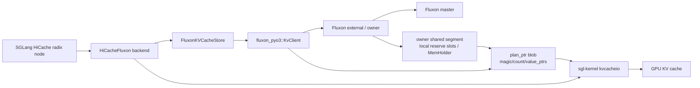
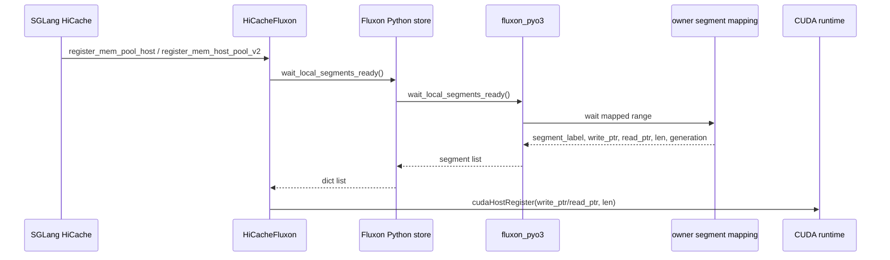
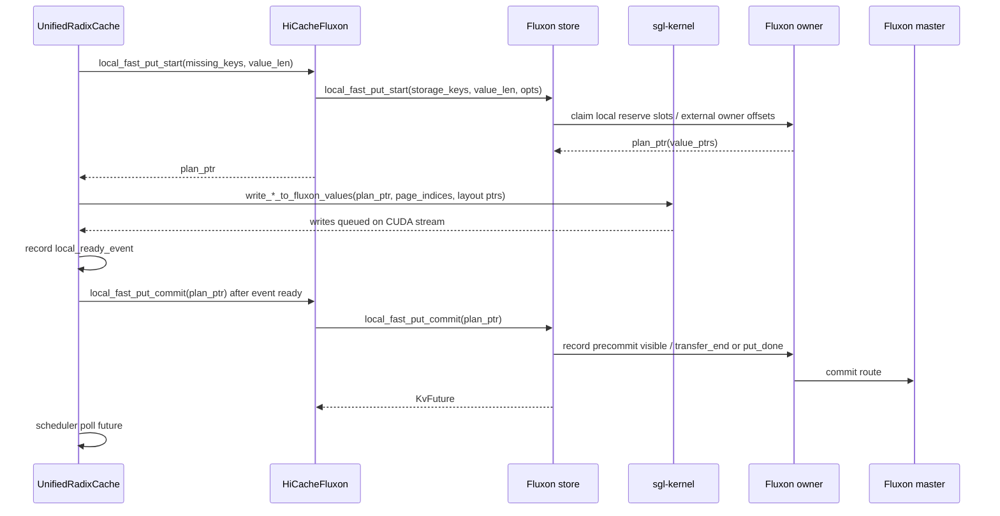
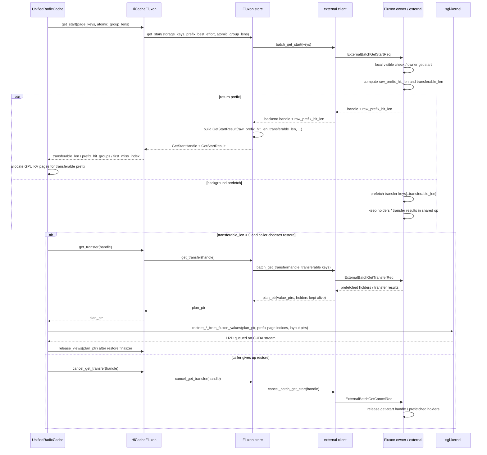

# SGLang Fluxon KV 集成设计

## 背景与目标

本文说明开源仓库中 SGLang HiCache 接入 Fluxon KV 的 hostless 实现设计，聚焦接口契约、状态归属和生命周期边界。本文不是通用 `FlatDict` KV API 的完整说明。

稳定结论：本集成的目标是把 SGLang HiCache + Mooncake 形态下分裂的 L2/L3 KV Cache 收敛到 Fluxon 统一管理的本机/远端 KV 层。Fluxon 需要同时具备两类能力：一类是 `key -> value` 的分布式缓存、路由、版本和生命周期能力；另一类是 HiCache L2 所依赖的 hostless 数据面能力，也就是让 SGLang native kernel 直接在 GPU KV cache 和 Fluxon 管理的 host value memory 之间搬运数据。

关键 insights 先集中列在这里，后文围绕这些结论展开接口、状态和时序设计：

- **L2/L3 分离是工程解耦选择，但会带来资源冗余和 L2 全局不可见**
  - 因果链：HiCache L2 留在推理框架内，Mooncake L3 作为外部 backend，能降低接入复杂度；代价是同一类 KV page 被两套系统分别索引、驻留、驱逐和释放。同一批 page 可能同时驻留在本机 L2 和外部 L3，且其它 worker 或其它节点不能通过统一 route 判断本机 L2 page 是否可复用。
  - 本设计落点：把逻辑 L2/L3 收敛到 Fluxon local side / remote side，用一套 owner、holder、route、commit/release 管理同一批 page。page key 在 Fluxon master/owner 中形成统一路由；只有 commit future 成功后，跨 worker 和跨节点复用才把该 page 视为可见。
- **同机 worker 缺少共享内存快路径**
  - 因果链：多个 SGLang worker 容易各自维护后端 segment、本机缓存副本和独立 pin/release 状态；同机交接也可能绕行后端协议。
  - 本设计落点：同机 worker attach 到同一个 Fluxon owner shared segment，通过 holder 引用管理本机可见 value 的生命周期。
- **统一 L2/L3 需要分布式 KV 能力**
  - 因果链：Mooncake 这类分布式 KV backend 的目标仍然成立：KV Cache 需要利用远端 CPU 内存，尤其是无推理负载机器上的闲置内存，作为 shared backing。只用本进程数组或本机缓存，无法统一索引、放置和复用这些远端闲置内存。
  - 本设计落点：Fluxon 保留 `key -> value` route、inflight 判重、commit future 和 local/remote 放置能力，把远端闲置 CPU 内存纳入 remote side，同时把本机 L2 纳入同一套 owner/holder 生命周期。
- **保留 L2 低延迟需要 kernel 直连内存**
  - 因果链：普通 `put/get(key, bytes)` KV 接口需要在 CPU 侧 materialize payload、查地址、组织拷贝或拆装 bytes；长上下文下如果再按 page 和 layer 展开，会形成 `page_count * layer_count` 级别的 CPU 控制面循环。
  - 本设计落点：Fluxon 只构造 `plan_ptr(value_ptrs)`，SGLang native kernel 直接在 GPU KV cache 和 Fluxon host value memory 之间搬运 bytes。
- **KV Cache 适合 write-back 最终一致性，最终目标是极致化这条路径**
  - 因果链：page value 按不可变对象使用，缓存副本可丢失；写回失败只会降低命中率，不改变推理正确性。因此优化重点应放在缩短 write-back 和 restore 的热路径，而不是把每次缓存写回做成强同步持久写。
  - 本设计落点：native write 完成后异步推进 route commit，`KvFuture` 成功前不作为跨 worker / 跨节点 shared backing；写入侧减少同步等待、CPU 循环和中间 bytes 包装，读取侧先规划 prefix，再只 materialize 可恢复前缀。
- **需要适配 SGLang KVCache 特化接口**
  - 因果链：SGLang KVCache restore 不是普通逐 key `get`，而是面向一批有序 page keys 的 prefix restore。它需要一次性回答“这一批最多恢复到哪里”，并且不能切开一个 radix node 对应的 atomic group。batch 化还能减少逐 key 调用、查表、锁和跨边界调度开销。
  - 本设计落点：Fluxon hostless get 以 batch 为单位计算 `raw_prefix_hit_len`、`transferable_len` 和 `prefix_hit_groups`。`get_start` 合并存在性 / prefix 判断和可恢复前缀的数据拉取启动，返回 handle 和 prefix；`get_transfer` 再消费 handle，把可恢复前缀转换成 readable `plan_ptr(value_ptrs)`。

### 核心实现思路

核心实现按上面的 insight 逐条落到接口和状态边界：

- **对应 L2/L3 分离带来资源冗余和 L2 全局不可见**
  - 实现思路：把 L2/L3 从两个后端系统收敛成 Fluxon 的 local side / remote side。local side 承接本机 shared segment、reserve slots 和 holder；remote side 承接跨 owner / 跨机器 KV 数据面。
  - 主要落点：Fluxon master/owner route、`MemHolder`、commit/release 生命周期。
- **对应同机 worker 缺少共享内存快路径**
  - 实现思路：一台机器运行一个 Fluxon owner，同机 SGLang worker 以 external/client attach 到同一个 owner shared segment。worker 只注册本进程 CUDA context 可见的 mapping，底层内存归属和释放由 owner 管理。
  - 主要落点：`wait_local_segments_ready()`、owner shared segment、CUDA host registration。
- **对应统一 L2/L3 需要分布式 KV 能力**
  - 实现思路：继续保留类似 Mooncake 的分布式 KV 目标，用 page key 做全局命名，用 route 和 version 定位本机 owner 或远端 owner，把无推理负载机器上的闲置 CPU 内存作为可放置、可复用的 remote side backing。inflight 判重和 commit future 约束写入发布，避免远端共享副本提前可见。
  - 主要落点：Fluxon master route、local/remote owner 放置、`local_fast_put_start` reservation、`local_fast_put_commit` 发布。
- **对应保留 L2 低延迟需要 kernel 直连内存**
  - 实现思路：在保留分布式 `key -> value` KV 语义的前提下，把普通 `put/get` 的数据面拆成两条 hostless 两阶段路径。Fluxon 不接管 KV page 内部 layout，只提供 key 路由、holder 生命周期和 `plan_ptr(value_ptrs)`。
    - `plan_ptr` 协议：Fluxon 和 SGLang kernel 之间只共享一段短生命周期 plan blob。blob 里保存本次 batch 的 `value_ptrs[]`；Fluxon 负责这些地址的分配、可见性和 holder 生命周期，SGLang kernel 负责按自己的 KV layout 解释并读写这些地址。
    - Put：`put_start -> native write -> put_commit` 构成写入闭环。`put_start` 本质上为本次 batch 分配 Fluxon 管理的 value memory，并返回 `plan_ptr(value_ptrs)`；SGLang native write kernel 直接往这些地址写入 GPU KV bytes；`put_commit` 在 kernel 写完后通知 Fluxon，把这些 slots 发布为可路由的 KV value。
    - Get / restore：`get_start -> get_transfer -> native restore -> release_views` 构成读取闭环。`get_start` 先计算连续安全前缀；`get_transfer` 把可恢复前缀 materialize 成 readable `plan_ptr(value_ptrs)` 并持有 holder；SGLang native restore kernel 直接从这些地址恢复 GPU KV cache，完成后 `release_views` 释放 plan 引用。
  - 主要落点：plan blob ABI、`value_ptrs[]`、`local_fast_put_start/local_fast_put_commit`、`get_start/get_transfer`、SGLang `write_*_to_fluxon_values` / `restore_*_from_fluxon_values`。
- **对应 KV Cache 适合 write-back 最终一致性**
  - 实现思路：KV Cache 的不可变、可丢失语义天然对应 Fluxon 的 master / owner / external 三层架构。master 管全局 route 和最终可见性，owner 管本机共享内存和 holder 生命周期，external 是 SGLang worker 的热路径接入层。
    - Put：native write 完成后先更新 external / owner 本地可见索引并返回 `KvFuture`，后台再推进 master route commit。`KvFuture` 成功前只表示本机 write-back 进入提交流程；失败时清理本地在途状态，退化为后续 cache miss。
    - Get / restore：优先查询 external / owner 本地热路径；本地 miss 时再进入远端 prefetch 和 restore。读取只 materialize 连续安全前缀，失败时 rollback 或按 miss 继续。
  - 主要落点：master route、owner shared segment、external local visible index、`KvFuture`、`get_start/get_transfer/release_views`。
- **对应适配 SGLang KVCache 特化接口**
  - 实现思路：把 restore 查询建模成 SGLang KVCache 专用的 batch prefix planning，而不是逐 key 独立 get。
    - Reject inflight / exist：KV page 按不可变缓存对象写回，重复 page key 不应产生第二份并发写入。`local_fast_put_start` 固定使用 `reject_if_inflight_same_key` 和 `reject_if_exist_same_key`，在分配 writable memory 前拒绝在途或已存在的同 key value，避免重复写回和未提交数据被误发布。
    - Prefetch 对应 `get_start`：`get_start(keys, prefix_best_effort, atomic_group_lens)` 按 key 顺序完成存在性 / prefix 判断，并在 owner/external 侧启动 `keys[..transferable_len]` 的 prefetch transfer，把“能恢复多少”和“开始拉取可恢复数据”合并在 start 阶段。
    - Batch 和 group 对齐：`get_start` 按 atomic group 边界把 `raw_prefix_hit_len` 收敛成 `transferable_len`；`get_transfer` 只消费这个 handle 和 `keys[..transferable_len]` 的 prefetch 结果，并构造 batch 级 readable `plan_ptr(value_ptrs)`，保证 kernel restore 看到的是连续、完整、可回滚的 readable batch plan。
  - 主要落点：`reject_if_inflight_same_key`、`reject_if_exist_same_key`、`GetStartResult`、`atomic_group_lens`、`raw_prefix_hit_len`、`transferable_len`、`prefix_hit_groups`、`get_start/get_transfer`。

因此，本设计要统一的是 L2/L3 的对象归属、可见性和生命周期，同时保留 L2 路径的低延迟数据面。单独替换成普通远端 KV 会丢掉 HiCache L2 的 kernel 直连能力；单独保留本地数组或进程内缓存，又无法让 L2 进入全局命中、驱逐和跨节点复用链路。

当前调用链主要分为三条主线：

- 写入侧：`local_fast_put_start -> SGLang native write -> local_fast_put_commit`。
- 读取侧：`get_start -> get_transfer -> SGLang native restore -> release_views`。
- 放弃读取侧 restore 时：`cancel_get_transfer` 释放 `get_start` 持有的资源。

这个集成把 SGLang 逻辑上的 L2/L3 缓存落到 Fluxon 统一管理的本机/远端 KV 层中。这样可以用同一套 owner、holder、commit/release 语义管理 KV page，减少传统 L2 host cache 与 L3 backend 分属不同系统时产生的同机重复缓存和生命周期割裂。

常见部署下，一台机器启动一个 Fluxon owner；同机多个 GPU 对应的多个 SGLang worker 进程通过 external/client attach 到同一个 owner shared segment。相比一个 SGLang 进程一个后端 segment、进程间不共享后端 segment 的形态，Fluxon 把同机 host/shared memory、owner local reserve slots 和 holder 生命周期放到同一个 owner 生命周期模型里。这样多个 SGLang worker 可以通过同一个 owner segment 获得本机快速可见性和受控的本地可写内存供给，减少各进程为了各自安全边界重复持有 KV、固定预留 segment 或独立维护 pin/release 状态带来的浪费。

## 范围边界

| 范围 | 当前结论 |
| --- | --- |
| SGLang hostless 写入 | 已接入。SGLang 通过 `local_fast_put_start` 取得一批可写 host value 地址，native kernel 写入后再调用 `local_fast_put_commit` 提交。 |
| SGLang hostless 读取 | 使用 `get_start/get_transfer/release_views`。`get_start` 先计算连续可恢复前缀，`get_transfer` 再把可恢复前缀转换成 readable `plan_ptr`。 |
| Fluxon value layout | Fluxon 不理解 KV page 内部布局；只按 `key + value_len` 管理连续字节。 |
| SGLang node 状态 | SGLang 的 `storage_*` 字段是调度层状态，不等同于 Fluxon master route；跨节点复用以 Fluxon commit future 成功为准。 |

## 总体架构



这里有两个层次：

- KV 语义层：SGLang 传入 page key，Fluxon 对外保存 `key -> value`。
- hostless 数据层：Fluxon 返回 `plan_ptr`，SGLang native kernel 根据 blob 里的 `value_ptrs[]` 直接执行 GPU/host 数据传输。

从缓存物理层级看，Fluxon 把传统 L2/L3 逻辑抽象落到 local side / remote side：local side 覆盖本机 GPU KV、owner shared segment、owner local reserve slots 和 `MemHolder`；remote side 覆盖跨 owner 或跨机器的数据面。多个 SGLang worker attach 到同一个 owner segment 时，同机 KV bytes 不需要按 worker 进程重复保存在多个后端 segment 中。

`plan_ptr` 只是一轮 backup 或 restore 的短生命周期 carrier。它不能作为 key、缓存地址、跨进程句柄或长期状态保存。

## 公共契约

本节只列 SGLang HiCache hostless 接入 Fluxon KV 时直接依赖的接口。

| 接口 | 层级 | 契约 |
| --- | --- | --- |
| `wait_local_segments_ready()` | Fluxon + SGLang 集成 | 返回当前进程可见的 local segment mapping，供 SGLang 做 CUDA host registration。 |
| `local_fast_put_start(keys, value_len, opts)` | SGLang hostless 写入 | 为一批等长 values 准备可写地址，返回 put `plan_ptr`。 |
| `local_fast_put_commit(plan_ptr)` | SGLang hostless 写入 | 在 SGLang native kernel 写完 `value_ptrs[]` 后消费 put plan，把对应 slots 提交为 Fluxon KV route，返回 `KvFuture`。 |
| `put_abort(plan_ptr)` | SGLang hostless 写入 | 在 commit 前释放 put plan、key reservation 和 local reserve slot lease。 |
| `GetStartResult` | SGLang hostless 读取 | 描述连续命中前缀、可传输长度、atomic group 命中数和第一个 miss 位置。 |
| `GetStartHandle` | SGLang hostless 读取 | 持有一次 get-start 结果和 backend handle；必须被 `get_transfer` 消费或被 `cancel_get_transfer` 取消。 |
| `get_start(keys, prefix_best_effort, atomic_group_lens)` | SGLang hostless 读取 | 按 key 顺序计算连续命中的 prefix，并返回 `GetStartHandle`。 |
| `get_transfer(handle)` | SGLang hostless 读取 | 消费 handle 的可传输前缀，执行必要 transfer，并返回 readable `plan_ptr`。 |
| `cancel_get_transfer(handle)` | SGLang hostless 读取 | 放弃未 transfer 的 `GetStartHandle`，释放 get-start 期间持有的 owner/external 资源。 |
| `release_views(plan_ptr)` | SGLang hostless 读取 | 释放 get-transfer 产生的 readable plan，丢弃其持有的 holder 引用。 |

`PutOptionalArgs` 在 SGLang hostless 写入路径中的语义如下：

| 字段 | SGLang 使用方式 |
| --- | --- |
| `reject_if_inflight_same_key` | 固定开启，避免同一 page key 并发写回造成重复 inflight put。 |
| `reject_if_exist_same_key` | 固定开启，SGLang 把重复 key 当作已写回或冲突重试处理。 |
| `write_through` | 当前配置决定提交策略；调用方显式传入时 Fluxon 必须按字段语义执行。 |
| `lease_id` | 当前 SGLang hostless 主线不依赖 lease。 |

## Key 与组件命名

SGLang 传给 Fluxon 的 key 必须先经过 backend namespace 处理：

```text
storage_key = key_prefix + ":" + logical_key
logical_key = page_hash + optional_component_suffix + config_suffix + optional_extra_backend_tag
```

规则：

- page hash 是 SGLang prefix 复用和 Fluxon KV 存取的共同语义 ID。
- `PoolName.KV` 使用默认 component；Mamba 等额外 component 通过 suffix 区分。
- `config_suffix` 编入模型名、TP/PP 等会影响 page layout 的维度，避免不同运行配置复用同一批 physical values。
- `extra_backend_tag` 用于同一集群内隔离实验或实例，不改变 Fluxon KV 的值格式。

Fluxon 只看最终 `storage_key`。page 内部如何拆成 K/V layer、MLA tensor 或 Mamba state，由 SGLang kernel 参数解释。

## Segment Registration

hostless 读写依赖 SGLang 进程可访问的 Fluxon owner segment 已经完成 CUDA host registration。

常见部署中，同一台机器上的多个 SGLang worker 连接同一个 Fluxon owner，并映射同一个 owner shared segment。每个 SGLang 进程仍需要在自己的 CUDA context 中完成 host registration；底层内存归属、holder 引用和回收由 owner 统一管理。



`wait_local_segments_ready()` 返回的 item 至少包含：

| 字段 | 含义 |
| --- | --- |
| `segment_label` | owner 本地一般为 `cpu:0`；external attach owner 时为 `external_owner:0`。 |
| `write_ptr` | 当前进程可写映射地址。 |
| `read_ptr` | 当前进程可读映射地址，存在时也可注册。 |
| `len` | 映射长度。 |
| `generation` | owner 启动代际，用于拒绝过期 holder 或 mapping。 |
| `node_id` | segment 所属 Fluxon node。 |

SGLang external-client 模式要求看到 `external_owner:*` segment。注册失败时必须同步报错，不能退回到未注册 host memory 的 direct H2D path。

## Plan Blob ABI

`plan_ptr` 是 Fluxon 返回给 SGLang 的临时句柄，本质上是一段 plan blob 的首地址。SGLang native kernel 通过 `plan_ptr` 找到 blob，再从 blob 里读取本次 batch 对应的 value 地址表。

plan blob 是 Fluxon 在 `local_fast_put_start(...)` 或 `get_transfer(...)` 时创建的一段连续 host memory，格式固定：

```c
uint64_t magic;             // 固定校验值，确认 plan_ptr 指向 Fluxon plan blob
uint64_t count;             // value_ptrs 的数量，也就是本次 batch 的 page 数
uint64_t value_ptrs[count]; // 每个 page 对应的 Fluxon value 起始地址
```

如果 SGLang 一次写入或恢复 10 个 page，Fluxon 会创建一个 blob，并返回一个 `plan_ptr`：

```text
plan_ptr -> blob 起始地址

blob[0]  = magic
blob[1]  = 10
blob[2]  = value_ptr_0
blob[3]  = value_ptr_1
...
blob[11] = value_ptr_9
```

`magic` 不是 KV value 地址，只是固定校验值；`value_ptr_0 ... value_ptr_9` 才是 Fluxon 为这些 page 准备的 value 起始地址。它们是当前进程可访问的绝对地址，不是偏移量。

`value_len` 不写入 blob。Fluxon 只负责按 `value_len` 分配每个 value 的连续字节区间，并把起始地址放进 `value_ptrs[]`；每个 value 内部如何切成 K/V、layer、MLA 或 Mamba state，由 SGLang 调用 write/restore kernel 时显式传入 layout 参数。

`plan_ptr` 只在当前进程、当前 batch 生命周期内有效。`local_fast_put_commit(plan_ptr)`、`put_abort(plan_ptr)` 或 `release_views(plan_ptr)` 后，Fluxon 会清理对应 plan，SGLang 不能继续使用这个 `plan_ptr`。

## Backup 时序

hostless backup 的核心约束是：Fluxon 负责 GPU KV cache 之下的本机/远端 KV 层的地址分配、route 提交和生命周期管理，但真正的 KV bytes 由 SGLang native kernel 从 GPU KV cache 写入。因此 Fluxon 不能在收到 key 后立刻发布 KV route；它必须先完成 key reservation、put id 分配和 owner-local reserve slot claim，把稳定可写的 `value_ptrs[]` 通过 `plan_ptr` 返回给 SGLang。SGLang native kernel 写完这些地址后，`local_fast_put_commit` 才能把这些 slots 提交为 resident values，并发布 Fluxon KV route。

这条 backup 路径按 write-back 最终一致性设计：native write 完成后先进入本地可见和后台 commit 流程，跨 worker / 跨节点可见性以 `KvFuture` 成功为准。提交失败不会破坏推理语义，只会让对应 page 失去 shared backing；上层清理 `storage_*` 状态后按 cache miss 处理。

### 弹性本地侧预分配

弹性本地侧预分配对应 owner 本地写入预留池。它是在 owner shared segment 中为 SGLang hostless put 预先划分的 writable slots。`local_fast_put_start` 从这些 slots 中为本次 put 分配地址，并把地址写入 `plan_ptr(value_ptrs)` 返回给 SGLang native kernel。此时 slot 只处于 reserved/prepared 状态，还没有绑定为 Fluxon KV 的正式 `key -> value` route。

这个 pool 是共享 owner segment 上的弹性本地可写内存供给层。它让多个 SGLang worker 都能快速取得受 owner 生命周期管理的 `value_ptrs[]`，同时避免为每个 worker 固定切出长期独占的后端 segment。reserve slot 不足时可以按需求补充 grant，空闲后再按 cooldown 回收。

对象含义：

| 对象 | 含义 |
| --- | --- |
| grant | owner 侧一次申请的大块本地内存，当前固定为 `512 MiB`。 |
| slot | grant 内按 `slot_size` 切分的小块；一个 slot 承载一个 Fluxon value。 |
| slot lease | `local_fast_put_start` 为本次 batch 临时 claim 到的一组 slots；失败或 abort 时必须释放。 |
| value pointer | slot 的起始地址，会写入 plan blob 的 `value_ptrs[]`，供 SGLang kernel 直接写入。 |
| resident value | `local_fast_put_commit` 后由 slot 构造出的本地可读 value。 |
| route | master/owner 确认后的 key 到 value 位置映射；route 成功后该 value 才是全局可见的 KV replica。 |

slot 生命周期：

```text
Free
  -> Prepared             // local_fast_put_start claim slot
  -> PendingLocalVisible  // local_fast_put_commit 开始，本地 resident value 已记录为 pending visible
  -> Committed            // put_done 成功，route 引用该 slot
  -> Free                 // route 和 holder 引用都释放后回收
```

如果 native write 失败，调用方必须执行 `put_abort(plan_ptr)`，Prepared slots 会回到 Free。`local_fast_put_commit` 成功返回后，slot 是否能释放由 route 引用和 holder 引用共同决定；只要 master/owner route 或 `MemHolder` 仍引用该 slot，底层 grant 就不能释放。

当前容量策略：

| 项 | 当前实现 |
| --- | --- |
| grant 物理粒度 | `OWNER_LOCAL_RESERVE_GRANT_QUANTUM_BYTES = 512 * 1024 * 1024` |
| 最小 slot size | `4 KiB` |
| slot size 计算 | `max(value_len, 4 KiB).next_power_of_two()` |
| slot 上限 | `slot_size <= 512 MiB` |
| refill 触发 | 当前 slot class free slots 不足时登记 pending demand 并唤醒 rebalance actor。 |
| 默认等待 | soft wait `10 ms`，hard timeout `1 s`。 |
| shrink 单位 | 整个 grant；不做 live grant compaction。 |

底层物理释放收束在 grant 级别。单个 committed slot 只是 grant 内逻辑索引，不直接拥有释放整块 mmap/registered memory 的权力。

### Fluxon put_start / put_commit 接口设计

Fluxon 的 backup 解法是把普通 KV `put(key, bytes)` 拆成 `put_start -> native write -> put_commit`。这个拆分的核心是接口解耦：Fluxon 先给本次写入分配受 owner 生命周期管理的 value memory，并把地址交给 SGLang；SGLang native/CUDA kernel 负责真正把 GPU KV cache bytes 写入这些地址；kernel 写完后，SGLang 再通知 Fluxon 发布这批 value。这样普通 KV 接口里的 payload materialization、CPU 侧 bytes 拆装和逐 page/layer 拷贝组织都不会进入 backup 热路径。

`put_start` 不是一次可见写入，它的核心结果是内存分配和指针返回。Fluxon 为本次 batch claim owner-local reserve slots，生成 `plan_ptr(value_ptrs)`；`value_ptrs[]` 指向 Fluxon owner segment 中已经准备好的 writable value memory，SGLang kernel 可以直接写这些地址。判重、reservation 和 put id 是保护这次内存分配不被重复写入或提前发布的控制面约束；这些 value 在 `put_commit` 前不会作为可读 route 暴露。

`put_commit` 是 kernel 写完后的通知和发布点。SGLang 在 CUDA write 完成后调用它，Fluxon 消费 put plan，把对应 slots 转成 resident values，并异步推进 route commit。`KvFuture` 成功前，数据只表示本次 write-back 已进入 Fluxon commit 流程；`KvFuture` 成功后，page 才能成为跨 worker / 跨节点可复用的 shared backing。这样 `put_start -> native write -> put_commit` 就构成了 hostless put 的完整闭环。

这套接口拆分直接使用上面的弹性本地侧预分配池：`put_start` 从预分配 reserve slots 中 claim 短生命周期 slot lease，热路径拿到的是已准备好的地址。

| 解法层 | 做什么 | 解决的问题 |
| --- | --- | --- |
| `local_fast_put_start(keys, value_len)` | 从 owner-local reserve slots claim 本次 batch 的 slot lease，分配 writable value memory，并返回 `plan_ptr(value_ptrs)`；key reservation 和 put id 保护这次分配 | 在 native write 前只暴露可写地址，不发布可读 route，避免其它 get 读到尚未写完的 value |
| SGLang native write | SGLang native kernel 根据 `plan_ptr(value_ptrs)` 把 GPU KV page 写入 Fluxon 管理的 host value memory | 避免普通 KV `put(bytes)` 路径在 CPU 侧拆装 payload 和逐 page/layer 组织拷贝 |
| `local_fast_put_commit(plan_ptr)` | 消费 put plan，把已写完的 slots 转为 resident values，推进 transfer / route commit，并返回 `KvFuture` | 把本地写完和全局发布分开；只有 future 成功后，SGLang 才能把 node 标记为 `storage_backed` |
| 弹性本地侧预分配 | owner shared segment 中按 slot size 管理 reserve slots；free slots 不足时按 pending demand 补充 grant，空闲后按 cooldown 回收 | 热路径直接 claim 已准备好的可写地址，避免每个 worker 固定独占 segment，也避免每次 backup 临时分配或注册 host memory |

写入阶段的拆分主要是为了同时满足三个约束：

- 数据面效率：SGLang 不需要先把 GPU KV page 包装成通用 KV payload 再交给后端，而是直接用 kernel 写入 Fluxon 返回的 value 地址。
- 可见性安全：`put_start` 阶段只预留地址，不发布 route；避免其它 get 读到尚未写完或尚未 commit 的 value。
- 容量弹性：本地侧预分配池提供短生命周期 slot lease，而不是为每个 SGLang worker 固定切出长期独占内存；容量不足时由 owner 侧 refill，空闲后按 grant 粒度回收。



hostless backup 默认不依赖 put 前 exists 扫描。重复 key 或在途 key 由 `local_fast_put_start` 的 `reject_if_exist_same_key` 和 `reject_if_inflight_same_key` 准入语义处理；SGLang 上层按冲突错误做重试或跳过。

`local_fast_put_start(keys, value_len)` 的要求：

- `keys` 不能为空。
- `value_len` 必须大于 0，且同一批 keys 共享同一个 value size。
- SGLang 必须在 `local_fast_put_commit` 前完成 native write；写入失败时必须调用 `put_abort`。
- `local_fast_put_commit` 只能调用一次；调用后 plan 从 registry 清理，后续只能等待返回的 `KvFuture`。

commit 请求会带上 `len`、`src_offset` 和 target 信息。Fluxon 用这些字段判断本次 value 是否落在当前进程可访问的 owner segment 或 owner-local reserve slot 中；如果需要本地可见索引，`put_done` 会返回 owner 分配的 `local_cache_holder_id`。`MemoryInfo` 和 holder 生命周期在下文说明。

## Prefetch 与 Restore 时序

hostless restore 的核心约束是：SGLang 只能恢复有序 page keys 的连续前缀，并且不能切开一个 radix node 对应的 atomic group。Fluxon 需要先在本机/远端 KV 层里判断这批 keys 的可恢复边界，再把真正可恢复的部分提前 materialize 到当前进程可读的 holder / memory view 中，最后转换成 SGLang kernel 可读取的 `plan_ptr(value_ptrs)`。

因此读取侧分成 prefetch 和 restore 两段：

- Prefetch：`get_start(keys, prefix_best_effort, atomic_group_lens)` 按 key 顺序做 local visible check / owner get start，计算 page 级连续命中前缀 `raw_prefix_hit_len`，再按 `atomic_group_lens` 向下收敛成 `transferable_len`。prefix 发布后，owner/external 侧会启动后台 prefetch transfer，只处理 `keys[..transferable_len]`，并把 holder / transfer result 保存在 shared op 中。
- Restore：SGLang 拿到 `transferable_len` 后再决定是否分配 GPU KV pages 并继续恢复。`get_transfer(handle)` 消费 `get_start` 返回的 handle，等待或取得 prefetch 结果，生成持有 holder 引用的 readable `plan_ptr`。随后 SGLang native kernel 使用 `restore_*_from_fluxon_values(...)`，把 Fluxon value memory 拷回 GPU KV cache。

读取阶段拆成 prefetch 和 restore 两步，主要是为了保证：

- prefix 安全：中间 page miss 时，只恢复连续命中的完整前缀，不构造带洞的 GPU KV 状态。
- atomic group 安全：`transferable_len` 不会切开 radix node group，避免恢复半个 node。
- 资源效率：SGLang 在知道可恢复边界后再分配 GPU KV pages，同时 Fluxon 可以提前 prefetch 可恢复前缀，重叠远端 materialization 和 SGLang 侧 GPU page 分配。
- 生命周期安全：`get_transfer` 返回的 plan 持有 holder 引用，直到 `release_views(plan_ptr)` 后才释放，保证 kernel restore 期间 value 地址稳定。



`GetStartResult` 的关键字段如下：

| 字段 | 含义 |
| --- | --- |
| `raw_prefix_hit_len` | 按 key 顺序连续命中的 page 数，未按 atomic group 收敛。 |
| `transferable_len` | 可以交给 `get_transfer` 的 page 数；它不会切开 atomic group。 |
| `prefix_hit_groups` | 完整命中的 atomic group 数。 |
| `first_miss_index` | 第一个 miss page 的 index；全部命中时为 `None`。 |
| `first_miss_group_index` | 第一个 miss 所在 atomic group；全部命中时为 `None`。 |
| `all_hit` | `transferable_len == len(keys)`。 |

生命周期规则：

- `get_start` 成功后，调用方必须二选一：`get_transfer(handle)` 或 `cancel_get_transfer(handle)`；放弃 restore 时必须取消 handle，释放可能已经启动的 prefetch 资源。
- `get_transfer(handle)` 成功后，handle 已被消费；后续由 returned `plan_ptr` 和 `release_views(plan_ptr)` 管理。
- `release_views(plan_ptr)` 必须在 native restore 完成后执行，即使 native restore 失败也要释放。
- `get_start` 只命中部分前缀时，SGLang 只能恢复 `transferable_len` 覆盖的完整 atomic groups，不能构造半个 atomic group 的 GPU KV 状态。
- `get_transfer` 返回 miss / KeyNotFound 时，SGLang 必须放弃本次 restore 并执行 rollback。

## Fluxon 本地可见索引与生命周期

Fluxon client/external 侧会维护当前进程可直接访问的 value 索引，以及 get/put plan 持有的 holder 引用。SGLang hostless 路径主要涉及下面几类状态：

| 状态 | 创建入口 | 生命周期 |
| --- | --- | --- |
| precommit local visible | `local_fast_put_commit` 开始后，由 owner-local reserve slot 对应的 `MemoryInfo` 记录到 `precommit_local_visible_info` | 表示本次 put 的 value 已在当前进程可读，但后台 put commit 尚未最终完成；成功后转为 `get_cached_info` 中的 committed entry，失败或取消时移除。 |
| committed local visible info | put commit 成功后，由 SGLang 进程内的 Fluxon external/client 将 `MemoryInfo` 记录到 `get_cached_info` | 保存 key、put version、`holder_id`、`offset`、`len` 和 owner node；后续 `get_start/get_transfer` 可以复用这份 `MemoryInfo` 构造 readable plan。 |
| get-transfer holder | `get_transfer` 成功后绑定到 readable plan，并由 plan 持有引用 | `release_views(plan_ptr)` 后释放引用；plan 生命周期内 holder 保证对应 value 不被释放。 |

收到 `local_cache_holder_id` 后，SGLang 进程内的 Fluxon external/client 使用 `holder_id`、`offset` 和 `len` 构造 `MemoryInfo`，并记录到自身 `get_cached_info`。`MemoryInfo` 记录当前进程访问该 value 所需的地址信息和释放动作；后续 `get_start` 命中 `get_cached_info` 时，可以直接把这份 `MemoryInfo` 纳入本次 get 结果，`get_transfer` 再把这些 value 地址写入 readable plan。底层内存的回收由 owner route、holder 引用和 owner-local reserve grant 生命周期共同约束。

`precommit_local_visible_info` 只覆盖 commit 进行中的短窗口。put commit 成功并确认 holder 后，会移除 precommit entry 并记录 committed entry；如果 commit 失败，precommit entry 必须被清理，不能作为后续 storage-backed 恢复来源。

## SGLang Node Storage 状态

SGLang 侧的 node metadata 不等价于 Fluxon master route 状态。当前四个字段建议按下面语义解释：

| 字段 | true 的含义 | 清理时机 |
| --- | --- | --- |
| `storage_staged` | 该 node 有一批 Fluxon hostless backup 正在 staged 路径中。 | `KvFuture` 完成或失败后清空。 |
| `storage_local_ready` | CUDA write 已完成，SGLang 已调用 `local_fast_put_commit`，但返回的 `KvFuture` 还未 ack；该状态只表示本次 hostless backup 已进入 Fluxon commit 流程，不表示 KV route 已经全局确认。 | async ack 结束后清空。 |
| `storage_pending` | Fluxon `KvFuture` 还没结束。 | future 成功或失败后清空。 |
| `storage_backed` | Fluxon 后台提交成功，KV route 已确认可作为 shared backing。 | 该 node 被删除或失效时清空。 |

因此，SGLang 可以用 `storage_staged/storage_local_ready` 判断本次 hostless backup 已经推进到本地写入或 commit 阶段；但跨节点复用和长期共享必须等 `KvFuture` 成功，并以 `storage_backed` 为准。

TP 场景下，每个 rank 仍有各自的 radix tree 和恢复决策。`get_start` 的结果只描述当前 rank 这批 keys 的可恢复前缀；如果一个 rank miss、另一个 rank hit，上层必须按 SGLang 的 TP restore 约束处理一致性，不能把单 rank 的部分成功当作完整 request 已恢复。

## 失败处理

| 场景 | 必须动作 |
| --- | --- |
| `local_fast_put_start` 后 native write 失败 | 调用 `put_abort(plan_ptr)`，释放 key reservation 和 local reserve slot lease。 |
| `local_fast_put_commit` 返回 future 后后台失败 | SGLang 清理 `storage_staged/storage_pending/storage_local_ready`，必要时删除已 evicted 的 dead leaf。 |
| `get_start` 后放弃 restore | 调用 `cancel_get_transfer(handle)`，释放 get-start 持有的 owner/external 资源。 |
| `get_start` 只命中部分前缀 | 只允许恢复 `transferable_len` 覆盖的完整 atomic groups；后续 page 按 miss 处理。 |
| `get_transfer` 报 key miss | SGLang rollback 当前 restore，不继续构造半个 node 的 GPU 恢复。 |
| `get_transfer` 成功后 native restore 失败 | 先 `release_views(plan_ptr)`，再执行 SGLang rollback；此时 handle 已被消费。 |
| CUDA host registration 失败 | direct path 同步失败，不能降级为未注册 host memory。 |
| `plan_ptr` 类型用错 | `local_fast_put_commit`、`put_abort`、`release_views` 都按 registry entry 类型校验并 fail fast。 |
