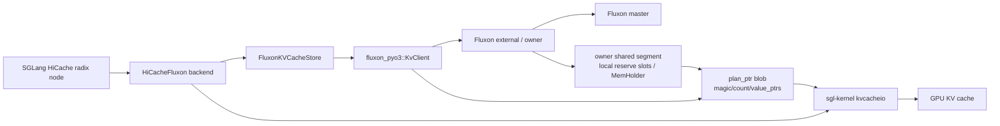
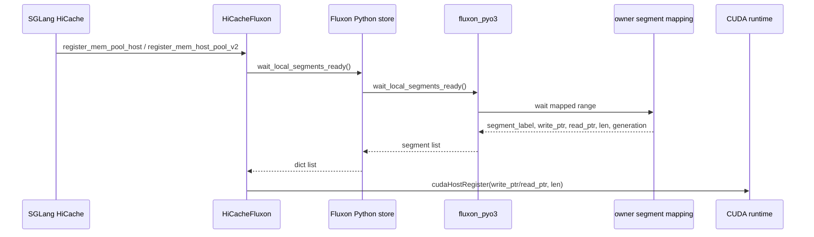
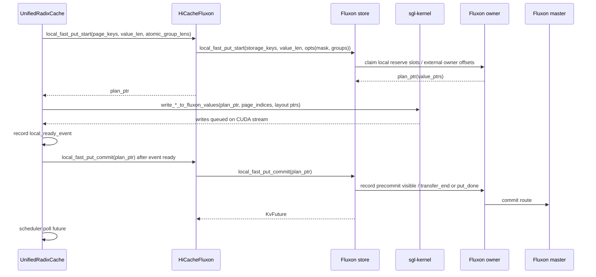
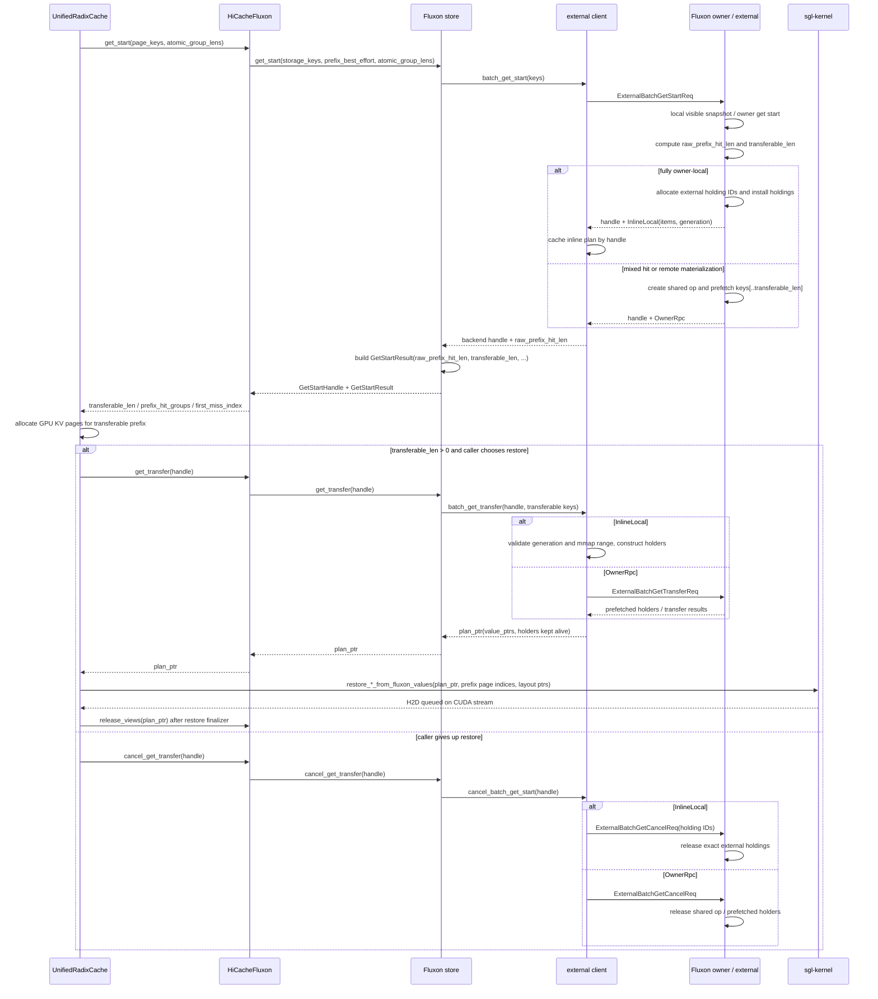
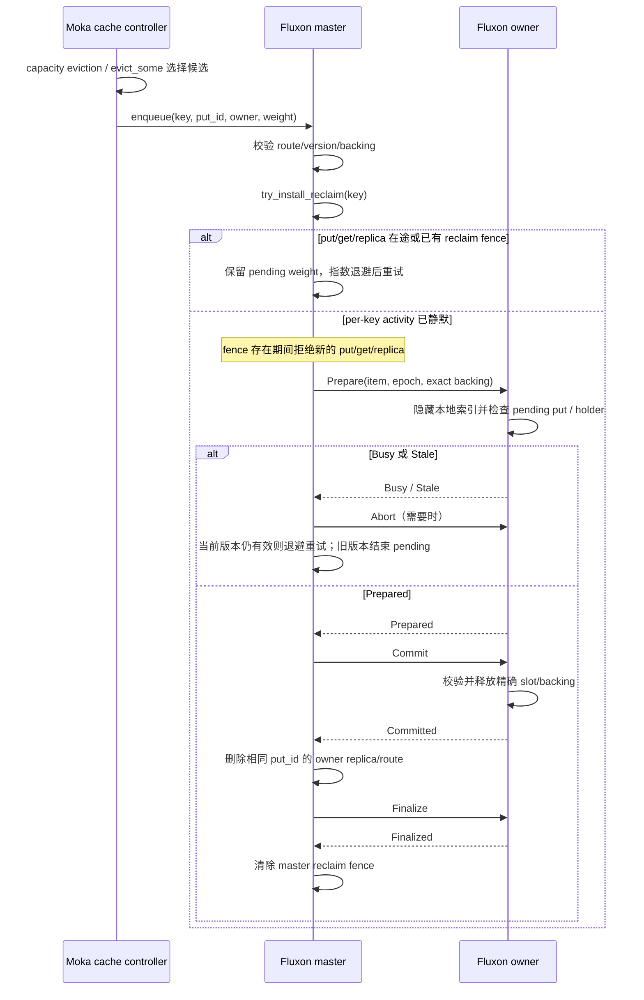
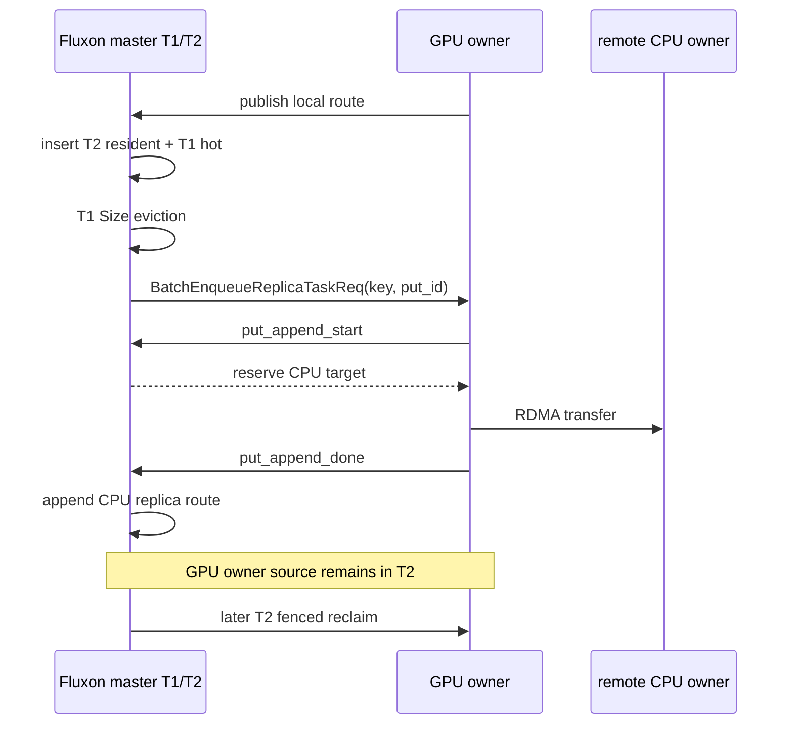
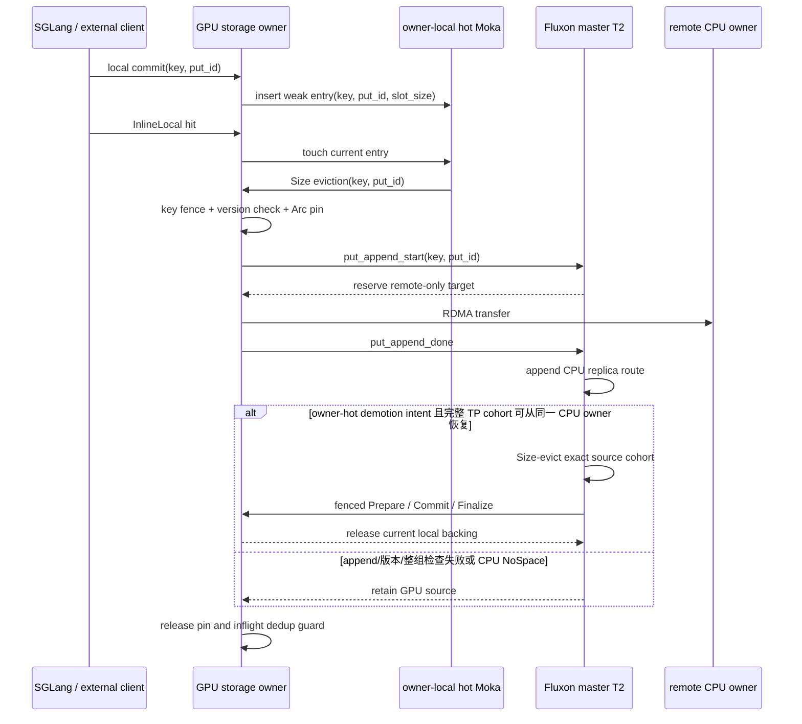

# SGLang Fluxon KV 集成设计

## 背景与目标

本文说明开源仓库中 SGLang HiCache 接入 Fluxon KV 的 hostless 实现设计，聚焦接口契约、状态归属和生命周期边界。本文不是通用 `FlatDict` KV API 的完整说明。

稳定结论：本集成的目标是把 SGLang HiCache + Mooncake 形态下分裂的 L2/L3 KV Cache 收敛到 Fluxon 统一管理的本机/远端 KV 层。Fluxon 需要同时具备两类能力：一类是 `key -> value` 的分布式缓存、路由、版本和生命周期能力；另一类是 HiCache L2 所依赖的 hostless 数据面能力，也就是让 SGLang native kernel 直接在 GPU KV cache 和 Fluxon 管理的 host value memory 之间搬运数据。

关键 insights 先集中列在这里，后文围绕这些结论展开接口、状态和时序设计：

- **L2/L3 分离是工程解耦选择，但会带来资源冗余和 L2 全局不可见**
  - 因果链：HiCache L2 留在推理框架内，Mooncake L3 作为外部 backend，能降低接入复杂度；代价是同一类 KV page 被两套系统分别索引、驻留、驱逐和释放。同一批 page 可能同时驻留在本机 L2 和外部 L3，且其它 worker 或其它节点不能通过统一 route 判断本机 L2 page 是否可复用。
  - 本设计落点：把逻辑 L2/L3 收敛到 Fluxon local side / remote side，用一套 owner、holder、route、commit/release 管理同一批 page。page key 在 Fluxon master/owner 中形成统一路由；只有 commit future 成功后，跨 worker 和跨节点复用才把该 page 视为可见。
- **同机 worker 缺少共享内存快路径**
  - 因果链：多个 SGLang worker 容易各自维护后端 segment、本机缓存副本和独立 pin/release 状态；同机交接也可能绕行后端协议。
  - 本设计落点：同机 worker attach 到同一个 Fluxon owner shared segment，通过 holder 引用管理本机可见 value 的生命周期。
- **统一 L2/L3 需要分布式 KV 能力**
  - 因果链：Mooncake 这类分布式 KV backend 的目标仍然成立：KV Cache 需要利用远端 CPU 内存，尤其是无推理负载机器上的闲置内存，作为 shared backing。只用本进程数组或本机缓存，无法统一索引、放置和复用这些远端闲置内存。
  - 本设计落点：Fluxon 保留 `key -> value` route、inflight 判重、commit future 和 local/remote 放置能力，把远端闲置 CPU 内存纳入 remote side，同时把本机 L2 纳入同一套 owner/holder 生命周期。
- **保留 L2 低延迟需要 kernel 直连内存**
  - 因果链：普通 `put/get(key, bytes)` KV 接口需要在 CPU 侧 materialize payload、查地址、组织拷贝或拆装 bytes；长上下文下如果再按 page 和 layer 展开，会形成 `page_count * layer_count` 级别的 CPU 控制面循环。
  - 本设计落点：Fluxon 只构造 `plan_ptr(value_ptrs)`，SGLang native kernel 直接在 GPU KV cache 和 Fluxon host value memory 之间搬运 bytes。
- **KV Cache 适合 write-back 最终一致性，最终目标是极致化这条路径**
  - 因果链：page value 按不可变对象使用，缓存副本可丢失；写回失败只会降低命中率，不改变推理正确性。因此优化重点应放在缩短 write-back 和 restore 的热路径，而不是把每次缓存写回做成强同步持久写。
  - 本设计落点：native write 完成后异步推进 route commit，`KvFuture` 成功前不作为跨 worker / 跨节点 shared backing；写入侧减少同步等待、CPU 循环和中间 bytes 包装，读取侧先规划 prefix，再只 materialize 可恢复前缀。
- **需要适配 SGLang KVCache 特化接口**
  - 因果链：SGLang KVCache restore 不是普通逐 key `get`，而是面向一批有序 page keys 的 prefix restore。它需要一次性回答“这一批最多恢复到哪里”，并且不能切开一个 radix node 对应的 atomic group。batch 化还能减少逐 key 调用、查表、锁和跨边界调度开销。
  - 本设计落点：Fluxon hostless get 以 batch 为单位计算 `raw_prefix_hit_len`、`transferable_len` 和 `prefix_hit_groups`。`get_start` 合并存在性 / prefix 判断和可恢复前缀的数据拉取启动，返回 handle 和 prefix；`get_transfer` 再消费 handle，把可恢复前缀转换成 readable `plan_ptr(value_ptrs)`。

### Mooncake 对齐实验给出的性能约束

2026-07-12 的三机对齐实验使用两台 TP=2 GPU 节点和一台纯 CPU 节点，标称容量均为
GPU0/GPU1/CPU = 128/128/256 GiB，同一批 1152 个 agent 请求中，原版 SGLang +
Mooncake 达到 6.9192 QPS，Fluxon E15 为 3.5134 QPS。Mooncake 没有本设计的 Put
atomic-group admission；它在本轮也没有进入驱逐区。因此该结果证明 group 完整性是 CPU
副本可消费性的必要条件，但不是这轮端到端差距的唯一来源。

| 观测 | Fluxon E15 | Mooncake 对齐轮 | 设计约束 |
| --- | ---: | ---: | --- |
| 总命中率 | 44.57% | 93.05% | 先对齐实际 payload 容量和驱逐水位，再比较 group 策略。 |
| cache hit tokens | 12,794,304 | 26,713,408 | Fluxon 多重算 13,919,104 tokens，是吞吐差距主体。 |
| 单 GPU 有效 payload 驱逐点 | 约 57.6 GiB | 本轮约 106 GiB 且未驱逐 | slot 内部碎片和过早水位不能隐藏在相同标称容量后面。 |
| load-back 平均耗时 | 57.1 ms | 5.99 ms | 容量问题消除后，仍需优化 `kernel + layer_first` 读取路径。 |

E15 的 4,718,592-byte value 被旧 slot class 扩成 8 MiB，payload 利用率 56.25%；再叠加
旧 Moka 0.8 水位，每个 128 GiB GPU owner 只承载约 57.6 GiB payload 就开始驱逐。
失败候选立即回插又导致 571 万次请求区间 reclaim candidates 中只有约 4.59 万次成功。
本设计因此把 exact-fit slot、可配置水位和失败候选退避视为容量控制面的基础正确性，不能
用新增 atomic group 掩盖这些问题。完整实验设置、计数和日志位置记录在
`sglang_fluxon_agent_experiments.md`。

### 核心实现思路

核心实现按上面的 insight 逐条落到接口和状态边界：

- **对应 L2/L3 分离带来资源冗余和 L2 全局不可见**
  - 实现思路：把 L2/L3 从两个后端系统收敛成 Fluxon 的 local side / remote side。local side 承接本机 shared segment、reserve slots 和 holder；remote side 承接跨 owner / 跨机器 KV 数据面。
  - 主要落点：Fluxon master/owner route、`MemHolder`、commit/release 生命周期。
- **对应同机 worker 缺少共享内存快路径**
  - 实现思路：一台机器运行一个 Fluxon owner，同机 SGLang worker 以 external/client attach 到同一个 owner shared segment。worker 只注册本进程 CUDA context 可见的 mapping，底层内存归属和释放由 owner 管理。
  - 主要落点：`wait_local_segments_ready()`、owner shared segment、CUDA host registration。
- **对应统一 L2/L3 需要分布式 KV 能力**
  - 实现思路：继续保留类似 Mooncake 的分布式 KV 目标，用 page key 做全局命名，用 route 和 version 定位本机 owner 或远端 owner，把无推理负载机器上的闲置 CPU 内存作为可放置、可复用的 remote side backing。inflight 判重和 commit future 约束写入发布，避免远端共享副本提前可见。
  - 主要落点：Fluxon master route、local/remote owner 放置、`local_fast_put_start` reservation、`local_fast_put_commit` 发布。
- **对应保留 L2 低延迟需要 kernel 直连内存**
  - 实现思路：在保留分布式 `key -> value` KV 语义的前提下，把普通 `put/get` 的数据面拆成两条 hostless 两阶段路径。Fluxon 不接管 KV page 内部 layout，只提供 key 路由、holder 生命周期和 `plan_ptr(value_ptrs)`。
    - `plan_ptr` 协议：Fluxon 和 SGLang kernel 之间只共享一段短生命周期 plan blob。blob 里保存本次 batch 的 `value_ptrs[]`；Fluxon 负责这些地址的分配、可见性和 holder 生命周期，SGLang kernel 负责按自己的 KV layout 解释并读写这些地址。
    - Put：`put_start -> native write -> put_commit` 构成写入闭环。`put_start` 本质上为本次 batch 分配 Fluxon 管理的 value memory，并返回 `plan_ptr(value_ptrs)`；SGLang native write kernel 直接往这些地址写入 GPU KV bytes；`put_commit` 在 kernel 写完后通知 Fluxon，把这些 slots 发布为可路由的 KV value。
    - Get / restore：`get_start -> get_transfer -> native restore -> release_views` 构成读取闭环。`get_start` 先计算连续安全前缀；`get_transfer` 把可恢复前缀 materialize 成 readable `plan_ptr(value_ptrs)` 并持有 holder；SGLang native restore kernel 直接从这些地址恢复 GPU KV cache，完成后 `release_views` 释放 plan 引用。
  - 主要落点：plan blob ABI、`value_ptrs[]`、`local_fast_put_start/local_fast_put_commit`、`get_start/get_transfer`、SGLang `write_*_to_fluxon_values` / `restore_*_from_fluxon_values`。
- **对应 KV Cache 适合 write-back 最终一致性**
  - 实现思路：KV Cache 的不可变、可丢失语义天然对应 Fluxon 的 master / owner / external 三层架构。master 管全局 route 和最终可见性，owner 管本机共享内存和 holder 生命周期，external 是 SGLang worker 的热路径接入层。
    - Put：native write 完成后先更新 external / owner 本地可见索引并返回 `KvFuture`，后台再推进 master route commit。`KvFuture` 成功前只表示本机 write-back 进入提交流程；失败时清理本地在途状态，退化为后续 cache miss。
    - Get / restore：优先查询 external / owner 本地热路径；本地 miss 时再进入远端 prefetch 和 restore。读取只 materialize 连续安全前缀，失败时 rollback 或按 miss 继续。
  - 主要落点：master route、owner shared segment、external local visible index、`KvFuture`、`get_start/get_transfer/release_views`。
- **对应适配 SGLang KVCache 特化接口**
  - 实现思路：把 restore 查询建模成 SGLang KVCache 专用的 batch prefix planning，而不是逐 key 独立 get。
    - Reject inflight / exist：KV page 按不可变缓存对象写回，重复 page key 不应产生第二份并发写入。`local_fast_put_start` 固定使用 `reject_if_inflight_same_key` 和 `reject_if_exist_same_key`，在分配 writable memory 前拒绝在途或已存在的同 key value，避免重复写回和未提交数据被误发布。
    - Prefetch 对应 `get_start`：`get_start(keys, prefix_best_effort, atomic_group_lens)` 按 key 顺序完成存在性 / prefix 判断。全 owner-local 批次直接返回 `InlineLocal` holder metadata；混合命中或需要远端 materialization 的批次启动 `keys[..transferable_len]` 的后台 prefetch transfer。
    - Batch 和 group 对齐：`get_start` 按 atomic group 边界把 `raw_prefix_hit_len` 收敛成 `transferable_len`；`get_transfer` 只消费这个 handle 对应的 `InlineLocal` 或 `OwnerRpc` 有限分支，并构造 batch 级 readable `plan_ptr(value_ptrs)`，保证 kernel restore 看到的是连续、完整、可回滚的 readable batch plan。
  - 主要落点：`reject_if_inflight_same_key`、`reject_if_exist_same_key`、`GetStartResult`、`atomic_group_lens`、`raw_prefix_hit_len`、`transferable_len`、`prefix_hit_groups`、`get_start/get_transfer`。

因此，本设计要统一的是 L2/L3 的对象归属、可见性和生命周期，同时保留 L2 路径的低延迟数据面。单独替换成普通远端 KV 会丢掉 HiCache L2 的 kernel 直连能力；单独保留本地数组或进程内缓存，又无法让 L2 进入全局命中、驱逐和跨节点复用链路。

当前调用链主要分为三条主线：

- 写入侧：`local_fast_put_start -> SGLang native write -> local_fast_put_commit`。
- 读取侧：`get_start -> get_transfer -> SGLang native restore -> release_views`。
- 放弃读取侧 restore 时：`cancel_get_transfer` 释放 `get_start` 持有的资源。

这个集成把 SGLang 逻辑上的 L2/L3 缓存落到 Fluxon 统一管理的本机/远端 KV 层中。这样可以用同一套 owner、holder、commit/release 语义管理 KV page，减少传统 L2 host cache 与 L3 backend 分属不同系统时产生的同机重复缓存和生命周期割裂。

常见部署下，一台机器启动一个 Fluxon owner；同机多个 GPU 对应的多个 SGLang worker 进程通过 external/client attach 到同一个 owner shared segment。相比一个 SGLang 进程一个后端 segment、进程间不共享后端 segment 的形态，Fluxon 把同机 host/shared memory、owner local reserve slots 和 holder 生命周期放到同一个 owner 生命周期模型里。这样多个 SGLang worker 可以通过同一个 owner segment 获得本机快速可见性和受控的本地可写内存供给，减少各进程为了各自安全边界重复持有 KV、固定预留 segment 或独立维护 pin/release 状态带来的浪费。

## 范围边界

| 范围 | 当前结论 |
| --- | --- |
| SGLang hostless 写入 | 已接入。SGLang 通过 `local_fast_put_start` 取得一批可写 host value 地址，native kernel 写入后再调用 `local_fast_put_commit` 提交。 |
| SGLang hostless 读取 | 使用 `get_start/get_transfer/release_views`。`get_start` 先计算连续可恢复前缀，`get_transfer` 再把可恢复前缀转换成 readable `plan_ptr`。 |
| Fluxon value layout | Fluxon 不理解 KV page 内部布局；只按 `key + value_len` 管理连续字节。 |
| SGLang node 状态 | SGLang 的 `storage_*` 字段是调度层状态，不等同于 Fluxon master route；跨节点复用以 Fluxon commit future 成功为准。 |

## 总体架构



这里有两个层次：

- KV 语义层：SGLang 传入 page key，Fluxon 对外保存 `key -> value`。
- hostless 数据层：Fluxon 返回 `plan_ptr`，SGLang native kernel 根据 blob 里的 `value_ptrs[]` 直接执行 GPU/host 数据传输。

从缓存物理层级看，Fluxon 把传统 L2/L3 逻辑抽象落到 local side / remote side：local side 覆盖本机 GPU KV、owner shared segment、owner local reserve slots 和 `MemHolder`；remote side 覆盖跨 owner 或跨机器的数据面。多个 SGLang worker attach 到同一个 owner segment 时，同机 KV bytes 不需要按 worker 进程重复保存在多个后端 segment 中。

`plan_ptr` 只是一轮 backup 或 restore 的短生命周期 carrier。它不能作为 key、缓存地址、跨进程句柄或长期状态保存。

## 公共契约

本节只列 SGLang HiCache hostless 接入 Fluxon KV 时直接依赖的接口。

| 接口 | 层级 | 契约 |
| --- | --- | --- |
| `wait_local_segments_ready()` | Fluxon + SGLang 集成 | 返回当前进程可见的 local segment mapping，供 SGLang 做 CUDA host registration。 |
| `local_fast_put_start(keys, value_len, opts)` | SGLang hostless 写入 | 为一批等长 values 准备可写地址，返回 put `plan_ptr`。 |
| `local_fast_put_commit(plan_ptr)` | SGLang hostless 写入 | 在 SGLang native kernel 写完 `value_ptrs[]` 后消费 put plan，把对应 slots 提交为 Fluxon KV route，返回 `KvFuture`。 |
| `put_abort(plan_ptr)` | SGLang hostless 写入 | 在 commit 前释放 put plan、key reservation 和 local reserve slot lease。 |
| `GetStartResult` | SGLang hostless 读取 | 描述连续命中前缀、可传输长度、atomic group 命中数和第一个 miss 位置。 |
| `GetStartHandle` | SGLang hostless 读取 | 持有一次 get-start 结果和 backend handle；必须被 `get_transfer` 消费或被 `cancel_get_transfer` 取消。 |
| `get_start(keys, prefix_best_effort, atomic_group_lens)` | SGLang hostless 读取 | 按 key 顺序计算连续命中的 prefix，并返回 `GetStartHandle`。 |
| `get_transfer(handle)` | SGLang hostless 读取 | 消费 handle 的可传输前缀，执行必要 transfer，并返回 readable `plan_ptr`。 |
| `cancel_get_transfer(handle)` | SGLang hostless 读取 | 放弃未 transfer 的 `GetStartHandle`，释放 get-start 期间持有的 owner/external 资源。 |
| `release_views(plan_ptr)` | SGLang hostless 读取 | 释放 get-transfer 产生的 readable plan，丢弃其持有的 holder 引用。 |

`PutOptionalArgs` 在 SGLang hostless 写入路径中的语义如下：

| 字段 | SGLang 使用方式 |
| --- | --- |
| `reject_if_inflight_same_key` | 固定开启，避免同一 page key 并发写回造成重复 inflight put。 |
| `reject_if_exist_same_key` | 固定开启，SGLang 把重复 key 当作已写回或冲突重试处理。 |
| `write_through` | 当前配置决定提交策略；调用方显式传入时 Fluxon 必须按字段语义执行。 |
| `make_replica_task` | owner-local write-back 成功后的 batch 级异步副本总开关。 |
| `make_replica_task_mask` | `local_fast_put_start` 的可选逐 key 副本准入结果；长度必须与 `keys` 相同。 |
| `atomic_group_lens` | `local_fast_put_start` 有序 key batch 的原子分组；每项必须大于 0，总和必须严格等于 `keys` 长度。组内副本准入必须一致。 |
| `lease_id` | 当前 SGLang hostless 主线不依赖 lease。 |

## Key 与组件命名

SGLang 传给 Fluxon 的 key 必须先经过 backend namespace 处理：

```text
storage_key = key_prefix + ":" + logical_key
logical_key = page_hash + optional_component_suffix + config_suffix + optional_extra_backend_tag
```

规则：

- page hash 是 SGLang prefix 复用和 Fluxon KV 存取的共同语义 ID。
- `PoolName.KV` 使用默认 component；Mamba 等额外 component 通过 suffix 区分。
- `config_suffix` 编入模型名、TP/PP 等会影响 page layout 的维度，避免不同运行配置复用同一批 physical values。
- `extra_backend_tag` 用于同一集群内隔离实验或实例，不改变 Fluxon KV 的值格式。

Fluxon 只看最终 `storage_key`。page 内部如何拆成 K/V layer、MLA tensor 或 Mamba state，由 SGLang kernel 参数解释。

## Segment Registration

hostless 读写依赖 SGLang 进程可访问的 Fluxon owner segment 已经完成 CUDA host registration。

常见部署中，同一台机器上的多个 SGLang worker 连接同一个 Fluxon owner，并映射同一个 owner shared segment。每个 SGLang 进程仍需要在自己的 CUDA context 中完成 host registration；底层内存归属、holder 引用和回收由 owner 统一管理。



`wait_local_segments_ready()` 返回的 item 至少包含：

| 字段 | 含义 |
| --- | --- |
| `segment_label` | owner 本地一般为 `cpu:0`；external attach owner 时为 `external_owner:0`。 |
| `write_ptr` | 当前进程可写映射地址。 |
| `read_ptr` | 当前进程可读映射地址，存在时也可注册。 |
| `len` | 映射长度。 |
| `generation` | owner 启动代际，用于拒绝过期 holder 或 mapping。 |
| `node_id` | segment 所属 Fluxon node。 |

SGLang external-client 模式要求看到 `external_owner:*` segment。注册失败时必须同步报错，不能退回到未注册 host memory 的 direct H2D path。

## Plan Blob ABI

`plan_ptr` 是 Fluxon 返回给 SGLang 的临时句柄，本质上是一段 plan blob 的首地址。SGLang native kernel 通过 `plan_ptr` 找到 blob，再从 blob 里读取本次 batch 对应的 value 地址表。

引入 plan blob 的目的不是单纯定义一个新句柄，而是把 KV 数据面的控制面展开从热路径中移走。实际测试中，如果 KV 接口用 Python dict/list 传递 page、layer 和 value 地址信息，或者用 C++ 结构体承载同等信息，调用链仍然会在 Python 层或 C++ 层按 `page_count * layer_count` 做大量遍历、校验和拷贝任务组织；长上下文场景下，这部分 CPU 控制面开销会被显著放大，直接抬高 backup / restore 延迟。

因此这里需要一套足够扁平、稳定、可被 native kernel 直接消费的协议：Fluxon 只把本次 batch 已经分配或 materialize 好的 value 起始地址压成 `value_ptrs[]`，通过 `plan_ptr` 交给 SGLang kernel；kernel 再按自己的 KV layout 参数解释这些地址，并直接发起 GPU KV cache 和 Fluxon host value memory 之间的搬运。对 backup 来说，这条路径让 kernel 直接把 GPU KV bytes 写到 CPU host value memory；对 restore 来说，则从这些 host value 地址恢复回 GPU KV cache。这正是开头“hostless 数据面能力”的落点：Fluxon 管地址、路由和生命周期，SGLang kernel 管 KV layout 和真实数据搬运。

plan blob 是 Fluxon 在 `local_fast_put_start(...)` 或 `get_transfer(...)` 时创建的一段连续 host memory，格式固定：

```c
uint64_t magic;             // 固定校验值，确认 plan_ptr 指向 Fluxon plan blob
uint64_t count;             // value_ptrs 的数量，也就是本次 batch 的 page 数
uint64_t value_ptrs[count]; // 每个 page 对应的 Fluxon value 起始地址
```

如果 SGLang 一次写入或恢复 10 个 page，Fluxon 会创建一个 blob，并返回一个 `plan_ptr`：

```text
plan_ptr -> blob 起始地址

blob[0]  = magic
blob[1]  = 10
blob[2]  = value_ptr_0
blob[3]  = value_ptr_1
...
blob[11] = value_ptr_9
```

`magic` 不是 KV value 地址，只是固定校验值；`value_ptr_0 ... value_ptr_9` 才是 Fluxon 为这些 page 准备的 value 起始地址。它们是当前进程可访问的绝对地址，不是偏移量。

`value_len` 不写入 blob。Fluxon 只负责按 `value_len` 分配每个 value 的连续字节区间，并把起始地址放进 `value_ptrs[]`；每个 value 内部如何切成 K/V、layer、MLA 或 Mamba state，由 SGLang 调用 write/restore kernel 时显式传入 layout 参数。

`plan_ptr` 只在当前进程、当前 batch 生命周期内有效。`local_fast_put_commit(plan_ptr)`、`put_abort(plan_ptr)` 或 `release_views(plan_ptr)` 后，Fluxon 会清理对应 plan，SGLang 不能继续使用这个 `plan_ptr`。

## Backup 时序

hostless backup 的核心约束是：Fluxon 负责 GPU KV cache 之下的本机/远端 KV 层的地址分配、route 提交和生命周期管理，但真正的 KV bytes 由 SGLang native kernel 从 GPU KV cache 写入。因此 Fluxon 不能在收到 key 后立刻发布 KV route；它必须先完成 key reservation、put id 分配和 owner-local reserve slot claim，把稳定可写的 `value_ptrs[]` 通过 `plan_ptr` 返回给 SGLang。SGLang native kernel 写完这些地址后，`local_fast_put_commit` 才能把这些 slots 提交为 resident values，并发布 Fluxon KV route。

这条 backup 路径按 write-back 最终一致性设计：native write 完成后先进入本地可见和后台 commit 流程，跨 worker / 跨节点可见性以 `KvFuture` 成功为准。提交失败不会破坏推理语义，只会让对应 page 失去 shared backing；上层清理 `storage_*` 状态后按 cache miss 处理。

### 本地主副本与异步副本控制

`write_through` 和 `make_replica_task` 是两个独立契约。`write_through` 选择同步远端放置还是 owner-local write-back；`make_replica_task` 只控制 owner-local commit 成功后是否创建异步副本任务。SGLang 的纯本地模式必须使用 `write_through=false, make_replica_task=false`，不能把关闭副本等同于开启 write-through。

| 模式 | `write_through` | `make_replica_task` | 主数据 | 异步副本 |
| --- | --- | --- | --- | --- |
| local-only | `false` | `false` | 当前 GPU owner | 无 |
| local + remote replica | `false` | `true` | 当前 GPU owner | 由 master 的 `replica_task_placement` 选择 |
| write-through | `true` | 不参与异步副本决策 | master 直接选择远端 target | 无额外异步副本任务 |

`PutOptionalArgs.make_replica_task` 必须贯穿 Python store、PyO3 和 Rust put request。兼容层如果只识别 `write_through` 而丢弃该字段，SGLang 即使记录 `replica_admitted=0`，Rust 仍可能按旧默认创建副本；因此启动检查必须同时确认 Python `PutOptionalArgs` 和 `fluxon_pyo3.KvClient.local_fast_put_start` 的签名都包含 `make_replica_task`。

page admission 还要求 `make_replica_task_mask` 贯穿同一条链路。mask 缺省时，Fluxon 把 batch 级 `make_replica_task` 广播到所有 keys，保留 eager-all 和 local-only 的标量契约；mask 存在时，其长度必须严格等于 `keys` 长度，实际逐项决策为 `!write_through && make_replica_task && make_replica_task_mask[i]`。Python store 在调用 PyO3 前检查容器、长度和元素类型，PyO3 在任何 reserve 或 RPC 之前再次检查长度。external 模式把结果写入每个 `ExternalBatchPutStartItemReq.make_replica_task`；owner 模式把整份 mask 保存在 staged plan 中，commit 时按相同 key 顺序写入每个 `OwnerLocalPublishItem.make_replica_task`。

Put 与 Get 使用同一种 `atomic_group_lens` 分区语义。SGLang hostless backup 把一个 radix node 的全部 page keys 标成一个 atomic group；副本策略只能整组 admitted 或整组 skipped。`min_replica_pages` 选择完整 group，允许为了满足最小值而超过它；`max_replica_pages_per_batch` 是硬上限，只保留能够完整装入预算的 group，不能截取 group 的前几页。ratio/score 策略先得到 group 级概率和优先级，再展开为组内全 true 或全 false 的 per-key mask。

该契约做双层 fail-fast。Python store 要求 group lengths 是严格的 `list[int]`、每项大于 0、总和等于 key 数，并拒绝组内混合 mask；PyO3 在任何 owner slot reserve 或 external RPC 前重复同样校验。未传 `atomic_group_lens` 时，每个 key 视为长度 1 的独立 group，保留已有调用方的逐 key 行为。存在性过滤或冲突重试若只能留下半个 group，SGLang hostless 路径直接放弃该次 backup，不能把剩余 keys 重新声明成一个完整 group。

标量降级不能用于 page admission。若一批中只有一页 admitted，把 mask 折叠为 `any(mask)` 会让整个 batch 都创建副本；逻辑 admission 日志与物理 CPU transfer 因而失配。启动自检必须同时确认 Python `PutOptionalArgs` 和 PyO3 签名包含 `make_replica_task_mask`，端到端验收则比较 SGLang admitted page 数、master CPU target 数和 GPU owner 成功 transfer 数，而不能只看 admission 日志。

SGLang 的 admitted 只表示该 atomic group 通过客户端准入并为组内 pages 请求创建副本，不表示目标 owner 已经接收整组。当前 replica actor 仍逐 key 完成 transfer/append；相同 key 的并发副本可能在目标侧返回 `KeyBeingWritten`。因此 Put 原子准入消除了策略主动制造的稀疏组，但尚未把远端复制提交升级成组事务。数据面仍需检查“成功 `local_fast_put_start` 行中的 admitted 数 = 成功 transfer 数 + 可逐项对账的目标侧拒绝数”，并继续要求“成功 transfer 数 = `appended=true` 数 = master CPU target 数”。全局 admission 累计计数可能包含随后被 backend 拒绝并重试的尝试，不能直接作为已 staged page 数或物理复制分母。

CPU-only 副本模式不新增第二个客户端开关。客户端仍设置 `make_replica_task=true`，master 再通过 `restrict_to_remote_only_node_roles=true` 和 `remote_only_node_roles=["remote_cache"]` 把 replica target 限定到 CPU owner。若 strict 候选为空，任务返回 NoSpace，不回退到其它 GPU owner。

端到端验收以实际数据面计数为准：local-only 要求 GPU owner 的 `put_transfer success`、`replica task append done` 和 master `replica_task_target_counts` 全部为 0；CPU-only 副本要求两台 GPU owner 的 transfer/append 总数严格等于 master 的 CPU target 数，并且 GPU target 为 0。仅检查 SGLang 配置日志不足以证明副本策略已经生效。

### 弹性本地侧预分配

弹性本地侧预分配对应 owner 本地写入预留池。它是在 owner shared segment 中为 SGLang hostless put 预先划分的 writable slots。`local_fast_put_start` 从这些 slots 中为本次 put 分配地址，并把地址写入 `plan_ptr(value_ptrs)` 返回给 SGLang native kernel。此时 slot 只处于 reserved/prepared 状态，还没有绑定为 Fluxon KV 的正式 `key -> value` route。

这个 pool 是共享 owner segment 上的弹性本地可写内存供给层。它让多个 SGLang worker 都能快速取得受 owner 生命周期管理的 `value_ptrs[]`，同时避免为每个 worker 固定切出长期独占的后端 segment。reserve slot 不足时可以按需求补充 grant，空闲后再按 cooldown 回收。

对象含义：

| 对象 | 含义 |
| --- | --- |
| grant | owner 侧一次申请的大块本地内存，当前固定为 `512 MiB`。 |
| slot | grant 内按 `slot_size` 切分的小块；一个 slot 承载一个 Fluxon value。 |
| slot lease | `local_fast_put_start` 为本次 batch 临时 claim 到的一组 slots；失败或 abort 时必须释放。 |
| value pointer | slot 的起始地址，会写入 plan blob 的 `value_ptrs[]`，供 SGLang kernel 直接写入。 |
| resident value | `local_fast_put_commit` 后由 slot 构造出的本地可读 value。 |
| route | master/owner 确认后的 key 到 value 位置映射；route 成功后该 value 才是全局可见的 KV replica。 |

slot 生命周期：

```text
Free
  -> Prepared             // local_fast_put_start claim slot
  -> PendingLocalVisible  // local_fast_put_commit 开始，本地 resident value 已记录为 pending visible
  -> Committed            // put_done 成功，route 引用该 slot
  -> Free                 // route 和 holder 引用都释放后回收
```

如果 native write 失败，调用方必须执行 `put_abort(plan_ptr)`，Prepared slots 会回到 Free。`local_fast_put_commit` 成功返回后，slot 是否能释放由 route 引用和 holder 引用共同决定；只要 master/owner route 或 `MemHolder` 仍引用该 slot，底层 grant 就不能释放。

当前容量策略：

| 项 | 当前实现 |
| --- | --- |
| grant 物理粒度 | `OWNER_LOCAL_RESERVE_GRANT_QUANTUM_BYTES = 512 * 1024 * 1024` |
| 最小 slot size | `4 KiB` |
| slot size 计算 | `align_up(max(value_len, 4 KiB), 4 KiB)`；按页对齐 exact-fit，不再向上取整到 2 的幂。 |
| slot 上限 | `slot_size <= 512 MiB` |
| refill 触发 | 当前 slot class free slots 不足时登记 pending demand 并唤醒 rebalance actor。 |
| 预期容量预热 | owner 可配置 `owner_local_reserve_expected_capacity: {value_len, payload_capacity_bytes}`。启动时按 grant 内真实可用 slots 计算并申请所需 grants；SGLang 启动脚本必须等预热完成。 |
| shrink 下限 | 配置预期容量后，rebalance 不把该 slot class 缩到 `expected_grants` 以下；业务瞬时 pending demand 仍可临时增加 grant。它不是物理上限。 |
| 默认等待 | soft wait `10 ms`，hard timeout `10 s`。hard timeout 保护一次 refill/reclaim 事务，不用于掩盖 master 调度饥饿。 |
| shrink 单位 | 整个 grant；不做 live grant compaction。 |
| Moka 计费权重 | committed slot 使用 4 KiB 对齐后的实际 `slot_size`，而不是原始 `value_len`；容量驱逐因此对应真实内存占用。 |
| Moka 容量水位 | master `replica_cache_capacity_ratio`，合法范围 `(0, 1]`，默认 `0.95`；它只决定常规冷条目选择水位，不改变 owner segment 配置容量。 |
| 常规容量驱逐 | Moka 到达配置容量后选择冷条目，并通过 eviction listener 进入安全回收流程。Moka 只负责选择候选，不直接释放 owner backing。 |
| 物理 NoSpace 兜底 | refill 申请不到 `512 MiB` grant 时，按 `slot_size * required_free_slots` 计算目标权重，扣除已经在途的回收权重后调用 `evict_some(additional_weight)`；随后按 route 扫描可安全释放的 slots。 |
| 容量不变量 | `evict_some` 只驱逐一部分条目，不修改 Moka `max_capacity`，也不修改 owner 配置容量。 |
| route 维护反压 | route 发布后的 prefix-index/Moka 更新进入容量 512 的有界队列，由单 actor 每批最多处理 512 项；队列满时 `put_done` 等待，避免 metadata/Moka 水位落后于 owner 物理分配并饿死 reserve RPC。 |

Qwen3-VL-8B、TP=2、page size 64 的单 rank K/V value 是 4,718,592 bytes，正好是
4 KiB 的整数倍。exact-fit 后一个 512 MiB grant 可以提供 113 个 slots；旧的
`next_power_of_two` 会把每页扩成 8 MiB，一个 grant 只能提供 64 个 slots。以 128 GiB
owner 为例，旧 `0.8` 水位叠加 56.25% slot payload 利用率后只有约 57.6 GiB 的有效 KV
payload，会在物理 owner 仍有大量空闲时提前驱逐。exact-fit 与 0.95 水位分别解决内部碎片
和过早驱逐；两项都不修改 owner 的 128 GiB segment 容量。

预期容量的 grant 数必须计入每个 grant 尾部不能容纳完整 slot 的碎片，而不能简单用总 payload
除以 512 MiB。计算为：

```text
slot_size = align_up(value_len, 4 KiB)
slots_per_grant = floor(512 MiB / slot_size)
expected_grants = ceil(payload_capacity_bytes / (slots_per_grant * slot_size))
```

Qwen3-VL 本轮 `value_len=4,718,592`、0.8 payload 目标 109,951,162,777 bytes 对应
207 grants；可用 23,391 slots / 110,372,585,472 bytes，实际物理预留
111,132,278,784 bytes。owner 配置容量仍为 128 GiB。配置层会拒绝非正 value/capacity/timeout、
`hard_timeout <= soft_timeout`、value 大于 512 MiB、预热物理容量超过 owner DRAM，以及在
master、external client 或 side worker 上设置 owner-only expected capacity。claim 超时统一
返回 local-reserve timeout 类错误，并用 `stage=claim_turn|refill` 和完整 pool 状态区分等待
claim 顺序与 refill/reclaim 失败。

route 发布与容量记账必须保持有界距离。local-first `BatchPutDone` 可以一次发布上百个 page；
如果每个 page 都独立 spawn prefix/Moka 维护任务，route 已提交和 owner slot 已占用的速度会
超过 Moka 记账速度。此时即使 segment 仍有大量空闲，master 运行时也可能被任务和逐 page
日志占满，使新的 512 MiB reserve RPC 超过 hard timeout。当前实现用一个有界批处理 actor
统一消费 post-route 事件：一次 prefix-index write lock 覆盖整批，随后逐项推进 Moka；消费
前校验当前 route 仍匹配 `put_id + owner replica`。容量 512 的队列同时承担反压边界，不能
改回无界任务生成，也不能用增加 owner 容量代替该控制面约束。

底层物理释放收束在 grant 级别。单个 committed slot 只是 grant 内逻辑索引，不直接拥有释放整块 mmap/registered memory 的权力。

### Fluxon put_start / put_commit 接口设计

Fluxon 的 backup 解法是把普通 KV `put(key, bytes)` 拆成 `put_start -> native write -> put_commit`。这个拆分的核心是接口解耦：Fluxon 先给本次写入分配受 owner 生命周期管理的 value memory，并把地址交给 SGLang；SGLang native/CUDA kernel 负责真正把 GPU KV cache bytes 写入这些地址；kernel 写完后，SGLang 再通知 Fluxon 发布这批 value。这样普通 KV 接口里的 payload materialization、CPU 侧 bytes 拆装和逐 page/layer 拷贝组织都不会进入 backup 热路径。

`put_start` 不是一次可见写入，它的核心结果是内存分配和指针返回。Fluxon 为本次 batch claim owner-local reserve slots，生成 `plan_ptr(value_ptrs)`；`value_ptrs[]` 指向 Fluxon owner segment 中已经准备好的 writable value memory，SGLang kernel 可以直接写这些地址。判重、reservation 和 put id 是保护这次内存分配不被重复写入或提前发布的控制面约束；这些 value 在 `put_commit` 前不会作为可读 route 暴露。

`put_commit` 是 kernel 写完后的通知和发布点。SGLang 在 CUDA write 完成后调用它，Fluxon 消费 put plan，把对应 slots 转成 resident values，并异步推进 route commit。`KvFuture` 成功前，数据只表示本次 write-back 已进入 Fluxon commit 流程；`KvFuture` 成功后，page 才能成为跨 worker / 跨节点可复用的 shared backing。这样 `put_start -> native write -> put_commit` 就构成了 hostless put 的完整闭环。

这套接口拆分直接使用上面的弹性本地侧预分配池：`put_start` 从预分配 reserve slots 中 claim 短生命周期 slot lease，热路径拿到的是已准备好的地址。

| 解法层 | 做什么 | 解决的问题 |
| --- | --- | --- |
| `local_fast_put_start(keys, value_len)` | 从 owner-local reserve slots claim 本次 batch 的 slot lease，分配 writable value memory，并返回 `plan_ptr(value_ptrs)`；key reservation 和 put id 保护这次分配 | 在 native write 前只暴露可写地址，不发布可读 route，避免其它 get 读到尚未写完的 value |
| SGLang native write | SGLang native kernel 根据 `plan_ptr(value_ptrs)` 把 GPU KV page 写入 Fluxon 管理的 host value memory | 避免普通 KV `put(bytes)` 路径在 CPU 侧拆装 payload 和逐 page/layer 组织拷贝 |
| `local_fast_put_commit(plan_ptr)` | 消费 put plan，把已写完的 slots 转为 resident values，推进 transfer / route commit，并返回 `KvFuture` | 把本地写完和全局发布分开；只有 future 成功后，SGLang 才能把 node 标记为 `storage_backed` |
| 弹性本地侧预分配 | owner shared segment 中按 slot size 管理 reserve slots；free slots 不足时按 pending demand 补充 grant，空闲后按 cooldown 回收 | 热路径直接 claim 已准备好的可写地址，避免每个 worker 固定独占 segment，也避免每次 backup 临时分配或注册 host memory |

写入阶段的拆分主要是为了同时满足三个约束：

- 数据面效率：SGLang 不需要先把 GPU KV page 包装成通用 KV payload 再交给后端，而是直接用 kernel 写入 Fluxon 返回的 value 地址。
- 可见性安全：`put_start` 阶段只预留地址，不发布 route；避免其它 get 读到尚未写完或尚未 commit 的 value。
- 容量弹性：本地侧预分配池提供短生命周期 slot lease，而不是为每个 SGLang worker 固定切出长期独占内存；容量不足时由 owner 侧 refill，空闲后按 grant 粒度回收。



hostless backup 默认不依赖 put 前 exists 扫描。重复 key 或在途 key 由 `local_fast_put_start` 的 `reject_if_exist_same_key` 和 `reject_if_inflight_same_key` 准入语义处理；SGLang 上层按冲突错误做重试或跳过。

`local_fast_put_start(keys, value_len)` 的要求：

- `keys` 不能为空。
- `value_len` 必须大于 0，且同一批 keys 共享同一个 value size。
- `atomic_group_lens` 存在时必须由正整数构成，且总和严格等于 `keys` 长度；同组的 `make_replica_task_mask` 值必须完全一致。
- SGLang 的 radix node backup 默认使用 `[len(node_page_keys)]`。过滤已有 key 或冲突重试不能切开该组；无法保留完整组时本次 backup 失败关闭。
- SGLang 必须在 `local_fast_put_commit` 前完成 native write；写入失败时必须调用 `put_abort`。
- `local_fast_put_commit` 只能调用一次；调用后 plan 从 registry 清理，后续只能等待返回的 `KvFuture`。

commit 请求会带上 `len`、`src_offset` 和 target 信息。Fluxon 用这些字段判断本次 value 是否落在当前进程可访问的 owner segment 或 owner-local reserve slot 中；如果需要本地可见索引，`put_done` 会返回 owner 分配的 `local_cache_holder_id`。`MemoryInfo` 和 holder 生命周期在下文说明。

## Prefetch 与 Restore 时序

hostless restore 的核心约束是：SGLang 只能恢复有序 page keys 的连续前缀，并且不能切开一个 radix node 对应的 atomic group。Fluxon 需要先在本机/远端 KV 层里判断这批 keys 的可恢复边界，再把真正可恢复的部分提前 materialize 到当前进程可读的 holder / memory view 中，最后转换成 SGLang kernel 可读取的 `plan_ptr(value_ptrs)`。

因此读取侧分成 prefetch 和 restore 两段。当前实现把 start-to-transfer 计划显式限定为两个分支：

- Prefetch：`get_start(keys, prefix_best_effort, atomic_group_lens)` 按 key 顺序做 local visible check / owner get start，计算 page 级连续命中前缀 `raw_prefix_hit_len`，再按 `atomic_group_lens` 向下收敛成 `transferable_len`。全 owner-local 批次返回 `InlineLocal { items }`：owner 为每个导出 page 安装独立 external holding，并把 offset、len、holding ID 和 owner generation 随 start response 返回；该分支不创建 transfer registry，也不启动后台 transfer。混合命中、master fallback 或需要远端 materialization 的批次返回 `OwnerRpc`，继续由 shared op 保存后台 prefetch 的 holder / transfer result。
- Restore：SGLang 拿到 `transferable_len` 后再决定是否分配 GPU KV pages 并继续恢复。`get_transfer(handle)` 消费 `get_start` 返回的 handle。`InlineLocal` 分支在 external 进程校验 owner generation 和 mmap 范围后直接构造 holders；`OwnerRpc` 分支等待或取得原有 prefetch 结果。两个分支最终都生成持有 holder 引用的 readable `plan_ptr`，随后 SGLang native kernel 使用 `restore_*_from_fluxon_values(...)` 把 Fluxon value memory 拷回 GPU KV cache。

读取阶段拆成 prefetch 和 restore 两步，主要是为了保证：

- prefix 安全：中间 page miss 时，只恢复连续命中的完整前缀，不构造带洞的 GPU KV 状态。
- atomic group 安全：`transferable_len` 不会切开 radix node group，避免恢复半个 node。
- 资源效率：SGLang 在知道可恢复边界后再分配 GPU KV pages。`OwnerRpc` 可以重叠远端 materialization 和 GPU page 分配；`InlineLocal` 省去第二次 owner transfer RPC 和无用后台任务。
- 生命周期安全：`get_transfer` 返回的 plan 持有 holder 引用，直到 `release_views(plan_ptr)` 后才释放，保证 kernel restore 期间 value 地址稳定。



`GetStartResult` 的关键字段如下：

| 字段 | 含义 |
| --- | --- |
| `raw_prefix_hit_len` | 按 key 顺序连续命中的 page 数，未按 atomic group 收敛。 |
| `transferable_len` | 可以交给 `get_transfer` 的 page 数；它不会切开 atomic group。 |
| `prefix_hit_groups` | 完整命中的 atomic group 数。 |
| `first_miss_index` | 第一个 miss page 的 index；全部命中时为 `None`。 |
| `first_miss_group_index` | 第一个 miss 所在 atomic group；全部命中时为 `None`。 |
| `all_hit` | `transferable_len == len(keys)`。 |

生命周期规则：

- `get_start` 成功后，调用方必须二选一：`get_transfer(handle)` 或 `cancel_get_transfer(handle)`；放弃 restore 时必须取消 handle，释放可能已经启动的 prefetch 资源。
- `get_transfer(handle)` 成功后，handle 已被消费；后续由 returned `plan_ptr` 和 `release_views(plan_ptr)` 管理。
- `release_views(plan_ptr)` 必须在 native restore 完成后执行，即使 native restore 失败也要释放。
- `InlineLocal` holding 从 owner 返回 start response 前已经安装；`get_transfer` 把它移交给 returned plan，`cancel_get_transfer` 则携带 holding IDs 精确释放。owner 重启或 generation 不匹配时不能继续使用旧 inline plan。
- `get_start` 只命中部分前缀时，SGLang 只能恢复 `transferable_len` 覆盖的完整 atomic groups，不能构造半个 atomic group 的 GPU KV 状态。
- `get_transfer` 返回 miss / KeyNotFound 时，SGLang 必须放弃本次 restore 并执行 rollback。

## Fluxon 本地可见索引与生命周期

Fluxon client/external 侧会维护当前进程可直接访问的 value 索引，以及 get/put plan 持有的 holder 引用。SGLang hostless 路径主要涉及下面几类状态：

| 状态 | 创建入口 | 生命周期 |
| --- | --- | --- |
| precommit local visible | `local_fast_put_commit` 开始后，由 owner-local reserve slot 对应的 `MemoryInfo` 记录到 `precommit_local_visible_info` | 表示本次 put 的 value 已在当前进程可读，但后台 put commit 尚未最终完成；成功后转为 `get_cached_info` 中的 committed entry，失败或取消时移除。 |
| committed local visible info | put commit 成功后，由 SGLang 进程内的 Fluxon external/client 将 `MemoryInfo` 记录到 `get_cached_info` | 保存 key、put version、`holder_id`、`offset`、`len` 和 owner node；后续 `get_start/get_transfer` 可以复用这份 `MemoryInfo` 构造 readable plan。 |
| inline external holding | owner 判定整个 transferable batch 都在本地可见后，为每个导出 page 分配 external holding ID 并安装 holding | start response 到达 external 后由 handle 缓存；随后必须移交给 `get_transfer` plan 或由 cancel 携带 holding IDs 释放。holding 绑定 owner generation。 |
| get-transfer holder | `get_transfer` 成功后绑定到 readable plan，并由 plan 持有引用 | `release_views(plan_ptr)` 后释放引用；plan 生命周期内 holder 保证对应 value 不被释放。 |

收到 `local_cache_holder_id` 后，SGLang 进程内的 Fluxon external/client 使用 `holder_id`、`offset` 和 `len` 构造 `MemoryInfo`，并记录到自身 `get_cached_info`。`MemoryInfo` 记录当前进程访问该 value 所需的地址信息和释放动作；后续 `get_start` 命中 `get_cached_info` 时，可以直接把这份 `MemoryInfo` 纳入本次 get 结果，`get_transfer` 再把这些 value 地址写入 readable plan。底层内存的回收由 owner route、holder 引用和 owner-local reserve grant 生命周期共同约束。

内部 `MemoryInfo.holder_id` 与 external holding ID 属于两个生命周期域。resident local-reserve page 的内部 holder ID 可以为 0；每次 external export 仍由 owner 分配非零、递增且独立的 holding ID，同一内部 backing 的并发导出也不能复用 ID。这样 cancel/delete ACK 可以按本次 export 精确对账，多个 resident page 不会因内部 ID 相同而覆盖 holding。external 在构造 inline holder 前还必须验证 response generation 与当前 mmap owner generation 一致，并验证 `offset + len` 位于 mapping 范围内。

`precommit_local_visible_info` 只覆盖 commit 进行中的短窗口。put commit 成功并确认 holder 后，会移除 precommit entry 并记录 committed entry；如果 commit 失败，precommit entry 必须被清理，不能作为后续 storage-backed 恢复来源。

## Local-side 主动驱逐与安全回收

local-side 主动驱逐不是在 Moka eviction callback 中直接释放内存。无论候选来自常规 Moka capacity eviction，还是 owner refill 遇到物理 NoSpace 后显式调用 `evict_some`，都必须经过同一套 master/owner 安全回收协议。其外部可见不变量是：已经释放或复用的 backing 不会仍然作为一个可访问 route 提供给新的 put/get/replica；如果暂时无法证明可以安全释放，则候选保持 pending 并退避重试，队列关闭等无法继续推进的路径才把当前版本放回 Moka。

### 触发与职责边界

- Moka 使用 `NodeValueReplicaDesc.weight_bytes` 计费；对于 committed slot，该权重对应真实 `slot_size`。
- Moka 只做冷条目选择。eviction listener 把 `owner_node_id + key + put_id + weight` 放入 safe reclaim queue，不直接 drop `MemHolder`，也不直接释放 slot。
- `evict_some(requested_weight)` 的参数是“希望移除的权重”，不是目标 cache size；它沿 LRU 顺序驱逐到满足请求或没有候选为止，并返回实际驱逐权重。由于条目必须整项驱逐，返回值可以大于请求值。它不会通过临时调低再调高 `max_capacity` 来制造驱逐，因此 owner/Moka 配置容量在调用前后保持不变。
- `eviction_reclaim_pending_weight` 记录已被 Moka 选中、但尚未完成物理回收的权重。NoSpace 兜底只对 `requested_weight - pending_weight` 调用 `evict_some`，避免对同一轮压力重复过量驱逐。
- activity、holder 或短暂 owner Busy 导致候选无法回收时，不立即插回仍然超限的 Moka。该候选继续计入 pending weight，并以 `10 ms` 起步、最大 `1 s` 的指数退避重新进入 safe reclaim queue；route/put_id 已变化时结束 pending，不复活旧版本。这避免同一个热 key 在 eviction 与 reinsert 之间形成高频循环。
- safe reclaim queue 满或关闭时，入口立即回滚 pending weight，并且仅在 route 仍是相同 `put_id`、owner replica 仍 live 时把条目重新插回 Moka；旧版本候选不会被复活。

### 安全回收时序



Master 与 owner 两侧分别承担下面的正确性约束：

| 约束 | 当前实现 |
| --- | --- |
| 并发线性化 | Master 为每个 key 统计 put/get/replica activity。只有三个计数都为零且没有其它 reclaim 时才能原子安装 reclaim fence；安装后新的 put/get/replica 不能取得 activity lease。replica append 在完整任务期间持有 lease，避免远端副本尚未完成时回收 local backing。 |
| 版本隔离 | 每个候选携带 `put_id` 和 reclaim `epoch`。Master 在安装 fence 前、Prepare 后以及删除 route 前重复检查当前 route 仍是同一版本。 |
| backing/slot 防 ABA | committed slot 必须同时匹配 owner、`grant_id`、`slot_index` 和 `slot_size`；旧驱逐请求不能释放新版本或已经复用的 slot。 |
| 现有读者排空 | Owner Prepare 在同一个 key-control lock 下先从 `get_cached_info` 隐藏索引，阻止新本地读者；随后要求 `Arc::strong_count(mem_holder) == 1`。若已有 get/plan 持有引用，则恢复索引并返回 Busy。 |
| 写入冲突隔离 | Owner Prepare 遇到 `local_puts`、`precommit_local_visible_info` 或 `external_pending_puts` 时返回 Busy，不会回收正在写入或尚未发布完成的 value。 |
| 精确物理释放 | Owner Commit 持有 key-control lock，使用 `Arc::try_unwrap` 取得唯一 backing，并再次断言 slot identity 后释放 owner-side committed-slot route、resident holder 和内存引用，使该 slot 可以回到 Free。identity 不一致按内部不变量失败，而不是继续释放未知 backing；整个 grant 的 mmap/registered memory 仍按独立的 grant 生命周期回收。 |
| route 更新顺序 | Owner Commit 释放物理 backing 后，Master 只删除相同 `put_id` 且 backing identity 相同的 replica；这个短窗口仍受 master reclaim fence 保护，对新请求不可访问。Master 更新 route 后才 Finalize owner fence。 |
| 幂等与失败关闭 | Prepare/Commit/Abort/Finalize 都按 `item + epoch` 判定已应用状态。Prepare 或 Commit RPC 不确定时通过 Abort 查询/收敛；如果 owner 已经 Commit，则不能回滚 backing，而是继续删除 route 并 Finalize。Abort/Finalize RPC 失败会退避重试；未收敛时保留 fence，优先阻塞该 key 而不是暴露已释放内存。 |
| 失败候选收敛 | 暂时 Busy 的当前版本保持 pending 并退避重试，不立即插回 Moka；stale route 或版本变化直接结束 pending。只有队列关闭等无法继续推进的路径，才在 route 仍匹配 `put_id` 且 owner replica live 时重新插入，避免旧条目覆盖新版本。 |

从可观察状态看，回收事务允许 Owner Commit 与 Master route 删除之间短暂存在“owner slot 已回收到 allocator、可以复用，但旧 route 对象尚在”的内部状态，但对应 key 的 master reclaim fence 在整个窗口内拒绝新操作；安装 fence 之前已经取得 lease 的 get/put/replica 又必须先结束。因此调用方不会通过该 route 访问已经释放或复用的 backing。

### 副本保留语义

内存/并发正确性与“驱逐后是否仍有另一份可恢复数据”是两个不同契约：

- `OwnerReclaimReason::Reserve` 用于物理 NoSpace 下的 route-scan 回收。它只选择存在另一份非 tomb replica 的 key，因而 local backing 释放后仍有 recoverable replica。
- Moka eviction listener 产生的请求使用 `OwnerReclaimReason::CapacityEviction`。当前实现允许它删除最后一份 cache replica；最后一份被删除时，Master 同时删除整个 route，后续表现为正常 cache miss。这与本文前述“KV Cache 副本可丢失，miss 后重新计算”的缓存语义一致。
- NoSpace 处理会先调用 `evict_some`，再执行 `Reserve` route-scan；其中 `evict_some` 产生的 listener 请求仍属于 `CapacityEviction`。因此不能因为后半段 route-scan 有副本检查，就推导整个 NoSpace 兜底都保证保留 remote replica。
- 因此，当前已经保证并发访问、版本和 slot 复用安全，但没有对所有 `CapacityEviction` 保证“local 驱逐后 remote side 一定保留一份”。write-through 已成功建立 remote replica 时可以从 remote side 恢复；replica append 尚在途时 activity lease 会阻止并发回收。
- 如果产品契约改为“任何 local-side 主动驱逐都必须可从 remote side 恢复”，则必须让 `CapacityEviction` 对 active/local owner 同样要求 `has_recoverable_replica`，并补充无远端副本、远端 tomb、replica append 并发及 RPC 故障注入测试。不能只依赖 write-through 通常会产生远端副本这一经验条件。
- Put `atomic_group_lens` 只保证副本准入不主动切组，不能单独证明 CPU 侧整组已经完成。下一阶段的可恢复优先驱逐需要记录组内 remote append 完成状态，并让 GPU Moka / `CapacityEviction` 优先选择已有完整 CPU 副本的 group；远端只完成部分 pages 的 group 不能作为“驱逐后仍可恢复”的依据。

### 当前验证证据与覆盖边界

三机 SGLang 正式压力还覆盖了 expected-capacity 与常规驱逐的组合。E16a4 使用两台 TP=2
GPU owner 和一台 CPU-only owner，标称容量保持 128/128/256 GiB；两 GPU 各预热 207 grants，
正式请求期间各按 pending demand 增到 208 grants。1152/1152 请求成功，QPS 4.845，两侧
Moka 稳定在 23,296 entries / 109,924,319,232 weighted bytes，owner reserve 在继续写入时
稳定维持约 128--170 free slots；refill timeout、NoSpace、OOM、scheduler fatal 均为 0。
master 的 replica target 只有 CPU owner，共 19,395 个，GPU 间副本为 0。这证明预热和
shrink 下限不改变 owner 容量，也不会阻止达到水位后的常规 `evict some` 持续回收。

同拓扑 E16b 把水位和 expected payload 从 0.8/102.4 GiB 提到 0.95/121.6 GiB 后，QPS
从 4.845 提高到 5.967，总命中从 73.67% 提高到 90.28%；Mooncake 为 6.919 QPS、
93.05% 命中。容量对齐后只剩 2.77pp 命中差，但仍有 13.76% QPS 差距。两 GPU 的
`init_load_back` 平均总时长分别为 80.07/52.49 ms，其中 `restore_sync` 平均
68.46/42.33 ms、radix eviction 平均 9.66/8.31 ms，而 kernel launch 记账约 0.05 ms。
因此 expected capacity、exact-fit 和 group 完整性都不能替代数据面优化：需要继续减少
同步点，分析 GPU0/GPU1 restore sync 不对称，并评估 `page_first_direct` 组织方式。E16b
仍有 26/24 次 TP transferable mismatch；common-prefix retry 是独立的命中修复，不应被当成
剩余全部性能差距的解释。

E16c 的单变量结果进一步确认了这个边界。启用 TP-invariant Put atomic-group admission 和
TP common-prefix retry 后，总命中从 90.28% 提高到 92.76%，与 Mooncake 的 93.05% 只差
0.29pp；TP mismatch skip 从 26/24 降到 0。但 QPS 只从 5.967 提高到 6.136，仍比
Mooncake 低 11.32%。E16c 的 GPU0/GPU1 load-back 平均总时长仍为 80.55/53.84 ms，
`restore_sync` 仍占 69.29/43.51 ms。结论是：atomic group 是 CPU selective replica 可消费性
与 TP 正确收敛所必需的协议信息，但在命中率已经对齐后，主要性能工作必须转向 restore
kernel 的同步边界、GPU radix eviction 和 page/layer 搬运顺序。

后续 E16f 的逐层 restore kernel 把 Fluxon QPS 提到 6.635；E16s 的 deferred
`release_views` 和 E16t 的整批 local-visible snapshot 继续把 QPS 提到 6.808。E16u 再为
全 owner-local get 增加 `InlineLocal` 分支，两个独立冷栈正式轮分别为 6.754/6.760 QPS，
1152/1152 成功且各自实际备份 3,869,056 tokens。`get_transfer` mean 已从 E16t 的
4.192/1.957 ms 降到 0.558/0.585 ms，但冷 QPS 没有继续提高；一次复用旧 owner keys 的热轮
达到 6.894 QPS，却只实际备份 246,976 tokens，不能作为冷 A/B。

E16u 冷复测把剩余 radix eviction 进一步定位到同步 write-back。GPU0/GPU1 的
`init_load_back` mean 为 10.621/8.399 ms，其中 eviction 为 8.859/6.688 ms；阻塞
`_wait_for_fluxon_hostless_backup` 与 `writing_check(write_back=True)` 的累计 duration 约占
这些 eviction 累计时间的 95.7%/90.5%。parent-chain backup mean 为 6.508/4.435 ms，主要
由 stream sync 3.735/2.322 ms 和 `local_fast_put_start` 1.988/1.366 ms 构成。因此当前性能
边界已经从 get transfer RPC 转到 write-back 时机与批次组织。后续优化需要在不改变 owner
128/128/256 GiB 容量、不降低连续完整前缀命中的前提下，评估有界 proactive write-back 或
多 radix node 共用 Put plan/一次 stream sync；单纯继续减少 get 控制面 RPC 的收益不足以
代表冷端到端收益。

### Write-through parent 依赖与驱逐时补备份

hostless write-through 的 `storage_backed` 也必须满足连续前缀不变量：一个 child 只有在
parent 已经 remote-backed 后才能成为独立可恢复节点。proactive `write_backup` 遇到 parent
尚在途时会先提交 parent，但不会自动把 child 排队到 parent ACK 之后重试。因此 child 可能
既没有 `storage_backed`，也没有 `storage_pending`；后续 device eviction 若直接删除该 radix
node，会丢失仍可通过一次补写保留的前缀。

驱逐时的收敛顺序应为：

1. 已经 `storage_backed`：直接走 `_evict_to_fluxon_storage`。
2. 当前 node 有 `ongoing_fluxon_hostless_backup` 或 pending ACK：只等待已有操作；成功后走
   Fluxon tombstone。
3. 没有可恢复副本也没有 pending：调用 `write_backup(node, write_back=True)`；该调用递归
   补齐缺失 parent，随后 `writing_check(write_back=True)` 阻塞到 ACK。
4. ACK 后再次检查 `_fluxon_hostless_node_storage_ready`。只有确认完整 KV（及需要时 Mamba）
   均 remote-backed 才释放 device backing；提交失败、ACK 失败或仍不可恢复时保留原来的
   fail-closed 删除语义。

E16w 只实现第 2 步，但两台 GPU 的新分支触发均为 0，排除了“主要是 ACK 尚在途”的假设。
E16x 补齐第 3--4 步，正式轮中 GPU0/GPU1 分别产生 118/114 条 TP-rank 同步补备份提交，
失败为 0；其中直接 leaf completion 各 88 条，parent-chain completion 为 30/26 条。
总命中由 E16w 的 92.38% 提高到 92.73%，增加 99,520 tokens；QPS 仅从 6.8081 降到
6.7915。每次 load-back 的 radix eviction mean 只增加 0.169/0.127 ms。这说明按需补齐
parent chain 可以作为正确性和命中保底，不需要把所有 write-through 操作重新变成同步写。

该结果也进一步限定 atomic group 的作用边界。Mooncake 没有 Fluxon Put atomic-group
admission，仍达到 93.05% 命中和 6.9192 QPS；E16x 在命中只低 0.323pp 时仍低 1.85% QPS。
因此 Put atomic group 是 TP 一致准入、CPU selective replica 完整组和“有完整远端副本才
优先驱逐”的正确性信息，但不是剩余端到端差距的充分解释。Mooncake 每次 restore 平均跨
3.20/3.26 个 radix node，E16x 为 10.15/10.08 个；Mooncake 的命中主要经过 32 GiB 本地
HiCache L2，Fluxon hostless 的命中主要表现为 external L3。后续数据面比较必须记录每个
request 的实际 restore bytes、来源 locality、CUDA event 等待和合并后的 batch 数，不能仅
比较命中率或 atomic-group 数量。

E16x 的分节点指标显示剩余差距集中在 GPU0：Fluxon TTFT/E2E mean 为 1.036/1.629s，
Mooncake 为 0.865/1.522s；GPU1 的 Fluxon 1.719/2.499s 反而略快于 Mooncake 的
1.728/2.524s。GPU0 同时承载 Fluxon master、owner、router 和 workload，因此还需把
restore 数据面耗时与 master/owner CPU 竞争分开测量；在证据出来前，不应通过扩大 owner
容量或改变副本语义掩盖该不对称。

E16y 对该不对称做了 NUMA 定向实验。两台 GPU 都属于 NUMA node1，但 E16x 的 GPU0/GPU1
owner backing 分别有 128.14/97.40 GiB 落在远端 NUMA0。把 owner 与 SGLang 绑定到
NUMA1、把 master/router/workload 绑定到 NUMA0 后，两台 owner 都有约 128.25 GiB 落在
NUMA1；备份量、命中率和 fallback 数保持相同，QPS 从 6.7915 提高到 6.8520，与 Mooncake
只差 0.97%。因此大块 registered host backing 的 first-touch NUMA 必须成为部署契约，而
不能依赖进程启动瞬间的随机 CPU。

但 E16y 不是最终绑核方案：GPU1 layerwise completion 降低 5.20%，GPU0 却没有改善，且
两端 `get_start` p50/p90 因 owner 与 SGLang 共用受限 CPU 集而上升。正确的后续拆分是只让
owner 在 GPU-local NUMA 完成大块 backing first-touch，SGLang/master/router/workload 保持
正常调度；若需要长期绑核，再为 owner data plane 与 SGLang scheduler 分配不重叠的 core
集合。不能把“NUMA-local memory”与“所有线程绑在同一个 NUMA CPU 集”视为同一要求。

E16z 完成该拆分后，在备份量和 fallback 数不变的条件下达到 6.9007 QPS，比 E16x 提高
1.61%，与 Mooncake 只差 0.27%；完整 1152 请求 wall 仅差 0.45s。由此 owner backing 的
GPU-local first-touch 应固化为部署步骤，而 SGLang 不应与 owner 共用同一受限 affinity。
steady-state owner 也不一定要永久绑核：E16z 的 `get_start` p50 仍比 unrestricted E16x 高
约 0.5--0.6 ms。更精确的生命周期是 owner 在 segment/backing 与 expected-capacity reserve
建立期间绑定 GPU-local NUMA，完成后把全部已有线程 affinity 放宽；first-touch 页面会保持
原 NUMA placement，控制/RPC 线程则可以重新使用其它 CPU 和 NIC-local core。

E16aa 对这一两阶段生命周期做了正式 A/B。放宽后 `get_start` p50 确实从 E16z 的
2.55/2.60 ms 降到 2.15/2.29 ms，页面仍驻留 NUMA1；但 QPS 为 6.8902，比 E16z 低
0.15%，没有形成端到端正收益。考虑实现和运维复杂度，当前建议采用 E16z 的简单规则：
GPU owner 整个生命周期绑定 GPU-local NUMA CPU 集，SGLang/master/router/workload 不绑核。
E16z 6.9007 QPS 与 Mooncake 6.9192 只差 0.27%；若后续追求稳定的亚百分比收益，应先
增加独立冷轮重复次数和 per-request CUDA/CPU tracing，而不是继续叠加 affinity 状态切换。

E16ab 随后按 E16z 配置做了独立全冷栈复测。两个 GPU owner 启动后分别有
128.151/128.143 GiB 页面位于 NUMA1，容量、副本开关、请求序列和 active source 均未变化。
本轮 1152/1152 成功、严格 576/576，得到 6.8812 QPS、92.72% 总命中；它比 E16z 低
0.28%，比 Mooncake 单轮低 0.55%。两次 E16z 形态冷轮均值为 6.8909 QPS，比 Mooncake
低 0.41%。因此原先 0.27% 差值确实落在单轮波动量级，但不能据此宣称 Fluxon 已超过
Mooncake。两轮的 `get_start`、`init_load_back`、radix eviction、restored-node 数和
layerwise completion 高度复现，未出现新的系统瓶颈或错误。

“Fluxon 有额外优化所以理应直接超过 Mooncake”并不是有效的性能推导。Put atomic group 和
缺失 parent 补写首先是正确性/可恢复性契约；InlineLocal、batch local-visible、deferred
`release_views` 和 layerwise kernel 则用于抵消 external owner/hostless 路径相对进程内 L2
的 RPC、holder 和恢复组织成本。Mooncake 对齐轮有 70.55% tokens 命中进程内本地 L2，并把
512 GiB 五个 segment 全部作为 primary capacity，285.3 GB 数据没有发生容量驱逐；E16z/E16ab
约 62% tokens 经过 external owner，只使用两个 128 GiB GPU owner 保存 primary，256 GiB
CPU owner 为空。因此现有优化是在不同路径上把端到端拉平，并不是在 Mooncake 相同基线上的
额外加速项。

能够形成 Fluxon 独有容量收益的下一闭环仍是“完整 CPU 副本 -> GPU 优先驱逐该完整 group ->
CPU 成为可恢复剩余副本”。Put `atomic_group_lens` 目前只保证准入不主动切组；replica actor
仍逐 key append，owner/Moka 也没有完整 group 的 remote-complete 状态可用于候选排序。只有
补齐远端整组完成记账、版本失效和 recoverable-first eviction 后，CPU 256 GiB 才会从异步
复制开销转化为 GPU eviction 后的额外命中。这比继续压缩已经只有约 2--3 ms 的 `get_start`
或 0.7--0.8 ms 的 radix eviction 更可能带来稳定超过 Mooncake 的收益。

E16ad 进一步纠正了“配置容量”和“实际参与容量”的表述。E16z/E16ab 虽然启动了
128/128/256 GiB 三台 owner，但 `replica_task.enabled=false`；SGLang
`external_batch_put_start` 又直接使用 requester-local reserve，因此只有两个 GPU owner 保存
primary，CPU owner entries 为 0。CPU 的 256 GiB 在这两轮只是注册容量，不能计作实际数据
容量。Mooncake 对齐轮则确实把五个 segment 都作为 primary 使用，两者的容量利用语义并不
等价。

E16ad 在相同物理容量和 NUMA 配置上启用 CPU-only `kv_score_only` replica，master 严格限制
remote target role 为 `remote_cache`，GPU 间仍无副本。由于当前 PyO3 契约令
`write_through || !make_replica_task` 都跳过 replica，本轮 HiCache 使用 write-back。最终
GPU0/GPU1/CPU 分别保存 121.585/121.584/142.938 GiB，CPU 有 18,296 entries，master
记录 18,336 个 CPU target 和 0 个 GPU target，证明三台 owner 均实际进入数据面。

但该轮只有 6.8124 QPS、92.69% 总命中；相对 no-replica 冷复测 E16ab，QPS 低 1.00%，
命中低 0.03pp，同时产生约 0.517 Gbps 聚合 RDMA TX。CPU 没占满 256 GiB 是 kv-score 跳过
低分 group 的预期结果，更关键的是这 142.938 GiB 仍为重复副本。当前 GPU capacity eviction
没有利用“完整 CPU group 已完成”的状态选择候选，所以 CPU 写入没有转化为更多可消费命中。

这里必须区分两个后续实现方向：

- 若维持“CPU 只存副本”，需要补齐完整组 remote append 完成、版本失效和
  recoverable-first GPU eviction；GPU 本地 copy 被驱逐后，CPU copy 才转化为有效扩容。
- 若要求像 Mooncake 一样把 128+128+256 GiB 全部作为独立 primary pool，需要实现
  requester-local first、local 压力后 spill 到 CPU 的 remote-primary batch put。当前
  external batch commit 显式拒绝 remote primary，修改 `prefer_local_placement` 不能得到
  该语义。

因此“三 owner 都有占用”已经由 E16ad 验证；“512 GiB 都是独立有效容量”尚未成立，不能把
副本字节与 primary 字节直接相加。

### 低分 KV 提前 CPU write-back 策略

SGLang Fluxon HiCache 新增显式准入策略 `kv_score_low_only`。它保留 GPU requester-local
owner 上的 primary，同时为低分 KV atomic group 提前创建 replica task；三机 CPU-only
拓扑由 master 的 `remote_cache` target role 约束副本只落到 CPU owner。策略本身只决定
replica task 准入，不改变 target role、owner 容量或 GPU 间副本规则。

配置示例：

```json
{
  "replica_task": {
    "enabled": true,
    "admission": {
      "policy": "kv_score_low_only",
      "score_threshold": 0.55,
      "min_replica_pages": 0,
      "max_replica_pages_per_batch": 512
    }
  }
}
```

该策略使用包含边界的 `score <= score_threshold`。Put 仍按 `atomic_group_lens` 作整体决策，
同一 group 的 mask 全 true 或全 false。group priority 使用 `1 - mean(group scores)`；因此触发
`min_replica_pages` 补选或 `max_replica_pages_per_batch` 裁剪时，优先选择最低分 group，且不会
为了填满页数预算切开 group。原 `kv_score_only` 保持 `score >= score_threshold` 和高分优先
语义不变。

物理 storage key 继续区分 TP rank，准入 identity 则保留 TP size 并去掉 TP rank；同一逻辑
group 在所有 TP ranks 上得到一致的低分准入结果。该实现属于 proactive CPU write-back
admission：CPU append 成功前 GPU primary 不会提前释放，成功后当前 eviction 也尚未按
remote-complete group 排序。完整的“低分提前写回 -> GPU `evict some` 优先回收已完整备份组
-> CPU 副本承担后续恢复”闭环仍需 remote-complete 记账、版本失效和 recoverable-first
eviction。

E16ae 已用与 E16ad 相同的 128/128/256 GiB、双 TP=2、owner-only NUMA1 和 1152 请求配置
完成低分策略正式压力。1152/1152 成功，QPS 为 6.8073，总命中 92.72%；E16ad 高分策略为
6.8124 QPS、92.69% 命中，差异分别为 -0.075% 和 +0.03pp。低分策略把 CPU retained usage
从 142.938 GiB 提高到 243.188 GiB，历史 CPU targets 从 18,336 提高到 42,214，聚合 RDMA
TX 从 0.517 提高到 1.189 Gbps，但没有得到可测的吞吐或命中收益。两 GPU 仍各保存约
121.570 GiB primary，GPU replica target 为 0；CPU cache 已达到 95% effective capacity。
这进一步证明 admission 选择本身不能替代 recoverable-first eviction：额外 CPU 副本在当前
消费路径上仍主要体现为重复容量和写流量。

Mooncake 对齐轮也必须按相同抽象层解释。SGLang 启动参数是
`--hicache-write-policy write_back`，安装版 Mooncake `ReplicateConfig()` 默认
`replica_num=1`。Mooncake master 管理 120,928 keys，每个对象 2,359,296 bytes；乘积
285,304,946,688 bytes 与 master allocated bytes、五个 segment allocated bytes 之和完全
相等。这证明 global store 中每个对象只有一份，五个 segment 共同承担单份对象的 placement。
它不是“GPU segment 保留 primary，再 write-through 一份 CPU replica”。

因此更严格的路径映射是：Mooncake 的 SGLang device/L2/L3 采用 write-back demotion，global
store 的 512 GiB 提供单份对象容量；Fluxon E16ad 则在 GPU owner primary 仍存在时异步写
CPU replica。二者都可能在层间迁移瞬间短暂同时持有数据，但稳态容量语义不同。若目标是复刻
Mooncake 同时发挥 Fluxon 的统一管理优势，Fluxon 更合适的实现是 local owner 到 CPU owner
的 single-copy demotion/spill：CPU commit 成功后删除 local copy，而不是长期保留两份。
recoverable-first replica eviction 可以作为现有协议的过渡实现，但验收最终应统计单份逻辑
字节、物理总字节和迁移后 source 删除，不能只统计 CPU entries 非零。

### Master 两级 Moka 提前写回

Master 新增可选的包含式两级 Moka，用 master Moka 的实际容量淘汰序列代替 Put 时的 score
预测。这里的 T1/T2 是
Fluxon master 的 owner route 元数据层级，不是 SGLang HiCache 的 GPU L1 / host L2：

| 层级 | 容量 | 淘汰动作 | 是否释放 owner 数据 |
| --- | --- | --- | --- |
| T1 hot tier | `replica_writeback_tier1_capacity_ratio × owner segment` | 批量通知源 owner 发起 remote-only replica task | 否 |
| T2 resident tier | `replica_cache_capacity_ratio × owner segment` | 进入现有 fenced owner reclaim | 是 |

T1 是 T2 的热数据子集。新 route 同时进入 T2 和 T1，因此启用 T1 不会从 T2 切走容量，也不会
改变 owner 的 `max_capacity`。经 master get 路径观察到的 T2 命中会把对应 key 重新提升到
T1。T1 因容量发生 `Size` 淘汰时，master 按源 owner 合并请求，再通过内部
`BatchEnqueueReplicaTaskReq` 通知 owner。
Owner 继续复用已有的 `put_append_start -> RDMA transfer -> put_append_done` replica actor；目标仍
由 `replica_task_placement` 选择。启用两级写回时，配置校验要求
`restrict_to_remote_only_node_roles=true`，防止写回落到另一个 GPU owner。



Master 配置示例：

```yaml
replica_task_placement:
  remote_only_node_roles: ["remote_cache"]
  restrict_to_remote_only_node_roles: true
replica_cache_capacity_ratio: 0.95
replica_writeback_tier1_capacity_ratio: 0.75
```

`replica_writeback_tier1_capacity_ratio` 必须大于 0，且严格小于
`replica_cache_capacity_ratio`。不配置该字段时保留原单层 resident Moka 行为。以
128 GiB owner、T2 `0.95`、T1 `0.75` 为例，owner resident 上限仍约为 121.6 GiB；约 25.6
GiB 的 T1/T2 容量差提供 replica 完成窗口，而不是把 owner 容量降到 96 GiB。
Master 的周期日志同时报告 `writeback_tier1_triggered`、
`writeback_tier1_owner_accepted` 和 `writeback_tier1_failed`。其中 accepted 只表示源 owner
已把任务放入 replica actor，CPU route 是否完成仍以 `replica_task_target_counts` 和
`put_append_done appended=true` 为准。

当前实现仍是过渡策略，边界如下：

- T1 淘汰只启动逐 key remote replica，尚未记录 SGLang radix atomic group，也没有整组完成
  状态。
- Owner `InlineLocal` fast path 当前不经过 master get，因此这类本地命中不会刷新 T1；当前顺序
  是 master 可观察的 insert/get 淘汰序列，不是所有 SGLang 访问的全局 LRU。
- CPU replica 完成后不会立即删除 GPU owner source；source 只有在后续 T2 reclaim 时释放。
- 该策略能让写回时机跟随 master 实际热度淘汰，并为异步复制提供有界提前量；它尚未实现
  Mooncake 式 single-copy demotion。
- 运行该策略时，SGLang Put 侧应关闭 `kv_score_only` / `kv_score_low_only` eager admission，
  避免同一 key 同时由 Put admission 和 T1 淘汰重复请求副本。

#### E16ag 三机验收结果

首轮 E16af 虽然成功解析 T1/T2 比例，但把 source eligibility 错误绑定到
`prefill/decode` active-client role。实际 GPU storage owner 的 role 是 `sglang_owner`，因此
两台 GPU 都没有构造 T1。E16ag 把资格修正为“已注册且非 `remote_cache` 的 owner”，从而
允许 GPU storage owner 作为写回源，同时继续排除纯 CPU owner。

E16ag 在固定 GPU0/GPU1/CPU = 128/128/256 GiB、双 TP=2、96 sessions × 12 turns、
concurrency 16 的正式三机压力中得到 1152/1152 成功、6.8151 QPS、92.74% 总命中。两台
GPU 的 resident weighted bytes 均为 121.570 GiB，T2 上限仍为 121.600 GiB；T1 均为
95.977 GiB，上限为 96 GiB。因此包含式 T1 没有改变 owner 配置容量，也没有把 T2 降到
T1 容量。

CPU 最终持有 13,061 entries / 102.039 GiB，历史完成 13,090 个 replica targets，目标全部是
`remote_cache` CPU，GPU target 为 0。流水线计数满足：

```text
T1 triggered 16525
  = pre-dispatch stale 226
  + owner source-missing/version-mismatch 1209
  + owner accepted 15090

owner accepted 15090
  = target KeyBeingWritten 2000
  + CPU replica completed 13090
```

这说明策略已经生效，版本检查也正确阻止了过期 source 被复制；同时暴露了两个明确窗口。
第一，T1 淘汰事件入队后，source 可能先被 T2 回收，现有 holder 获取发生得太晚。第二，owner
接单只表示任务进入 replica actor，目标侧相同 key 仍可能处于写入中。下一版应在 T1 eviction
时为相同 `put_id` 安装短期 source pin，复制完成/失败后释放，并对 `KeyBeingWritten` 做有界、
版本安全的重试。观测上应把 pre-dispatch stale、source missing 和 busy key 分开计数，不能只
用 `writeback_tier1_failed` 聚合。

性能上，E16ag 相对无 T1 的 E16af 提高 0.75%，但相对 no-replica E16ab 低 0.96%，相对
Mooncake 低 1.50%。CPU 副本物理存在不等于形成额外可消费命中：当前 source 在 T2 前仍保留，
CPU 字节主要是暂时重复容量；逐 key 成功也不能证明完整 radix group 可恢复。因此 source pin /
busy-key retry 解决复制完成率之后，仍需记录 atomic group remote-complete，并让 T2
recoverable-first eviction 优先选择已有完整 CPU 副本的 group，才能把 CPU 容量稳定转化为
命中收益。

### Owner-local hot Moka 提前写回

当前实现把提前写回的热度观察点下沉到 storage owner。每个 GPU owner 维护一个逐 key 的
owner-local hot Moka；本地 committed value 进入该 tier，`InlineLocal` 等 owner 本地命中会刷新
热度。hot tier 发生 `RemovalCause::Size` 时，owner 立即 pin 当前 `put_id` 的 backing，再把该
value 交给现有 replica actor 异步写入 remote CPU owner。Master T2 resident Moka 仍是唯一的
物理回收决策入口。



Owner 配置只增加一个 canonical 参数：

```yaml
replica_writeback_hot_capacity_ratio: 0.75
```

该比例必须有限且位于 `(0, 1)`，并且只能出现在非零容量 owner 配置中。hot Moka 的
`max_capacity` 等于该比例乘 owner DRAM；128 GiB owner 配置 `0.75` 时，逻辑 hot 水位为
96 GiB。这个计算不修改 `contribute_to_cluster_pool_size.dram`、local-reserve grant 数量、owner
segment 或 master T2 的 `replica_cache_capacity_ratio`。Moka value 只保存
`Weak<MemoryInfo>`；所有 hot entries 因而不会整体 pin 住 owner backing。计费优先使用
local-reserve 的实际 `slot_size`，普通 allocation 使用 payload length。

CPU-only 目标仍由 master 的 placement 契约提供：

```yaml
replica_task_placement:
  remote_only_node_roles: ["remote_cache"]
  restrict_to_remote_only_node_roles: true
replica_cache_capacity_ratio: 0.95
# replica_writeback_tier1_capacity_ratio 不配置
```

第一版实验必须关闭 master T1 和 SGLang Put 侧的 eager replica admission，避免同一个 key 有
多个独立提前写回触发器。owner hot tier 只决定写回时机；如果 master 没有限定
`remote_only_node_roles`，目标仍可能由普通 placement 选到其它 owner。

并发与失败处理遵守下面的不变量：

| 场景 | 当前处理 |
| --- | --- |
| hot eviction 与 T2 reclaim 竞争 | 两者使用同一个 `owner_key_control` fence。reclaim 先取得 fence 时，hot eviction 放弃 stale source；hot eviction 先 clone `Arc` 时，reclaim 的唯一强引用检查返回 Busy，等 replica 任务释放 pin 后再重试。 |
| 版本替换、delete、显式失效 | eviction listener 只消费 `RemovalCause::Size`。`Replaced` 和 `Explicit` 不创建 replica；reclaim/delete 按 `put_id` 条件失效 hot entry，不能删除随后安装的新版本。 |
| 旧事件与重复事件 | listener 同时校验 `put_id` 和 `MemoryInfo` identity；dispatcher 入队前再次校验当前 owner index。`(key, put_id)` guard 覆盖排队、transfer 和 append-done 全周期。 |
| 控制面阻塞 | Moka callback 只完成 fence 内 pin 和容量 4096 的事件队列 `try_send`，不等待 RPC/RDMA；dispatcher 再进入现有容量 128 的 replica task queue。事件队列满时计入 dispatch-failed 并立即释放 pin，避免积压事件阻止 T2 reclaim。 |
| append start busy key | owner-hot 任务遇到 `KeyBeingWritten` 时最多尝试 3 次，重试间隔为 25/50 ms。其它错误不做这一层重试；最终失败释放 pin，保留 GPU primary，不会把失败任务解释为 CPU replica 已完成。 |
| 可观察性 | owner 每 30 秒记录 hot capacity/weighted bytes、Size eviction、enqueued/completed/already-satisfied/failed/obsolete、dispatch-failed、inflight 以及 stale/reclaim/duplicate skip 计数。CPU 数据面完成仍以 `put_append_done appended=true` 和 master target 计数为准。 |

E16ah 的第一版实现修复了 master T1 的两个直接缺口：source 在 eviction callback 内完成 pin，
且 owner `InlineLocal` 命中能参与热度更新；当时仍是逐 key proactive replica write-back，CPU
append 成功后不会直接删除 GPU source。后续版本把 Put atomic group 存入 route，并让 owner
在任一 group member 被 hot Moka 淘汰时 pin、排队完整 group。Master 进一步按 canonical
`_<tp_rank>_<tp_size>` 后缀验证所有 TP rank 的逻辑 group 边界及同一 CPU owner 上的完整副本。

E16ap 在该完整性信息之上增加 single-copy demotion。只有 owner-hot 任务的内部 append 请求
携带 demotion intent；普通 eager replica 不携带。append 成功或同版本 CPU route 已存在时，
Master 再次验证 source 版本、atomic group、TP cohort 和共同 `remote_cache` owner，然后以
`RemovalCause::Size` 从 resident Moka 选择该 exact cohort，复用既有两阶段 fenced reclaim。
检查不通过、CPU NoSpace、append 失败或版本变化时保留 GPU source。该路径不新增用户侧副本
开关，也不修改 owner segment、local-reserve grant 或 `contribute_to_cluster_pool_size.dram`。

#### E16ah 三机验收结果

E16ah 在固定 GPU0/GPU1/CPU = 128/128/256 GiB、96 sessions × 12 turns、concurrency 16
的三机正式压力中得到 1152/1152 成功、6.8174 QPS 和 92.96% 总命中。两个 GPU owner 的
T2 resident 均为 121.570 GiB，上限仍为 121.600 GiB；两个 owner-local hot Moka 上限均为
96 GiB。CPU 终态持有 19,538 entries / 152.641 GiB。Master T1 容量为 0，SGLang eager
replica 关闭，19,658 个历史 replica target 全部指向 CPU `remote_cache` owner。

两个 GPU 的 `pending_eviction_reclaim_bytes` 终态分别为 4.500/4.406 GiB，且 workload 结束
超过 15 分钟后仍未下降；E16ab 为 0/0，E16ag 为 0.125/0 GiB。它不改变 128 GiB owner
配置或 121.6 GiB resident T2 上限，但代表已从 Moka 淘汰、尚未完成 owner reclaim 的权重，
会消耗 segment headroom。高峰期 owner 拒绝原因为 active holder，终态 hot inflight 已归零，
后续 retry 却没有再到达 owner phase。当前观测还不能区分 master key-activity fence 泄漏和
reclaim retry 停滞，因此 local-side 物理回收尚未完全闭环。

终态流水线满足：

```text
44626 Size eviction = 43762 enqueued + 864 duplicate
43762 enqueued = 19658 completed + 24103 already-satisfied + 1 failed
19658 completed = 19658 master CPU replica targets
```

stale、reclaim、obsolete、dispatch-failed 和 inflight 均为 0。相较 E16ag，dispatch 前 stale
与 source-gone/version-mismatch 从 226/1,209 降为 0，最终 `KeyBeingWritten` 丢失从 2,000
降为 1；这验证了 owner callback 内立即 pin 和有界 busy retry。唯一失败是一个 key 在三次
append-start 尝试后仍处于 `KeyBeingWritten`；transfer 和 append-done failure 均为 0。

性能上，E16ah 相对 E16ag QPS 只提高 0.034%，相对 no-replica E16ab 低 0.93%，相对
Mooncake 低 1.47%。总命中相对 E16ag 提高 0.218 pp，与 Mooncake 只差 0.089 pp，但单轮变化
不能全部归因于 CPU；当前 get 指标还没有按 source owner 拆分。owner-local hot Moka 已修复
副本触发和完成窗口，仍需 atomic-group remote-complete 与 recoverable-first T2 eviction 才能
把包含式 CPU 副本稳定转成独立有效容量和吞吐收益。

在启用 group-aware 淘汰前，应先给 pending reclaim 增加 master-activity、owner-holder、
route-changed、retry-queued 和 retry-completed 分原因计数，并保证 source pin 释放后请求最终
reclaim 或安全回插。否则 logical T2 命中和 CPU replica 完成率提高时，物理 segment headroom
仍可能被未终结的 reclaim 占用。

#### E16ai Local-side reclaim 闭环验收

E16ai 在不修改 owner 容量的前提下完成了上述 pending 闭环。修复包含三个关键生命周期约束：

- completed `get_holding` 只是 holder backing 的观测状态，不再作为 master 侧 reclaim 的
  blanket veto；真实读者由 owner Prepare 对 `MemoryInfo` 强引用进行权威检查；
- put/get/replica activity lease 在 done、revoke、TTL 和响应发送失败等终态显式幂等释放，
  `Drop` 只作兜底，Moka retired clone 不再延迟 activity 计数；
- `ReuseReplica` get done 只有在相同版本、相同 Allocation identity 下才把 master route 标成
  `owner_local_indexed`，确保后续进入 owner 两阶段 reclaim，而不是错误的 master-only 删除。

Capacity eviction 对 Busy 请求最多执行 8 次有界指数退避；达到上限后，只在 route 仍是同一
`put_id` 时把当前条目安全回插 Moka。queue 关闭路径也先结束 pending weight，再按同样的
current-version 条件回插。pending weight 使用 checked subtraction，运行时分别暴露
master-activity、master-holder-observed、owner-holder、owner-other、route-changed、retry
queued/completed/restored 和 reclaim-completed 计数。

固定 GPU0/GPU1/CPU = 128/128/256 GiB、GPU T2 ratio 0.95、hot ratio 0.75、96 sessions ×
12 turns、concurrency 16 的三机正式轮中，两个 GPU pending 的最大 30 秒快照为
1.031/1.477 GiB；workload 结束后的首个快照均为 0，并在超过 12 分钟的静默观察中保持 0。
GPU T2 resident 仍为 121.570/121.570 GiB，上限仍为 121.600/121.600 GiB。E16ah 长期残留的
4.500/4.406 GiB 以及两个 GPU 各 12 次 local get-target NoSpace 均消失。

```text
reclaim counter                     GPU0    GPU1   total
master activity deferred              10       7      17
completed holder observed           5939    5707   11646
owner real-holder deferred          5092    4978   10070
route changed / terminal removal    3149    2996    6145
retry queued                        5007    4583    9590
retry completed                      965     868    1833
bounded-retry restored                95     402     497
reclaim completed                   3149    2996    6145
terminal pending bytes                 0       0       0
```

这些计数是 attempt 计数，不构成逐列相加的 unique-key 等式；唯一终态要求是 pending 请求
最终 route removal/change 或安全回插，且 pending bytes 归零。本轮没有 pending underflow、
safe reclaim queue full/closed 或 retry queue closed。静默期 master 仍有 71 个 completed
`get_holding` / 335,020,032 bytes；它们是 client 仍持有的真实 backing，不是 activity lease，
也不再阻塞其它无真实 reader 的 owner reclaim。

正式结果为 1152/1152 成功、6.7585 QPS、92.9691% 总命中。CPU 保留 20,717 entries /
161.852 GiB，20,773 个历史副本目标全部指向 CPU；owner-hot 对账严格满足：

```text
46576 Size eviction = 45204 enqueued + 35 reclaim-race skip + 1337 duplicate
45204 enqueued = 20773 completed + 24431 already-satisfied
20773 completed = 20773 master CPU replica targets
```

E16ai 相对 E16ah QPS 低 0.865%，总命中只高 0.008 pp；因此 reclaim 闭环解决了正确性和
物理 headroom，但没有把包含式 CPU 副本转成性能收益。atomic-group remote-complete 与
recoverable-first T2 eviction（或 single-copy demotion）仍是下一层容量策略，不能回退上述
activity、holder、版本和 slot identity 安全约束。

#### E16ao 手动聚合回收与 E16ap 完整组降级

E16ao 修复了 resident Moka 八个 segment 各自执行硬容量淘汰的问题。resident Moka 只作为
无界 metadata/LRU index，Master 按 owner 的 0.95 聚合有效容量显式调用 `evict_some_if`；存在
ready CPU tier 时，GPU ordinary fallback 为 0，只允许完整 TP cohort 且已有 CPU 副本的条目
进入两阶段 reclaim。固定三机压力得到 1152/1152 成功、6.6634 QPS、92.58% 总命中和 1,240
次 CPU-source Get。两个 GPU 的 pending reclaim 终态为 0，recoverable selected 合计约
34.6 GB，CPU 却保留约 200.9 GB；测量窗口只从 CPU 读取 5.85 GB。该结果证明 group、TP
cohort、CPU Get 和物理 reclaim 均已生效，同时表明大部分 CPU 字节仍是包含式重复副本。

E16ap 把 owner-hot write-back 的成功终态收敛为 exact-cohort demotion，内部状态流如下：

| 阶段 | 必须满足的条件 | 失败行为 |
| --- | --- | --- |
| hot 触发 | Moka `RemovalCause::Size`、当前 `put_id` 和 `MemoryInfo` identity 匹配，完整 owner atomic group 可 pin | 不创建任务，GPU source 保持当前状态 |
| remote append | target 被 `remote_only_node_roles=["remote_cache"]` 限定，append 发布同版本 CPU route | NoSpace/transfer/append 失败释放 pin，不请求 source demotion |
| cohort 验证 | 每个 atomic-group member 当前、每个 TP rank 边界一致，所有成员在同一个 CPU owner 上 live | 本次只计 attempt，不选择任何 GPU resident entry |
| exact selection | resident descriptor 仍是预期版本且当前 route 仍可恢复 | 跳过变化条目，不能删除随后写入的新版本 |
| 物理回收 | Moka Size listener 安装 master activity fence，再执行 owner Prepare/Commit/Finalize | Busy 有界重试；耗尽后仅把仍为当前版本的条目安全回插 |

E16ap 压测把 owner hot ratio 设为 0.95，与 master resident ratio 对齐。128 GiB GPU owner 的
逻辑触发点为 121.6 GiB；这只改变冷数据开始异步迁移的时机，不改变 128 GiB 物理 segment。
CPU 未满时，完整冷 cohort 写入 CPU 后释放 GPU copy；CPU 无空间时，任务不降级，GPU 仍可
使用剩余物理 headroom。Master 每 30 秒额外报告 `owner_hot_demotion_attempts`、
`owner_hot_demotion_cohorts` 和 `owner_hot_demotion_selected_bytes`，用于区分“复制完成”与
“已经转化为独立二级容量”。正式三机结果需要同时满足非零 demotion、CPU-source Get、两侧
pending 归零和 QPS 高于双 GPU no-replica 基线，不能只用 CPU retained bytes 判定策略有效。

两 Fluxon 模拟压测的完整记录保存在本工作区的 `remote_cpu.md`。当前一次完整压力运行得到：

```text
Moka eviction callbacks: 11463
safe reclaim reclaimed: 11452
safe reclaim restored: 11
processed eviction weight: 96158613504 bytes
```

`reclaimed + restored` 与 callback 数严格相等；11 个 Busy/未回收条目按当前版本重新插回 Moka。8 个均匀抽样 key 的 payload 长度和首尾字节均校验通过，其中 3 个已确认在 A local backing 被驱逐后通过 B -> A P2P 读取恢复。该次日志中 safe reclaim queue full/closed、NoSpace 返回调用方、panic、OOM 和 batch failure 均为 0。

这次稳态压力运行由按真实 slot 权重的常规 Moka capacity eviction 提前释放内存，因此没有实际触发“申请不到 `512 MiB` grant 后调用 `evict_some`”的 NoSpace 兜底。`evict_some` 另有定向 Moka 契约测试，覆盖请求驱逐量大于/小于现有占用、Busy 条目回插后的 LRU 顺序，并断言调用前后 `max_capacity` 不变。Master activity fence 和 Moka 路径已有单元测试；Owner Prepare/Commit/Abort/Finalize 的主要证据目前来自端到端压测，后续仍应补充直接的并发与故障注入单元测试。

#### E16au--E16ax 包含式写回与 local IPC 结论

E16au 将 owner-hot 的成功终态改为包含式 CPU write-through：CPU route 发布成功后不立即
demote GPU source，GPU backing 只由独立的 95% resident 压力回收。固定
GPU0/GPU1/CPU = 128/128/256 GiB 的正式压力得到 1152/1152、6.7446 QPS、92.90% 总命中；
CPU 保留 8,793 entries / 73.761 GB，CPU-source Get 为 4,349 / 20.521 GB，owner-hot
demotion 与终态 pending reclaim 均为 0。包含式语义消除了主动降级争用，但仍未超过双 GPU
baseline 或 Mooncake；提前 CPU copy 大多只是已有 GPU source 的替代恢复源。

这轮有 255,972 条 iceoryx2 `FailedToDeliverSignal`。开放层调低日志等级无法控制闭源
`libfluxon_commu_core.so` 内静态链接的独立 log-level 符号；完全关闭 local IPC 又在同机
direct P2P 路径触发 608、`KeyBeingWritten` 终态失败和 Prefill OOM。E16ax 只把
owner/client receiver 改为 WaitSet 后虽完成 1152/1152，QPS 降至 6.6932；warning 仍有
232,723 条，且 96.85% 移入 SGLang 关键进程。故 local IPC 必须保留，WaitSet 和完全禁用
两条方案均不能作为当前修复。

#### E16ay Get-target 压力与 local reserve 物理容量闭环

local reserve 的 expected capacity 是下限而非硬上限。Put 并发需求可使它从配置的 grant 数
继续扩张；后续 slot 回收只让 grant 内部变空，并不会自动把这段 512 MiB 物理 allocation
归还 master segment allocator。原 shrink actor 还只检查队尾 grant，并要求连续全空 5 秒。
另一方面，CPU -> GPU remote Get 的 target 仍是 master 直接从请求 owner 的普通 allocator
分配。因此系统可能同时出现：

- master Get target 报 `NoSpace/free_capacity=0`；
- owner reserve 内存在大量 free slots；
- `pending_eviction_reclaim_bytes=0`，说明这不是 safe reclaim backlog。

E16ax 的实测即为 GPU0/GPU1 18/9 次 Get-target `NoSpace`，而 reserve 最终仍有 1,085/989 个
空闲 4,718,592-byte slot。E16au 精确重扫也有 10/26 次。该错误会在 atomic-group prefix
计算前截断可传输前缀，使已经存在的 CPU route 不能转成额外命中。

修复契约如下：

| 阶段 | 规则 |
| --- | --- |
| 首次 batch get-start | 保留每个 item 的独立结果，只收集 `API_NO_SPACE` 索引；成功项、KeyNotFound 和其它错误不重发。 |
| 物理让位 | owner 可同步摘除任意完全空闲的多余 grant，不受队尾和 idle cooldown 限制；必须先收到 `release_local_grant` 完成，再重试 Get。 |
| 容量下限 | 归还后 grant 数不得低于 `max(expected_grants, ceil((used_slots + pending_slot_demand) / slots_per_grant))`；Prepared、PendingLocalVisible、Committed 或仍有 holder 的 slot 都不能释放。 |
| 有界重试 | 每轮只替换仍为 NoSpace 的 item，最多 8 轮；不能安全归还 grant 时保留原错误和 prefix fallback。 |
| 容量语义 | 不修改 `contribute_to_cluster_pool_size.dram`、resident/hot Moka capacity 或 expected reserve；这是把已经空闲的物理 grant 及时归还 allocator，不是缩 owner 容量。 |

该路径与 `evict_some` 的职责不同：本步骤优先回收“已经完全空闲但仍被 reserve 持有”的
grant，不产生新的 KV 淘汰；若没有这种 grant，现有 safe reclaim/NoSpace 语义继续生效，不能
为了 Get 强行释放 live backing。新增定向测试覆盖只选 NoSpace item、非队尾 grant 与容量下限。

E16ay 的固定 128/128/256 GiB 三机正式验收得到 1152/1152、6.8269 QPS 和 93.02% 总命中。
GPU0/GPU1 分别通过 2/3 次 pressure retry 恢复 30/54 个 NoSpace item，全部首轮达到
`no_space_after=0`，没有错误传到 SGLang。CPU-source Get 为 4,942 /
23,319,281,664 bytes；CPU 保留 8,855 entries / 74,281,123,840 bytes；两个 GPU terminal
pending 与 owner-hot demotion 都为 0。配置的 owner 容量、resident/hot 容量和 232-grant
expected 下限没有改变。这证明同步归还空 grant 可以闭合 Get-target 物理 headroom，但 QPS
仍比双 GPU baseline 低 0.79%、比 Mooncake 低 1.33%。

#### E16az external local-IPC busy-poll 验收

E16ay 的两个 GPU owner 仍分别产生 147,124/150,701 条 iceoryx2
`FailedToDeliverSignal`。失败的是 owner -> SGLang external 的逐消息 event notification，
subscriber 数据本身仍存在。E16az 保持 E16ay release 与所有容量/策略/工作负载不变，仅令 GPU
owner 和 SGLang external receiver 使用 `iceoryx_external_busy_poll=true`。此模式直接 drain
subscriber，发送端不会创建 notifier；owner/client 内部 receiver 原有的 busy-poll 设置不变。

正式轮仍为 1152/1152、576/576，四份相关日志的 `FailedToDeliverSignal` 全部为 0，GPU owner
日志缩到约 132/137 KB。local IPC 和 RDMA 数据路径仍存活，CPU-source Get 为 4,965 /
23,427,809,280 bytes，CPU 保留 8,610 entries / 72,225,914,880 bytes；74 个 Get-target
NoSpace item 全部被 E16ay 路径恢复。terminal pending、surfaced NoSpace、业务 5xx、P2P 608、
OOM 和 scheduler exception 均为 0。

性能为 6.7888 QPS、93.02% 总命中，比 E16ay 低 0.56%、比双 GPU baseline 低 1.34%。因此
事件告警格式化不是剩余吞吐主瓶颈；持续 external polling 的 CPU contention 可能抵消省下的
日志工作，且这一小幅差值可能包含单轮波动。设计上可把 external busy-poll 作为避免 notifier
风暴的运行模式，但不能把它视为 CPU replica 转化为吞吐收益的容量策略。下一步仍应直接减少
包含式重复副本的无效工作，或降低 CPU Get/replica 进入 SGLang 关键路径的等待开销。

#### E16ba Hot/resident lead-window 契约

包含式 owner-hot write-through 不能通过简单地把 hot capacity 提到 resident capacity 来实现
“驱逐即 write-back”。hot eviction 只产生异步 CPU append 信号；resident eviction 则要求
CPU 上已经存在完整、同版本、同 TP cohort 的 durable backing。两者必须保留足够的 lead
window，否则 resident pressure 会先于 remote completion 到达。

固定 resident=0.95、reserve=0.90 和 128/128/256 GiB 容量，对 hot=0.92/0.94/0.95 的三次
正式冷启动扫描结果为：

| hot | QPS | CPU placement | CPU Gets | recoverable selected | shortfall |
| ---: | ---: | ---: | ---: | ---: | ---: |
| 0.90 E16ay | 6.826884 | 8,860 | 4,942 | 65,729,986,560 B | 0 |
| 0.92 | 6.824876 | 7,413 | 3,214 | 51,091,865,600 B | 0 |
| 0.94 | 6.792892 | 5,893 | 2,108 | 41,800,433,664 B | 0 |
| 0.95 | 6.623042 | 5,341 | 1,496 | 36,394,500,096 B | 32,925,181,564 B |

四轮 overall hit 都为 93.02%，因此下降不是 cache miss 数量变化。0.92 以几乎相同 QPS
减少 16.3% placement 和 35.0% CPU Get，证明较早触发包含冗余工作；0.94 开始变慢；0.95
请求 69,316,116,502 bytes recoverable victim 时只有 36,394,500,096 bytes 已 CPU-complete，
QPS 相对 0.90 下降 2.99%。三轮均无 surfaced NoSpace、terminal pending、业务错误或容量变化。

因此静态 hot threshold 在该 workload 下必须比 resident 至少提前约 3--5pp。若设计目标是真正
的 eviction-time write-back，应由 resident 的精确 victim 触发 CPU append，并为该 victim
建立有界 completion fence；或者根据 replica queue depth、传输延迟和 resident growth rate
动态计算 lead。不能让两个独立 Moka 同阈值后依赖调度碰巧完成。

#### E16bc--E16bj SGLang 调度容量、replica pipeline 与发布门禁

固定 Fluxon GPU0/GPU1/CPU owner 为 128/128/256 GiB 后，端到端吞吐的最大增益并非继续改
Moka 水位，而是解除 SGLang scheduler 的串行与 token-pool 约束。E16bc 只把每个 TP=2 服务的
`max_total_tokens` 从 100,000 提到 200,000，QPS 从 E16bb 的 6.773531 提到 8.645063；E16cc
再启用默认 overlap scheduler，正式冷启动达到 10.056034 QPS。该轮 1,152/1,152 成功、两端
各 576 请求、总命中 92.96%，GPU 初始化后仍各有约 53.51 GiB 可用显存。这里的
`max_total_tokens` 是 SGLang GPU scheduler/KV pool 参数，不修改 Fluxon owner segment、resident
Moka、hot Moka 或 local-reserve 的容量；配置与结果记录不能把两种“容量”混为一谈。

overlap scheduler 允许 HiCache restore/prefill 的调度推进与 GPU decode 工作交叠。关闭 overlap
时，同样的外部命中率并不表示同样的吞吐，因为 storage future、prefill admission 和 decode
会在 scheduler step 边界上串行等待。因此正式性能对比必须同时固定
`max_total_tokens`、`disable_overlap_schedule`、CUDA graph、并发和 workload round barrier。

owner replica actor 原先全局只能有一个 append pipeline 在途，每个不同 key 都依次等待
append-start、RDMA completion 与 append-done。`test_spec_config.replica_task_max_inflight` 将其改为
1--64 的有界跨 key 并发，默认 1 保持兼容；全局 semaphore 限制总在途数，每个 key 另有单许可
semaphore，所以不同 key 可以并行，同 key 的版本/任务仍严格串行。E16bh 在两个 GPU owner 设为
16，CPU owner 保持 1；该参数改变复制流水线深度，不改变 owner 容量、placement 或原子组完整性。

组合发布还必须经过目标机 ABI 预检。E16bf 的 wheel 文件名虽然声明
`manylinux_2_28_x86_64`，其中新 closed core 实际引用了 `GLIBC_2.39`，三台正式机器因此在 master
import 阶段 fail-fast，未发送任何 workload。发布门禁应对 wheel 内每个 bundled `.so` 检查最高
GLIBC symbol version，并在三种目标 Python/宿主环境做 import smoke；仅检查 wheel tag 或构建成功
不足以证明可部署。兼容性回退 E16bd 保留开放层 replica pipeline，并沿用已验证 closed core。

E16bj 在真实 manylinux 2.28 builder 中重建 closed core 后，通过了 wheel 内全部 `.so` 的
symbol-version 扫描和 Python 3.10/3.11/3.12 import smoke。正式三机冷启动保持
GPU0/GPU1/CPU = 128/128/256 GiB、GPU pipeline=16、CPU-only placement、200k token pool 和
overlap scheduler，得到 1,152/1,152、576/576、10.045299 QPS 和 92.99% 总命中。CPU 承担
8,770 个 replica target 与 4,990 次 remote Get；GPU replica target、终态 replica inflight、
replica failure 和 pending reclaim 均为 0。E16cc/E16bh/E16bj 的最低和平均 QPS 为
10.020985/10.040772，说明 10-QPS 结果可由可部署组合版本复现。

E16be closed sharding 修复要求所有正长度 transfer 的 child 都非空：按 sharding quantum 做 ceil
division并省略空 child；只有显式零长度请求保留一个零长度 child，以维持 completion contract。
这项约束属于通信正确性和尾延迟卫生，不能用 wheel tag 代替测试，也不能从 E16bj 相对 E16bh
仅 +0.24% 的单轮差值推导出稳定吞吐增益。

## SGLang Node Storage 状态

SGLang 侧的 node metadata 不等价于 Fluxon master route 状态。当前四个字段建议按下面语义解释：

| 字段 | true 的含义 | 清理时机 |
| --- | --- | --- |
| `storage_staged` | 该 node 有一批 Fluxon hostless backup 正在 staged 路径中。 | `KvFuture` 完成或失败后清空。 |
| `storage_local_ready` | CUDA write 已完成，SGLang 已调用 `local_fast_put_commit`，但返回的 `KvFuture` 还未 ack；该状态只表示本次 hostless backup 已进入 Fluxon commit 流程，不表示 KV route 已经全局确认。 | async ack 结束后清空。 |
| `storage_pending` | Fluxon `KvFuture` 还没结束。 | future 成功或失败后清空。 |
| `storage_backed` | Fluxon 后台提交成功，KV route 已确认可作为 shared backing。 | 该 node 被删除或失效时清空。 |

因此，SGLang 可以用 `storage_staged/storage_local_ready` 判断本次 hostless backup 已经推进到本地写入或 commit 阶段；但跨节点复用和长期共享必须等 `KvFuture` 成功，并以 `storage_backed` 为准。

TP 场景下，每个 rank 仍有各自的 radix tree 和恢复决策。`get_start` 的结果只描述当前 rank 这批 keys 的可恢复前缀；如果一个 rank miss、另一个 rank hit，上层必须按 SGLang 的 TP restore 约束处理一致性，不能把单 rank 的部分成功当作完整 request 已恢复。

Put admission 的随机 identity 必须跨 TP rank 稳定。物理 storage key 保留 `_0_2`、`_1_2`
等 rank 后缀，用于区分不同 rank 的 KV bytes；ratio/score jitter 和 atomic-group hash 则使用
保留 TP size、去掉 TP rank 的 admission key。同一个逻辑 radix group 因而在所有 TP ranks
上得到同一 admitted/skipped 决策，同时仍生成不同物理 keys。只约束单 rank 内 mask 不切组，
无法满足这个跨 rank 不变量。

各 rank 首次 `get_start` 的 `transferable_len` 不一致时，SGLang 先用 collective 取最小值。
该最小值必须落在共同的 atomic-group 边界；每个 rank 取消原 handle，再以该最小完整-group
前缀重新执行一次 `get_start`，随后再次 collective 校验长度一致。第二次仍不一致才放弃本轮
restore。不能直接使用较长 rank 的 handle，也不应因为尾部差异把两个 rank 已共同命中的
前缀全部作废。

## 失败处理

| 场景 | 必须动作 |
| --- | --- |
| `local_fast_put_start` 后 native write 失败 | 调用 `put_abort(plan_ptr)`，释放 key reservation 和 local reserve slot lease。 |
| `local_fast_put_commit` 返回 future 后后台失败 | SGLang 清理 `storage_staged/storage_pending/storage_local_ready`，必要时删除已 evicted 的 dead leaf。 |
| `get_start` 后放弃 restore | 调用 `cancel_get_transfer(handle)`，释放 get-start 持有的 owner/external 资源。 |
| `get_start` 只命中部分前缀 | 只允许恢复 `transferable_len` 覆盖的完整 atomic groups；后续 page 按 miss 处理。 |
| `get_transfer` 报 key miss | SGLang rollback 当前 restore，不继续构造半个 node 的 GPU 恢复。 |
| `get_transfer` 成功后 native restore 失败 | 先 `release_views(plan_ptr)`，再执行 SGLang rollback；此时 handle 已被消费。 |
| CUDA host registration 失败 | direct path 同步失败，不能降级为未注册 host memory。 |
| `plan_ptr` 类型用错 | `local_fast_put_commit`、`put_abort`、`release_views` 都按 registry entry 类型校验并 fail fast。 |
