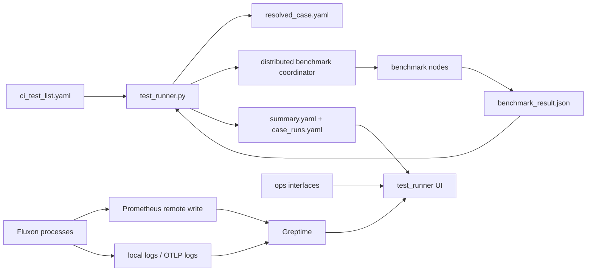
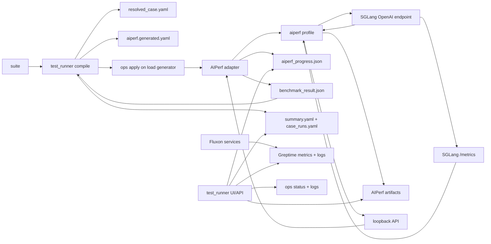
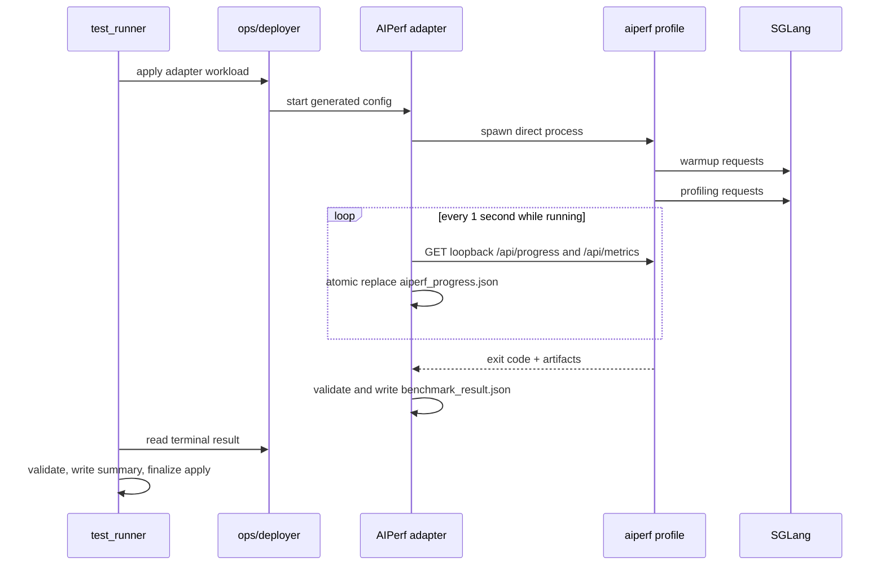

# Benchmark 监控工具链与 AIPerf 接入规划

> 状态：设计阶段  
> 调研基线：2026-07-10  
> AIPerf 基线：[`ActivePeter/aiperf:teleai`](https://github.com/ActivePeter/aiperf/tree/teleai)，提交 [`d72160e20957013d6608afcc88ed24100cb27dc5`](https://github.com/ActivePeter/aiperf/commit/d72160e20957013d6608afcc88ed24100cb27dc5)

相关文档：[TestStack 架构与 CI 测试流程](./teststack_1_当前架构与CI测试流程.md)、[本地文件日志与 Greptime OTLP 导出链路](./log_1_本地文件日志与Greptime_OTLP导出链路.md)。AIPerf 能力判断依据固定提交下的 [architecture](https://github.com/ActivePeter/aiperf/blob/d72160e20957013d6608afcc88ed24100cb27dc5/docs/architecture.md)、[API endpoints](https://github.com/ActivePeter/aiperf/blob/d72160e20957013d6608afcc88ed24100cb27dc5/docs/reference/api-endpoints.md)、[server metrics](https://github.com/ActivePeter/aiperf/blob/d72160e20957013d6608afcc88ed24100cb27dc5/docs/server-metrics/server-metrics.md) 和 [profile exports](https://github.com/ActivePeter/aiperf/blob/d72160e20957013d6608afcc88ed24100cb27dc5/docs/tutorials/working-with-profile-exports.md)。

## 1. 结论

Fluxon 当前已经具备 benchmark 编排、终态结果、服务指标、日志和常驻 UI，但这些能力仍分布在不同链路中。现有链路适合 KV、MQ、RPC 和 FS benchmark，缺少生成式 AI 请求的 TTFT、ITL、token throughput、goodput、trace replay 等负载和指标语义。

规划采用以下边界：

- **AIPerf 只负责生成式 AI 负载和请求侧统计**：新增显式的 `AIPERF` test stack mode，首期支持单个 load generator 对 OpenAI-compatible SGLang endpoint 发压。
- **`test_runner` 继续负责 case 生命周期**：suite 编译、资源准备、启动、超时、取消、终态、历史记录、UI 和对外 API 都由 `test_runner` 管理。
- **Greptime 继续负责连续时序指标与日志**：Fluxon 服务指标、日志和已有监控链路不迁移到 AIPerf。AIPerf 的请求结果以 run artifact 为事实来源。
- **AIPerf UI 和 API 不成为新的公共入口**：AIPerf 以 `runtime.ui: none` 运行；其 loopback API 只供同机适配器读取，`test_runner` UI 通过现有 ops 接口展示标准化后的进度和结果。
- **现有 distributed benchmark coordinator 保持原路径**：KV、MQ、RPC、FS 的 `benchmark_result.json` 语义不由这次接入改写。`AIPERF` 是现有有限模式集合中的新分支。
- **依赖必须固定到提交和构建产物哈希**：`teleai` 是未保护的可变分支，运行时不能直接按分支头安装。

首期不启用 AIPerf sweep、AIPerf multi-run、AIPerf OTel 导出和 GPU telemetry。case 矩阵仍由 TestStack 的 `scene × scale × profile` 决定，避免形成嵌套调度和重复监控通道。

## 2. 目标与非目标

### 2.1 目标

1. 把生成式 AI benchmark 收敛进 `start testbed -> testrunner` 两步模型。
2. 复用 AIPerf 已有的请求生成、warmup、并发或请求速率控制、请求级记录和聚合统计。
3. run artifact 和请求链路统一使用 `case_id + run_index`；连续服务指标通过 `cluster/instance + run time window` 与 run 关联。
4. 让常驻 `test_runner` UI 同时展示实时进度、终态摘要、artifact 和 Greptime 时间窗口。
5. 保证离线安装、固定依赖、固定随机种子和明确的失败状态。

### 2.2 非目标

- 不用 AIPerf 替换 `distributed_benchmark_coordinator.py`。
- 不把 AIPerf FastAPI、TUI 或 plot dashboard 暴露为 TestStack 公共服务。
- 不在 Fluxon 内重写 TTFT、ITL、token throughput 等 AIPerf 已提供的算法。
- 不允许 suite 同时传入自由格式 AIPerf YAML、任意 CLI 参数和环境变量覆盖。
- 首期不支持多 load generator、AIPerf Kubernetes service mode、真实用户 prompt、鉴权 endpoint 和自动性能回归判定。

## 3. 当前工具链分析

### 3.1 当前数据流



当前各层职责如下。

| 层 | 当前实现 | 已有能力 | 当前边界 |
| --- | --- | --- | --- |
| suite 与 case 编译 | `test_runner.py` | `scene × scale × profile`、`resolved_case`、run 目录 | 没有生成式 AI workload branch |
| testbed 生命周期 | `start_test_bed.py`、controller、ops | 启动共享服务、apply、进程状态和日志 | 不执行单个 benchmark case |
| benchmark 执行 | coordinator + nodes | KV、MQ、RPC、FS 的分布式同步和聚合 | 指标模型面向 operation、bytes 和内部 phase |
| 终态 | `benchmark_result.json`、`summary.yaml`、`case_runs.yaml` | 强制等待结果、校验节点完成、记录 run outcome | UI 主要展示原始摘要，缺少通用指标视图 |
| 连续监控 | Prometheus-compatible remote write、Greptime | 服务指标、部分 transport 指标、日志 | 与 run artifact 的关联字段尚未统一 |
| 常驻 UI | `test_runner_ui.py` | suite/run 状态、日志、GitOps、ops log | 当前没有 benchmark 曲线和统一结果 API |

### 3.2 当前链路已经稳定的部分

- `case_runs.yaml` 是 suite workdir 内执行状态的单一事实来源。
- `summary.yaml` 是单次 run 的终态摘要，runner 会在执行前写入可诊断的占位结果。
- TestStack benchmark 通过 `benchmark_result.json` 完成终态握手。runner 会校验每轮 `completion.status`、节点数量和 operation 数量。
- UI 是常驻服务，run 结束后仍能读取历史、日志和 ops 状态。
- Fluxon 指标使用 Prometheus-compatible 协议进入 Greptime，服务日志同时保留本地文件和 OTLP 路径。

### 3.3 主要缺口

| 缺口 | 影响 | 本设计的处理 |
| --- | --- | --- |
| 缺少生成式 AI 请求语义 | 现有 operation latency 无法表达 TTFT、ITL、token throughput 和多轮会话 | 使用 AIPerf 计算并保留原始 metric tag 与单位 |
| 进度、终态和时序指标分散 | UI 需要分别读状态文件、原始 JSON、日志和 Greptime | 在现有 `/api/run_state` 下增加有界的 `benchmark` 分支 |
| run 关联字段未贯穿 | 很难把请求突刺与服务指标、日志对齐 | 固定 artifact 关联键，并保存 cluster/instance 与 benchmark 时间窗口 |
| 当前 UI 缺少 benchmark 图表 | 只能查看 JSON 和日志 | UI 读取标准化摘要、timeslice 和 server metrics artifact |
| 多节点 percentile 聚合口径有限 | 当前 distributed benchmark 的 p50/p95/p99 是按成功 operation 数加权的节点 percentile，不能作为全量样本 percentile 使用 | AIPerf 路径保留请求级 JSONL，并由 AIPerf 计算请求总体 percentile |
| 工具能力容易重复 | AIPerf 也有 UI、API、server metrics、OTel 和 GPU telemetry | 用明确的所有权表限制每条链路 |

上表中的 percentile 结论只描述当前 coordinator 的节点聚合实现，不扩展为其他 benchmark 或整个监控系统的结论。

## 4. AIPerf `teleai` 分支评估

### 4.1 可直接复用的能力

| 能力 | `teleai` 快照行为 | Fluxon 用法 |
| --- | --- | --- |
| Python 版本 | `requires-python = ">=3.10,<3.14"` | 满足 Fluxon 的 Python `>=3.10` 要求 |
| 许可证 | Apache-2.0 | 构建产物保留许可证与 attribution |
| endpoint | OpenAI chat/completions 等 | 首期只开放 OpenAI-compatible chat streaming |
| 负载控制 | concurrency、request rate、warmup、ramp、trace replay | 首期开放 fixed concurrency 和 fixed request rate 两个有限分支 |
| 请求指标 | TTFT、ITL、request latency、request/token throughput、error 等 | 直接采用 AIPerf metric tag 和单位，不在适配层重算 |
| artifact | summary JSON/CSV、请求级 JSONL、`inputs.json`、timeslice | summary JSON 和请求级 JSONL 为首期必需产物 |
| server metrics | 自动发现或显式抓取 Prometheus `/metrics`，当前默认每 333 ms 采样 | 首期只抓取 runner 解析出的单个 SGLang metrics endpoint |
| 实时 API | `/api/run`、`/api/progress`、`/api/metrics`、`/api/results`、`/metrics` | 只绑定 loopback，由同机适配器读取 |
| UI | dashboard、simple、none | 固定 `none`，避免出现第二套 UI 归属和入口 |
| OTel | 可流式导出 metrics 和 timing | 首期关闭，待 Greptime OTLP metrics 契约单独评审 |

### 4.2 依赖快照结论

截至 2026-07-10：

- `teleai` 指向提交 `d72160e20957013d6608afcc88ed24100cb27dc5`。
- GitHub compare 显示该提交下 [`main...teleai`](https://github.com/ActivePeter/aiperf/compare/main...teleai) 为 `identical`。
- 仓库中没有可识别的 TeleAI 专属配置、插件或 patch。
- `teleai` 分支未启用 branch protection。

因此，“使用 `teleai` 分支”在工程上必须落实为下面四项记录：

1. source repo：`https://github.com/ActivePeter/aiperf`
2. requested branch：`teleai`
3. resolved commit：`d72160e20957013d6608afcc88ed24100cb27dc5`
4. wheel 与 wheelhouse manifest 的 SHA-256

实现前还需要业务方确认：当前意图是否就是采用这份与 fork `main` 相同的快照；如果预期存在 TeleAI 定制能力，应先明确对应提交或差异清单。

### 4.3 不能直接沿用的默认行为

- **不能按 branch head 在线安装**：testbed 运行期间不访问 PyPI 或 GitHub。
- **不能使用环境变量替换普通参数**：suite 编译器生成完整 AIPerf YAML，启动命令只传 `--config`。
- **不能使用 AIPerf sweep 或 multi-run 展开 case**：TestStack 已拥有 case 空间和 run history。
- **不能依赖 AIPerf 默认 UI**：非 TTY 与 TTY 下必须都固定为 `none`。
- **不能依赖 server metrics 自动发现**：显式写入 SGLang `/metrics` URL，并关闭 Kubernetes discovery。
- **不能直接公开 AIPerf API port**：API 只监听 `127.0.0.1`，端口由 testbed port allocator 分配。

## 5. 目标架构

### 5.1 核心角色

| 角色 | 责任 | 不负责什么 |
| --- | --- | --- |
| `start_test_bed.py` | 准备 SGLang、Greptime、controller、ops 和常驻 runner UI | 不启动单次 AIPerf run |
| `test_runner.py` | 编译 `AIPERF` case、分配资源、驱动 prepare/execute/finalize、写终态 | 不计算 TTFT 或 ITL |
| AIPerf adapter | 在 load generator 上启动 AIPerf、轮询 loopback API、原子写进度、校验 artifact、生成终态 | 不拥有 suite、历史或公共 API |
| AIPerf | 发请求并计算请求侧指标 | 不拥有 testbed 和长期监控 |
| SGLang endpoint | 被测服务，暴露 OpenAI-compatible API 和 `/metrics` | 不决定 benchmark 成败 |
| Greptime | 保存 Fluxon 连续指标与日志 | 首期不保存 AIPerf 请求级记录 |
| `test_runner` UI | 组合 run 状态、AIPerf 摘要、artifact、ops log 和 Greptime 时间窗口 | 不直接连接公开的 AIPerf 服务 |

实现代码按现有 runner 分层落位：

| 模块 | 计划改动 |
| --- | --- |
| `test_runner.py` | 增加 `AIPERF` suite schema、case 编译和有界 dispatch，不承载子进程细节 |
| `test_runner_runtime_backend.py` | 增加 `AIPERF` prepare、execute、finalize 和终态读取 |
| `aiperf_adapter.py` | 唯一的直接进程入口，负责 AIPerf 子进程、loopback API、timeout 和结果发布 |
| `aiperf_contract.py` | generated config、progress 和 result 的强类型模型与 validator，不提供第二个执行入口 |
| 现有 runner UI 代码 | 在 `/api/run_state` 与 run 页面增加 `AIPERF` 显式分支 |

### 5.2 数据流



AIPerf adapter 是单次 case 的直接进程入口，生命周期与该 case 一致。它不作为 testbed 常驻服务运行。

### 5.3 所有权与事实来源

| 数据 | 事实来源 | 保留周期 | UI 读取方式 |
| --- | --- | --- | --- |
| suite/case 状态 | `case_runs.yaml` | suite workdir 生命周期 | runner 本地读取 |
| run 终态 | `summary.yaml` | run artifact 生命周期 | runner 本地读取 |
| AIPerf 请求摘要 | `aiperf/profile_export_aiperf.json` | run artifact 生命周期 | runner 结果适配器 |
| AIPerf 请求级记录 | `aiperf/profile_export.jsonl` | run artifact 生命周期 | 按需下载或离线分析 |
| AIPerf 实时进度 | `aiperf_progress.json` | case 运行期间，终态后保留最后快照 | 通过 ops 文件读取接口 |
| SGLang run-window 指标 | `aiperf/server_metrics_export.jsonl` | run artifact 生命周期 | runner 图表适配器 |
| Fluxon 连续指标 | Greptime Prometheus-compatible API | Greptime retention | runner monitor 查询接口 |
| 服务与进程日志 | 本地 daily shard、Greptime `fluxon_logs`、run log | 各自既有 retention | 现有 log/ops log API |

首期不把 AIPerf summary 再复制到 Greptime。这样可以避免 artifact、OTel 和 Prometheus 三条通道同时保存同一组请求指标。若后续需要跨 run 长期聚合，应单独设计一个由 runner 控制的离线导入协议。

## 6. 配置与编译模型

### 6.1 suite 只增加一个有限模式

目标 suite 结构采用 `scene.test_stack.mode: AIPERF`。各层仍保持现有分工：

| 层 | `AIPERF` 分支内容 |
| --- | --- |
| scene | model、endpoint type、streaming、dataset、warmup、profiling phase、随机种子 |
| scale | load generator target、SGLang endpoint instance、资源规模 |
| profile | AIPerf artifact set、adapter deploy 模板、SGLang runtime 组合 |
| resolved case | 具体 URL、metrics URL、run_dir、loopback API port、完整 source manifest |

下面是提议中的 suite 片段，只用于说明字段归属，当前代码还不能执行：

```yaml
scenes:
  sglang_chat_concurrency:
    test_stack:
      mode: AIPERF
      aiperf:
        model: example-model
        endpoint_type: chat
        streaming: true
        random_seed: 42
        dataset:
          type: synthetic
          entries: 512
          input_tokens: 1024
          output_tokens: 256
        warmup:
          concurrency: 8
          requests: 32
        profiling:
          type: concurrency
          concurrency: 32
          requests: 512
```

Fluxon 只接受上述有界字段，不接受 `extra_args`、任意 AIPerf config fragment 或环境变量模板。需要新增 workload 能力时，先把它加入明确的 schema 分支和 contract test。

### 6.2 生成单一 AIPerf 配置

runner 根据 `resolved_case` 生成 `aiperf/aiperf.generated.yaml`。该文件是编译产物，用户不直接维护。Fluxon suite 统一使用 `snake_case`；生成器在 AIPerf 边界按该提交自带 JSON Schema 输出 `camelCase` alias，不在同一份配置中混用两种拼写。

```yaml
schemaVersion: "2.0"
randomSeed: 42

benchmark:
  model: example-model
  endpoint:
    url: http://sglang-host:30000/v1/chat/completions
    type: chat
    streaming: true
    headers:
      X-Fluxon-Case-ID: sglang_chat_concurrency__n1__teleai
      X-Fluxon-Run-Index: "1"
  dataset:
    type: synthetic
    entries: 512
    prompts: {isl: 1024, osl: 256}
  warmup:
    type: concurrency
    concurrency: 8
    requests: 32
  profiling:
    type: concurrency
    concurrency: 32
    requests: 512
  artifacts:
    dir: /testbed/run/results/example/run_1/aiperf
    summary: [json]
    records: [jsonl]
    raw: false
    trace: false
    sliceDuration: 5
  serverMetrics:
    enabled: true
    urls:
      - http://sglang-host:30000/metrics
    formats: [json, jsonl]
    discovery:
      mode: disabled
  gpuTelemetry:
    enabled: false
  runtime:
    ui: none
    apiHost: 127.0.0.1
    apiPort: 19081
```

启动命令固定为：

```bash
aiperf profile --config /testbed/run/results/example/run_1/aiperf/aiperf.generated.yaml
```

`testbed_aiperf_api_port` 由现有 testbed port allocator 派生并写入 resolved case，不增加用户侧端口配置项。

### 6.3 依赖交付

构建阶段完成以下动作：

1. 从固定 commit 构建 AIPerf wheel。
2. 解析并下载目标平台的完整 dependency wheelhouse。
3. 生成包含文件名、版本、许可证和 SHA-256 的 manifest。
4. 把 wheelhouse 作为 profile 所选 artifact set 的一部分发布。
5. load generator 在隔离 venv 中离线安装，禁止运行时访问 package index。

`resolved_case.yaml` 和 `benchmark_result.json` 都要记录 source repo、requested branch、resolved commit、AIPerf package version 与 wheelhouse manifest SHA-256。

## 7. 执行与终态契约

### 7.1 执行时序



### 7.2 `benchmark_result.json`

`AIPERF` 使用独立的强类型 payload，runner 根据已编译的 mode 选择专用 validator。建议最小结构如下：

```json
{
  "schema_version": 1,
  "result_kind": "AIPERF",
  "case_id": "sglang_chat_concurrency__n1__teleai",
  "run_index": 1,
  "completion": {
    "status": "SUCCESS",
    "exit_code": 0,
    "error": null
  },
  "source": {
    "repo": "https://github.com/ActivePeter/aiperf",
    "requested_branch": "teleai",
    "resolved_commit": "d72160e20957013d6608afcc88ed24100cb27dc5",
    "package_version": "<resolved-version>",
    "wheelhouse_manifest_sha256": "<sha256>"
  },
  "timing": {
    "started_at_unix_ns": 0,
    "finished_at_unix_ns": 0
  },
  "summary": {
    "request_count": 0,
    "error_request_count": 0,
    "metrics": {}
  },
  "artifacts": []
}
```

`metrics` 中保留 AIPerf 的 canonical tag、统计字段和单位。适配器不把 `time_to_first_token` 改名为另一套 Fluxon 私有名称。

### 7.3 完成状态

完成状态使用有限枚举：

| 状态 | 含义 | runner outcome |
| --- | --- | --- |
| `SUCCESS` | 进程退出码为 0，必需 artifact 可解析，至少有一个成功请求 | `SUCCESS` |
| `START_FAILED` | venv、配置校验或子进程启动失败 | `FAILED` |
| `PROCESS_FAILED` | AIPerf 非零退出 | `FAILED` |
| `RESULT_INVALID` | summary 缺失、schema 不符或计数不满足不变量 | `FAILED` |
| `TIMEOUT` | 超过 case deadline，adapter 已终止子进程 | `FAILED` |
| `CANCELLED` | runner 或 operator 发出取消 | `FAILED` |

首期不把普通请求错误率直接转换为 case 失败。请求错误会进入 summary；后续性能门禁必须使用单独、显式、可版本化的 acceptance policy。

### 7.4 不变量

- `case_id`、`run_index` 必须与 `resolved_case.yaml` 完全一致。
- `resolved_commit` 和 wheelhouse manifest hash 必须与 staged artifact manifest 一致。
- `finished_at_unix_ns >= started_at_unix_ns`。
- `SUCCESS` 要求 AIPerf exit code 为 0、summary JSON 可解析、`request_count > 0`，并且 `request_count - error_request_count > 0`。
- 所有 artifact path 必须位于当前 run_dir 内，并记录 size 与 SHA-256。
- adapter 只能用临时文件加原子 rename 发布进度和终态，runner 不读取半写文件。
- timeout 或 cancel 后必须等待 AIPerf 进程组退出，再写终态。

## 8. 监控与 UI 设计

### 8.1 指标分域

| 域 | 代表指标 | 来源 | 首期展示 |
| --- | --- | --- | --- |
| 生命周期 | status、phase、completed/total requests、elapsed | adapter progress | run 状态卡 |
| 请求体验 | TTFT、ITL、request latency、error rate | AIPerf summary/timeslice | percentile 表与时间曲线 |
| 吞吐 | request throughput、input/output token throughput | AIPerf | 摘要与时间曲线；goodput 随阶段 3 的显式 SLO 配置加入 |
| SUT | queue depth、KV cache usage、running/waiting requests | AIPerf server metrics artifact | 与请求曲线共享时间轴 |
| Fluxon 基础设施 | transport、KV、MQ、FS 和服务指标 | Greptime | 按 run 时间窗口查询 |
| 日志 | adapter、AIPerf、SGLang、Fluxon 服务日志 | ops、本地日志、Greptime | 复用现有日志查看器 |

请求级 `x_request_id` 和 `x_correlation_id` 只进入 record/log，不作为 Greptime 时序标签，避免高基数。

### 8.2 关联字段

| 字段 | artifact | 请求 header | Greptime 查询标签 | 说明 |
| --- | --- | --- | --- | --- |
| `case_id` | 必需 | `X-Fluxon-Case-ID` | 不要求 | 逻辑 case，由 runner 关联到查询窗口 |
| `run_index` | 必需 | `X-Fluxon-Run-Index` | 不要求 | 同一 case 的第 N 次运行 |
| `cluster_name` | 必需 | 可选 | 必需 | testbed 集群 |
| `instance_key` | 必需 | 无 | 必需 | SUT 与 Fluxon 服务实例 |
| `model` | 必需 | 请求 body 已包含 | 可选 | 模型身份 |
| `endpoint_type` | 必需 | 无 | 可选 | 首期固定为 `chat` |
| `case_key` | 必需 | 无 | 不使用 | 配置快照 hash，不进入时序标签 |
| source commit/hash | 必需 | 无 | 不使用 | 保存在 provenance 中 |

长生命周期服务不能随每个 case 动态改写 Prometheus label。runner 应在 resolved case 和终态中保存 `cluster_name`、相关 `instance_key`、`started_at_unix_ns` 与 `finished_at_unix_ns`，再用这组条件查询 Greptime。`case_id` 和 `run_index` 只需要出现在 run artifact、AIPerf 请求 header 及可选的 run marker 日志中。

跨 AIPerf 请求时间和 Greptime 时序数据做叠图前，testbed preflight 必须检查 load generator 与 SUT 时钟。首期允许的最大时钟偏差应固定为 1 秒，超过阈值时 case 在启动前失败。

### 8.3 runner API 与页面

扩展现有 `/api/run_state`，增加一个按 mode 判别的 `benchmark` 对象：

```json
{
  "benchmark": {
    "kind": "AIPERF",
    "status": "RUNNING",
    "progress": {},
    "summary": null,
    "artifacts": [],
    "monitor_window": {
      "start_unix_ns": 0,
      "end_unix_ns": null
    }
  }
}
```

不新增平行的 AIPerf UI service。run 页面增加以下区域：

1. workload 与 provenance
2. warmup/profiling 进度
3. TTFT、ITL、latency、throughput 和 error 摘要
4. timeslice 与 SGLang server metrics 曲线
5. Greptime 同时间窗口入口
6. artifact 与 ops log 列表

UI 服务重启后，历史页只依赖 run artifact 和 Greptime，不能依赖已经退出的 AIPerf API。

## 9. 可复现性、性能边界与安全

### 9.1 可复现性

- 每个 scene 必须显式给出 `random_seed`、warmup、stop condition、ISL、OSL 和 streaming。
- endpoint URL 从已解析的 SGLang instance 派生，不允许在 scene 中另写自由 URL。
- load generator 与 SUT 首期必须位于不同 target，避免 generator CPU、网络和 SUT 资源相互竞争。
- 记录 AIPerf commit、wheelhouse hash、Python 版本、SGLang image/commit、模型、tokenizer 和完整 generated config。
- server metrics 始终使用相同的显式采样配置。AIPerf 当前 333 ms 采样行为本身也属于对比条件。
- raw response 默认不保存；请求级 metrics JSONL 必须保存，以便复核 percentile 和异常请求。

### 9.2 性能结论边界

AIPerf 给出的请求指标覆盖 load generator 到 SGLang HTTP endpoint 的请求路径。它包含客户端排队、网络和服务端处理的组合影响，不能单独证明 Fluxon 某个内部模块的耗时。

SGLang `/metrics` 与 Greptime 指标用于解释同一运行窗口内的服务状态。两者采样频率、时钟和标签不同，叠图只提供时间相关性，不自动证明因果关系。

### 9.3 安全与数据保留

- AIPerf API 只监听 loopback。
- generated config、result 和 artifact path 都要经过 run_dir containment 校验。
- 首期只使用 synthetic dataset，不接入真实用户 prompt。
- `raw: false`、`trace: false` 为固定默认值。
- endpoint headers 在 result 和日志中必须经过 AIPerf 现有 redaction，再由 adapter 二次校验。
- 后续鉴权方案必须使用专门的 secret 注入路径，不能把 token 写入 suite、generated config 或普通环境变量。

## 10. 实施阶段

### 阶段 0：依赖与样例固化

- 确认 `teleai` 快照就是目标版本，或取得明确的 TeleAI patch commit。
- 构建离线 wheelhouse、license 清单和 SHA-256 manifest。
- 用固定 SGLang mock/fixture 验证 AIPerf summary、records、server metrics 和 loopback API schema。
- 保存一份脱敏 golden artifact，作为 adapter contract test 输入。

### 阶段 1：终态 MVP

- 在 suite schema 中加入 `AIPERF` mode 和有限 workload 字段。
- 增加 case 编译、testbed port 分配、generated YAML 和 isolated venv prepare。
- 增加 AIPerf adapter 的 direct-process 启动、timeout、cancel、artifact 校验和终态写入。
- 增加专用 result validator，并把小型摘要写入 `summary.yaml`。
- UI 先展示终态摘要、artifact 和日志。

### 阶段 2：实时监控

- adapter 每秒读取 loopback `/api/progress` 和 `/api/metrics`，原子更新进度快照。
- 扩展现有 `/api/run_state` 和 run 页面，不新增服务。
- 增加 timeslice 与 SGLang server metrics 图表。
- 用 run 时间窗口和关联字段查询 Greptime。

### 阶段 3：对比与门禁

- 由 `test_runner` 管理重复 run 和基线选择，禁止打开 AIPerf multi-run 形成第二层历史。
- 定义版本化 acceptance policy，明确 metric、stat、方向、阈值和缺失值行为。
- 对 percentile 门禁优先读取请求级记录的 pooled 统计，不使用节点 percentile 的平均值。
- 增加跨 run 对比页和机器可读的 evaluation 结果。

## 11. 测试计划

| 测试 | 执行模型 | 成功条件 |
| --- | --- | --- |
| config compile | contract test | suite 字段唯一映射到 generated YAML，未知字段快速失败 |
| dependency provenance | contract test | commit、package version 和 wheelhouse hash 一致 |
| happy path | 直接启动 adapter 进程 + mock OpenAI endpoint | exit 0、终态 `SUCCESS`、必需 artifact 存在 |
| request failure | 直接启动 adapter 进程 + 失败响应 endpoint | 错误计数保留，至少一个成功请求时完成 |
| invalid result | 直接启动 adapter 进程并注入损坏 artifact | `RESULT_INVALID`，runner case 失败 |
| timeout | 直接启动 adapter 进程 + 挂起 endpoint | 整个进程组退出，终态 `TIMEOUT` |
| cancel | 运行中发送 runner cancel | 终态 `CANCELLED`，没有残留 AIPerf 进程 |
| API isolation | process test | API 只监听 loopback，testbed 外无法访问 |
| UI restart | 启动常驻 UI，完成 run 后重启 UI | 历史摘要和图表仍能从 artifact 恢复 |
| clock preflight | process test | 偏差超过 1 秒时在发压前失败 |
| offline install | clean testbed process | 无外网条件下从 wheelhouse 完成安装和运行 |

进程生命周期测试按独立脚本或进程直接运行，并显式检查 exit code 与残留进程。不要为了统一外观再套一层 pytest 入口。

## 12. 验收条件

首期完成必须同时满足：

1. 用户仍只执行 `start testbed` 和 `testrunner`。
2. suite 只有一个 `AIPERF` 配置入口，运行时只消费生成的单一 YAML。
3. testbed 无外网时可以安装并运行固定 AIPerf 快照。
4. runner 能区分启动失败、进程失败、结果损坏、超时和取消。
5. UI 不公开 AIPerf API，run 结束和 UI 重启后仍能展示结果。
6. TTFT、ITL、latency、throughput 和 error 指标可追溯到 AIPerf artifact，不经二次重算。
7. AIPerf 请求窗口可以和 SGLang server metrics、Fluxon Greptime 指标及日志按 `case_id + run_index + time range` 对齐。
8. 现有 KV、MQ、RPC、FS benchmark 路径和结果校验保持不变。
