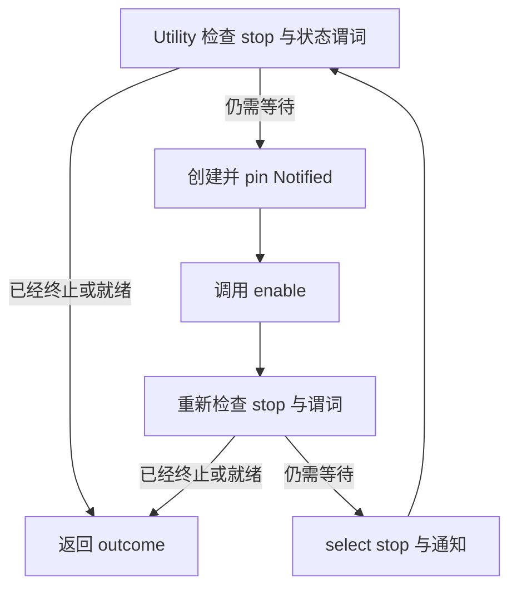

# 开发者 - 5 - Tokio Notify 使用规约

进程内异步状态等待必须以持久状态为准，`tokio::sync::Notify` 只负责提供唤醒提示。Fluxon 中的普通调用点必须使用 `fluxon_util::notify_state`，使竞态安全协议只有一份实现：

1. 先发布状态变化，再发送通知。
2. 只等待谓词时调用 `notify_state::wait_until`；还要响应停止信号时调用 `notify_state::wait_until_or_stopped`。
3. 只有在调用点确实增加 blocker 统计、诊断计时器等契约时，才保留自定义循环。
4. 自定义循环必须保留 `检查 -> arm -> 重新检查 -> 等待`，并把通知、shutdown 和 timer 放进同一个可取消的 `tokio::select!`。

这套协议可以关闭 lost wake-up 窗口，同时不依赖通知保存历史事件。

## 1. 适用范围与原语选择

本文适用于 Rust 进程内等待持久谓词的代码，例如等待 `ready`、`closed`、generation 变化或某个 sequence 轮到执行。本文不定义跨进程投递、持久队列或分布式协调协议。

应根据所需契约选择 Tokio 原语：

| 所需契约 | 推荐的 Tokio 原语 |
| --- | --- |
| 某个持久谓词可能已经变化，并且允许合并唤醒 | 状态加 `Notify`，并遵循本文协议 |
| 每个 item 必须被消费一次 | `mpsc` |
| 活跃订阅者需要接收每个 item，并能处理 lag | `broadcast` |
| 订阅者只需要最新值或版本 | `watch` |
| 必须对 permit 计数 | `Semaphore` |
| 只投递一次结果 | `oneshot` |

`Notify` 不保存事件日志。`notify_one()` 最多保留一个 permit，重复通知可能合并；`notify_waiters()` 不会为未来的等待者提供持久投递。每次事件都必须保留时，应使用能够保存 item 或 permit 的原语。

## 2. 必须保持的不变量

| 不变量 | 强制规则 | 避免的故障 |
| --- | --- | --- |
| 状态是判定依据 | 等待方只有在读取谓词或终止状态后才能返回。 | 把通知误当作条件已经成立的证明。 |
| 状态发布先于唤醒 | 更新 atomic 或锁保护状态；如有锁，先释放锁，再发送通知。 | 等待方被唤醒后读到旧状态，并在唯一一次通知后再次休眠。 |
| 关闭注册窗口 | 先检查，再创建并 arm `Notified`，进入等待前重新检查。 | 状态恰好在第一次检查与等待之间变化。 |
| 等待可被取消 | 关闭信号与通知进入同一个 `select!`。 | 前置 await 阻止 shutdown 中断等待。 |
| 通知允许虚假或合并 | 每次唤醒后都回到循环重新读取状态。 | 逻辑依赖“每次状态变化对应一次通知”。 |
| 锁不跨越挂起点 | 同步 mutex guard 必须在 `.await` 前释放。 | 死锁和 executor starvation。 |

## 3. 标准工具函数

发布方先提交状态：

```rust
fn mark_ready(&self) {
    self.ready.store(true, Ordering::SeqCst);
    self.changed.notify_waiters();
}
```

状态由锁保护时，应在锁内完成修改，释放 guard 后再调用 `notify_one()` 或 `notify_waiters()`。

传给工具函数的谓词必须同步读取持久状态、没有副作用，并且允许重复调用。异步谓词或每次唤醒都要执行的自定义统计需要使用特化循环。

只等待谓词时，直接调用工具函数：

```rust
use fluxon_util::notify_state;

notify_state::wait_until(&self.changed, || {
    self.ready.load(Ordering::SeqCst)
})
.await;
```

还要响应停止信号时，使用有限 outcome 契约：

```rust
use fluxon_util::notify_state::NotifyStateWaitOutcome;

match notify_state::wait_until_or_stopped(&self.changed, shutdown, || {
    self.ready.load(Ordering::SeqCst)
})
.await
{
    NotifyStateWaitOutcome::Ready => handle_ready(),
    NotifyStateWaitOutcome::Stopped => handle_closed(),
}
```

不要增加只为这两个调用改名并原样返回结果的方法。只有在完成输入校验、将 outcome 转换成领域错误、增加诊断信息或承接其他生命周期边界时，领域方法才有独立价值。

工具函数内部统一维护 `检查 -> arm -> 重新检查 -> 等待` 固定循环，普通调用点不得复制。`Notified::enable()` 是在不 await 的情况下 arm 已 pin 通知 future 的标准方式。多个等待方配合 `notify_one()` 时，这一步尤其重要。第二次谓词检查始终不可省略，因为它还覆盖了 future arm 之前已经完成的状态变化。



两次检查和已经 arm 的等待者共同覆盖全部状态变化窗口：

| 状态变化时机 | 进度如何被观察到 |
| --- | --- |
| 第一次检查之前 | 第一次检查读到新状态。 |
| 第一次检查与 arm 之间 | 第二次检查读到新状态。 |
| arm 与第二次检查之间 | 第二次检查读到新状态，通知也可能已经 ready。 |
| 第二次检查之后 | 已经 arm 的通知 future 唤醒等待方。 |
| 与 shutdown 同时发生 | 契约要求终止优先时，由 biased terminal 分支获胜。 |

## 4. 禁止模式

### 4.1 只检查一次后直接等待

```rust
if !self.is_ready() {
    self.changed.notified().await;
}
```

状态可能在 `is_ready()` 返回后、通知 future 能观察到变化前完成切换。这里必须使用循环和第二次状态检查。

### 4.2 把 `select!` 的 `else` 当作非阻塞 default

```rust
tokio::select! {
    _ = &mut notified => {}
    else => {}
}
```

只有所有分支都 disabled 时，`else` 才会执行。处于 pending 的通知分支仍然 enabled，因此这段代码会等待。需要在不 await 的情况下 arm future 时，应调用 `Notified::enable()`。

### 4.3 先等待通知，之后才加入取消分支

不要先执行一次通知 await，再在后续 `select!` 中加入 shutdown。需要互相中断的通知、关闭信号、超时和诊断唤醒应处于同一等待集合。

### 4.4 发布状态之前先通知

不要先发送唤醒，再更新谓词。发布方必须先让新状态可见。

### 4.5 把 `Notify` 当作事件计数器

不要根据唤醒次数推导事件数量。每次事件都需要保留时，应使用 `mpsc`、`broadcast` 或 `Semaphore`。

## 5. Shutdown 优先级与内存可见性

- **终止优先级**：shutdown 必须优先于正常进度时，使用 `tokio::select! { biased; ... }`，并把 terminal 分支放在第一位。正常进度可以优先时，需要显式记录这项仲裁规则。
- **诊断计时器**：warning 或 telemetry timer 可以进入同一个 `select!`；timer 触发后仍应回到循环检查状态。诊断超时不能静默转成成功。
- **唤醒数量**：一次状态变化可以让全部等待方就绪或终止时，使用 `notify_waiters()`。只有一个等待方应竞争执行时，才使用 `notify_one()`。
- **Mutex 状态**：持锁写入状态，释放 guard，然后通知。
- **Atomic 状态**：使用能够建立发布方与等待方可见性关系的 ordering，例如 release/acquire 或 `SeqCst`。使用 `Relaxed` 时必须另有明确的同步证明。
- **Stop 实现**：`AsyncStopSignal::is_stopped` 是判定依据。`wait_stopped` 必须可安全取消，因为其他分支获胜时 `select!` 可能直接 drop 它。
- **重复关闭**：终止状态应保持幂等。关闭后才开始的等待方必须能从状态检查直接返回，不依赖新的通知。

## 6. 强制测试矩阵

共享工具函数必须提供覆盖下表的有界测试。普通调用点只需测试自己的业务谓词和 outcome 转换；任何特化的自定义等待 helper 仍须覆盖所有适用交错：

| 场景 | 必须验证的结果 |
| --- | --- |
| 等待开始前状态已经 ready | 立即返回。 |
| 等待开始前已经进入终止状态 | 立即返回 terminal outcome。 |
| 状态在第一次检查与 waiter arm 之间变化 | 无 lost wake-up；使用确定性的测试 hook 或 barrier。 |
| 状态在 waiter arm 后变化 | 通知能够唤醒任务。 |
| 等待期间发生 shutdown | 在很短的测试 deadline 内返回。 |
| 状态变化与 shutdown 同时 ready | 遵循文档定义的优先级。 |
| 多个 broadcast waiter | 每个等待方都能观察到持久状态。 |
| 虚假通知 | 重新检查谓词并继续等待。 |
| 重复发送终止信号 | 行为幂等，并且后续等待方仍能观察到终止状态。 |

异步等待测试必须包在 `tokio::time::timeout` 中，使回归表现为有界失败，避免测试套件永久挂起。压力测试可以作为补充，但不能替代确定性的交错时序测试。

## 7. Review 清单与参考实现

Review 使用 `Notify` 的代码时，至少检查：

- 普通同步谓词等待是否调用 `fluxon_util::notify_state`，避免复制固定循环。
- 谓词或 terminal flag 是否持久存在并且有唯一权威存储位置。
- 发布方是否先更新状态，再发送通知。
- 等待方是否在循环中执行 `检查 -> arm -> 重新检查 -> 等待`。
- shutdown 和通知是否处于同一个可取消等待集合。
- 同时 ready 时是否有明确的优先级契约。
- 是否有同步 lock guard 跨越 `.await`。
- 是否具备要求的有界交错时序测试。
- 如果必须保存事件或 permit，是否已经改用 channel、`watch` 或 `Semaphore`。

当前参考实现和测试位于：

- `fluxon_rs/fluxon_util/src/notify_state.rs`：标准工具函数、stop 契约与交错时序测试
- `fluxon_rs/fluxon_mq/src/shutdown.rs`：调用工具函数的 `ShutdownCtl::wait_closed`
- `fluxon_rs/fluxon_framework/src/framework.rs`：调用工具函数的 `ResourceLatch::wait_ready`
- `fluxon_rs/fluxon_mq/src/consumer.rs`：带 blocker 诊断和 warning timer 的特化等待 `CommitSequencer::wait_turn`

这些路径是当前参考实现。其他既有 `Notify` 用法不因本文自动视为合规；后续修改相关代码时，应按本文协议逐项检查。

API 语义以 [`tokio::sync::Notify`](https://docs.rs/tokio/latest/tokio/sync/struct.Notify.html) 和 [`tokio::sync::futures::Notified`](https://docs.rs/tokio/latest/tokio/sync/futures/struct.Notified.html) 为准。
