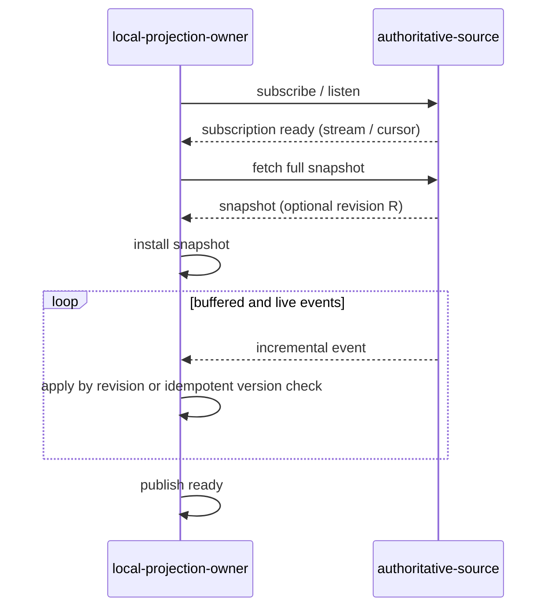

# 开发者 - 7 - 事件订阅与全量快照规约

当组件通过“全量查询 + 增量事件”维护本地投影时，只允许使用下面两种顺序之一：

1. 通用顺序：`subscribe/listen 就绪 → 拉取全量快照 → 安装快照 → 回放已缓冲的增量事件 → 发布 ready`。
2. Revision 耦合顺序：数据源提供类似 etcd 的原子 revision 契约时，使用 `snapshot@R → watch@R+1`。

不满足 revision 耦合契约时，必须使用通用顺序。每次 `listen` 建立并确认就绪后，都必须进行一次全量同步；该要求同时覆盖首次启动和所有重新建立 `listen` 的恢复路径。

调用了 `listen()` 或启动了后台任务，不代表订阅已就绪。只有当数据源已确认订阅，或调用方已取得可用的 stream handle / cursor 时，才算 `listen` 建立完成。

## 1. 适用范围

本规约适用于任何由远端权威状态派生本地投影的场景，包括：

- 集群成员与服务发现。
- 路由表、配置镜像和资源索引。
- controller / informer 类本地 cache。
- 需要重建 watch 流的本地 cache。

本地投影的 owner 对快照安装、事件应用和 ready 状态负责。数据源仍是业务状态的唯一事实来源。

## 2. 通用顺序：listen 就绪后全量同步

| 阶段 | 必须动作 | 验收条件 |
| --- | --- | --- |
| 订阅 | 等待数据源确认订阅已建立。fire-and-forget `spawn()` 不构成就绪证明。 | 自订阅就绪起的每次状态变化都能进入该订阅流。 |
| 快照 | 订阅就绪后拉取一次全量状态。 | 快照覆盖数据源定义的一致性时点上的完整对象集。 |
| 安装 | 由本地投影 owner 原子替换基线，或在唯一 writer 中完成替换。 | 增量处理不会与快照安装无序地并发写入同一投影。 |
| 回放 | 应用订阅就绪后缓冲的事件。有 revision 时只接受快照 revision 之后的事件；无 revision 时必须使用 generation / version 检查或幂等应用。 | 重复或陈旧事件不会回退快照中的新状态。 |
| Ready | 快照已安装，且订阅 backlog 已追至定义好的收敛点后，再发布 ready。 | ready 的读者不会观察到只有部分快照的中间态。 |

## 3. 失败与重同步

- **订阅失败**：不开始全量拉取，不发布 ready。重试必须从建立新订阅开始。
- **快照失败**：当次同步不成立。关闭或废弃当前订阅，再按完整顺序重试，避免无界缓冲。
- **当前事件流失效**：lag、断线或 source epoch 变化都会使旧流失去完整性证明。撤销 ready 并废弃旧流；采用通用顺序时，新 `listen` 就绪后必须全量同步；采用 revision 耦合顺序时，重新执行 `snapshot@R → watch@R+1`。
- **关闭**：先停止接收新事件，再 cancel / wake 并 join 事件任务，最后释放 stream 和投影依赖。close 成功返回后不得再有任务写入该投影。

固定 `sleep` 只能作为超时边界或调试手段，不能作为订阅就绪、快照安装或 backlog 收敛的证明。

## 4. 第二种顺序：snapshot@R → watch@R+1

如果数据源明确提供原子 revision 契约，可以使用以下顺序：

`snapshot at revision R → watch from revision R + 1`

该顺序必须同时满足：

- 快照返回可用的 revision / cursor。
- watch API 保证从指定 revision 后的第一个事件开始交付。
- 数据源保证快照与事件日志使用同一个有序 revision 空间。
- 测试覆盖 snapshot / watch 交界处的并发更新。

普通的 `fetch_all()` 加无起始 revision 的 `listen()` 不满足该顺序的前提。

## 5. Review 与验证清单

- [ ] 订阅就绪是可等待的 completion barrier，没有用 `spawn()` 成功替代订阅成功。
- [ ] 通用顺序中的每次 `listen` 建立完成后都会拉取一次全量快照，包括首次启动和所有恢复路径。
- [ ] 代码只实现两种合法顺序；不存在新 `listen` 直接沿用旧快照的第三条分支。
- [ ] 使用 `snapshot@R → watch@R+1` 时，数据源和测试满足全部 revision 契约。
- [ ] 快照安装和事件应用有唯一 writer，或有可证明的 revision 顺序。
- [ ] 事件发生在订阅前、订阅后且快照前、快照后三个窗口时，最终投影都正确。
- [ ] 重复事件和陈旧事件不会回退状态。
- [ ] ready 只在快照与 backlog 都收敛后发布。
- [ ] 测试用明确的状态条件等待，不用固定 `sleep` 代替同步。
