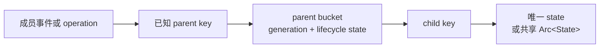

# 开发者 - 8 - 数据结构与索引设计规约

当事件、清理和常用查询都携带父级 key 时，运行时状态应优先组织为 `parent -> child -> state`。同一个事实只保留一份权威状态；只有确实存在独立查询维度时才增加 secondary index，并明确其一致性责任。

本文适用于进程内的并发 Map、inflight operation、成员级资源和生命周期索引。数据库查询规划、离线分析和明确的全量 snapshot 不在本文讨论范围内。

## 1. 核心判断

| 设计问题 | 默认选择 | 需要额外论证的选择 |
| --- | --- | --- |
| 事件已知 `parent_id`，清理一个 parent 下的状态 | `parent_id -> child_id -> state` | flat 主表加 parent 反向索引 |
| state 被多个 parent 共同引用 | 各 bucket 保存同一个 `Arc<State>` | 复制多份可独立修改的 state |
| 单 child 完成或删除 | 使用已知 parent/child key 定点处理 | 扫描所有 parent 或所有 child |
| 可复用 ID 对应多个进程生命周期 | 在 owning bucket 内保存 generation | 把 generation 扩散到无关公共协议 |
| 新增 secondary index | 先写 authority、更新 owner、重建和测试方式 | 只因查找代码更方便就复制关系 |



## 2. 按天然层级选择主键

- MemberLeft、tenant cleanup、connection close 等事件天然携带 parent key。对应状态优先放在该 parent 的 bucket 中。
- child key 只需在 parent 内唯一时，不要为了全局 flat Map 再复制一张 `parent -> child keys` 索引。
- 一个 operation 涉及多个 parent 时，各 bucket 可以保存同一个 `Arc<State>`。terminal transition 仍由唯一 owner 串行化。
- 如果业务必须只凭 child key 完成全局查询，先确认该查询是否真实存在于热路径，再决定使用全局唯一 key 或 secondary index。

## 3. 一个事实只有一个权威存储

权威结构负责 state 的创建、修改和最终删除。secondary index 只保存额外查询维度所需的派生关系，不复制完整 state。

新增 secondary index 前必须写清：

1. authority 位于哪里。
2. 哪个 owner 原子地更新 authority 和 index。
3. index 缺失或落后时如何检测。
4. 是否允许重建，以及如何重建。
5. 哪些并发测试证明不会出现单边可见。

如果 insert、remove 和 MemberLeft 都要对两张表做对称双写，通常说明天然层级尚未成为权威结构。

## 4. 禁止热路径全表扫描

以下路径必须使用调用方已经掌握的 key 定点处理：

- 单个 member、tenant 或 connection 离开。
- 单个 operation 完成、撤销或 timeout。
- 单个 holder、replica 或 cache key 删除。
- admission 时检查 parent 生命周期状态。

允许扫描的场景必须显式表达全量语义：

- 用户明确请求的全量 snapshot 或 list-all 接口。
- shutdown drain，且扫描对象就是本模块拥有的待清理集合。
- 有明确基数上限的诊断、测试或统计。

这类接口名称和文档应包含 `snapshot`、`all`、`drain` 等全量含义，并说明复杂度和基数边界。禁止把扫描作为索引缺失时的静默 fallback。

## 5. 原子发布与并发生命周期

- admission、parent 的 `departed` 检查和 child 插入必须在同一个 bucket 临界区完成。
- parent 离开时，即使 bucket 尚不存在或没有 child，也必须留下 `departed` tombstone；只能由明确的重新加入事件清除，避免迟到 admission 重建 active bucket。
- 多 parent operation 按稳定 key 顺序加锁。锁顺序必须由数据决定，不能依赖请求到达顺序。
- 不持有 DashMap guard、bucket lock 或其他同步锁跨越 `.await`。
- terminal 删除必须幂等，并由单一 transition owner 决定谁获得最终清理权。
- 从多个 bucket 删除共享 `Arc<State>` 时，应校验 pointer identity 或等价 generation，避免旧 operation 删除新 entry。

## 6. 使用 generation 防止 ABA

当 `member_id`、connection ID 或其他 key 会被新进程复用时，owning bucket 应保存 generation。

推荐状态为：

```text
parent_id
  -> ParentState {
       generation,
       departed,
       child_id -> Arc<State>
     }
```

必须满足：

- admission 使用 owner 已观察到的 generation，并在同一临界区比较 generation、检查 `departed`、插入 child。
- 新 generation 到达时，只清理该 parent 的旧 bucket；不扫描其他 parent。
- 旧 operation 的 terminal 只删除 generation 和 state identity 都匹配的 entry。
- generation 只扩展到解决 ABA 所需的 owner 边界。不要因此修改无关 RPC、公共事件或信任模型。

## 7. secondary index 准入

只有同时满足以下条件时才新增 secondary index：

- 存在独立且必须高效支持的查询维度。
- authority 无法以天然层级直接支持该查询。
- 更新 owner 可以原子维护两者，或系统明确接受并检测短暂不一致。
- 有重建或一致性验证方式。
- 测试覆盖 insert、remove、generation 切换和 cleanup 竞态。

用于 O(1) `total()` 的计数器可以与权威结构并存，但它只服务统计，不参与查找或清理。计数器必须由同一个 owner 更新，并对 underflow 快速失败。

## 8. Review Checklist

- 常用事件是否已经携带可作为 parent key 的标识？
- 是否存在 flat 主表和 `by_parent` 反向索引的双写？
- MemberLeft、timeout 或单 key 删除是否扫描整张表？
- 同一 state 是否被复制到多个可独立修改的位置？
- admission 的状态检查与发布之间是否存在可见性窗口？
- 多 bucket 锁是否使用稳定顺序？是否有锁跨越 `.await`？
- 可复用 ID 是否需要本地 generation？generation 的边界是否过度扩张？
- secondary index 是否写清 authority、更新 owner、重建方式和一致性测试？
- 允许的全量扫描是否在接口名、复杂度和基数边界上清楚可见？
