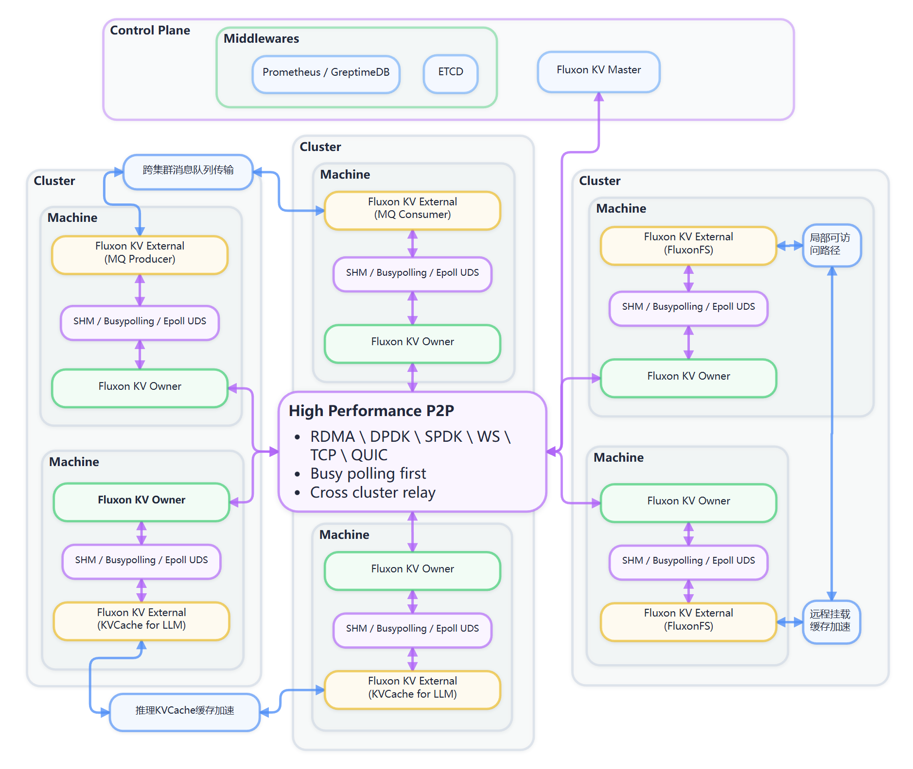

# 用户 - 2 - 服务平面

<!-- Maintenance note: Keep the minimum KV path centered on Greptime, etcd, Master, and Owner. PD and TiKV are optional dependencies for persistent FS transfer state. MQ and FS feature details belong to their own pages and should only be linked from here. -->

## 服务平面

本页说明 Fluxon KV 的服务进程如何启动，以及首次运行时需要修改哪些配置。最小 KV 链路只需要 `Greptime`、`etcd`、`Master` 和 `Owner`；TiKV 只用于 FS 目录传输、预扫描等需要持久任务状态的功能。

### 先按使用场景选择

- **本机最小 KV**：本机依次启动 `Greptime`、`etcd`、`Master` 和 `Owner`。首次体验优先按这条路径操作。
- **接入已有 Master**：集群中的 `Greptime`、`etcd` 和 `Master` 已经运行时，本机只启动新的 `Owner`。
- **启用 FS 目录传输或预扫描**：完成 KV 服务平面后，再额外启动 PD 和 TiKV。只使用 KV、RPC 或 MQ 时可以跳过 TiKV。

### 组件关系与启动顺序

推荐的本机启动顺序是：

```text
Greptime → etcd → Master → Owner → 业务进程 new_store(...)
```

各组件的作用如下：

- `Greptime` 接收 Master 上报的监控数据。
- `etcd` 保存成员关系、路由和租约等控制面元数据。
- `Master` 管理 KV 集群。
- `Owner` 在当前机器提供共享内存池，并生成业务进程连接时需要的 `shared.json`。
- PD 和 TiKV 保存 FS 目录传输、预扫描等功能的持久任务状态，不影响最小 KV 读写链路。

部署位置可参考下图：



`Greptime`、`etcd`、PD 和 TiKV 是外部依赖，需要单独启动。`fluxon_py.runtime` 只启动 Fluxon 自己的 `Master`、`Owner` 等角色。

### 本机最短启动路径

先按 [用户 - 0 - 安装](./用户%20-%200%20-%20安装.md) 准备运行时包，并确认最小 KV 路径需要的文件已经存在：

- `ext_images/greptime/greptime`
- `ext_images/greptime/start.sh`
- `ext_images/etcd/etcd`
- `ext_images/etcd/etcdctl`
- `ext_images/etcd/start.sh`

以下命令均在 Fluxon 仓库根目录执行。每条启动命令都会持续运行，建议分别放在独立终端或 `tmux` 窗口中；确认当前组件启动成功后，再执行下一条。

#### 先理解 `--config` 和 `--workdir`

外部依赖的启动脚本都接收两个参数：

- `--config/-c` 决定组件使用哪些启动参数。配置文件必须定义对应的 Bash 数组，例如 `GREPTIME_ARGS` 或 `ETCD_ARGS`。
- `--workdir/-w` 决定当前实例的数据和日志放在哪里。每个实例应使用独立、可写的工作目录。

配置文件中的 `WORKDIR` 就是 `--workdir` 传入的目录。例如：

```text
--workdir /tmp/fluxon_service_plane_demo/etcd
--data-dir "$WORKDIR/etcd-data"
```

最终的数据目录是 `/tmp/fluxon_service_plane_demo/etcd/etcd-data`。首次本机运行时，只需确认工作目录可写、示例端口没有被占用；单节点的成员配置通常可以保留示例值。

#### 1. 启动 Greptime

**作用**：为 Master 提供监控数据的查询和写入入口。

**首次确认项**：

- `--http-addr 0.0.0.0:34030` 使用的 `34030` 端口没有被占用。
- `--data-home "$WORKDIR/greptimedb"` 对应的工作目录可写。

配置与启动命令：

```bash
cat > /tmp/greptime.config.sh <<'EOF'
GREPTIME_ARGS=(
  standalone start
  --data-home "$WORKDIR/greptimedb"
  --http-addr 0.0.0.0:34030
)
EOF

bash ./ext_images/greptime/start.sh \
  --config /tmp/greptime.config.sh \
  --workdir /tmp/fluxon_service_plane_demo/greptime
```

**成功判据**：启动进程保持运行，终端中没有启动错误，并且本机 `34030` 端口可以连接。后面的 Master 示例默认使用这个端口。

<details>
<summary><strong>🌐 多机部署时再看</strong>｜<code>--http-addr</code></summary>

`0.0.0.0` 表示监听本机所有网卡，不能作为其他机器访问 Greptime 的目标地址。Master 配置中的 `GREPTIME_BASE_URL` 应填写 Master 所在机器能够访问的真实主机名或 IP。

</details>

#### 2. 启动 etcd

**作用**：保存 Master 和 Owner 使用的控制面元数据。

**首次确认项**：

- `--advertise-client-urls "http://127.0.0.1:2379"` 对应后续脚本中的 `ETCD_ENDPOINT = "127.0.0.1:2379"`。
- `2379` 和 `2380` 端口没有被占用。
- `--data-dir "$WORKDIR/etcd-data"` 对应的工作目录可写。

`--name`、peer 地址和 `--initial-cluster` 用于 etcd 成员关系。本机单节点运行时可以保留下面的示例值。

配置与启动命令：

```bash
cat > /tmp/etcd.config.sh <<'EOF'
ETCD_ARGS=(
  --data-dir "$WORKDIR/etcd-data"
  --name etcd0
  --advertise-client-urls "http://127.0.0.1:2379"
  --listen-client-urls "http://0.0.0.0:2379"
  --listen-peer-urls "http://0.0.0.0:2380"
  --initial-advertise-peer-urls "http://127.0.0.1:2380"
  --initial-cluster "etcd0=http://127.0.0.1:2380"
  --initial-cluster-token "etcd-cluster"
  --initial-cluster-state "new"
  --auto-compaction-retention=1
)
EOF

bash ./ext_images/etcd/start.sh \
  --config /tmp/etcd.config.sh \
  --workdir /tmp/fluxon_service_plane_demo/etcd
```

**成功判据**：访问健康检查接口时返回 `"health":"true"`。

```bash
curl -sS http://127.0.0.1:2379/health
```

<details>
<summary><strong>🌐 多机部署时再看</strong>｜etcd 的监听地址与成员地址</summary>

- `--listen-client-urls` 和 `--listen-peer-urls` 决定 etcd 在本机监听哪些网卡。
- `--advertise-client-urls` 是 Master、Owner 等客户端实际连接的地址。
- `--initial-advertise-peer-urls` 是其他 etcd 成员连接当前成员的地址。
- `--name` 必须和 `--initial-cluster` 中的成员名对应，成员地址必须能在机器之间访问。

</details>

#### 3. 启动 Master 和 Owner

`fluxon_py.runtime` 中最常用的两个入口是：

- `start_kv_master_process(config=...)`
- `start_owner_kvclient_process(config=...)`

示例脚本 `examples/start_master_owner.py` 默认同时启动本机 `Master` 和 `Owner`。首次运行只需先理解脚本顶部的这些字段：

- `ETCD_ENDPOINT`：Master 和 Owner 连接的 etcd 地址。这里填写不带 `http://` 的 `host:port`；按前面的示例启动时保持 `127.0.0.1:2379`。
- `CLUSTER_NAME`：逻辑集群名。Master、Owner 和后续业务进程必须使用同一个值。
- `SHARE_MEM_PATH`：本机共享内存目录。同一台机器上的 Owner 和后续业务进程必须使用同一路径。
- `MASTER_INSTANCE_KEY`：Master 的实例标识，在同一个集群中必须唯一。
- `OWNER_INSTANCE_KEY`：Owner 的实例标识，在同一个集群中必须唯一。
- `OWNER_DRAM_BYTES`：Owner 向集群贡献的 DRAM 字节数。默认值是 `1073741824`，即 1 GiB；该值必须大于 0 并满足容量对齐要求。

按前面的默认端口启动 Greptime 和 etcd，并且本机 `31000` 端口未被占用时，`GREPTIME_HTTP_PORT`、`MASTER_PORT` 和各目录可以先保留示例值。

脚本支持两种启动方式：

- **启动本机 Master 和 Owner**：

  ```bash
  python3 examples/start_master_owner.py
  ```

- **只启动 Owner 并接入已有 Master**：

  ```bash
  python3 examples/start_master_owner.py --without-master
  ```

  此时 `ETCD_ENDPOINT` 和 `CLUSTER_NAME` 必须与已有集群一致，`OWNER_INSTANCE_KEY` 必须是新值，`SHARE_MEM_PATH` 使用当前机器的本地路径。

**成功判据**：脚本保持运行，终端打印 `waiting for Ctrl-C`，并且 `SHARE_MEM_PATH` 下生成 `shared.json`。默认配置对应的检查命令如下：

```bash
ls -l /dev/shm/fluxon_kv_demo/shared.json
```

Master 和 Owner 的标准输出分别写入 `/tmp/fluxon_kv_demo/runtime/log/master.log` 和 `/tmp/fluxon_kv_demo/runtime/log/owner.log`，可在启动失败时查看。

下面保留完整脚本，便于从源码仓库直接运行：

<details>
<summary><strong>📄 查看完整脚本（点击展开）</strong>｜<code>examples/start_master_owner.py</code></summary>

```python
#!/usr/bin/env python3

import argparse

from pathlib import Path

from fluxon_py.runtime import (
    start_kv_master_process,
    start_owner_kvclient_process,
    wait_subproc_or_ctrlc,
)
from fluxon_py.runtime.process_runner import ManagedSubprocess

ETCD_ENDPOINT = "127.0.0.1:2379"
GREPTIME_HTTP_PORT = 34030
GREPTIME_BASE_URL = f"http://127.0.0.1:{GREPTIME_HTTP_PORT}"
CLUSTER_NAME = "demo-kv-cluster"
SHARE_MEM_PATH = Path("/dev/shm/fluxon_kv_demo").resolve()
WORKDIR = Path("/tmp/fluxon_kv_demo/runtime").resolve()
MASTER_PORT = 31000
MASTER_INSTANCE_KEY = "demo_kv_master"
OWNER_INSTANCE_KEY = "demo_kv_owner"
OWNER_DRAM_BYTES = 1073741824


def main() -> None:
    args = parse_args()
    log_dir = (WORKDIR / "log").resolve()

    if args.with_master:
        master_log_dir = (WORKDIR / "master_logs").resolve()
        master_log_dir.mkdir(parents=True, exist_ok=True)
        master_stdout_log = log_dir / "master.log"
        master_proc = start_kv_master_process(
            config=build_master_config(log_dir=master_log_dir),
            log_path=master_stdout_log,
        )
    else:
        master_stdout_log = None
        master_proc = None

    owner_stdout_log = log_dir / "owner.log"
    owner_proc = start_owner_kvclient_process(
        config=build_owner_config(),
        log_path=owner_stdout_log,
    )
    children = []
    if master_proc is not None:
        children.append(
            ManagedSubprocess(
                label="master",
                proc=master_proc,
            )
        )
    children.append(
        ManagedSubprocess(
            label="owner",
            proc=owner_proc,
        )
    )

    print(f"[fluxon_kv] share_mem_path: {SHARE_MEM_PATH}")
    print(f"[fluxon_kv] etcd endpoint: {ETCD_ENDPOINT}")
    print(f"[fluxon_kv] greptime base url: {GREPTIME_BASE_URL}")
    print(f"[fluxon_kv] start master in this script: {args.with_master}")
    if master_stdout_log is not None:
        print(f"[fluxon_kv] master stdout log: {master_stdout_log}")
    else:
        print("[fluxon_kv] master stdout log: disabled by --without-master")
    print(f"[fluxon_kv] owner stdout log: {owner_stdout_log}")
    stack_label = "master and owner" if args.with_master else "owner"
    print(f"[fluxon_kv] waiting for Ctrl-C to stop {stack_label}")
    wait_subproc_or_ctrlc(
        children,
        on_ctrlc=lambda: print(f"[fluxon_kv] caught Ctrl-C, stopping {stack_label}"),
    )


def parse_args() -> argparse.Namespace:
    parser = argparse.ArgumentParser(description="Start KV demo owner, optionally with a local master")
    group = parser.add_mutually_exclusive_group()
    group.add_argument(
        "--with-master",
        dest="with_master",
        action="store_true",
        help="Start a local kv master in this script (default)",
    )
    group.add_argument(
        "--without-master",
        dest="with_master",
        action="store_false",
        help="Do not start a local kv master; only start owner and attach to an existing cluster master",
    )
    parser.set_defaults(with_master=True)
    return parser.parse_args()


def build_master_config(*, log_dir: Path) -> dict:
    return {
        "instance_key": MASTER_INSTANCE_KEY,
        "cluster_name": CLUSTER_NAME,
        "port": MASTER_PORT,
        "etcd_endpoints": [ETCD_ENDPOINT],
        "log_dir": str(log_dir),
        "monitoring": {
            "prometheus_base_url": f"{GREPTIME_BASE_URL}/v1/prometheus",
            "prom_remote_write_url": [f"{GREPTIME_BASE_URL}/v1/prometheus/write"],
            "otlp_log_api": {
                "otlp_endpoint": f"{GREPTIME_BASE_URL}/v1/otlp/v1/logs",
            },
        },
    }


def build_owner_config() -> dict:
    return {
        "instance_key": OWNER_INSTANCE_KEY,
        "contribute_to_cluster_pool_size": {
            "dram": OWNER_DRAM_BYTES,
            "vram": {},
        },
        "fluxonkv_spec": {
            "etcd_addresses": [ETCD_ENDPOINT],
            "cluster_name": CLUSTER_NAME,
            "share_mem_path": str(SHARE_MEM_PATH),
            "sub_cluster": "default",
            "large_file_paths": [str((WORKDIR / "large" / "owner").resolve())],
        },
    }


if __name__ == "__main__":
    main()
```

</details>

从源码仓库运行时可以直接使用这个脚本。通过 `wheel` 安装 Fluxon 后，建议在自己的启动程序中调用上面的两个 `fluxon_py.runtime` 入口，并直接传入 Python dict，不依赖 `examples/` 目录。

示例使用 `wait_subproc_or_ctrlc(...)` 统一等待子进程。按 Ctrl-C 后，已经启动的 Master 和 Owner 会一起停止。

### 可选：为 FS 目录传输启动 PD 和 TiKV

仅使用 KV、RPC 或 MQ 时可以跳过本节。FS 目录传输和预扫描需要 `transfer_state_store` 时，启动顺序为：

```text
PD → TiKV → FS Master
```

先确认以下文件已经由运行时包提供：

- `ext_images/tikv/pd-server`
- `ext_images/tikv/tikv-server`
- `ext_images/tikv/start_pd.sh`
- `ext_images/tikv/start_tikv.sh`

PD 和 TiKV 的脚本同样使用 `--config/-c` 与 `--workdir/-w`。

#### 1. 启动 PD

**作用**：管理 TiKV 集群，并向 TiKV 和 FS `transfer_state_store` 提供集群入口。

**首次确认项**：

- `12379` 是客户端端口，`12380` 是 PD 成员通信端口，两者都不能被占用。
- `--data-dir` 和 `--log-file` 使用的工作目录可写。
- 配置文件中的数组名必须是 `PD_ARGS`。

本机单节点运行时，成员名、peer 地址和 `--initial-cluster` 可以保留示例值。

配置与启动命令：

```bash
cat > /tmp/pd.config.sh <<'EOF'
PD_ARGS=(
  --name pd0
  --data-dir "$WORKDIR/pd-data"
  --client-urls "http://127.0.0.1:12379"
  --advertise-client-urls "http://127.0.0.1:12379"
  --peer-urls "http://127.0.0.1:12380"
  --advertise-peer-urls "http://127.0.0.1:12380"
  --initial-cluster "pd0=http://127.0.0.1:12380"
  --log-file "$WORKDIR/pd.log"
)
EOF

bash ./ext_images/tikv/start_pd.sh \
  --config /tmp/pd.config.sh \
  --workdir /tmp/fluxon_service_plane_demo/tikv_pd
```

**成功判据**：PD 进程保持运行，并且成员接口返回成功。

```bash
curl -sS http://127.0.0.1:12379/pd/api/v1/members
```

#### 2. 启动 TiKV

**作用**：保存 FS 目录传输和预扫描的持久任务状态。

**首次确认项**：

- PD 已经启动，`--pd-endpoints "127.0.0.1:12379"` 与前面的 PD 客户端地址一致。
- `20160` 是 TiKV 服务端口，`20180` 是状态与 metrics 端口，两者都不能被占用。
- `--data-dir` 和 `--log-file` 使用的工作目录可写。
- 配置文件中的数组名必须是 `TIKV_ARGS`。

配置与启动命令：

```bash
cat > /tmp/tikv.config.sh <<'EOF'
TIKV_ARGS=(
  --pd-endpoints "127.0.0.1:12379"
  --addr "127.0.0.1:20160"
  --advertise-addr "127.0.0.1:20160"
  --status-addr "127.0.0.1:20180"
  --data-dir "$WORKDIR/tikv-data"
  --log-file "$WORKDIR/tikv.log"
)
EOF

bash ./ext_images/tikv/start_tikv.sh \
  --config /tmp/tikv.config.sh \
  --workdir /tmp/fluxon_service_plane_demo/tikv
```

**成功判据**：TiKV 进程保持运行，日志中没有连接 PD 或初始化存储的错误，并且本机 `20160` 端口可以连接。

<details>
<summary><strong>🌐 多机部署时再看</strong>｜PD 与 TiKV 的公开地址</summary>

- PD 的 `--advertise-client-urls` 必须能被 TiKV 和 FS Master 访问；`transfer_state_store.pd_endpoints` 使用这个客户端地址。
- PD 的 `--advertise-peer-urls` 和 `--initial-cluster` 使用 PD 成员之间可访问的地址。
- TiKV 的 `--pd-endpoints` 必须指向已启动的 PD，`--advertise-addr` 必须能被其他机器访问。
- `--client-urls`、`--peer-urls`、`--addr` 和 `--status-addr` 控制进程监听位置；不能把仅用于绑定的 `0.0.0.0` 当作远端连接地址。

</details>

### 进阶配置

本机首次运行可以保留以下配置。只有端口、目录或部署机器发生变化时，才需要继续调整。

#### 自定义监控地址和 Master 端口

- `GREPTIME_HTTP_PORT` 是 Greptime 的 HTTP 端口，必须与 Greptime 的 `--http-addr` 一致。
- `GREPTIME_BASE_URL` 是 Master 能够访问的 Greptime 地址，格式为 `http://host:port`。
- 示例从 `GREPTIME_BASE_URL` 派生三个接口：Prometheus 查询使用 `/v1/prometheus`，remote write 使用 `/v1/prometheus/write`，OTLP 日志使用 `/v1/otlp/v1/logs`。修改主机或端口后，这三个路径保持不变。
- `MASTER_PORT` 是本机 Master 的监听端口。只启动 Owner 时不会启动本机 Master；启动本机 Master 时，该端口不能和其他进程冲突。

#### 日志与大文件目录

> **注意**：`log_path` 保存 Python 启动脚本捕获的子进程标准输出和标准错误；`log_dir` 是 Master 自己的业务日志和 profile 目录；`large_file_paths` 是 Owner 保存后台日志、缓存和大文件数据的目录。三个字段含义不同。

示例中的路径关系如下：

- `WORKDIR/log/master.log` 和 `WORKDIR/log/owner.log`：传给 `log_path`，用于排查子进程启动问题。
- `WORKDIR/master_logs`：传给 Master 配置的 `log_dir`。
- `WORKDIR/large/owner`：传给 Owner 配置的 `fluxonkv_spec.large_file_paths`；Owner 模式必须提供至少一个可写目录。

每组进程应使用独立、可写的 `WORKDIR`。同一个启动程序管理多个角色时，每个角色还应使用不同的 `log_path`。

#### 多机部署的地址、路径和端口

跨机器部署时，按下面的顺序检查：

1. 所有 Master、Owner 和业务进程使用相同的 `CLUSTER_NAME`。
2. 每个 Master 和 Owner 使用唯一的 `instance_key`。
3. 每台机器使用自己的 `WORKDIR`。不同机器的 `SHARE_MEM_PATH` 可以不同，但同一台机器上的 Owner 与业务进程必须一致。
4. 每台机器上的端口都不能与本机其他进程冲突。
5. `listen` 或不带 `advertise` 的字段决定进程在本机如何监听；`advertise` 字段决定其他机器实际连接哪个地址。
6. 所有提供给其他机器的 etcd、Greptime、PD 和 TiKV 地址都必须真实可达，不能使用远端无法访问的 `127.0.0.1` 或仅用于绑定的 `0.0.0.0`。

完整的 KV 配置对象和字段语义，见 [用户 - 3 - KV 和 RPC 接口](./用户%20-%203%20-%20KV-RPC接口.md)。

### 后续文档导航

- 使用 Python KV API 或进行节点间 RPC 调用时，参见 [用户 - 3 - KV 和 RPC 接口](./用户%20-%203%20-%20KV-RPC接口.md)。
- 使用 MQ `producer` / `consumer` 收发消息时，参见 [用户 - 4 - MQ 接口](./用户%20-%204%20-%20MQ接口.md)。
- 启动 `fs_master` / `fs_agent`、注册 export 或挂载远端目录时，参见 [用户 - 5 - FS 接口](./用户%20-%205%20-%20FS接口.md)。
