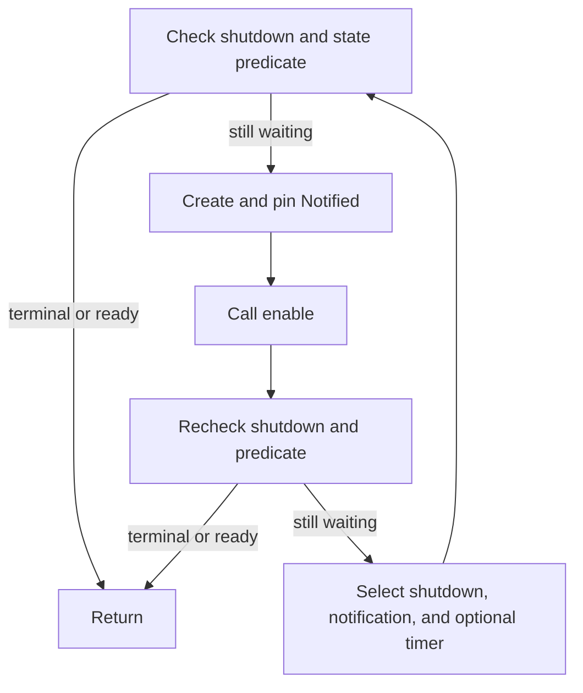

# Developer - 5 - Tokio Notify Usage Rules

For in-process asynchronous state waiting, the persistent state is authoritative and `tokio::sync::Notify` is only a wake-up hint. Fluxon code using `Notify` must follow one protocol:

1. Publish the state transition before sending the notification.
2. In the waiter, check the predicate, create and arm `Notified`, then check the predicate again.
3. Await notification, shutdown, and any diagnostic timer in one cancellable `tokio::select!`.
4. After a notification, loop and evaluate the persistent state again.

This protocol closes the lost-wakeup window without treating notifications as durable events.

## 1. Scope and Primitive Choice

These rules cover process-local Rust code where a task waits for a persistent predicate such as `ready`, `closed`, a generation change, or a sequence becoming current. They do not define inter-process delivery, durable queues, or distributed coordination.

Choose the primitive from the required contract:

| Required contract | Preferred Tokio primitive |
| --- | --- |
| A persistent predicate may have changed; coalescing is acceptable | State plus `Notify` using this page's protocol |
| Every item must be consumed once | `mpsc` |
| Active subscribers need each item and can handle lag | `broadcast` |
| Subscribers need the latest value or version | `watch` |
| Permits must be counted | `Semaphore` |
| Exactly one result is delivered once | `oneshot` |

`Notify` is not an event log. `notify_one()` can retain at most one permit, while repeated notifications may coalesce. `notify_waiters()` does not provide durable delivery to future waiters. If each occurrence matters, use a primitive that stores items or permits.

## 2. Required Invariants

| Invariant | Required rule | Failure prevented |
| --- | --- | --- |
| State is authoritative | A waiter returns only after reading the predicate or terminal state. | A notification being mistaken for proof that the condition is true. |
| State precedes wake-up | Update the atomic or lock-protected state, release the lock if present, then notify. | A waiter waking, observing stale state, and sleeping after the only notification. |
| The registration gap is closed | Check, create and arm `Notified`, then recheck before awaiting. | A transition occurring between the first check and the wait. |
| Waiting remains cancellable | Put shutdown and notification in the same `select!`. | Shutdown being unable to interrupt an earlier await. |
| Notifications may be spurious or coalesced | Always loop after a wake-up and evaluate state again. | Progress depending on one notification per transition. |
| Locks do not cross suspension points | Drop synchronous mutex guards before `.await`. | Deadlock and executor starvation. |

## 3. Canonical Protocol

The publisher commits the state first:

```rust
fn mark_ready(&self) {
    self.ready.store(true, Ordering::SeqCst);
    self.changed.notify_waiters();
}
```

For lock-protected state, mutate the value inside the lock, drop the guard, and then call `notify_one()` or `notify_waiters()`.

The waiter uses the fixed `check -> arm -> recheck -> wait` loop:

```rust
enum WaitOutcome {
    Ready,
    Closed,
}

async fn wait_until_ready(&self, shutdown: &ShutdownCtl) -> WaitOutcome {
    loop {
        if shutdown.is_closed() {
            return WaitOutcome::Closed;
        }
        if self.ready.load(Ordering::SeqCst) {
            return WaitOutcome::Ready;
        }

        let notified = self.changed.notified();
        tokio::pin!(notified);
        notified.as_mut().enable();

        if shutdown.is_closed() {
            return WaitOutcome::Closed;
        }
        if self.ready.load(Ordering::SeqCst) {
            return WaitOutcome::Ready;
        }

        tokio::select! {
            biased;
            _ = shutdown.wait_closed() => return WaitOutcome::Closed,
            _ = &mut notified => {}
        }
    }
}
```

`Notified::enable()` is the canonical non-awaiting way to arm a pinned notification future. It is especially important when `notify_one()` is used with multiple waiters. The second predicate check remains mandatory because it also covers a transition that completed before the future was armed.



The two checks and the armed waiter cover every transition window:

| Transition timing | How progress is observed |
| --- | --- |
| Before the first check | The first check sees the state. |
| Between the first check and arming | The second check sees the state. |
| Between arming and the second check | The second check sees the state; the notification may also be ready. |
| After the second check | The armed notification wakes the waiter. |
| At the same time as shutdown | The terminal branch wins when the documented contract uses biased terminal priority. |

## 4. Prohibited Patterns

### 4.1 Check Once and Await

```rust
if !self.is_ready() {
    self.changed.notified().await;
}
```

A transition can occur after `is_ready()` and before the notification future can observe it. A loop and the second state check are required.

### 4.2 Treat `select!` `else` as a Non-Blocking Default

```rust
tokio::select! {
    _ = &mut notified => {}
    else => {}
}
```

The `else` branch runs only when all branches are disabled. A pending notification branch is enabled, so this code waits. Use `Notified::enable()` to arm the future without awaiting it.

### 4.3 Await Notification Before Adding Cancellation

Do not perform an initial notification await and add shutdown only in a later `select!`. Notification, shutdown, timeout, and diagnostic wake-ups that must interrupt one another belong to the same wait set.

### 4.4 Notify Before Publishing State

Do not send the wake-up and then update the predicate. The publisher must make the new state visible first.

### 4.5 Use `Notify` as an Event Counter

Do not infer an event count from the number of wake-ups. Use `mpsc`, `broadcast`, or `Semaphore` when occurrences must be retained.

## 5. Shutdown Priority and Memory Visibility

- **Terminal priority**: when shutdown must win over normal progress, use `tokio::select! { biased; ... }` and place the terminal branch first. If normal progress may win, document that arbitration explicitly.
- **Diagnostic timers**: warning or telemetry timers may share the same `select!`; after they fire, the loop must recheck state. A diagnostic timeout must not silently become success.
- **Wake cardinality**: use `notify_waiters()` when one transition can satisfy or terminate every waiter. Use `notify_one()` only when exactly one waiter should compete to make progress.
- **Mutex state**: write while holding the mutex, release the guard, and then notify.
- **Atomic state**: use an ordering that establishes visibility between the publisher and waiter, such as release/acquire or `SeqCst`. `Relaxed` requires a separate, documented synchronization proof.
- **Repeated close**: terminal state should be idempotent. A waiter starting after close must return from the state check without requiring another notification.

## 6. Required Tests

Every reusable state-and-`Notify` wait helper must have bounded tests for the applicable rows below:

| Case | Required assertion |
| --- | --- |
| State is ready before waiting | Returns immediately. |
| Terminal state is set before waiting | Returns the terminal outcome immediately. |
| State changes between the first check and waiter arming | Completes without a lost wake-up; use a deterministic test hook or barrier. |
| State changes after waiter arming | The notification wakes the task. |
| Shutdown occurs while waiting | Returns within a short test deadline. |
| State change and shutdown become ready together | Follows the documented priority. |
| Multiple broadcast waiters | Every waiter observes the persistent state. |
| Spurious notification | Rechecks the predicate and continues waiting. |
| Repeated terminal signal | Remains idempotent and observable. |

Wrap async wait tests in `tokio::time::timeout` so a regression becomes a bounded failure instead of hanging the suite. Stress tests may supplement these cases, but they do not replace deterministic interleaving tests.

## 7. Review Checklist and Reference Implementations

Before approving code that uses `Notify`, verify:

- The predicate or terminal flag is persistent and has one authoritative storage location.
- The publisher updates state before notifying.
- The waiter follows `check -> arm -> recheck -> wait` inside a loop.
- Shutdown and notification are in one cancellable wait set.
- Simultaneous readiness has an explicit priority contract.
- No synchronous lock guard survives across `.await`.
- The required bounded interleaving tests exist.
- A channel, `watch`, or `Semaphore` was chosen instead if events or permits must be retained.

Current reference implementations and tests are:

- `fluxon_rs/fluxon_mq/src/consumer.rs`: `CommitSequencer::wait_turn`
- `fluxon_rs/fluxon_mq/src/shutdown.rs`: `ShutdownCtl::wait_closed`
- `fluxon_rs/fluxon_mq/src/consumer.rs` and `shutdown.rs`: their `#[cfg(test)]` modules

These paths are the current references. Other existing `Notify` usages are not implicitly validated; check them against this protocol when they are modified.

API semantics are defined by [`tokio::sync::Notify`](https://docs.rs/tokio/latest/tokio/sync/struct.Notify.html) and [`tokio::sync::futures::Notified`](https://docs.rs/tokio/latest/tokio/sync/futures/struct.Notified.html).
