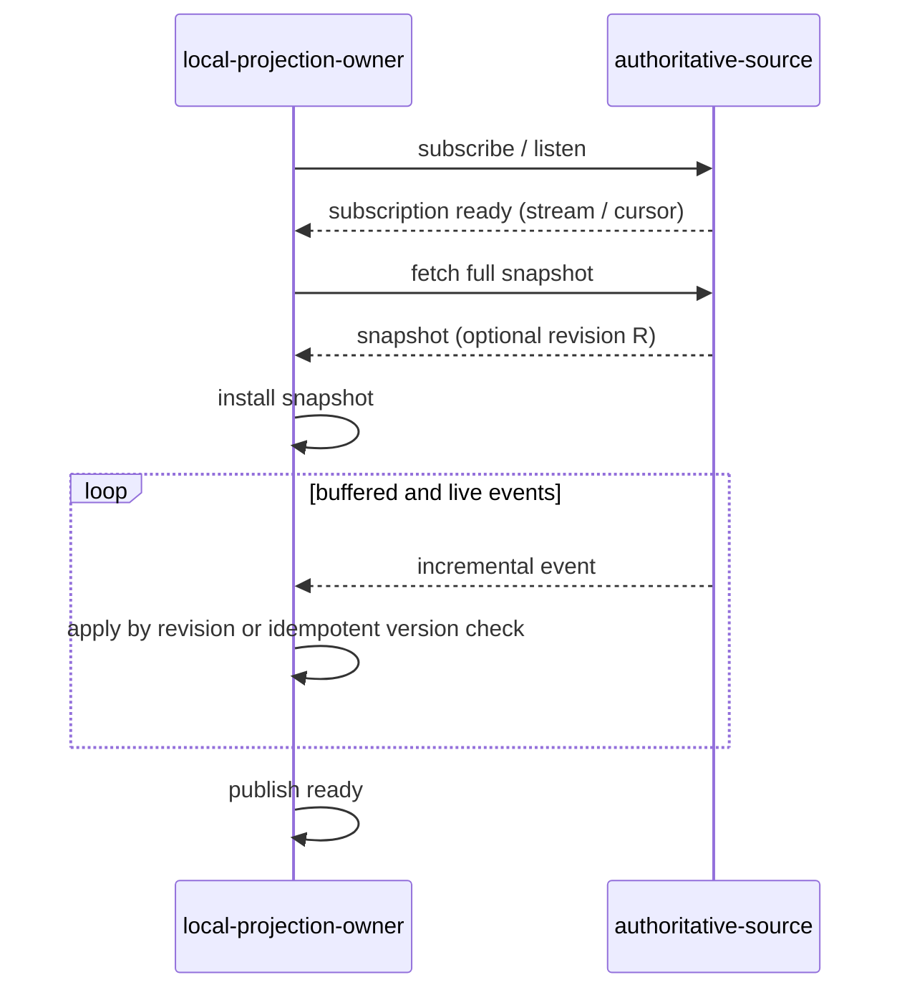

# Developer - 7 - Event Subscription and Full Snapshot Guidelines

When a component maintains a local projection from a full query plus incremental events, it must use one of exactly two orderings:

1. General ordering: `subscription/listener ready → fetch full snapshot → install snapshot → replay buffered incremental events → publish ready`.
2. Revision-coupled ordering: when the source provides an atomic revision contract such as etcd's, use `snapshot@R → watch@R+1`.

The general ordering is mandatory unless the revision-coupled contract is available. Every `listen` that is established and confirmed ready must be followed by one full synchronization. This requirement applies both at initial startup and on every recovery path that establishes a new `listen`.

Calling `listen()` or spawning a background task does not prove that the subscription is ready. A `listen` is established only after the source has acknowledged the subscription or the caller has obtained a usable stream handle or cursor.

## 1. Scope

This rule applies to local projections derived from remote authoritative state, including:

- Cluster membership and service discovery.
- Route tables, configuration mirrors, and resource indexes.
- Controller- or informer-style local caches.
- Local caches whose watch streams may need to be rebuilt.

The local projection owner owns snapshot installation, event application, and its ready state. The source remains the sole source of truth for business state.

## 2. General ordering: full synchronization after listen readiness

| Phase | Required action | Acceptance criterion |
| --- | --- | --- |
| Subscribe | Wait until the source confirms that the subscription exists. A fire-and-forget `spawn()` is not readiness proof. | Every state change after subscription readiness can enter this subscription stream. |
| Snapshot | Fetch the complete state once after the subscription is ready. | The snapshot covers the complete object set at the source-defined consistency point. |
| Install | Let the local projection owner atomically replace the baseline, or perform replacement through its sole writer. | Incremental processing cannot race with snapshot installation as unordered writers to the same projection. |
| Replay | Apply events buffered since subscription readiness. With revisions, accept only events after the snapshot revision. Without revisions, use generation or version checks, or make application idempotent. | Duplicate or stale events cannot roll back newer state from the snapshot. |
| Ready | Publish ready only after the snapshot is installed and the subscription backlog reaches a defined convergence point. | A ready reader cannot observe a partially installed snapshot. |

## 3. Failure and resynchronization

- **Subscription failure**: do not start the full fetch or publish ready. A retry starts by establishing a new subscription.
- **Snapshot failure**: the synchronization attempt is invalid. Close or discard the current subscription and retry the complete sequence so buffering cannot grow without a bound.
- **Invalid current event stream**: lag, disconnect, or a source-epoch change invalidates the old stream's completeness proof. Revoke ready and discard the old stream. Under the general ordering, perform a full synchronization after the new `listen` becomes ready. Under the revision-coupled ordering, repeat `snapshot@R → watch@R+1`.
- **Shutdown**: stop event admission, cancel or wake and join the event task, then release the stream and projection dependencies. No task may write the projection after successful close returns.

A fixed `sleep` may bound a timeout or aid debugging. It cannot prove subscription readiness, snapshot installation, or backlog convergence.

## 4. Second ordering: snapshot@R → watch@R+1

If the source explicitly provides an atomic revision contract, the following sequence is valid:

`snapshot at revision R → watch from revision R + 1`

This ordering requires all of the following:

- The snapshot returns a usable revision or cursor.
- The watch API guarantees delivery beginning with the first event after the requested revision.
- The source uses one ordered revision space for the snapshot and event log.
- Tests cover a concurrent update at the snapshot/watch boundary.

An ordinary `fetch_all()` followed by `listen()` without a starting revision does not satisfy this ordering's prerequisites.

## 5. Review and verification checklist

- [ ] Subscription readiness is an awaitable completion barrier; successful `spawn()` is not treated as successful subscription.
- [ ] Under the general ordering, every established `listen` is followed by one full snapshot fetch, both at initial startup and on every recovery path.
- [ ] The code implements only the two valid orderings; there is no third branch that attaches a new `listen` directly to an old snapshot.
- [ ] When `snapshot@R → watch@R+1` is used, the source and tests satisfy the complete revision contract.
- [ ] Snapshot installation and event application have one writer or a provable revision order.
- [ ] The final projection is correct when an event occurs before subscription, after subscription but before snapshot, and after snapshot.
- [ ] Duplicate and stale events cannot roll state backward.
- [ ] Ready is published only after both the snapshot and backlog converge.
- [ ] Tests wait for explicit state conditions instead of using a fixed `sleep` as synchronization.
