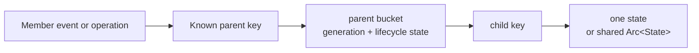

# Developer - 8 - Data Structure and Index Design Guidelines

When events, cleanup, and common queries already carry a parent key, organize runtime state as `parent -> child -> state`. Keep one authoritative copy of each fact. Add a secondary index only for a real independent query dimension, with explicit consistency ownership.

These rules apply to in-process concurrent maps, inflight operations, member-scoped resources, and lifecycle indexes. Database query planning, offline analytics, and explicit full snapshots are outside this scope.

## 1. Core Decisions

| Design question | Default | Requires additional justification |
| --- | --- | --- |
| An event carries `parent_id` and cleans one parent's state | `parent_id -> child_id -> state` | Flat authority map plus a parent reverse index |
| Multiple parents reference one state | Store the same `Arc<State>` in each bucket | Copy independently mutable state |
| One child completes or is deleted | Point lookup with known parent/child keys | Scan all parents or children |
| A reusable ID represents multiple process lifetimes | Store generation in the owning bucket | Propagate generation into unrelated public protocols |
| A secondary index is proposed | Define authority, update owner, rebuild, and tests first | Copy a relation only to simplify lookup code |



## 2. Choose Keys from the Natural Hierarchy

- Events such as MemberLeft, tenant cleanup, and connection close naturally carry a parent key. Keep the affected state in that parent's bucket.
- When a child key only needs to be unique within its parent, do not introduce a global flat map and duplicate a `parent -> child keys` index.
- When one operation involves multiple parents, each bucket may hold the same `Arc<State>`. A single transition owner still serializes the terminal transition.
- If the system must query globally by child key alone, first confirm that this query exists on a hot path. Then choose either a globally unique key or a justified secondary index.

## 3. Keep One Authoritative Store

The authoritative structure owns state creation, mutation, and final removal. A secondary index stores only the derived relation needed by another query dimension; it does not copy the complete state.

Before adding a secondary index, document:

1. Where authority lives.
2. Which owner updates authority and index atomically.
3. How missing or stale index entries are detected.
4. Whether the index is rebuildable and how it is rebuilt.
5. Which concurrency tests prevent one-sided visibility.

If insert, remove, and MemberLeft all require symmetric writes to two maps, the natural hierarchy usually has not been made authoritative yet.

## 4. Prohibit Full Scans on Hot Paths

The following paths must use keys already known to the caller:

- One member, tenant, or connection leaving.
- One operation completing, revoking, or timing out.
- One holder, replica, or cache key being deleted.
- Admission checking a parent lifecycle state.

Scanning is allowed only when the API explicitly carries full-set semantics:

- A user-requested full snapshot or list-all operation.
- Shutdown drain where the scanned collection is the module's owned cleanup set.
- Diagnostics, tests, or metrics with a documented cardinality bound.

Names and docs for these APIs should expose words such as `snapshot`, `all`, or `drain`, together with complexity and cardinality bounds. Never use a scan as a silent fallback for a missing index.

## 5. Atomic Publication and Concurrent Lifecycles

- Admission, the parent's `departed` check, and child insertion belong in one bucket critical section.
- When a parent leaves, retain a `departed` tombstone even if its bucket does not yet exist or has no children. Only an explicit rejoin event may clear it, so late admission cannot recreate an active bucket.
- Multi-parent operations acquire locks in stable key order. Arrival order must not determine lock order.
- Do not hold a DashMap guard, bucket lock, or other synchronous lock across `.await`.
- Terminal removal must be idempotent, with one transition owner deciding who receives final cleanup ownership.
- When removing a shared `Arc<State>` from multiple buckets, check pointer identity or an equivalent generation so an old operation cannot delete a new entry.

## 6. Use Generation to Prevent ABA

When a `member_id`, connection ID, or another key may be reused by a new process, keep generation in the owning bucket.

Recommended shape:

```text
parent_id
  -> ParentState {
       generation,
       departed,
       child_id -> Arc<State>
     }
```

Required invariants:

- Admission uses the generation observed by the owner. It compares generation, checks `departed`, and inserts the child in one critical section.
- A new generation cleans only that parent's old bucket; it does not scan other parents.
- A late terminal transition removes an entry only when both generation and state identity match.
- Extend generation only to the owner boundary that needs ABA protection. Do not modify unrelated RPCs, public events, or trust models.

## 7. Secondary Index Admission

Add a secondary index only when all of the following hold:

- An independent query dimension must be efficient.
- The authoritative natural hierarchy cannot directly serve that query.
- One update owner can maintain both structures atomically, or the system explicitly accepts and detects bounded inconsistency.
- A rebuild or consistency-validation mechanism exists.
- Tests cover insert, remove, generation changes, and cleanup races.

An O(1) `total()` counter may accompany the authoritative structure, but it serves metrics only and never drives lookup or cleanup. The same owner must update it, and underflow must fail fast.

## 8. Review Checklist

- Do common events already carry a usable parent key?
- Is a flat authority map being double-written with a `by_parent` reverse index?
- Does MemberLeft, timeout, or one-key deletion scan the full table?
- Is one state copied into multiple independently mutable locations?
- Is there a visibility window between admission checks and state publication?
- Do multi-bucket locks use stable ordering? Is any lock held across `.await`?
- Does a reusable ID need local generation? Has generation spread beyond that boundary?
- Does each secondary index define authority, update owner, rebuild, and consistency tests?
- Are allowed full scans visible in the API name, complexity, and cardinality boundary?
