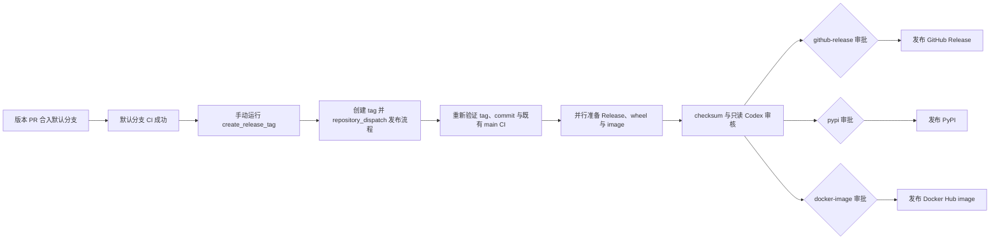

# 版本升级与发布准备

结论：release 只从 GitHub Actions 发起。`create_release_tag` 复用准确 commit 已成功的默认分支 CI，创建 tag 并 dispatch 发布流程；release 产物校验和只读 Codex 审核完成后，GitHub Release、PyPI 与 Docker Hub 三个发布 job 并行等待各自的人工审批。仓库不再为 tag 重跑同一套 CI，也不保留本地创建 tag 或第二个手动发布入口。本轮公开发布版本升级为 `0.2.2`。

长期有效的操作说明以中英文开发者发布文档为准：

- `fluxon_doc_cn/dev_doc/开发者 - 4 - 发布 Release.md`
- `fluxon_doc_en/dev_doc/Developer - 4 - Publish a Release.md`

## 目标流程



职责边界：

| 环节 | 负责内容 | 不负责内容 |
|---|---|---|
| 确定性门禁 | 版本与 tag 一致、release notes 存在、准确 commit 的默认分支 CI 成功、tag 指向该 commit、产物存在、checksum 通过 | 判断发布说明是否充分表达风险 |
| Codex 审核 | 对照流程文档、workflow、CI 元数据和产物清单生成审核报告 | 替代测试结果、修改代码或自动批准发布 |
| 人工审批 | 阅读证据与 Codex 报告，决定是否放行 GitHub Release / PyPI / Docker Hub | 绕过失败的确定性门禁 |

## 版本升级输入

确定目标版本后，在 PR 中同步更新 `fluxon_release/resolve_release_meta.py` 当前校验的公开版本来源：

- `fluxon_py/__init__.py`
- `examples/fluxon_quick_start/build_image.py`
- `fluxon_rs/setup.py`
- `fluxon_rs/Cargo.toml` 的 workspace 版本
- `fluxon_rs/Cargo.toml` 中每个 workspace member 对应的 `Cargo.toml`

公开发布版本与闭源通信 SDK 契约版本相互独立。本轮 `ClusterManagerNewArg` 的 bitcode payload 发生不兼容变化，因此 `sdk_version` 与 open-surface 契约同步升级为 `0.2.2`：`fluxon_rs/fluxon_commu_contract/src/lib.rs` 的 `FLUXON_COMMU_OPEN_SURFACE_VERSION` 是公开契约版本的唯一来源，release resolver 会把它与 SDK manifest 的 `required_open_surface_version` 对照，运行时再与 SDK 二进制导出的值对照。只有 open surface 本身发生不兼容变化时才升级该常量；升级前必须重建并验证 SDK 二进制，再更新随二进制生成的 manifest，不能只修改 JSON。

同时新增 `fluxon_release/release_notes/v<version>.md`，并同步更新 `README.md`、`README_CN.md` 和 Quick Start 公开示例。仓库中的 YAML 默认是示例，不为版本升级直接改写。

本地最小校验命令：

```bash
python3 fluxon_release/resolve_release_meta.py --git-ref refs/tags/v<version>
python3 -m unittest \
  setup_and_pack.tests.test_resolve_release_meta \
  setup_and_pack.tests.test_release_ci_provenance \
  setup_and_pack.tests.test_release_workflows
```

## GitHub 仓库配置

代码合入前由 repository admin 完成以下一次性配置：

1. 在 environment `OPENAI_API_KEY` 中提供 `OPENAI_API_KEY` 与 `OPENAI_BASE_URL`，供只读 Codex 审核使用。
2. 为 `github-release` environment 配置 required reviewers。仅在 workflow 中写 environment 名不会自动产生人工等待门禁。
3. 为 `pypi` environment 配置 required reviewers，并把 PyPI Trusted Publisher 绑定到 `manual-release.yml` 与该 environment。
4. 为 `docker-image` environment 配置 required reviewers、`DOCKERHUB_USERNAME` 和 `DOCKERHUB_TOKEN`。唯一发布目标是 `hanbaoaaa/fluxon_quick_start:<version>`。

`create_release_tag` 使用仓库自动提供的 `GITHUB_TOKEN` 创建 tag，并通过 `repository_dispatch` 把已验证的默认分支 CI run ID、commit SHA 和仓库推导出的 tag 交给发布流程；无需外部发布身份、PAT 或 release-tag secret。`manual-release.yml` 只接受 `github-actions[bot]` 发起的内部事件，并会从 GitHub API 重新验证 CI 的 workflow、event、branch、commit 和成功结论，再验证 tag 指向同一 commit。该文件名用于对齐已有 PyPI Trusted Publisher，workflow 本身不提供手动入口。

## 发布操作

1. 合入版本 PR，等待默认分支的 `ci_2_virt_node` 成功。
2. 在对应默认分支 CI 完成后的 14 天内，从 Actions 的默认分支运行零参数 `create_release_tag`。main CI 的受测 wheel 与 provenance artifact 都保留 14 天；workflow 会先确认二者存在且未过期，再从仓库版本元数据推导唯一的 `v<version>` tag，并读取对应 release notes。
3. 等待自动启动的 `publish_release` 重新验证既有默认分支 CI、tag 与 commit，然后打开 `Deterministic checks and Codex review` job，阅读 Codex 报告和证据边界。
4. 确认 release notes、wheel、Docker image、已知限制和目标版本后，分别批准 `github-release`、`pypi` 与 `docker-image` environment。三个发布 job 没有相互依赖，会并行执行。

不支持本地执行 `git tag` / `git push <tag>`，也不提供输入已有 tag 的第二个发布 workflow。临时失败通过 GitHub Actions 的 rerun 操作恢复；release 内容变化时使用新版本，不移动已有 tag，也不覆盖 PyPI 上已存在的版本。

## 基本可用性验证范围

当前门禁证明以下范围已完成：独立 provenance artifact 证明 `all_test.yml` 在默认分支的准确 commit 上以 push event 成功完成；tag 精确指向该受测 commit；该 CI 包含 `fluxon_commu` 与闭源 SDK 的运行时版本契约测试；release directory 与 Quick Start image 构建成功；顶层 release checksum 通过；PyPI wheel 契约与 `twine check` 通过。审批后，三个独立 job 分别发布 GitHub Release、同一份受测 wheel 和版本化 Docker image。

该范围不包含未列入 `all_test.yml` 的平台、真实生产集群部署、长期稳定性或外部依赖服务的生产配置。人工审批者应根据本次变更补充这些专项证据，不能从“基本可用”推导为全场景生产可用。
